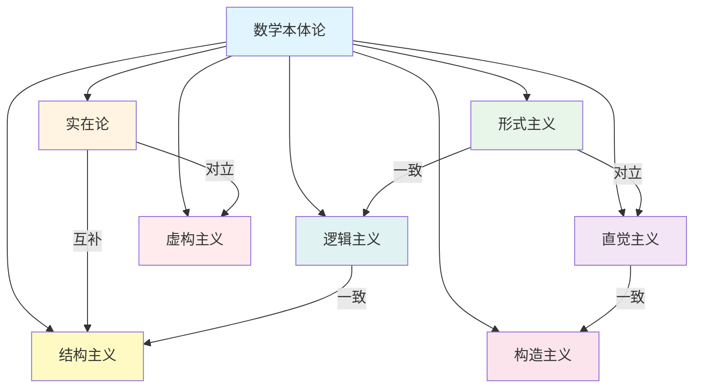
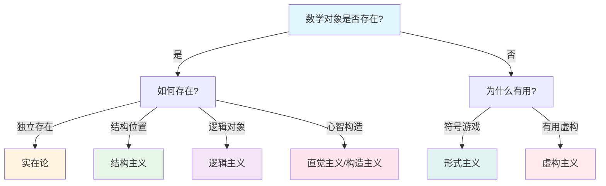

# 数学本体论总览

**创建日期**: 2025年11月30日
**研究领域**: 数学哲学 - 本体论

---

## 📑 目录

- [数学本体论总览](#数学本体论总览)
  - [📑 目录](#-目录)
  - [📋 一、数学本体论的核心问题](#-一数学本体论的核心问题)
    - [1.1 核心问题](#11-核心问题)
    - [1.2 相关问题](#12-相关问题)
  - [🎯 二、主要数学主义（7种）](#-二主要数学主义7种)
    - [2.1 实在论（Realism / Platonism）](#21-实在论realism--platonism)
    - [2.2 形式主义（Formalism）](#22-形式主义formalism)
    - [2.3 直觉主义（Intuitionism）](#23-直觉主义intuitionism)
    - [2.4 构造主义（Constructivism）](#24-构造主义constructivism)
    - [2.5 逻辑主义（Logicism）](#25-逻辑主义logicism)
    - [2.6 结构主义（Structuralism）](#26-结构主义structuralism)
    - [2.7 虚构主义（Fictionalism）](#27-虚构主义fictionalism)
  - [📊 三、各主义对比](#-三各主义对比)
  - [🔍 四、关键问题分析](#-四关键问题分析)
    - [4.1 本体论问题](#41-本体论问题)
    - [4.2 认识论问题](#42-认识论问题)
    - [4.3 方法论问题](#43-方法论问题)
  - [🔗 五、各主义之间的关系](#-五各主义之间的关系)
    - [5.1 对立关系](#51-对立关系)
    - [5.2 一致关系](#52-一致关系)
    - [5.3 互补关系](#53-互补关系)
    - [5.4 现代发展趋势](#54-现代发展趋势)
  - [🗺️ 六、数学本体论知识图谱](#️-六数学本体论知识图谱)
    - [6.1 各主义关系网络图](#61-各主义关系网络图)
    - [6.2 核心问题决策树](#62-核心问题决策树)
    - [6.3 各主义特征对比矩阵](#63-各主义特征对比矩阵)
  - [📚 七、参考文献](#-七参考文献)
    - [7.1 经典文献](#71-经典文献)
    - [7.2 现代文献](#72-现代文献)
    - [7.3 网络资源](#73-网络资源)

---

## 📋 一、数学本体论的核心问题

### 1.1 核心问题

**数学对象是否存在？如果存在，它们是什么？**

这是数学哲学中最基本的问题，不同的回答形成了不同的数学主义。数学本体论研究数学对象的存在性、本质和性质，是数学哲学的基础分支。这个问题不仅涉及数学本身，也涉及哲学的根本问题：什么是存在？抽象对象是否存在？

**问题的重要性**：

1. **基础性**：数学本体论问题是一切数学哲学讨论的起点
2. **根本性**：它涉及存在、真理、知识等根本哲学概念
3. **实践性**：对数学本体论的不同看法影响数学实践和教育

**问题的复杂性**：

- 数学对象（如数、集合、函数）似乎存在，但它们在哪里？
- 数学对象似乎具有客观性，但它们如何被认识？
- 数学对象似乎独立于物理世界，但它们与物理世界的关系是什么？

### 1.2 相关问题

1. **数学对象是抽象的还是具体的？**
   - 抽象对象：不在时空中，不参与因果过程
   - 具体对象：在时空中，可被感知
   - 数学对象明显是抽象的，但这带来认识论挑战

2. **数学对象是独立存在的还是依赖于人类思维的？**
   - 实在论认为数学对象独立存在
   - 反实在论认为数学对象依赖于人类思维或约定

3. **数学是发现还是发明？**
   - 发现论：数学对象已经存在，数学家发现它们
   - 发明论：数学家创造数学对象和理论
   - 这个问题与数学对象的存在性直接相关

4. **数学真理是客观的还是主观的？**
   - 客观性：数学真理独立于人类认知
   - 主观性：数学真理依赖于人类认知或约定
   - 与数学对象的存在性密切相关

---

## 🎯 二、主要数学主义（7种）

### 2.1 实在论（Realism / Platonism）

**核心观点**: 数学对象独立于人类思维而存在，数学真理是客观的。

实在论，也称为柏拉图主义，是数学哲学中最古老和最具影响力的观点之一。它认为数学对象（如数、集合、函数等）是抽象实体，它们独立于物理世界和人类思维而存在。数学真理是客观的，不依赖于人类是否知道或能够证明它们。

**实在论的历史背景**:

实在论可以追溯到古希腊哲学家柏拉图。柏拉图认为，存在一个"理念世界"，其中包含所有完美的、永恒的、不变的理念（Forms），包括数学理念。数学对象是这些理念的实例，它们独立于物理世界和人类思维而存在。

**实在论的现代发展**:

现代实在论（数学柏拉图主义）由哥德尔（Kurt Gödel）等数学家发展。哥德尔认为，数学对象是独立存在的抽象实体，我们可以通过数学直觉直接感知它们。这种观点在数学家中仍然有重要影响。

**关键特征的详细展开**:

- **数学对象是抽象实体**：
  - **不在时空中**：数学对象不在物理时空中，它们没有位置和时间
  - **不参与因果过程**：数学对象不参与物理因果过程，它们不能被物理过程影响
  - **但确实存在**：尽管是抽象的，数学对象确实存在，它们是真实的
  - **例子**：数字7是抽象实体，不在任何地方，但确实存在

- **数学真理独立于人类认知**：
  - **先于发现存在**：数学真理在人类发现之前就已经存在
  - **客观性**：数学真理是客观的，不依赖于人类是否知道它们
  - **普遍性**：数学真理对所有理性主体都相同
  - **例子**：费马大定理在费马提出之前就已经为真（如果为真）

- **数学是发现而非发明**：
  - **发现过程**：数学家发现已经存在的数学结构和真理
  - **不是创造**：数学家不是创造数学对象，而是发现它们
  - **探索过程**：数学研究是探索已存在的数学世界
  - **例子**：欧几里得发现了几何定理，而不是发明了它们

**实在论的优势**:

- **解释客观性**：能够解释数学真理的客观性
- **解释必然性**：能够解释数学真理的必然性
- **解释应用性**：能够解释数学在科学中的应用性
- **符合直觉**：符合许多数学家的直觉

**实在论的挑战**:

- **认识论问题**：如何认识不在时空中的抽象对象？
- **本体论承诺**：需要承诺抽象对象的存在
- **因果问题**：抽象对象如何与物理世界相互作用？
- **多重实现问题**：数学对象可能有不同的实现方式

**本体论承诺**：

- 承认大量抽象对象的存在
- 这些对象是永恒的、必然的
- 它们不在时空中，但有某种"存在"

**认识论挑战**：

- 如何认识不在时空中的抽象对象？
- 数学直觉如何工作？
- 抽象的、因果惰性的对象如何影响我们的认知？

**代表人物**: 哥德尔（数学直觉论证）、奎因（不可或缺性论证）、普特南（数学应用论证）

**主要论证**：

- **数学直觉论证**：我们能够直接"看到"某些数学真理
- **不可或缺性论证**：数学在科学中不可或缺，因此数学对象存在
- **数学应用论证**：数学在科学中的成功应用支持数学对象的实在性

**详细文档**: [02-实在论.md](./02-实在论.md)

### 2.2 形式主义（Formalism）

**核心观点**: 数学是符号游戏，数学对象没有独立存在。

形式主义认为数学本质上是对符号的操作，数学对象只是符号，没有独立的存在。数学真理就是形式系统中的定理，由形式规则决定。这种观点避免了本体论承诺，但面临如何解释数学应用的问题。

**关键特征**:

- **数学是形式系统的操作**：数学活动就是按照规则操作符号
- **数学对象是符号**：数、集合等都是符号，没有独立存在
- **数学真理是形式系统的定理**：真理由形式规则定义，与语义无关

**本体论承诺**：

- 不需要承诺抽象对象的存在
- 只承认符号和规则的存在
- 数学是人类的发明，而非发现

**优势**：

- 避免抽象对象的认识论问题
- 强调数学的形式特征
- 与计算科学联系紧密

**挑战**：

- 无法解释数学在科学中的应用
- 无法解释数学直觉
- 无法解释数学的美和意义

**代表人物**: 希尔伯特（希尔伯特计划）、冯·诺伊曼（形式系统观点）

**主要贡献**：

- **希尔伯特计划**：将数学完全形式化
- **元数学**：研究形式系统的理论
- **证明论**：研究形式系统的证明

**详细文档**: [03-形式主义.md](./03-形式主义.md)

### 2.3 直觉主义（Intuitionism）

**核心观点**: 数学是心智构造，存在依赖于构造。

直觉主义认为数学对象是人类心智的构造，存在意味着被构造。数学不是发现独立存在的对象，而是构造心智中的对象。这种观点导致对经典逻辑的拒绝，特别是排中律。

**关键特征**:

- **数学对象是心智构造**：数学对象是人类思维活动的产物
- **存在即被构造**：数学对象只有被构造时才存在
- **排中律不总是成立**：不接受对未构造对象的排中律应用

**本体论承诺**：

- 不承认独立存在的抽象对象
- 数学对象依赖于人类的心智活动
- 存在意味着被实际构造

**逻辑特征**：

- 拒绝经典逻辑的某些原则
- 特别是拒绝排中律的普遍应用
- 强调构造性证明

**优势**：

- 避免抽象对象的认识论问题
- 强调数学的构造性特征
- 与计算机科学联系紧密

**挑战**：

- 拒绝许多经典数学结果
- 逻辑系统更加复杂
- 与数学实践有较大差距

**代表人物**: 布劳威尔（直觉主义创始人）、海廷（直觉主义逻辑）

**主要贡献**：

- **构造性数学**：发展不需要排中律的数学
- **直觉主义逻辑**：建立构造性逻辑系统
- **BHK解释**：直觉主义逻辑的语义解释

**详细文档**: [04-直觉主义.md](./04-直觉主义.md)

### 2.4 构造主义（Constructivism）

**核心观点**: 数学对象必须能够被构造。

**关键特征**:

- 存在即被构造
- 强调算法和计算
- 与计算机科学联系紧密

**代表人物**: 毕晓普、马丁-洛夫

**详细文档**: [05-构造主义.md](./05-构造主义.md)

### 2.5 逻辑主义（Logicism）

**核心观点**: 数学可以还原为逻辑。

**关键特征**:

- 数学是逻辑的扩展
- 数学概念可以定义在逻辑中
- 数学定理可以证明在逻辑中

**代表人物**: 弗雷格、罗素、怀特海

**详细文档**: [06-逻辑主义.md](./06-逻辑主义.md)

### 2.6 结构主义（Structuralism）

**核心观点**: 数学对象是结构中的位置。

**关键特征**:

- 数学对象是结构中的位置
- 结构是首要的
- 对象是次要的

**代表人物**: 夏皮罗、雷斯尼克

**详细文档**: [07-结构主义.md](./07-结构主义.md)

### 2.7 虚构主义（Fictionalism）

**核心观点**: 数学对象是虚构的，但数学仍然有用。

**关键特征**:

- 数学对象不存在
- 数学陈述是虚构的
- 但数学仍然有用

**代表人物**: 菲尔德、亚布罗

**详细文档**: [08-虚构主义.md](./08-虚构主义.md)

---

## 📊 三、各主义对比

| 主义 | 数学对象存在性 | 数学真理性质 | 数学是发现/发明 | 主要优点 | 主要缺点 |
|------|---------------|-------------|----------------|---------|---------|
| 实在论 | 独立存在 | 客观真理 | 发现 | 解释客观性 | 认识论问题 |
| 形式主义 | 不存在（符号） | 形式定理 | 发明 | 避免本体论 | 无法解释应用 |
| 直觉主义 | 心智构造 | 构造性真理 | 构造 | 强调构造性 | 拒绝经典结果 |
| 构造主义 | 可构造 | 构造性真理 | 构造 | 强调可计算性 | 限制数学范围 |
| 逻辑主义 | 逻辑对象 | 逻辑真理 | 发现 | 统一数学逻辑 | 需要非逻辑公理 |
| 结构主义 | 结构位置 | 结构真理 | 发现 | 避免本体论 | 结构本体论不清 |
| 虚构主义 | 不存在 | 虚构真理 | 虚构 | 避免本体论 | 无法解释必然性 |

---

## 🔍 四、关键问题分析

### 4.1 本体论问题

**数学对象是否存在？**

这是数学本体论的核心问题。不同的数学主义给出了不同的回答：

- **实在论**：数学对象独立存在，是抽象实体
- **形式主义**：数学对象不存在，只是符号
- **直觉主义**：数学对象是心智构造
- **虚构主义**：数学对象是虚构的，不存在

**如果存在，它们是什么？**

如果承认数学对象存在，那么它们是什么？这个问题涉及：

- **抽象实体**：不在时空中，不参与因果过程
- **结构中的位置**：数学对象是结构中的位置
- **集合**：数学对象可以还原为集合
- **心智构造**：数学对象是人类思维的产物

**它们如何存在？**

数学对象的存在方式是什么？

- **必然存在**：如果存在，则必然存在
- **永恒存在**：不随时间变化
- **独立存在**：独立于物理世界和人类思维
- **依赖存在**：依赖于人类思维或约定

### 4.2 认识论问题

**我们如何认识数学对象？**

如果数学对象存在（且是抽象的），我们如何认识它们？这个问题是实在论面临的主要挑战：

- **数学直觉**：哥德尔认为存在特殊的数学直觉能力
- **科学推理**：奎因认为通过科学理论间接认识
- **逻辑推理**：通过逻辑推理认识
- **构造**：通过构造过程认识

**数学知识的来源是什么？**

- **直觉**：直接感知数学真理
- **推理**：通过逻辑推理获得
- **经验**：通过经验观察获得
- **约定**：通过约定获得

**数学知识的性质是什么？**

- **必然性**：数学知识是必然的
- **客观性**：数学知识是客观的
- **确定性**：数学知识是确定的
- **相对性**：数学知识可能是相对的

### 4.3 方法论问题

**数学研究的方法是什么？**

不同的本体论观点导致不同的研究方法：

- **公理化方法**：从公理出发推导定理
- **构造方法**：构造数学对象
- **形式化方法**：操作形式系统
- **直觉方法**：依赖数学直觉

**数学证明的作用是什么？**

- **验证真理**：证明数学真理
- **发现结构**：揭示数学结构
- **建立联系**：连接不同数学概念
- **形式化操作**：纯粹的形式操作

**数学发现的过程是什么？**

- **直觉引导**：数学直觉提供方向
- **推理验证**：逻辑推理验证猜想
- **实验探索**：计算实验探索可能性
- **类比启发**：类比启发新思路

---

## 🔗 五、各主义之间的关系

### 5.1 对立关系

不同的数学主义在某些核心问题上存在对立：

**实在论 vs 虚构主义**：

- **完全对立**：实在论认为数学对象存在，虚构主义认为不存在
- **核心分歧**：数学对象的实在性问题
- **无法调和**：两种观点在根本问题上不可调和

**实在论 vs 形式主义**：

- **部分对立**：在数学对象存在性上对立
- **共同点**：都承认数学的客观性和严格性
- **可调和**：在某些方面可以互补

**直觉主义 vs 形式主义**：

- **部分对立**：在数学真理的性质上对立
- **核心分歧**：直觉主义强调构造性，形式主义强调形式性
- **可调和**：可以结合使用

### 5.2 一致关系

某些数学主义在某些方面是一致的：

**直觉主义 vs 构造主义**：

- **密切相关**：都强调构造性
- **共同点**：都拒绝非构造性证明
- **区别**：构造主义更强调可计算性

**逻辑主义 vs 形式主义**：

- **部分一致**：都强调形式化和严格性
- **共同点**：都使用形式系统
- **区别**：逻辑主义强调逻辑基础，形式主义强调符号操作

**结构主义 vs 形式主义**：

- **部分一致**：都避免直接的本体论承诺
- **共同点**：都强调结构而非对象
- **区别**：结构主义强调结构实在，形式主义强调符号操作

### 5.3 互补关系

某些数学主义可以互补：

**实在论 vs 结构主义**：

- **可以互补**：实在论提供本体论基础，结构主义提供结构视角
- **结合优势**：既承认数学对象的实在性，又强调结构的重要性
- **现代发展**：结构实在论结合了两者的优势

**形式主义 vs 构造主义**：

- **可以互补**：形式主义提供形式框架，构造主义提供构造方法
- **结合优势**：既保持严格性，又强调可计算性
- **应用价值**：在计算数学中特别有用

**逻辑主义 vs 结构主义**：

- **可以互补**：逻辑主义提供逻辑基础，结构主义提供结构视角
- **结合优势**：既保持逻辑严格性，又强调结构关系
- **理论价值**：在数学基础研究中很有价值

### 5.4 现代发展趋势

**多元主义**：

现代数学哲学倾向于多元主义，认为不同的数学主义适用于不同的场景：

- **不同场景**：不同的数学问题可能需要不同的哲学立场
- **灵活应用**：根据具体情况选择合适的观点
- **综合理解**：综合多种观点可能更全面

**多元主义的详细分析**:

现代数学哲学的一个重要趋势是多元主义，它认为不同的数学主义不是相互排斥的，而是可以在不同场景中灵活应用的。

**多元主义的核心观点**:

- **场景依赖性**: 不同的数学问题可能需要不同的哲学立场
  - 例如：基础数学问题可能需要实在论
  - 计算数学问题可能需要构造主义
  - 应用数学问题可能需要形式主义
  - 这种场景依赖性反映了数学的多样性

- **灵活应用**: 根据具体情况选择合适的观点
  - 例如：在研究数学基础时，可能采用实在论
  - 在开发算法时，可能采用构造主义
  - 在形式化证明时，可能采用形式主义
  - 这种灵活性允许根据具体情况选择最合适的观点

- **综合理解**: 综合多种观点可能更全面
  - 例如：结合实在论和结构主义可能提供更全面的理解
  - 结合形式主义和构造主义可能提供更实用的方法
  - 这种综合可能产生新的见解
  - 例如：结构实在论结合了实在论和结构主义的优势

**多元主义的优势**:

- **适应性**: 多元主义允许根据具体情况选择最合适的观点
- **全面性**: 综合多种观点可以提供更全面的理解
- **灵活性**: 多元主义提供了灵活的方法论框架
- **包容性**: 多元主义包容不同的哲学立场

**多元主义的挑战**:

- **一致性**: 如何保证不同观点之间的一致性？
- **选择标准**: 如何选择最合适的观点？
- **整合方法**: 如何整合不同的观点？
- **理论基础**: 多元主义的理论基础是什么？

**融合趋势**：

某些数学主义正在融合：

- **结构实在论**：结合实在论和结构主义
- **新逻辑主义**：结合逻辑主义和结构主义
- **自然主义**：结合实在论和科学方法

**融合趋势的详细分析**:

现代数学哲学的另一个重要趋势是不同数学主义的融合，这种融合试图结合不同主义的优势。

**1. 结构实在论**:

- **结合优势**: 结合实在论和结构主义的优势
  - 实在论提供本体论基础：承认数学对象的实在性
  - 结构主义提供结构视角：强调结构的重要性
  - 这种结合既承认数学对象的实在性，又强调结构的重要性

- **核心观点**: 数学对象是实在的，但它们的本质是结构性的
  - 数学对象是独立存在的抽象实体
  - 但它们的本质由结构关系决定
  - 这种观点既避免了实在论的本体论问题，又避免了结构主义的认识论问题

- **应用价值**: 在数学基础研究和应用研究中都有价值
  - 在基础研究中，提供统一的本体论框架
  - 在应用研究中，强调结构的实用性
  - 例如：在代数几何中，既承认对象的实在性，又强调结构关系

**2. 新逻辑主义**:

- **结合优势**: 结合逻辑主义和结构主义的优势
  - 逻辑主义提供逻辑基础：强调逻辑的重要性
  - 结构主义提供结构视角：强调结构的重要性
  - 这种结合既保持逻辑严格性，又强调结构关系

- **核心观点**: 数学可以还原为逻辑，但逻辑本身是结构性的
  - 数学对象可以通过逻辑定义
  - 但逻辑本身是结构性的
  - 这种观点既保持了逻辑主义的还原目标，又接受了结构主义的结构视角

- **技术发展**: 新逻辑主义在技术上取得了重要进展
  - 弗雷格算术：从休谟原理推导算术
  - 抽象原则：通过抽象原则定义数学对象
  - 例如：使用抽象原则定义自然数，避免了罗素悖论

**3. 自然主义**:

- **结合优势**: 结合实在论和科学方法
  - 实在论提供本体论基础：承认数学对象的实在性
  - 科学方法提供方法论：使用科学方法研究数学
  - 这种结合既承认数学对象的实在性，又使用科学方法研究数学

- **核心观点**: 数学是自然科学的一部分，应该用科学方法研究
  - 数学对象是实在的，就像物理对象一样
  - 应该用科学方法研究数学，就像研究物理一样
  - 这种观点将数学纳入自然科学的框架

- **应用价值**: 在数学应用研究中特别有价值
  - 强调数学与科学的联系
  - 使用科学方法验证数学理论
  - 例如：通过科学应用验证数学理论的有效性

**融合趋势的意义**:

- **理论发展**: 融合趋势推动了数学哲学的理论发展
- **实践应用**: 融合趋势提供了更实用的方法论
- **统一理解**: 融合趋势有助于统一理解不同的数学主义
- **未来方向**: 融合趋势可能代表数学哲学的未来方向

---

## 🗺️ 六、数学本体论知识图谱

### 6.1 各主义关系网络图



### 6.2 核心问题决策树



### 6.3 各主义特征对比矩阵

| 主义 | 对象存在 | 真理性质 | 发现/发明 | 严格性 | 应用性 | 构造性 |
|------|---------|---------|----------|--------|--------|--------|
| **实在论** | ✅ 独立存在 | 客观真理 | 发现 | ⭐⭐⭐⭐⭐ | ⭐⭐⭐⭐⭐ | ⭐⭐ |
| **形式主义** | ❌ 不存在 | 形式定理 | 发明 | ⭐⭐⭐⭐⭐ | ⭐⭐ | ⭐⭐⭐ |
| **直觉主义** | ⚠️ 心智构造 | 构造真理 | 构造 | ⭐⭐⭐⭐ | ⭐⭐⭐ | ⭐⭐⭐⭐⭐ |
| **构造主义** | ⚠️ 可构造 | 构造真理 | 构造 | ⭐⭐⭐⭐ | ⭐⭐⭐⭐ | ⭐⭐⭐⭐⭐ |
| **逻辑主义** | ✅ 逻辑对象 | 逻辑真理 | 发现 | ⭐⭐⭐⭐⭐ | ⭐⭐⭐ | ⭐⭐ |
| **结构主义** | ⚠️ 结构位置 | 结构真理 | 发现 | ⭐⭐⭐⭐ | ⭐⭐⭐⭐ | ⭐⭐⭐ |
| **虚构主义** | ❌ 不存在 | 虚构真理 | 虚构 | ⭐⭐⭐ | ⭐⭐⭐⭐⭐ | ⭐⭐ |

**图例**：

- ✅ 肯定
- ❌ 否定
- ⚠️ 特殊理解
- ⭐⭐⭐⭐⭐ 极高
- ⭐⭐⭐⭐ 高
- ⭐⭐⭐ 中
- ⭐⭐ 低

---

## 📚 七、参考文献

### 7.1 经典文献

- **Benacerraf, P., & Putnam, H. (1983). Philosophy of Mathematics: Selected Readings.**
  - 数学哲学经典文选，收录了各主要数学主义的重要文献

- **Shapiro, S. (2000). Thinking About Mathematics: The Philosophy of Mathematics.**
  - 全面介绍数学哲学的主要问题和观点，包括各数学主义的详细分析

- **Maddy, P. (1990). Realism in Mathematics.**
  - 数学实在论的现代发展，提出了自然主义的数学实在论

- **Quine, W. V. O. (1951). Two Dogmas of Empiricism.**
  - 挑战了分析-综合的区分，提出了整体论观点

- **Gödel, K. (1947). What is Cantor's Continuum Problem?**
  - 提出了数学直觉的概念，支持数学实在论

### 7.2 现代文献

- **Linnebo, Ø. (2018). Thin Objects: An Abstractionist Account.**
  - 抽象主义数学本体论，提出了"薄对象"的概念

- **Shapiro, S. (1997). Philosophy of Mathematics: Structure and Ontology.**
  - 结构主义数学本体论的详细阐述

- **Field, H. (1980). Science Without Numbers.**
  - 数学虚构主义的经典著作

- **Hellman, G. (1989). Mathematics Without Numbers.**
  - 模态结构主义的发展

### 7.3 网络资源

- **Wikipedia: Philosophy of Mathematics**
  - 数学哲学的基础介绍，包括各主要数学主义

- **Stanford Encyclopedia of Philosophy: Philosophy of Mathematics**
  - 深入的学术性介绍，包括各数学主义的详细分析

- **Internet Encyclopedia of Philosophy: Philosophy of Mathematics**
  - 可读性强的介绍，适合初学者

- **PhilPapers: Philosophy of Mathematics**
  - 最新的数学哲学研究论文

---

## 🗺️ 十、数学本体论知识图谱

### 10.1 本体论问题决策树

```text
            [数学本体论核心问题]
                  │
    ┌─────────────┴─────────────┐
    │                           │
[对象存在?]                [如何存在?]
    │                           │
┌───┴───┐                  ┌───┴───┐
│       │                  │       │
是      否                 独立    依赖
│       │                  │       │
▼       ▼                  ▼       ▼
实在论  形式主义          抽象    结构
结构主义 虚构主义         独立    位置
逻辑主义                  永恒    关系
```

### 10.2 各主义关系网络图

```text
                [数学本体论流派]
                     │
        ┌────────────┼────────────┐
        │            │            │
    [存在派]      [构造派]      [工具派]
        │            │            │
    ┌───┴───┐    ┌───┴───┐    ┌───┴───┐
    │       │    │       │    │       │
  实在论  结构主义  直觉主义  构造主义  形式主义  虚构主义
  逻辑主义           │       │       │       │
    │            ┌───┴───┐   │       │       │
    │            │       │   │       │       │
    └────────────┼───────┴───┴───────┴───────┘
                 │
          [多元主义趋势]
```

### 10.3 本体论立场对比矩阵

| 立场 | 对象存在 | 存在方式 | 独立性 | 必然性 | 代表 |
|------|---------|---------|--------|--------|------|
| **实在论** | ✅ 是 | 抽象独立 | 完全独立 | 必然 | Gödel |
| **结构主义** | ⚠️ 是 | 结构位置 | 结构依赖 | 结构必然 | Shapiro |
| **逻辑主义** | ✅ 是 | 逻辑对象 | 逻辑独立 | 逻辑必然 | Frege |
| **直觉主义** | ⚠️ 是 | 心智构造 | 构造依赖 | 构造必然 | Brouwer |
| **构造主义** | ⚠️ 是 | 可构造 | 构造依赖 | 构造必然 | Bishop |
| **形式主义** | ❌ 否 | 符号 | 无 | 约定 | Hilbert |
| **虚构主义** | ❌ 否 | 虚构 | 无 | 工具 | Field |

---

**数学本体论的实践意义**:

数学本体论不仅具有理论意义，也具有重要的实践意义。

**1. 对数学研究的指导**:

- **研究视角**: 不同本体论立场提供不同研究视角
  - 实在论强调数学对象的独立存在
  - 结构主义强调结构的重要性
  - 例如：根据本体论立场选择研究视角

- **方法选择**: 本体论立场影响方法选择
  - 实在论支持经典数学方法
  - 构造主义支持构造性方法
  - 例如：根据本体论立场选择研究方法

- **问题理解**: 本体论立场影响问题理解
  - 不同立场对同一问题有不同理解
  - 影响问题的解决方式
  - 例如：实在论和构造主义对存在性问题的不同理解

**2. 对数学教学的指导**:

- **概念解释**: 本体论立场影响概念解释
  - 不同立场对数学概念有不同解释
  - 影响教学方式
  - 例如：实在论和形式主义对数的不同解释

- **方法教学**: 本体论立场影响方法教学
  - 不同立场强调不同方法
  - 影响教学方法
  - 例如：构造主义强调构造性方法的教学

- **哲学教育**: 本体论立场影响哲学教育
  - 帮助学生理解数学的本质
  - 培养数学哲学思维
  - 例如：通过本体论教育理解数学本质

**3. 对数学应用的指导**:

- **应用理解**: 本体论立场影响应用理解
  - 不同立场对数学应用有不同理解
  - 影响应用方式
  - 例如：实在论和工具主义对应用的不同理解

- **应用方法**: 本体论立场影响应用方法
  - 不同立场支持不同应用方法
  - 影响实际应用
  - 例如：构造主义支持可计算的应用方法

- **应用价值**: 本体论立场影响应用价值
  - 不同立场对应用价值有不同认识
  - 影响应用评估
  - 例如：实在论和虚构主义对应用价值的不同认识

**文档状态**: ✅ 已完成深化
**最后更新**: 2025年12月1日
