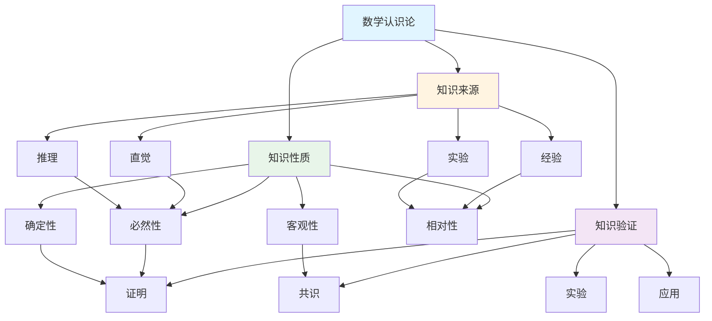

# 数学认识论总览

**创建日期**: 2025年11月30日
**研究领域**: 数学哲学 - 认识论

---

## 📑 目录

- [数学认识论总览](#数学认识论总览)
  - [📑 目录](#-目录)
  - [📋 一、数学认识论的核心问题](#-一数学认识论的核心问题)
    - [1.1 核心问题](#11-核心问题)
    - [1.2 相关问题](#12-相关问题)
  - [🎯 二、数学知识来源](#-二数学知识来源)
    - [2.1 直觉](#21-直觉)
    - [2.2 经验](#22-经验)
    - [2.3 推理](#23-推理)
    - [2.4 实验](#24-实验)
  - [📚 三、数学知识性质](#-三数学知识性质)
    - [3.1 必然性](#31-必然性)
    - [3.2 客观性](#32-客观性)
    - [3.3 相对性](#33-相对性)
    - [3.4 确定性](#34-确定性)
  - [🔍 四、数学知识验证](#-四数学知识验证)
    - [4.1 证明](#41-证明)
    - [4.2 实验](#42-实验)
    - [4.3 应用](#43-应用)
    - [4.4 共识](#44-共识)
  - [🔗 五、数学认识论的核心关系](#-五数学认识论的核心关系)
    - [5.1 知识来源与性质的关系](#51-知识来源与性质的关系)
    - [5.2 知识性质与验证的关系](#52-知识性质与验证的关系)
    - [5.3 知识来源与验证的关系](#53-知识来源与验证的关系)
  - [📖 六、相关文献](#-六相关文献)
    - [6.1 经典文献](#61-经典文献)
    - [6.2 现代文献](#62-现代文献)
    - [6.3 网络资源](#63-网络资源)
  - [🗺️ 七、数学认识论知识图谱](#️-七数学认识论知识图谱)
    - [7.1 数学认识论核心概念关系图](#71-数学认识论核心概念关系图)
    - [7.2 数学认识论流派对比矩阵](#72-数学认识论流派对比矩阵)

---

## 📋 一、数学认识论的核心问题

### 1.1 核心问题

**我们如何获得数学知识？数学知识的性质是什么？**

这是数学认识论的基本问题，涉及数学知识的来源、性质、验证等方面。数学认识论是数学哲学的重要分支，研究数学知识的认识论特征，包括我们如何获得数学知识、数学知识的来源和性质、如何验证数学知识等问题。

**问题的核心性**：

数学认识论问题与数学本体论问题密切相关。如果数学对象是独立存在的抽象实体（实在论），那么我们就需要解释如何认识这些不在时空中的对象。如果数学对象是人类思维的产物（反实在论），那么数学知识的性质就不同了。

**问题的重要性**：

1. **基础性**：认识论问题是数学哲学的核心问题之一
2. **实践性**：理解数学知识的获得有助于数学教学和研究
3. **理论性**：认识论问题与本体论、方法论问题密切相关

### 1.2 相关问题

1. **数学知识来自哪里？**
   - **直觉**：数学直觉是认识数学对象的方式吗？
   - **经验**：经验在数学知识的获得中起什么作用？
   - **推理**：逻辑推理是数学知识的唯一来源吗？
   - **实验**：计算实验能否提供数学知识？

2. **数学知识的性质是什么？**
   - **必然性**：数学知识是否必然为真？
   - **客观性**：数学知识是否客观存在，不依赖于个人观点？
   - **相对性**：数学知识是否相对于理论、文化或历史？
   - **确定性**：数学知识是否具有确定性？

3. **如何验证数学知识？**
   - **证明**：数学证明是否是验证数学知识的唯一方式？
   - **实验**：计算实验能否验证数学知识？
   - **应用**：数学应用能否验证数学知识？
   - **共识**：数学共同体的共识是否是验证标准？

---

## 🎯 二、数学知识来源

### 2.1 直觉

**数学直觉的作用**:

数学直觉是数学认识论中的核心概念。许多数学家认为，数学直觉是获得数学知识的重要方式，它使我们能够"看到"某些数学真理。数学直觉在数学发现、数学理解和数学验证中都发挥着重要作用。

**数学直觉的详细展开**:

- **数学直觉是认识数学对象的方式**：
  - **哥德尔的数学直觉理论**：
    - 哥德尔认为存在特殊的数学直觉能力
    - 这种能力使我们能够直接感知数学对象和数学真理
    - 类似于视觉感知，但针对抽象对象
    - 数学直觉是获得数学知识的可靠方式

  - **直觉的直接性**：
    - 数学直觉提供直接的知识，不需要推理
    - 类似于"看到"几何图形的性质
    - 直觉使我们能够"看到"数学真理
    - 例如：直觉告诉我们2+2=4是显然的

  - **直觉的可靠性**：
    - 数学直觉通常是可靠的
    - 直觉提供的知识通常是正确的
    - 直觉是数学知识的重要来源
    - 例如：几何直觉通常是可靠的

- **数学直觉在数学发现中重要**：
  - **引导研究方向**：
    - 数学直觉引导数学家选择研究方向
    - 直觉帮助识别重要问题
    - 直觉判断问题的难度和重要性
    - 例如：直觉告诉数学家某个问题值得研究

  - **提供洞察和灵感**：
    - 数学直觉提供深刻的洞察
    - 直觉帮助发现数学规律
    - 直觉提供证明的思路
    - 例如：黎曼通过直觉洞察到黎曼猜想的深刻性

  - **重要发现的来源**：
    - 许多重要数学发现来自数学直觉
    - 直觉是数学创造力的重要来源
    - 直觉帮助建立不同领域之间的联系
    - 例如：通过直觉发现不同数学分支之间的深刻联系

**数学直觉的类型**:

数学直觉有多种类型，每种类型在数学认识中发挥不同作用：

- **空间直觉**：
  - 对空间结构和关系的直觉
  - 在几何和拓扑中特别重要
  - 例如：对高维空间的直觉理解

- **数量直觉**：
  - 对数量和关系的直觉
  - 在数论和分析中特别重要
  - 例如：对素数分布的直觉

- **结构直觉**：
  - 对数学结构的直觉
  - 在代数和拓扑中特别重要
  - 例如：对群结构的直觉理解

- **模式直觉**：
  - 对数学模式的直觉
  - 在组合和数论中特别重要
  - 例如：对数列模式的直觉识别

**数学直觉的认知基础**:

数学直觉基于人类的认知能力：

- **模式识别能力**：
  - 人类具有强大的模式识别能力
  - 能够快速识别数学中的模式
  - 例如：快速识别数列的规律

- **空间想象能力**：
  - 人类具有空间想象能力
  - 能够理解空间结构和关系
  - 例如：理解三维空间的结构

- **抽象思维能力**：
  - 人类具有抽象思维能力
  - 能够理解抽象数学概念
  - 例如：理解群的一般结构

**数学直觉的局限性**:

虽然数学直觉非常有用，但也有其局限性：

- **可能错误**：
  - 数学直觉可能产生错误的判断
  - 直觉可能误导研究方向
  - 例如：某些看似正确的直觉可能实际上是错误的

- **个体差异**：
  - 不同数学家的直觉可能不同
  - 直觉可能受个人经验影响
  - 例如：不同数学家对同一问题可能有不同的直觉

- **难以形式化**：
  - 数学直觉难以形式化表达
  - 难以用逻辑语言描述
  - 例如：某些深刻的数学直觉难以用语言表达

**数学直觉与严格性的关系**:

数学研究需要在直觉和严格性之间保持平衡：

- **直觉引导，严格验证**：
  - 使用直觉提供方向和灵感
  - 使用严格证明验证直觉
  - 例如：通过直觉发现定理，通过严格证明验证

- **严格指导，直觉补充**：
  - 使用严格方法建立理论
  - 使用直觉补充和启发
  - 例如：在严格证明中使用直觉理解

- **数学直觉提供数学知识的直接来源**：
  - 不依赖于推理过程
  - 提供直接的认识
  - 是数学知识的重要来源

**数学直觉的局限性**:

- **数学直觉可能错误**：
  - 直觉有时会误导
  - 需要严格的证明验证
  - 不能完全依赖直觉

- **不同数学家的直觉可能不同**：
  - 直觉具有主观性
  - 不同人可能有不同的直觉
  - 需要客观的验证标准

- **数学直觉难以形式化**：
  - 直觉过程难以描述
  - 无法形式化定义
  - 难以在计算机中实现

**直觉与证明的关系**：

- 直觉提供方向和洞察
- 证明提供严格验证
- 两者相互补充，缺一不可

### 2.2 经验

**经验在数学中的作用**:

经验在数学中虽然不像在经验科学中那样直接，但仍然发挥着重要作用。数学中的经验包括对具体实例的观察、对模式的识别、对实验结果的归纳等。

- **经验在数学发现中作用**：
  - 通过观察具体实例发现数学模式
  - 通过实验探索数学可能性
  - 通过归纳提出数学猜想
  - 例如：通过观察斐波那契数列的实例发现其性质

- **经验在数学验证中作用**：
  - 通过计算验证数学猜想
  - 通过数值实验检验数学定理
  - 通过具体例子检验抽象理论
  - 例如：通过计算验证哥德巴赫猜想的数值实例

- **数学与经验科学的关系**：
  - 数学在经验科学中的应用
  - 经验科学的数学化
  - 数学与物理学的密切联系
  - 例如：微积分起源于物理学问题

**经验的局限性**:

- **经验不能提供数学的必然性**：
  - 有限的实例不能保证一般性
  - 归纳推理不具有必然性
  - 需要严格的证明来确保必然性

- **经验不能提供数学的确定性**：
  - 经验只能提供概率性的证据
  - 无法保证在所有情况下都成立
  - 确定性需要通过逻辑推理获得

- **经验在数学中的作用有限**：
  - 经验只能作为启发和验证工具
  - 不能替代严格的数学证明
  - 数学的严格性需要逻辑推理

**经验与证明的关系**：

- 经验提供直觉和启发
- 证明提供严格性和确定性
- 两者结合才能获得完整的数学知识

### 2.3 推理

**逻辑推理在数学中的作用**:

逻辑推理是数学知识获得的核心方式，它提供数学知识的严格性和确定性。数学推理通过严格的逻辑规则，从前提推导出结论，保证结论的必然性。

- **逻辑推理是数学证明的基础**：
  - 所有数学证明都依赖于逻辑推理
  - 推理规则确保证明的正确性
  - 推理是连接前提和结论的桥梁
  - 例如：从欧几里得公设推导几何定理

- **逻辑推理提供数学知识的严格性**：
  - 推理过程是明确的、可验证的
  - 推理规则是客观的、标准的
  - 推理结果具有必然性
  - 这是数学区别于其他知识领域的关键

- **逻辑推理是数学知识的主要来源**：
  - 大多数数学知识通过推理获得
  - 推理将已知知识扩展为新知识
  - 推理确保知识之间的逻辑联系
  - 例如：从群公理推导群的性质

**推理的局限性**:

- **推理需要前提**：
  - 推理必须从某些前提开始
  - 前提本身的真理性需要其他方式保证
  - 最终需要不证自明的公理或直觉

- **推理可能错误**：
  - 推理过程可能出错
  - 前提可能错误
  - 需要仔细检查和验证

- **非形式推理的作用**：
  - 数学中大量使用非形式推理
  - 省略步骤、直观跳跃等
  - 形式化需要将非形式推理形式化

**推理的类型**：

- **演绎推理**：从一般到特殊，具有必然性
- **归纳推理**：从特殊到一般，不具有必然性
- **类比推理**：通过类比得出结论，需要验证
- **反证推理**：通过假设否定推导矛盾

### 2.4 实验

**计算实验在数学中的作用**:

随着计算机技术的发展，计算实验在数学中的作用越来越重要。计算实验包括数值计算、符号计算、可视化、模拟等，它们为数学研究和验证提供了强大的工具。

- **计算实验在数学发现中作用**：
  - 通过数值计算发现数学模式和规律
  - 通过可视化获得数学直觉和洞察
  - 通过大规模计算验证数学猜想
  - 例如：通过计算发现新的数学常数

- **计算实验在数学验证中作用**：
  - 通过数值方法验证数学定理
  - 通过符号计算验证代数等式
  - 通过计算检查证明的正确性
  - 例如：通过计算验证四色定理

- **数值实验、可视化实验等**：
  - **数值实验**：使用数值方法进行计算
  - **可视化实验**：将数学对象可视化
  - **符号实验**：使用符号计算系统
  - **模拟实验**：模拟数学过程

**实验的局限性**:

- **实验不能提供数学的必然性**：
  - 有限的实验结果不能保证一般性
  - 数值误差可能影响结果
  - 需要严格的证明来保证必然性

- **实验不能提供数学的确定性**：
  - 实验结果具有近似性
  - 无法覆盖所有可能情况
  - 确定性需要逻辑证明

- **实验在数学中的作用有限**：
  - 实验只能作为辅助工具
  - 不能替代严格的数学证明
  - 数学的严格性要求逻辑证明

**实验与证明的关系**：

- 实验提供直觉和验证
- 证明提供严格性和确定性
- 两者结合使数学研究更加高效

---

## 📚 三、数学知识性质

### 3.1 必然性

**数学知识的必然性**:

数学知识的一个重要特征是必然性。数学真理是必然真理，一旦为真就不可能为假。这是数学区别于经验科学的重要特征。

- **数学知识是必然的，不可能为假**：
  - 数学定理在所有可能世界中都为真
  - 数学真理不依赖于偶然事实
  - 数学知识的真理性是绝对的
  - 例如：2 + 2 = 4 在所有可能世界中都为真

- **数学真理是必然真理**：
  - 数学真理不依赖于经验观察
  - 数学真理不依赖于特定条件
  - 数学真理具有逻辑必然性
  - 例如：勾股定理在所有欧几里得空间中成立

- **数学推理具有必然性**：
  - 从真前提必然得出真结论
  - 推理过程保证结论的必然性
  - 逻辑推理规则确保必然性
  - 例如：从真前提通过有效推理必然得到真结论

**必然性的来源**:

- **来自逻辑的必然性**：
  - 逻辑真理是必然真理
  - 逻辑推理规则保证必然性
  - 逻辑结构本身具有必然性
  - 例如：排中律、矛盾律等逻辑规律

- **来自定义的必然性**：
  - 定义关系是必然关系
  - 通过定义建立的概念关系
  - 定义确立的真理是必然的
  - 例如：三角形定义为三边构成的图形

- **来自公理的必然性**：
  - 公理确立的基本真理
  - 从公理推导的定理具有必然性
  - 公理系统内部的必然关系
  - 例如：从欧几里得公设推导的几何定理

**必然性与可能性的关系**：

- 必然真理在所有可能世界中为真
- 不可能为真的命题在所有可能世界中为假
- 可能为真的命题在至少一个可能世界中为真
- 数学真理属于必然真理范畴

### 3.2 客观性

**数学知识的客观性**:

数学知识是客观的，不依赖于个人观点、文化背景或历史条件。数学真理是客观真理，不同数学家对同一问题的答案应该一致。

- **数学知识是客观的，不依赖于个人观点**：
  - 数学真理不因个人观点而改变
  - 数学知识是公共的、可共享的
  - 数学结果的正确性有客观标准
  - 例如：勾股定理的证明不依赖于谁证明它

- **数学真理是客观真理**：
  - 数学真理独立于人类认知
  - 数学真理具有普遍有效性
  - 数学真理不因文化差异而改变
  - 例如：2 + 2 = 4 在所有文化中都成立

- **不同数学家对同一问题的答案应该一致**：
  - 数学问题的答案具有唯一性
  - 不同方法的证明应得出相同结论
  - 数学共同体的共识基于客观标准
  - 例如：费马大定理的证明得到数学共同体的一致认可

**客观性的基础**:

- **数学对象的客观存在**：
  - 数学对象独立于人类思维存在（实在论观点）
  - 或数学对象具有客观结构（结构主义观点）
  - 数学对象不因个人意志而改变
  - 这是数学客观性的本体论基础

- **数学真理的客观性**：
  - 数学陈述的真假由客观事实决定
  - 数学真理不依赖于人类是否知道
  - 数学真理具有独立的存在性
  - 这是数学客观性的语义基础

- **数学推理的客观性**：
  - 逻辑推理规则是客观的
  - 推理过程的正确性有客观标准
  - 不同人应用相同规则应得相同结果
  - 这是数学客观性的方法基础

**客观性与主观性的关系**：

- 数学知识的客观性不否认发现过程的主观性
- 数学直觉可能是主观的，但数学真理是客观的
- 数学发现可能受主观因素影响，但数学验证是客观的

### 3.3 相对性

**数学知识的相对性**:

- 数学知识可能相对于理论
- 数学知识可能相对于文化
- 数学知识可能相对于历史

**相对性的范围**:

- 某些数学知识是相对的
- 某些数学知识是绝对的
- 相对性与绝对性的关系

### 3.4 确定性

**数学知识的确定性**:

- 数学知识是确定的
- 数学真理是确定的
- 数学推理是确定的

**确定性的基础**:

- 数学证明的严格性
- 数学推理的必然性
- 数学真理的客观性

---

## 🔍 四、数学知识验证

### 4.1 证明

**数学证明的作用**:

- 数学证明是验证数学知识的主要方式
- 数学证明提供数学知识的严格性
- 数学证明是数学知识的基础

**证明的局限性**:

- 证明需要前提
- 证明可能错误
- 某些数学知识难以证明

### 4.2 实验

**计算实验的作用**:

- 计算实验可以验证数学知识
- 数值实验可以验证数学知识
- 可视化实验可以验证数学知识

**实验的局限性**:

- 实验不能提供数学的必然性

**数学认识论的综合应用**:

数学认识论需要综合应用，以实现最佳效果。

**1. 认识论要素的综合**:

- **维度整合**: 整合不同认识论维度
  - 来源维度与性质维度整合
  - 验证维度与应用维度整合
  - 例如：整合数学认识论的多种维度

- **方法整合**: 整合不同认识论方法
  - 分析方法与综合方法整合
  - 理论方法与实证方法整合
  - 例如：整合数学认识论的多种方法

- **价值整合**: 整合不同认识论价值
  - 理论价值与实践价值整合
  - 认识价值与应用价值整合
  - 例如：整合数学认识论的多种价值

**2. 认识论的应用策略**:

- **研究策略**: 在研究中的应用
  - 根据研究选择认识论方法
  - 整合不同方法
  - 例如：在研究中选择合适的认识论方法

- **教学策略**: 在教学中的应用
  - 向学生介绍认识论方法
  - 帮助学生理解认识论
  - 例如：在教学中使用认识论方法

- **应用策略**: 在实践中的应用
  - 根据应用选择认识论方法
  - 应用认识论指导实践
  - 例如：在应用中选择合适的认识论方法

**3. 认识论的价值实现**:

- **理论价值**: 实现理论价值
  - 通过认识论理解数学知识
  - 建立认识论框架
  - 例如：通过认识论实现理论价值

- **实践价值**: 实现实践价值
  - 通过认识论指导实践
  - 提高实践效果
  - 例如：通过认识论实现实践价值

- **教育价值**: 实现教育价值
  - 通过认识论进行教育
  - 培养认识论思维
  - 例如：通过认识论实现教育价值

**数学认识论的综合应用**:

数学认识论需要综合应用，以实现最佳效果。

**1. 认识论要素的综合**:

- **来源整合**: 整合不同来源
  - 直觉与推理整合
  - 经验与实验整合
  - 例如：整合数学知识的多种来源

- **性质整合**: 整合不同性质
  - 必然性与相对性整合
  - 客观性与确定性整合
  - 例如：整合数学知识的多种性质

- **验证整合**: 整合不同验证
  - 证明与实验整合
  - 应用与共识整合
  - 例如：整合数学知识的多种验证方法

**2. 认识论方法的协调**:

- **方法选择**: 选择合适方法
  - 根据问题选择
  - 根据目标选择
  - 例如：根据认识论需要选择方法

- **方法组合**: 组合不同方法
  - 多种方法同时使用
  - 发挥各自优势
  - 例如：组合不同认识论方法

- **方法优化**: 优化方法使用
  - 改进方法应用
  - 提高方法效果
  - 例如：优化认识论方法的使用

**3. 认识论的价值实现**:

- **理论价值**: 实现理论价值
  - 通过认识论理解数学本质
  - 建立理论框架
  - 例如：通过认识论实现理论价值

- **实践价值**: 实现实践价值
  - 通过认识论指导实践
  - 提高实践效果
  - 例如：通过认识论实现实践价值

- **教育价值**: 实现教育价值
  - 通过认识论进行教育
  - 培养数学思维
  - 例如：通过认识论实现教育价值

**数学认识论的综合理解**:

数学认识论涉及数学知识的来源、性质、验证等多个方面，需要综合理解。

**1. 知识来源的综合**:

- **多种来源**: 数学知识来自多种来源
  - 直觉、经验、推理、实验
  - 不同来源相互补充
  - 例如：直觉提供灵感，推理提供严格性

- **来源关系**: 不同来源之间存在关系
  - 直觉引导推理
  - 实验验证推理
  - 例如：直觉引导研究方向，推理提供严格证明

- **来源平衡**: 需要平衡不同来源
  - 不过度依赖单一来源
  - 综合使用多种来源
  - 例如：平衡直觉和推理的使用

**2. 知识性质的综合**:

- **性质关系**: 不同性质之间存在关系
  - 必然性和客观性相关
  - 相对性和确定性相关
  - 例如：必然性支持客观性

- **性质平衡**: 需要平衡不同性质
  - 理解必然性和相对性的平衡
  - 理解客观性和确定性的平衡
  - 例如：在框架内必然，在框架间相对

- **性质应用**: 根据情况应用不同性质
  - 在基础研究中强调必然性
  - 在应用研究中考虑相对性
  - 例如：根据研究类型强调不同性质

**3. 知识验证的综合**:

- **多种方法**: 使用多种方法验证知识
  - 证明、实验、应用、共识
  - 不同方法相互补充
  - 例如：证明提供严格性，实验提供证据

- **方法选择**: 根据情况选择方法
  - 理论研究以证明为主
  - 应用研究以应用为主
  - 例如：根据研究类型选择验证方法

- **方法整合**: 整合不同验证方法
  - 综合使用多种方法
  - 相互验证提高可靠性
  - 例如：综合使用证明和实验验证
- 实验不能提供数学的确定性
- 实验在数学中的作用有限

### 4.3 应用

**数学应用的作用**:

- 数学应用可以验证数学知识
- 数学在科学中的成功应用支持数学知识
- 数学应用是数学知识的重要验证

**应用的局限性**:

- 应用不能提供数学的必然性
- 应用不能提供数学的确定性
- 应用在数学中的作用有限

### 4.4 共识

**数学共同体的共识**:

- 数学共同体的共识是数学知识的重要验证
- 数学共同体的共识形成数学知识
- 数学共同体的共识是数学知识的标准

**共识的局限性**:

- 共识可能错误
- 共识可能变化
- 共识在数学中的作用有限

---

## 🔗 五、数学认识论的核心关系

### 5.1 知识来源与性质的关系

**来源决定性质**：

数学知识的来源在很大程度上决定了其性质。例如：

- **直觉来源**：如果数学知识主要来自直觉，那么它可能具有主观性和相对性
- **推理来源**：如果数学知识主要来自推理，那么它可能具有客观性和必然性
- **经验来源**：如果数学知识来自经验，那么它可能具有不确定性和相对性
- **实验来源**：如果数学知识来自实验，那么它可能具有近似性和有限性

**性质对来源的反馈**：

数学知识的性质也会影响我们如何获得它：

- **必然性要求严格推理**：如果数学知识是必然的，那么它需要通过严格的逻辑推理获得
- **客观性要求独立验证**：如果数学知识是客观的，那么它应该可以通过独立的方式验证
- **确定性要求严格证明**：如果数学知识是确定的，那么它需要通过严格的证明确立

### 5.2 知识性质与验证的关系

**性质影响验证方式**：

数学知识的性质决定了应该采用什么样的验证方式：

- **必然性知识需要逻辑证明**：必然的数学知识应该通过严格的逻辑证明来验证
- **客观性知识需要独立验证**：客观的数学知识应该可以通过不同的方式独立验证
- **确定性知识需要严格证明**：确定的数学知识应该通过严格的证明来验证

**验证方式影响性质理解**：

不同的验证方式可能揭示数学知识的不同性质：

- **证明验证必然性**：严格的证明可以揭示数学知识的必然性
- **实验验证可能性**：实验可以验证数学知识的可能性，但不能证明必然性
- **应用验证有效性**：应用可以验证数学知识的有效性，但不能证明必然性
- **共识确认客观性**：数学共同体的共识可以确认数学知识的客观性

### 5.3 知识来源与验证的关系

**来源决定验证策略**：

数学知识的来源影响应该采用什么样的验证策略：

- **直觉来源需要推理验证**：来自直觉的数学知识应该通过严格的推理来验证
- **经验来源需要实验验证**：来自经验的数学知识应该通过实验来验证
- **推理来源需要逻辑验证**：来自推理的数学知识应该通过逻辑来验证
- **实验来源需要理论验证**：来自实验的数学知识应该通过理论来验证

**验证确认来源**：

验证过程可以帮助我们确认数学知识的来源：

- **证明确认推理来源**：严格的证明可以确认数学知识来自推理
- **实验确认经验来源**：实验可以确认数学知识来自经验
- **应用确认直觉来源**：应用可以确认数学知识来自直觉洞察

---

## 📖 六、相关文献

### 6.1 经典文献

- **Gödel, K. (1947). "What is Cantor's Continuum Problem?"**：讨论数学真理的认识论问题，提出了数学直觉的概念，认为存在特殊的数学直觉能力，使我们能够直接感知数学真理。

- **Quine, W. V. O. (1951). "Two Dogmas of Empiricism"**：挑战了分析-综合的区分，提出整体论观点，认为数学和经验科学在认识论上并没有根本区别，都是我们整体信念网络的一部分。

- **Putnam, H. (1975). "Mathematics, Matter and Method"**：探讨了数学的认识论地位，认为数学知识具有客观性，但也不完全独立于经验，数学和科学是相互依赖的。

- **Kant, I. (1781). "Critique of Pure Reason"**：提出了数学知识的先验综合性质，认为数学知识是必然的、客观的，但依赖于我们认知结构的先验形式（时间和空间）。

- **Mill, J. S. (1843). "A System of Logic"**：提出了经验主义的数学认识论，认为数学知识来自经验归纳，数学真理是高度概括的经验真理。

### 6.2 现代文献

- **Maddy, P. (1990). "Realism in Mathematics"**：发展了自然主义的数学认识论，认为数学知识可以通过科学方法获得，数学认识论应该遵循自然科学的认识论原则。

- **Shapiro, S. (2000). "Thinking About Mathematics"**：全面介绍了数学哲学的主要问题，包括数学认识论的核心问题，比较了不同的认识论观点。

- **Linnebo, Ø. (2018). "Thin Objects: An Abstractionist Account"**：提出了抽象主义认识论，认为数学知识可以通过抽象原则获得，数学对象是"薄"的抽象对象。

- **Field, H. (1980). "Science Without Numbers"**：提出了数学虚构主义认识论，认为数学知识是虚构的，但在科学中是有用的工具。

- **Avigad, J. (2020). "Mathematics and Computation"**：探讨了计算在数学认识论中的作用，认为计算和实验是数学知识的重要来源和验证方式。

### 6.3 网络资源

- **Wikipedia: Epistemology of Mathematics**：提供了数学认识论的概述，包括主要问题和不同观点，是了解数学认识论的入门资源。

- **Stanford Encyclopedia of Philosophy: Epistemology of Mathematics**：提供了深入的学术性介绍，包括各种认识论观点的详细分析和现代发展。

- **Internet Encyclopedia of Philosophy: Epistemology of Mathematics**：提供了可读性强的介绍，适合初学者了解数学认识论的基本问题。

- **PhilPapers: Epistemology of Mathematics**：提供了最新的数学认识论研究论文，可以了解该领域的最新发展。

---

## 🗺️ 七、数学认识论知识图谱

### 7.1 数学认识论核心概念关系图

### 7.2 数学认识论流派对比矩阵

| 流派 | 知识来源 | 知识性质 | 验证方式 | 代表 |
|------|---------|---------|---------|------|
| **柏拉图主义** | 理性直觉 | 必然、客观 | 逻辑证明 | 哥德尔 |
| **经验主义** | 经验归纳 | 相对、不确定 | 实验验证 | 密尔 |
| **形式主义** | 符号操作 | 约定、客观 | 形式证明 | 希尔伯特 |
| **直觉主义** | 构造直觉 | 构造、主观 | 构造证明 | 布劳威尔 |
| **自然主义** | 科学方法 | 客观、相对 | 科学验证 | 奎因、马迪 |
| **虚构主义** | 虚构假设 | 虚构、工具 | 应用验证 | 菲尔德 |

---

**数学认识论的综合理解**:

数学认识论需要综合理解，以实现最佳效果。

**1. 认识论要素的综合**:

- **来源整合**: 整合不同知识来源
  - 直觉与推理整合
  - 经验与实验整合
  - 例如：整合数学知识的多种来源

- **性质整合**: 整合不同知识性质
  - 必然性与相对性整合
  - 客观性与确定性整合
  - 例如：整合数学知识的多种性质

- **验证整合**: 整合不同验证方法
  - 证明与实验整合
  - 应用与共识整合
  - 例如：整合数学知识的多种验证方法

**2. 认识论的应用策略**:

- **研究策略**: 在研究中的应用
  - 根据研究选择认识论方法
  - 整合不同认识论观点
  - 例如：在研究中选择合适的认识论方法

- **教学策略**: 在教学中的应用
  - 向学生介绍认识论观点
  - 帮助学生理解认识论
  - 例如：在教学中使用认识论分析

- **应用策略**: 在实践中的应用
  - 根据应用选择认识论方法
  - 应用认识论指导实践
  - 例如：在应用中选择合适的认识论方法

**3. 认识论的价值实现**:

- **理论价值**: 实现理论价值
  - 通过认识论理解数学知识
  - 建立认识论框架
  - 例如：通过认识论实现理论价值

- **实践价值**: 实现实践价值
  - 通过认识论指导实践
  - 提高实践效果
  - 例如：通过认识论实现实践价值

- **教育价值**: 实现教育价值
  - 通过认识论进行教育
  - 培养认识论思维
  - 例如：通过认识论实现教育价值

**文档状态**: ✅ 已完成深化
**最后更新**: 2025年12月1日
