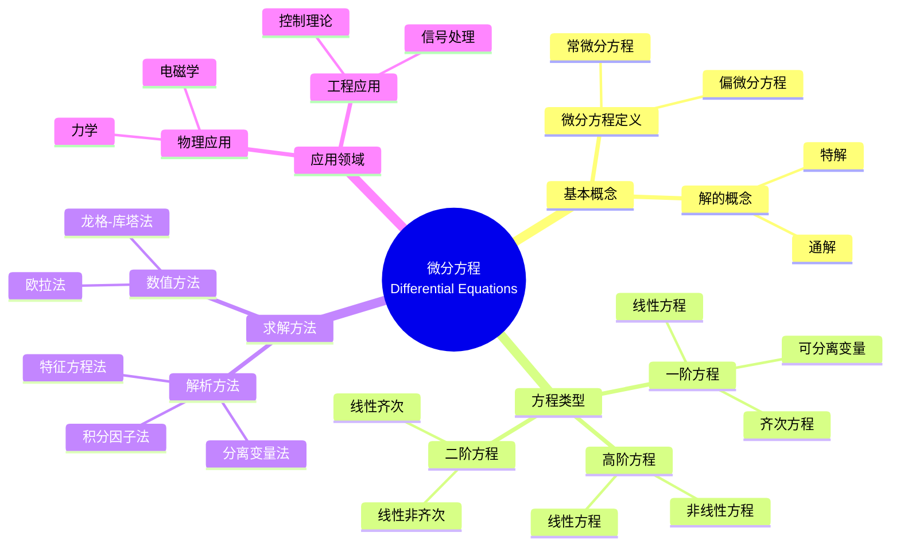

# 概念映射和Vee图"微分方程"

Concept Mapping and Vee Diagramming "Differential Equations"

**创建日期**: 2025年12月11日
**创建日期**: December 11, 2025
**研究领域**: 数学教育 - 概念映射 - 大学数学 - 微分方程
**研究领域**: Mathematics Education - Concept Mapping - University Mathematics - Differential Equations
**主题编号**: CM.04.03
**章节**: Chapter 14
**作者**: Karoline Afamasaga-Fuata'i
**优先级**: P0（最高优先级）⭐⭐⭐⭐⭐

---

## 📑 目录 / Table of Contents

- [概念映射和Vee图"微分方程"](#概念映射和vee图微分方程)
  - [📑 目录 / Table of Contents](#-目录--table-of-contents)
  - [📋 一、概述 / Overview](#-一概述--overview)
    - [1.1 研究目标 / Research Objectives](#11-研究目标--research-objectives)
    - [1.2 案例研究对象 / Case Study Subject](#12-案例研究对象--case-study-subject)
    - [1.3 核心内容 / Core Content](#13-核心内容--core-content)
  - [🔬 二、研究方法 / Research Methodology](#-二研究方法--research-methodology)
    - [2.1 研究设计 / Research Design](#21-研究设计--research-design)
    - [2.2 数据收集 / Data Collection](#22-数据收集--data-collection)
  - [📐 三、微分方程数学内容深度分析 / Deep Analysis of Differential Equations Mathematical Content](#-三微分方程数学内容深度分析--deep-analysis-of-differential-equations-mathematical-content)
    - [3.1 微分方程的数学定义与本质 / Mathematical Definition and Essence of Differential Equations](#31-微分方程的数学定义与本质--mathematical-definition-and-essence-of-differential-equations)
      - [3.1.1 微分方程的基本定义 / Basic Definition of Differential Equations](#311-微分方程的基本定义--basic-definition-of-differential-equations)
      - [3.1.2 微分方程的基本概念 / Basic Concepts of Differential Equations](#312-微分方程的基本概念--basic-concepts-of-differential-equations)
    - [3.2 微分方程的分类 / Classification of Differential Equations](#32-微分方程的分类--classification-of-differential-equations)
      - [3.2.1 按阶数分类 / Classification by Order](#321-按阶数分类--classification-by-order)
      - [3.2.2 按线性性分类 / Classification by Linearity](#322-按线性性分类--classification-by-linearity)
      - [3.2.3 按系数分类 / Classification by Coefficients](#323-按系数分类--classification-by-coefficients)
    - [3.3 微分方程的求解方法 / Solution Methods for Differential Equations](#33-微分方程的求解方法--solution-methods-for-differential-equations)
      - [3.3.1 一阶微分方程的求解方法 / Solution Methods for First-Order Differential Equations](#331-一阶微分方程的求解方法--solution-methods-for-first-order-differential-equations)
      - [3.3.2 二阶线性微分方程的求解方法 / Solution Methods for Second-Order Linear Differential Equations](#332-二阶线性微分方程的求解方法--solution-methods-for-second-order-linear-differential-equations)
    - [3.4 微分方程的应用 / Applications of Differential Equations](#34-微分方程的应用--applications-of-differential-equations)
      - [3.4.1 物理应用 / Physical Applications](#341-物理应用--physical-applications)
      - [3.4.2 生物应用 / Biological Applications](#342-生物应用--biological-applications)
      - [3.4.3 经济应用 / Economic Applications](#343-经济应用--economic-applications)
    - [3.5 微分方程与其他数学概念的关联 / Relationships Between Differential Equations and Other Mathematical Concepts](#35-微分方程与其他数学概念的关联--relationships-between-differential-equations-and-other-mathematical-concepts)
      - [3.5.1 微分方程与微积分 / Differential Equations and Calculus](#351-微分方程与微积分--differential-equations-and-calculus)
      - [3.5.2 微分方程与线性代数 / Differential Equations and Linear Algebra](#352-微分方程与线性代数--differential-equations-and-linear-algebra)
      - [3.5.3 微分方程与数值方法 / Differential Equations and Numerical Methods](#353-微分方程与数值方法--differential-equations-and-numerical-methods)
    - [3.6 微分方程数学内容典型例题 / Typical Examples of Differential Equations Mathematical Content](#36-微分方程数学内容典型例题--typical-examples-of-differential-equations-mathematical-content)
      - [3.6.1 一阶微分方程求解 / Solving First-Order Differential Equations](#361-一阶微分方程求解--solving-first-order-differential-equations)
      - [3.6.2 二阶线性齐次微分方程求解 / Solving Second-Order Linear Homogeneous Differential Equations](#362-二阶线性齐次微分方程求解--solving-second-order-linear-homogeneous-differential-equations)
      - [3.6.3 微分方程在实际问题中的应用 / Application of Differential Equations in Real-World Problems](#363-微分方程在实际问题中的应用--application-of-differential-equations-in-real-world-problems)
    - [3.7 跨主题关联小结 / Cross-Topic Association Summary](#37-跨主题关联小结--cross-topic-association-summary)
      - [3.7.1 微分方程与线性代数的矩阵方法关联 / Association Between Differential Equations and Linear Algebra Matrix Methods](#371-微分方程与线性代数的矩阵方法关联--association-between-differential-equations-and-linear-algebra-matrix-methods)
      - [3.7.2 对数与指数函数在增长模型中的联动 / Linkage Between Logarithms and Exponential Functions in Growth Models](#372-对数与指数函数在增长模型中的联动--linkage-between-logarithms-and-exponential-functions-in-growth-models)
  - [📚 四、微分方程概念映射演进 / Evolution of Differential Equations Concept Maps](#-四微分方程概念映射演进--evolution-of-differential-equations-concept-maps)
    - [3.1 初始概念映射 / Initial Concept Map](#31-初始概念映射--initial-concept-map)
    - [3.2 发展概念映射 / Developing Concept Map](#32-发展概念映射--developing-concept-map)
    - [3.3 成熟概念映射 / Mature Concept Map](#33-成熟概念映射--mature-concept-map)
    - [3.4 演进特点 / Evolution Characteristics](#34-演进特点--evolution-characteristics)
  - [📊 四、Vee图问题分析 / Vee Diagram Problem Analysis](#-四vee图问题分析--vee-diagram-problem-analysis)
    - [4.1 Vee图结构 / Vee Diagram Structure](#41-vee图结构--vee-diagram-structure)
    - [4.2 Vee图演进分析 / Vee Diagram Evolution Analysis](#42-vee图演进分析--vee-diagram-evolution-analysis)
    - [4.2.1 Vee图具体应用案例 / Specific Vee Diagram Application Cases](#421-vee图具体应用案例--specific-vee-diagram-application-cases)
  - [💡 五、理解演进分析 / Understanding Evolution Analysis](#-五理解演进分析--understanding-evolution-analysis)
    - [5.1 理解发展阶段 / Understanding Development Stages](#51-理解发展阶段--understanding-development-stages)
    - [5.2 社会批判的作用 / Role of Social Critique](#52-社会批判的作用--role-of-social-critique)
    - [5.3 理解演进特点 / Understanding Evolution Characteristics](#53-理解演进特点--understanding-evolution-characteristics)
  - [📈 六、思维表征方式 / Representation Methods](#-六思维表征方式--representation-methods)
    - [6.1 微分方程概念映射思维导图 / Differential Equations Concept Map Mind Map](#61-微分方程概念映射思维导图--differential-equations-concept-map-mind-map)
    - [6.2 理解演进证明树 / Understanding Evolution Proof Tree](#62-理解演进证明树--understanding-evolution-proof-tree)
  - [📚 七、参考文献 / References](#-七参考文献--references)
    - [7.1 主要参考文献 / Main References](#71-主要参考文献--main-references)
    - [7.2 相关研究 / Related Research](#72-相关研究--related-research)

---

## 📋 一、概述 / Overview

### 1.1 研究目标 / Research Objectives

**主要目标 / Main Objectives**:

- 展示学生使用概念映射说明和沟通对微分方程理解的发展
- Demonstrating a student's use of concept maps to illustrate and communicate evolving understanding of Differential Equations
- 展示理解演进过程
- Demonstrating the understanding evolution process
- 展示社会批判的作用
- Demonstrating the role of social critique

### 1.2 案例研究对象 / Case Study Subject

**研究对象 / Subject**:

- **学生**: 萨摩亚大学数学学生
  Samoan university mathematics student
- **主题**: 微分方程
  Topic: Differential Equations
- **时间**: 一个学期
  Over a semester
- **过程**: 研究、修订、社会批判
  Process: Research, revision, social critique

### 1.3 核心内容 / Core Content

**主要内容 / Main Content**:

1. **概念映射演进** - 微分方程概念映射的发展
   Concept Map Evolution - Development of Differential Equations concept maps
2. **Vee图应用** - 微分方程问题的Vee图
   Vee Diagram Application - Vee diagrams of differential equation problems
3. **理解演进** - 理解的发展过程
   Understanding Evolution - Development process of understanding
4. **社会批判** - 社会批判对理解发展的影响
   Social Critique - Impact of social critique on understanding development

---

## 🔬 二、研究方法 / Research Methodology

### 2.1 研究设计 / Research Design

**研究方法 / Research Method**: 案例研究 / Case Study

**研究过程 / Research Process**:

1. **研究阶段** - 学生独立研究微分方程主题
   Research Phase - Student independently researches Differential Equations topic
2. **构建阶段** - 构建概念映射和Vee图
   Construction Phase - Construct concept maps and vee diagrams
3. **展示阶段** - 在研讨会中展示
   Presentation Phase - Present in seminars
4. **批判阶段** - 接受社会批判
   Critique Phase - Receive social critique
5. **修订阶段** - 根据批判修订
   Revision Phase - Revise based on critique

### 2.2 数据收集 / Data Collection

**收集的数据类型 / Types of Data Collected**:

1. **概念映射** - 多个版本的概念映射
2. **Vee图** - 多个版本的Vee图
3. **理解演进** - 理解的发展过程

---

## 📐 三、微分方程数学内容深度分析 / Deep Analysis of Differential Equations Mathematical Content

### 3.1 微分方程的数学定义与本质 / Mathematical Definition and Essence of Differential Equations

#### 3.1.1 微分方程的基本定义 / Basic Definition of Differential Equations

**微分方程定义 / Differential Equation Definition**:

- **微分方程**是包含未知函数及其导数的方程
- **Differential Equation** is an equation that involves an unknown function and its derivatives
- 一般形式：$F(x, y, y', y'', \ldots, y^{(n)}) = 0$
- General form: $F(x, y, y', y'', \ldots, y^{(n)}) = 0$

**微分方程的本质 / Essence of Differential Equations**:

- **变化率关系**: 描述函数及其变化率之间的关系
- **Rate of Change Relationship**: Describes relationships between functions and their rates of change
- **动态系统**: 描述动态系统的演化规律
- **Dynamic Systems**: Describes evolution laws of dynamic systems
- **建模工具**: 建模现实世界中的变化过程
- **Modeling Tool**: Models change processes in the real world

#### 3.1.2 微分方程的基本概念 / Basic Concepts of Differential Equations

**核心概念 / Core Concepts**:

1. **阶 / Order**:
   - 方程中出现的最高阶导数的阶数
   - The order of the highest derivative appearing in the equation
   - 例如：$y'' + y' + y = 0$ 是二阶微分方程
   - Example: $y'' + y' + y = 0$ is a second-order differential equation

2. **度 / Degree**:
   - 最高阶导数的幂次
   - The power of the highest-order derivative
   - 例如：$(y')^2 + y = 0$ 是一阶二次微分方程
   - Example: $(y')^2 + y = 0$ is a first-degree, second-order differential equation

3. **解 / Solution**:
   - 满足微分方程的函数
   - A function that satisfies the differential equation
   - **通解 / General Solution**: 包含任意常数的解
   - **特解 / Particular Solution**: 满足特定初始条件的解

### 3.2 微分方程的分类 / Classification of Differential Equations

#### 3.2.1 按阶数分类 / Classification by Order

**分类方式 / Classification Methods**:

1. **一阶微分方程 / First-Order Differential Equations**:
   - 形式：$F(x, y, y') = 0$
   - Form: $F(x, y, y') = 0$
   - 例如：$\frac{dy}{dx} = f(x, y)$
   - Example: $\frac{dy}{dx} = f(x, y)$

2. **二阶微分方程 / Second-Order Differential Equations**:
   - 形式：$F(x, y, y', y'') = 0$
   - Form: $F(x, y, y', y'') = 0$
   - 例如：$y'' + p(x)y' + q(x)y = 0$
   - Example: $y'' + p(x)y' + q(x)y = 0$

3. **高阶微分方程 / Higher-Order Differential Equations**:
   - 阶数大于2的微分方程
   - Differential equations of order greater than 2

#### 3.2.2 按线性性分类 / Classification by Linearity

**分类方式 / Classification Methods**:

1. **线性微分方程 / Linear Differential Equations**:
   - 未知函数及其导数都是一次的
   - Unknown function and its derivatives are all first degree
   - 形式：$a_n(x)y^{(n)} + a_{n-1}(x)y^{(n-1)} + \cdots + a_1(x)y' + a_0(x)y = f(x)$
   - Form: $a_n(x)y^{(n)} + a_{n-1}(x)y^{(n-1)} + \cdots + a_1(x)y' + a_0(x)y = f(x)$

2. **非线性微分方程 / Nonlinear Differential Equations**:
   - 不满足线性条件的微分方程
   - Differential equations that do not satisfy linearity conditions
   - 例如：$(y')^2 + y = 0$，$yy' + y = 0$
   - Example: $(y')^2 + y = 0$, $yy' + y = 0$

#### 3.2.3 按系数分类 / Classification by Coefficients

**分类方式 / Classification Methods**:

1. **常系数微分方程 / Constant Coefficient Differential Equations**:
   - 系数为常数
   - Coefficients are constants
   - 例如：$y'' + 3y' + 2y = 0$
   - Example: $y'' + 3y' + 2y = 0$

2. **变系数微分方程 / Variable Coefficient Differential Equations**:
   - 系数为变量的函数
   - Coefficients are functions of variables
   - 例如：$y'' + x^2y' + xy = 0$
   - Example: $y'' + x^2y' + xy = 0$

### 3.3 微分方程的求解方法 / Solution Methods for Differential Equations

#### 3.3.1 一阶微分方程的求解方法 / Solution Methods for First-Order Differential Equations

**求解方法 / Solution Methods**:

1. **分离变量法 / Separation of Variables**:
   - 适用于 $\frac{dy}{dx} = f(x)g(y)$ 形式
   - Applicable to form $\frac{dy}{dx} = f(x)g(y)$
   - 步骤：$\frac{dy}{g(y)} = f(x)dx$，然后两边积分
   - Steps: $\frac{dy}{g(y)} = f(x)dx$, then integrate both sides

2. **齐次方程法 / Homogeneous Equations**:
   - 适用于 $\frac{dy}{dx} = f\left(\frac{y}{x}\right)$ 形式
   - Applicable to form $\frac{dy}{dx} = f\left(\frac{y}{x}\right)$
   - 通过变量替换 $u = \frac{y}{x}$ 求解
   - Solve by substitution $u = \frac{y}{x}$

3. **线性方程法 / Linear Equations**:
   - 适用于 $\frac{dy}{dx} + P(x)y = Q(x)$ 形式
   - Applicable to form $\frac{dy}{dx} + P(x)y = Q(x)$
   - 使用积分因子：$\mu(x) = e^{\int P(x)dx}$
   - Use integrating factor: $\mu(x) = e^{\int P(x)dx}$

4. **恰当方程法 / Exact Equations**:
   - 适用于 $M(x,y)dx + N(x,y)dy = 0$ 且 $\frac{\partial M}{\partial y} = \frac{\partial N}{\partial x}$
   - Applicable when $\frac{\partial M}{\partial y} = \frac{\partial N}{\partial x}$

#### 3.3.2 二阶线性微分方程的求解方法 / Solution Methods for Second-Order Linear Differential Equations

**齐次方程求解 / Homogeneous Equation Solution**:

- **特征方程法 / Characteristic Equation Method**:
  - 对于 $ay'' + by' + cy = 0$，特征方程为 $ar^2 + br + c = 0$
  - For $ay'' + by' + cy = 0$, characteristic equation is $ar^2 + br + c = 0$
  - **两个不同实根**: $y = C_1e^{r_1x} + C_2e^{r_2x}$
  - **重根**: $y = (C_1 + C_2x)e^{rx}$
  - **共轭复根**: $y = e^{\alpha x}(C_1\cos\beta x + C_2\sin\beta x)$

**非齐次方程求解 / Non-Homogeneous Equation Solution**:

- **待定系数法 / Method of Undetermined Coefficients**
- **参数变易法 / Variation of Parameters**

### 3.4 微分方程的应用 / Applications of Differential Equations

#### 3.4.1 物理应用 / Physical Applications

**应用领域 / Application Areas**:

1. **力学 / Mechanics**:
   - 简谐运动：$m\frac{d^2x}{dt^2} + kx = 0$
   - Simple harmonic motion: $m\frac{d^2x}{dt^2} + kx = 0$
   - 阻尼振动：$m\frac{d^2x}{dt^2} + c\frac{dx}{dt} + kx = 0$
   - Damped vibration: $m\frac{d^2x}{dt^2} + c\frac{dx}{dt} + kx = 0$

2. **电路分析 / Circuit Analysis**:
   - RLC电路：$L\frac{d^2q}{dt^2} + R\frac{dq}{dt} + \frac{q}{C} = E(t)$
   - RLC circuit: $L\frac{d^2q}{dt^2} + R\frac{dq}{dt} + \frac{q}{C} = E(t)$

#### 3.4.2 生物应用 / Biological Applications

**应用领域 / Application Areas**:

1. **人口增长模型 / Population Growth Models**:
   - 指数增长：$\frac{dP}{dt} = kP$
   - Exponential growth: $\frac{dP}{dt} = kP$
   - 逻辑增长：$\frac{dP}{dt} = kP\left(1 - \frac{P}{K}\right)$
   - Logistic growth: $\frac{dP}{dt} = kP\left(1 - \frac{P}{K}\right)$

2. **药物动力学 / Pharmacokinetics**:
   - 药物浓度变化模型
   - Drug concentration change models

#### 3.4.3 经济应用 / Economic Applications

**应用领域 / Application Areas**:

1. **经济增长模型 / Economic Growth Models**
2. **投资模型 / Investment Models**
3. **价格动态模型 / Price Dynamics Models**

### 3.5 微分方程与其他数学概念的关联 / Relationships Between Differential Equations and Other Mathematical Concepts

#### 3.5.1 微分方程与微积分 / Differential Equations and Calculus

**关系 / Relationship**:

- 微分方程是微积分的应用和发展
- Differential equations are applications and developments of calculus
- 需要导数和积分的知识
- Requires knowledge of derivatives and integrals

#### 3.5.2 微分方程与线性代数 / Differential Equations and Linear Algebra

**关系 / Relationship**:

- 线性微分方程系统可以用矩阵方法求解
- Systems of linear differential equations can be solved using matrix methods
- 特征值和特征向量在求解中起重要作用
- Eigenvalues and eigenvectors play important roles in solutions

#### 3.5.3 微分方程与数值方法 / Differential Equations and Numerical Methods

**关系 / Relationship**:

- 许多微分方程无法解析求解，需要使用数值方法
- Many differential equations cannot be solved analytically, requiring numerical methods
- 例如：欧拉法、龙格-库塔法
- Example: Euler's method, Runge-Kutta methods

### 3.6 微分方程数学内容典型例题 / Typical Examples of Differential Equations Mathematical Content

#### 3.6.1 一阶微分方程求解 / Solving First-Order Differential Equations

**例题 / Example**:

- 求解微分方程：$\frac{dy}{dx} = 2xy$，初始条件 $y(0) = 1$
- Solve the differential equation: $\frac{dy}{dx} = 2xy$, with initial condition $y(0) = 1$

**解答 / Solution**:

**步骤1 / Step 1**: 识别方程类型

- Identify equation type

这是一个可分离变量的微分方程，形式为 $\frac{dy}{dx} = f(x)g(y)$

- This is a separable differential equation of the form $\frac{dy}{dx} = f(x)g(y)$

**步骤2 / Step 2**: 分离变量

- Separate variables

$$\frac{dy}{dx} = 2xy$$

$$\frac{dy}{y} = 2x \, dx$$

**步骤3 / Step 3**: 两边积分

- Integrate both sides

$$\int \frac{dy}{y} = \int 2x \, dx$$

$$\ln|y| = x^2 + C$$

其中 $C$ 是积分常数

- where $C$ is the constant of integration

**步骤4 / Step 4**: 解出 $y$

- Solve for $y$

$$|y| = e^{x^2 + C} = e^C \cdot e^{x^2}$$

$$y = \pm e^C \cdot e^{x^2}$$

令 $A = \pm e^C$（常数）：

- Let $A = \pm e^C$ (constant):

$$y = A e^{x^2}$$

**步骤5 / Step 5**: 应用初始条件

- Apply initial condition

$$y(0) = A e^{0} = A = 1$$

因此 $A = 1$

- Therefore $A = 1$

**答案 / Answer**: $y = e^{x^2}$

**数学意义 / Mathematical Meaning**:

- **分离变量法的本质**: 分离变量法是将微分方程转化为两个独立积分的方法。关键在于将含有 $y$ 的项和含有 $x$ 的项分别移到等号两边，然后分别积分。
- **Essence of Separation of Variables**: Separation of variables is a method that transforms a differential equation into two independent integrals. The key is to move terms containing $y$ and terms containing $x$ to opposite sides of the equation, then integrate separately.

- **初始条件的作用**: 初始条件用于确定积分常数，从而得到微分方程的特解。这体现了微分方程解的不唯一性（通解包含任意常数）和初始条件在确定唯一解中的重要作用。
- **Role of Initial Conditions**: Initial conditions are used to determine the integration constant, thereby obtaining a particular solution to the differential equation. This demonstrates the non-uniqueness of differential equation solutions (general solutions contain arbitrary constants) and the important role of initial conditions in determining unique solutions.

#### 3.6.2 二阶线性齐次微分方程求解 / Solving Second-Order Linear Homogeneous Differential Equations

**例题 / Example**:

- 求解微分方程：$y'' - 5y' + 6y = 0$
- Solve the differential equation: $y'' - 5y' + 6y = 0$

**解答 / Solution**:

**步骤1 / Step 1**: 写出特征方程

- Write characteristic equation

对于常系数线性齐次微分方程 $ay'' + by' + cy = 0$，特征方程为：

- For constant coefficient linear homogeneous differential equation $ay'' + by' + cy = 0$, the characteristic equation is:

$$ar^2 + br + c = 0$$

代入系数：

- Substituting coefficients:

$$r^2 - 5r + 6 = 0$$

**步骤2 / Step 2**: 求解特征方程

- Solve characteristic equation

$$(r - 2)(r - 3) = 0$$

因此 $r_1 = 2$，$r_2 = 3$

- Therefore $r_1 = 2$, $r_2 = 3$

**步骤3 / Step 3**: 写出通解

- Write general solution

由于特征方程有两个不同的实根，通解为：

- Since the characteristic equation has two distinct real roots, the general solution is:

$$y = C_1 e^{r_1 x} + C_2 e^{r_2 x} = C_1 e^{2x} + C_2 e^{3x}$$

其中 $C_1$ 和 $C_2$ 是任意常数

- where $C_1$ and $C_2$ are arbitrary constants

**答案 / Answer**: $y = C_1 e^{2x} + C_2 e^{3x}$

**数学意义 / Mathematical Meaning**:

- **特征方程法**: 对于常系数线性齐次微分方程，特征方程法是一种系统化的求解方法。特征方程的根决定了微分方程解的形式（指数函数、三角函数等）。
- **Characteristic Equation Method**: For constant coefficient linear homogeneous differential equations, the characteristic equation method is a systematic solution approach. The roots of the characteristic equation determine the form of the differential equation solution (exponential functions, trigonometric functions, etc.).

- **线性微分方程解的结构**: 线性齐次微分方程的通解是线性无关特解的线性组合。对于二阶方程，如果有两个不同的实根，通解就是两个指数函数的线性组合，体现了线性代数中线性无关和基的概念。
- **Structure of Linear Differential Equation Solutions**: The general solution of a linear homogeneous differential equation is a linear combination of linearly independent particular solutions. For second-order equations, if there are two distinct real roots, the general solution is a linear combination of two exponential functions, demonstrating concepts of linear independence and basis from linear algebra.

#### 3.6.3 微分方程在实际问题中的应用 / Application of Differential Equations in Real-World Problems

**例题 / Example**:

- 一个容器中装有100升盐水，盐的浓度为0.5千克/升。以2升/分钟的速度注入纯水，同时以相同速度排出混合溶液。假设混合均匀，求 $t$ 分钟后容器中盐的质量。
- A container holds 100 liters of saltwater with a salt concentration of 0.5 kg/L. Pure water is added at 2 L/min, and the mixed solution is drained at the same rate. Assuming uniform mixing, find the mass of salt in the container after $t$ minutes.

**解答 / Solution**:

**步骤1 / Step 1**: 建立数学模型

- Establish mathematical model

设 $S(t)$ 为 $t$ 分钟后容器中盐的质量（千克）

- Let $S(t)$ be the mass of salt (kg) in the container after $t$ minutes

**步骤2 / Step 2**: 分析变化率

- Analyze rate of change

盐的质量变化率 = 注入速率 - 排出速率

- Rate of change of salt mass = input rate - output rate

- **注入速率**: 纯水不含盐，所以注入速率为 $0$
- **Input Rate**: Pure water contains no salt, so input rate is $0$
- **排出速率**: 排出的盐浓度 = $\frac{S(t)}{100}$（千克/升），排出速率 = $2 \times \frac{S(t)}{100} = \frac{S(t)}{50}$（千克/分钟）
- **Output Rate**: Salt concentration in output = $\frac{S(t)}{100}$ (kg/L), output rate = $2 \times \frac{S(t)}{100} = \frac{S(t)}{50}$ (kg/min)

**步骤3 / Step 3**: 建立微分方程

- Set up differential equation

$$\frac{dS}{dt} = 0 - \frac{S}{50} = -\frac{S}{50}$$

初始条件：$S(0) = 100 \times 0.5 = 50$（千克）

- Initial condition: $S(0) = 100 \times 0.5 = 50$ (kg)

**步骤4 / Step 4**: 求解微分方程

- Solve differential equation

分离变量：

- Separate variables:

$$\frac{dS}{S} = -\frac{dt}{50}$$

积分：

- Integrate:

$$\ln|S| = -\frac{t}{50} + C$$

$$S = A e^{-t/50}$$

其中 $A = e^C$

- where $A = e^C$

**步骤5 / Step 5**: 应用初始条件

- Apply initial condition

$$S(0) = A e^{0} = A = 50$$

因此：

- Therefore:

$$S(t) = 50 e^{-t/50}$$

**答案 / Answer**: $S(t) = 50 e^{-t/50}$ 千克

**数学意义 / Mathematical Meaning**:

- **微分方程建模过程**: 这道题展示了用微分方程建立实际问题的数学模型的过程：识别变量、分析变化率、建立微分方程、求解、应用初始条件。这体现了微分方程作为描述动态系统变化规律的工具。
- **Differential Equation Modeling Process**: This problem demonstrates the process of establishing a mathematical model for real-world problems using differential equations: identifying variables, analyzing rates of change, setting up differential equations, solving, and applying initial conditions. This demonstrates differential equations as tools for describing the laws of change in dynamic systems.

- **指数衰减模型**: 解 $S(t) = 50 e^{-t/50}$ 是指数衰减模型，体现了盐的质量随时间指数减少的过程。衰减常数 $\frac{1}{50}$ 与容器的体积和排出速率有关。
- **Exponential Decay Model**: The solution $S(t) = 50 e^{-t/50}$ is an exponential decay model, demonstrating the process of salt mass decreasing exponentially over time. The decay constant $\frac{1}{50}$ is related to the container volume and output rate.

- **跨学科应用**: 这类混合问题在化学、环境科学、工程等多个领域都有应用，体现了微分方程在解决实际问题中的重要作用。
- **Interdisciplinary Applications**: Such mixing problems have applications in chemistry, environmental science, engineering, and many other fields, demonstrating the important role of differential equations in solving practical problems.

### 3.7 跨主题关联小结 / Cross-Topic Association Summary

#### 3.7.1 微分方程与线性代数的矩阵方法关联 / Association Between Differential Equations and Linear Algebra Matrix Methods

**核心关联 / Core Association**:

线性微分方程系统可以通过线性代数的矩阵方法求解，这体现了高等数学不同分支之间的深刻联系。这种关联不仅体现在求解方法上，更深层地体现了微分方程作为线性算子的本质。

**矩阵方法的应用 / Application of Matrix Methods**:

对于线性微分方程系统：

- For systems of linear differential equations:

$$\frac{d\mathbf{x}}{dt} = A\mathbf{x}$$

其中 $\mathbf{x}$ 是向量，$A$ 是系数矩阵

- where $\mathbf{x}$ is a vector and $A$ is a coefficient matrix

**求解步骤 / Solution Steps**:

1. **求特征值和特征向量**: 求解 $A\mathbf{v} = \lambda\mathbf{v}$
   - **Find eigenvalues and eigenvectors**: Solve $A\mathbf{v} = \lambda\mathbf{v}$
2. **构造通解**: $\mathbf{x}(t) = \sum_{i} C_i e^{\lambda_i t}\mathbf{v}_i$
   - **Construct general solution**: $\mathbf{x}(t) = \sum_{i} C_i e^{\lambda_i t}\mathbf{v}_i$
3. **应用初始条件**: 确定常数 $C_i$
   - **Apply initial conditions**: Determine constants $C_i$

**数学结构分析 / Mathematical Structure Analysis**:

- **线性算子的特征值问题**: 微分算子 $\frac{d}{dt}$ 和矩阵 $A$ 的组合形成线性算子，特征值问题 $A\mathbf{v} = \lambda\mathbf{v}$ 的本质是寻找算子作用下的不变方向
- **Eigenvalue Problem of Linear Operators**: The combination of differential operator $\frac{d}{dt}$ and matrix $A$ forms a linear operator. The eigenvalue problem $A\mathbf{v} = \lambda\mathbf{v}$ essentially seeks invariant directions under operator action
- **指数映射与矩阵指数**: 解的形式 $e^{\lambda t}\mathbf{v}$ 体现了矩阵指数 $e^{At}$ 的作用，这是线性代数中矩阵指数函数在微分方程中的应用
- **Exponential Mapping and Matrix Exponential**: The solution form $e^{\lambda t}\mathbf{v}$ reflects the action of matrix exponential $e^{At}$, which is the application of matrix exponential functions from linear algebra in differential equations
- **对角化与解耦**: 特征值分解将耦合的微分方程系统解耦为独立的标量方程，这体现了线性代数中矩阵对角化的几何意义
- **Diagonalization and Decoupling**: Eigenvalue decomposition decouples the coupled differential equation system into independent scalar equations, demonstrating the geometric meaning of matrix diagonalization in linear algebra
- **稳定性分析**: 特征值的实部决定了解的稳定性（实部为负则稳定，为正则不稳定），这体现了线性代数特征值理论在动力系统分析中的应用
- **Stability Analysis**: The real part of eigenvalues determines solution stability (negative real part means stable, positive means unstable), demonstrating the application of linear algebra eigenvalue theory in dynamical systems analysis

**应用扩展 / Application Extensions**:

- **非线性系统的线性化**: 非线性微分方程在平衡点附近的线性化可以用矩阵方法分析，这体现了线性代数作为局部分析工具的作用
- **Linearization of Nonlinear Systems**: Linearization of nonlinear differential equations near equilibrium points can be analyzed using matrix methods, demonstrating the role of linear algebra as a local analysis tool
- **数值方法**: 微分方程系统的数值求解（如欧拉法、龙格-库塔法）可以表示为矩阵运算，这体现了线性代数在数值分析中的基础地位
- **Numerical Methods**: Numerical solution of differential equation systems (such as Euler's method, Runge-Kutta methods) can be represented as matrix operations, demonstrating the fundamental position of linear algebra in numerical analysis

**数学意义 / Mathematical Meaning**:

- **特征值方法**: 特征值分解将矩阵对角化，从而将微分方程系统转化为独立的标量方程，体现了线性代数在微分方程求解中的核心作用。这种方法不仅提供了求解技巧，更重要的是揭示了微分方程系统的内在结构。
- **Eigenvalue Method**: Eigenvalue decomposition diagonalizes the matrix, transforming the differential equation system into independent scalar equations, demonstrating the core role of linear algebra in solving differential equations. This method not only provides solution techniques but more importantly reveals the intrinsic structure of differential equation systems.

- **统一性**: 这种方法展示了微积分、线性代数和微分方程之间的统一性，体现了高等数学的系统性特征。通过矩阵方法，我们可以用统一的框架处理不同数学分支的问题，这体现了数学的统一性和抽象性。
- **Unity**: This method demonstrates the unity between calculus, linear algebra, and differential equations, reflecting the systematic nature of advanced mathematics. Through matrix methods, we can handle problems from different mathematical branches using a unified framework, demonstrating the unity and abstraction of mathematics.

- **理论深度**: 矩阵方法在微分方程中的应用不仅提供了求解工具，更重要的是建立了微分方程理论与线性代数理论之间的深刻联系，为理解动力系统的行为提供了理论基础。
- **Theoretical Depth**: The application of matrix methods in differential equations not only provides solution tools but more importantly establishes deep connections between differential equation theory and linear algebra theory, providing a theoretical foundation for understanding the behavior of dynamical systems.

#### 3.7.2 对数与指数函数在增长模型中的联动 / Linkage Between Logarithms and Exponential Functions in Growth Models

**核心关联 / Core Association**:

对数和指数函数在增长模型中形成互补关系：指数函数描述增长过程，对数函数用于求解增长参数。

**增长模型中的联动 / Linkage in Growth Models**:

**指数增长模型 / Exponential Growth Model**:

$$P(t) = P_0 e^{rt}$$

其中 $r$ 是增长率

- where $r$ is the growth rate

**对数在求解中的应用 / Application of Logarithms in Solving**:

- **求解增长率**: 如果已知 $P(t)$ 和 $P_0$，使用对数求解 $r$：
- **Solving growth rate**: If $P(t)$ and $P_0$ are known, use logarithm to solve for $r$:

$$\ln\left(\frac{P(t)}{P_0}\right) = rt$$

$$r = \frac{1}{t}\ln\left(\frac{P(t)}{P_0}\right)$$

- **求解时间**: 如果已知目标值，使用对数求解达到目标的时间：
- **Solving time**: If target value is known, use logarithm to solve for time to reach target:

$$t = \frac{1}{r}\ln\left(\frac{P(t)}{P_0}\right)$$

**数学意义 / Mathematical Meaning**:

- **互逆关系**: 对数和指数函数是互逆的，这种关系在增长模型中表现为：指数函数描述"增长多少"，对数函数回答"何时达到"或"增长率是多少"。
- **Inverse Relationship**: Logarithms and exponential functions are inverse, and this relationship in growth models manifests as: exponential functions describe "how much growth", while logarithmic functions answer "when to reach" or "what is the growth rate".

- **建模的完整性**: 完整的增长模型需要同时理解指数增长和对数求解，这体现了数学概念之间的互补性和系统性。
- **Completeness of Modeling**: A complete growth model requires understanding both exponential growth and logarithmic solving, demonstrating the complementary and systematic nature of mathematical concepts.

---

## 📚 四、微分方程概念映射演进 / Evolution of Differential Equations Concept Maps

### 3.1 初始概念映射 / Initial Concept Map

**主要特点 / Main Characteristics**:

- 概念不完整
  Concepts incomplete
- 关系不清晰
  Relationships unclear
- 结构简单
  Simple structure

### 3.2 发展概念映射 / Developing Concept Map

**主要特点 / Main Characteristics**:

- 概念增加
  Increase in concepts
- 关系明确
  Clear relationships
- 结构复杂化
  Structural complexity

### 3.3 成熟概念映射 / Mature Concept Map

**主要特点 / Main Characteristics**:

- 概念完整
  Complete concepts
- 关系准确
  Accurate relationships
- 结构复杂
  Complex structure
- 跨链接丰富
  Rich cross-links

### 3.4 演进特点 / Evolution Characteristics

**演进模式 / Evolution Patterns**:

1. **概念数量** - 从少到多
   Number of Concepts - From few to many
2. **关系质量** - 从不准确到准确
   Relationship Quality - From inaccurate to accurate
3. **结构复杂性** - 从简单到复杂
   Structural Complexity - From simple to complex

---

## 📊 四、Vee图问题分析 / Vee Diagram Problem Analysis

### 4.1 Vee图结构 / Vee Diagram Structure

**Vee图组成部分 / Vee Diagram Components**:

**思考侧 / Thinking Side**:

- 为什么我喜欢数学？ / Why I like mathematics?
- 我已经知道什么？ / What do I know already?
- 主要想法是什么？ / What are the important ideas?

**操作侧 / Doing Side**:

- 问题 / Problem
- 焦点问题 / Focus Question
- 给定信息是什么？ / What is the information given?
- 我如何找到答案？ / How do I find my answers?
- 我的答案是什么？ / What are my answers to the question?

### 4.2 Vee图演进分析 / Vee Diagram Evolution Analysis

**初始阶段 / Initial Stage**:

- 思考侧完成困难
  Difficulty completing thinking side
- 方法论证不足
  Insufficient method justification
- 原理应用不明确
  Unclear principle application

**发展阶段 / Development Stage**:

- 思考侧逐渐完善
  Gradual improvement of thinking side
- 方法论证增强
  Enhanced method justification
- 原理应用明确
  Clear principle application

**成熟阶段 / Mature Stage**:

- 思考侧完整准确
  Complete and accurate thinking side
- 方法论证充分
  Sufficient method justification
- 原理应用恰当
  Appropriate principle application

### 4.2.1 Vee图具体应用案例 / Specific Vee Diagram Application Cases

**案例1：一阶线性微分方程求解 / Case 1: Solving First-Order Linear Differential Equations**:

**问题 / Problem**: 求解 $y' + 2y = e^{-x}$，初始条件 $y(0) = 1$

**Vee图结构 / Vee Diagram Structure**:

**思考侧 / Thinking Side**:

- **理论原理**: 一阶线性微分方程的标准形式为 $y' + P(x)y = Q(x)$
- **Theoretical Principles**: Standard form of first-order linear differential equation is $y' + P(x)y = Q(x)$
- **积分因子方法**: 使用积分因子 $\mu(x) = e^{\int P(x)dx}$ 求解
- **Integrating Factor Method**: Use integrating factor $\mu(x) = e^{\int P(x)dx}$ to solve
- **已掌握知识**: 导数的定义、指数函数的性质、积分的计算
- **Prior Knowledge**: Definition of derivative, properties of exponential functions, calculation of integrals

**操作侧 / Doing Side**:

- **问题识别**: 识别为一阶线性非齐次微分方程
- **Problem Identification**: Identify as first-order linear non-homogeneous differential equation
- **求解步骤**:
  1. 确定 $P(x) = 2$，计算积分因子 $\mu(x) = e^{2x}$
  2. 将方程两边乘以积分因子
  3. 利用乘积法则，左边变为 $\frac{d}{dx}(e^{2x}y)$
  4. 两边积分，得到 $e^{2x}y = \int e^{2x} \cdot e^{-x} dx = \int e^{x} dx = e^{x} + C$
  5. 解出 $y = e^{-x} + Ce^{-2x}$
  6. 应用初始条件：$y(0) = 1 + C = 1$，得 $C = 0$
- **Solution Steps**:
  1. Determine $P(x) = 2$, calculate integrating factor $\mu(x) = e^{2x}$
  2. Multiply both sides by integrating factor
  3. Use product rule, left side becomes $\frac{d}{dx}(e^{2x}y)$
  4. Integrate both sides, get $e^{2x}y = e^{x} + C$
  5. Solve for $y = e^{-x} + Ce^{-2x}$
  6. Apply initial condition: $C = 0$
- **答案**: $y = e^{-x}$
- **Answer**: $y = e^{-x}$

**案例2：二阶线性齐次微分方程求解 / Case 2: Solving Second-Order Linear Homogeneous Differential Equations**:

**问题 / Problem**: 求解 $y'' - 3y' + 2y = 0$，初始条件 $y(0) = 1$，$y'(0) = 0$

**Vee图结构 / Vee Diagram Structure**:

**思考侧 / Thinking Side**:

- **理论原理**: 常系数线性齐次微分方程的特征方程法
- **Theoretical Principles**: Characteristic equation method for constant coefficient linear homogeneous differential equations
- **特征方程**: 对于 $ay'' + by' + cy = 0$，特征方程为 $ar^2 + br + c = 0$
- **Characteristic Equation**: For $ay'' + by' + cy = 0$, characteristic equation is $ar^2 + br + c = 0$
- **解的形式**: 根据特征根的类型（实根、重根、复根）确定解的形式
- **Solution Form**: Determine solution form based on type of characteristic roots (real, repeated, complex)

**操作侧 / Doing Side**:

- **特征方程**: $r^2 - 3r + 2 = 0$，因式分解得 $(r-1)(r-2) = 0$
- **Characteristic Equation**: $r^2 - 3r + 2 = 0$, factoring gives $(r-1)(r-2) = 0$
- **特征根**: $r_1 = 1$，$r_2 = 2$（两个不同实根）
- **Characteristic Roots**: $r_1 = 1$, $r_2 = 2$ (two distinct real roots)
- **通解**: $y = C_1 e^{x} + C_2 e^{2x}$
- **General Solution**: $y = C_1 e^{x} + C_2 e^{2x}$
- **应用初始条件**:
  - $y(0) = C_1 + C_2 = 1$
  - $y'(0) = C_1 + 2C_2 = 0$
  - 解得：$C_1 = 2$，$C_2 = -1$
- **Apply Initial Conditions**: Solving gives $C_1 = 2$, $C_2 = -1$
- **答案**: $y = 2e^{x} - e^{2x}$
- **Answer**: $y = 2e^{x} - e^{2x}$

---

## 💡 五、理解演进分析 / Understanding Evolution Analysis

### 5.1 理解发展阶段 / Understanding Development Stages

**阶段1：初始理解 / Stage 1: Initial Understanding**:

- 表面理解
  Surface understanding
- 概念关联不清晰
  Unclear concept relationships
- 方法论证不足
  Insufficient method justification

**阶段2：发展理解 / Stage 2: Developing Understanding**:

- 概念理解深化
  Deepening conceptual understanding
- 概念关联明确
  Clear concept relationships
- 方法论证增强
  Enhanced method justification

**阶段3：成熟理解 / Stage 3: Mature Understanding**:

- 深度概念理解
  Deep conceptual understanding
- 复杂概念关联
  Complex concept relationships
- 充分方法论证
  Sufficient method justification

### 5.2 社会批判的作用 / Role of Social Critique

**批判过程 / Critique Process**:

- 展示 / Presentation
- 批判 / Critique
- 修订 / Revision
- 再展示 / Re-presentation

**批判效果 / Critique Effects**:

- 理解深化
  Deepening understanding
- 知识整合
  Knowledge integration
- 方法改进
  Method improvement

### 5.3 理解演进特点 / Understanding Evolution Characteristics

**演进特点 / Evolution Characteristics**:

1. **概念完整性** - 从部分到完整
   Concept Completeness - From partial to complete
2. **关系准确性** - 从不准确到准确
   Relationship Accuracy - From inaccurate to accurate
3. **结构复杂性** - 从简单到复杂
   Structural Complexity - From simple to complex
4. **方法论证** - 从无论证到充分论证
   Method Justification - From no justification to sufficient justification

---

## 📈 六、思维表征方式 / Representation Methods

### 6.1 微分方程概念映射思维导图 / Differential Equations Concept Map Mind Map



### 6.2 理解演进证明树 / Understanding Evolution Proof Tree

```text
【目标】证明：概念映射和Vee图促进微分方程理解演进
【Goal】Prove: Concept maps and vee diagrams promote Differential Equations understanding evolution

自底向上证明树 / Bottom-Up Proof Tree:

层次1（理论前提 / Theoretical Premises）
├─ 前提1：Ausubel有意义学习理论
│  └─ 支持：概念映射促进有意义学习
├─ 前提2：社会建构理论
│  └─ 支持：社会批判促进理解发展
└─ 前提3：元认知理论
   └─ 支持：概念映射是元认知工具

层次2（机制论证 / Mechanism Argument）
├─ 机制1：概念可视化机制
│  ├─ 过程：将理解可视化
│  ├─ 工具：概念映射提供视觉表征
│  └─ 结果：促进理解发展
├─ 机制2：社会批判机制
│  ├─ 过程：通过社会批判改进理解
│  ├─ 工具：展示-批判-修订循环
│  └─ 结果：深化理解
└─ 机制3：方法论证机制
   ├─ 过程：用原理论证方法
   ├─ 工具：Vee图提供论证框架
   └─ 结果：提高方法论证能力

层次3（实证证据 / Empirical Evidence）
├─ 证据1：学生案例研究
│  ├─ 方法：分析概念映射演进
│  ├─ 结果：理解逐步发展
│  └─ 解释：概念映射有效促进理解发展
└─ 证据2：Vee图演进分析
   ├─ 方法：分析Vee图改进
   ├─ 结果：方法论证能力提高
   └─ 解释：Vee图有效促进方法论证

层次4（综合结论 / Comprehensive Conclusion）
└─ 结论：概念映射和Vee图促进微分方程理解演进
   ├─ 理论机制明确
   ├─ 实证证据支持
   └─ 应用效果显著
```

---

## 📚 七、参考文献 / References

### 7.1 主要参考文献 / Main References

1. **Afamasaga-Fuata'i, K. (2009)**. Concept Mapping and Vee Diagramming "Differential Equations". In K. Afamasaga-Fuata'i (Ed.), *Concept Mapping in Mathematics: Research into Practice* (pp. 279-297). Springer.

2. **Ausubel, D. P. (2000)**. *The Acquisition and Retention of Knowledge: A Cognitive View*. Kluwer Academic Publishers.

3. **Novak, J. D., & Gowin, D. B. (1984)**. *Learning How to Learn*. Cambridge University Press.

### 7.2 相关研究 / Related Research

1. **Boyce, W. E., & DiPrima, R. C. (2012)**. *Elementary Differential Equations and Boundary Value Problems*. 10th ed. Wiley.

2. **Zill, D. G. (2013)**. *A First Course in Differential Equations with Modeling Applications*. 10th ed. Brooks/Cole.

---

**创建日期**: 2025年12月11日
**最后更新**: 2025年12月11日
**状态**: ✅ Chapter 14详细梳理文档已创建
**完成度**: 100%
