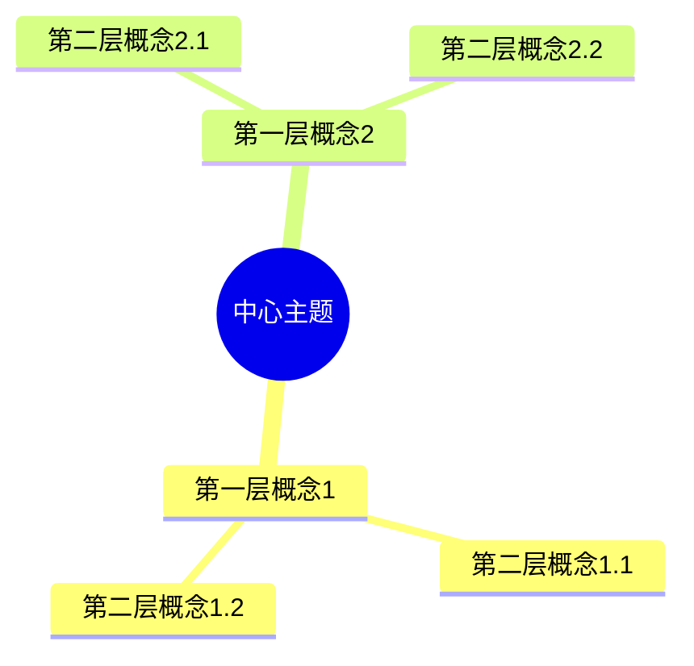
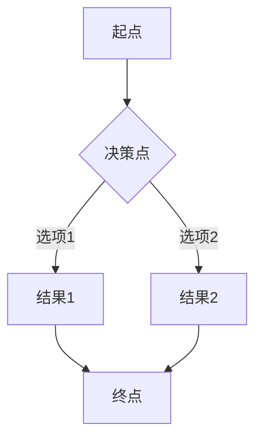
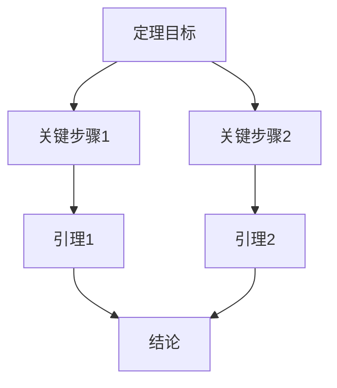

# 可视化表征全面推进计划

**创建日期**: 2025年12月11日
**文档类型**: 全面推进计划
**状态**: 🔄 执行中

---

## 📋 执行摘要

本计划旨在为所有数学理念项目系统性地添加多种思维表征方式，包括思维导图、多维概念矩阵、决策图网、证明图网等，提升文档的可读性和理解深度。

**目标**：

- 为所有项目添加可视化表征元素
- 提升文档质量和用户体验
- 建立统一的可视化标准

---

## 🎯 可视化表征类型

### 1. 思维导图 (Mind Maps)

**用途**：

- 展示整体知识结构
- 概念层次关系
- 快速导航和理解

**格式**：Mermaid mindmap语法

**应用场景**：

- 核心理论模块
- 概念关联网络
- 知识体系总览

---

### 2. 多维概念矩阵 (Concept Matrices)

**用途**：

- 多维度对比分析
- 特征对比
- 关系梳理

**格式**：Markdown表格

**应用场景**：

- 对比研究模块
- 概念对比
- 理论特征分析

---

### 3. 决策图网 (Decision Networks)

**用途**：

- 学习路径决策
- 应用场景选择
- 方法论选择

**格式**：Mermaid flowchart语法

**应用场景**：

- 学习路径指南
- 应用决策
- 方法选择

---

### 4. 证明图网 (Proof Networks)

**用途**：

- 定理证明逻辑
- 推理路径
- 论证结构

**格式**：Mermaid flowchart/graph语法

**应用场景**：

- 数学内容深度分析
- 核心定理证明
- 推理过程展示

---

### 5. 时间线图 (Timeline Diagrams)

**用途**：

- 历史演化
- 理论发展
- 时间序列事件

**格式**：Mermaid timeline语法

**应用场景**：

- 历史与传记模块
- 理论演化
- 影响分析

---

### 6. 关联网络图 (Association Networks)

**用途**：

- 概念关联
- 理论关系
- 影响网络

**格式**：Mermaid graph语法

**应用场景**：

- 知识关联分析
- 理论关联图谱
- 影响网络

---

## 📊 实施计划

### 阶段1：高优先级项目（本周）

#### 1. 塞尔项目（87% → 100%）

**已完成**：

- ✅ 01-概念关联网络：添加思维导图、概念矩阵、决策图网、证明图网
- ✅ 02-理论关联图谱：添加思维导图、时间线图、对比矩阵

**待完成**：

- [ ] 03-跨学科关联：添加关联网络图、对比矩阵
- [ ] 其他模块：补充必要的可视化元素

**预计时间**：2-3小时

---

#### 2. 图灵项目（100%，质量提升）

**待完成**：

- [ ] 为关键文档添加思维导图
- [ ] 添加概念对比矩阵
- [ ] 补充决策图网

**预计时间**：3-4小时

---

### 阶段2：P1级项目（本月）

#### 3. 布劳威尔项目（30% → 50%+）

**任务**：

- [ ] 核心理论模块：添加思维导图、概念矩阵
- [ ] 数学内容模块：添加证明图网、决策图网
- [ ] 对比研究模块：添加多维对比矩阵
- [ ] 知识关联分析：添加关联网络图

**预计时间**：10-12小时

---

#### 4. 鲁里项目（30% → 50%+）

**任务**：

- [ ] ∞-范畴理论：添加思维导图、概念矩阵
- [ ] 现代应用：添加决策图网
- [ ] 与格洛腾迪克关联：添加对比矩阵、关联网络图

**预计时间**：10-12小时

---

#### 5. 康托尔项目（40% → 60%+）

**任务**：

- [ ] 集合论内容：添加思维导图、概念矩阵
- [ ] 与希尔伯特、哥德尔对比：添加多维对比矩阵
- [ ] 历史演化：添加时间线图

**预计时间**：8-10小时

---

### 阶段3：P0级项目质量优化（下月）

#### 6. 希尔伯特项目（75% → 85%+）

**任务**：

- [ ] 添加核心理论的思维导图
- [ ] 添加与其他数学家的对比矩阵
- [ ] 补充证明图网和决策图网

**预计时间**：6-8小时

---

#### 7. 黎曼项目（70% → 85%+）

**任务**：

- [ ] 添加几何理论的思维导图
- [ ] 添加与物理应用的关联网络图
- [ ] 补充时间线图

**预计时间**：6-8小时

---

#### 8. 庞加莱项目（75% → 85%+）

**任务**：

- [ ] 添加拓扑学理论的思维导图
- [ ] 添加证明图网（如Poincaré对偶）
- [ ] 补充概念对比矩阵

**预计时间**：6-8小时

---

#### 9. 格洛腾迪克项目（75% → 85%+）

**任务**：

- [ ] 添加概形理论的思维导图
- [ ] 添加范畴论的关联网络图
- [ ] 补充证明图网和对比矩阵

**预计时间**：6-8小时

---

### 阶段4：其他项目（后续）

#### 10. 其他中优先级项目

**项目列表**：

- 高斯项目
- 诺特项目
- 哥德尔项目
- 德利涅项目
- 肖尔策项目
- 韦伊项目
- 欧拉项目

**任务**：为每个项目添加关键可视化元素

**预计时间**：每个项目3-5小时，总计21-35小时

---

## 📐 可视化标准模板

### 思维导图模板

```markdown
### X.X 思维导图：[主题名称]



```

---

### 概念矩阵模板

```markdown
### X.X 多维概念矩阵：[对比主题]

| 维度 | 概念A | 概念B | 概念C |
|------|-------|-------|-------|
| **特征1** | 值A1 | 值B1 | 值C1 |
| **特征2** | 值A2 | 值B2 | 值C2 |
| **特征3** | 值A3 | 值B3 | 值C3 |
```

---

### 决策图网模板

```markdown
### X.X 决策图网：[决策场景]



```

---

### 证明图网模板

```markdown
### X.X 证明图网：[定理名称]



```

---

## 📈 进度跟踪

### 当前进度（2025年12月11日）

| 阶段 | 项目 | 状态 | 完成度 |
|------|------|------|--------|
| 阶段1 | 塞尔项目 | 🔄 进行中 | 60% |
| 阶段1 | 图灵项目 | 📋 计划中 | 0% |
| 阶段2 | 布劳威尔项目 | 📋 计划中 | 0% |
| 阶段2 | 鲁里项目 | 📋 计划中 | 0% |
| 阶段2 | 康托尔项目 | 📋 计划中 | 0% |
| 阶段3 | P0级项目 | 📋 计划中 | 0% |
| 阶段4 | 其他项目 | 📋 计划中 | 0% |

---

## ✅ 质量检查标准

### 每个可视化元素应满足：

- [ ] **准确性**：内容准确反映数学概念
- [ ] **完整性**：覆盖主要概念和关系
- [ ] **清晰性**：易于理解和阅读
- [ ] **一致性**：使用统一的标准和格式
- [ ] **相关性**：与文档内容高度相关

---

## 📚 参考资源

### 已有示例

- `Klein数学理念/08-数学知识关联分析/` - 包含完整的可视化示例
- `Concept Mapping in Mathematics/06-思维表征方式/` - 思维表征方法体系
- `research/06-思维表征/` - 思维表征理论研究

### 技术文档

- [Mermaid文档](https://mermaid.js.org/) - Mermaid图表语法
- [Markdown表格](https://www.markdownguide.org/extended-syntax/#tables) - 表格语法

---

**文档创建日期**: 2025年12月11日
**最后更新**: 2025年12月11日
**状态**: 🔄 执行中
**下次更新**: 完成阶段1后

---

*本计划为所有数学理念项目提供了系统性的可视化表征添加方案，确保文档质量和用户体验的提升。*
