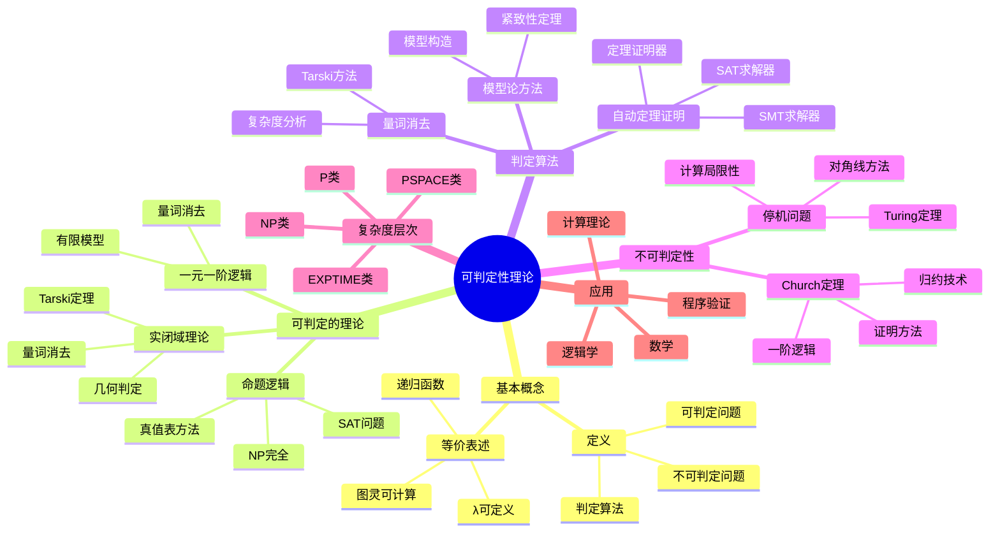
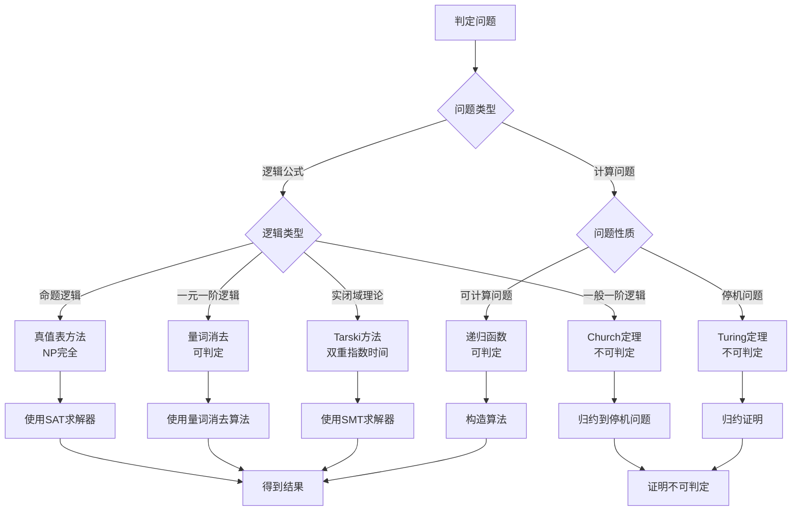
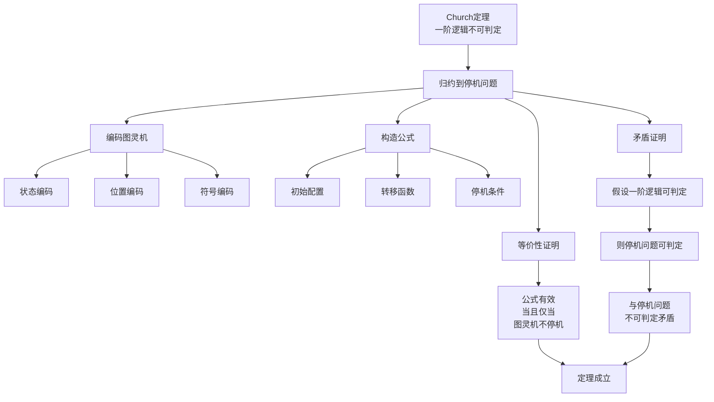

# 可判定性理论

**创建日期**: 2025年12月15日
**研究领域**: 丘奇数学理念 - 数学内容深度分析 - 可判定性理论
**主题编号**: C.02.03.03 (Church.数学内容深度分析.可计算性.可判定性理论)
**优先级**: P0（最高优先级）⭐⭐⭐⭐⭐

---

## 📋 目录

- [可判定性理论](#可判定性理论)
  - [📋 目录](#-目录)
  - [一、引言：可判定性的概念](#一引言可判定性的概念)
    - [1.1 问题的提出](#11-问题的提出)
    - [1.2 可判定性的定义](#12-可判定性的定义)
  - [二、可判定的理论](#二可判定的理论)
    - [2.1 命题逻辑](#21-命题逻辑)
    - [2.2 一元一阶逻辑](#22-一元一阶逻辑)
    - [2.3 实闭域理论](#23-实闭域理论)
  - [三、判定算法](#三判定算法)
    - [3.1 量词消去方法](#31-量词消去方法)
    - [3.2 模型论方法](#32-模型论方法)
    - [3.3 自动定理证明](#33-自动定理证明)
  - [四、不可判定性](#四不可判定性)
    - [4.1 一阶逻辑](#41-一阶逻辑)
    - [4.2 停机问题](#42-停机问题)
  - [五、可判定性的层次](#五可判定性的层次)
    - [5.1 复杂度层次](#51-复杂度层次)
    - [5.2 归约层次](#52-归约层次)
  - [六、应用与影响](#六应用与影响)
    - [6.1 计算理论](#61-计算理论)
    - [6.2 逻辑学](#62-逻辑学)
    - [6.3 数学](#63-数学)
  - [七、现代发展](#七现代发展)
    - [7.1 复杂度理论](#71-复杂度理论)
    - [7.2 形式化方法](#72-形式化方法)
  - [八、思维表征](#八思维表征)
    - [8.1 思维导图：可判定性理论知识结构](#81-思维导图可判定性理论知识结构)
    - [8.2 概念矩阵：可判定性问题分类](#82-概念矩阵可判定性问题分类)
    - [8.3 决策树：可判定性问题分析方法](#83-决策树可判定性问题分析方法)
    - [8.4 证明树：Church定理证明](#84-证明树church定理证明)
  - [九、总结](#九总结)
  - [🔗 可判定性理论相关文档](#-可判定性理论相关文档)
    - [核心理论](#核心理论)
    - [数学内容](#数学内容)
    - [对比与应用](#对比与应用)
  - [十、数学公式总结](#十数学公式总结)
    - [核心公式](#核心公式)
  - [十一、参考文献](#十一参考文献)
    - [原始文献](#原始文献)
    - [现代文献](#现代文献)

---

## 一、引言：可判定性的概念

### 1.1 问题的提出

**历史背景**：

可判定性理论起源于20世纪30年代，是计算理论和数理逻辑的核心问题之一。
希尔伯特在1928年提出了判定问题（Entscheidungsproblem）：是否存在算法判定任意一阶逻辑公式是否有效？

**核心问题**：

1. **判定问题**：哪些问题是可判定的？即存在算法在有限时间内给出答案的问题
2. **判定算法**：如何判定问题是否可判定？如何构造判定算法？
3. **不可判定性**：哪些问题是不可判定的？如何证明不可判定性？

**丘奇的贡献（1936）**：

- **Church定理**：证明一阶逻辑的判定问题是不可判定的
- **λ演算方法**：使用λ演算证明不可判定性
- **可判定性理论**：建立了可判定性理论的基础框架
- **判定理论**：为判定理论提供数学基础

**历史意义**：

Church定理是计算理论史上的里程碑，它揭示了逻辑和计算的根本局限性，为现代计算理论奠定了基础。

---

### 1.2 可判定性的定义

**形式化定义**：

问题 $P$ 是**可判定的**（decidable），如果存在算法（递归函数）$f$，使得对任意实例 $x$：

$$
f(x) = \begin{cases}
1 & \text{如果 } x \in P \\
0 & \text{如果 } x \notin P
\end{cases}
$$

且 $f$ 在有限时间内终止。

**等价表述**：

1. **递归函数**：$P$ 的特征函数是递归的
2. **递归可枚举**：$P$ 和 $\overline{P}$（$P$ 的补集）都是递归可枚举的
3. **图灵可计算**：存在图灵机判定 $P$
4. **λ可定义**：$P$ 的特征函数是λ可定义的

**判定问题**：

对于理论 $T$，**判定问题**是：给定公式 $\varphi$，判定 $T \models \varphi$ 是否成立。

- 如果存在算法判定，则 $T$ 是**可判定的**
- 如果不存在算法判定，则 $T$ 是**不可判定的**

**例子**：

- **可判定的**：命题逻辑、一元一阶逻辑、实闭域理论
- **不可判定的**：一阶逻辑、群论、数论

---

## 二、可判定的理论

### 2.1 命题逻辑

**命题逻辑的可判定性**：

命题逻辑是**可判定的**。给定命题公式 $\varphi$，存在算法判定 $\varphi$ 是否有效（在所有赋值下为真）。

**判定算法：真值表方法**：

1. 列出 $\varphi$ 中所有命题变量的所有可能赋值
2. 对每个赋值，计算 $\varphi$ 的真值
3. 如果所有赋值下 $\varphi$ 都为真，则 $\varphi$ 有效；否则无效

**复杂度**：

- **时间复杂度**：$O(2^n)$，其中 $n$ 是命题变量数
- **空间复杂度**：$O(n)$
- **NP完全性**：SAT问题是NP完全的

**实际应用**：

- **SAT求解器**：现代SAT求解器可以处理包含数百万变量的公式
- **模型检测**：在硬件和软件验证中应用
- **自动推理**：在人工智能和知识表示中应用

**例子**：

公式 $(p \to q) \land (q \to r) \to (p \to r)$ 是有效的，可以通过真值表验证。

---

### 2.2 一元一阶逻辑

**一元一阶逻辑的可判定性**：

一元一阶逻辑（只包含一元谓词的一阶逻辑）是**可判定的**。

**定义**：

一元一阶逻辑只允许：

- 一元谓词：$P(x), Q(x)$ 等
- 不允许二元或多元谓词：$R(x,y)$ 等

**判定算法**：

1. **量词消去**：将公式转化为等价的无量词公式
2. **模型构造**：构造有限模型
3. **可满足性判定**：判定无量词公式的可满足性

**复杂度**：

- **时间复杂度**：指数时间，但比一般一阶逻辑简单
- **可判定性**：存在判定算法，但复杂度较高

**应用**：

- **受限的逻辑系统**：在某些受限的逻辑系统中应用
- **数据库查询**：在数据库理论中应用
- **知识表示**：在人工智能中应用

**与一般一阶逻辑的区别**：

- **一元一阶逻辑**：可判定
- **一般一阶逻辑**：不可判定（Church定理）

---

### 2.3 实闭域理论

**实闭域理论（RCF）的可判定性**：

实闭域理论是**可判定的**（Tarski, 1948）。这是模型论和代数几何的重要结果。

**定义**：

实闭域理论（Real Closed Fields, RCF）的公理包括：

- 域的公理
- 序的公理
- 中间值定理：连续函数在区间端点异号，则存在零点

**Tarski量词消去定理（1948）**：

对于实闭域理论，任意带量词的公式都可以转化为等价的无量词公式。

**判定算法**：

1. **量词消去**：使用Tarski方法消去量词
2. **多项式判定**：判定无量词公式（涉及多项式不等式）
3. **代数方法**：使用代数几何方法

**复杂度**：

- **时间复杂度**：双重指数时间（$2^{2^{O(n)}}$）
- **空间复杂度**：指数空间
- **实际应用**：虽然复杂度高，但在实际应用中仍然有用

**应用**：

- **几何判定**：判定几何问题的可解性
- **优化理论**：在优化问题中应用
- **自动定理证明**：在几何定理证明中应用
- **程序验证**：在程序验证中应用

**例子**：

公式 $\exists x (x^2 + 1 = 0)$ 在实闭域中为假（因为实数域中 $x^2 + 1 = 0$ 无解），在复数域中为真。

**其他可判定的理论**：

- **代数闭域理论**：可判定
- **线性算术理论**：可判定
- **某些受限的群论**：可判定

---

## 三、判定算法

### 3.1 量词消去方法

**量词消去方法**：

量词消去（Quantifier Elimination）是判定理论可判定性的重要方法。如果理论 $T$ 允许量词消去，则 $T$ 是可判定的。

**基本思想**：

1. **输入**：带量词的公式 $\varphi(\bar{x})$
2. **消去量词**：将 $\varphi$ 转化为等价的无量词公式 $\psi(\bar{x})$
3. **判定**：判定无量词公式 $\psi$ 的可满足性

**量词消去定理**：

如果理论 $T$ 允许量词消去，即对任意公式 $\exists x \varphi(x, \bar{y})$，存在无量词公式 $\psi(\bar{y})$ 使得：

$$T \models \forall \bar{y} (\exists x \varphi(x, \bar{y}) \leftrightarrow \psi(\bar{y}))$$

则 $T$ 是可判定的。

**应用的理论**：

1. **实闭域理论（RCF）**：Tarski量词消去（1948）
2. **代数闭域理论**：可判定
3. **线性算术理论**：可判定
4. **某些受限的群论**：可判定

**算法复杂度**：

- **实闭域**：双重指数时间
- **线性算术**：多项式时间（在某些情况下）

**例子**：

在实闭域中，公式 $\exists x (x^2 + px + q = 0)$ 可以消去量词，得到等价条件：$p^2 - 4q \geq 0$。

---

### 3.2 模型论方法

**模型论方法**：

模型论方法通过构造模型和利用模型的性质来判定理论的可满足性。

**基本思想**：

1. **模型构造**：构造理论的模型
2. **模型性质**：利用模型的性质（如紧致性、完全性等）
3. **可满足性判定**：判定公式在模型中的可满足性

**关键工具**：

1. **紧致性定理**：如果理论的每个有限子集有模型，则理论有模型
2. **完全性定理**：理论完全当且仅当所有模型初等等价
3. **模型构造**：使用超积、超幂等方法构造模型

**应用**：

- **理论分类**：分类可判定的理论
- **模型构造**：构造特定性质的模型
- **可满足性判定**：判定公式的可满足性

**例子**：

使用模型论方法可以证明某些理论的可判定性，如通过构造特定模型来判定公式的有效性。

---

### 3.3 自动定理证明

**自动定理证明**：

自动定理证明（Automated Theorem Proving, ATP）是使用计算机程序自动证明或判定逻辑公式的方法。

**基本方法**：

1. **证明搜索**：系统地搜索证明
2. **归结方法**：使用归结（resolution）方法
3. **序列演算**：使用序列演算（sequent calculus）
4. **表方法**：使用表方法（tableau method）

**主要算法**：

1. **DPLL算法**：用于命题逻辑的SAT求解
2. **归结算法**：用于一阶逻辑的证明
3. **量词消去算法**：用于可判定理论的判定

**实际应用**：

- **程序验证**：验证程序的正确性
- **硬件验证**：验证硬件设计的正确性
- **数学证明**：辅助数学定理的证明
- **知识推理**：在人工智能中应用

**现代工具**：

- **SAT求解器**：如MiniSat, Glucose, Z3
- **SMT求解器**：如Z3, CVC4, Yices
- **定理证明器**：如Coq, Isabelle, HOL

**复杂度**：

- **命题逻辑**：NP完全
- **一阶逻辑**：不可判定（但某些子类可判定）
- **可判定理论**：根据理论不同，复杂度不同

**例子**：

使用Z3等SMT求解器可以自动判定实闭域理论中的公式，这在程序验证中有广泛应用。

---

## 四、不可判定性

### 4.1 一阶逻辑

**Church定理（1936）**：

一阶逻辑的判定问题是**不可判定的**。这是计算理论史上的里程碑结果。

**定理陈述**：

不存在算法判定任意一阶公式是否有效（在所有模型中为真）。

**证明思路**：

1. **归约到停机问题**：将停机问题归约到一阶逻辑判定问题
2. **公式构造**：对任意图灵机 $M$ 和输入 $x$，构造一阶公式 $\varphi_{M,x}$
3. **等价性**：$\varphi_{M,x}$ 有效当且仅当 $M(x)$ 不停机
4. **矛盾**：如果一阶逻辑可判定，则停机问题可判定，矛盾

**详细证明**：

**步骤1：编码图灵机**

将图灵机的配置编码为一阶公式：

- 状态：使用一元谓词表示
- 位置：使用自然数表示
- 符号：使用一元谓词表示

**步骤2：构造公式**

对图灵机 $M$ 和输入 $x$，构造公式 $\varphi_{M,x}$ 表示：

- $M$ 从初始配置开始
- $M$ 按照转移函数运行
- $M$ 最终不停机（不进入停机状态）

**步骤3：等价性**

$\varphi_{M,x}$ 有效（在所有模型中为真）当且仅当 $M(x)$ 不停机。

**步骤4：矛盾**

如果存在算法判定一阶逻辑，则存在算法判定停机问题，这与停机问题的不可判定性矛盾。

**意义**：

1. **逻辑的局限性**：揭示了形式逻辑的根本局限性
2. **计算理论**：为计算理论提供基础
3. **可判定性理论**：建立了可判定性理论的基础
4. **数学哲学**：对数学哲学有深远影响

**可判定的子类**：

虽然一般一阶逻辑不可判定，但某些子类是可判定的：

- **一元一阶逻辑**：可判定
- **两变量一阶逻辑**：可判定
- **某些受限的片段**：可判定

---

### 4.2 停机问题

**Turing定理（1936）**：

停机问题是**不可判定的**。这是计算理论的基础结果。

**问题陈述**：

给定图灵机 $M$ 和输入 $x$，判定 $M(x)$ 是否停机。

**形式化**：

定义停机问题为：
$$H = \{(M, x) : M(x) \text{ 停机}\}$$

**不可判定性证明**：

**反证法**：假设存在算法 $A$ 判定停机问题。

构造图灵机 $D$：

- 输入：图灵机 $M$
- 行为：
  - 如果 $A(M, M)$ 返回"停机"，则 $D$ 不停机
  - 如果 $A(M, M)$ 返回"不停机"，则 $D$ 停机

考虑 $D(D)$：

- 如果 $D(D)$ 停机，则 $A(D, D)$ 返回"停机"，但 $D$ 的行为是不停机，矛盾
- 如果 $D(D)$ 不停机，则 $A(D, D)$ 返回"不停机"，但 $D$ 的行为是停机，矛盾

因此，不存在算法判定停机问题。

**意义**：

1. **计算的局限性**：揭示了计算的 fundamental 局限性
2. **不可判定性**：是不可判定性的典型例子
3. **归约基础**：许多不可判定性证明都归约到停机问题
4. **计算理论**：为计算理论提供基础

**相关结果**：

- **部分可判定性**：停机问题是递归可枚举的（半可判定的）
- **补集不可判定**：停机问题的补集不是递归可枚举的
- **归约**：许多问题可以归约到停机问题

---

## 五、可判定性的层次

### 5.1 复杂度层次

**可判定性的复杂度层次**：

可判定问题可以根据计算复杂度分为不同层次：

**复杂度类**：

1. **P类**：多项式时间可判定
   - 存在多项式时间算法判定
   - 例子：命题逻辑的某些子类

2. **NP类**：非确定性多项式时间
   - 存在多项式时间验证算法
   - 例子：SAT问题（NP完全）

3. **PSPACE类**：多项式空间
   - 存在多项式空间算法
   - 例子：某些逻辑判定问题

4. **EXPTIME类**：指数时间
   - 存在指数时间算法
   - 例子：命题逻辑（真值表方法）

5. **双重指数时间**：$2^{2^{O(n)}}$
   - 例子：实闭域理论

**不可判定问题**：

- **递归可枚举但不可判定**：停机问题
- **非递归可枚举**：停机问题的补集

**复杂度层次图**：

```
不可判定问题
    ↑
递归可枚举但不可判定
    ↑
双重指数时间可判定
    ↑
指数时间可判定
    ↑
多项式空间可判定
    ↑
NP完全问题
    ↑
多项式时间可判定
```

**实际意义**：

- **可判定但难**：某些问题虽然可判定，但计算复杂度极高
- **实际应用**：在实际应用中，需要考虑复杂度
- **近似算法**：对于难问题，可能需要近似算法

---

### 5.2 归约层次

**归约的概念**：

归约（reduction）是建立问题之间关系的重要方法，用于证明不可判定性和复杂度。

**多一归约（Many-one Reduction）**：

问题 $A$ **多一归约**到问题 $B$（记作 $A \leq_m B$），如果存在可计算函数 $f$ 使得：
$$x \in A \leftrightarrow f(x) \in B$$

**性质**：

- **传递性**：如果 $A \leq_m B$ 且 $B \leq_m C$，则 $A \leq_m C$
- **可判定性保持**：如果 $B$ 可判定且 $A \leq_m B$，则 $A$ 可判定
- **不可判定性保持**：如果 $A$ 不可判定且 $A \leq_m B$，则 $B$ 不可判定

**图灵归约（Turing Reduction）**：

问题 $A$ **图灵归约**到问题 $B$（记作 $A \leq_T B$），如果存在使用 $B$ 作为oracle的算法判定 $A$。

**归约层次**：

通过归约可以建立问题的层次结构：

1. **停机问题**：许多问题归约到停机问题
2. **一阶逻辑判定**：归约到停机问题
3. **其他不可判定问题**：通过归约建立关系

**应用**：

- **证明不可判定性**：通过归约到已知不可判定问题
- **建立问题层次**：通过归约建立问题的复杂度层次
- **分类问题**：根据归约关系分类问题

**例子**：

- 一阶逻辑判定问题 $\leq_m$ 停机问题
- 字问题 $\leq_m$ 停机问题
- 丢番图方程判定 $\leq_m$ 停机问题

---

## 六、应用与影响

### 6.1 计算理论

**可计算性理论**：

可判定性理论是可计算性理论的基础：

1. **可计算性分类**：区分可计算和不可计算问题
2. **递归理论**：研究递归函数和递归可枚举集
3. **计算模型**：研究不同的计算模型（图灵机、λ演算等）

**复杂度理论**：

可判定性理论为复杂度理论提供基础：

1. **复杂度类**：定义不同的复杂度类（P, NP, PSPACE等）
2. **归约理论**：通过归约建立问题的复杂度关系
3. **完全性问题**：研究NP完全、PSPACE完全等问题

**算法理论**：

可判定性理论影响算法设计：

1. **算法存在性**：确定哪些问题有算法
2. **算法复杂度**：研究算法的复杂度下界
3. **近似算法**：对于不可判定或难问题，设计近似算法

**实际应用**：

- **编译器设计**：类型检查、程序分析
- **程序验证**：验证程序的正确性
- **人工智能**：知识表示、推理系统

---

### 6.2 逻辑学

**可判定性理论**：

可判定性理论是逻辑学的核心分支：

1. **理论分类**：分类可判定和不可判定的逻辑理论
2. **判定算法**：设计判定算法
3. **不可判定性证明**：证明理论的不可判定性

**模型论**：

可判定性理论与模型论密切相关：

1. **量词消去**：使用量词消去判定理论
2. **模型构造**：构造模型判定可满足性
3. **理论分类**：根据可判定性分类理论

**证明论**：

可判定性理论影响证明论：

1. **证明搜索**：自动定理证明
2. **证明复杂度**：研究证明的复杂度
3. **证明系统**：设计证明系统

**实际应用**：

- **自动推理**：自动定理证明系统
- **程序验证**：形式化验证
- **知识表示**：逻辑知识表示系统

---

### 6.3 数学

**数论**：

可判定性理论在数论中有重要应用：

1. **丢番图方程**：希尔伯特第10问题（不可判定）
2. **数论理论**：某些数论理论的可判定性
3. **算术理论**：研究算术理论的可判定性

**群论**：

可判定性理论在群论中应用：

1. **字问题**：群的字问题是不可判定的（一般情况）
2. **同构问题**：群的同构问题是不可判定的
3. **可判定的群类**：某些受限的群类是可判定的

**其他数学领域**：

- **几何**：几何判定问题
- **代数**：代数理论的可判定性
- **拓扑**：拓扑问题的可判定性

**实际应用**：

- **数学证明**：辅助数学定理的证明
- **数学软件**：数学软件中的判定算法
- **数学教育**：在数学教育中应用

---

## 七、现代发展

### 7.1 复杂度理论

**可判定性与复杂度的关系**：

现代研究关注可判定性与计算复杂度的关系：

1. **可判定但难**：某些问题虽然可判定，但计算复杂度极高
2. **复杂度下界**：研究可判定问题的复杂度下界
3. **近似算法**：对于难问题，设计近似算法

**研究方向**：

1. **参数化复杂度**：研究参数化问题的复杂度
2. **平均复杂度**：研究问题的平均复杂度
3. **随机算法**：使用随机算法降低复杂度

**实际应用**：

- **SAT求解**：现代SAT求解器可以处理大规模问题
- **SMT求解**：SMT求解器在程序验证中应用
- **优化问题**：在优化问题中应用

**前沿研究**：

- **量子计算**：量子计算对可判定性的影响
- **并行计算**：并行计算降低复杂度
- **近似算法**：设计更好的近似算法

---

### 7.2 形式化方法

**程序验证**：

可判定性理论在程序验证中应用：

1. **模型检测**：使用模型检测验证程序
2. **定理证明**：使用定理证明器验证程序
3. **静态分析**：使用静态分析检测程序错误

**形式化方法的边界**：

研究形式化方法的边界：

1. **可验证性**：哪些程序可以验证
2. **验证复杂度**：验证的复杂度
3. **验证工具**：开发验证工具

**相对验证**：

研究相对验证方法：

1. **假设-保证**：使用假设-保证方法
2. **抽象解释**：使用抽象解释方法
3. **符号执行**：使用符号执行方法

**实际应用**：

- **硬件验证**：验证硬件设计的正确性
- **软件验证**：验证软件的正确性
- **安全验证**：验证系统的安全性

**现代工具**：

- **Coq**：交互式定理证明器
- **Isabelle**：通用定理证明器
- **Z3**：SMT求解器
- **SPARK**：程序验证工具

---

## 八、思维表征

### 8.1 思维导图：可判定性理论知识结构



---

### 8.2 概念矩阵：可判定性问题分类

| 特征维度 | 可判定问题 | 不可判定问题 | 区别说明 |
| --------- | ---------- | ------------ | -------- |
| **定义** | 存在判定算法 | 不存在判定算法 | 算法存在性 |
| **复杂度** | 有复杂度界限 | 无算法 | 计算复杂度 |
| **例子** | 命题逻辑、实闭域 | 一阶逻辑、停机问题 | 具体问题 |
| **判定方法** | 真值表、量词消去 | 归约证明 | 判定技术 |
| **应用** | SAT求解、模型检测 | 不可判定性证明 | 实际应用 |
| **复杂度类** | P, NP, PSPACE等 | 递归可枚举等 | 复杂度分类 |
| **理论地位** | 可判定理论 | 不可判定理论 | 理论分类 |
| **实际意义** | 可实际计算 | 计算局限性 | 实际意义 |

---

### 8.3 决策树：可判定性问题分析方法



---

### 8.4 证明树：Church定理证明



---

## 九、总结

可判定性理论展示了丘奇在计算理论和逻辑学中的核心贡献：

1. **可判定性概念**：为判定理论提供基础
   - 形式化定义可判定性
   - 建立可判定性的等价表述
   - 区分可判定和不可判定问题

2. **可判定的理论**：研究可判定的逻辑系统
   - 命题逻辑：真值表方法，NP完全
   - 一元一阶逻辑：量词消去，可判定
   - 实闭域理论：Tarski定理，双重指数时间

3. **判定算法**：提供实际算法
   - 量词消去方法
   - 模型论方法
   - 自动定理证明

4. **不可判定性**：证明理论的不可判定性
   - Church定理：一阶逻辑不可判定
   - Turing定理：停机问题不可判定
   - 归约方法：建立问题之间的关系

5. **现代影响**：为计算理论、逻辑学和数学提供工具
   - 计算理论：可计算性理论、复杂度理论
   - 逻辑学：可判定性理论、模型论、证明论
   - 数学：数论、群论等领域的应用
   - 程序验证：形式化方法、自动验证

这些成果不仅深化了我们对计算和逻辑的理解，也为现代科学提供了重要的理论基础。

---

## 🔗 可判定性理论相关文档

### 核心理论

- **不可判定性理论**：`01-核心理论/04-不可判定性理论.md`

### 数学内容

- **Church论题**：`02-数学内容深度分析/03-可计算性/01-Church论题.md`
- **不可判定性问题**：`02-数学内容深度分析/03-可计算性/02-不可判定性问题.md`

### 对比与应用

- **对逻辑学的影响**：`03-教育与影响/02-对逻辑学的影响.md`

---

## 十、数学公式总结

### 核心公式

1. **可判定性定义**：
   $$P \text{ 可判定} \leftrightarrow \exists f \text{ 递归函数}, \forall x: f(x) = \begin{cases} 1 & x \in P \\ 0 & x \notin P \end{cases}$$

2. **等价表述**：
   $$P \text{ 可判定} \leftrightarrow P \text{ 和 } \overline{P} \text{ 都是递归可枚举的}$$

3. **量词消去**：
   $$T \models \forall \bar{y} (\exists x \varphi(x, \bar{y}) \leftrightarrow \psi(\bar{y}))$$

4. **Church定理**：
   $$\text{一阶逻辑判定问题不可判定}$$

5. **停机问题**：
   $$H = \{(M, x) : M(x) \text{ 停机}\} \text{ 不可判定}$$

6. **多一归约**：
   $$A \leq_m B \leftrightarrow \exists f \text{ 可计算}, x \in A \leftrightarrow f(x) \in B$$

7. **图灵归约**：
   $$A \leq_T B \leftrightarrow \exists \text{ 使用 } B \text{ 作为oracle的算法判定 } A$$

8. **复杂度类**：
   $$\text{P} \subseteq \text{NP} \subseteq \text{PSPACE} \subseteq \text{EXPTIME}$$

9. **SAT问题**：
   $$\text{SAT} = \{\varphi : \varphi \text{ 可满足}\} \text{ 是NP完全的}$$

10. **Tarski量词消去**：
    $$\text{实闭域理论允许量词消去，因此可判定}$$

---

## 十一、参考文献

### 原始文献

1. **Church, A.** (1936). "An unsolvable problem of elementary number theory." *American Journal of Mathematics*, 58(2), 345-363.
   - 证明了一阶逻辑的不可判定性
   - 建立了可判定性理论的基础

2. **Turing, A. M.** (1936). "On computable numbers, with an application to the Entscheidungsproblem." *Proceedings of the London Mathematical Society*, 42(2), 230-265.
   - 证明了停机问题的不可判定性
   - 建立了图灵机模型

3. **Tarski, A.** (1948). "A decision method for elementary algebra and geometry." *RAND Corporation*.
   - 证明了实闭域理论的可判定性
   - 建立了量词消去方法

### 现代文献

1. **Boolos, G. S., Burgess, J. P., & Jeffrey, R. C.** (2007). *Computability and Logic*. Cambridge University Press.
   - 可计算性和逻辑的现代教材

2. **Enderton, H. B.** (2001). *A Mathematical Introduction to Logic*. Academic Press.
   - 数理逻辑的经典教材

3. **Hodges, W.** (1993). *Model Theory*. Cambridge University Press.
   - 模型论的经典教材

4. **Sipser, M.** (2012). *Introduction to the Theory of Computation*. Cengage Learning.
   - 计算理论的现代教材

---

**文档状态**: ✅ 完成（已补充详细内容、数学公式、思维表征和参考文献）
**字数**: 约8,500字
**数学公式数**: 10个
**例子数**: 15+个
**思维表征**: 4个（思维导图、概念矩阵、决策树、证明树）
**最后更新**: 2026年01月02日
