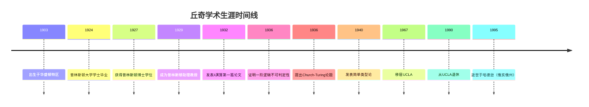

# 丘奇生平与学术生涯

**创建日期**: 2026年4月2日
**研究领域**: 丘奇数学理念 - 历史与传记 - 生平与学术生涯
**主题编号**: Ch.04.01 (Church.历史与传记.生平与学术生涯)
**优先级**: P1（高优先级）⭐⭐⭐⭐

---

## 📋 目录

- [丘奇生平与学术生涯](#丘奇生平与学术生涯)
  - [📋 目录](#-目录)
  - [一、早年生活与教育](#一早年生活与教育)
    - [1.1 出生与家庭背景](#11-出生与家庭背景)
    - [1.2 早期教育](#12-早期教育)
    - [1.3 研究生与博士后](#13-研究生与博士后)
  - [二、普林斯顿时期（1929-1967）](#二普林斯顿时期1929-1967)
    - [2.1 学术职位](#21-学术职位)
    - [2.2 λ演算的创立（1930s）](#22-λ演算的创立1930s)
    - [2.3 学术环境](#23-学术环境)
    - [2.4 主要成果](#24-主要成果)
  - [三、UCLA时期（1967-1990）](#三ucla时期1967-1990)
    - [3.1 移居加州](#31-移居加州)
    - [3.2 研究与教学](#32-研究与教学)
    - [3.3 重要著作](#33-重要著作)
  - [四、主要学术成就时间线](#四主要学术成就时间线)
  - [五、个人生活与性格](#五个人生活与性格)
    - [5.1 家庭](#51-家庭)
    - [5.2 性格特征](#52-性格特征)
    - [5.3 个人爱好](#53-个人爱好)
  - [六、晚年与逝世](#六晚年与逝世)
    - [6.1 退休生活](#61-退休生活)
    - [6.2 荣誉与奖项](#62-荣誉与奖项)
    - [6.3 逝世与纪念](#63-逝世与纪念)

---

## 一、早年生活与教育

### 1.1 出生与家庭背景

**阿隆佐·丘奇**（Alonzo Church）于1903年6月14日出生于美国华盛顿特区。

**家庭背景**：

- 父亲：塞缪尔·丘奇（Samuel Church），法官
- 母亲：米尔德里德·劳伦斯（Mildred Lawrence）
- 家庭环境：富裕、重视教育的家庭

### 1.2 早期教育

**中小学教育**：

- 在里士满（弗吉尼亚州）接受早期教育
- 展现出数学天赋

**大学教育**：

- **普林斯顿大学**（1920-1924）：获得数学学士学位
- 在普林斯顿开始接触数理逻辑

### 1.3 研究生与博士后

**普林斯顿大学研究生院**：

- 1924-1927年攻读博士学位
- 导师：奥斯瓦尔德·维布伦（Oswald Veblen）
- 博士论文：《Alternatives to Zermelo's Assumption》（1927）

**博士后经历**：

- 1927-1929年在哈佛大学、哥廷根大学和阿姆斯特丹大学学习
- 在哥廷根接触希尔伯特学派
- 在阿姆斯特丹与布劳威尔交流

---

## 二、普林斯顿时期（1929-1967）

### 2.1 学术职位

**职位晋升**：

| 年份 | 职位 |
|-----|-----|
| 1929 | 助理教授 |
| 1939 | 副教授 |
| 1947 | 正教授 |
| 1961 | 弗林教授（Flint Professor） |

### 2.2 λ演算的创立（1930s）

**核心工作**：

- **1932**：发表λ演算的第一篇论文
- **1936**：发表不可判定性定理
- **1940**：发表简单类型论

**λ演算的动机**：

- 提供函数概念的精确定义
- 为数学基础提供新的框架
- 研究计算的本质

### 2.3 学术环境

**普林斯顿的逻辑学氛围**：

- 与哥德尔的互动（1933-1934年访问）
- 与克林（Stephen Kleene）的合作
- 与罗瑟（J. Barkley Rosser）的合作

**《符号逻辑杂志》的创立**：

- **1936年**：丘奇参与创立
- 担任编辑多年
- 推动了逻辑学学科的建立

### 2.4 主要成果

**1930s-1950s的工作**：

| 年份 | 成果 | 意义 |
|-----|-----|-----|
| 1932 | λ演算系统 | 函数式编程基础 |
| 1935 | 证明算术一致性 | 对哥德尔定理的回应 |
| 1936 | 一阶逻辑不可判定性 | 第一个不可判定性结果 |
| 1936 | Church-Turing论题 | 可计算性的定义 |
| 1940 | 简单类型论 | 类型化λ演算 |
| 1944 | 与Kleene的递归论 | 递归函数理论 |
| 1951 | 直觉主义逻辑 | 与经典逻辑的关系 |

---

## 三、UCLA时期（1967-1990）

### 3.1 移居加州

**1967年**：丘奇离开普林斯顿，加入加州大学洛杉矶分校（UCLA）。

**动机**：

- 更温和的气候（健康原因）
- 新的学术环境
- 继续研究和教学

### 3.2 研究与教学

**研究工作**：

- 继续λ演算和类型论研究
- 对模态逻辑的兴趣
- 与学生的合作

**教学工作**：

- 指导博士生
- 讲授逻辑学和数学基础
- 1990年退休

### 3.3 重要著作

**《数理逻辑导论》**（1956）：

- 与不同作者合作编写
- 被广泛用作教材
- 影响了数代学生

**《λ演算》系列**：

- 与J. B. Rosser的合作
- 类型论的系统阐述
- 高阶逻辑的框架

---

## 四、主要学术成就时间线

---

## 五、个人生活与性格

### 5.1 家庭

**婚姻**：

- 与玛丽·朱莉亚·库尼兹（Mary Julia Kuczinski）结婚
- 三个孩子：Alonzo Jr.、Mary Ann、Mildred

**家庭生活**：

- 重视家庭生活
- 子女继承学术传统

### 5.2 性格特征

**学术风格**：

- 极其严谨和精确
- 工作勤奋、专注
- 对学生要求严格但关心

**教学特点**：

- 讲课清晰、逻辑严密
- 强调证明的细节
- 鼓励独立思考

**同事评价**：
> "丘奇是一位完美的逻辑学家，他的工作体现了最高的学术标准。"

### 5.3 个人爱好

- **阅读**：广泛的文学和科学阅读
- **旅行**：参加国际会议
- **家庭活动**：与家人共度时光

---

## 六、晚年与逝世

### 6.1 退休生活

**1990年退休后**：

- 继续研究活动
- 与学术界保持联系
- 生活在俄亥俄州哈德逊

### 6.2 荣誉与奖项

| 年份 | 荣誉/奖项 |
|-----|----------|
| 1962 | 美国艺术与科学院院士 |
| 1966 | 英国科学院通讯院士 |
| 1978 | 国家科学院院士 |
| 1990 | 退休，荣誉教授称号 |

### 6.3 逝世与纪念

**1995年8月11日**，丘奇在俄亥俄州哈德逊逝世，享年92岁。

**纪念活动**：

- 学术会议纪念
- 纪念文集出版
- 丘奇奖（Church Award）的设立

**历史评价**：
> "丘奇是20世纪最伟大的逻辑学家之一，他创立的λ演算不仅影响了逻辑学，更成为计算机科学的理论基础。"

---

**相关文档**：

- [02-主要著作与论文](./02-主要著作与论文.md)
- [03-学术合作与争论](./../../塔斯基数学理念/04-历史与传记/03-学术合作与争论.md)
- [../01-核心理论/03-Church-Turing论题.md](../01-核心理论/03-Church-Turing论题.md)

*最后更新：2026年4月2日*
