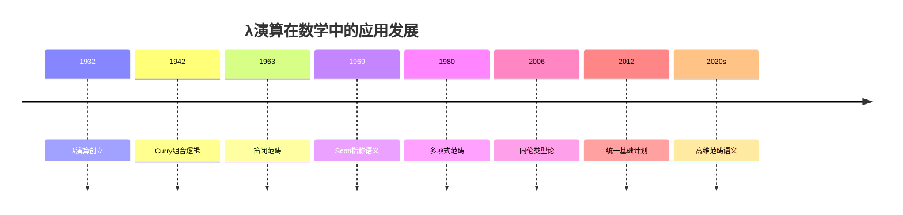
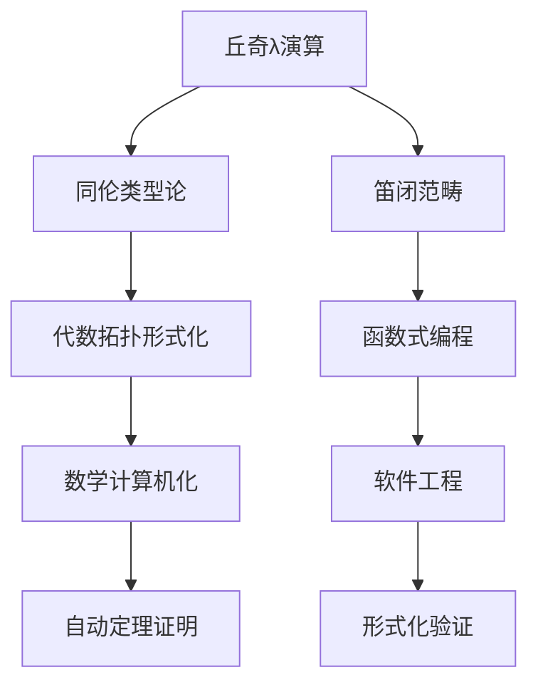

# 丘奇数学理念在现代数学中的应用

**创建日期**: 2026年4月2日
**研究领域**: 丘奇数学理念 - 现代应用与拓展 - 现代数学中的应用
**主题编号**: Ch.05.01 (Church.现代应用与拓展.现代数学中的应用)
**优先级**: P1（高优先级）⭐⭐⭐⭐

---

## 📋 目录

- [丘奇数学理念在现代数学中的应用](#丘奇数学理念在现代数学中的应用)
  - [📋 目录](#-目录)
  - [一、应用概述](#一应用概述)
    - [1.1 丘奇思想的现代影响](#11-丘奇思想的现代影响)
    - [1.2 应用时间线](#12-应用时间线)
  - [二、范畴论中的应用](#二范畴论中的应用)
    - [2.1 笛闭范畴（CCC）](#21-笛闭范畴ccc)
    - [2.2 应用案例：函数式编程的数学基础](#22-应用案例函数式编程的数学基础)
    - [2.3 高阶范畴与类型论](#23-高阶范畴与类型论)
  - [三、代数拓扑中的应用](#三代数拓扑中的应用)
    - [3.1 路径空间与函数类型](#31-路径空间与函数类型)
    - [3.2 同伦论中的λ演算](#32-同伦论中的λ演算)
    - [3.3 应用案例：代数拓扑的构造化](#33-应用案例代数拓扑的构造化)
  - [四、同伦类型论中的应用](#四同伦类型论中的应用)
    - [4.1 同伦类型论（HoTT）概述](#41-同伦类型论hott概述)
    - [4.2 单值公理与丘奇论题](#42-单值公理与丘奇论题)
    - [4.3 应用案例：数学形式化](#43-应用案例数学形式化)
  - [五、证明论中的应用](#五证明论中的应用)
    - [5.1 Curry-Howard对应](#51-curry-howard对应)
    - [5.2 证明归约与计算](#52-证明归约与计算)
    - [5.3 应用案例：定理证明器](#53-应用案例定理证明器)
  - [六、未来展望](#六未来展望)
    - [6.1 新兴领域](#61-新兴领域)
    - [6.2 跨学科应用](#62-跨学科应用)
    - [6.3 丘奇遗产的延续](#63-丘奇遗产的延续)

---

## 一、应用概述

### 1.1 丘奇思想的现代影响

丘奇创立的λ演算和类型论不仅是计算理论的基础，也在现代数学的多个分支中发挥着重要作用：

**主要应用领域**：

- 范畴论：笛闭范畴与λ演算的对应
- 代数拓扑：同伦论中的路径空间
- 同伦类型论：类型作为空间，证明作为路径
- 证明论：Curry-Howard对应

### 1.2 应用时间线



---

## 二、范畴论中的应用

### 2.1 笛闭范畴（CCC）

**定义**：笛闭范畴是带有有限积和指数对象的范畴。

**与λ演算的对应**：

| 范畴论概念 | λ演算概念 |
|-----------|----------|
| 对象 | 类型 |
| 态射 | 项/程序 |
| 积 A×B | 积类型 |
| 指数 B^A | 函数类型 A→B |
| 求值 ev | 应用 |
| 转置 Λ | λ抽象 |

**定理**：笛闭范畴是简单类型λ演算的语义模型。

### 2.2 应用案例：函数式编程的数学基础

```
笛闭范畴 = 函数式编程的代数结构

应用:
- 类型系统的范畴语义
- 程序优化的数学基础
- 编译器正确性证明
```

### 2.3 高阶范畴与类型论

**高阶范畴（n-Categories）**：

- 对象、1-态射、2-态射、...、n-态射
- 推广了λ演算的结构

**应用**：

- 高阶类型论
- 同伦理论
- 量子场论的数学基础

---

## 三、代数拓扑中的应用

### 3.1 路径空间与函数类型

**代数拓扑观点**：

```
空间X中从a到b的路径 ≡ 函数 [0,1] → X, f(0)=a, f(1)=b

这与函数类型 A → B 有深刻类比:
- 路径 = 连续变化的证明
- 同伦 = 路径之间的等价
```

### 3.2 同伦论中的λ演算

**基本群与同伦类型**：

| 拓扑概念 | 类型论对应 |
|---------|-----------|
| 空间X | 类型A |
| 点a∈X | 元素a:A |
| 路径 p:a→b | 证明p:a=b |
| 同伦H:p⇒q | 证明H:p=q（路径的相等）|
| 基本群π₁ | 自等式集合 |

### 3.3 应用案例：代数拓扑的构造化

**问题**：传统代数拓扑使用经典逻辑和选择公理。

**丘奇思想的贡献**：

- 构造性同伦论
- 类型论形式化
- 计算同伦论算法

---

## 四、同伦类型论中的应用

### 4.1 同伦类型论（HoTT）概述

**核心思想**：

- 类型 = 空间
- 项 = 点
- 等式类型 = 路径空间
- 证明 = 路径

**丘奇的影响**：

```
λ演算的类型系统
    ↓
Martin-Löf类型论
    ↓
依赖类型论
    ↓
同伦类型论（加入同伦解释）
```

### 4.2 单值公理与丘奇论题

**单值公理（Univalence Axiom）**：
> 等价即相等：对于类型A、B，(A=B) ≅ (A≃B)

**与丘奇思想的联系**：

- 计算作为证明的归约
- 类型的结构保持性
- 构造性数学的推广

### 4.3 应用案例：数学形式化

**UniMath项目**：

- 使用同伦类型论形式化数学
- Coq证明助手实现
- 基于丘奇类型论传统

**已形式化的内容**：

- 基本代数（群、环、域）
- 代数拓扑（基本群、同伦群）
- 范畴论（笛闭范畴、高阶范畴）

---

## 五、证明论中的应用

### 5.1 Curry-Howard对应

**基本对应**：

| 逻辑 | 计算 |
|-----|-----|
| 命题 | 类型 |
| 证明 | 程序/λ项 |
| 蕴含消除 | 函数应用 |
| 蕴含引入 | λ抽象 |
| 合取 | 积类型 |
| 析取 | 和类型 |

### 5.2 证明归约与计算

**归约规则**：

```
证明归约     计算归约
─────────    ─────────
切消         β归约
证明简化     程序优化
正规形式     范式
```

### 5.3 应用案例：定理证明器

**基于λ演算的定理证明器**：

| 系统 | 特点 | 丘奇影响 |
|-----|-----|---------|
| Coq | 构造演算 | λ演算+依赖类型 |
| Agda | 依赖类型 | Martin-Löf类型论 |
| Lean | 高阶逻辑 | 简单类型λ演算 |

---

## 六、未来展望

### 6.1 新兴领域

**微分类型论**：

- 将微分结构加入类型论
- 机器学习的基础
- 丘奇λ演算的扩展

**概率类型论**：

- 概率计算的类型系统
- 贝叶斯推理的形式化
- 丘奇的概率扩展

**量子类型论**：

- 量子计算的逻辑基础
- 线性逻辑的扩展
- 丘奇λ演算的量子版本

### 6.2 跨学科应用



### 6.3 丘奇遗产的延续

**在21世纪的重要性**：

- 数学基础的新范式
- 计算与证明的统一
- 形式化数学的实现

---

**相关文档**：

- [02-物理学中的应用](../README.md)
- [03-计算机科学中的应用](./../../塞尔数学理念/05-现代应用与拓展/03-计算机科学中的应用.md)
- [../08-知识关联分析/01-概念关联网络.md](../08-知识关联分析/01-概念关联网络.md)

*最后更新：2026年4月2日*
