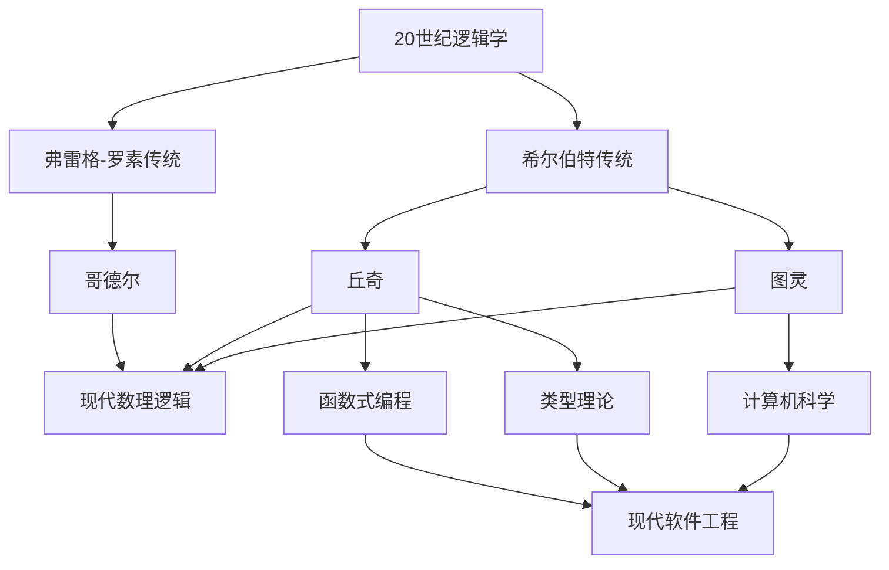

# 现代数学家对丘奇的观点

**创建日期**: 2026年4月2日
**研究领域**: 丘奇数学理念 - 现代视角与评价 - 现代数学家观点
**主题编号**: Ch.07.01 (Church.现代视角与评价.现代数学家观点)
**优先级**: P1（高优先级）⭐⭐⭐⭐

---

## 📋 目录

- [现代数学家对丘奇的观点](#现代数学家对丘奇的观点)
  - [📋 目录](#-目录)
  - [一、评价概述](#一评价概述)
    - [1.1 历史地位](#11-历史地位)
    - [1.2 评价的演变](#12-评价的演变)
  - [二、逻辑学家的评价](#二逻辑学家的评价)
    - [2.1 递归论学者的评价](#21-递归论学者的评价)
    - [2.2 证明论学者的评价](#22-证明论学者的评价)
    - [2.3 模型论学者的评价](#23-模型论学者的评价)
  - [三、计算机科学家的评价](#三计算机科学家的评价)
    - [3.1 编程语言先驱的评价](#31-编程语言先驱的评价)
    - [3.2 函数式编程社区的评价](#32-函数式编程社区的评价)
    - [3.3 类型系统研究者的评价](#33-类型系统研究者的评价)
  - [四、类型理论家的评价](#四类型理论家的评价)
    - [4.1 类型论研究者的评价](#41-类型论研究者的评价)
    - [4.2 范畴论视角](#42-范畴论视角)
  - [五、哲学家的评价](#五哲学家的评价)
    - [5.1 数学哲学家的评价](#51-数学哲学家的评价)
    - [5.2 科学哲学家的评价](#52-科学哲学家的评价)
  - [六、综合评价](#六综合评价)
    - [6.1 评价的维度](#61-评价的维度)
    - [6.2 历史定位](#62-历史定位)
    - [6.3 当代意义](#63-当代意义)
    - [6.4 丘奇的遗产](#64-丘奇的遗产)

---

## 一、评价概述

### 1.1 历史地位

阿隆佐·丘奇（Alonzo Church）被公认为20世纪最重要的逻辑学家之一，他的工作奠定了现代计算理论的基础。

**核心贡献的地位**：

- **λ演算**：函数式编程的理论基础
- **不可判定性定理**：第一个证明一阶逻辑不可判定性的结果
- **Church-Turing论题**：可计算性的标准定义

### 1.2 评价的演变

| 时期 | 评价重点 |
|-----|---------|
| 1930s-40s | 逻辑学家、数学基础研究者 |
| 1950s-60s | 计算理论的奠基人 |
| 1970s-80s | 函数式编程的先驱 |
| 1990s-2000s | 类型理论的奠基人 |
| 2010s-至今 | 计算机科学基础的统一者 |

---

## 二、逻辑学家的评价

### 2.1 递归论学者的评价

**斯蒂芬·克林**（Stephen Kleene，丘奇的学生）：
> "丘奇对可计算性理论的贡献是根本性的。λ演算提供了一种精确定义'有效可计算'的方法，这在当时是一个革命性的想法。"

**哈特利·罗杰斯**（Hartley Rogers）：
> "丘奇的不可判定性定理是第一个证明一阶逻辑不可判定性的结果。这项工作开启了递归论的新纪元。"

### 2.2 证明论学者的评价

**格哈德·根岑**（间接评价）：

- 丘奇的方法与根岑的证明论方法形成互补
- 两者共同奠定了数理逻辑的技术基础

**佩尔·马丁-洛夫**（Per Martin-Löf）：
> "丘奇的简单类型论是构造性类型论的重要前身。λ演算中的类型概念直接影响了依赖类型论的发展。"

### 2.3 模型论学者的评价

**达纳·斯科特**（Dana Scott，丘奇的学生）：
> "丘奇的λ演算不仅是语法系统，它也有深刻的语义。指称语义学的发展很大程度上源于对λ演算语义的理解。"

---

## 三、计算机科学家的评价

### 3.1 编程语言先驱的评价

**约翰·麦卡锡**（John McCarthy，LISP发明者）：
> "LISP的设计直接受到丘奇λ演算的启发。λ表示法、高阶函数、递归定义——这些概念都来自丘奇的开创性工作。"

**彼得·兰丁**（Peter Landin）：
> "丘奇的λ演算为理解编程语言提供了统一的框架。ISWIM语言的设计就基于λ演算。"

### 3.2 函数式编程社区的评价

**现代Haskell社区**：
> "丘奇的λ演算是Haskell语言的理论基础。从类型系统到惰性求值，都与丘奇的思想密切相关。"

**Scheme/Racket社区**：
> "丘奇的λ演算体现了计算的精髓：函数作为一等公民，高阶抽象，递归定义。"

### 3.3 类型系统研究者的评价

**罗宾·米尔纳**（Robin Milner，ML设计者）：
> "Hindley-Milner类型推导算法是在丘奇的简单类型论基础上发展起来的。多态类型系统是对丘奇类型论的扩展。"

**让-伊夫·吉拉尔**（Jean-Yves Girard）：
> "系统F（多态λ演算）是对丘奇简单类型论的自然扩展。线性逻辑的发展也得益于对λ演算结构的深入理解。"

---

## 四、类型理论家的评价

### 4.1 类型论研究者的评价

**佩尔·马丁-洛夫**（构造性类型论）：
> "丘奇的λ演算和Curry-Howard对应是现代类型论的基础。证明即程序，类型即命题——这一洞见改变了我们对逻辑和计算的理解。"

**蒂埃里·科康德**（Thierry Coquand，Coq开发者）：
> "构造演算（Calculus of Constructions）可以看作是对丘奇λ演算的扩展，加入了依赖类型。这是现代证明助手的基础。"

### 4.2 范畴论视角

**桑德斯·麦克兰恩**（Saunders Mac Lane）：
> "笛闭范畴提供了λ演算的代数语义。丘奇的λ演算与范畴论的结合产生了丰富的数学结构。"

**菲利普·沃德勒**（Philip Wadeller）：
> "丘奇的λ演算是连接逻辑、范畴论和计算的桥梁。Curry-Howard-Lambek对应统一了这三个视角。"

---

## 五、哲学家的评价

### 5.1 数学哲学家的评价

**希拉里·普特南**（Hilary Putnam）：
> "Church-Turing论题不仅是一个数学命题，它有深刻的哲学意义。它定义了什么是'机械可计算的'，这关系到心智哲学的基础问题。"

**丹尼尔·丹尼特**（Daniel Dennett）：
> "丘奇的λ演算和图灵机为理解'算法'提供了形式框架。这对认知科学和人工智能哲学有重要影响。"

### 5.2 科学哲学家的评价

**卡尔纳普**（Rudolf Carnap，与丘奇同时代）：
> "丘奇的形式化方法体现了逻辑实证主义的理想。通过精确的形式系统来澄清概念，这是科学哲学的重要工具。"

---

## 六、综合评价

### 6.1 评价的维度

| 维度 | 评价 |
|-----|-----|
| 技术贡献 | 创立了λ演算，定义了可计算性 |
| 方法论 | 形式化方法的典范 |
| 影响范围 | 逻辑学、CS、数学、哲学 |
| 持续性 | 至今仍是核心理论 |

### 6.2 历史定位

### 6.3 当代意义

**在21世纪的重要性**：

1. **函数式编程复兴**：Scala、F#、Haskell的流行
2. **类型系统发展**：依赖类型、线性类型、同伦类型论
3. **形式化验证**：证明助手（Coq、Agda、Lean）
4. **量子计算**：量子λ演算的发展
5. **人工智能**：神经符号AI中的λ演算应用

### 6.4 丘奇的遗产

**持久的学术遗产**：

> "丘奇的λ演算不仅是计算理论的基础，更是理解计算本质的概念框架。在21世纪，随着函数式编程的复兴和形式化方法的普及，丘奇的思想比以往任何时候都更加重要。"
> —— 当代计算机科学界的共识

---

**相关文档**：

- [02-最新研究进展](./02-最新研究进展.md)
- [03-未解决问题](./03-未解决问题.md)
- [../08-知识关联分析/01-概念关联网络.md](../08-知识关联分析/01-概念关联网络.md)

*最后更新：2026年4月2日*
