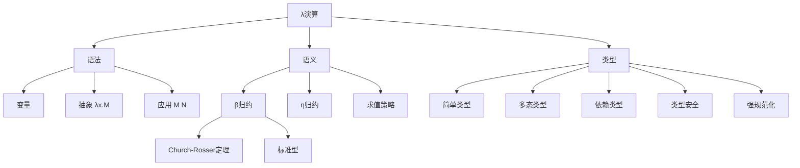
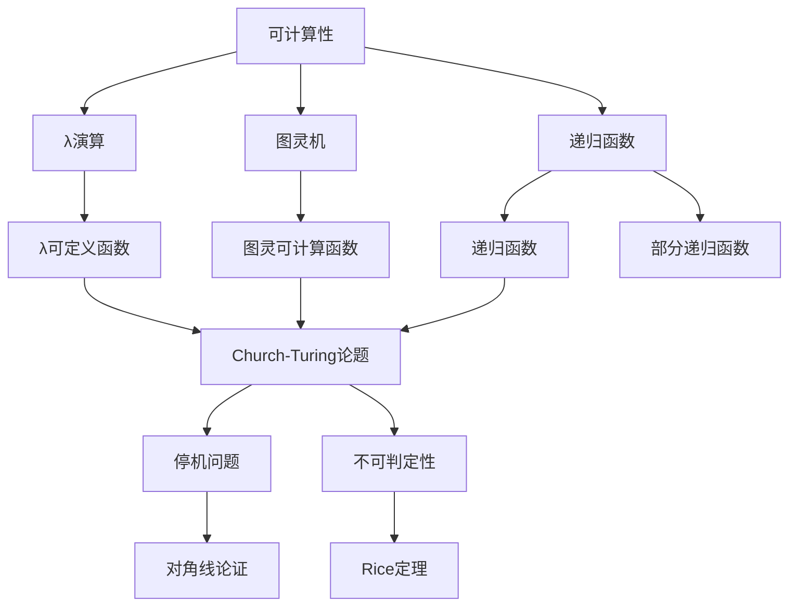
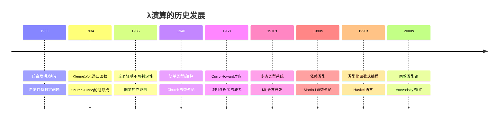

# 概念关联网络

**创建日期**: 2026年4月3日
**研究领域**: 丘奇数学理念 - 知识关联分析 - 概念关联网络
**主题编号**: C.08.01 (Church.知识关联.概念关联网络)
**优先级**: P1（高优先级）⭐⭐⭐⭐

---

## 📋 目录

- [概念关联网络](#概念关联网络)
  - [📋 目录](#目录)
  - [一、核心概念体系](#一核心概念体系)
    - [1.1 丘奇概念体系总览](#11-丘奇概念体系总览)
    - [1.2 核心等式](#12-核心等式)
  - [二、丘奇理论的关联图谱](#二丘奇理论的关联图谱)
    - [2.1 λ演算概念图谱](#21-λ演算概念图谱)
    - [2.2 可计算性概念图谱](#22-可计算性概念图谱)
  - [三、跨学科概念映射](#三跨学科概念映射)
    - [3.1 逻辑-计算-类型映射](#31-逻辑-计算-类型映射)
    - [3.2 形式语言层次映射](#32-形式语言层次映射)
  - [四、历史发展脉络](#四历史发展脉络)
    - [4.1 λ演算的历史源流](#41-λ演算的历史源流)
    - [4.2 概念演化的分支图](#42-概念演化的分支图)
  - [五、现代应用关联](#五现代应用关联)
    - [5.1 编程语言中的概念应用](#51-编程语言中的概念应用)
    - [5.2 类型系统的设计原则](#52-类型系统的设计原则)
  - [🔖 原始文献引用](#原始文献引用)
  - [📚 现代研究文献](#现代研究文献)

---

## 一、核心概念体系

### 1.1 丘奇概念体系总览

丘奇的工作围绕计算的形式化定义展开，形成了独特的概念网络。

```
┌─────────────────────────────────────────────────────────────┐
│                     丘奇概念体系                            │
├─────────────────────────────────────────────────────────────┤
│  第一层：λ演算基础                                          │
│  ├── λ项（变量、抽象、应用）                                 │
│  ├── β归约                                                   │
│  └── 范式                                                    │
├─────────────────────────────────────────────────────────────┤
│  第二层：可计算性                                            │
│  ├── Church-Turing论题                                      │
│  ├── λ可定义性                                               │
│  └── 递归函数                                               │
├─────────────────────────────────────────────────────────────┤
│  第三层：类型论                                              │
│  ├── 简单类型                                                │
│  ├── 类型推导                                                │
│  └── Curry-Howard对应                                       │
└─────────────────────────────────────────────────────────────┘
```

### 1.2 核心等式

**Church-Turing论题**：
$$\text{直观可计算} \equiv \text{λ可定义} \equiv \text{图灵可计算}$$

**Curry-Howard对应**：
$$\text{命题} \leftrightarrow \text{类型} \leftrightarrow \text{程序}$$
$$\text{证明} \leftrightarrow \text{项} \leftrightarrow \text{函数}$$

---

## 二、丘奇理论的关联图谱

### 2.1 λ演算概念图谱



### 2.2 可计算性概念图谱



---

## 三、跨学科概念映射

### 3.1 逻辑-计算-类型映射

**Curry-Howard-Lambek对应的三重映射**：

| 逻辑 | 类型论 | 范畴论 | 计算 |
|-----|-------|-------|-----|
| 命题 | 类型 | 对象 | 数据类型 |
| 证明 | 项 | 态射 | 程序 |
| 合取 ∧ | 积 × | 积 | 元组 |
| 析取 ∨ | 和 + | 余积 | 变体 |
| 蕴含 → | 函数类型 | 指数 | 函数 |

### 3.2 形式语言层次映射

**Chomsky层次与计算模型的对应**：

| 文法类型 | 语言类 | 自动机 | 计算能力 |
|---------|-------|-------|---------|
| 正则 | 正则语言 | 有限自动机 | 最低 |
| 上下文无关 | CFL | 下推自动机 | 中等 |
| 上下文有关 | CSL | 线性有界自动机 | 高 |
| 无限制 | 递归可枚举 | 图灵机 | 通用 |

---

## 四、历史发展脉络

### 4.1 λ演算的历史源流



### 4.2 概念演化的分支图

```
丘奇工作（1930s-1950s）
├── λ演算分支
│   ├── 函数式编程
│   │   ├── Lisp (1958)
│   │   ├── ML (1973)
│   │   └── Haskell (1990)
│   └── 语义学
│       ├── 指称语义
│       └── 操作语义
│
├── 可计算性分支
│   ├── 计算复杂性
│   ├── 算法理论
│   └── 自动机理论
│
└── 类型论分支
    ├── 简单类型论
    ├── 多态类型
    ├── 依赖类型
    └── 同伦类型论
```

---

## 五、现代应用关联

### 5.1 编程语言中的概念应用

**函数式编程的核心概念**：

```haskell
-- 丘奇数（Church编码）
churchZero = \f -> \x -> x
churchSucc n = \f -> \x -> f (n f x)

-- 高阶函数（λ演算的直接应用）
map :: (a -> b) -> [a] -> [b]
filter :: (a -> Bool) -> [a] -> [a]
foldr :: (a -> b -> b) -> b -> [a] -> b
```

### 5.2 类型系统的设计原则

**现代类型系统的丘奇传统**：

1. **类型即规范**：类型定义程序的行为契约
2. **类型推导**：编译时自动推断类型
3. **类型安全**：良类型程序不会出错

**数学表述**：
$$\Gamma \vdash M : \tau \quad \Rightarrow \quad M \text{ 在运行时不会类型错误}$$

---

## 🔖 原始文献引用

1. **Church, A.** (1932). "A set of postulates for the foundation of logic". *Annals of Mathematics*, 33, 346-366.
   - λ演算的奠基性论文

2. **Church, A.** (1940). "A formulation of the simple theory of types". *Journal of Symbolic Logic*, 5, 56-68.
   - 简单类型论的奠基性论文

3. **Curry, H. B., & Feys, R.** (1958). *Combinatory Logic, Vol. I*. North-Holland.
   - 组合子逻辑的经典著作

4. **Howard, W. A.** (1980). "The formulae-as-types notion of construction". In *To H.B. Curry: Essays on Combinatory Logic*. Academic Press.
   - Curry-Howard对应的原始论文

5. **Barendregt, H. P.** (1984). *The Lambda Calculus: Its Syntax and Semantics*. North-Holland.
   - λ演算的标准参考书

---

## 📚 现代研究文献

1. **Pierce, B. C.** (2002). *Types and Programming Languages*. MIT Press.
   - 类型系统和编程语言的标准教材

2. **Wadler, P.** (2015). "Propositions as types". *Communications of the ACM*, 58(12), 75-84.
   - Curry-Howard对应的通俗介绍

3. **Harper, R.** (2016). *Practical Foundations for Programming Languages* (2nd ed.). Cambridge University Press.
   - 编程语言基础的现代处理

4. **Sørensen, M. H., & Urzyczyn, P.** (2006). *Lectures on the Curry-Howard Isomorphism*. Elsevier.
   - Curry-Howard对应的深入教材

5. **The Univalent Foundations Program** (2013). *Homotopy Type Theory*. Institute for Advanced Study.
   - 同伦类型论的奠基文献

---

**文档结束**

*本文件是丘奇数学理念体系的第08模块第01部分，属于知识关联分析主题。*
