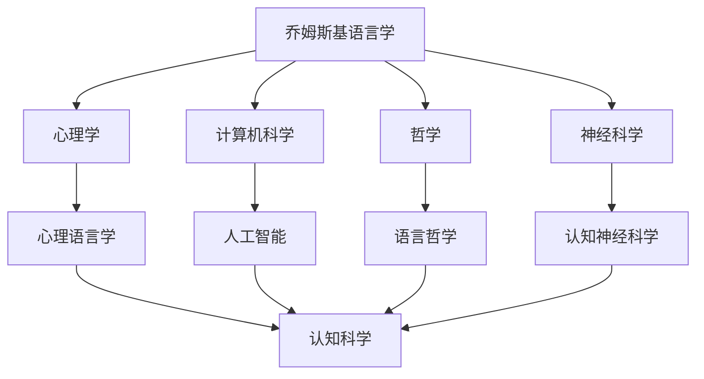

---
msc_primary: "01A99"
---

# 乔姆斯基的教育思想

**创建日期**: 2026年4月2日
**研究领域**: 乔姆斯基数学理念 - 教育与影响 - 教育思想
**主题编号**: Chom.03.01 (Chomsky.教育与影响.教育思想)
**优先级**: P1（高优先级）⭐⭐⭐⭐

---

## 📋 目录

- [乔姆斯基的教育思想](#乔姆斯基的教育思想)
  - [📋 目录](#-目录)
  - [一、乔姆斯基的教育理念概述](#一乔姆斯基的教育理念概述)
    - [1.1 教育哲学基础](#11-教育哲学基础)
    - [1.2 教育目标](#12-教育目标)
  - [二、生成语法的教学方法](#二生成语法的教学方法)
    - [2.1 生成语法的教学路径](#21-生成语法的教学路径)
    - [2.2 深层结构与表层结构](#22-深层结构与表层结构)
    - [2.3 原则与参数框架](#23-原则与参数框架)
  - [三、形式语言理论教育](#三形式语言理论教育)
    - [3.1 Chomsky层次的教学](#31-chomsky层次的教学)
    - [3.2 形式语言与自动机的对应](#32-形式语言与自动机的对应)
    - [3.3 在计算机科学教育中的作用](#33-在计算机科学教育中的作用)
  - [四、认知科学教育观](#四认知科学教育观)
    - [4.1 先天vs后天](#41-先天vs后天)
    - [4.2 语言与思维](#42-语言与思维)
    - [4.3 跨学科整合](#43-跨学科整合)
  - [五、乔姆斯基的学术传承](#五乔姆斯基的学术传承)
    - [5.1 MIT语言学系](#51-mit语言学系)
    - [5.2 生成语法学派](#52-生成语法学派)
    - [5.3 国际影响](#53-国际影响)
  - [六、对现代计算机科学教育的影响](#六对现代计算机科学教育的影响)
    - [6.1 编译器设计课程](#61-编译器设计课程)
    - [6.2 计算理论学习](#62-计算理论学习)
    - [6.3 自然语言处理](#63-自然语言处理)
  - [七、总结](#七总结)
    - [7.1 教育贡献](#71-教育贡献)
    - [7.2 现代意义](#72-现代意义)
    - [7.3 未来展望](#73-未来展望)

---

## 一、乔姆斯基的教育理念概述

### 1.1 教育哲学基础

诺姆·乔姆斯基（Noam Chomsky，1928-）是当代最具影响力的语言学家、认知科学家和政治评论家。他在MIT任教超过60年，培养了一批杰出的语言学家和认知科学家。

**核心教育信念**：

- **理性主义**：强调先天认知结构的重要性
- **批判精神**：鼓励学生质疑权威和传统观点
- **跨学科视野**：打破学科界限，追求知识的统一

### 1.2 教育目标

乔姆斯基认为语言学和认知科学教育应当实现：

1. **理解语言能力**：掌握人类语言的本质特征
2. **形式化思维**：使用严格的数学和逻辑工具
3. **批判性分析**：评估理论和证据的能力
4. **社会责任感**：知识分子的社会责任

---

## 二、生成语法的教学方法

### 2.1 生成语法的教学路径

**渐进式教学法**：

| 阶段 | 内容 | 目标 |
|-----|-----|-----|
| 基础 | 短语结构语法 | 理解重写规则 |
| 核心 | 转换规则 | 掌握句法转换 |
| 高级 | 约束理论 | 理解原则与参数 |
| 现代 | 最简方案 | 了解最新发展 |

### 2.2 深层结构与表层结构

乔姆斯基强调教学中深层结构和表层结构的区分：

**教学示例**：

```
主动句: John hit Mary.
被动句: Mary was hit by John.

深层结构（语义表示）:
[AGENT John] [ACTION hit] [PATIENT Mary]

表层结构（语音形式）:
通过转换规则生成
```

### 2.3 原则与参数框架

**普遍语法教学**：

```
普遍语法 = 原则（所有语言共有） + 参数（语言间差异）

教学示例:
- 原则: 结构依赖、空主语等
- 参数: 语序（SVO/SOV/VSO）、空主语参数等
```

---

## 三、形式语言理论教育

### 3.1 Chomsky层次的教学

**层次结构教学**：

```
Chomsky层次:

0型（无限制文法） → 图灵机
    ↓
1型（上下文有关） → 线性有界自动机
    ↓
2型（上下文无关） → 下推自动机
    ↓
3型（正则文法）   → 有限自动机
```

### 3.2 形式语言与自动机的对应

| 文法类型 | 识别设备 | 闭包性质 | 判定问题 |
|---------|---------|---------|---------|
| 正则 | 有限自动机 | 良好 | 可判定 |
| 上下文无关 | 下推自动机 | 部分 | 部分可判定 |
| 上下文有关 | 线性有界自动机 | 较差 | 困难 |
| 无限制 | 图灵机 | 差 | 不可判定 |

### 3.3 在计算机科学教育中的作用

**编译原理课程**：

```
课程结构:
1. 词法分析（正则表达式、有限自动机）
2. 语法分析（上下文无关文法、下推自动机）
3. 语义分析（属性文法）
4. 代码生成与优化
```

---

## 四、认知科学教育观

### 4.1 先天vs后天

乔姆斯基关于语言习得的观点对教育的影响：

**先天论立场**：

- 语言能力是人类生物天赋
- 普遍语法是先天结构
- 经验只是触发语言发展

**教育启示**：

- 尊重认知发展的内在规律
- 提供适当的语言输入环境
- 避免过度强调后天训练

### 4.2 语言与思维

**语言决定论批判**：

- 反对Sapir-Whorf假说的强版本
- 强调普遍认知结构
- 语言的普遍性高于差异性

### 4.3 跨学科整合

乔姆斯基推动的认知科学跨学科教育：



---

## 五、乔姆斯基的学术传承

### 5.1 MIT语言学系

乔姆斯基在MIT建立了世界领先的语言学研究中心：

**代表性学生**：

- **乔治·莱考夫**（George Lakoff）：认知语言学创始人
- **约翰·罗斯**（John Ross）：句法学家
- **莫里斯·哈勒**（Morris Halle）：音系学家
- **詹姆斯·麦考利**（James McCawley）：生成语义学

### 5.2 生成语法学派

**理论发展与分支**：

```
乔姆斯基生成语法
    ↓
标准理论（1965）
    ↓
扩展标准理论（1970s）
    ↓
管辖与约束理论（1980s）
    ↓
最简方案（1990s-至今）
    ↓
    ├── 最简方案（主流）
    ├── 生成语义学（分支）
    ├── 词汇功能语法（分支）
    └── 中心词驱动短语结构语法（分支）
```

### 5.3 国际影响

乔姆斯基语言学在世界各地的传播：

- 欧洲：生成语法学派的发展
- 亚洲：在中国、日本的影响
- 其他地区：拉丁美洲、中东

---

## 六、对现代计算机科学教育的影响

### 6.1 编译器设计课程

乔姆斯基形式语言理论是编译器课程的基础：

**标准教材内容**：

- 正则表达式和有限自动机（词法分析）
- 上下文无关文法（语法分析）
- LL和LR分析器
- 语法制导翻译

### 6.2 计算理论学习

**计算理论课程中的Chomsky层次**：

```
课程结构:
1. 有限自动机和正则语言
2. 下推自动机和上下文无关语言
3. 图灵机和可计算性
4. 复杂性和可判定性
```

### 6.3 自然语言处理

**NLP教育中的乔姆斯基影响**：

| 时期 | 方法 | 乔姆斯基影响 |
|-----|-----|------------|
| 1950s-60s | 规则系统 | 生成语法 |
| 1970s-80s | 统计方法 | 有限状态方法 |
| 1990s-2000s | 概率模型 | 形式化基础 |
| 2010s-至今 | 深度学习 | 层级结构 |

---

## 七、总结

### 7.1 教育贡献

乔姆斯基在教育方面的主要贡献：

1. **建立了生成语法教学体系**：从标准理论到最简方案
2. **推动了形式语言学教育**：数学方法在语言学中的应用
3. **培养了跨学科人才**：语言学家、认知科学家、计算机科学家
4. **影响了计算机科学教育**：形式语言理论成为核心课程

### 7.2 现代意义

在当代教育中，乔姆斯基的思想仍然重要：

- **认知科学教育**：先天结构vs后天学习的讨论
- **计算机科学教育**：形式语言理论的核心理论
- **语言教育**：普遍语法对语言教学的启示
- **批判思维教育**：知识分子的社会责任

### 7.3 未来展望

乔姆斯基教育思想的未来：

- 与神经科学的结合
- 人工智能时代的语言研究
- 计算语言学的进一步发展
- 跨学科整合的深化

---

**相关文档**：

- [02-学生与学派](./02-学生与学派.md)
- [03-对后世影响](./03-对后世影响.md)
- [../04-历史与传记/01-生平与学术生涯.md](../04-历史与传记/01-生平与学术生涯.md)

*最后更新：2026年4月2日*
