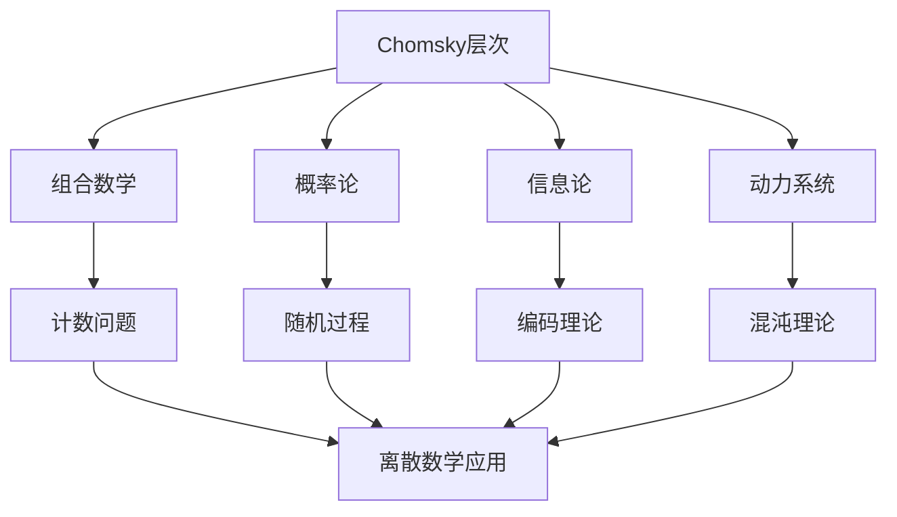

# 乔姆斯基数学理念在现代数学中的应用

**创建日期**: 2026年4月2日
**研究领域**: 乔姆斯基数学理念 - 现代应用与拓展 - 现代数学中的应用
**主题编号**: Chom.05.01 (Chomsky.现代应用与拓展.现代数学中的应用)
**优先级**: P1（高优先级）⭐⭐⭐⭐

---

## 📋 目录

- [乔姆斯基数学理念在现代数学中的应用](#乔姆斯基数学理念在现代数学中的应用)
  - [📋 目录](#目录)
  - [一、应用概述](#一应用概述)
    - [1.1 乔姆斯基思想的数学影响](#11-乔姆斯基思想的数学影响)
    - [1.2 Chomsky层次的数学意义](#12-chomsky层次的数学意义)
  - [二、组合数学中的应用](#二组合数学中的应用)
    - [2.1 形式幂级数](#21-形式幂级数)
    - [2.2 计数组合学](#22-计数组合学)
    - [2.3 解析组合学](#23-解析组合学)
  - [三、概率论与随机过程](#三概率论与随机过程)
    - [3.1 随机语言](#31-随机语言)
    - [3.2 马尔可夫链](#32-马尔可夫链)
    - [3.3 大偏差理论](#33-大偏差理论)
  - [四、信息论中的应用](#四信息论中的应用)
    - [4.1 编码理论](#41-编码理论)
    - [4.2 数据压缩](#42-数据压缩)
    - [4.3 信道容量](#43-信道容量)
  - [五、动力系统中的应用](#五动力系统中的应用)
    - [5.1 符号动力学](#51-符号动力学)
    - [5.2 Sofic系统](#52-sofic系统)
    - [5.3 复杂度理论](#53-复杂度理论)
  - [六、未来展望](#六未来展望)
    - [6.1 新兴领域](#61-新兴领域)
    - [6.2 跨学科应用](#62-跨学科应用)
    - [6.3 乔姆斯基遗产的延续](#63-乔姆斯基遗产的延续)

---

## 一、应用概述

### 1.1 乔姆斯基思想的数学影响

乔姆斯基的形式语言理论虽然起源于语言学，但其数学结构在组合数学、概率论、信息论等领域有重要应用：

**主要应用领域**：

- 组合数学：计数问题、枚举组合学
- 概率论：随机语言、马尔可夫过程
- 信息论：编码理论、数据压缩
- 动力系统：符号动力学、混沌理论

### 1.2 Chomsky层次的数学意义

| 文法类型 | 自动机 | 数学结构 |
|---------|-------|---------|
| 0型（无限制） | 图灵机 | 递归可枚举集 |
| 1型（上下文有关） | 线性有界自动机 | 上下文有关语言 |
| 2型（上下文无关） | 下推自动机 | 代数语言 |
| 3型（正则） | 有限自动机 | 有限半群 |

---

## 二、组合数学中的应用

### 2.1 形式幂级数

**上下文无关语言与代数函数**：

上下文无关语言的生成函数是代数的：

$$G(z) = \sum_{n \geq 0} a_n z^n$$

其中$a_n$是长度为$n$的单词数。

**应用案例**：

- Dyck路径的计数
- 括号匹配的组合问题
- 树结构的枚举

### 2.2 计数组合学

**正则语言的计数**：

正则语言的计数序列满足线性递推关系：

$$a_n = c_1 a_{n-1} + c_2 a_{n-2} + ... + c_k a_{n-k}$$

**转移矩阵方法**：

```
有限自动机的转移矩阵 M

单词数 = 初始向量 · M^n · 终止向量
```

### 2.3 解析组合学

**Flajolet方法**：

- 将组合结构映射到生成函数
- 使用复分析技术提取渐近公式
- 应用于上下文无关语言

---

## 三、概率论与随机过程

### 3.1 随机语言

**概率上下文无关文法（PCFG）**：

$$P(S \rightarrow NP\ VP) = p$$

**数学应用**：

- 分支过程
- Galton-Watson过程
- 灭绝概率计算

### 3.2 马尔可夫链

**正则语言与马尔可夫链的联系**：

有限自动机 ↔ 有限状态马尔可夫链

**转移概率**：
$$P(X_{n+1} = j | X_n = i) = p_{ij}$$

**应用案例**：

- 符号动力学
- 遍历理论
- 随机游走

### 3.3 大偏差理论

**形式语言的熵**：

$$H = \lim_{n \to \infty} \frac{\log a_n}{n}$$

其中$a_n$是长度为$n$的单词数。

**应用**：

- 熵率计算
- 编码效率分析
- 信息论边界

---

## 四、信息论中的应用

### 4.1 编码理论

**有限自动机与编码**：

| 编码类型 | 自动机模型 | 应用 |
|---------|-----------|-----|
| 分组码 | 有限状态机 | 数字通信 |
| 卷积码 | 移位寄存器 | 卫星通信 |
| 涡轮码 | 迭代解码器 | 深空通信 |

### 4.2 数据压缩

**语法压缩**：

```
上下文无关文法压缩:
- 将字符串表示为语法派生树
- 压缩率依赖于文法的简洁性
- 应用于生物信息学（DNA序列）
```

**Kolmogorov复杂度**：
$$K(x) = \min\{|p| : U(p) = x\}$$

与乔姆斯基层次的关系：

- 正则语言：低复杂度
- 上下文无关：中等复杂度
- 无限制文法：任意复杂度

### 4.3 信道容量

**形式语言的信道容量**：

对于受限语言$L$，信道容量为：

$$C = \lim_{n \to \infty} \frac{\log |L \cap \Sigma^n|}{n}$$

**应用**：

- 磁存储（游程限制码）
- 光存储
- DNA数据存储

---

## 五、动力系统中的应用

### 5.1 符号动力学

**符号空间**：

$$\Sigma^\mathbb{Z} = \{(x_n)_{n \in \mathbb{Z}} : x_n \in \Sigma\}$$

**移位映射**：
$$(\sigma x)_n = x_{n+1}$$

**与子移位**：禁止某些模式的符号序列集合。

### 5.2 Sofic系统

**定义**：有限型子移位的因子。

**与正则语言的联系**：

- Sofic系统 ↔ 正则语言
- 有限型 ↔ 有限记忆

**应用**：

- 混沌理论
- 遍历理论
- 统计力学

### 5.3 复杂度理论

**Kolmogorov-Sinai熵**：

$$h_{KS}(T) = \sup_{\mathcal{P}} h(T, \mathcal{P})$$

**与语言复杂度的联系**：

- 周期性：零熵
- 有限型：正熵
- 混合系统：最大熵

---

## 六、未来展望

### 6.1 新兴领域

**量子形式语言**：

- 量子自动机
- 量子上下文无关文法
- 量子信息处理

**生物数学**：

- RNA二级结构（上下文无关）
- DNA计算
- 蛋白质折叠的形式模型

**统计学习理论**：

- PAC学习框架
- 文法归纳
- 深度学习与形式语言

### 6.2 跨学科应用



### 6.3 乔姆斯基遗产的延续

**在21世纪的重要性**：

- 形式化方法的跨学科应用
- 计算与数学的统一
- 复杂系统的建模工具

---

**相关文档**：

- [02-物理学中的应用](./02-物理学中的应用.md)
- [03-计算机科学中的应用](./03-计算机科学中的应用.md)
- [../08-知识关联分析/01-概念关联网络.md](../08-知识关联分析/01-概念关联网络.md)

*最后更新：2026年4月2日*
