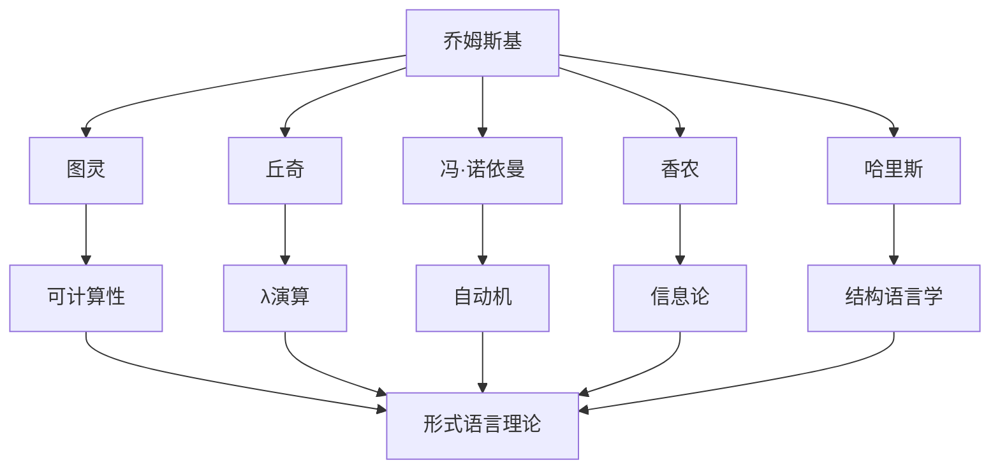
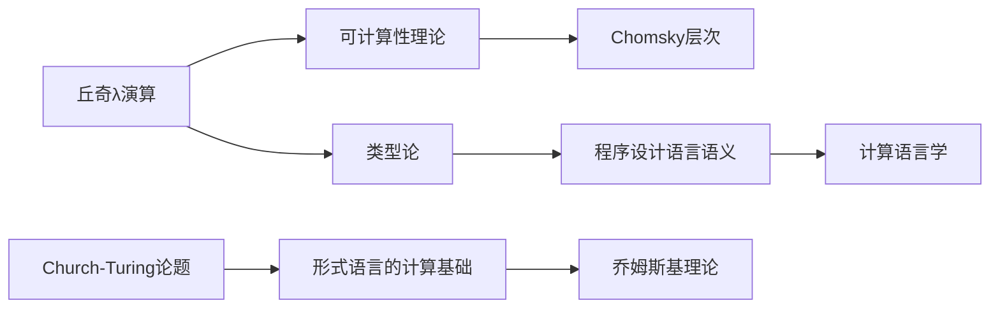
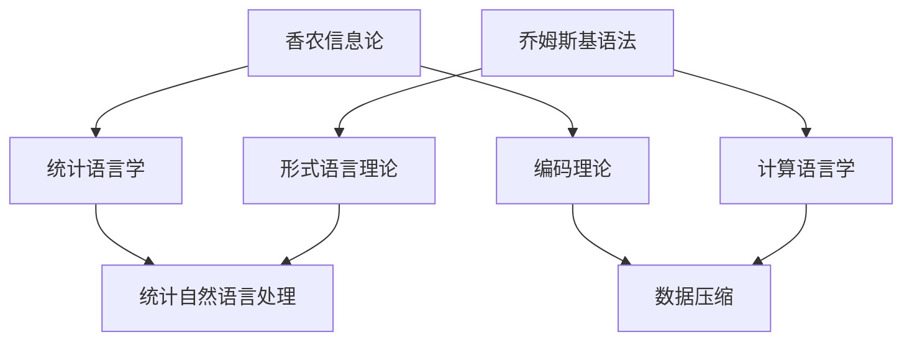
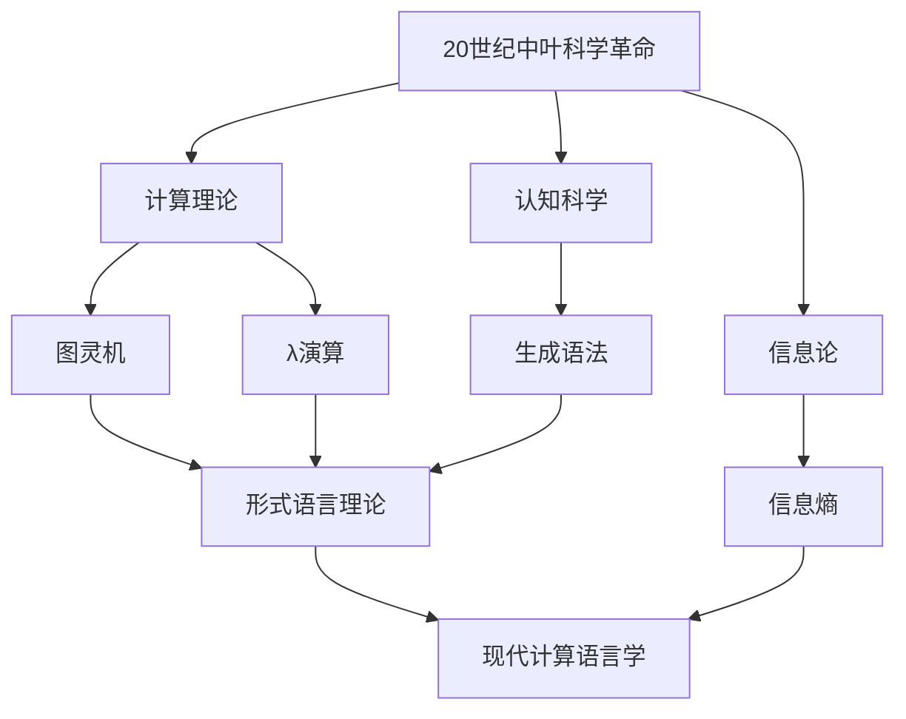

# 乔姆斯基与同时代数学家对比

**创建日期**: 2026年4月2日
**研究领域**: 乔姆斯基数学理念 - 对比研究 - 与同时代数学家对比
**主题编号**: Chom.06.01 (Chomsky.对比研究.与同时代数学家对比)
**优先级**: P1（高优先级）⭐⭐⭐⭐

---

## 📋 目录

- [乔姆斯基与同时代数学家对比](#乔姆斯基与同时代数学家对比)
  - [📋 目录](../README.md)
  - [一、同时代背景概述](#一同时代背景概述)
    - [1.1 时代背景（1940s-1960s）](#11-时代背景1940s-1960s)
    - [1.2 乔姆斯基的学术网络](#12-乔姆斯基的学术网络)
  - [二、与图灵的对比](#二与图灵的对比)
    - [2.1 基本背景](#21-基本背景)
    - [2.2 学术贡献对比](#22-学术贡献对比)
    - [2.3 形式语言理论的联系](#23-形式语言理论的联系)
    - [2.4 方法论对比](#24-方法论对比)
  - [三、与丘奇的对比](#三与丘奇的对比)
    - [3.1 基本背景](#31-基本背景)
    - 3.2 λ演算与形式语言
    - [3.3 学术影响关系](#33-学术影响关系)
    - [3.4 对比总结](#34-对比总结)
  - [四、与冯·诺依曼的对比](#四与冯诺依曼的对比)
    - [4.1 基本背景](#41-基本背景)
    - [4.2 自动机理论的对比](#42-自动机理论的对比)
    - [4.3 自复制与生成](#43-自复制与生成)
    - [4.4 学术风格对比](#44-学术风格对比)
  - [五、与香农的对比](#五与香农的对比)
    - [5.1 基本背景](#51-基本背景)
    - [5.2 信息论与形式语言](#52-信息论与形式语言)
    - [5.3 共同点与差异](#53-共同点与差异)
    - [5.4 交叉影响](#54-交叉影响)
  - [六、比较总结](#六比较总结)
    - [6.1 共同特征](#61-共同特征)
    - [6.2 乔姆斯基的独特贡献](#62-乔姆斯基的独特贡献)
    - [6.3 历史定位](#63-历史定位)

---

## 一、同时代背景概述

### 1.1 时代背景（1940s-1960s）

20世纪中叶是计算理论和形式语言理论的黄金时期：

**关键发展**：

- 电子计算机的诞生（1940s）
- 信息论的创立（1948）
- 人工智能的兴起（1956）
- 认知科学的诞生（1950s-60s）

**学术氛围**：

- 跨学科合作（数学、逻辑、工程、心理学）
- 军事和冷战背景下的资助
- 大学研究体系的扩张

### 1.2 乔姆斯基的学术网络



---

## 二、与图灵的对比

### 2.1 基本背景

| 特征 | 艾伦·图灵 | 诺姆·乔姆斯基 |
|-----|-----------|--------------|
| 生卒 | 1912-1954 | 1928- |
| 国籍 | 英国 | 美国 |
| 主要领域 | 可计算性、密码学、AI | 语言学、认知科学、政治 |
| 学术背景 | 数学、逻辑 | 语言学、逻辑 |

### 2.2 学术贡献对比

**图灵的贡献**：

- 图灵机（1936）：可计算性的形式定义
- 停机问题：计算局限性的发现
- 图灵测试：机器智能的判据

**乔姆斯基的贡献**：

- Chomsky层次（1956）：形式语言的分类
- 转换语法：自然语言的生成模型
- 先天语言观：语言能力的生物学基础

### 2.3 形式语言理论的联系

```
图灵的可计算性 → 乔姆斯基的形式语言

图灵机         ↔ 0型文法（无限制文法）
线性有界自动机  ↔ 1型文法（上下文有关）
下推自动机      ↔ 2型文法（上下文无关）
有限自动机      ↔ 3型文法（正则文法）
```

### 2.4 方法论对比

| 方面 | 图灵 | 乔姆斯基 |
|-----|-----|---------|
| 研究方法 | 数学抽象 | 数学+语言学 |
| 目标 | 定义可计算性 | 描述自然语言 |
| 哲学取向 | 功能主义 | 先天论/理性主义 |
| 影响领域 | CS、AI | 语言学、认知科学 |

---

## 三、与丘奇的对比

### 3.1 基本背景

| 特征 | 阿隆佐·丘奇 | 诺姆·乔姆斯基 |
|-----|------------|--------------|
| 生卒 | 1903-1995 | 1928- |
| 主要领域 | 数理逻辑、可计算性 | 语言学、逻辑 |
| 学术职位 | 普林斯顿、UCLA | MIT |

### 3.2 λ演算与形式语言

**丘奇的λ演算**：

- 函数抽象与应用
- 可计算性的另一种定义
- 函数式编程的基础

**乔姆斯基的形式语言**：

- 重写规则系统
- 生成语法理论
- 编译器设计的理论基础

### 3.3 学术影响关系



### 3.4 对比总结

| 对比项 | 丘奇 | 乔姆斯基 |
|-------|-----|---------|
| 核心问题 | 什么是可计算的？ | 什么是可生成的语言？ |
| 形式系统 | λ演算 | 重写文法系统 |
| 计算模型 | 函数式 | 字符串重写 |
| 语言观 | 形式系统 | 先天能力 |

---

## 四、与冯·诺依曼的对比

### 4.1 基本背景

| 特征 | 冯·诺依曼 | 诺姆·乔姆斯基 |
|-----|-----------|--------------|
| 生卒 | 1903-1957 | 1928- |
| 国籍 | 匈牙利-美国 | 美国 |
| 主要领域 | 数学、物理、计算机 | 语言学、认知科学 |

### 4.2 自动机理论的对比

**冯·诺依曼的贡献**：

- 元胞自动机：自复制系统的数学模型
- 冯·诺依曼架构：现代计算机的设计基础
- 博弈论：理性决策的数学理论

**乔姆斯基的贡献**：

- 形式文法：语言生成的形式系统
- 转换语法：深层结构与表层结构
- 语言习得装置（LAD）：先天语言能力

### 4.3 自复制与生成

```
冯·诺依曼自复制:
通用构造器 + 蓝图 → 复制自身

乔姆斯基生成语法:
有限规则 + 词汇 → 无限句子集合

共同点: 有限描述生成复杂结构
```

### 4.4 学术风格对比

| 方面 | 冯·诺依曼 | 乔姆斯基 |
|-----|----------|---------|
| 工作方式 | 广泛涉猎多个领域 | 深度挖掘核心问题 |
| 数学风格 | 应用导向 | 理论导向 |
| 社会影响 | 科学顾问（曼哈顿计划）| 公共知识分子 |
| 政治立场 | 支持冷战政策 | 批评美国外交政策 |

---

## 五、与香农的对比

### 5.1 基本背景

| 特征 | 克劳德·香农 | 诺姆·乔姆斯基 |
|-----|------------|--------------|
| 生卒 | 1916-2001 | 1928- |
| 主要领域 | 电气工程、数学 | 语言学、认知科学 |
| 核心贡献 | 信息论 | 转换生成语法 |

### 5.2 信息论与形式语言

**香农的信息论**（1948）：

- 信息的数学定义：$H(X) = -\sum p(x) \log p(x)$
- 信道容量：$C = B \log_2(1 + S/N)$
- 编码理论：有效传输信息

**乔姆斯基的形式语言**（1956）：

- 语言的代数描述
- Chomsky层次
- 语法与自动机的对应

### 5.3 共同点与差异

**共同点**：

- 都关注形式化和数学化
- 都对通信/语言感兴趣
- 都有工程/应用的动机

**差异**：

| 方面 | 香农 | 乔姆斯基 |
|-----|-----|---------|
| 研究对象 | 信号传输 | 语言能力 |
| 数学工具 | 概率论 | 代数、逻辑 |
| 应用领域 | 通信工程 | 语言学、心理学 |
| 语言观 | 统计的 | 先天的、结构的 |

### 5.4 交叉影响



---

## 六、比较总结

### 6.1 共同特征

与乔姆斯基同时代的数学家和科学家共享以下特征：

1. **形式化方法**：使用数学精确描述复杂现象
2. **跨学科视野**：打破传统学科界限
3. **计算视角**：将计算作为核心概念
4. **战后繁荣**：受益于二战后学术环境

### 6.2 乔姆斯基的独特贡献

| 方面 | 乔姆斯基的独特性 |
|-----|-----------------|
| 语言观 | 先天论vs行为主义 |
| 方法论 | 数学+生物学+心理学 |
| 影响范围 | 从学术到政治哲学 |
| 持续性 | 70年活跃学术生涯 |

### 6.3 历史定位



---

**相关文档**：

- [02-与前人思想对比](../README.md)
- [03-对后继者影响分析](../README.md)
- [../04-历史与传记/01-生平与学术生涯.md](./../../丘奇数学理念/04-历史与传记/01-生平与学术生涯.md)

*最后更新：2026年4月2日*
