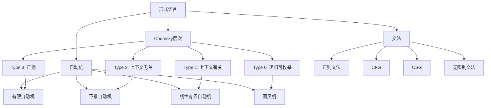
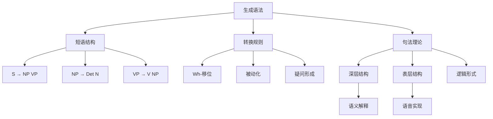
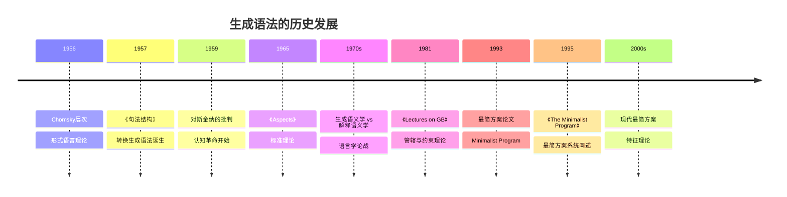

# 概念关联网络

**创建日期**: 2026年4月3日
**研究领域**: 乔姆斯基数学理念 - 知识关联分析 - 概念关联网络
**主题编号**: CH.08.01 (Chomsky.知识关联.概念关联网络)
**优先级**: P1（高优先级）⭐⭐⭐⭐

---

## 📋 目录

- [概念关联网络](#概念关联网络)
  - [📋 目录](../README.md#目录)
  - [一、核心概念体系](#一核心概念体系)
    - [1.1 乔姆斯基概念体系总览](#11-乔姆斯基概念体系总览)
    - [1.2 核心关系](#12-核心关系)
  - [二、乔姆斯基理论的关联图谱](#二乔姆斯基理论的关联图谱)
    - [2.1 形式语言概念图谱](#21-形式语言概念图谱)
    - [2.2 生成语法概念图谱](#22-生成语法概念图谱)
  - [三、跨学科概念映射](#三跨学科概念映射)
    - [3.1 语言-计算映射](#31-语言-计算映射)
    - [3.2 生成语法-逻辑映射](#32-生成语法-逻辑映射)
  - [四、历史发展脉络](#四历史发展脉络)
    - [4.1 生成语法的历史源流](#41-生成语法的历史源流)
    - [4.2 概念演化的分支图](#42-概念演化的分支图)
  - [五、现代应用关联](#五现代应用关联)
    - [5.1 编译器设计中的乔姆斯基方法](#51-编译器设计中的乔姆斯基方法)
    - [5.2 自然语言处理中的应用](#52-自然语言处理中的应用)
  - [🔖 原始文献引用](../README.md#原始文献引用)
  - [📚 现代研究文献](../README.md#现代研究文献)

---

## 一、核心概念体系

### 1.1 乔姆斯基概念体系总览

乔姆斯基的工作围绕语言的形式化理论展开，建立了独特的概念网络。

```
┌─────────────────────────────────────────────────────────────┐
│                     乔姆斯基概念体系                         │
├─────────────────────────────────────────────────────────────┤
│  第一层：形式语言基础                                        │
│  ├── Chomsky层次                                             │
│  ├── 文法（正则、上下文无关等）                              │
│  └── 生成能力                                                │
├─────────────────────────────────────────────────────────────┤
│  第二层：生成语法                                            │
│  ├── 短语结构规则                                            │
│  ├── 转换规则                                                │
│  └── 深层/表层结构                                           │
├─────────────────────────────────────────────────────────────┤
│  第三层：语言理论                                            │
│  ├── 普遍语法（UG）                                          │
│  ├── 语言习得装置（LAD）                                     │
│  └── 能力与运用                                              │
└─────────────────────────────────────────────────────────────┘
```

### 1.2 核心关系

**Chomsky层次包含关系**：
$$\text{Type 3} \subset \text{Type 2} \subset \text{Type 1} \subset \text{Type 0}$$

**生成能力对应**：
$$\text{文法} \leftrightarrow \text{自动机} \leftrightarrow \text{计算能力}$$

---

## 二、乔姆斯基理论的关联图谱

### 2.1 形式语言概念图谱



### 2.2 生成语法概念图谱



---

## 三、跨学科概念映射

### 3.1 语言-计算映射

**形式语言与计算模型的对应**：

| 语言类型 | 文法 | 自动机 | 复杂性 |
|---------|-----|-------|-------|
| 正则 | 正则文法 | DFA/NFA | 最低 |
| 上下文无关 | CFG | PDA | 多项式 |
| 上下文有关 | CSG | LBA | PSPACE |
| 递归可枚举 | 无限制 | 图灵机 | 不可判定 |

### 3.2 生成语法-逻辑映射

**Montague语法与生成语法**：

| 生成语法 | Montague语法 | 说明 |
|---------|-------------|-----|
| 短语结构 | 类型论 | 句法组合 |
| 转换规则 | λ演算 | 语义计算 |
| 深层结构 | 内涵逻辑 | 语义表示 |

---

## 四、历史发展脉络

### 4.1 生成语法的历史源流



### 4.2 概念演化的分支图

```
乔姆斯基工作（1950s-）
├── 形式语言分支
│   ├── Chomsky层次
│   ├── 自动机理论
│   ├── 编译原理
│   └── 计算复杂性
│
├── 生成语法分支
│   ├── 标准理论
│   ├── 扩展标准理论
│   ├── 管辖与约束
│   ├── 最简方案
│   └── 变体理论
│       ├── LFG
│       ├── HPSG
│       └── 构式语法
│
└── 认知科学分支
    ├── 语言习得理论
    ├── 普遍语法
    └── 心智模块化
```

---

## 五、现代应用关联

### 5.1 编译器设计中的乔姆斯基方法

**词法分析**：
使用正则表达式（Type 3）识别词法单元。

**语法分析**：
使用上下文无关文法（Type 2）进行语法分析。

```
源代码 → 词法分析 → 语法分析 → 语义分析 → 代码生成
         [正则文法]    [CFG]       [类型检查]   [代码优化]
```

### 5.2 自然语言处理中的应用

**形式文法在NLP中的应用**：

**上下文无关文法解析**：
用于句法分析和语义角色标注。

**概率CFG**：
$$P(\text{parse}) = \prod_{i} P(\text{rule}_i)$$

**转换语法的影响**：
现代句法理论中的移位操作源于乔姆斯基的转换规则。

---

## 🔖 原始文献引用

1. **Chomsky, N.** (1956). "Three models for the description of language". *IRE Transactions on Information Theory*, 2(3), 113-124.
   - Chomsky层次的奠基性论文

2. **Chomsky, N.** (1957). *Syntactic Structures*. Mouton.
   - 生成语法的奠基性著作

3. **Chomsky, N.** (1959). "A review of B. F. Skinner's Verbal Behavior". *Language*, 35(1), 26-58.
   - 对行为主义的著名批判

4. **Chomsky, N.** (1965). *Aspects of the Theory of Syntax*. MIT Press.
   - 标准理论的系统阐述

5. **Chomsky, N.** (1995). *The Minimalist Program*. MIT Press.
   - 最简方案的系统阐述

---

## 📚 现代研究文献

1. **Hopcroft, J. E., Motwani, R., & Ullman, J. D.** (2006). *Introduction to Automata Theory, Languages, and Computation* (3rd ed.). Addison-Wesley.
   - 自动机理论的标准教材

2. **Sipser, M.** (2012). *Introduction to the Theory of Computation* (3rd ed.). Cengage Learning.
   - 计算理论教材

3. **Jurafsky, D., & Martin, J. H.** (2019). *Speech and Language Processing* (3rd ed.). Pearson.
   - 自然语言处理的标准教材

4. **Carnie, A.** (2013). *Syntax: A Generative Introduction* (3rd ed.). Wiley-Blackwell.
   - 生成语法导论教材

5. **Adger, D.** (2003). *Core Syntax: A Minimalist Approach*. Oxford University Press.
   - 最简方案的现代教材

---

**文档结束**

*本文件是乔姆斯基数学理念体系的第08模块第01部分，属于知识关联分析主题。*
