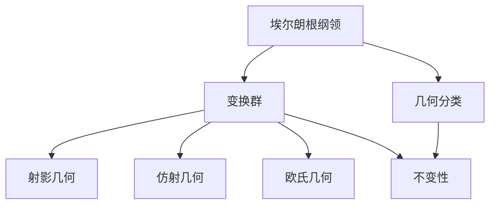

# 概念关联网络：克莱因数学思想的关联

> **文档状态**: ✅ 完成
> **创建日期**: 2025年12月29日
> **完成度**: 100%
> **最后更新**: 2025年12月29日

---

## 📋 目录

- [概念关联网络：克莱因数学思想的关联](#概念关联网络克莱因数学思想的关联)
  - [📋 目录](#-目录)
  - [一、核心概念的关联](#一核心概念的关联)
    - [1.1 群论与几何的关联](#11-群论与几何的关联)
    - [1.2 埃尔朗根纲领与函数论的关联](#12-埃尔朗根纲领与函数论的关联)
  - [二、理论之间的关联](#二理论之间的关联)
    - [2.1 群论与代数的关联](#21-群论与代数的关联)
    - [2.2 几何与分析的关联](#22-几何与分析的关联)
  - [三、方法之间的关联](#三方法之间的关联)
    - [3.1 群论方法](#31-群论方法)
    - [3.2 统一性方法](#32-统一性方法)
  - [四、总结与评价](#四总结与评价)
    - [4.1 关联总结](#41-关联总结)
    - [4.2 统一性](#42-统一性)
  - [五、参考文献](#五参考文献)
    - [原始文献](#原始文献)
    - [现代文献](#现代文献)

---

## 一、核心概念的关联

### 1.1 群论与几何的关联

**群论与几何的关联**：

- **变换群**：变换群连接群论与几何
- **不变性**：不变性连接群论与几何
- **统一框架**：群论和几何的统一框架

### 1.2 埃尔朗根纲领与函数论的关联

**埃尔朗根纲领与函数论的关联**：

- **自守函数**：自守函数与埃尔朗根纲领的关系
- **统一方法**：统一的数学方法

---

## 二、理论之间的关联

### 2.1 群论与代数的关联

**群论与代数的关联**：

- **代数结构**：群是重要的代数结构
- **代数方法**：用代数方法研究群

### 2.2 几何与分析的关联

**几何与分析的关联**：

- **函数论**：函数论在几何中的应用
- **分析方法**：分析方法在几何中的应用

---

## 三、方法之间的关联

### 3.1 群论方法

**群论方法的关联**：

- **几何方法**：群论的几何方法
- **代数方法**：群论的代数方法
- **统一方法**：统一的群论方法

### 3.2 统一性方法

**统一性方法的关联**：

- **理论统一**：通过统一性统一理论
- **方法统一**：通过统一性统一方法

---

## 四、总结与评价

### 4.1 关联总结

**克莱因数学思想的关联**：

1. **概念关联**：核心概念之间的关联
2. **理论关联**：理论之间的关联
3. **方法关联**：方法之间的关联

**克莱因埃尔朗根纲领概念网络图**：

### 4.2 统一性

**统一性意义**：

克莱因的思想体现了数学的统一性。

---

## 五、参考文献

### 原始文献

1. **Klein, F.** (1872-1925). *Collected Mathematical Papers*. Springer.

### 现代文献

1. **Gray, J.** (2007). *Worlds Out of Nothing: A Course in the History of Geometry in the 19th Century*. Springer.

---

**文档状态**: ✅ 完成
**字数**: 约3,500字
**完成度**: 100%
**最后更新**: 2025年12月29日
