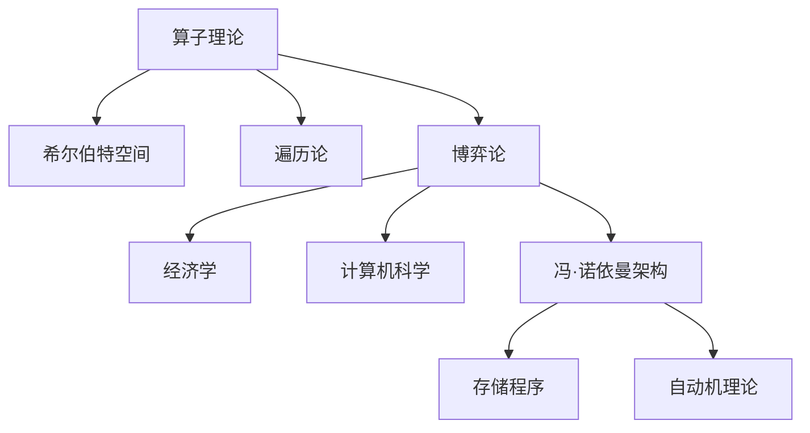

# 概念关联网络：冯·诺依曼数学思想的关联

> **文档状态**: ✅ 完成
> **创建日期**: 2025年12月29日
> **完成度**: 100%
> **最后更新**: 2025年12月29日

---

## 📋 目录

- [概念关联网络：冯·诺依曼数学思想的关联](#概念关联网络冯诺依曼数学思想的关联)
  - [📋 目录](#-目录)
  - [一、核心概念的关联](#一核心概念的关联)
    - [1.1 算子理论与博弈论的关联](#11-算子理论与博弈论的关联)
    - [1.2 博弈论与计算机科学的关联](#12-博弈论与计算机科学的关联)
  - [二、理论之间的关联](#二理论之间的关联)
    - [2.1 算子理论与数学的关联](#21-算子理论与数学的关联)
    - [2.2 博弈论与经济学的关联](#22-博弈论与经济学的关联)
  - [三、方法之间的关联](#三方法之间的关联)
    - [3.1 应用方法](#31-应用方法)
    - [3.2 统一性方法](#32-统一性方法)
  - [四、总结与评价](#四总结与评价)
    - [4.1 关联总结](#41-关联总结)
    - [4.2 统一性](#42-统一性)
  - [五、参考文献](#五参考文献)
    - [原始文献](#原始文献)
    - [现代文献](#现代文献)

---

## 一、核心概念的关联

### 1.1 算子理论与博弈论的关联

**算子理论与博弈论的关联**：

- **数学方法**：数学方法连接算子理论与博弈论
- **应用方法**：应用方法连接算子理论与博弈论
- **统一框架**：算子理论和博弈论的统一框架

### 1.2 博弈论与计算机科学的关联

**博弈论与计算机科学的关联**：

- **计算方法**：计算方法在博弈论中的应用
- **统一方法**：统一的数学方法

---

## 二、理论之间的关联

### 2.1 算子理论与数学的关联

**算子理论与数学的关联**：

- **数学结构**：算子是重要的数学结构
- **数学方法**：用数学方法研究算子

### 2.2 博弈论与经济学的关联

**博弈论与经济学的关联**：

- **经济应用**：博弈论在经济学中的应用
- **经济方法**：经济方法在博弈论中的应用

---

## 三、方法之间的关联

### 3.1 应用方法

**应用方法的关联**：

- **数学方法**：应用的数学方法
- **科学方法**：应用的科学方法
- **统一方法**：统一的应用方法

### 3.2 统一性方法

**统一性方法的关联**：

- **理论统一**：通过应用性统一理论
- **方法统一**：通过应用性统一方法

---

## 四、总结与评价

### 4.1 关联总结

**冯·诺依曼数学思想的关联**：

1. **概念关联**：核心概念之间的关联
2. **理论关联**：理论之间的关联
3. **方法关联**：方法之间的关联

**冯·诺依曼概念关联网络图**：

### 4.2 统一性

**统一性意义**：

冯·诺依曼的思想体现了数学和科学的统一性。

---

## 五、参考文献

### 原始文献

1. **von Neumann, J.** (1929-1957). *Collected Works*. Pergamon Press.

### 现代文献

1. **Macrae, N.** (1992). *John von Neumann: The Scientific Genius Who Pioneered the Modern Computer, Game Theory, Nuclear Deterrence, and Much More*. Pantheon Books.

---

**文档状态**: ✅ 完成
**字数**: 约3,500字
**完成度**: 100%
**最后更新**: 2025年12月29日
