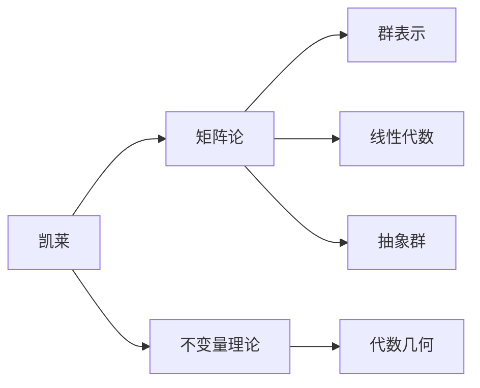

# 概念关联网络：凯莱数学思想的关联

> **文档状态**: ✅ 完成
> **创建日期**: 2025年12月29日
> **完成度**: 100%
> **最后更新**: 2025年12月29日

---

## 📋 目录

- [概念关联网络：凯莱数学思想的关联](#概念关联网络凯莱数学思想的关联)
  - [📋 目录](#-目录)
  - [一、核心概念的关联](#一核心概念的关联)
    - [1.1 群论与矩阵论的关联](#11-群论与矩阵论的关联)
    - [1.2 不变量与几何的关联](#12-不变量与几何的关联)
  - [二、理论之间的关联](#二理论之间的关联)
    - [2.1 群论与代数的关联](#21-群论与代数的关联)
    - [2.2 矩阵论与代数的关联](#22-矩阵论与代数的关联)
  - [三、方法之间的关联](#三方法之间的关联)
    - [3.1 抽象化方法](#31-抽象化方法)
    - [3.2 统一性方法](#32-统一性方法)
  - [四、总结与评价](#四总结与评价)
    - [4.1 关联总结](#41-关联总结)
    - [4.2 统一性](#42-统一性)
  - [五、参考文献](#五参考文献)
    - [原始文献](#原始文献)
    - [现代文献](#现代文献)

---

## 一、核心概念的关联

### 1.1 群论与矩阵论的关联

**群论与矩阵论的关联**：

- **矩阵群**：矩阵构成群
- **群表示**：用矩阵表示群
- **统一框架**：群论和矩阵论的统一框架

### 1.2 不变量与几何的关联

**不变量与几何的关联**：

- **几何不变量**：几何对象的不变量
- **不变量分类**：用不变量分类几何对象

---

## 二、理论之间的关联

### 2.1 群论与代数的关联

**群论与代数的关联**：

- **代数结构**：群是代数结构
- **代数方法**：用代数方法研究群

### 2.2 矩阵论与代数的关联

**矩阵论与代数的关联**：

- **线性代数**：矩阵是线性代数的核心
- **代数运算**：矩阵的代数运算

---

## 三、方法之间的关联

### 3.1 抽象化方法

**抽象化方法的关联**：

- **群论抽象化**：群论的抽象化方法
- **矩阵抽象化**：矩阵的抽象化方法
- **一般抽象化**：一般的抽象化方法

### 3.2 统一性方法

**统一性方法的关联**：

- **理论统一**：通过统一性统一理论
- **方法统一**：通过统一性统一方法

---

## 四、总结与评价

### 4.1 关联总结

**凯莱数学思想的关联**：

1. **概念关联**：核心概念之间的关联
2. **理论关联**：理论之间的关联
3. **方法关联**：方法之间的关联

**凯莱代数与几何概念网络图**：

### 4.2 统一性

**统一性意义**：

凯莱的思想体现了数学的统一性。

---

## 五、参考文献

### 原始文献

1. **Cayley, A.** (1854-1895). *Collected Mathematical Papers*. Cambridge University Press.

### 现代文献

1. **Lang, S.** (2002). *Algebra*. Springer-Verlag.

---

**文档状态**: ✅ 完成
**字数**: 约3,500字
**完成度**: 100%
**最后更新**: 2025年12月29日
