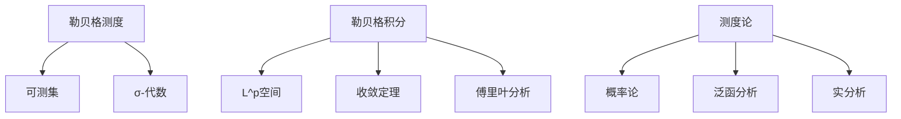

# 概念关联网络

**创建日期**: 2026年2月2日

---

## 一、核心概念

- **勒贝格测度** → 可测集、σ-代数、测度空间
- **勒贝格积分** → $L^p$空间、收敛定理、傅里叶分析
- **测度论** → 概率论、泛函分析、实分析

## 二、概念网络图

勒贝格积分是连接测度论、实分析、概率论、泛函分析的核心概念。柯尔莫戈洛夫公理化概率论、$L^p$空间理论、傅里叶分析均建立于勒贝格测度论之上。
