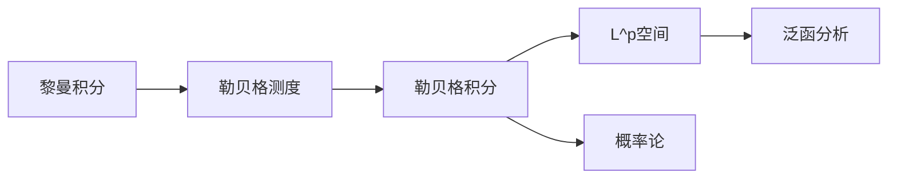

# 理论关联图谱

**创建日期**: 2026年2月2日

---

## 一、理论传承

黎曼积分 → 勒贝格测度 → 勒贝格积分 → $L^p$空间 → 泛函分析

## 二、跨领域关联

- **实分析**：勒贝格积分是核心工具，控制收敛定理、单调收敛定理
- **概率论**：柯尔莫戈洛夫公理化基础，期望即勒贝格积分
- **偏微分方程**：弱解理论、索伯列夫空间$W^{k,p}$

## 三、理论演化图

