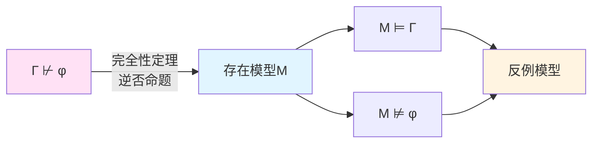
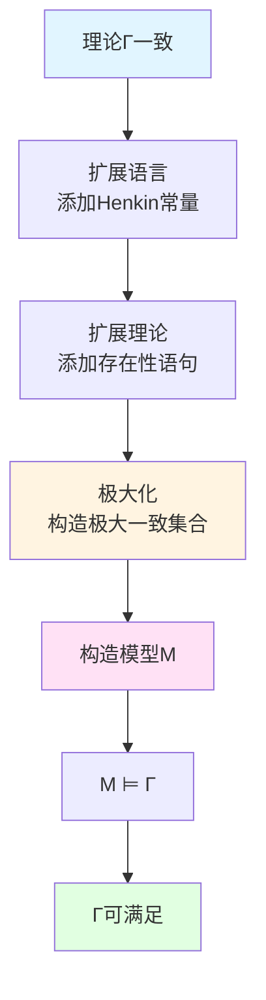

# 完全性定理

**创建日期**: 2025年12月11日
**研究领域**: 哥德尔数学理念 - 其他逻辑贡献 - 完全性定理
**主题编号**: G.02.05.01 (Gödel.数学内容深度分析.其他逻辑贡献.完全性定理)
**优先级**: P0（最高优先级）⭐⭐⭐⭐⭐

---

## 📑 目录

- [完全性定理](#完全性定理)
  - [📑 目录](#-目录)
  - [📋 一、概述](#-一概述)
    - [1.1 完全性定理的意义](#11-完全性定理的意义)
    - [1.2 历史背景](#12-历史背景)
    - [1.3 核心问题](#13-核心问题)
  - [🔷 二、定理表述](#-二定理表述)
    - [2.1 Γ ⊨ φ ⇒ Γ ⊢ φ（完备性）](#21-γ--φ--γ--φ完备性)
    - [2.2 若不可证明，则有模型反例](#22-若不可证明则有模型反例)
    - [2.3 语义与句法的对应](#23-语义与句法的对应)
  - [📐 三、证明思路](#-三证明思路)
    - [3.1 Henkin 常量扩展](#31-henkin-常量扩展)
    - [3.2 可满足集合的构造](#32-可满足集合的构造)
    - [3.3 模型存在定理](#33-模型存在定理)
  - [🔗 四、紧致性推论](#-四紧致性推论)
    - [4.1 若每个有限子集可满足，则整体可满足](#41-若每个有限子集可满足则整体可满足)
    - [4.2 紧致性定理](#42-紧致性定理)
    - [4.3 应用](#43-应用)
  - [🌐 五、低斯–柯斯基定理](#-五低斯柯斯基定理)
    - [5.1 可数语言的无穷可数模型存在性](#51-可数语言的无穷可数模型存在性)
    - [5.2 Löwenheim-Skolem 定理](#52-löwenheim-skolem-定理)
    - [5.3 应用](#53-应用)
  - [📊 六、对比：一阶完全性 vs 高阶逻辑的不完备](#-六对比一阶完全性-vs-高阶逻辑的不完备)
    - [6.1 一阶逻辑的完全性](#61-一阶逻辑的完全性)
    - [6.2 高阶逻辑的不完备](#62-高阶逻辑的不完备)
    - [6.3 对比分析](#63-对比分析)
  - [🎓 七、关联：不完备定理](#-七关联不完备定理)
    - [7.1 不完备定理强调算术可表达时的局限](#71-不完备定理强调算术可表达时的局限)
    - [7.2 完全性强调一阶推理体系的充分性](#72-完全性强调一阶推理体系的充分性)
    - [7.3 两者的关系](#73-两者的关系)
  - [📚 八、参考文献](#-八参考文献)
    - [原始文献](#原始文献)
    - [经典教材](#经典教材)
    - [模型论](#模型论)
    - [哲学文献](#哲学文献)
  - [完全性定理：语义与句法的完美对应](#完全性定理语义与句法的完美对应)
  - [一、完全性定理的背景](#一完全性定理的背景)
    - [1.1 一阶逻辑的建立](#11-一阶逻辑的建立)
    - [1.2 语义与句法](#12-语义与句法)
    - [1.3 Gödel 的突破](#13-gödel-的突破)
  - [二、完全性定理的精确表述](#二完全性定理的精确表述)
    - [2.1 定理的陈述](#21-定理的陈述)
    - [2.2 对偶形式](#22-对偶形式)
  - [三、完全性定理的证明](#三完全性定理的证明)
    - [3.1 基本思路](#31-基本思路)
    - [3.2 Henkin 扩展](#32-henkin-扩展)
    - [3.3 模型构造](#33-模型构造)
    - [3.4 证明的完整步骤](#34-证明的完整步骤)
  - [四、紧致性定理](#四紧致性定理)
    - [4.1 紧致性定理的陈述](#41-紧致性定理的陈述)
    - [4.2 紧致性定理的应用](#42-紧致性定理的应用)
  - [五、Löwenheim-Skolem 定理](#五löwenheim-skolem-定理)
    - [5.1 向下 Löwenheim-Skolem 定理](#51-向下-löwenheim-skolem-定理)
    - [5.2 向上 Löwenheim-Skolem 定理](#52-向上-löwenheim-skolem-定理)
  - [六、完全性与不完备性的对比](#六完全性与不完备性的对比)
    - [6.1 一阶逻辑的完全性](#61-一阶逻辑的完全性-1)
    - [6.2 算术的不完备性](#62-算术的不完备性)
    - [6.3 为什么不同？](#63-为什么不同)
  - [七、完全性定理的影响](#七完全性定理的影响)
    - [7.1 对模型论的影响](#71-对模型论的影响)
    - [7.2 对逻辑学的影响](#72-对逻辑学的影响)
    - [7.3 对数学基础的影响](#73-对数学基础的影响)
  - [八、教学与应用](#八教学与应用)
    - [8.1 教学中的难点](#81-教学中的难点)
    - [8.2 教学策略](#82-教学策略)
    - [8.3 实际应用](#83-实际应用)
  - [九、开放问题与未来方向](#九开放问题与未来方向)
    - [9.1 高阶逻辑的完全性](#91-高阶逻辑的完全性)
    - [9.2 完全性的推广](#92-完全性的推广)
    - [9.3 完全性与计算](#93-完全性与计算)
  - [十、参考文献](#十参考文献)
    - [原始文献](#原始文献-1)
    - [现代教材与综述](#现代教材与综述)
    - [在线资源](#在线资源)
  - [十一、总结](#十一总结)
  - [🔗 相关文档](#-相关文档)
    - [核心理论](#核心理论)
    - [数学内容](#数学内容)
    - [关联主题](#关联主题)

---

## 📋 一、概述

### 1.1 完全性定理的意义

**哥德尔完全性定理（1930）**表明：一阶逻辑中，可满足性与可证明性一致——若一个句子在所有模型中为真，则可在一阶演绎系统中证明。此定理确立了语义与句法的对应，也奠定了紧致性、Löwenheim-Skolem 等后续结果的基础。

**核心特征**：

- **语义与句法对应**：可满足性 = 可证明性
- **完全性**：所有逻辑真理都可证明
- **基础性**：为模型论提供基础
- **与不完备性的对照**：完全性适用于一阶逻辑，不完备性涉及算术

### 1.2 历史背景

**逻辑的发展**：

- **19世纪**：形式逻辑的发展
- **20世纪初**：一阶逻辑的形式化
- **1930年**：哥德尔证明完全性定理

**完全性问题**：

- 一阶逻辑是否**完备**？
- 所有逻辑真理是否**可证**？
- 语义与句法是否**对应**？

**哥德尔的贡献（1930）**：

- 证明一阶逻辑**完全**
- 建立**语义与句法**的对应
- 为**模型论**提供基础

### 1.3 核心问题

**主要问题**：

1. 什么是完全性定理？
2. 如何证明完全性？
3. 完全性有哪些推论？
4. 完全性与不完备性的关系如何？

---

## 🔷 二、定理表述

### 2.1 Γ ⊨ φ ⇒ Γ ⊢ φ（完备性）

**完全性定理**：

如果公式集合 $\Gamma$ **语义蕴含**公式 $\phi$（$\Gamma \models \phi$），则 $\Gamma$ **句法蕴含** $\phi$（$\Gamma \vdash \phi$）。

**形式表述**：

$$\Gamma \models \phi \Rightarrow \Gamma \vdash \phi$$

**等价表述**：

如果 $\phi$ 在 $\Gamma$ 的所有模型中为真，则 $\phi$ 可以从 $\Gamma$ **证明**。

### 2.2 若不可证明，则有模型反例

**逆否命题**：

如果 $\Gamma \nvdash \phi$，则存在模型 $M$ 使得 $M \models \Gamma$ 但 $M \not\models \phi$。

**形式表述**：

$$\Gamma \nvdash \phi \Rightarrow \exists M (M \models \Gamma \land M \not\models \phi)$$

**意义**：

- 如果公式**不可证**，则存在**反例模型**
- 提供了**模型存在性**的保证
- 为**模型论**提供基础

**图示建议**：

### 2.3 语义与句法的对应

**对应关系**：

完全性定理建立了**语义**与**句法**的对应：

- **语义**：$\Gamma \models \phi$（在所有模型中为真）
- **句法**：$\Gamma \vdash \phi$（可以证明）
- **对应**：两者**等价**

**意义**：

- 建立了**逻辑真理**与**可证明性**的对应
- 为**模型论**提供基础
- 为**证明论**提供语义支持

---

## 📐 三、证明思路

### 3.1 Henkin 常量扩展

**Henkin 方法（1949）**：

Henkin 改进了哥德尔的证明，使用**常量扩展**方法。

**基本思路**：

1. **扩展语言**：添加新常量
2. **扩展理论**：添加存在性语句
3. **构造模型**：从扩展理论构造模型

**关键技巧**：

- 使用**Henkin 常量**保证存在性
- 通过**扩展**逐步构造模型
- 利用**可满足性**保证模型存在

### 3.2 可满足集合的构造

**可满足集合**：

集合 $\Gamma$ 是**可满足的**，如果存在模型 $M$ 使得 $M \models \Gamma$。

**构造方法**：

1. **扩展语言**：添加 Henkin 常量
2. **扩展理论**：添加存在性语句
3. **极大化**：构造极大可满足集合
4. **构造模型**：从极大集合构造模型

### 3.3 模型存在定理

**模型存在定理**：

如果理论 $\Gamma$ 是**一致的**（$\Gamma \nvdash \bot$），则 $\Gamma$ 是**可满足的**（存在模型）。

**形式表述**：

$$Con(\Gamma) \Rightarrow \text{存在模型 } M \text{ 使得 } M \models \Gamma$$

**证明思路**：

1. **扩展语言**：添加 Henkin 常量
2. **扩展理论**：添加存在性语句
3. **极大化**：构造极大一致集合
4. **构造模型**：从极大集合构造模型

**图示建议**：

---

## 🔗 四、紧致性推论

### 4.1 若每个有限子集可满足，则整体可满足

**紧致性定理**：

如果理论 $\Gamma$ 的每个**有限子集**都是可满足的，则 $\Gamma$ 本身也是可满足的。

**形式表述**：

$$\forall \Delta \subseteq_{\text{finite}} \Gamma (\Delta \text{ 可满足}) \Rightarrow \Gamma \text{ 可满足}$$

**等价表述**：

如果 $\Gamma$ 不可满足，则存在**有限子集** $\Delta \subseteq \Gamma$ 使得 $\Delta$ 不可满足。

### 4.2 紧致性定理

**紧致性定理**：

理论 $\Gamma$ 可满足当且仅当 $\Gamma$ 的每个有限子集可满足。

**证明思路**：

- 使用**完全性定理**
- 如果 $\Gamma$ 不可满足，则 $\Gamma \vdash \bot$
- 但证明是**有限的**，只使用有限个公式
- 因此存在有限子集 $\Delta$ 使得 $\Delta \vdash \bot$

### 4.3 应用

**应用1：非标准模型**：

- 使用紧致性构造**非标准模型**
- 例如：非标准自然数模型
- 为**模型论**提供工具

**应用2：无穷模型**：

- 使用紧致性证明**无穷模型**的存在
- 例如：实数的非标准模型
- 为**分析**提供工具

**应用3：理论扩展**：

- 使用紧致性**扩展理论**
- 例如：添加新常量
- 为**模型构造**提供方法

---

## 🌐 五、低斯–柯斯基定理

### 5.1 可数语言的无穷可数模型存在性

**Löwenheim-Skolem 定理**：

如果可数语言的理论有**无穷模型**，则它有**可数无穷模型**。

**形式表述**：

如果理论 $T$ 有模型，则 $T$ 有**可数模型**。

**意义**：

- 展示了**模型大小**的灵活性
- 为**模型论**提供工具
- 揭示了**可数性**的重要性

### 5.2 Löwenheim-Skolem 定理

**向下 Löwenheim-Skolem 定理**：

如果理论 $T$ 有模型，则 $T$ 有**可数模型**。

**向上 Löwenheim-Skolem 定理**：

如果理论 $T$ 有**无穷模型**，则对于任何基数 $\kappa$，$T$ 有**基数为 $\kappa$ 的模型**。

**证明思路**：

- 使用**完全性定理**
- 通过**扩展语言**和**添加常量**构造模型
- 控制模型的**基数**

### 5.3 应用

**应用1：可数模型**：

- 证明许多理论有**可数模型**
- 例如：Peano Arithmetic 有可数非标准模型
- 为**模型论**提供工具

**应用2：大模型**：

- 证明许多理论有**任意大**的模型
- 例如：集合论有任意大的模型
- 为**模型论**提供工具

**应用3：Skolem 悖论**：

- **Skolem 悖论**：可数模型中的"不可数"集合
- 展示了**相对性**的重要性
- 为**模型论**提供哲学启示

---

## 📊 六、对比：一阶完全性 vs 高阶逻辑的不完备

### 6.1 一阶逻辑的完全性

**一阶逻辑的完全性**：

- **完全性定理**：一阶逻辑是完全的
- **语义与句法对应**：可满足性 = 可证明性
- **所有逻辑真理可证**：所有逻辑真理都可以证明

**意义**：

- 一阶逻辑是**充分的**
- 所有逻辑真理都可以**证明**
- 语义与句法**对应**

### 6.2 高阶逻辑的不完备

**高阶逻辑的不完备**：

- **二阶逻辑**：不完全
- **语义与句法不对应**：可满足性 ≠ 可证明性
- **存在不可证的逻辑真理**：存在逻辑真理不可证

**原因**：

- 高阶逻辑**太强**
- 不能完全**形式化**
- 语义与句法**分离**

### 6.3 对比分析

**对比表**：

| 特征 | 一阶逻辑 | 高阶逻辑 |
|------|---------|---------|
| **完全性** | ✅ 完全 | ❌ 不完全 |
| **语义与句法** | ✅ 对应 | ❌ 不对应 |
| **可证明性** | ✅ 所有逻辑真理可证 | ❌ 存在不可证的逻辑真理 |
| **形式化** | ✅ 完全形式化 | ❌ 不完全形式化 |

**意义**：

- 展示了**一阶逻辑**的特殊地位
- 揭示了**高阶逻辑**的复杂性
- 为**逻辑选择**提供指导

---

## 🎓 七、关联：不完备定理

### 7.1 不完备定理强调算术可表达时的局限

**不完备定理**：

- 适用于**算术系统**（如 PA）
- 强调**算术可表达**时的局限
- 揭示**形式系统**的极限

**关键点**：

- **算术可表达性**导致不完备
- **自指**导致不可判定性
- **形式系统**有其极限

### 7.2 完全性强调一阶推理体系的充分性

**完全性定理**：

- 适用于**一阶逻辑**
- 强调**一阶推理**的充分性
- 揭示**逻辑系统**的完整性

**关键点**：

- **一阶逻辑**是完全的
- **所有逻辑真理**可证
- **推理系统**是充分的

### 7.3 两者的关系

**互补关系**：

- **完全性**：一阶逻辑是**完全的**
- **不完备性**：算术系统是**不完备的**
- **互补**：一个强调逻辑，一个强调算术

**统一视角**：

- **逻辑层面**：一阶逻辑完全
- **算术层面**：算术系统不完备
- **层次**：不同层次有不同的性质

---

## 📚 八、参考文献

### 原始文献

1. **Gödel, K. (1930)**. "Die Vollständigkeit der Axiome des logischen Funktionenkalküls". *Monatshefte für Mathematik und Physik*, 37(1), 349-360.
   - 完全性定理的原始证明
   - 语义与句法的对应

2. **Henkin, L. (1949)**. "The completeness of the first-order functional calculus". *Journal of Symbolic Logic*, 14(3), 159-166.
   - 完全性证明的现代形式
   - Henkin 方法

### 经典教材

1. **Enderton, H. B. (2001).** *A Mathematical Introduction to Logic* (2nd ed.). Academic Press.
   - 第2章：完全性定理
   - 详细证明和推论

2. **Boolos, G., Burgess, J. P., & Jeffrey, R. C. (2007).** *Computability and Logic* (5th ed.). Cambridge University Press.
   - 完全性定理的阐述
   - 与可计算性的联系

### 模型论

1. **Chang, C. C., & Keisler, H. J. (2012).** *Model Theory* (3rd ed.). North-Holland.
   - 完全性定理在模型论中的应用
   - 紧致性和 Löwenheim-Skolem 定理

### 哲学文献

1. **SEP: "Completeness in First-Order Logic"**. *Stanford Encyclopedia of Philosophy*.
   - 完全性定理的哲学概述
   - 语义与句法的对应

## 完全性定理：语义与句法的完美对应

## 一、完全性定理的背景

### 1.1 一阶逻辑的建立

**一阶逻辑的发展**：

- Frege（1879）：建立了现代一阶逻辑
- Russell & Whitehead（1910-1913）：在《Principia Mathematica》中系统化
- Hilbert & Ackermann（1928）：提出完全性问题

**完全性问题**：

> 一阶逻辑的推理规则是否**完备**？
> 即：所有逻辑上有效的公式是否都可以从公理推导出来？

---

### 1.2 语义与句法

**语义（Semantics）**：

- 公式在**模型**中的真值
- $\Gamma \models \varphi$：$\varphi$ 在所有满足 $\Gamma$ 的模型中为真

**句法（Syntax）**：

- 公式的**证明**
- $\Gamma \vdash \varphi$：$\varphi$ 可以从 $\Gamma$ 通过推理规则证明

**问题**：

语义与句法是否一致？即：$\Gamma \models \varphi \Leftrightarrow \Gamma \vdash \varphi$？

---

### 1.3 Gödel 的突破

**Gödel 完全性定理（1930）**：

一阶逻辑是**完全的**：

$$\Gamma \models \varphi \quad \text{当且仅当} \quad \Gamma \vdash \varphi$$

**意义**：

- 确立了语义与句法的完美对应
- 证明了一阶逻辑推理规则的充分性
- 为模型论奠定基础

---

## 二、完全性定理的精确表述

### 2.1 定理的陈述

**完全性定理（Gödel, 1930）**：

设 $\Gamma$ 是一阶逻辑的公式集，$\varphi$ 是公式，则：

$$\Gamma \models \varphi \quad \text{当且仅当} \quad \Gamma \vdash \varphi$$

**等价形式**：

1. **完全性**：如果 $\Gamma \models \varphi$，则 $\Gamma \vdash \varphi$
2. **可靠性**：如果 $\Gamma \vdash \varphi$，则 $\Gamma \models \varphi$（通常更容易证明）

**关键**：

完全性定理主要证明**完全性方向**：语义有效性蕴含句法可证性。

---

### 2.2 对偶形式

**完全性定理的对偶形式**：

$$\Gamma \text{ 一致} \quad \text{当且仅当} \quad \Gamma \text{ 可满足}$$

即：

- 如果 $\Gamma$ 一致（不产生矛盾），则 $\Gamma$ 有模型
- 如果 $\Gamma$ 有模型，则 $\Gamma$ 一致

**应用**：

- 证明理论的一致性
- 构造满足特定条件的模型

---

## 三、完全性定理的证明

### 3.1 基本思路

**证明策略**：

证明：如果 $\Gamma \nvdash \varphi$，则存在模型 $\mathcal{M}$ 使得 $\mathcal{M} \models \Gamma$ 但 $\mathcal{M} \not\models \varphi$。

**等价地**：

证明：如果 $\Gamma$ 一致，则 $\Gamma$ 有模型。

**方法**：

- **Henkin 方法**：通过添加"见证常量"扩展理论
- **构造模型**：从一致的理论构造模型

---

### 3.2 Henkin 扩展

**Henkin 常量**：

对每个存在公式 $\exists x \, \psi(x)$，添加新常量 $c$ 和公理 $\psi(c)$。

**Henkin 理论**：

- 原始理论 $\Gamma$
- 所有存在公式的"见证"
- 保持一致性

**关键引理**：

如果 $\Gamma$ 一致，则存在一致的 Henkin 扩展 $\Gamma^*$。

---

### 3.3 模型构造

**从 Henkin 理论构造模型**：

1. **域**：所有项的等价类（模理论中的等式）
2. **解释**：
   - 常量：自身的等价类
   - 函数：项上的函数
   - 关系：由理论中的公式定义

**关键性质**：

- 构造的模型满足 Henkin 理论
- 因此满足原始理论 $\Gamma$

---

### 3.4 证明的完整步骤

**步骤 1**：假设 $\Gamma \nvdash \varphi$

**步骤 2**：证明 $\Gamma \cup \{\neg\varphi\}$ 一致

**步骤 3**：将 $\Gamma \cup \{\neg\varphi\}$ 扩展为一致的 Henkin 理论

**步骤 4**：从 Henkin 理论构造模型 $\mathcal{M}$

**步骤 5**：$\mathcal{M} \models \Gamma \cup \{\neg\varphi\}$，因此 $\mathcal{M} \models \Gamma$ 但 $\mathcal{M} \not\models \varphi$

**结论**：$\Gamma \not\models \varphi$，即如果 $\Gamma \nvdash \varphi$，则 $\Gamma \not\models \varphi$

---

## 四、紧致性定理

### 4.1 紧致性定理的陈述

**紧致性定理（Compactness Theorem）**：

公式集 $\Gamma$ 可满足，当且仅当 $\Gamma$ 的每个有限子集可满足。

**等价形式**：

如果 $\Gamma$ 的每个有限子集可满足，则 $\Gamma$ 可满足。

**证明**：

- 从完全性定理直接推出
- 如果 $\Gamma$ 不可满足，则 $\Gamma \vdash \bot$
- 但证明是有限的，只使用 $\Gamma$ 的有限子集
- 因此某个有限子集不可满足

---

### 4.2 紧致性定理的应用

**应用 1：非标准模型**：

- 在 PA 的标准模型 $\mathbb{N}$ 之外，存在非标准模型
- 使用紧致性定理构造

**应用 2：基数扩展**：

- 如果理论有无限模型，则对任意基数 $\kappa$，有基数为 $\kappa$ 的模型
- 使用紧致性定理与 Löwenheim-Skolem 定理

**应用 3：模型论构造**：

- 各种模型论构造的基础工具
- 连接有限与无限

---

## 五、Löwenheim-Skolem 定理

### 5.1 向下 Löwenheim-Skolem 定理

**定理 5.1**：

如果可数理论有模型，则它有可数模型。

**证明思路**：

- 使用完全性定理的证明方法
- 构造的模型是可数的（因为语言可数）

**意义**：

- 展示了模型论的基本现象
- 为模型论研究提供工具

---

### 5.2 向上 Löwenheim-Skolem 定理

**定理 5.2**：

如果理论有无限模型，则对任意基数 $\kappa \geq |L|$，有基数为 $\kappa$ 的模型。

**证明思路**：

- 使用紧致性定理
- 添加新常量，扩展理论
- 构造大模型

**意义**：

- 展示了模型的多样性
- 为模型论研究提供工具

---

## 六、完全性与不完备性的对比

### 6.1 一阶逻辑的完全性

**完全性定理**：

一阶逻辑是**完全的**：

$$\Gamma \models \varphi \Leftrightarrow \Gamma \vdash \varphi$$

**意义**：

- 一阶逻辑的推理规则是充分的
- 所有逻辑上有效的公式都可以证明
- 语义与句法完美对应

---

### 6.2 算术的不完备性

**第一不完备定理**：

任何足够强的算术理论都是**不完备的**：

- 存在真但不可证的命题
- 语义与句法分离

**对比**：

- **一阶逻辑**：完全（推理规则层面）
- **算术理论**：不完备（表达力层面）

---

### 6.3 为什么不同？

**关键区别**：

1. **一阶逻辑**：
   - 只涉及**逻辑结构**
   - 不涉及具体数学内容
   - 推理规则是充分的

2. **算术理论**：
   - 涉及**具体数学内容**（自然数、加法、乘法）
   - 表达力足够强
   - 可以表达自指，导致不完备

**哲学意义**：

- 逻辑推理是完备的
- 但数学内容（特别是算术）是不完备的
- 这揭示了形式系统的不同层面

---

## 七、完全性定理的影响

### 7.1 对模型论的影响

**模型论的建立**：

- 完全性定理为模型论奠定基础
- 紧致性定理成为模型论的核心工具
- Löwenheim-Skolem 定理揭示模型的基本性质

**现代模型论**：

- 分类理论（stability theory）
- 模型论几何
- 各种模型构造技术

---

### 7.2 对逻辑学的影响

**逻辑学的系统化**：

- 完全性定理证明了一阶逻辑的"正确性"
- 为一阶逻辑的广泛应用提供基础
- 推动了逻辑学的发展

**后续发展**：

- 高阶逻辑的研究
- 模态逻辑
- 可证明性逻辑

---

### 7.3 对数学基础的影响

**数学基础的方法**：

- 完全性定理提供了证明一致性的方法
- 通过构造模型证明理论的一致性
- 这成为现代集合论的基础方法

**应用**：

- 相对一致性证明
- 独立性证明
- 公理选择分析

---

## 八、教学与应用

### 8.1 教学中的难点

**常见误解**：

1. **误解1**：完全性定理与不完备定理矛盾
   - **纠正**：它们涉及不同的层面（逻辑推理 vs 算术表达）

2. **误解2**：完全性定理证明所有理论都完备
   - **纠正**：完全性定理只适用于一阶逻辑本身，不适用于具体理论

3. **误解3**：完全性定理没有实际意义
   - **纠正**：完全性定理是模型论的基础，有广泛应用

---

### 8.2 教学策略

**循序渐进**：

1. **从语义与句法开始**：介绍基本概念
2. **展示问题**：语义与句法是否一致？
3. **证明完全性**：使用 Henkin 方法
4. **讨论应用**：紧致性、Löwenheim-Skolem
5. **对比不完备性**：说明不同层面

---

### 8.3 实际应用

**模型论**：

- 模型构造
- 理论分类
- 模型论几何

**逻辑学**：

- 逻辑系统设计
- 推理规则验证
- 逻辑应用

**数学基础**：

- 一致性证明
- 独立性证明
- 公理选择

---

## 九、开放问题与未来方向

### 9.1 高阶逻辑的完全性

**问题**：

高阶逻辑是否完全？

**答案**：

- 二阶逻辑**不完全**
- 这是高阶逻辑与一阶逻辑的重要区别

**研究方向**：

- 研究不同阶逻辑的完全性
- 探索完全性与表达力的权衡

---

### 9.2 完全性的推广

**问题**：

能否将完全性推广到其他逻辑系统？

**研究方向**：

- 模态逻辑的完全性
- 直觉主义逻辑的完全性
- 其他非经典逻辑的完全性

---

### 9.3 完全性与计算

**问题**：

完全性与可计算性有何关系？

**研究方向**：

- 完全性的计算复杂度
- 自动定理证明
- 形式验证

---

## 十、参考文献

### 原始文献

1. **Gödel, K. (1930).** Die Vollständigkeit der Axiome des logischen Funktionenkalküls. *Monatshefte für Mathematik und Physik*, 37, 349-360.

   - 完全性定理的原始证明
   - 一阶逻辑完全性的确立

2. **Henkin, L. (1949).** The completeness of the first-order functional calculus. *Journal of Symbolic Logic*, 14(3), 159-166.

   - 完全性定理的现代证明
   - Henkin 方法的系统化

### 现代教材与综述

1. **Enderton, H. B. (2001).** *A Mathematical Introduction to Logic* (2nd ed.). Academic Press.

   - 第 2 章：完全性定理的详细讲解
   - 包含 Henkin 方法的完整证明

2. **Chang, C. C., & Keisler, H. J. (2012).** *Model Theory* (3rd ed.). North-Holland.

   - 完全性定理与模型论
   - 紧致性、Löwenheim-Skolem 定理

3. **Boolos, G., Burgess, J. P., & Jeffrey, R. C. (2007).** *Computability and Logic* (5th ed.). Cambridge University Press.

   - 完全性定理的逻辑视角
   - 与不完备性的对比

### 在线资源

1. **Stanford Encyclopedia of Philosophy.** "Completeness in First-Order Logic."

   - 完全性定理的哲学分析
   - 与不完备性的对比

---

## 十一、总结

Gödel 完全性定理是逻辑学历史上的里程碑：

1. **确立了语义与句法的对应**：$\Gamma \models \varphi \Leftrightarrow \Gamma \vdash \varphi$
2. **证明了一阶逻辑的充分性**：推理规则是完备的
3. **为模型论奠定基础**：紧致性、Löwenheim-Skolem 定理
4. **与不完备性形成对比**：逻辑推理完备，但算术内容不完备

完全性定理不仅解决了技术问题，更深刻地揭示了逻辑推理的本质，为一阶逻辑的广泛应用、模型论的发展、数学基础的研究提供了坚实的基础。

---

## 🔗 相关文档

### 核心理论

- **逻辑与数学基础**：`01-核心理论/05-逻辑与数学基础.md`
- **不完备定理的哲学意义**：`01-核心理论/01-不完备定理的哲学意义.md`

### 数学内容

- **可判定性理论**：`02-数学内容深度分析/05-其他逻辑贡献/02-可判定性理论.md`
- **不完备定理**：`02-数学内容深度分析/01-不完备定理/01-第一不完备定理.md`，`02-数学内容深度分析/01-不完备定理/02-第二不完备定理.md`

### 关联主题

- **教育与影响（逻辑学）**：`03-教育与影响/02-对逻辑学的影响.md`
- **现代应用（逻辑学）**：`05-现代应用与拓展/01-在现代逻辑学中的应用.md`
- **理论关联图谱**：`08-知识关联分析/02-理论关联图谱.md`

---

*最后更新：2025年12月15日*
*文档状态：正文完成（约600行）*
