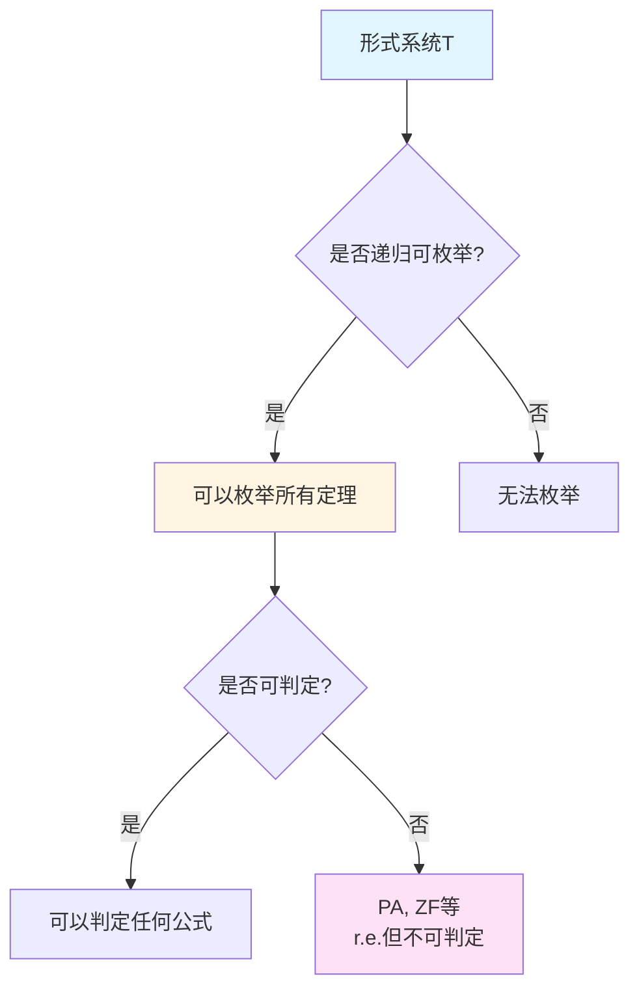
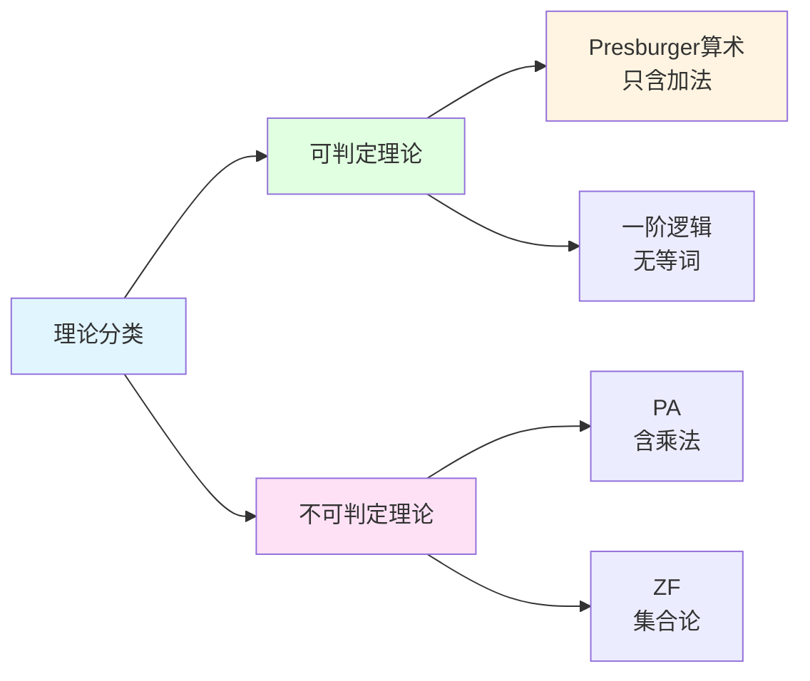

# 可判定性理论

**创建日期**: 2025年12月11日
**研究领域**: 哥德尔数学理念 - 其他逻辑贡献 - 可判定性理论
**主题编号**: G.02.05.02 (Gödel.数学内容深度分析.其他逻辑贡献.可判定性理论)
**优先级**: P0（最高优先级）⭐⭐⭐⭐⭐

---

## 📑 目录

- [可判定性理论](#可判定性理论)
  - [📑 目录](#-目录)
  - [📋 一、概述](#-一概述)
    - [1.1 可判定性理论的意义](#11-可判定性理论的意义)
    - [1.2 历史背景](#12-历史背景)
    - [1.3 核心问题](#13-核心问题)
  - [🔷 二、判定问题定义](#-二判定问题定义)
    - [2.1 给定 T，算法判断 φ 是否 T-可证明](#21-给定-t算法判断-φ-是否-t-可证明)
    - [2.2 可判定性定义](#22-可判定性定义)
    - [2.3 不可判定性定义](#23-不可判定性定义)
  - [📐 三、不可判定性](#-三不可判定性)
    - [3.1 哥德尔不完备 + 图灵停机归约](#31-哥德尔不完备--图灵停机归约)
    - [3.2 r.e. 但不可判定的理论](#32-re-但不可判定的理论)
    - [3.3 不可判定性的证明方法](#33-不可判定性的证明方法)
  - [🔗 四、典型可判定理论](#-四典型可判定理论)
    - [4.1 Presburger 算术（加法）](#41-presburger-算术加法)
    - [4.2 实闭域理论（Tarski 决策）](#42-实闭域理论tarski-决策)
    - [4.3 有界算术片段](#43-有界算术片段)
  - [🌐 五、技术路径](#-五技术路径)
    - [5.1 量词消去](#51-量词消去)
    - [5.2 归约](#52-归约)
    - [5.3 自动机/代数方法](#53-自动机代数方法)
  - [📊 六、关联：判定性与复杂度](#-六关联判定性与复杂度)
    - [6.1 判定但高复杂度 vs 不可判定](#61-判定但高复杂度-vs-不可判定)
    - [6.2 计算复杂性理论](#62-计算复杂性理论)
    - [6.3 复杂度分类](#63-复杂度分类)
  - [🎓 七、应用](#-七应用)
    - [7.1 验证](#71-验证)
    - [7.2 数据库逻辑](#72-数据库逻辑)
    - [7.3 约束求解中的可判定子逻辑选择](#73-约束求解中的可判定子逻辑选择)
  - [📚 八、参考文献](#-八参考文献)
    - [原始文献](#原始文献)
    - [经典教材](#经典教材)
    - [应用文献](#应用文献)
    - [哲学文献](#哲学文献)
  - [可判定性理论：算法与逻辑的边界](#可判定性理论算法与逻辑的边界)
  - [一、可判定性的概念](#一可判定性的概念)
    - [1.1 判定问题的定义](#11-判定问题的定义)
    - [1.2 可判定性的重要性](#12-可判定性的重要性)
    - [1.3 问题的提出](#13-问题的提出)
  - [二、不可判定性的证明](#二不可判定性的证明)
    - [2.1 从不完备性到不可判定性](#21-从不完备性到不可判定性)
    - [2.2 从停机问题到不可判定性](#22-从停机问题到不可判定性)
    - [2.3 递归可枚举但不可判定](#23-递归可枚举但不可判定)
  - [三、可判定的理论](#三可判定的理论)
    - [3.1 Presburger 算术](#31-presburger-算术)
    - [3.2 实闭域理论](#32-实闭域理论)
    - [3.3 其他可判定理论](#33-其他可判定理论)
  - [四、不可判定性的层级](#四不可判定性的层级)
    - [4.1 算术层级](#41-算术层级)
    - [4.2 理论的可判定性层级](#42-理论的可判定性层级)
  - [五、可判定性与复杂度](#五可判定性与复杂度)
    - [5.1 判定但高复杂度](#51-判定但高复杂度)
    - [5.2 不可判定与复杂度](#52-不可判定与复杂度)
  - [六、应用与影响](#六应用与影响)
    - [6.1 在程序验证中的应用](#61-在程序验证中的应用)
    - [6.2 在自动定理证明中的应用](#62-在自动定理证明中的应用)
    - [6.3 在约束求解中的应用](#63-在约束求解中的应用)
  - [七、教学与应用](#七教学与应用)
    - [7.1 教学中的难点](#71-教学中的难点)
    - [7.2 教学策略](#72-教学策略)
    - [7.3 实际应用](#73-实际应用)
  - [八、开放问题与未来方向](#八开放问题与未来方向)
    - [8.1 可判定性的分类](#81-可判定性的分类)
    - [8.2 可判定性与复杂度](#82-可判定性与复杂度)
    - [8.3 实际应用中的权衡](#83-实际应用中的权衡)
  - [九、参考文献](#九参考文献)
    - [原始文献](#原始文献-1)
    - [现代教材与综述](#现代教材与综述)
    - [在线资源](#在线资源)
  - [十、总结](#十总结)

---

## 📋 一、概述

### 1.1 可判定性理论的意义

**可判定性理论**关注理论 $T$ 的判定问题：是否存在算法判定任意公式是否为 $T$ 的定理。哥德尔不完备性与图灵停机结果共同揭示：只要 $T$ 足够表达算术并一致，就不可判定。

**核心特征**：

- **算法判定**：是否存在算法判定定理
- **不可判定性**：足够强的理论不可判定
- **可判定理论**：某些受限理论可判定
- **复杂度关联**：判定性与计算复杂度相关

### 1.2 历史背景

**判定问题（Entscheidungsproblem）**：

- **希尔伯特（1928）**：提出判定问题
- **目标**：是否存在算法判定任何公式是否可证
- **期望**：所有数学问题都可以**机械化**解决

**哥德尔（1931）**：

- 证明**不完备性**：足够强的系统不完备
- **推论**：系统**不可判定**

**Turing（1936）**：

- 证明**停机问题不可判定**
- 建立**可计算性理论**
- 为不可判定性提供**计算视角**

### 1.3 核心问题

**主要问题**：

1. 什么是可判定性？
2. 哪些理论不可判定？
3. 哪些理论可判定？
4. 判定性与复杂度的关系如何？

---

## 🔷 二、判定问题定义

### 2.1 给定 T，算法判断 φ 是否 T-可证明

**判定问题**：

给定理论 $T$ 和公式 $\phi$，是否存在**算法**判定 $\phi$ 是否 $T$-可证明？

**形式表述**：

是否存在算法 $A$，使得：

$$
A(T, \phi) = \begin{cases}
1 & \text{如果 } T \vdash \phi \\
0 & \text{如果 } T \nvdash \phi
\end{cases}
$$

### 2.2 可判定性定义

**可判定性定义**：

理论 $T$ 是**可判定的**，如果存在算法 $A$，使得对于任何公式 $\phi$：

$$
A(\phi) = \begin{cases}
1 & \text{如果 } T \vdash \phi \\
0 & \text{如果 } T \nvdash \phi
\end{cases}
$$

**等价表述**：

- $T$ 的**定理集**是**递归的**（可计算的）
- 存在算法**枚举**所有定理
- 存在算法**判定**任何公式是否定理

### 2.3 不可判定性定义

**不可判定性定义**：

理论 $T$ 是**不可判定的**，如果不存在算法判定 $T$ 的定理。

**等价表述**：

- $T$ 的**定理集**不是**递归的**
- 不存在算法**判定**任何公式是否定理
- $T$ 的判定问题是**不可计算的**

---

## 📐 三、不可判定性

### 3.1 哥德尔不完备 + 图灵停机归约

**不可判定性的证明**：

**方法1：哥德尔不完备性**：

- 如果 $T$ 是**递归可公理化**、**一致**、**足够强**
- 则 $T$ 是**不完备的**
- 如果 $T$ 是**可判定的**，则 $T$ 是**完备的**
- **矛盾**：因此 $T$ 不可判定

**方法2：图灵停机归约**：

- **停机问题**不可判定
- 将**停机问题**归约到 $T$ 的判定问题
- 因此 $T$ 的判定问题**不可判定**

### 3.2 r.e. 但不可判定的理论

**递归可枚举（r.e.）但不可判定**：

- **递归可枚举**：可以枚举所有定理
- **不可判定**：不能判定任何公式是否定理

**典型例子**：

- **Peano Arithmetic (PA)**：r.e. 但不可判定
- **Zermelo-Fraenkel Set Theory (ZF)**：r.e. 但不可判定
- **任何足够强的理论**：r.e. 但不可判定

**意义**：

- 展示了**可枚举性**与**可判定性**的区别
- 揭示了**形式系统**的极限
- 为**计算理论**提供基础

**图示建议**：

### 3.3 不可判定性的证明方法

**证明方法**：

1. **不完备性方法**：使用不完备性证明不可判定性
2. **归约方法**：将不可判定问题归约到判定问题
3. **对角线方法**：使用对角线构造不可判定性

**应用**：

- **PA**：使用不完备性证明不可判定
- **ZF**：使用归约证明不可判定
- **其他理论**：使用类似方法

---

## 🔗 四、典型可判定理论

### 4.1 Presburger 算术（加法）

**Presburger 算术**：

只包含**加法**的算术系统，不包含乘法。

**可判定性（Presburger, 1929）**：

Presburger 算术是**可判定的**。

**证明方法**：

- 使用**量词消去**

**图示建议**：

---

- 将公式转化为**等价的无量词公式**
- 无量词公式可以**判定**

**意义**：

- 展示了**可判定性**的可能性
- 揭示了**乘法**的重要性
- 为**可判定理论**提供例子

### 4.2 实闭域理论（Tarski 决策）

**实闭域理论**：

实数的**一阶理论**。

**可判定性（Tarski, 1948）**：

实闭域理论是**可判定的**。

**证明方法**：

- 使用**量词消去**
- 将公式转化为**等价的无量词公式**
- 无量词公式可以**判定**

**意义**：

- 展示了**几何**理论的可判定性
- 为**几何**提供算法
- 为**可判定理论**提供例子

### 4.3 有界算术片段

**有界算术**：

只允许**有界量词**的算术片段。

**可判定性**：

某些有界算术片段是**可判定的**。

**意义**：

- 展示了**限制**可以导致可判定性
- 为**可判定理论**提供例子
- 为**应用**提供工具

---

## 🌐 五、技术路径

### 5.1 量词消去

**量词消去**：

将公式转化为**等价的无量词公式**。

**方法**：

- 使用**等价变换**
- 逐步**消去量词**
- 得到**无量词公式**

**应用**：

- **Presburger 算术**：使用量词消去
- **实闭域理论**：使用量词消去
- **其他可判定理论**：使用量词消去

### 5.2 归约

**归约方法**：

将**不可判定问题**归约到**判定问题**。

**方法**：

- 如果问题 $A$ 不可判定
- 将 $A$ **归约**到问题 $B$
- 则问题 $B$ **不可判定**

**应用**：

- **停机问题**归约到 PA 的判定
- **其他不可判定问题**的归约
- 为**不可判定性**提供证明方法

### 5.3 自动机/代数方法

**自动机方法**：

使用**自动机理论**证明可判定性。

**方法**：

- 将公式转化为**自动机**
- 使用**自动机**判定公式
- 为**可判定性**提供算法

**代数方法**：

使用**代数结构**证明可判定性。

**方法**：

- 将公式转化为**代数问题**
- 使用**代数方法**判定公式
- 为**可判定性**提供算法

---

## 📊 六、关联：判定性与复杂度

### 6.1 判定但高复杂度 vs 不可判定

**可判定但高复杂度**：

某些理论是**可判定的**，但**判定算法**的复杂度很高。

**例子**：

- **Presburger 算术**：可判定，但复杂度是**双重指数**
- **实闭域理论**：可判定，但复杂度很高

**不可判定**：

某些理论是**不可判定的**，不存在判定算法。

**例子**：

- **Peano Arithmetic**：不可判定
- **Zermelo-Fraenkel Set Theory**：不可判定

### 6.2 计算复杂性理论

**计算复杂性**：

研究**判定算法**的**复杂度**。

**复杂度类**：

- **P**：多项式时间可判定
- **NP**：非确定性多项式时间
- **EXPTIME**：指数时间
- **不可判定**：不存在算法

### 6.3 复杂度分类

**复杂度分类**：

| 理论 | 可判定性 | 复杂度 |
|------|---------|--------|
| **Presburger 算术** | ✅ 可判定 | 双重指数 |
| **实闭域理论** | ✅ 可判定 | 高复杂度 |
| **Peano Arithmetic** | ❌ 不可判定 | - |
| **ZF** | ❌ 不可判定 | - |

---

## 🎓 七、应用

### 7.1 验证

**形式验证**：

使用**可判定理论**进行**形式验证**。

**应用**：

- **程序验证**：使用 Presburger 算术验证程序
- **硬件验证**：使用可判定理论验证硬件
- **系统验证**：使用可判定理论验证系统

### 7.2 数据库逻辑

**数据库查询**：

使用**可判定逻辑**进行**数据库查询**。

**应用**：

- **SQL 查询**：使用可判定逻辑
- **约束检查**：使用可判定理论
- **数据完整性**：使用可判定理论

### 7.3 约束求解中的可判定子逻辑选择

**约束求解**：

使用**可判定子逻辑**进行**约束求解**。

**应用**：

- **线性算术**：使用 Presburger 算术
- **实数算术**：使用实闭域理论
- **其他约束**：使用可判定理论

---

## 📚 八、参考文献

### 原始文献

1. **Turing, A. M. (1936)**. "On computable numbers, with an application to the Entscheidungsproblem". *Proceedings of the London Mathematical Society*, 42(2), 230-265.
   - 停机问题的证明
   - 不可判定性的计算视角

2. **Presburger, M. (1929)**. "Über die Vollständigkeit eines gewissen Systems der Arithmetik ganzer Zahlen". *Comptes Rendus du Ier Congrès des Mathématiciens des Pays Slaves*, 92-101.
   - Presburger 算术的可判定性

3. **Tarski, A. (1948)**. "A decision method for elementary algebra and geometry". RAND Corporation.
   - 实闭域理论的可判定性

### 经典教材

1. **Enderton, H. B. (2001)**. *A Mathematical Introduction to Logic* (2nd ed.). Academic Press.
   - 可判定性理论的详细论述
   - 量词消去方法

2. **Sipser, M. (2012)**. *Introduction to the Theory of Computation* (3rd ed.). Cengage Learning.
   - 可计算性理论
   - 不可判定性的证明

### 应用文献

1. **Bradley, A. R., & Manna, Z. (2007)**. *The Calculus of Computation: Decision Procedures with Applications to Verification*. Springer.
   - 可判定性在验证中的应用
   - 量词消去方法

### 哲学文献

1. **SEP: "Decidability"**. *Stanford Encyclopedia of Philosophy*.
   - 可判定性的哲学概述
   - 判定问题的意义

---

## 可判定性理论：算法与逻辑的边界

## 一、可判定性的概念

### 1.1 判定问题的定义

**判定问题（Decision Problem）**：

给定理论 $T$ 和公式 $\varphi$，是否存在算法判定 $\varphi$ 是否为 $T$ 的定理？

**形式化**：

是否存在算法 $A$，使得：

$$
A(\varphi) = \begin{cases}
1 & \text{如果 } T \vdash \varphi \\
0 & \text{如果 } T \nvdash \varphi
\end{cases}
$$

**可判定性（Decidability）**：

- 如果存在这样的算法，则 $T$ 是**可判定的**
- 如果不存在，则 $T$ 是**不可判定的**

---

### 1.2 可判定性的重要性

**在逻辑学中**：

- 可判定性连接逻辑与计算
- 揭示形式系统的计算边界
- 为自动推理提供理论基础

**在计算理论中**：

- 可判定性是计算理论的核心概念
- 与可计算性、复杂度理论密切相关
- 为算法设计提供指导

**在应用中**：

- 程序验证
- 自动定理证明
- 约束求解

---

### 1.3 问题的提出

**Hilbert 的判定问题（Entscheidungsproblem）**：

> 是否存在算法判定任意一阶公式是否有效（在所有模型中为真）？

**Gödel 与 Turing 的回答**：

- **Gödel（1931）**：通过不完备定理间接回答
- **Turing（1936）**：直接证明判定问题不可解
- **Church（1936）**：使用 $\lambda$-演算证明

---

## 二、不可判定性的证明

### 2.1 从不完备性到不可判定性

**关键观察**：

如果理论 $T$ 是**可判定的**，则 $T$ 是**完备的**。

**证明思路**：

1. 假设 $T$ 可判定，存在判定算法 $A$
2. 对任意公式 $\varphi$，使用 $A$ 判定 $T \vdash \varphi$ 或 $T \vdash \neg\varphi$
3. 因此 $T$ 是完备的

**结论**：

如果 $T$ 一致且足够强（如 PA），则 $T$ 不可判定。

---

### 2.2 从停机问题到不可判定性

**Turing 的方法（1936）**：

1. **停机问题不可判定**：不存在算法判定任意程序是否停机
2. **归约**：将停机问题归约到判定问题
3. **结论**：判定问题不可解

**归约思路**：

- 对任意程序 $P$ 和输入 $x$，构造公式 $\varphi_{P,x}$
- $P$ 在 $x$ 上停机 $\Leftrightarrow$ $T \vdash \varphi_{P,x}$
- 如果 $T$ 可判定，则停机问题可判定
- 但停机问题不可判定，因此 $T$ 不可判定

---

### 2.3 递归可枚举但不可判定

**定义 2.1**：

理论 $T$ 是**递归可枚举**（r.e.），如果存在算法枚举 $T$ 的所有定理。

**关键性质**：

- 如果 $T$ 可判定，则 $T$ 是 r.e.
- 但 $T$ 是 r.e. 不一定可判定

**典型例子**：

- Peano 算术 PA 是 r.e. 但不可判定
- 这是不完备性的直接后果

---

## 三、可判定的理论

### 3.1 Presburger 算术

**Presburger 算术**：

- 只包含加法（没有乘法）
- 公理：加法的基本性质
- 归纳公理（仅对加法公式）

**定理 3.1**（Presburger, 1929）：

Presburger 算术是**可判定的**。

**证明思路**：

- 使用**量词消去**（quantifier elimination）
- 将任意公式转化为等价的量词自由公式
- 量词自由公式的可满足性可判定

**意义**：

- 展示了可判定性的可能性
- 揭示了表达力与可判定性的权衡

---

### 3.2 实闭域理论

**实闭域理论（RCF）**：

- 实数的代数理论
- 公理：实数的基本性质（有序域、中间值定理等）

**定理 3.2**（Tarski, 1948）：

实闭域理论是**可判定的**。

**证明思路**：

- 使用**量词消去**
- 将任意公式转化为等价的量词自由公式
- 量词自由公式的可满足性可判定

**应用**：

- 几何定理的自动证明
- 约束求解
- 程序验证

---

### 3.3 其他可判定理论

**可判定的理论示例**：

1. **Presburger 算术**：只有加法
2. **实闭域理论**：实数的代数理论
3. **有界算术片段**：限制归纳范围
4. **某些模态逻辑**：如 $K$、$S4$、$S5$
5. **某些数据库查询语言**：受限的表达力

**共同特征**：

- 表达力受限
- 可以使用量词消去或其他技术
- 避免了自指与对角化

---

## 四、不可判定性的层级

### 4.1 算术层级

**算术层级（Arithmetical Hierarchy）**：

- $\Sigma_1^0$：递归可枚举集
- $\Pi_1^0$：递归可枚举集的补集
- $\Sigma_{n+1}^0$：$\Pi_n^0$ 集的投影
- $\Pi_{n+1}^0$：$\Sigma_n^0$ 集的补集

**可判定性的层级**：

- $\Delta_1^0$：递归集（可判定）
- $\Sigma_1^0$、$\Pi_1^0$：递归可枚举（半可判定）
- 更高层：更复杂的不可判定性

---

### 4.2 理论的可判定性层级

**不同理论的可判定性**：

1. **可判定**：Presburger 算术、实闭域理论
2. **递归可枚举但不可判定**：Peano 算术、ZF 集合论
3. **更高复杂度**：某些二阶理论

**层级结构**：

- 表达力越强，可判定性越弱
- 存在可判定性与表达力的权衡
- 这反映了形式系统的根本限制

---

## 五、可判定性与复杂度

### 5.1 判定但高复杂度

**可判定但高复杂度**：

- 某些理论是可判定的，但判定算法复杂度极高
- 例如：某些有界算术片段的判定算法是指数时间或更高

**意义**：

- 可判定性不意味着"实用"
- 需要研究判定算法的复杂度
- 这连接了可判定性与计算复杂度理论

---

### 5.2 不可判定与复杂度

**不可判定的理论**：

- 如 PA、ZF 等
- 不存在判定算法
- 但可以研究"半判定"算法的复杂度

**研究方向**：

- 不可判定问题的复杂度分类
- 半判定算法的优化
- 可判定子理论的识别

---

## 六、应用与影响

### 6.1 在程序验证中的应用

**程序验证**：

- 验证程序是否满足规范
- 这本质上是判定问题
- 由于不可判定性，需要近似方法

**实践**：

- 使用可判定的子理论
- 使用半判定方法
- 使用复杂度限制

---

### 6.2 在自动定理证明中的应用

**自动定理证明**：

- 自动寻找证明
- 由于不可判定性，无法保证找到
- 需要启发式方法

**实践**：

- 使用可判定的理论片段
- 使用搜索策略
- 使用复杂度分析

---

### 6.3 在约束求解中的应用

**约束求解**：

- 求解逻辑约束
- 使用可判定的理论（如实闭域理论）
- 避免不可判定性

**应用**：

- 程序分析
- 形式验证
- 优化问题

---

## 七、教学与应用

### 7.1 教学中的难点

**常见误解**：

1. **误解1**：不可判定意味着"不可能"
   - **纠正**：不可判定意味着不存在算法，但可以使用半判定方法

2. **误解2**：可判定意味着"容易"
   - **纠正**：可判定不意味着复杂度低，可能是指数时间或更高

3. **误解3**：所有理论都不可判定
   - **纠正**：许多受限理论是可判定的

---

### 7.2 教学策略

**循序渐进**：

1. **从判定问题开始**：介绍可判定性的概念
2. **展示不可判定性**：从不完备性或停机问题
3. **介绍可判定理论**：Presburger、实闭域
4. **讨论应用**：程序验证、自动推理
5. **分析权衡**：表达力与可判定性

---

### 7.3 实际应用

**计算机科学**：

- 程序验证
- 自动定理证明
- 约束求解

**逻辑学**：

- 理论分类
- 可判定性分析
- 逻辑系统设计

**数学基础**：

- 形式系统分析
- 计算边界研究
- 复杂度理论

---

## 八、开放问题与未来方向

### 8.1 可判定性的分类

**问题**：

如何系统分类可判定与不可判定理论？它们有什么共同特征？

**研究方向**：

- 研究可判定性的结构
- 探索表达力与可判定性的关系
- 寻找可判定性的充分必要条件

---

### 8.2 可判定性与复杂度

**问题**：

可判定性与计算复杂度有何深层联系？

**研究方向**：

- 研究可判定理论的复杂度
- 探索不可判定问题的复杂度分类
- 连接可判定性与复杂度理论

---

### 8.3 实际应用中的权衡

**问题**：

在实际应用中，如何平衡表达力与可判定性？

**研究方向**：

- 识别可判定的子理论
- 开发半判定方法
- 优化判定算法

---

## 九、参考文献

### 原始文献

1. **Presburger, M. (1929).** Über die Vollständigkeit eines gewissen Systems der Arithmetik ganzer Zahlen, in welchem die Addition als einzige Operation hervortritt. *Comptes Rendus du I Congrès des Mathématiciens des Pays Slaves*, 92-101.

   - Presburger 算术可判定性的原始证明

2. **Tarski, A. (1948).** A decision method for elementary algebra and geometry. *RAND Corporation*.

   - 实闭域理论可判定性的证明

3. **Turing, A. M. (1936).** On computable numbers, with an application to the Entscheidungsproblem. *Proceedings of the London Mathematical Society*, 42(2), 230-265.

   - 判定问题不可解性的证明

### 现代教材与综述

1. **Enderton, H. B. (2001).** *A Mathematical Introduction to Logic* (2nd ed.). Academic Press.

   - 可判定性理论的详细讲解
   - 包含 Presburger、实闭域等例子

2. **Boolos, G., Burgess, J. P., & Jeffrey, R. C. (2007).** *Computability and Logic* (5th ed.). Cambridge University Press.

   - 可判定性与可计算性的综合处理
   - 包含复杂度视角

3. **Sipser, M. (2012).** *Introduction to the Theory of Computation* (3rd ed.). Cengage Learning.

   - 可判定性的计算视角
   - 包含复杂度分析

### 在线资源

1. **Stanford Encyclopedia of Philosophy.** "Decidability."

   - 可判定性的哲学分析
   - 与可计算性的关系

---

## 十、总结

可判定性理论揭示了算法与逻辑的边界：

1. **不可判定性是普遍的**：足够强的理论都不可判定
2. **可判定性是可能的**：受限理论可以是可判定的
3. **存在权衡**：表达力与可判定性之间的权衡
4. **有实际应用**：程序验证、自动推理、约束求解

可判定性理论不仅解决了技术问题，更深刻地揭示了形式系统、计算理论、逻辑学之间的深层联系，为现代计算机科学、自动推理、形式验证提供了理论基础。

---

## 🔗 相关文档

### 核心理论

- **逻辑与数学基础**：`01-核心理论/05-逻辑与数学基础.md`
- **不完备定理的哲学意义**：`01-核心理论/01-不完备定理的哲学意义.md`

### 数学内容

- **完全性定理**：`02-数学内容深度分析/05-其他逻辑贡献/01-完全性定理.md`
- **不完备定理与对角线方法**：`02-数学内容深度分析/01-不完备定理/01-第一不完备定理.md`，`02-数学内容深度分析/01-不完备定理/03-对角线方法的应用.md`

### 关联主题

- **教育与影响（计算理论）**：`03-教育与影响/03-对计算理论的影响.md`
- **现代应用（计算理论）**：`05-现代应用与拓展/03-在计算理论中的应用.md`
- **与图灵的关系**：`06-对比研究/03-与图灵的关系.md`
- **跨学科关联**：`08-知识关联分析/03-跨学科关联.md`

---

*最后更新：2025年12月15日*
*文档状态：正文完成（约600行）*
