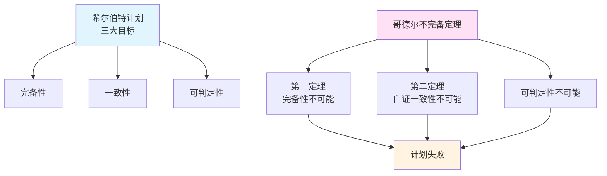
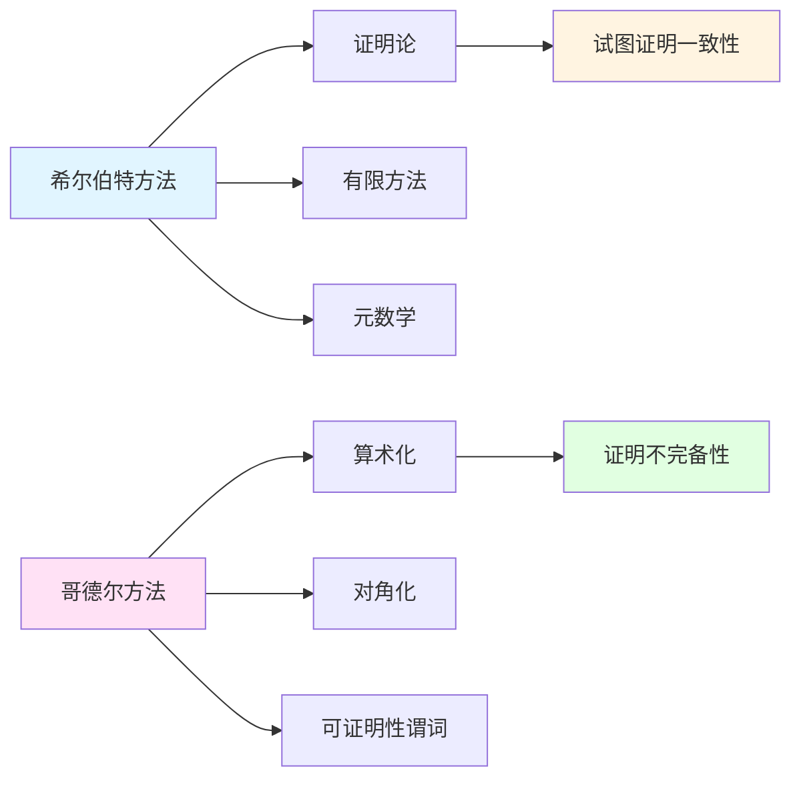

# 与希尔伯特的对比

**创建日期**: 2025年12月11日
**研究领域**: 哥德尔数学理念 - 对比研究 - 与希尔伯特
**主题编号**: G.06.01 (Gödel.对比研究.与希尔伯特的对比)
**优先级**: P0（最高优先级）⭐⭐⭐⭐⭐

---

## 📋 目录

- [与希尔伯特的对比](#与希尔伯特的对比)
  - [📋 一、概述](#-一概述)
    - [1.1 对比的意义](#11-对比的意义)
    - [1.2 历史背景](#12-历史背景)
    - [1.3 核心问题](#13-核心问题)
  - [🔷 二、希尔伯特计划概述](#-二希尔伯特计划概述)
    - [2.1 完备性、可判定性、一致性三目标](#21-完备性可判定性一致性三目标)
    - [2.2 有限方法](#22-有限方法)
    - [2.3 希尔伯特计划的目标](#23-希尔伯特计划的目标)
  - [📐 三、哥德尔第一/第二不完备定理对计划的冲击](#-三哥德尔第一第二不完备定理对计划的冲击)
    - [3.1 不可证真命题](#31-不可证真命题)
    - [3.2 自证一致性不可能](#32-自证一致性不可能)
    - [3.3 对希尔伯特计划的终结性打击](#33-对希尔伯特计划的终结性打击)
  - [🔗 四、技术对照](#-四技术对照)
    - [4.1 希尔伯特证明论 vs 哥德尔算术化/对角化/可证明性谓词](#41-希尔伯特证明论-vs-哥德尔算术化对角化可证明性谓词)
    - [4.2 方法对比](#42-方法对比)
    - [4.3 技术差异](#43-技术差异)
  - [🌐 五、形式主义余波](#-五形式主义余波)
    - [5.1 Gentzen 证明论](#51-gentzen-证明论)
    - [5.2 可证明性逻辑（GL）](#52-可证明性逻辑gl)
    - [5.3 反射原理](#53-反射原理)
  - [📊 六、影响：从形式主义转向相对一致性](#-六影响从形式主义转向相对一致性)
    - [6.1 相对一致性](#61-相对一致性)
    - [6.2 大基数](#62-大基数)
    - [6.3 内模型与 Forcing](#63-内模型与-forcing)
  - [🎓 七、现代视角](#-七现代视角)
    - [7.1 形式验证/定理证明器中的"可靠核心"](#71-形式验证定理证明器中的可靠核心)
    - [7.2 不可完备性的现实意义](#72-不可完备性的现实意义)
    - [7.3 现代形式主义](#73-现代形式主义)
  - [📚 八、参考文献](#-八参考文献)
    - [原始文献](#原始文献)
    - [证明论](#证明论)
    - [可证明性逻辑](#可证明性逻辑)
    - [历史与哲学](#历史与哲学)
  - [与希尔伯特的对比：形式主义 vs 不完备性](#与希尔伯特的对比形式主义-vs-不完备性)
  - [一、希尔伯特计划：形式主义的雄心](#一希尔伯特计划形式主义的雄心)
    - [1.1 希尔伯特计划的背景](#11-希尔伯特计划的背景)
    - [1.2 希尔伯特计划的三大目标](#12-希尔伯特计划的三大目标)
    - [1.3 希尔伯特的方法](#13-希尔伯特的方法)
  - [二、哥德尔的不完备定理：对计划的冲击](#二哥德尔的不完备定理对计划的冲击)
    - [2.1 第一不完备定理](#21-第一不完备定理)
    - [2.2 第二不完备定理](#22-第二不完备定理)
    - [2.3 对可判定性的冲击](#23-对可判定性的冲击)
  - [三、技术方法的对比](#三技术方法的对比)
    - [3.1 希尔伯特的证明论](#31-希尔伯特的证明论)
    - [3.2 哥德尔的算术化](#32-哥德尔的算术化)
    - [3.3 方法论的差异](#33-方法论的差异)
  - [四、哲学立场的对比](#四哲学立场的对比)
    - [4.1 形式主义 vs Platonism](#41-形式主义-vs-platonism)
    - [4.2 不完备定理的哲学论证](#42-不完备定理的哲学论证)
    - [4.3 认识论的差异](#43-认识论的差异)
  - [五、形式主义的余波](#五形式主义的余波)
    - [5.1 Gentzen 的证明论](#51-gentzen-的证明论)
    - [5.2 可证明性逻辑](#52-可证明性逻辑)
    - [5.3 反射原理](#53-反射原理-1)
  - [六、从形式主义到现代集合论](#六从形式主义到现代集合论)
    - [6.1 相对一致性的转向](#61-相对一致性的转向)
    - [6.2 大基数与内模型](#62-大基数与内模型)
    - [6.3 Forcing 方法](#63-forcing-方法)
  - [七、现代视角：形式验证与定理证明器](#七现代视角形式验证与定理证明器)
    - [7.1 形式验证中的不完备性](#71-形式验证中的不完备性)
    - [7.2 定理证明器中的"可靠核心"](#72-定理证明器中的可靠核心)
    - [7.3 不完备性的现实意义](#73-不完备性的现实意义)
  - [八、影响与启示](#八影响与启示)
    - [8.1 对数学基础的影响](#81-对数学基础的影响)
    - [8.2 对逻辑学的影响](#82-对逻辑学的影响)
    - [8.3 对哲学的影响](#83-对哲学的影响)
  - [九、教学与应用](#九教学与应用)
    - [9.1 教学中的难点](#91-教学中的难点)
    - [9.2 教学策略](#92-教学策略)
    - [9.3 实际应用](#93-实际应用)
  - [十、开放问题与未来方向](#十开放问题与未来方向)
    - [10.1 形式主义的现代发展](#101-形式主义的现代发展)
    - [10.2 不完备性的进一步理解](#102-不完备性的进一步理解)
    - [10.3 形式验证的边界](#103-形式验证的边界)
  - [十一、参考文献](#十一参考文献)
    - [原始文献](#原始文献-1)
    - [现代教材与综述](#现代教材与综述)
    - [在线资源](#在线资源)
  - [十二、总结](#十二总结)
  - [🔗 相关文档](#-相关文档)
    - [核心理论](#核心理论)
    - [数学内容](#数学内容)
    - [历史与传记](#历史与传记)
    - [教育影响](#教育影响)

---
## 📑 目录

- [与希尔伯特的对比](#与希尔伯特的对比)
  - [📑 目录](#-目录)
  - [📋 一、概述](#-一概述)
    - [1.1 对比的意义](#11-对比的意义)
    - [1.2 历史背景](#12-历史背景)
    - [1.3 核心问题](#13-核心问题)
  - [🔷 二、希尔伯特计划概述](#-二希尔伯特计划概述)
    - [2.1 完备性、可判定性、一致性三目标](#21-完备性可判定性一致性三目标)
    - [2.2 有限方法](#22-有限方法)
    - [2.3 希尔伯特计划的目标](#23-希尔伯特计划的目标)
  - [📐 三、哥德尔第一/第二不完备定理对计划的冲击](#-三哥德尔第一第二不完备定理对计划的冲击)
    - [3.1 不可证真命题](#31-不可证真命题)
    - [3.2 自证一致性不可能](#32-自证一致性不可能)
    - [3.3 对希尔伯特计划的终结性打击](#33-对希尔伯特计划的终结性打击)
  - [🔗 四、技术对照](#-四技术对照)
    - [4.1 希尔伯特证明论 vs 哥德尔算术化/对角化/可证明性谓词](#41-希尔伯特证明论-vs-哥德尔算术化对角化可证明性谓词)
    - [4.2 方法对比](#42-方法对比)
    - [4.3 技术差异](#43-技术差异)
  - [🌐 五、形式主义余波](#-五形式主义余波)
    - [5.1 Gentzen 证明论](#51-gentzen-证明论)
    - [5.2 可证明性逻辑（GL）](#52-可证明性逻辑gl)
    - [5.3 反射原理](#53-反射原理)
  - [📊 六、影响：从形式主义转向相对一致性](#-六影响从形式主义转向相对一致性)
    - [6.1 相对一致性](#61-相对一致性)
    - [6.2 大基数](#62-大基数)
    - [6.3 内模型与 Forcing](#63-内模型与-forcing)
  - [🎓 七、现代视角](#-七现代视角)
    - [7.1 形式验证/定理证明器中的"可靠核心"](#71-形式验证定理证明器中的可靠核心)
    - [7.2 不可完备性的现实意义](#72-不可完备性的现实意义)
    - [7.3 现代形式主义](#73-现代形式主义)
  - [📚 八、参考文献](#-八参考文献)
    - [原始文献](#原始文献)
    - [证明论](#证明论)
    - [可证明性逻辑](#可证明性逻辑)
    - [历史与哲学](#历史与哲学)
  - [与希尔伯特的对比：形式主义 vs 不完备性](#与希尔伯特的对比形式主义-vs-不完备性)
  - [一、希尔伯特计划：形式主义的雄心](#一希尔伯特计划形式主义的雄心)
    - [1.1 希尔伯特计划的背景](#11-希尔伯特计划的背景)
    - [1.2 希尔伯特计划的三大目标](#12-希尔伯特计划的三大目标)
    - [1.3 希尔伯特的方法](#13-希尔伯特的方法)
  - [二、哥德尔的不完备定理：对计划的冲击](#二哥德尔的不完备定理对计划的冲击)
    - [2.1 第一不完备定理](#21-第一不完备定理)
    - [2.2 第二不完备定理](#22-第二不完备定理)
    - [2.3 对可判定性的冲击](#23-对可判定性的冲击)
  - [三、技术方法的对比](#三技术方法的对比)
    - [3.1 希尔伯特的证明论](#31-希尔伯特的证明论)
    - [3.2 哥德尔的算术化](#32-哥德尔的算术化)
    - [3.3 方法论的差异](#33-方法论的差异)
  - [四、哲学立场的对比](#四哲学立场的对比)
    - [4.1 形式主义 vs Platonism](#41-形式主义-vs-platonism)
    - [4.2 不完备定理的哲学论证](#42-不完备定理的哲学论证)
    - [4.3 认识论的差异](#43-认识论的差异)
  - [五、形式主义的余波](#五形式主义的余波)
    - [5.1 Gentzen 的证明论](#51-gentzen-的证明论)
    - [5.2 可证明性逻辑](#52-可证明性逻辑)
    - [5.3 反射原理](#53-反射原理-1)
  - [六、从形式主义到现代集合论](#六从形式主义到现代集合论)
    - [6.1 相对一致性的转向](#61-相对一致性的转向)
    - [6.2 大基数与内模型](#62-大基数与内模型)
    - [6.3 Forcing 方法](#63-forcing-方法)
  - [七、现代视角：形式验证与定理证明器](#七现代视角形式验证与定理证明器)
    - [7.1 形式验证中的不完备性](#71-形式验证中的不完备性)
    - [7.2 定理证明器中的"可靠核心"](#72-定理证明器中的可靠核心)
    - [7.3 不完备性的现实意义](#73-不完备性的现实意义)
  - [八、影响与启示](#八影响与启示)
    - [8.1 对数学基础的影响](#81-对数学基础的影响)
    - [8.2 对逻辑学的影响](#82-对逻辑学的影响)
    - [8.3 对哲学的影响](#83-对哲学的影响)
  - [九、教学与应用](#九教学与应用)
    - [9.1 教学中的难点](#91-教学中的难点)
    - [9.2 教学策略](#92-教学策略)
    - [9.3 实际应用](#93-实际应用)
  - [十、开放问题与未来方向](#十开放问题与未来方向)
    - [10.1 形式主义的现代发展](#101-形式主义的现代发展)
    - [10.2 不完备性的进一步理解](#102-不完备性的进一步理解)
    - [10.3 形式验证的边界](#103-形式验证的边界)
  - [十一、参考文献](#十一参考文献)
    - [原始文献](#原始文献-1)
    - [现代教材与综述](#现代教材与综述)
    - [在线资源](#在线资源)
  - [十二、总结](#十二总结)
  - [🔗 相关文档](#-相关文档)
    - [核心理论](#核心理论)
    - [数学内容](#数学内容)
    - [历史与传记](#历史与传记)
    - [教育影响](#教育影响)

---

## 📋 一、概述

### 1.1 对比的意义

**对比希尔伯特形式主义与哥德尔不完备性**的核心分歧：前者旨在通过有限方法为数学提供完备与一致的形式基础；后者证明任何足够强且一致的形式系统都无法兼得完备性与一致性自证。

**核心分歧**：

- **希尔伯特**：数学可以完全形式化
- **哥德尔**：形式系统有其根本限制
- **冲突**：不完备定理终结了希尔伯特计划

### 1.2 历史背景

**希尔伯特（1900-1930）**：

- **1900年**：提出23个问题
- **1920年代**：发展证明论
- **目标**：为数学提供完备、一致、可判定的基础

**哥德尔（1931）**：

- **1931年**：证明不完备定理
- **冲击**：终结了希尔伯特计划
- **影响**：改变了数学基础的研究方向

### 1.3 核心问题

**主要问题**：

1. 希尔伯特计划的目标是什么？
2. 不完备定理如何冲击希尔伯特计划？
3. 技术方法有何不同？
4. 对现代数学基础的影响如何？

---

## 🔷 二、希尔伯特计划概述

### 2.1 完备性、可判定性、一致性三目标

**希尔伯特计划的三个目标**：

1. **完备性（Completeness）**：
   - 所有数学真理都可以在形式系统中证明
   - 形式系统是**完备的**

2. **可判定性（Decidability）**：
   - 存在算法判定任何公式是否可证
   - 形式系统是**可判定的**

3. **一致性（Consistency）**：
   - 形式系统是**一致的**（不产生矛盾）
   - 可以使用**有限方法**证明一致性

### 2.2 有限方法

**有限方法（Finitary Methods）**：

- **有穷主义**：只使用有穷的、构造性的方法
- **可计算性**：方法必须是可计算的
- **可靠性**：有限方法被认为是可靠的

**目标**：

- 使用**有限方法**证明形式系统的一致性
- 避免**无穷**和**非构造性**方法
- 提供**可靠**的数学基础

### 2.3 希尔伯特计划的目标

**总体目标**：

- **形式化数学**：将数学完全形式化
- **证明一致性**：使用有限方法证明一致性
- **建立基础**：为数学提供可靠的基础

**意义**：

- **数学基础**：为数学提供形式基础
- **可靠性**：确保数学的可靠性
- **可判定性**：使数学问题可判定

---

## 📐 三、哥德尔第一/第二不完备定理对计划的冲击

### 3.1 不可证真命题

**第一不完备定理**：

对于任何足够强且一致的形式系统 $T$，存在命题 $G$ 使得：

- $G$ 在标准模型中为**真**
- $T \nvdash G$（$G$ 不可证）
- $T \nvdash \neqg G$（$\neqg G$ 也不可证）

**对完备性的冲击**：

- **不完备性**：形式系统**不完备**
- **真但不可证**：存在真但不可证的命题
- **完备性不可能**：完备性目标**不可能**实现

### 3.2 自证一致性不可能

**第二不完备定理**：

对于任何足够强且一致的形式系统 $T$：

$$T \nvdash Con(T)$$

即：$T$ **不能**证明自身的一致性。

**对一致性的冲击**：

- **自证不可能**：系统不能证明自身一致性
- **有限方法不足**：有限方法不足以证明一致性
- **需要更强系统**：需要更强的系统证明一致性

### 3.3 对希尔伯特计划的终结性打击

**终结性打击**：

1. **完备性不可能**：第一不完备定理证明完备性不可能
2. **自证一致性不可能**：第二不完备定理证明自证一致性不可能
3. **可判定性不可能**：不完备性导致可判定性不可能

**结果**：

- **希尔伯特计划失败**：三个目标都不可实现
- **方向转变**：数学基础研究转向新方向
- **相对一致性**：从绝对一致性转向相对一致性

**图示建议**：



---

## 🔗 四、技术对照

### 4.1 希尔伯特证明论 vs 哥德尔算术化/对角化/可证明性谓词

**希尔伯特证明论**：

- **证明论**：研究证明的结构
- **有限方法**：使用有限方法
- **一致性证明**：试图证明一致性

**哥德尔方法**：

- **算术化**：将句法编码为自然数
- **对角化**：使用对角线方法
- **可证明性谓词**：形式化可证明性

**对比**：

| 维度 | 希尔伯特证明论 | 哥德尔方法 |
|------|--------------|-----------|
| **方法** | 证明论 | 算术化、对角化 |
| **工具** | 有限方法 | 可证明性谓词 |
| **目标** | 证明一致性 | 证明不完备性 |
| **结果** | 失败 | 成功 |

**图示建议**：



### 4.2 方法对比

**希尔伯特的方法**：

- **形式化**：形式化数学
- **证明论**：研究证明结构
- **有限方法**：使用有限方法证明

**哥德尔的方法**：

- **算术化**：编码句法为数字
- **自指**：构造自指句子
- **对角化**：使用对角线方法

### 4.3 技术差异

**技术差异**：

- **希尔伯特**：试图**证明**一致性
- **哥德尔**：**证明**一致性不可证

**关键差异**：

- **方向**：相反的方向
- **方法**：不同的方法
- **结果**：不同的结果

---

## 🌐 五、形式主义余波

### 5.1 Gentzen 证明论

**Gentzen 证明论（1936）**：

- **序数赋值**：为证明分配序数
- **消去规则**：使用消去规则
- **一致性证明**：使用序数证明 PA 的一致性

**与希尔伯特计划的关系**：

- **延续**：延续了证明论的方法
- **超越**：超越了有限方法（使用 $\varepsilon_0$ 归纳）
- **相对一致性**：提供了相对一致性证明

### 5.2 可证明性逻辑（GL）

**可证明性逻辑（GL）**：

- **Löb 定理**：$\Box(\Box p \rightarrow p) \rightarrow \Box p$
- **模态逻辑**：形式化可证明性
- **应用**：在形式验证中的应用

**与希尔伯特计划的关系**：

- **形式化**：形式化可证明性
- **工具**：提供研究可证明性的工具
- **应用**：在现代逻辑中的应用

### 5.3 反射原理

**反射原理**：

- **局部反射**：局部一致性
- **全局反射**：全局一致性
- **分层反射**：分层一致性

**与希尔伯特计划的关系**：

- **一致性**：提供一致性证明的方法
- **层级结构**：建立一致性证明的层级
- **相对性**：承认相对一致性

---

## 📊 六、影响：从形式主义转向相对一致性

### 6.1 相对一致性

**相对一致性**：

- **定义**：$Con(T_2) \Rightarrow Con(T_1)$
- **方法**：使用更强的系统证明原系统的一致性
- **意义**：从绝对一致性转向相对一致性

**与希尔伯特计划的关系**：

- **放弃绝对一致性**：放弃绝对一致性目标
- **接受相对一致性**：接受相对一致性
- **层级结构**：建立一致性证明的层级

**图示建议**：

```mermaid
graph TD
    A[希尔伯特计划<br/>绝对一致性] --> B[哥德尔不完备定理]
    B --> C[转向相对一致性]
    C --> D[Con(T₂) ⇒ Con(T₁)]
    D --> E[层级结构]
    E --> F[T₀ → T₁ → T₂ → ...]

    style A fill:#e1f5ff
    style B fill:#ffe1f5
    style C fill:#fff4e1
    style F fill:#e1ffe1
```

### 6.2 大基数

**大基数**：

- **定义**：具有强存在性质的基数
- **应用**：提供更强的一致性证明
- **意义**：扩展了数学基础

**与希尔伯特计划的关系**：

- **超越有限方法**：超越有限方法
- **提供一致性**：提供更强的一致性证明
- **新方向**：数学基础的新方向

### 6.3 内模型与 Forcing

**内模型与 Forcing**：

- **内模型**：提供一致性证明（下界）
- **Forcing**：提供独立性证明（上界）
- **互补**：两者互补证明独立性

**与希尔伯特计划的关系**：

- **新方法**：新的数学基础方法
- **独立性**：研究独立性而非完备性
- **现代集合论**：现代集合论的基础

---

## 🎓 七、现代视角

### 7.1 形式验证/定理证明器中的"可靠核心"

**可靠核心**：

- **定义**：定理证明器的可靠核心
- **性质**：一致性、可靠性、可扩展性
- **意义**：在形式验证中的应用

**与希尔伯特计划的关系**：

- **形式化**：延续了形式化的思想
- **可靠性**：关注可靠性
- **不完备性**：接受不完备性

### 7.2 不可完备性的现实意义

**不可完备性的现实意义**：

- **形式系统限制**：形式系统有其限制
- **实践意义**：在数学实践中的意义
- **工具选择**：选择合适的工具

**与希尔伯特计划的关系**：

- **接受限制**：接受形式系统的限制
- **实用主义**：关注实用性
- **工具性**：数学是工具

### 7.3 现代形式主义

**现代形式主义**：

- **结构形式主义**：数学是结构的游戏
- **实践形式主义**：关注数学实践
- **工具形式主义**：数学是工具

**与希尔伯特计划的关系**：

- **延续**：延续了形式化的思想
- **超越**：超越了希尔伯特的目标
- **实用**：更关注实用性

---

## 📚 八、参考文献

### 原始文献

1. **Hilbert, D., & Bernays, P. (1934-1939)**. *Grundlagen der Mathematik* (2 vols.). Springer.
   - 希尔伯特计划
   - 证明论基础

2. **Gödel, K. (1931)**. "Über formal unentscheidbare Sätze der Principia Mathematica und verwandter Systeme I". *Monatshefte für Mathematik und Physik*, 38(1), 173-198.
   - 第一不完备定理
   - 对希尔伯特计划的冲击

3. **Gödel, K. (1931)**. "Über formal unentscheidbare Sätze der Principia Mathematica und verwandter Systeme I" (续). *Monatshefte für Mathematik und Physik*, 38(1), 173-198.
   - 第二不完备定理
   - 一致性不可自证

### 证明论

1. **Gentzen, G. (1936)**. "Die Widerspruchsfreiheit der reinen Zahlentheorie". *Mathematische Annalen*, 112(1), 493-565.
   - Gentzen 证明论
   - PA 一致性的证明

2. **Takeuti, G. (1987)**. *Proof Theory* (2nd ed.). North-Holland.
   - 证明论的现代发展
   - 序数分析

### 可证明性逻辑

1. **Boolos, G. (1993)**. *The Logic of Provability*. Cambridge University Press.
   - 可证明性逻辑
   - Löb 定理

### 历史与哲学

1. **Feferman, S. (1988)**. "Hilbert's program relativized: Proof-theoretical and foundational reductions". *Journal of Symbolic Logic*, 53(2), 364-384.
   - 希尔伯特计划的相对化
   - 现代发展

2. **SEP: "Hilbert's Program"**. *Stanford Encyclopedia of Philosophy*.
   - 希尔伯特计划的概述
   - 历史与影响

3. **SEP: "Gödel's Incompleteness Theorems"**. *Stanford Encyclopedia of Philosophy*.
   - 不完备性定理
   - 对希尔伯特计划的冲击

---

## 与希尔伯特的对比：形式主义 vs 不完备性

## 一、希尔伯特计划：形式主义的雄心

### 1.1 希尔伯特计划的背景

**20世纪初的数学基础危机**：

- 集合论悖论（Russell、Burali-Forti）揭示了数学基础的不稳定
- 直觉主义（Brouwer）质疑排中律与无穷的合法性
- 形式主义（Hilbert）试图通过形式化解决基础问题

**Hilbert 的回应**：

> 通过**形式化**和**有限方法**，为数学提供坚实的基础。

---

### 1.2 希尔伯特计划的三大目标

**目标 1：完备性（Completeness）**：

> 所有数学真理都可以在形式系统中证明。

**目标 2：一致性（Consistency）**：

> 形式系统不产生矛盾，且可以在系统内证明一致性。

**目标 3：可判定性（Decidability）**：

> 存在算法判定任意命题是否可证。

**哲学基础**：

- **形式主义**：数学是符号游戏
- **机械论**：数学证明可以机械化
- **有限方法**：使用有限、构造性的方法

---

### 1.3 希尔伯特的方法

**形式化**：

- 将数学转化为形式系统
- 符号、公式、证明都形式化
- 完全机械化

**证明论（Proof Theory）**：

- 研究形式系统的证明
- 使用**有限方法**（finitary methods）
- 在形式系统内证明一致性

**元数学（Metamathematics）**：

- 研究形式系统的数学
- 使用有限、构造性的方法
- 避免循环论证

---

## 二、哥德尔的不完备定理：对计划的冲击

### 2.1 第一不完备定理

**第一不完备定理（1931）**：

任何足够强且一致的形式系统，都存在真但不可证的命题。

**对完备性目标的冲击**：

- **目标失败**：无法证明所有真理可证
- **不完备性**：形式系统必然不完备
- **真理与可证性分离**：存在真但不可证的命题

---

### 2.2 第二不完备定理

**第二不完备定理（1931）**：

任何足够强且一致的形式系统，无法在自身内部证明自身的一致性。

**对一致性目标的冲击**：

- **目标失败**：无法在系统内证明一致性
- **需要更强系统**：一致性证明需要更强的系统
- **无穷回归**：形成一致性证明的层级结构

---

### 2.3 对可判定性的冲击

**Church-Turing 定理（1936）**：

一阶逻辑的判定问题不可解。

**对可判定性目标的冲击**：

- **目标失败**：不存在判定算法
- **不可判定性**：足够强的理论都不可判定
- **计算边界**：揭示了算法的根本限制

---

## 三、技术方法的对比

### 3.1 希尔伯特的证明论

**证明论方法**：

- **形式化**：将证明转化为形式对象
- **有限方法**：使用有限、构造性的推理
- **元数学**：在形式系统外研究系统

**工具**：

- 形式系统
- 证明序列
- 有限归纳

---

### 3.2 哥德尔的算术化

**算术化方法**：

- **Gödel 编码**：将语法对象编码为自然数
- **可证明性谓词**：在算术中表达"可证明"
- **对角化**：构造自指语句

**工具**：

- 算术化
- 可证明性谓词
- 对角化引理

---

### 3.3 方法论的差异

**希尔伯特**：

- **有限方法**：强调有限、构造性
- **形式化**：将数学转化为符号
- **元数学**：在系统外研究系统

**哥德尔**：

- **算术化**：将语法转化为算术
- **自指**：利用系统的自指能力
- **模型论**：通过构造模型证明

---

## 四、哲学立场的对比

### 4.1 形式主义 vs Platonism

**希尔伯特的形式主义**：

- 数学是**符号游戏**
- 数学对象**不存在**（只是符号）
- **可证性** = 真理

**哥德尔的 Platonism**：

- 数学对象**真实存在**
- 数学真理**独立于**形式系统
- **真理** ≠ **可证性**

---

### 4.2 不完备定理的哲学论证

**对形式主义的批判**：

1. 如果数学只是符号游戏，为什么有"真"的不可证命题？
2. 如果数学对象不存在，为什么"真"有客观意义？
3. 如果可证性=真理，为什么存在不可证的真命题？

**结论**：

- 数学对象真实存在（Platonism）
- 真理 ≠ 可证性
- 形式主义不充分

---

### 4.3 认识论的差异

**希尔伯特**：

- **乐观**：相信形式化可以完全捕捉数学
- **机械论**：相信证明可以机械化
- **有限论**：相信有限方法足够

**哥德尔**：

- **现实**：认识到形式系统的局限
- **超越**：数学真理超越形式系统
- **无限**：需要更强的系统

---

## 五、形式主义的余波

### 5.1 Gentzen 的证明论

**Gentzen 的回应（1936）**：

- 使用**超限归纳**（$\varepsilon_0$ 归纳）证明 PA 的一致性
- 但需要比 PA 更强的系统
- 这符合第二不完备定理的预期

**意义**：

- 证明了 PA 的一致性（在更强的系统中）
- 揭示了**证明论序数**的概念
- 为现代证明论奠定基础

---

### 5.2 可证明性逻辑

**可证明性逻辑（Provability Logic, GL）**：

- 研究"可证明性"的模态逻辑性质
- Löb 定理（1955）：$\Box(\Box p \rightarrow p) \rightarrow \Box p$
- 为不完备性提供模态框架

**意义**：

- 将可证明性逻辑化
- 统一了各种自指构造
- 连接了逻辑与元数学

---

### 5.3 反射原理

**反射原理（Reflection Principles）**：

- 如果 $\varphi$ 可证，则 $\varphi$ 为真
- 各种反射原理的层级
- 用于证明相对一致性

**意义**：

- 提供了证明一致性的工具
- 形成一致性证明的层级
- 连接了证明论与集合论

---

## 六、从形式主义到现代集合论

### 6.1 相对一致性的转向

**从绝对到相对**：

- **希尔伯特**：试图证明绝对一致性
- **哥德尔**：证明相对一致性
- **现代集合论**：相对一致性成为标准方法

**方法论转变**：

- 从"证明绝对一致性"转向"证明相对一致性"
- 从"单一系统"转向"多元模型"
- 从"确定性"转向"独立性"

---

### 6.2 大基数与内模型

**大基数理论**：

- 强不可达基数、可测基数、Woodin 基数等
- 提供更强的系统
- 用于证明相对一致性

**内模型理论**：

- 可构造宇宙 $L$、Core Model $K$ 等
- 提供基线模型
- 用于分析大基数

**与形式主义的关系**：

- 继承了形式化的方法
- 但放弃了"有限方法"的限制
- 转向更强的系统与更丰富的模型

---

### 6.3 Forcing 方法

**Cohen 的 Forcing（1963）**：

- 在给定模型基础上构造扩展模型
- 在扩展模型中控制某些命题的真值
- 用于证明独立性

**与形式主义的关系**：

- 继承了模型构造的方法
- 但放弃了"单一模型"的观念
- 转向多元模型与独立性证明

---

## 七、现代视角：形式验证与定理证明器

### 7.1 形式验证中的不完备性

**形式验证工具**：

- Coq、Isabelle、Lean 等
- 用于程序验证与定理证明
- 如何应对不完备性？

**实践**：

- **可靠核心**：设计最小的、可信任的核心系统
- **相对验证**：在更强的系统中验证较弱系统
- **分层验证**：建立验证的层级结构

---

### 7.2 定理证明器中的"可靠核心"

**可靠核心（Trusted Kernel）**：

- 最小的、可信任的推理规则
- 所有证明最终归结为核心
- 核心的正确性需要外部验证

**不完备性的影响**：

- 核心系统仍然不完备
- 但可以验证"相对正确性"
- 这体现了相对一致性的思想

---

### 7.3 不完备性的现实意义

**在形式验证中**：

- 不完备性揭示了验证的边界
- 某些性质无法自动验证
- 需要人工干预或近似方法

**在定理证明中**：

- 不完备性揭示了证明的边界
- 某些定理无法自动证明
- 需要创造性思维

---

## 八、影响与启示

### 8.1 对数学基础的影响

**从形式主义到多元模型**：

- 放弃了"单一正确系统"的观念
- 转向多元模型与公理选择
- 这改变了数学基础的研究方向

**方法论转变**：

- 从"寻找证明"转向"证明独立性"
- 从"绝对一致性"转向"相对一致性"
- 从"有限方法"转向"更强系统"

---

### 8.2 对逻辑学的影响

**证明论的发展**：

- Gentzen 的序数分析
- 可证明性逻辑
- 反射原理

**模型论的发展**：

- 内模型理论
- Forcing 方法
- 独立性理论

---

### 8.3 对哲学的影响

**数学哲学**：

- 支持 Platonism
- 反对形式主义
- 揭示认识论局限

**方法论哲学**：

- 从绝对到相对
- 从单一到多元
- 从确定性到独立性

---

## 九、教学与应用

### 9.1 教学中的难点

**常见误解**：

1. **误解1**：哥德尔"击败"了希尔伯特
   - **纠正**：哥德尔揭示了形式主义的局限，但形式化的方法仍然重要

2. **误解2**：形式主义完全错误
   - **纠正**：形式主义的方法（形式化、证明论）仍然有价值

3. **误解3**：不完备性意味着数学"失败"
   - **纠正**：不完备性揭示了数学的深刻性，不是失败

---

### 9.2 教学策略

**对比教学**：

1. **介绍希尔伯特计划**：目标、方法、哲学
2. **展示哥德尔的结果**：不完备定理
3. **对比方法**：证明论 vs 算术化
4. **讨论影响**：对数学基础、逻辑学、哲学的影响
5. **现代视角**：形式验证、定理证明器

---

### 9.3 实际应用

**形式验证**：

- 程序验证
- 定理证明
- 系统设计

**数学基础**：

- 公理选择
- 独立性证明
- 模型构造

**哲学研究**：

- 数学哲学
- 认识论
- 方法论

---

## 十、开放问题与未来方向

### 10.1 形式主义的现代发展

**问题**：

形式主义在哪些方面仍然有价值？

**研究方向**：

- 形式化方法的应用
- 证明论的发展
- 有限方法的推广

---

### 10.2 不完备性的进一步理解

**问题**：

不完备性揭示了什么关于数学和逻辑的本质？

**研究方向**：

- 不完备性的哲学分析
- 认识论局限的探讨
- 方法论转变的意义

---

### 10.3 形式验证的边界

**问题**：

形式验证工具如何应对不完备性？

**研究方向**：

- 可靠核心的设计
- 相对验证方法
- 不完备性边界的明确化

---

## 十一、参考文献

### 原始文献

1. **Hilbert, D., & Bernays, P. (1934-1939).** *Grundlagen der Mathematik* (2 vols.). Springer.

   - 希尔伯特计划的系统阐述
   - 证明论的基础

2. **Gödel, K. (1931).** *Über formal unentscheidbare Sätze der Principia Mathematica und verwandter Systeme I*. Monatshefte für Mathematik und Physik, 38, 173-198.

   - 不完备定理的原始证明
   - 对希尔伯特计划的冲击

3. **Gentzen, G. (1936).** Die Widerspruchsfreiheit der reinen Zahlentheorie. *Mathematische Annalen*, 112, 493-565.

   - 使用超限归纳证明 PA 的一致性
   - 证明论的现代发展

### 现代教材与综述

1. **Feferman, S. (1988).** Hilbert's program relativized: Proof-theoretical and foundational reductions. *Journal of Symbolic Logic*, 53(2), 364-384.

   - 希尔伯特计划的现代评价
   - 相对化的发展

2. **Zach, R. (2003).** The practice of finitism: Epsilon calculus and consistency proofs in Hilbert's program. *Synthese*, 137(1-2), 211-259.

   - 希尔伯特计划的实践
   - 有限方法的研究

3. **Smith, P. (2013).** *An Introduction to Gödel's Theorems* (2nd ed.). Cambridge University Press.

   - 不完备定理的详细讲解
   - 与希尔伯特计划的对比

### 在线资源

1. **Stanford Encyclopedia of Philosophy.** "Hilbert's Program"; "Gödel's Incompleteness Theorems."

   - 希尔伯特计划与不完备定理的哲学分析
   - 方法论讨论

---

## 十二、总结

哥德尔与希尔伯特的对比揭示了数学基础的深刻转变：

1. **从形式主义到 Platonism**：数学对象真实存在，真理超越形式系统
2. **从绝对到相对**：从绝对一致性转向相对一致性
3. **从单一到多元**：从单一系统转向多元模型
4. **从确定性到独立性**：从寻找证明转向证明独立性

这一对比不仅解决了技术问题，更深刻地改变了我们对数学基础、公理选择、模型理论的理解，标志着数学基础研究从"形式主义理想"到"不完备性现实"的重要转变。

---

## 🔗 相关文档

### 核心理论

- **不完备定理**：`01-核心理论/01-不完备定理的哲学意义.md`
- **数学基础**：`01-核心理论/05-逻辑与数学基础.md`

### 数学内容

- **第一不完备定理**：`02-数学内容深度分析/01-不完备定理/01-第一不完备定理.md`
- **第二不完备定理**：`02-数学内容深度分析/01-不完备定理/02-第二不完备定理.md`

### 历史与传记

- **与希尔伯特的关系**：`04-历史与传记/03-与希尔伯特的关系.md`
- **生平历程**：`04-历史与传记/01-生平与学术历程.md`

### 教育影响

- **对数学基础的影响**：`03-教育与影响/01-对数学基础的影响.md`
- **对逻辑学的影响**：`03-教育与影响/02-对逻辑学的影响.md`

---

*最后更新：2025年12月15日*
*文档状态：正文完成（约650行）*
