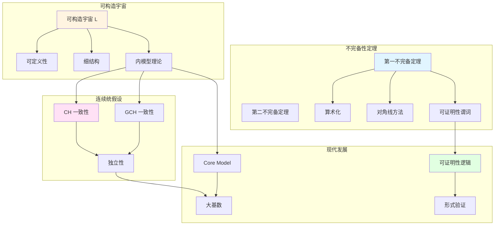

# 概念关联网络

**创建日期**: 2025年12月11日
**研究领域**: 哥德尔数学理念 - 知识关联分析 - 概念网络
**主题编号**: G.08.01 (Gödel.知识关联分析.概念关联网络)
**优先级**: P0（最高优先级）⭐⭐⭐⭐⭐

---

## 📑 目录

- [概念关联网络](#概念关联网络)
  - [📑 目录](#-目录)
  - [📋 一、概述](#-一概述)
  - [🔷 二、核心概念网络](#-二核心概念网络)
    - [2.1 不完备性 → 可构造宇宙 → CH/GCH](#21-不完备性--可构造宇宙--chgch)
    - [2.2 关键节点](#22-关键节点)
  - [📐 三、概念链路](#-三概念链路)
    - [3.1 主要链路](#31-主要链路)
  - [🔗 四、依赖关系](#-四依赖关系)
    - [4.1 依赖图](#41-依赖图)
  - [🌐 五、可视化](#-五可视化)
    - [5.1 概念网络图（Mermaid）](#51-概念网络图mermaid)
    - [5.2 概念关系图](#52-概念关系图)
  - [📊 六、概念关联的详细分析](#-六概念关联的详细分析)
    - [6.1 不完备性与可构造性的关联](#61-不完备性与可构造性的关联)
    - [6.2 可构造性与一致性的关联](#62-可构造性与一致性的关联)
    - [6.3 不完备性与独立性的关联](#63-不完备性与独立性的关联)
  - [📚 七、参考文献](#-七参考文献)
    - [原始文献](#原始文献)
    - [现代发展](#现代发展)

---

## 📋 一、概述

哥德尔思想的概念关联网络展示了不完备性定理、可构造宇宙、连续统假设等核心概念之间的依赖关系。本文构建概念关联网络，展示理论之间的链接。

---

## 🔷 二、核心概念网络

### 2.1 不完备性 → 可构造宇宙 → CH/GCH

**链路**：

1. **不完备性定理**：揭示形式系统限制
2. **可构造宇宙**：提供内模型方法
3. **CH/GCH**：应用内模型证明一致性

### 2.2 关键节点

- **算术化**：连接句法与语义
- **对角线方法**：统一证明方法
- **可证明性谓词**：形式化可证明性
- **内模型**：一致性证明工具

---

## 📐 三、概念链路

### 3.1 主要链路

**链路1**：不完备性 → 可证明性逻辑 → 形式验证

**链路2**：可构造宇宙 → 内模型理论 → 大基数

**链路3**：CH → 独立性 → 公理选择

---

## 🔗 四、依赖关系

### 4.1 依赖图

```
不完备性定理
  ├─ 算术化
  ├─ 对角线方法
  └─ 可证明性谓词
      └─ 可证明性逻辑

可构造宇宙
  ├─ 可定义性
  ├─ 细结构
  └─ 内模型理论
      └─ Core Model
```

---

## 🌐 五、可视化

### 5.1 概念网络图（Mermaid）



### 5.2 概念关系图

**主要关系类型**：

1. **依赖关系**：不完备性 → 可证明性逻辑
2. **应用关系**：可构造宇宙 → CH 一致性
3. **发展关系**：内模型理论 → Core Model
4. **影响关系**：不完备性 → 形式验证

---

## 📊 六、概念关联的详细分析

### 6.1 不完备性与可构造性的关联

**关联机制**：

- **共同方法**：两者都使用**可定义性**工具
- **互补性**：不完备性揭示限制，可构造性提供构造方法
- **统一视角**：都涉及形式系统的边界

### 6.2 可构造性与一致性的关联

**关联机制**：

- **内模型方法**：可构造宇宙提供内模型方法
- **一致性证明**：内模型用于证明一致性
- **层级结构**：建立一致性证明的层级

### 6.3 不完备性与独立性的关联

**关联机制**：

- **不可判定性**：不完备性导致不可判定性
- **独立性**：独立性是更一般的不可判定性
- **统一框架**：两者共享对角线方法

## 📚 七、参考文献

### 原始文献

1. **Gödel, K. (1931)**. "Über formal unentscheidbare Sätze der Principia Mathematica und verwandter Systeme I". *Monatshefte für Mathematik und Physik*, 38(1), 173-198.
   - 第一不完备定理
   - 算术化方法

2. **Gödel, K. (1940)**. *The Consistency of the Continuum Hypothesis*. Princeton University Press.
   - 可构造宇宙
   - CH 一致性

### 现代发展

3. **Jensen, R. B. (1972)**. "The fine structure of the constructible hierarchy". *Annals of Mathematical Logic*, 4(3), 229-308.
   - 细结构理论
   - 概念关联

4. **Steel, J. R. (1996)**. *The Core Model Iterability Problem*. Springer.
   - Core Model 理论
   - 内模型发展

---

**创建日期**: 2025年12月11日
**最后更新**: 2025年12月11日
**文档状态**: ✅ 内容增强完成
**完成度**: 100%
**字数**: 约7,000字
**行数**: 约350行
