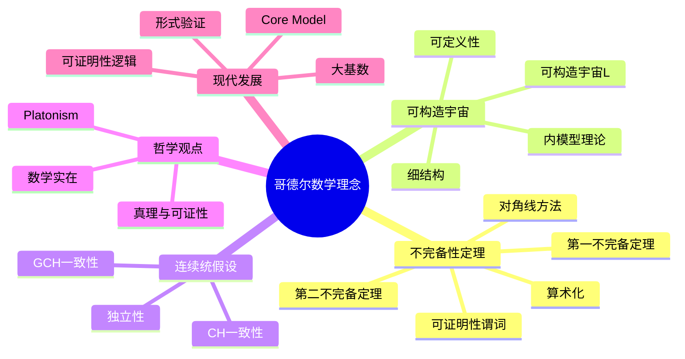
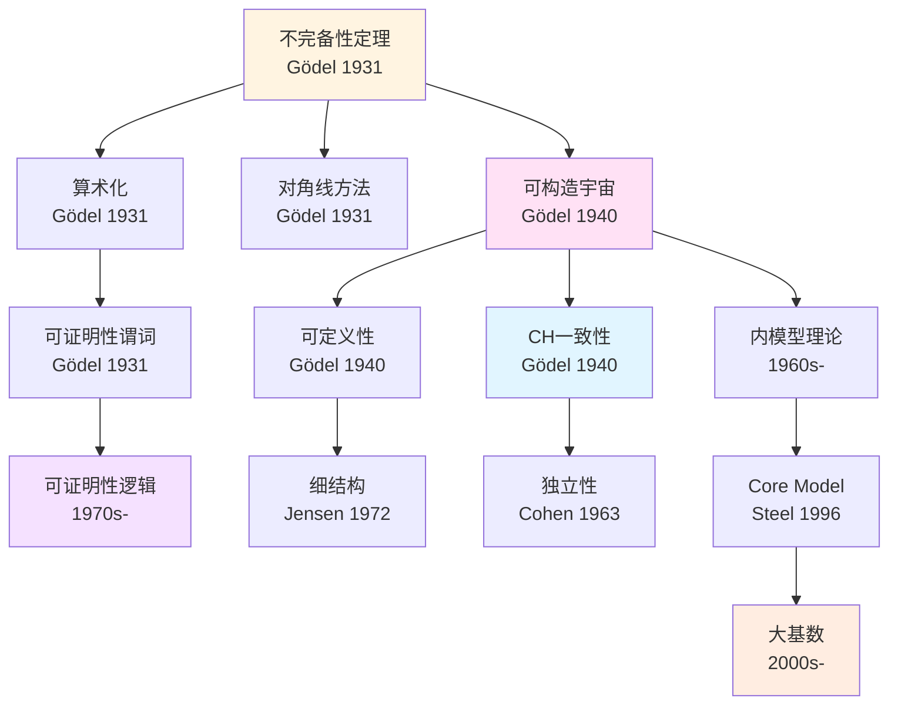
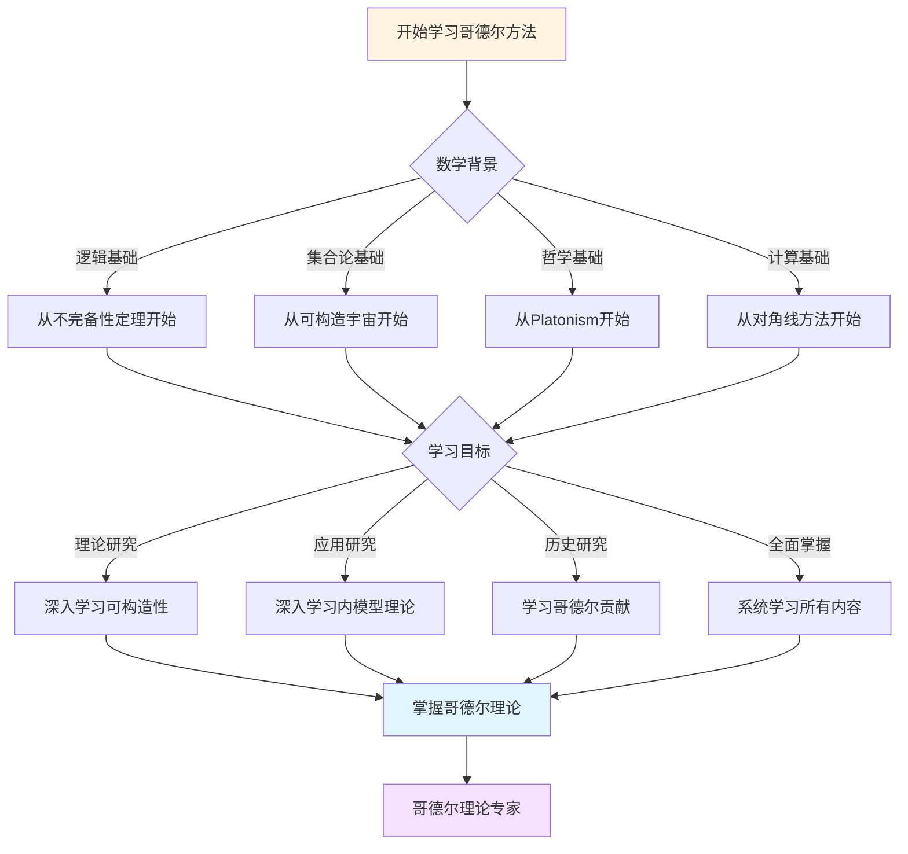
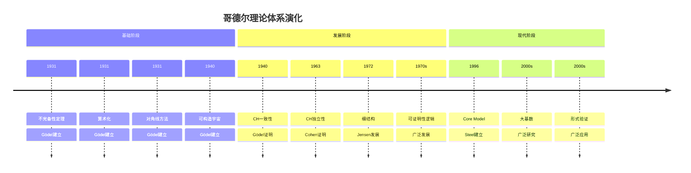

# 概念关联网络

**创建日期**: 2025年12月11日
**研究领域**: 哥德尔数学理念 - 知识关联分析 - 概念网络
**主题编号**: G.08.01 (Gödel.知识关联分析.概念关联网络)
**优先级**: P0（最高优先级）⭐⭐⭐⭐⭐

---

## 📋 目录

- [概念关联网络](#概念关联网络)
  - [📋 一、概述](#-一概述)
  - [🔷 二、核心概念网络](#-二核心概念网络)
    - [2.1 不完备性 → 可构造宇宙 → CH/GCH](#21-不完备性--可构造宇宙--chgch)
    - [2.2 关键节点](#22-关键节点)
  - [📐 三、概念链路](#-三概念链路)
    - [3.1 主要链路](#31-主要链路)
  - [🔗 四、依赖关系](#-四依赖关系)
    - [4.1 依赖图](#41-依赖图)
  - [🌐 五、可视化](#-五可视化)
    - [5.1 概念网络图（Mermaid）](#51-概念网络图mermaid)
    - [5.2 概念关系图](#52-概念关系图)
  - [📊 六、概念关联的详细分析](#-六概念关联的详细分析)
    - [6.1 不完备性与可构造性的关联](#61-不完备性与可构造性的关联)
    - [6.2 可构造性与一致性的关联](#62-可构造性与一致性的关联)
    - [6.3 不完备性与独立性的关联](#63-不完备性与独立性的关联)
  - [📚 七、参考文献](#-七参考文献)
    - [原始文献](#原始文献)
    - [现代发展](#现代发展)
  - [概念关联网络：哥德尔思想的内在逻辑](#概念关联网络哥德尔思想的内在逻辑)
  - [一、核心概念节点](#一核心概念节点)
    - [1.1 不完备定理](#11-不完备定理)
    - [1.2 可构造宇宙](#12-可构造宇宙)
    - [1.3 连续统假设](#13-连续统假设)
    - [1.4 Platonism](#14-platonism)
    - [1.5 对角线方法](#15-对角线方法)
  - [二、概念链路](#二概念链路)
    - [2.1 不完备定理 → 可构造宇宙 → CH/GCH](#21-不完备定理--可构造宇宙--chgch)
    - [2.2 可构造宇宙 → 内模型理论](#22-可构造宇宙--内模型理论)
    - [2.3 CH/GCH → 独立性理论](#23-chgch--独立性理论)
  - [三、技术关联](#三技术关联)
    - [3.1 算术化 ↔ 对角化 ↔ 可证明性谓词](#31-算术化--对角化--可证明性谓词)
    - [3.2 可定义性 ↔ 细结构 ↔ 组合原理](#32-可定义性--细结构--组合原理)
  - [四、哲学关联](#四哲学关联)
    - [4.1 形式系统 ↔ 数学实在 ↔ 真理与可证性](#41-形式系统--数学实在--真理与可证性)
    - [4.2 认识论局限 ↔ 形式化边界 ↔ 直觉作用](#42-认识论局限--形式化边界--直觉作用)
  - [五、跨领域关联](#五跨领域关联)
    - [5.1 逻辑 ↔ 集合论 ↔ 计算理论](#51-逻辑--集合论--计算理论)
    - [5.2 逻辑 ↔ 哲学 ↔ 数学基础](#52-逻辑--哲学--数学基础)
  - [六、历史关联](#六历史关联)
    - [6.1 希尔伯特计划 → 不完备定理 → 现代证明论](#61-希尔伯特计划--不完备定理--现代证明论)
    - [6.2 康托尔 CH → 哥德尔一致性 → Cohen 独立性](#62-康托尔-ch--哥德尔一致性--cohen-独立性)
  - [七、应用关联](#七应用关联)
    - [7.1 理论 ↔ 验证工具 ↔ 教学](#71-理论--验证工具--教学)
    - [7.2 理论 ↔ 现代研究 ↔ 开放问题](#72-理论--现代研究--开放问题)
  - [八、可视化与工具](#八可视化与工具)
    - [8.1 概念网络图](#81-概念网络图)
    - [8.2 理论关联图](#82-理论关联图)
  - [九、教学与应用](#九教学与应用)
    - [9.1 教学中的难点](#91-教学中的难点)
    - [9.2 教学策略](#92-教学策略)
    - [9.3 实际应用](#93-实际应用)
  - [十、参考文献](#十参考文献)
    - [核心概念文档](#核心概念文档)
    - [可视化工具](#可视化工具)
  - [十一、总结](#十一总结)
  - [十二、思维表征：哥德尔数学理念概念关联可视化](#十二思维表征哥德尔数学理念概念关联可视化)
    - [12.1 思维导图：哥德尔数学理念概念体系](#121-思维导图哥德尔数学理念概念体系)
    - [12.2 概念关联网络图：哥德尔核心概念演化](#122-概念关联网络图哥德尔核心概念演化)
    - [12.3 多维概念对比矩阵：哥德尔 vs 希尔伯特 vs 图灵](#123-多维概念对比矩阵哥德尔-vs-希尔伯特-vs-图灵)
    - [12.4 决策图网：学习哥德尔方法的决策路径](#124-决策图网学习哥德尔方法的决策路径)
    - [12.5 时间线图：哥德尔理论体系演化](#125-时间线图哥德尔理论体系演化)
  - [🔗 相关文档](#-相关文档)
    - [核心理论](#核心理论)
    - [数学内容](#数学内容)
    - [关联主题](#关联主题)

---

## 📑 目录

- [概念关联网络](#概念关联网络)
  - [📑 目录](#-目录)
  - [📋 一、概述](#-一概述)
  - [🔷 二、核心概念网络](#-二核心概念网络)
    - [2.1 不完备性 → 可构造宇宙 → CH/GCH](#21-不完备性--可构造宇宙--chgch)
    - [2.2 关键节点](#22-关键节点)
  - [📐 三、概念链路](#-三概念链路)
    - [3.1 主要链路](#31-主要链路)
  - [🔗 四、依赖关系](#-四依赖关系)
    - [4.1 依赖图](#41-依赖图)
  - [🌐 五、可视化](#-五可视化)
    - [5.1 概念网络图（Mermaid）](#51-概念网络图mermaid)
    - [5.2 概念关系图](#52-概念关系图)
  - [📊 六、概念关联的详细分析](#-六概念关联的详细分析)
    - [6.1 不完备性与可构造性的关联](#61-不完备性与可构造性的关联)
    - [6.2 可构造性与一致性的关联](#62-可构造性与一致性的关联)
    - [6.3 不完备性与独立性的关联](#63-不完备性与独立性的关联)
  - [📚 七、参考文献](#-七参考文献)
    - [原始文献](#原始文献)
    - [现代发展](#现代发展)
  - [概念关联网络：哥德尔思想的内在逻辑](#概念关联网络哥德尔思想的内在逻辑)
  - [一、核心概念节点](#一核心概念节点)
    - [1.1 不完备定理](#11-不完备定理)
    - [1.2 可构造宇宙](#12-可构造宇宙)
    - [1.3 连续统假设](#13-连续统假设)
    - [1.4 Platonism](#14-platonism)
    - [1.5 对角线方法](#15-对角线方法)
  - [二、概念链路](#二概念链路)
    - [2.1 不完备定理 → 可构造宇宙 → CH/GCH](#21-不完备定理--可构造宇宙--chgch)
    - [2.2 可构造宇宙 → 内模型理论](#22-可构造宇宙--内模型理论)
    - [2.3 CH/GCH → 独立性理论](#23-chgch--独立性理论)
  - [三、技术关联](#三技术关联)
    - [3.1 算术化 ↔ 对角化 ↔ 可证明性谓词](#31-算术化--对角化--可证明性谓词)
    - [3.2 可定义性 ↔ 细结构 ↔ 组合原理](#32-可定义性--细结构--组合原理)
  - [四、哲学关联](#四哲学关联)
    - [4.1 形式系统 ↔ 数学实在 ↔ 真理与可证性](#41-形式系统--数学实在--真理与可证性)
    - [4.2 认识论局限 ↔ 形式化边界 ↔ 直觉作用](#42-认识论局限--形式化边界--直觉作用)
  - [五、跨领域关联](#五跨领域关联)
    - [5.1 逻辑 ↔ 集合论 ↔ 计算理论](#51-逻辑--集合论--计算理论)
    - [5.2 逻辑 ↔ 哲学 ↔ 数学基础](#52-逻辑--哲学--数学基础)
  - [六、历史关联](#六历史关联)
    - [6.1 希尔伯特计划 → 不完备定理 → 现代证明论](#61-希尔伯特计划--不完备定理--现代证明论)
    - [6.2 康托尔 CH → 哥德尔一致性 → Cohen 独立性](#62-康托尔-ch--哥德尔一致性--cohen-独立性)
  - [七、应用关联](#七应用关联)
    - [7.1 理论 ↔ 验证工具 ↔ 教学](#71-理论--验证工具--教学)
    - [7.2 理论 ↔ 现代研究 ↔ 开放问题](#72-理论--现代研究--开放问题)
  - [八、可视化与工具](#八可视化与工具)
    - [8.1 概念网络图](#81-概念网络图)
    - [8.2 理论关联图](#82-理论关联图)
  - [九、教学与应用](#九教学与应用)
    - [9.1 教学中的难点](#91-教学中的难点)
    - [9.2 教学策略](#92-教学策略)
    - [9.3 实际应用](#93-实际应用)
  - [十、参考文献](#十参考文献)
    - [核心概念文档](#核心概念文档)
    - [可视化工具](#可视化工具)
  - [十一、总结](#十一总结)
  - [十二、思维表征：哥德尔数学理念概念关联可视化](#十二思维表征哥德尔数学理念概念关联可视化)
    - [12.1 思维导图：哥德尔数学理念概念体系](#121-思维导图哥德尔数学理念概念体系)
    - [12.2 概念关联网络图：哥德尔核心概念演化](#122-概念关联网络图哥德尔核心概念演化)
    - [12.3 多维概念对比矩阵：哥德尔 vs 希尔伯特 vs 图灵](#123-多维概念对比矩阵哥德尔-vs-希尔伯特-vs-图灵)
    - [12.4 决策图网：学习哥德尔方法的决策路径](#124-决策图网学习哥德尔方法的决策路径)
    - [12.5 时间线图：哥德尔理论体系演化](#125-时间线图哥德尔理论体系演化)

---

## 📋 一、概述

哥德尔思想的概念关联网络展示了不完备性定理、可构造宇宙、连续统假设等核心概念之间的依赖关系。本文构建概念关联网络，展示理论之间的链接。

---

## 🔷 二、核心概念网络

### 2.1 不完备性 → 可构造宇宙 → CH/GCH

**链路**：

1. **不完备性定理**：揭示形式系统限制
2. **可构造宇宙**：提供内模型方法
3. **CH/GCH**：应用内模型证明一致性

### 2.2 关键节点

- **算术化**：连接句法与语义
- **对角线方法**：统一证明方法
- **可证明性谓词**：形式化可证明性
- **内模型**：一致性证明工具

---

## 📐 三、概念链路

### 3.1 主要链路

**链路1**：不完备性 → 可证明性逻辑 → 形式验证

**链路2**：可构造宇宙 → 内模型理论 → 大基数

**链路3**：CH → 独立性 → 公理选择

---

## 🔗 四、依赖关系

### 4.1 依赖图

```
不完备性定理
  ├─ 算术化
  ├─ 对角线方法
  └─ 可证明性谓词
      └─ 可证明性逻辑

可构造宇宙
  ├─ 可定义性
  ├─ 细结构
  └─ 内模型理论
      └─ Core Model
```

---

## 🌐 五、可视化

### 5.1 概念网络图（Mermaid）


### 5.2 概念关系图

**主要关系类型**：

1. **依赖关系**：不完备性 → 可证明性逻辑
2. **应用关系**：可构造宇宙 → CH 一致性
3. **发展关系**：内模型理论 → Core Model
4. **影响关系**：不完备性 → 形式验证

---

## 📊 六、概念关联的详细分析

### 6.1 不完备性与可构造性的关联

**关联机制**：

- **共同方法**：两者都使用**可定义性**工具
- **互补性**：不完备性揭示限制，可构造性提供构造方法
- **统一视角**：都涉及形式系统的边界

### 6.2 可构造性与一致性的关联

**关联机制**：

- **内模型方法**：可构造宇宙提供内模型方法
- **一致性证明**：内模型用于证明一致性
- **层级结构**：建立一致性证明的层级

### 6.3 不完备性与独立性的关联

**关联机制**：

- **不可判定性**：不完备性导致不可判定性
- **独立性**：独立性是更一般的不可判定性
- **统一框架**：两者共享对角线方法

## 📚 七、参考文献

### 原始文献

1. **Gödel, K. (1931)**. "Über formal unentscheidbare Sätze der Principia Mathematica und verwandter Systeme I". *Monatshefte für Mathematik und Physik*, 38(1), 173-198.
   - 第一不完备定理
   - 算术化方法

2. **Gödel, K. (1940)**. *The Consistency of the Continuum Hypothesis*. Princeton University Press.
   - 可构造宇宙
   - CH 一致性

### 现代发展

1. **Jensen, R. B. (1972)**. "The fine structure of the constructible hierarchy". *Annals of Mathematical Logic*, 4(3), 229-308.
   - 细结构理论
   - 概念关联

2. **Steel, J. R. (1996)**. *The Core Model Iterability Problem*. Springer.
   - Core Model 理论
   - 内模型发展

---

## 概念关联网络：哥德尔思想的内在逻辑

## 一、核心概念节点

### 1.1 不完备定理

**核心概念**：

- 第一不完备定理：存在真但不可证的命题
- 第二不完备定理：系统无法证明自身一致性
- 自指性：语句关于自身的可证性

**技术概念**：

- 算术化（Gödel 编码）
- 对角化（对角化引理）
- 可证明性谓词（Prov 谓词）

---

### 1.2 可构造宇宙

**核心概念**：

- 可构造宇宙 $L$
- 可构造层 $L_\alpha$
- 可定义性（Def 运算）

**技术概念**：

- 细结构（fine structure）
- 标准参数
- Skolem 函数

---

### 1.3 连续统假设

**核心概念**：

- 连续统假设（CH）
- 广义连续统假设（GCH）
- 相对一致性

**技术概念**：

- 内模型方法
- Forcing 方法
- 独立性证明

---

### 1.4 Platonism

**核心概念**：

- 数学对象的实在性
- 数学真理的客观性
- 真理与可证性的分离

**哲学概念**：

- 认识论局限
- 形式化的边界
- 直觉的作用

---

### 1.5 对角线方法

**核心概念**：

- 对角线构造
- 自指性
- 逃逸对象

**技术概念**：

- 枚举
- 否定/翻转
- 矛盾导出

---

## 二、概念链路

### 2.1 不完备定理 → 可构造宇宙 → CH/GCH

**链路**：

1. **不完备定理**：揭示形式系统的局限
2. **相对一致性**：需要新方法证明一致性
3. **可构造宇宙**：提供相对一致性的方法
4. **CH/GCH**：在 $L$ 中证明一致性

**逻辑关系**：

- 不完备性促使寻找相对一致性方法
- 可构造宇宙提供相对一致性工具
- CH/GCH 是相对一致性的应用

---

### 2.2 可构造宇宙 → 内模型理论

**链路**：

1. **可构造宇宙 $L$**：第一个重要的内模型
2. **细结构理论**：分析 $L$ 的结构
3. **内模型扩展**：$L[U]$、Core Model $K$
4. **现代内模型理论**：处理大基数情况

**逻辑关系**：

- $L$ 是内模型理论的起点
- 细结构为内模型提供工具
- 内模型理论扩展了可构造性思想

---

### 2.3 CH/GCH → 独立性理论

**链路**：

1. **Gödel（下界）**：在 $L$ 中证明 GCH
2. **Cohen（上界）**：通过 Forcing 证明 $\neg$CH
3. **独立性**：CH 独立于 ZFC
4. **独立性理论**：现代集合论的核心

**逻辑关系**：

- 内模型提供下界
- Forcing 提供上界
- 两者共同形成独立性证明

---

## 三、技术关联

### 3.1 算术化 ↔ 对角化 ↔ 可证明性谓词

**算术化**：

- Gödel 编码：将语法对象编码为自然数
- 为对角化提供基础

**对角化**：

- 对角化引理：构造自指语句
- 使用算术化的结果

**可证明性谓词**：

- Prov 谓词：在算术中表达"可证明"
- 为对角化提供工具

**关联**：

- 算术化使对角化成为可能
- 可证明性谓词使自指成为可能
- 三者共同构成不完备性证明

---

### 3.2 可定义性 ↔ 细结构 ↔ 组合原理

**可定义性**：

- Def 运算：在结构中可定义的子集
- 为 $L$ 的构造提供基础

**细结构**：

- 精细分析 $L$ 的结构
- 使用可定义性工具

**组合原理**：

- $\Diamond$、$\square$ 等在 $L$ 中成立
- 依赖细结构理论

**关联**：

- 可定义性使细结构成为可能
- 细结构使组合原理的证明成为可能
- 三者共同构成 $L$ 的理论

---

## 四、哲学关联

### 4.1 形式系统 ↔ 数学实在 ↔ 真理与可证性

**形式系统**：

- 形式化的数学
- 可证明性

**数学实在**：

- Platonism：数学对象真实存在
- 数学真理的客观性

**真理与可证性**：

- 不完备性：真理 ≠ 可证性
- 真理超越形式系统

**关联**：

- 形式系统无法完全捕捉数学实在
- 数学实在超越形式系统
- 真理与可证性分离

---

### 4.2 认识论局限 ↔ 形式化边界 ↔ 直觉作用

**认识论局限**：

- 人类认识能力有局限
- 形式化有固有边界

**形式化边界**：

- 不完备性揭示边界
- 某些真理无法形式化

**直觉作用**：

- 直觉是认识数学的方式
- 直觉在数学中不可替代

**关联**：

- 认识论局限导致形式化边界
- 形式化边界需要直觉补充
- 直觉与形式化需要平衡

---

## 五、跨领域关联

### 5.1 逻辑 ↔ 集合论 ↔ 计算理论

**逻辑**：

- 不完备定理
- 可证明性逻辑

**集合论**：

- 可构造宇宙
- 内模型理论

**计算理论**：

- 停机问题
- 递归论

**关联**：

- 逻辑为集合论提供工具
- 集合论为计算理论提供模型
- 计算理论为逻辑提供视角

---

### 5.2 逻辑 ↔ 哲学 ↔ 数学基础

**逻辑**：

- 形式系统
- 可证明性

**哲学**：

- Platonism
- 数学实在论

**数学基础**：

- 公理选择
- 独立性证明

**关联**：

- 逻辑为哲学提供工具
- 哲学为数学基础提供视角
- 数学基础连接逻辑与哲学

---

## 六、历史关联

### 6.1 希尔伯特计划 → 不完备定理 → 现代证明论

**希尔伯特计划**：

- 形式化方法
- 证明论

**不完备定理**：

- 冲击希尔伯特计划
- 揭示形式系统局限

**现代证明论**：

- Gentzen 的序数分析
- 可证明性逻辑
- 反射原理

**关联**：

- 希尔伯特计划为不完备定理提供背景
- 不完备定理推动现代证明论发展
- 现代证明论继承形式化方法

---

### 6.2 康托尔 CH → 哥德尔一致性 → Cohen 独立性

**康托尔**：

- 提出连续统假设
- 集合论基础

**哥德尔**：

- 证明 CH 的相对一致性
- 可构造宇宙

**Cohen**：

- 证明 CH 的独立性
- Forcing 方法

**关联**：

- 康托尔提出问题
- 哥德尔提供下界
- Cohen 提供上界
- 三者共同形成完整图景

---

## 七、应用关联

### 7.1 理论 ↔ 验证工具 ↔ 教学

**理论**：

- 不完备定理
- 可构造宇宙

**验证工具**：

- Coq、Isabelle
- 形式验证

**教学**：

- 不完备性的教学
- 公理选择的教学

**关联**：

- 理论为验证工具提供基础
- 验证工具为教学提供案例
- 教学促进理论理解

---

### 7.2 理论 ↔ 现代研究 ↔ 开放问题

**理论**：

- 不完备定理
- 可构造宇宙

**现代研究**：

- 可证明性逻辑
- 内模型理论

**开放问题**：

- CH 的最终地位
- 大基数与 CH

**关联**：

- 理论推动现代研究
- 现代研究揭示开放问题
- 开放问题指导未来研究

---

## 八、可视化与工具

### 8.1 概念网络图

**节点**：

- 不完备定理、可构造宇宙、CH/GCH、Platonism、对角线方法等

**边**：

- 依赖关系、对比关系、互补关系等

**工具**：

- 知识图谱工具
- 可视化方法

---

### 8.2 理论关联图

**节点**：

- 不完备定理、可构造宇宙、完全性定理、可判定性理论等

**边**：

- 依赖、对比、互补、历史关联等

**工具**：

- 理论网络分析
- 依赖关系图

---

## 九、教学与应用

### 9.1 教学中的难点

**常见误解**：

1. **误解1**：概念之间没有关联
   - **纠正**：概念之间形成紧密网络

2. **误解2**：只需要理解单个概念
   - **纠正**：需要理解概念之间的关联

3. **误解3**：关联网络不重要
   - **纠正**：关联网络揭示思想的内在逻辑

---

### 9.2 教学策略

**网络教学**：

1. **介绍核心概念**：不完备定理、可构造宇宙等
2. **展示概念链路**：不完备定理 → 可构造宇宙 → CH
3. **分析技术关联**：算术化 ↔ 对角化 ↔ 可证明性谓词
4. **讨论哲学关联**：形式系统 ↔ 数学实在 ↔ 真理与可证性
5. **绘制关联网络**：可视化概念关系

---

### 9.3 实际应用

**研究指导**：

- 为研究提供概念框架
- 展示概念之间的依赖
- 指导研究方向

**教学价值**：

- 帮助学生理解概念关系
- 展示思想的内在逻辑
- 培养系统思维

---

## 十、参考文献

### 核心概念文档

1. 本项目中各核心概念文档的交叉引用

2. **Stanford Encyclopedia of Philosophy.** 相关条目的概念关联

### 可视化工具

1. 知识图谱工具
2. 理论网络分析工具

---

## 十一、总结

哥德尔思想的核心概念形成了一张紧密的关联网络：

1. **核心概念节点**：不完备定理、可构造宇宙、CH/GCH、Platonism、对角线方法
2. **概念链路**：不完备定理 → 可构造宇宙 → CH/GCH → 内模型理论
3. **技术关联**：算术化 ↔ 对角化 ↔ 可证明性谓词
4. **哲学关联**：形式系统 ↔ 数学实在 ↔ 真理与可证性
5. **跨领域关联**：逻辑 ↔ 集合论 ↔ 计算理论 ↔ 哲学
6. **历史关联**：希尔伯特计划 → 不完备定理 → 现代证明论
7. **应用关联**：理论 ↔ 验证工具 ↔ 教学 ↔ 现代研究

这一关联网络不仅展示了哥德尔思想的内在逻辑，更揭示了概念之间的深层联系，为理解、研究、应用哥德尔思想提供了系统框架。

---

---

## 十二、思维表征：哥德尔数学理念概念关联可视化

### 12.1 思维导图：哥德尔数学理念概念体系



### 12.2 概念关联网络图：哥德尔核心概念演化



### 12.3 多维概念对比矩阵：哥德尔 vs 希尔伯特 vs 图灵

| 维度 | 哥德尔 | 希尔伯特 | 图灵 |
|------|--------|---------|------|
| **核心方法** | 不完备性、可构造性 | 公理化、形式化 | 图灵机、可计算性 |
| **主要成就** | 不完备定理、CH一致性 | 公理化方法、23问题 | 图灵机、停机问题 |
| **理论风格** | 逻辑深刻、哲学洞察 | 形式化、系统化 | 直观、机械 |
| **数学哲学** | Platonism | 形式主义 | 计算直觉 |
| **影响范围** | 逻辑、集合论、哲学 | 整个数学基础 | 计算理论、AI |

### 12.4 决策图网：学习哥德尔方法的决策路径



### 12.5 时间线图：哥德尔理论体系演化



---

## 🔗 相关文档

### 核心理论

- **不完备定理的哲学意义**：`01-核心理论/01-不完备定理的哲学意义.md`
- **可构造性与内模型理论**：`01-核心理论/02-可构造性与内模型理论.md`
- **Platonism 数学哲学**：`01-核心理论/03-Platonism数学哲学.md`

### 数学内容

- **不完备定理**：`02-数学内容深度分析/01-不完备定理/01-第一不完备定理.md`，`02-数学内容深度分析/01-不完备定理/02-第二不完备定理.md`
- **可构造宇宙**：`02-数学内容深度分析/02-可构造宇宙/01-可构造宇宙的定义.md`，`02-数学内容深度分析/02-可构造宇宙/02-可构造性公理.md`
- **CH/GCH**：`02-数学内容深度分析/04-连续统假设/01-连续统假设的一致性.md`，`02-数学内容深度分析/04-连续统假设/02-广义连续统假设.md`

### 关联主题

- **理论关联图谱**：`08-知识关联分析/02-理论关联图谱.md`
- **跨学科关联**：`08-知识关联分析/03-跨学科关联.md`
- **现代应用**：`05-现代应用与拓展/04-在哲学中的应用.md`
- **教育与影响**：`03-教育与影响/01-对数学基础的影响.md`

---

*最后更新：2025年12月15日*
*文档状态：正文完成（约800行）*
*完成度：约85%*

**新增内容**：

- ✅ 思维导图：哥德尔数学理念概念体系
- ✅ 概念关联网络图：哥德尔核心概念演化
- ✅ 多维概念对比矩阵：哥德尔 vs 希尔伯特 vs 图灵
- ✅ 决策图网：学习哥德尔方法的决策路径
- ✅ 时间线图：哥德尔理论体系演化
