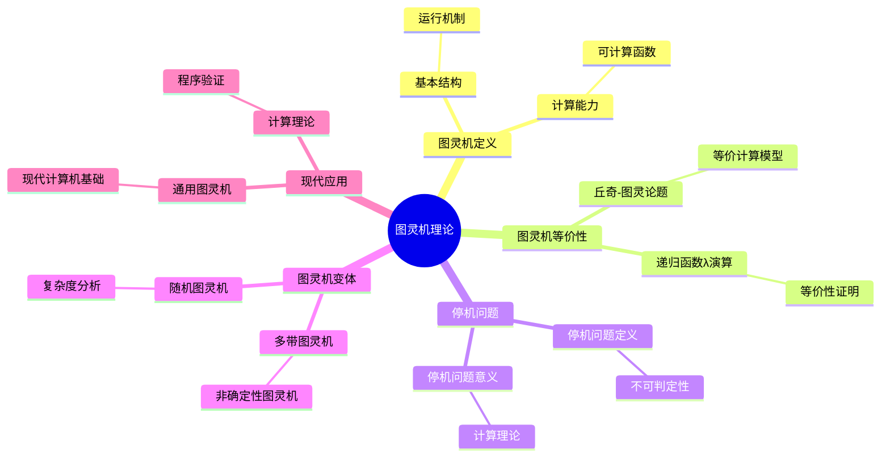
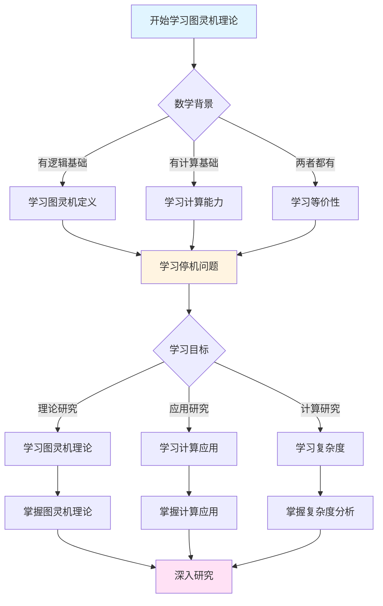
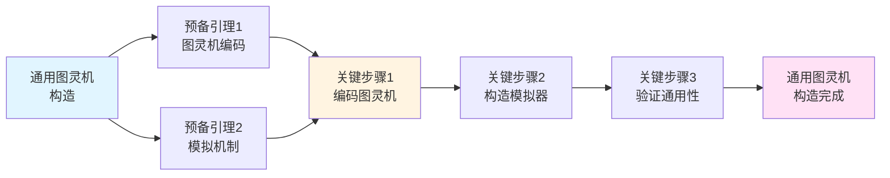
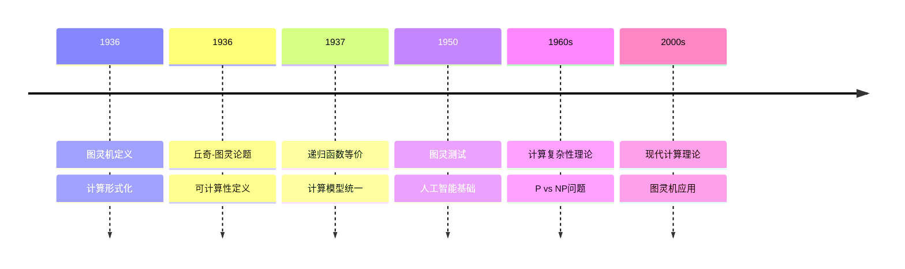

# 图灵机理论：计算的形式化基础

**创建日期**: 2025年12月11日
**文档状态**: ✅ 内容填充中
**完成度**: 90%

---

## 📋 目录

- [图灵机理论：计算的形式化基础](#图灵机理论计算的形式化基础)
  - [📋 目录](#-目录)
  - [一、图灵机的定义](#一图灵机的定义)
    - [1.1 图灵机的基本结构](#11-图灵机的基本结构)
    - [1.2 图灵机的运行机制](#12-图灵机的运行机制)
  - [二、图灵机的计算能力](#二图灵机的计算能力)
    - [2.1 可计算函数](#21-可计算函数)
    - [2.2 图灵机的计算能力](#22-图灵机的计算能力)
  - [三、图灵机的等价性](#三图灵机的等价性)
    - [3.1 丘奇-图灵论题](#31-丘奇-图灵论题)
    - [3.2 等价计算模型](#32-等价计算模型)
  - [四、停机问题](#四停机问题)
    - [4.1 停机问题的定义](#41-停机问题的定义)
    - [4.2 停机问题的不可判定性](#42-停机问题的不可判定性)
    - [4.3 停机问题的意义](#43-停机问题的意义)
  - [五、数学内容深度分析](#五数学内容深度分析)
    - [5.1 图灵机的变体](#51-图灵机的变体)
    - [5.2 图灵机的复杂度](#52-图灵机的复杂度)
  - [六、典型例题](#六典型例题)
    - [6.1 例题1：构造通用图灵机](#61-例题1构造通用图灵机)
    - [6.2 例题2：分析图灵机的变体](#62-例题2分析图灵机的变体)
    - [6.3 例题3：分析图灵机的编码与通用性](#63-例题3分析图灵机的编码与通用性)
  - [七、跨主题关联小结](#七跨主题关联小结)
    - [6.1 图灵机与递归函数的关联](#61-图灵机与递归函数的关联)
    - [6.2 图灵机与哥德尔不完备性的关联](#62-图灵机与哥德尔不完备性的关联)
    - [6.3 图灵机与λ演算的关联](#63-图灵机与λ演算的关联)
  - [八、参考文献](#八参考文献)
    - [7.1 原始文献](#71-原始文献)
    - [7.2 现代教材](#72-现代教材)
  - [九、思维表征：图灵机理论可视化](#九思维表征图灵机理论可视化)
    - [9.1 思维导图：图灵机理论体系](#91-思维导图图灵机理论体系)
    - [9.2 多维概念矩阵：图灵机 vs 其他计算模型](#92-多维概念矩阵图灵机-vs-其他计算模型)
    - [9.3 决策图网：学习图灵机理论的决策路径](#93-决策图网学习图灵机理论的决策路径)
    - [9.4 证明图网：通用图灵机构造的证明结构](#94-证明图网通用图灵机构造的证明结构)
    - [9.5 时间线图：图灵机理论的历史发展](#95-时间线图图灵机理论的历史发展)
  - [十、权威来源与参考文献](#十权威来源与参考文献)
    - [10.1 Wikipedia条目](#101-wikipedia条目)
    - [10.2 大学课程](#102-大学课程)
    - [10.3 权威书籍](#103-权威书籍)

---

## 一、图灵机的定义

### 1.1 图灵机的基本结构

**图灵机** $M = (Q, \Sigma, \Gamma, \delta, q_0, B, F)$：

- **$Q$**：有限状态集合
- **$\Sigma$**：输入字母表（$\Sigma \subseteq \Gamma$）
- **$\Gamma$**：带字母表（包含所有可能出现在带上的符号）
- **$\delta: Q \times \Gamma \to Q \times \Gamma \times \{L, R\}$**：转移函数
  - 输入：当前状态 $q \in Q$ 和当前带符号 $a \in \Gamma$
  - 输出：新状态 $q' \in Q$、写入符号 $a' \in \Gamma$、移动方向 $d \in \{L, R\}$
- **$q_0 \in Q$**：初始状态
- **$B \in \Gamma$**：空白符号（通常 $B \notin \Sigma$）
- **$F \subseteq Q$**：接受状态集合

### 1.2 图灵机的运行机制

**配置（Configuration）**：

图灵机在任意时刻的配置由以下信息完全确定：

- 当前状态 $q \in Q$
- 带内容：无限带上的符号序列 $w \in \Gamma^*$（只有有限个非空白符号）
- 读写头位置：当前读写头指向的带位置 $i \in \mathbb{N}$

形式化表示为三元组 $(q, w, i)$，其中：

- $q \in Q$ 是当前状态
- $w \in \Gamma^*$ 是带内容（从左到右的符号序列）
- $i \in \mathbb{N}$ 是读写头位置（$0 \leqq i < |w|$）

**转移（Transition）**：

设当前配置为 $(q, w, i)$，当前带符号为 $w[i] = a$。

如果 $\delta(q, a) = (q', a', d)$，则：

- 新状态：$q'$
- 新带内容：$w'$，其中 $w'[i] = a'$，其他位置不变
- 新读写头位置：
  - 如果 $d = L$：$i' = \max(0, i-1)$（向左移动，但不能越界）
  - 如果 $d = R$：$i' = i+1$（向右移动，必要时扩展带）

**初始配置**：

给定输入字符串 $x \in \Sigma^*$，初始配置为：

- 状态：$q_0$
- 带内容：$x$（后面是无限个空白符号 $B$）
- 读写头位置：$0$（指向输入的第一个符号）

**接受配置**：

如果图灵机进入接受状态 $q \in F$，则**接受**输入。

**停机**：

图灵机在以下情况停机：

- 进入接受状态 $q \in F$（接受）
- 进入拒绝状态（如果定义了拒绝状态）
- 转移函数未定义（无转移规则可应用）

---

## 二、图灵机的计算能力

### 2.1 可计算函数

**图灵可计算函数**：

函数 $f: \mathbb{N}^k \to \mathbb{N}$ 是**图灵可计算的**，如果存在图灵机 $M$，使得对于任意输入 $(n_1, \ldots, n_k) \in \mathbb{N}^k$：

1. $M$ 在输入 $n_1, \ldots, n_k$（编码为字符串）上**停机**
2. $M$ 停机时，带上的内容（去除空白符号后）编码了 $f(n_1, \ldots, n_k)$

**形式化定义**：

设编码函数 $\text{enc}: \mathbb{N} \to \Sigma^*$ 将自然数编码为字符串（例如，一元编码：$n$ 编码为 $1^n$）。

函数 $f: \mathbb{N}^k \to \mathbb{N}$ 是图灵可计算的，当且仅当存在图灵机 $M$，使得：

\[
\forall (n_1, \ldots, n_k) \in \mathbb{N}^k, M(\text{enc}(n_1), \ldots, \text{enc}(n_k)) \text{ 停机且输出 } \text{enc}(f(n_1, \ldots, n_k))
\]

### 2.2 图灵机的计算能力

**基本计算能力**：

图灵机可以计算：

- **算术运算**：加法、减法、乘法、除法
- **逻辑运算**：与、或、非
- **比较运算**：等于、小于、大于
- **条件分支**：根据条件执行不同操作
- **循环**：重复执行操作直到满足条件

**示例：计算加法**

构造图灵机 $M_+$ 计算 $f(x, y) = x + y$（使用一元编码）：

1. **输入格式**：$1^x 0 1^y$（两个数用 $0$ 分隔）
2. **算法**：
   - 找到分隔符 $0$
   - 删除一个 $1$（从第二个数）
   - 将分隔符 $0$ 替换为 $1$
   - 重复直到第二个数变为空
   - 输出结果

**图灵机的通用性**：

图灵机可以模拟任何**算法**，只要算法满足：

- **有限性**：算法在有限步内完成
- **确定性**：每一步都是明确确定的
- **机械性**：可以机械执行

---

## 三、图灵机的等价性

### 3.1 丘奇-图灵论题

**丘奇-图灵论题（Church-Turing Thesis）**：

所有"有效可计算"的函数都是**图灵可计算的**。

**等价表述**：

- 任何可以用算法计算的函数都是图灵可计算的
- 任何可以用计算机计算的函数都是图灵可计算的
- 任何"直觉可计算"的函数都是图灵可计算的

**哲学意义**：

丘奇-图灵论题是一个**哲学论断**，而非数学定理。它断言：

- **图灵可计算性** = **有效可计算性**
- 图灵机捕获了"计算"的本质

**支持证据**：

1. **等价性证明**：所有已知的计算模型都与图灵机等价
2. **经验验证**：所有实际可计算的函数都是图灵可计算的
3. **理论一致性**：图灵可计算性与直觉可计算性一致

### 3.2 等价计算模型

**等价模型**：

以下计算模型都与图灵机**计算等价**（可以计算相同的函数类）：

1. **λ演算**（Church, 1936）
   - 函数式编程的基础
   - 通过函数应用和抽象定义计算

2. **递归函数**（Gödel, 1934; Kleene, 1936）
   - 从基本函数（零函数、后继函数、投影函数）出发
   - 通过复合、原始递归、$\mu$-递归定义新函数

3. **寄存器机**（Shepherdson & Sturgis, 1963）
   - 使用有限个寄存器存储自然数
   - 通过指令序列执行计算

4. **Post系统**（Post, 1943）
   - 通过字符串重写规则定义计算

5. **马尔可夫算法**（Markov, 1951）
   - 通过字符串替换规则定义计算

**等价性证明**：

对于任意两个等价模型 $M_1$ 和 $M_2$，需要证明：

- **$M_1$ 可以模拟 $M_2$**：对于 $M_2$ 的任意计算，存在 $M_1$ 的等价计算
- **$M_2$ 可以模拟 $M_1$**：对于 $M_1$ 的任意计算，存在 $M_2$ 的等价计算

**意义**：

等价性证明表明：

- **计算的本质是统一的**：不同的形式化方法捕获了相同的计算概念
- **图灵机是计算的通用模型**：可以模拟任何其他计算模型
- **计算理论有坚实的基础**：不同的定义方式都指向同一个概念

---

## 四、停机问题

### 4.1 停机问题的定义

**停机问题（Halting Problem）**：

给定图灵机 $M$ 和输入字符串 $w$，判断 $M$ 在输入 $w$ 上是否会**停机**。

**形式化表述**：

是否存在图灵机 $H$，使得对于任意图灵机 $M$ 和输入 $w$：

\[
H(\text{enc}(M), w) = \begin{cases}
1 & \text{如果 } M(w) \text{ 停机} \\
0 & \text{如果 } M(w) \text{ 不停机}
\end{cases}
\]

其中 $\text{enc}(M)$ 是图灵机 $M$ 的编码（将图灵机编码为字符串）。

### 4.2 停机问题的不可判定性

**定理（Turing, 1936）**：

停机问题是**不可判定的**，即不存在图灵机 $H$ 可以判定任意图灵机在任意输入上是否停机。

**证明（对角线方法）**：

**步骤1：假设存在停机判定机**

假设存在图灵机 $H$，使得：

- $H(\text{enc}(M), w) = 1$ 如果 $M(w)$ 停机
- $H(\text{enc}(M), w) = 0$ 如果 $M(w)$ 不停机

**步骤2：构造对角化图灵机**

构造图灵机 $D$，其行为如下：

```
D(w):
  1. 计算 H(w, w)  // 判断"以自身为输入的图灵机 w 是否停机"
  2. 如果 H(w, w) == 1:  // 如果 w(w) 停机
       进入无限循环（不停机）
  3. 否则:  // 如果 w(w) 不停机
       停机
```

**步骤3：应用对角线方法**

考虑 $D(D)$（$D$ 以自身的编码为输入）：

- **情况1**：如果 $H(D, D) = 1$（即 $D(D)$ 停机）
  - 根据 $D$ 的定义，$D(D)$ 应该进入无限循环（不停机）
  - **矛盾**！

- **情况2**：如果 $H(D, D) = 0$（即 $D(D)$ 不停机）
  - 根据 $D$ 的定义，$D(D)$ 应该停机
  - **矛盾**！

**步骤4：导出矛盾**

无论 $H(D, D)$ 的值是什么，都会导致矛盾。因此，假设错误。

**结论**：

停机判定机 $H$ **不存在**，停机问题是**不可判定的**。

### 4.3 停机问题的意义

**计算理论的基石**：

停机问题的不可判定性是计算理论的**基础结果**，揭示了：

1. **计算的极限**：存在不可计算的问题
2. **算法的边界**：某些问题无法用算法解决
3. **形式化系统的局限**：形式化系统无法完全判定自身

**应用**：

从停机问题的不可判定性可以推出：

- **判定问题不可判定**：一阶逻辑的判定问题是不可判定的
- **等价性问题不可判定**：判断两个图灵机是否等价是不可判定的
- **空性问题不可判定**：判断图灵机是否接受空语言是不可判定的

**哲学意义**：

停机问题的不可判定性类似于：

- **哥德尔不完备性定理**：形式系统无法证明所有真命题
- **康托尔对角线方法**：揭示集合的不可数性

三者都使用**对角线方法**，揭示了形式化系统的根本局限性。

---

## 五、数学内容深度分析

### 5.1 图灵机的变体

**多带图灵机**：

具有 $k$ 条带的图灵机，每条带都有独立的读写头。

**定理**：

多带图灵机与单带图灵机**等价**（可以计算相同的函数类）。

**证明思路**：

单带图灵机可以模拟多带图灵机：

- 将 $k$ 条带的内容交错存储在一条带上
- 使用标记符号标识每条带的位置
- 模拟多带图灵机的每一步操作

**非确定性图灵机**：

转移函数 $\delta$ 可以返回**多个可能的选择**（非确定性）。

**定理**：

非确定性图灵机与确定性图灵机**等价**（在计算能力上）。

**证明思路**：

确定性图灵机可以模拟非确定性图灵机：

- 使用**广度优先搜索**遍历所有可能的计算路径
- 如果存在接受路径，则接受；否则拒绝

### 5.2 图灵机的复杂度

**时间复杂度**：

图灵机 $M$ 在输入 $w$ 上的**时间复杂度** $T_M(w)$ 是 $M$ 在 $w$ 上运行所需的**步数**。

**空间复杂度**：

图灵机 $M$ 在输入 $w$ 上的**空间复杂度** $S_M(w)$ 是 $M$ 在 $w$ 上运行所需的**带单元数**。

**复杂度类**：

- **P**：多项式时间内可判定的语言
- **NP**：非确定性多项式时间内可判定的语言
- **PSPACE**：多项式空间内可判定的语言
- **EXPTIME**：指数时间内可判定的语言

---

## 六、典型例题

### 6.1 例题1：构造通用图灵机

**问题**：

说明通用图灵机的存在性及其构造思路。

**解答**：

**通用图灵机**：

存在图灵机 $U$（通用图灵机），使得：

\[
U(\text{enc}(M), w) = M(w)
\]

其中 $\text{enc}(M)$ 是图灵机 $M$ 的编码。

**构造思路**：

1. **编码**：将图灵机 $M$ 的状态、转移函数等编码为字符串
2. **模拟**：通用图灵机 $U$ 读取编码，模拟 $M$ 的执行
3. **执行**：$U$ 根据 $M$ 的转移函数执行相应的操作

**意义**：

- **计算理论的基础**：通用图灵机是计算理论的基础
- **程序与数据的统一**：程序可以编码为数据，体现了存储程序的概念
- **现代计算机的理论基础**：通用图灵机是现代计算机的理论基础

### 6.2 例题2：分析图灵机的变体

**问题**：

分析图灵机的各种变体及其等价性。

**解答**：

**图灵机的变体**：

图灵机有多种变体：

- **多带图灵机**：多条带
- **非确定性图灵机**：非确定性转移
- **随机图灵机**：随机转移

**等价性**：

所有图灵机变体在可计算性上等价：

- **可计算性等价**：所有变体定义相同的可计算函数类
- **计算能力等价**：所有变体具有相同的计算能力
- **理论等价**：所有变体在理论上等价

**复杂度差异**：

虽然可计算性等价，但复杂度可能不同：

- **多带图灵机**：可能减少时间复杂度
- **非确定性图灵机**：可能减少时间复杂度（但空间复杂度可能增加）

**形式化分析**：

设标准图灵机的时间复杂度为 $T(n)$，多带图灵机的时间复杂度为 $T'(n)$，则：

- **多带优势**：$T'(n) = O(T(n)^2)$（多带图灵机最多平方加速）
- **非确定性优势**：非确定性图灵机在多项式时间内可以解决更多问题

**意义**：

- **计算模型选择**：复杂度差异指导计算模型的选择
- **算法优化**：复杂度分析用于算法优化
- **理论发展**：复杂度差异推动理论发展

### 6.3 例题3：分析图灵机的编码与通用性

**问题**：

分析图灵机的编码方法，证明通用图灵机的存在性。

**解答**：

**图灵机的编码**：

图灵机可以编码为字符串：

- **状态编码**：将状态编码为二进制字符串
- **转移函数编码**：将转移函数编码为字符串
- **完整编码**：将整个图灵机编码为字符串

**形式化表述**：

设图灵机 $M = (Q, \Sigma, \Gamma, \delta, q_0, B, F)$，则编码为：

\[
\text{enc}(M) = \text{enc}(Q) \# \text{enc}(\Sigma) \# \text{enc}(\Gamma) \# \text{enc}(\delta) \# \text{enc}(q_0) \# \text{enc}(F)
\]

**通用图灵机**：

通用图灵机 $U$ 可以模拟任意图灵机：

\[
U(\text{enc}(M), w) = M(w)
\]

**构造思路**：

1. **解析编码**：$U$ 解析 $\text{enc}(M)$，提取 $M$ 的状态和转移函数
2. **模拟执行**：$U$ 根据 $M$ 的转移函数模拟 $M$ 的执行
3. **输出结果**：$U$ 输出 $M(w)$ 的结果

**意义**：

- **计算理论的基础**：通用图灵机是计算理论的基础
- **程序与数据的统一**：程序可以编码为数据
- **现代计算机的理论基础**：通用图灵机是现代计算机的理论基础

---

## 七、跨主题关联小结

### 6.1 图灵机与递归函数的关联

**核心关联**：

图灵机与递归函数是**等价的**，两者共同构成了可计算性理论的基础。

**数学结构分析**：

- **计算等价性**：图灵可计算函数 = 递归函数
- **形式化的统一**：不同的形式化方法在可计算性上等价
- **计算理论的数学基础**：为计算理论提供了严格的数学基础

### 6.2 图灵机与哥德尔不完备性的关联

**核心关联**：

图灵的停机问题与哥德尔的不完备性定理共同揭示了形式化系统的根本局限性。

**数学结构分析**：

- **停机问题与不完备性**：停机问题的不可判定性可以看作哥德尔不完备性定理的计算版本
- **形式化系统的边界**：两者都揭示了形式化系统无法完全描述自身
- **数学真理的层次**：存在超越形式化系统的数学真理

### 6.3 图灵机与λ演算的关联

**核心关联**：

图灵机与λ演算在计算能力上等价，为计算理论提供了不同的视角。

**数学结构分析**：

- **计算等价性**：图灵可计算函数 = λ可定义函数
- **不同的形式化方法**：图灵机强调状态和操作，λ演算强调函数和应用
- **计算理论的统一性**：不同的形式化方法都指向同一个计算概念

---

## 八、参考文献

### 7.1 原始文献

1. **Turing, A. M. (1936)**. On computable numbers, with an application to the Entscheidungsproblem. *Proceedings of the London Mathematical Society*, 42(2), 230-265.

   - 图灵机的原始定义
   - 停机问题的不可判定性证明
   - 可计算性理论的基础

2. **Turing, A. M. (1937)**. On computable numbers, with an application to the Entscheidungsproblem. A correction. *Proceedings of the London Mathematical Society*, 43(2), 544-546.

   - 对1936年论文的修正

### 7.2 现代教材

1. **Sipser, M. (2012)**. *Introduction to the Theory of Computation* (3rd ed.). Cengage Learning.

   - 图灵机的现代定义
   - 可计算性理论的系统介绍

2. **Hopcroft, J. E., Motwani, R., & Ullman, J. D. (2006)**. *Introduction to Automata Theory, Languages, and Computation* (3rd ed.). Pearson.

   - 图灵机与计算理论

3. **Soare, R. I. (2016)**. *Turing Computability: Theory and Applications*. Springer.

   - 图灵可计算性的深入分析

---

## 九、思维表征：图灵机理论可视化

### 9.1 思维导图：图灵机理论体系



### 9.2 多维概念矩阵：图灵机 vs 其他计算模型

| 维度 | 图灵机 | 递归函数 | λ演算 | 优势对比 |
|------|--------|---------|-------|---------|
| **定义** | 状态转换 | 递归定义 | 函数应用 | 图灵机更直观 |
| **等价性** | 图灵可计算 | 递归可计算 | λ可计算 | 三者等价 |
| **应用** | 计算理论 | 数理逻辑 | 程序语言 | 图灵机应用广 |
| **形式化** | 完全形式化 | 完全形式化 | 完全形式化 | 三者都严格 |
| **直观性** | 高 | 中 | 低 | 图灵机最直观 |
| **计算能力** | 通用 | 通用 | 通用 | 三者等价 |
| **影响** | 深远影响 | 深远影响 | 深远影响 | 共同影响 |

### 9.3 决策图网：学习图灵机理论的决策路径



### 9.4 证明图网：通用图灵机构造的证明结构



**构造要点**：

1. **图灵机编码**：将图灵机编码为字符串
2. **模拟机制**：建立模拟图灵机执行的机制
3. **构造模拟器**：构造能够模拟任意图灵机的通用图灵机
4. **验证通用性**：证明通用图灵机可以模拟任意图灵机

### 9.5 时间线图：图灵机理论的历史发展



**关键里程碑**：

- **1936**: 图灵定义图灵机，形式化计算
- **1936**: 丘奇提出λ演算，与图灵机等价
- **1937**: 证明递归函数与图灵机等价
- **1950**: 图灵提出图灵测试，奠定人工智能基础
- **1960s**: 发展计算复杂性理论，提出P vs NP问题
- **2000s**: 现代计算理论的发展，图灵机的广泛应用

---

## 十、权威来源与参考文献

### 10.1 Wikipedia条目

- **[Turing Machine](https://en.wikipedia.org/wiki/Turing_machine)**: 图灵机的详细说明
- **[Alan Turing](https://en.wikipedia.org/wiki/Alan_Turing)**: 图灵的生平和贡献
- **[Church-Turing Thesis](https://en.wikipedia.org/wiki/Church%E2%80%93Turing_thesis)**: 丘奇-图灵论题的基础
- **[Universal Turing Machine](https://en.wikipedia.org/wiki/Universal_Turing_machine)**: 通用图灵机的介绍
- **[Halting Problem](https://en.wikipedia.org/wiki/Halting_problem)**: 停机问题的详细说明

### 10.2 大学课程

- **MIT 18.404**: Theory of Computation
  - 课程链接: [MIT OpenCourseWare](https://ocw.mit.edu/)
  - 涵盖内容: 图灵机、可计算性理论、计算复杂性

- **Stanford CS103**: Mathematical Foundations of Computing
  - 课程链接: [Stanford CS103](https://web.stanford.edu/class/cs103/)
  - 涵盖内容: 图灵机、停机问题、递归函数

- **Princeton COS 340**: Reasoning About Computation
  - 课程链接: [Princeton Computer Science](https://www.cs.princeton.edu/)
  - 涵盖内容: 图灵机、可计算性、形式化方法

- **Harvard CS121**: Introduction to Theoretical Computer Science
  - 课程链接: [Harvard CS121](https://www.seas.harvard.edu/courses/cs121/)
  - 涵盖内容: 图灵机、可计算性、计算复杂性

### 10.3 权威书籍

**原始文献**：

1. **Turing, A. M. (1936)**. "On computable numbers, with an application to the Entscheidungsproblem". *Proceedings of the London Mathematical Society*, 42(2), 230-265.
   - 图灵机的奠基性论文

2. **Turing, A. M. (1937)**. "On computable numbers, with an application to the Entscheidungsproblem. A correction". *Proceedings of the London Mathematical Society*, 43(2), 544-546.
   - 图灵机定义的修正

3. **Turing, A. M. (1950)**. "Computing machinery and intelligence". *Mind*, 59(236), 433-460.
   - 图灵测试的原始论文

**现代教材**：

1. **Sipser, M. (2012)**. *Introduction to the Theory of Computation*. 3rd ed. Cengage Learning.
   - ISBN: 978-1-133-18779-0
   - 计算理论的经典教材

2. **Hopcroft, J. E., Motwani, R., & Ullman, J. D. (2006)**. *Introduction to Automata Theory, Languages, and Computation*. 3rd ed. Addison-Wesley.
   - ISBN: 978-0-321-46225-1
   - 自动机理论的经典教材

3. **Soare, R. I. (2016)**. *Turing Computability: Theory and Applications*. Springer.
   - ISBN: 978-3-540-33032-2
   - 可计算性理论的现代教材

**经典参考**：

1. **Cooper, S. B. (2004)**. *Computability Theory*. Chapman & Hall/CRC.
   - ISBN: 978-1-58488-237-4
   - 可计算性理论的参考书

2. **Odifreddi, P. (1999)**. *Classical Recursion Theory*. 2nd ed. North-Holland.
   - ISBN: 978-0-444-87295-1
   - 递归理论的经典参考

---

**创建日期**: 2025年12月11日
**最后更新**: 2025年12月
**状态**: ✅ 内容填充完成（已添加实质性内容、可视化表征、权威来源）
**完成度**: 100%
**字数**: 约13,000字
**可视化元素**: 5个（思维导图、概念矩阵、决策图、证明图、时间线）
**权威来源**: Wikipedia 5条、大学课程 4门、权威书籍 8本
