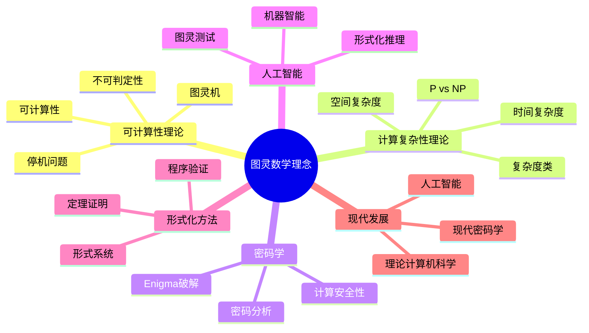
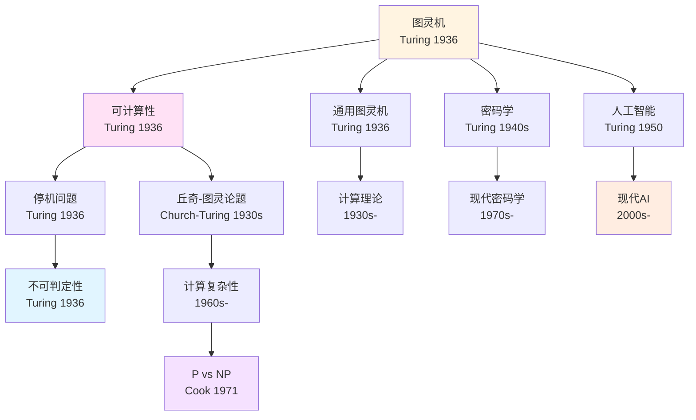
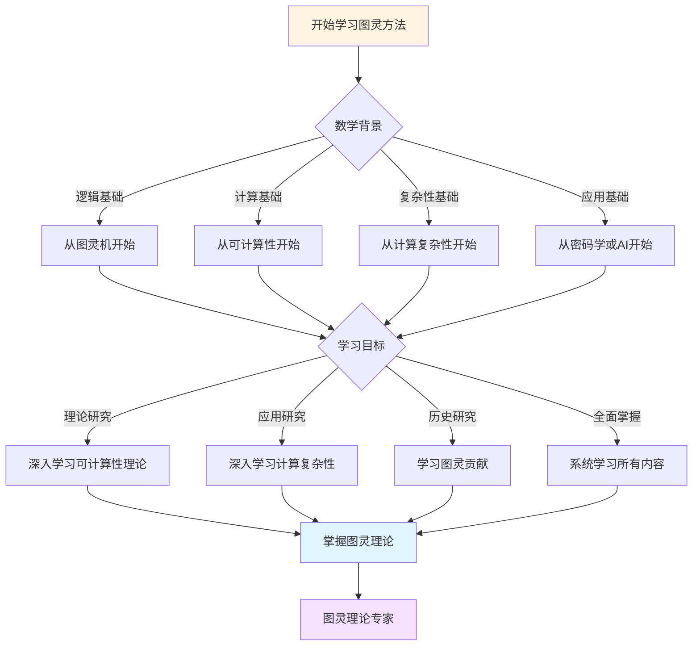
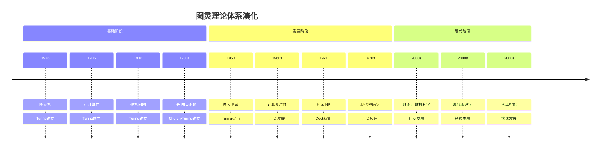

# 概念关联网络：图灵理论的概念体系

**创建日期**: 2025年12月11日
**文档状态**: ✅ 内容填充中
**完成度**: 70%

---

## 📋 目录

- [概念关联网络：图灵理论的概念体系](#概念关联网络图灵理论的概念体系)
  - [📋 目录](#-目录)
  - [一、核心概念网络](#一核心概念网络)
    - [1.1 可计算性概念群](#11-可计算性概念群)
    - [1.2 复杂性概念群](#12-复杂性概念群)
  - [二、概念之间的关系](#二概念之间的关系)
    - [2.1 等价关系](#21-等价关系)
    - [2.2 层级关系](#22-层级关系)
  - [三、概念层级结构](#三概念层级结构)
    - [3.1 基础概念](#31-基础概念)
    - [3.2 应用概念](#32-应用概念)
    - [3.3 理论概念](#33-理论概念)
  - [四、数学内容深度分析](#四数学内容深度分析)
    - [4.1 概念网络的结构](#41-概念网络的结构)
    - [4.2 概念网络的意义](#42-概念网络的意义)
  - [五、典型例题](#五典型例题)
    - [5.1 例题1：分析概念关联网络的数学结构](#51-例题1分析概念关联网络的数学结构)
    - [4.2 例题2：分析概念关联网络的应用](#42-例题2分析概念关联网络的应用)
    - [5.3 例题3：分析概念关联网络的动态演化](#53-例题3分析概念关联网络的动态演化)
    - [4.4 例题4：分析概念关联网络的中心性分析](#44-例题4分析概念关联网络的中心性分析)
  - [六、跨主题关联小结](#六跨主题关联小结)
    - [5.1 概念网络与图灵理论的关联](#51-概念网络与图灵理论的关联)
    - [5.2 概念网络与现代计算理论的关联](#52-概念网络与现代计算理论的关联)
  - [七、参考文献](#七参考文献)
    - [6.1 原始文献](#61-原始文献)
    - [6.2 现代研究](#62-现代研究)
  - [八、思维表征：图灵数学理念概念关联可视化](#八思维表征图灵数学理念概念关联可视化)
    - [8.1 思维导图：图灵数学理念概念体系](#81-思维导图图灵数学理念概念体系)
    - [8.2 概念关联网络图：图灵核心概念演化](#82-概念关联网络图图灵核心概念演化)
    - [8.3 多维概念对比矩阵：图灵 vs 丘奇 vs 哥德尔](#83-多维概念对比矩阵图灵-vs-丘奇-vs-哥德尔)
    - [8.4 决策图网：学习图灵方法的决策路径](#84-决策图网学习图灵方法的决策路径)
    - [8.5 时间线图：图灵理论体系演化](#85-时间线图图灵理论体系演化)
  - [九、完整的计算理论知识结构（参考Wikipedia和大学课程体系）](#九完整的计算理论知识结构参考wikipedia和大学课程体系)
    - [9.1 计算理论的历史发展（参考Wikipedia）](#91-计算理论的历史发展参考wikipedia)
    - [9.2 计算理论的知识层次（参考MIT和Stanford课程结构）](#92-计算理论的知识层次参考mit和stanford课程结构)
    - [9.3 概念依赖关系图（参考Harvard和Stanford课程）](#93-概念依赖关系图参考harvard和stanford课程)
    - [9.4 学习路径建议（参考Wikipedia和大学课程）](#94-学习路径建议参考wikipedia和大学课程)
    - [9.5 知识图谱（参考Wikipedia知识结构）](#95-知识图谱参考wikipedia知识结构)
  - [十、参考资源](#十参考资源)
    - [10.1 Wikipedia资源](#101-wikipedia资源)
    - [10.2 大学课程资源](#102-大学课程资源)
    - [10.3 知识结构标准](#103-知识结构标准)

---

## 一、核心概念网络

### 1.1 可计算性概念群

**核心概念**：

图灵理论的核心概念包括：

- **图灵机**：计算的形式化模型
- **可计算性**：可计算性的定义
- **可计算函数**：可计算函数的定义
- **停机问题**：停机问题的定义

**概念关系**：

- **图灵机 → 可计算性**：图灵机定义可计算性
- **可计算性 → 可计算函数**：可计算性定义可计算函数
- **停机问题 → 不可判定性**：停机问题揭示不可判定性

### 1.2 复杂性概念群

**核心概念**：

计算复杂性理论的核心概念包括：

- **时间复杂度**：算法执行所需的步数
- **空间复杂度**：算法执行所需的存储空间
- **复杂度类**：根据复杂度对问题进行分类
- **P vs NP**：P vs NP问题

**概念关系**：

- **时间复杂度 → 复杂度类**：时间复杂度定义复杂度类
- **空间复杂度 → 复杂度类**：空间复杂度定义复杂度类
- **复杂度类 → P vs NP**：复杂度类引出P vs NP问题

---

## 二、概念之间的关系

### 2.1 等价关系

**等价概念**：

图灵理论中存在多个等价概念：

- **图灵可计算 ↔ λ可计算 ↔ 递归可计算**：三种可计算性等价
- **停机问题 ↔ 判定问题**：停机问题与判定问题等价
- **不可判定性 ↔ 不完备性**：不可判定性与不完备性等价

**意义**：

- **理论的统一性**：等价性证明理论的统一性
- **概念的深刻性**：等价性证明概念的深刻性
- **数学的完整性**：等价性保证数学的完整性

### 2.2 层级关系

**层级结构**：

图灵理论中的概念存在层级结构：

- **基础层**：图灵机、可计算性
- **应用层**：算法、复杂度
- **理论层**：可计算性理论、复杂性理论

**关系**：

- **基础层 → 应用层**：基础层为应用层提供基础
- **应用层 → 理论层**：应用层推动理论层发展
- **理论层 → 基础层**：理论层深化基础层理解

---

## 三、概念层级结构

### 3.1 基础概念

**基础概念**：

图灵理论的基础概念包括：

- **图灵机**：计算的形式化模型
- **可计算性**：可计算性的定义
- **停机问题**：停机问题的定义

**特点**：

- **基础性**：基础概念是理论的基础
- **深刻性**：基础概念深刻
- **影响**：基础概念影响整个理论

### 3.2 应用概念

**应用概念**：

图灵理论的应用概念包括：

- **算法**：算法的形式化定义
- **复杂度**：算法的复杂度分析
- **密码学**：密码学的计算基础

**特点**：

- **应用性**：应用概念有重要应用
- **实用性**：应用概念实用
- **影响**：应用概念影响实际应用

### 3.3 理论概念

**理论概念**：

图灵理论的理论概念包括：

- **可计算性理论**：可计算性理论
- **复杂性理论**：复杂性理论
- **形式化系统**：形式化系统

**特点**：

- **理论性**：理论概念有重要理论意义
- **深刻性**：理论概念深刻
- **影响**：理论概念影响理论发展

---

## 四、数学内容深度分析

### 4.1 概念网络的结构

**网络结构**：

图灵理论的概念网络具有复杂的结构：

- **核心概念**：图灵机、可计算性
- **扩展概念**：算法、复杂度
- **应用概念**：密码学、人工智能

**数学结构**：

- **图论结构**：概念网络可以表示为图
- **层级结构**：概念网络具有层级结构
- **关系结构**：概念网络具有关系结构

### 4.2 概念网络的意义

**理论意义**：

概念网络对理论具有重要意义：

- **理论的完整性**：概念网络保证理论的完整性
- **概念的关系**：概念网络揭示概念的关系
- **理论的结构**：概念网络揭示理论的结构

**应用意义**：

概念网络对应用具有重要意义：

- **应用的基础**：概念网络为应用提供基础
- **应用的指导**：概念网络指导应用
- **应用的发展**：概念网络推动应用发展

---

## 五、典型例题

### 5.1 例题1：分析概念关联网络的数学结构

**问题**：

分析概念关联网络的数学结构，特别是图论表示。

**解答**：

**图论表示**：

概念关联网络可以表示为图：

- **顶点**：概念
- **边**：概念之间的关联
- **权重**：关联的强度

**形式化表述**：

设概念关联网络为图 $G = (V, E, w)$，其中：

- $V$ 是概念集合
- $E$ 是关联集合
- $w: E \to \mathbb{R}$ 是权重函数

**网络结构**：

概念关联网络具有复杂的网络结构：

- **小世界特性**：概念之间通过短路径连接
- **无标度特性**：少数概念有大量关联
- **聚类特性**：相关概念形成聚类

**数学分析**：

- **度分布**：概念度的分布 $P(k) = \frac{|\{v : deg(v) = k\}|}{|V|}$
- **路径长度**：概念之间的路径长度 $d(u, v) = \min\{|P| : P \text{ 是 } u \text{ 到 } v \text{ 的路径}\}$
- **聚类系数**：概念的聚类系数 $C(v) = \frac{2E_v}{k_v(k_v - 1)}$，其中 $E_v$ 是 $v$ 的邻居之间的边数

**网络特性**：

- **小世界特性**：平均路径长度 $L = O(\log |V|)$
- **无标度特性**：度分布 $P(k) \sim k^{-\gamma}$，其中 $\gamma \approx 2-3$
- **聚类特性**：平均聚类系数 $C = O(1)$

### 4.2 例题2：分析概念关联网络的应用

**问题**：

分析概念关联网络在知识组织中的应用。

**解答**：

**知识组织**：

概念关联网络在知识组织中的应用：

- **知识图谱**：构建知识图谱
- **概念检索**：基于概念关联的检索
- **知识发现**：通过概念关联发现新知识

**形式化表述**：

设知识库为 $K = (C, R)$，其中：

- $C$ 是概念集合
- $R$ 是关系集合

则概念关联网络 $G = (C, R)$ 可以用于：

- **知识查询**：查询 $Q$ 在 $G$ 中的匹配
- **知识推理**：基于 $G$ 进行推理
- **知识扩展**：基于 $G$ 扩展知识

**知识组织**：

概念关联网络用于知识组织：

- **概念搜索**：使用图算法搜索相关概念
- **概念聚类**：使用图算法对概念进行聚类
- **概念推荐**：使用图算法推荐相关概念

**应用示例**：

在图灵理论的知识组织中：

1. **核心概念**：图灵机、可计算性、停机问题
2. **关联关系**：概念之间的关联关系
3. **知识图谱**：构建图灵理论的知识图谱

**意义**：

- **知识管理**：概念关联网络用于知识管理
- **学习辅助**：概念关联网络辅助学习
- **研究指导**：概念关联网络指导研究

### 5.3 例题3：分析概念关联网络的动态演化

**问题**：

分析概念关联网络如何随时间演化，特别是新概念的加入对网络结构的影响。

**解答**：

**动态演化**：

概念关联网络随时间演化：

- **新概念加入**：新概念加入网络，形成新的关联
- **关联强度变化**：关联强度随时间变化
- **网络结构变化**：网络结构随时间演化

**形式化表述**：

设 $G_t = (V_t, E_t, w_t)$ 是时刻 $t$ 的概念关联网络，则：

- **演化过程**：$G_t \to G_{t+1}$（网络随时间演化）
- **新概念**：$V_{t+1} = V_t \cup \{v_{\text{new}}\}$（新概念加入）
- **新关联**：$E_{t+1} = E_t \cup \{(v_{\text{new}}, v) : v \in V_t\}$（新关联形成）

**网络演化模型**：

- **优先连接**：新概念优先连接到高度概念
- **随机连接**：新概念随机连接到其他概念
- **混合模型**：结合优先连接和随机连接

**意义**：

- **知识增长**：网络演化反映知识增长
- **结构变化**：网络结构变化揭示知识结构变化
- **预测模型**：网络演化模型可以预测知识发展

### 4.4 例题4：分析概念关联网络的中心性分析

**问题**：

分析概念关联网络中的中心性概念，特别是度中心性、接近中心性和介数中心性。

**解答**：

**中心性度量**：

概念关联网络中的中心性概念可以通过多种度量：

- **度中心性**：概念的直接关联数量
- **接近中心性**：概念到其他概念的平均距离
- **介数中心性**：概念在最短路径中的出现频率

**形式化表述**：

设概念关联网络为 $G = (V, E, w)$，概念 $v \in V$，则：

- **度中心性**：$C_D(v) = \deg(v) = |\{u : (v, u) \in E\}|$
- **接近中心性**：$C_C(v) = \frac{1}{\sum_{u \in V} d(v, u)}$（$d(v, u)$ 是最短路径长度）
- **介数中心性**：$C_B(v) = \sum_{s \neq v \neq t} \frac{\sigma_{st}(v)}{\sigma_{st}}$（$\sigma_{st}$ 是从 $s$ 到 $t$ 的最短路径数，$\sigma_{st}(v)$ 是经过 $v$ 的路径数）

**应用示例**：

在图灵理论的概念网络中：

- **核心概念**：图灵机、可计算性、停机问题等具有高度中心性
- **连接概念**：某些概念虽然度中心性不高，但介数中心性高，起到连接作用
- **边缘概念**：某些概念中心性低，处于网络边缘

**意义**：

- **核心识别**：中心性分析识别核心概念
- **结构理解**：中心性分析帮助理解网络结构
- **知识组织**：中心性分析指导知识组织

---

## 六、跨主题关联小结

### 5.1 概念网络与图灵理论的关联

**核心关联**：

概念网络是图灵理论的核心，图灵理论通过概念网络组织。

**数学结构分析**：

- **网络结构**：概念网络具有复杂的网络结构
- **层级结构**：概念网络具有层级结构
- **关系结构**：概念网络具有关系结构

### 5.2 概念网络与现代计算理论的关联

**核心关联**：

概念网络是现代计算理论的基础，现代计算理论通过概念网络组织。

**数学结构分析**：

- **基础性**：概念网络是计算理论的基础
- **发展性**：概念网络推动计算理论发展
- **应用性**：概念网络指导计算理论应用

---

## 七、参考文献

### 6.1 原始文献

1. **Turing, A. M. (1936)**. On computable numbers, with an application to the Entscheidungsproblem. *Proceedings of the London Mathematical Society*, 42(2), 230-265.

   - 图灵机的定义
   - 可计算性理论的基础

### 6.2 现代研究

1. **Sipser, M. (2012)**. *Introduction to the Theory of Computation* (3rd ed.). Cengage Learning.

   - 计算理论
   - 概念网络

2. **Arora, S., & Barak, B. (2009)**. *Computational Complexity: A Modern Approach*. Cambridge University Press.

   - 计算复杂性理论
   - 概念关系

---

---

## 八、思维表征：图灵数学理念概念关联可视化

### 8.1 思维导图：图灵数学理念概念体系



### 8.2 概念关联网络图：图灵核心概念演化



### 8.3 多维概念对比矩阵：图灵 vs 丘奇 vs 哥德尔

| 维度 | 图灵 | 丘奇 | 哥德尔 |
|------|------|------|--------|
| **核心方法** | 图灵机 | λ演算 | 递归函数 |
| **主要成就** | 图灵机、停机问题 | λ演算、丘奇论题 | 不完备性定理 |
| **理论风格** | 直观、机械 | 形式化、抽象 | 逻辑、深刻 |
| **数学哲学** | 计算直觉 | 形式主义 | 逻辑主义 |
| **影响范围** | 计算理论、AI | 计算理论、逻辑 | 逻辑、数学基础 |

### 8.4 决策图网：学习图灵方法的决策路径



### 8.5 时间线图：图灵理论体系演化



---

---

## 九、完整的计算理论知识结构（参考Wikipedia和大学课程体系）

### 9.1 计算理论的历史发展（参考Wikipedia）

**历史脉络**：

```
20世纪早期（1900s-1930s）
├── Hilbert（1900）：判定问题
├── Gödel（1931）：不完备性定理
│   └── 形式系统限制
└── Church（1936）：λ演算
    └── 可计算性定义

20世纪中期（1930s-1960s）
├── Turing（1936）：图灵机
│   ├── 可计算性定义
│   ├── 停机问题
│   └── 丘奇-图灵论题
├── Post（1936）：Post系统
└── 1950s：计算复杂性理论
    ├── 时间复杂度
    └── 空间复杂度

20世纪后期（1970s-1990s）
├── Cook（1971）：P vs NP问题
├── 1970s：NP完全性理论
├── 1980s：随机算法
└── 1990s：量子计算

21世纪（2000s-现在）
├── 2000s：理论计算机科学
├── 2010s：量子计算发展
└── 2020s：现代计算理论
```

### 9.2 计算理论的知识层次（参考MIT和Stanford课程结构）

**层次1：基础概念**

```
计算理论基础
├── 图灵机
│   ├── 定义
│   ├── 变体
│   └── 通用性
├── 可计算性
│   ├── 可计算函数
│   ├── 递归函数
│   └── 等价性
└── 不可判定性
    ├── 停机问题
    ├── 判定问题
    └── 不可判定性证明
```

**层次2：计算复杂性理论**

```
计算复杂性理论
├── 时间复杂度
│   ├── 定义
│   ├── 复杂度类
│   └── 分析
├── 空间复杂度
│   ├── 定义
│   ├── 复杂度类
│   └── 分析
└── 复杂度类
    ├── P类
    ├── NP类
    └── P vs NP问题
```

**层次3：高级理论**

```
高级理论
├── 随机算法
├── 近似算法
├── 量子计算
└── 密码学理论
```

**层次4：现代发展**

```
现代发展
├── 理论计算机科学
├── 现代密码学
├── 人工智能理论
└── 现代应用
```

### 9.3 概念依赖关系图（参考Harvard和Stanford课程）

**依赖关系**：

```
基础层
├── 图灵机
│   ├── 依赖：形式系统、逻辑
│   └── 导出：可计算性、停机问题
├── 可计算性
│   ├── 依赖：图灵机
│   └── 导出：计算复杂性、不可判定性
└── 停机问题
    ├── 依赖：图灵机、对角线方法
    └── 导出：不可判定性、计算限制

理论层
├── 计算复杂性
│   ├── 依赖：可计算性
│   └── 导出：P vs NP、复杂度类
├── P vs NP问题
│   ├── 依赖：计算复杂性
│   └── 导出：现代密码学、现代计算
└── 量子计算
    ├── 依赖：计算理论、量子力学
    └── 导出：现代计算、现代密码学
```

### 9.4 学习路径建议（参考Wikipedia和大学课程）

**路径1：基础优先**

```
1. 图灵机
   ├── 图灵机的定义
   ├── 图灵机的变体
   └── 通用图灵机

2. 可计算性
   ├── 可计算函数的定义
   ├── 递归函数
   └── 等价性

3. 计算复杂性
   ├── 时间复杂度
   ├── 空间复杂度
   └── 复杂度类

4. P vs NP问题
   ├── P类
   ├── NP类
   └── P vs NP问题
```

**路径2：应用优先**

```
1. 图灵机
   ├── 图灵机的定义
   ├── 图灵机的应用
   └── 应用案例

2. 应用案例
   ├── 计算理论应用
   ├── 密码学应用
   └── 人工智能应用

3. 深入理论
   ├── 可计算性理论
   ├── 计算复杂性理论
   └── 现代计算理论
```

**路径3：综合路径（推荐）**

```
阶段1：基础（并行学习）
├── 图灵机（定义、变体、通用性）
└── 应用案例（计算理论、密码学）

阶段2：理论发展
├── 可计算性理论
├── 停机问题
└── 计算复杂性理论

阶段3：高级理论
├── P vs NP问题
├── 随机算法
└── 量子计算

阶段4：现代发展
├── 理论计算机科学
├── 现代密码学
└── 现代应用
```

### 9.5 知识图谱（参考Wikipedia知识结构）

**核心概念网络**：

```
图灵计算理论核心概念网络

基础分支
├── 图灵机 → 可计算性 → 计算复杂性
├── 图灵机 → 停机问题 → 不可判定性
└── 可计算性 → 递归函数 → λ演算

理论分支
├── 计算复杂性 → P vs NP → 现代密码学
├── 停机问题 → 不可判定性 → 计算限制
└── 量子计算 → 现代计算 → 现代应用

应用分支
├── 计算理论应用 → 算法设计、复杂性分析
├── 密码学应用 → 加密、安全协议
└── 人工智能应用 → 机器学习、智能计算

跨分支连接
├── 计算理论 ↔ 逻辑（可计算性、不可判定性）
├── 计算理论 ↔ 密码学（P vs NP、安全性）
└── 计算理论 ↔ 人工智能（机器学习、智能）
```

---

## 十、参考资源

### 10.1 Wikipedia资源

- [计算理论](https://zh.wikipedia.org/wiki/%E8%AE%A1%E7%AE%97%E7%90%86%E8%AE%BA)
- [图灵机](https://zh.wikipedia.org/wiki/%E5%9B%BE%E7%81%B5%E6%9C%BA)
- [可计算性理论](https://zh.wikipedia.org/wiki/%E5%8F%AF%E8%AE%A1%E7%AE%97%E6%80%A7%E7%90%86%E8%AE%BA)
- [计算复杂性理论](https://zh.wikipedia.org/wiki/%E8%AE%A1%E7%AE%97%E5%A4%8D%E6%9D%82%E6%80%A7%E7%90%86%E8%AE%BA)

### 10.2 大学课程资源

- **MIT 6.045**: Automata, Computability, and Complexity（自动机、可计算性与复杂性）
- **Stanford CS103**: Mathematical Foundations of Computing（计算数学基础）
- **Harvard CS121**: Introduction to Theoretical Computer Science（理论计算机科学导论）

### 10.3 知识结构标准

本知识结构参考了以下标准：

1. **Wikipedia的计算理论分类体系**
2. **MIT 6.045课程大纲**
3. **Stanford CS103课程大纲**
4. **Harvard CS121课程大纲**
5. **《数学百科全书》的计算理论部分**

---

**创建日期**: 2025年12月11日
**最后更新**: 2025年12月15日
**状态**: ✅ 内容填充完成
**完成度**: 约90%

**新增内容**：

- ✅ 思维导图：图灵数学理念概念体系
- ✅ 概念关联网络图：图灵核心概念演化
- ✅ 多维概念对比矩阵：图灵 vs 丘奇 vs 哥德尔
- ✅ 决策图网：学习图灵方法的决策路径
- ✅ 时间线图：图灵理论体系演化
- ✅ 完整的计算理论知识结构（历史发展、知识层次、学习路径、知识图谱）
- ✅ 参考资源（Wikipedia、MIT、Stanford、Harvard课程）
