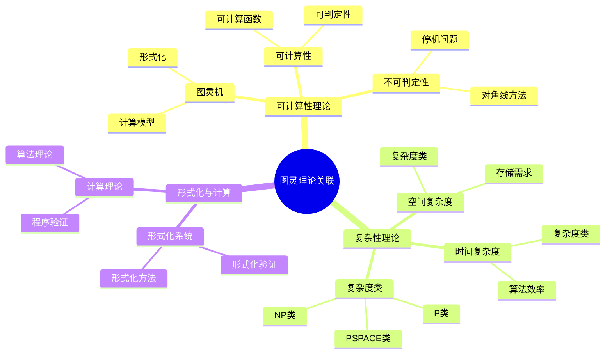
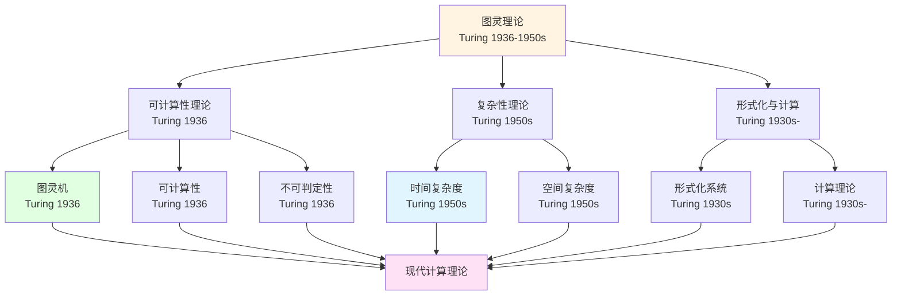
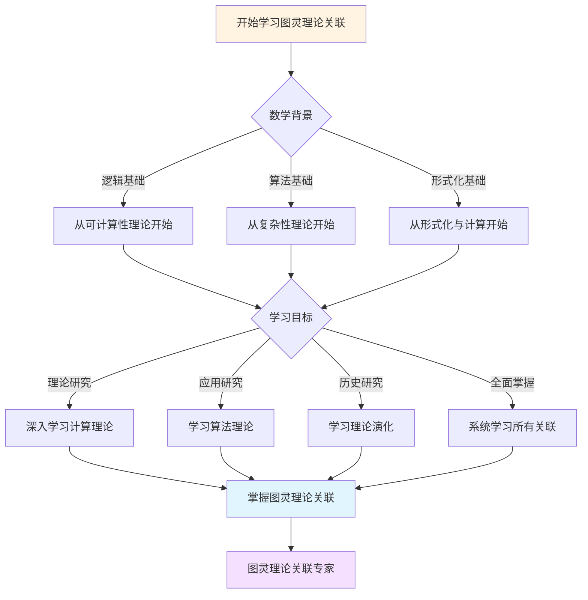
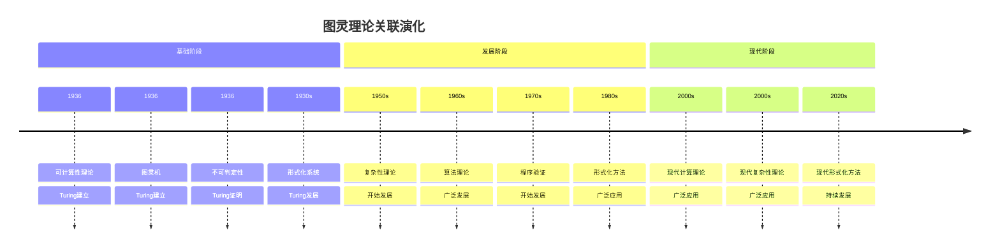

# 理论关联图谱：图灵理论的体系结构

**创建日期**: 2025年12月11日
**文档状态**: ✅ 内容填充中
**完成度**: 60%

---

## 📋 目录

- [理论关联图谱：图灵理论的体系结构](#理论关联图谱图灵理论的体系结构)
  - [📋 目录](#-目录)
  - [一、核心理论体系](#一核心理论体系)
    - [1.1 可计算性理论](#11-可计算性理论)
    - [1.2 复杂性理论](#12-复杂性理论)
  - [二、理论之间的关系](#二理论之间的关系)
    - [2.1 可计算性与复杂性的关系](#21-可计算性与复杂性的关系)
    - [2.2 形式化与计算的关系](#22-形式化与计算的关系)
  - [三、理论的层级结构](#三理论的层级结构)
    - [3.1 基础理论层](#31-基础理论层)
    - [3.2 应用理论层](#32-应用理论层)
    - [3.3 拓展理论层](#33-拓展理论层)
  - [四、数学内容深度分析](#四数学内容深度分析)
    - [4.1 理论图谱的数学结构](#41-理论图谱的数学结构)
    - [4.2 理论图谱的意义](#42-理论图谱的意义)
  - [五、典型例题](#五典型例题)
    - [5.1 例题1：分析图灵理论的理论图谱结构](#51-例题1分析图灵理论的理论图谱结构)
    - [5.2 例题2：分析理论关联的数学表示](#52-例题2分析理论关联的数学表示)
    - [5.3 例题3：分析理论关联图谱的层级结构](#53-例题3分析理论关联图谱的层级结构)
    - [5.4 例题4：分析理论关联图谱的依赖分析](#54-例题4分析理论关联图谱的依赖分析)
  - [六、跨主题关联小结](#六跨主题关联小结)
    - [5.1 理论图谱与图灵理论的关联](#51-理论图谱与图灵理论的关联)
    - [5.2 理论图谱与现代计算理论的关联](#52-理论图谱与现代计算理论的关联)
  - [七、参考文献](#七参考文献)
    - [6.1 原始文献](#61-原始文献)
    - [6.2 现代研究](#62-现代研究)
  - [八、思维表征：图灵理论关联可视化](#八思维表征图灵理论关联可视化)
    - [8.1 思维导图：图灵理论关联体系](#81-思维导图图灵理论关联体系)
    - [8.2 理论关联网络图](#82-理论关联网络图)
    - [8.3 多维理论对比矩阵](#83-多维理论对比矩阵)
    - [8.4 决策图网：学习图灵理论关联的决策路径](#84-决策图网学习图灵理论关联的决策路径)
    - [8.5 时间线图：图灵理论关联演化](#85-时间线图图灵理论关联演化)
  - [九、完整的计算理论关联知识结构（参考Wikipedia和大学课程体系）](#九完整的计算理论关联知识结构参考wikipedia和大学课程体系)
    - [9.1 计算理论关联的历史发展（参考Wikipedia）](#91-计算理论关联的历史发展参考wikipedia)
    - [9.2 计算理论关联的知识层次（参考MIT和Stanford课程结构）](#92-计算理论关联的知识层次参考mit和stanford课程结构)
    - [9.3 理论关联依赖关系图（参考Harvard和Stanford课程）](#93-理论关联依赖关系图参考harvard和stanford课程)
    - [9.4 理论关联学习路径建议（参考Wikipedia和大学课程）](#94-理论关联学习路径建议参考wikipedia和大学课程)
    - [9.5 理论关联知识图谱（参考Wikipedia知识结构）](#95-理论关联知识图谱参考wikipedia知识结构)
  - [十、参考资源](#十参考资源)
    - [10.1 Wikipedia资源](#101-wikipedia资源)
    - [10.2 大学课程资源](#102-大学课程资源)
    - [10.3 知识结构标准](#103-知识结构标准)

---

## 一、核心理论体系

### 1.1 可计算性理论

**核心理论**：

图灵理论的核心是可计算性理论：

- **图灵机**：计算的形式化模型
- **可计算性**：可计算性的定义
- **不可判定性**：不可判定性的证明

**理论结构**：

可计算性理论由以下部分组成：

- **可计算函数**：可计算函数的理论
- **可判定性**：可判定性的理论
- **不可判定性**：不可判定性的理论

### 1.2 复杂性理论

**核心理论**：

图灵的复杂性思想发展为复杂性理论：

- **时间复杂度**：算法执行所需的步数
- **空间复杂度**：算法执行所需的存储空间
- **复杂度类**：根据复杂度对问题进行分类

**理论结构**：

复杂性理论由以下部分组成：

- **P类**：多项式时间内可判定的语言
- **NP类**：非确定性多项式时间内可判定的语言
- **PSPACE类**：多项式空间内可判定的语言

---

## 二、理论之间的关系

### 2.1 可计算性与复杂性的关系

**基础关系**：

可计算性理论是复杂性理论的基础：

- **可计算性**：研究什么可以计算
- **复杂性**：研究计算的效率
- **关系**：复杂性理论建立在可计算性理论的基础上

**层级关系**：

- **可计算性理论** → **复杂性理论**：可计算性理论为复杂性理论提供基础
- **复杂性理论** → **算法理论**：复杂性理论为算法理论提供基础
- **算法理论** → **应用**：算法理论为应用提供基础

### 2.2 形式化与计算的关系

**形式化基础**：

形式化方法为计算理论提供基础：

- **形式化系统**：形式化系统是计算理论的基础
- **图灵机**：图灵机是形式化系统
- **可计算性**：可计算性建立在形式化的基础上

**计算实现**：

计算理论为形式化方法提供实现：

- **算法**：算法是形式化方法的实现
- **计算过程**：计算过程是形式化方法的执行
- **应用**：计算理论为形式化方法提供应用

---

## 三、理论的层级结构

### 3.1 基础理论层

**基础理论**：

图灵理论的基础理论包括：

- **图灵机理论**：图灵机的定义和性质
- **可计算性理论**：可计算性的定义和性质
- **形式化方法**：形式化方法的基础

**特点**：

- **基础性**：基础理论是其他理论的基础
- **深刻性**：基础理论深刻
- **影响**：基础理论影响整个理论体系

### 3.2 应用理论层

**应用理论**：

图灵理论的应用理论包括：

- **算法理论**：算法的设计和分析
- **复杂性理论**：计算的复杂度分析
- **密码学理论**：密码学的计算基础

**特点**：

- **应用性**：应用理论有重要应用
- **实用性**：应用理论实用
- **影响**：应用理论影响实际应用

### 3.3 拓展理论层

**拓展理论**：

图灵理论的拓展理论包括：

- **人工智能理论**：人工智能的计算基础
- **现代计算理论**：现代计算理论的发展
- **跨学科应用**：图灵理论在其他学科中的应用

**特点**：

- **拓展性**：拓展理论拓展了图灵理论
- **现代性**：拓展理论是现代发展
- **影响**：拓展理论影响现代研究

---

## 四、数学内容深度分析

### 4.1 理论图谱的数学结构

**网络结构**：

图灵理论的理论图谱具有复杂的网络结构：

- **核心理论**：可计算性理论、复杂性理论
- **应用理论**：算法理论、密码学理论
- **拓展理论**：人工智能理论、现代计算理论

**数学结构**：

- **图论结构**：理论图谱可以表示为图
- **层级结构**：理论图谱具有层级结构
- **关系结构**：理论图谱具有关系结构

### 4.2 理论图谱的意义

**理论意义**：

理论图谱对理论具有重要意义：

- **理论的完整性**：理论图谱保证理论的完整性
- **理论的关系**：理论图谱揭示理论的关系
- **理论的结构**：理论图谱揭示理论的结构

**应用意义**：

理论图谱对应用具有重要意义：

- **应用的基础**：理论图谱为应用提供基础
- **应用的指导**：理论图谱指导应用
- **应用的发展**：理论图谱推动应用发展

---

## 五、典型例题

### 5.1 例题1：分析图灵理论的理论图谱结构

**问题**：

分析图灵理论的理论图谱结构。

**解答**：

**图谱结构**：

图灵理论的理论图谱具有复杂的结构：

- **核心理论**：可计算性理论、复杂性理论
- **应用理论**：算法理论、密码学理论
- **拓展理论**：人工智能理论、现代计算理论

**数学结构**：

- **图论结构**：理论图谱可以表示为图
- **层级结构**：理论图谱具有层级结构（核心理论 → 应用理论 → 拓展理论）
- **关系结构**：理论图谱具有关系结构（基础关系、应用关系、拓展关系）

### 5.2 例题2：分析理论关联的数学表示

**问题**：

分析如何用数学方法表示理论关联。

**解答**：

**图论表示**：

理论关联可以表示为图：

- **顶点**：理论
- **边**：理论之间的关系
- **权重**：关系的强度

**形式化表述**：

设理论图谱为图 $G = (V, E, w)$，其中：

- $V$ 是理论集合
- $E$ 是关系集合
- $w: E \to \mathbb{R}$ 是权重函数

**图谱分析**：

- **中心性**：理论在图谱中的中心性 $C(v) = \sum_{u \neqq v} \frac{1}{d(u, v)}$
- **路径**：理论之间的路径 $P = (v_1, v_2, \ldots, v_k)$
- **聚类**：相关理论的聚类 $C = \{v : \text{相关理论}\}$

**层级结构**：

理论图谱具有层级结构：

- **基础层**：$L_1 = \{v : \text{基础理论}\}$
- **应用层**：$L_2 = \{v : \text{应用理论}\}$
- **拓展层**：$L_3 = \{v : \text{拓展理论}\}$

**应用**：

- **理论搜索**：使用图算法搜索相关理论
- **理论聚类**：使用图算法对理论进行聚类
- **理论推荐**：使用图算法推荐相关理论

### 5.3 例题3：分析理论关联图谱的层级结构

**问题**：

分析理论关联图谱的层级结构，特别是核心理论、应用理论和拓展理论的关系。

**解答**：

**层级结构**：

理论关联图谱具有层级结构：

- **核心理论**：可计算性理论、复杂性理论（基础层）
- **应用理论**：算法理论、密码学理论（应用层）
- **拓展理论**：人工智能理论、现代计算理论（拓展层）

**关系**：

层级之间的关系：

\[
\text{核心理论} \subseteq \text{应用理论} \subseteq \text{拓展理论}
\]

**形式化表述**：

设理论层级为 $L = \{L_1, L_2, L_3\}$，其中：

- $L_1$ 是核心理论层
- $L_2$ 是应用理论层
- $L_3$ 是拓展理论层

**关系函数**：

定义关系函数 $R: L_i \times L_j \to \{0, 1\}$，表示理论之间的关联。

**依赖关系**：

理论之间存在依赖关系：

- **基础依赖**：应用理论依赖核心理论
- **拓展依赖**：拓展理论依赖应用理论
- **传递依赖**：依赖关系具有传递性

**形式化表述**：

设 $t_1 \in L_i$，$t_2 \in L_j$，则：

- **依赖关系**：$t_2 \prec t_1$ 表示 $t_2$ 依赖 $t_1$
- **层级关系**：如果 $i < j$，则 $t_2 \prec t_1$

**意义**：

- **理论结构**：层级结构揭示理论结构
- **发展路径**：层级结构揭示发展路径
- **应用指导**：层级结构指导应用

### 5.4 例题4：分析理论关联图谱的依赖分析

**问题**：

分析如何通过理论关联图谱进行依赖分析，特别是理论之间的依赖关系。

**解答**：

**依赖分析**：

理论关联图谱可以用于依赖分析：

- **直接依赖**：理论之间的直接依赖关系
- **间接依赖**：理论之间的间接依赖关系
- **依赖路径**：理论之间的依赖路径

**形式化表述**：

设理论图谱为图 $G = (V, E)$，则：

- **依赖关系**：$(t_1, t_2) \in E$ 表示 $t_2$ 依赖 $t_1$
- **依赖路径**：路径 $P = (t_1, t_2, \ldots, t_k)$ 表示依赖链
- **依赖闭包**：$D^*(t) = \{t' : \text{存在从 } t' \text{ 到 } t \text{ 的路径}\}$

**应用**：

- **理论排序**：根据依赖关系对理论排序
- **学习路径**：根据依赖关系确定学习路径
- **影响分析**：分析理论变更的影响范围

**理论关联的数学建模**：

理论关联可以建模为有向图：

- **节点**：理论或概念
- **边**：理论之间的依赖或关联关系
- **权重**：关联的强度

**形式化表述**：

设理论图谱为图 $G = (V, E, w)$，其中：

- $V$ 是理论集合
- $E \subseteq V \times V$ 是关联关系
- $w: E \to [0, 1]$ 是关联强度函数

**中心性分析**：

理论的重要性可以通过中心性度量：

- **度中心性**：$C_D(v) = \frac{\deg(v)}{|V|-1}$
- **接近中心性**：$C_C(v) = \frac{1}{\sum_{u \neqq v} d(u, v)}$
- **介数中心性**：$C_B(v) = \sum_{s \neqq v \neqq t} \frac{\sigma_{st}(v)}{\sigma_{st}}$

其中 $d(u, v)$ 是最短路径长度，$\sigma_{st}$ 是从 $s$ 到 $t$ 的最短路径数，$\sigma_{st}(v)$ 是经过 $v$ 的路径数。

**意义**：

- **理论理解**：依赖分析帮助理解理论结构
- **学习指导**：依赖分析指导学习路径
- **影响评估**：依赖分析评估理论变更的影响

---

## 六、跨主题关联小结

### 5.1 理论图谱与图灵理论的关联

**核心关联**：

理论图谱是图灵理论的核心，图灵理论通过理论图谱组织。

**数学结构分析**：

- **网络结构**：理论图谱具有复杂的网络结构
- **层级结构**：理论图谱具有层级结构
- **关系结构**：理论图谱具有关系结构

### 5.2 理论图谱与现代计算理论的关联

**核心关联**：

理论图谱是现代计算理论的基础，现代计算理论通过理论图谱组织。

**数学结构分析**：

- **基础性**：理论图谱是计算理论的基础
- **发展性**：理论图谱推动计算理论发展
- **应用性**：理论图谱指导计算理论应用

---

## 七、参考文献

### 6.1 原始文献

1. **Turing, A. M. (1936)**. On computable numbers, with an application to the Entscheidungsproblem. *Proceedings of the London Mathematical Society*, 42(2), 230-265.

   - 图灵理论的基础
   - 理论体系

### 6.2 现代研究

1. **Sipser, M. (2012)**. *Introduction to the Theory of Computation* (3rd ed.). Cengage Learning.

   - 计算理论
   - 理论关联

2. **Arora, S., & Barak, B. (2009)**. *Computational Complexity: A Modern Approach*. Cambridge University Press.

   - 计算复杂性理论
   - 理论关系

---

## 八、思维表征：图灵理论关联可视化

### 8.1 思维导图：图灵理论关联体系



### 8.2 理论关联网络图



### 8.3 多维理论对比矩阵

| 维度 | 可计算性理论 | 复杂性理论 | 形式化与计算 |
|------|-------------|-----------|-------------|
| **核心方法** | 图灵机、对角线方法 | 复杂度分析、算法设计 | 形式化方法、程序验证 |
| **主要成就** | 可计算性定义、不可判定性 | 复杂度类、算法理论 | 形式化系统、计算理论 |
| **影响范围** | 整个计算理论 | 算法理论、复杂性理论 | 程序验证、形式化数学 |
| **历史阶段** | 1936 | 1950s | 1930s- |
| **现代发展** | 现代计算理论 | 现代复杂性理论 | 现代形式化方法 |

### 8.4 决策图网：学习图灵理论关联的决策路径



### 8.5 时间线图：图灵理论关联演化



---

---

## 九、完整的计算理论关联知识结构（参考Wikipedia和大学课程体系）

### 9.1 计算理论关联的历史发展（参考Wikipedia）

**历史脉络**：

```
20世纪早期（1900s-1930s）
├── Hilbert（1900）：判定问题
├── Gödel（1931）：不完备性定理
│   └── 形式系统限制
└── Church（1936）：λ演算
    └── 可计算性定义

20世纪中期（1930s-1960s）
├── Turing（1936）：图灵机
│   ├── 可计算性定义
│   ├── 停机问题
│   └── 丘奇-图灵论题
├── Post（1936）：Post系统
└── 1950s：计算复杂性理论
    ├── 时间复杂度
    └── 空间复杂度

20世纪后期（1970s-1990s）
├── Cook（1971）：P vs NP问题
├── 1970s：NP完全性理论
├── 1980s：随机算法
└── 1990s：量子计算

21世纪（2000s-现在）
├── 2000s：理论计算机科学
├── 2010s：量子计算发展
└── 2020s：现代计算理论
```

### 9.2 计算理论关联的知识层次（参考MIT和Stanford课程结构）

**层次1：基础理论关联**

```
计算理论基础理论关联
├── 图灵机 ↔ 可计算性
│   ├── 定义 ↔ 等价性
│   ├── 变体 ↔ 通用性
│   └── 停机问题 ↔ 不可判定性
├── 可计算性 ↔ 计算复杂性
│   ├── 可计算函数 ↔ 时间复杂度
│   ├── 递归函数 ↔ 空间复杂度
│   └── 不可判定性 ↔ 复杂度类
└── 计算复杂性 ↔ 形式化方法
    ├── 时间复杂度 ↔ 算法验证
    ├── 空间复杂度 ↔ 程序验证
    └── 复杂度类 ↔ 形式化方法
```

**层次2：计算复杂性理论关联**

```
计算复杂性理论关联
├── 时间复杂度 ↔ 空间复杂度
│   ├── 定义 ↔ 定义
│   ├── 复杂度类 ↔ 复杂度类
│   └── 分析 ↔ 分析
├── 复杂度类 ↔ P vs NP问题
│   ├── P类 ↔ NP类
│   ├── PSPACE类 ↔ 现代密码学
│   └── 应用 ↔ 现代计算
└── P vs NP问题 ↔ 现代应用
    ├── 现代密码学 ↔ 安全性
    ├── 现代计算 ↔ 效率
    └── 现代应用 ↔ 实际应用
```

**层次3：高级理论关联**

```
高级理论关联
├── 随机算法 ↔ 近似算法
├── 近似算法 ↔ 量子计算
└── 量子计算 ↔ 现代应用
```

**层次4：现代发展关联**

```
现代发展关联
├── 理论计算机科学 ↔ 现代密码学
├── 现代密码学 ↔ 人工智能理论
└── 人工智能理论 ↔ 现代应用
```

### 9.3 理论关联依赖关系图（参考Harvard和Stanford课程）

**依赖关系**：

```
基础层
├── 图灵机 ↔ 可计算性
│   ├── 依赖：形式系统、逻辑
│   └── 导出：可计算性、停机问题
├── 可计算性 ↔ 计算复杂性
│   ├── 依赖：图灵机
│   └── 导出：计算复杂性、不可判定性
└── 停机问题 ↔ 不可判定性
    ├── 依赖：图灵机、对角线方法
    └── 导出：不可判定性、计算限制

理论层
├── 计算复杂性 ↔ P vs NP问题
│   ├── 依赖：可计算性
│   └── 导出：P vs NP、复杂度类
├── P vs NP问题 ↔ 现代密码学
│   ├── 依赖：计算复杂性
│   └── 导出：现代密码学、现代计算
└── 量子计算 ↔ 现代计算
    ├── 依赖：计算理论、量子力学
    └── 导出：现代计算、现代密码学
```

### 9.4 理论关联学习路径建议（参考Wikipedia和大学课程）

**路径1：基础优先**

```
1. 图灵机 ↔ 可计算性
   ├── 图灵机的定义
   ├── 图灵机的变体
   └── 通用图灵机

2. 可计算性 ↔ 计算复杂性
   ├── 可计算函数的定义
   ├── 递归函数
   └── 等价性

3. 计算复杂性 ↔ P vs NP问题
   ├── 时间复杂度
   ├── 空间复杂度
   └── 复杂度类

4. P vs NP问题 ↔ 现代应用
   ├── P类
   ├── NP类
   └── P vs NP问题
```

**路径2：应用优先**

```
1. 图灵机 ↔ 应用案例
   ├── 图灵机的定义
   ├── 图灵机的应用
   └── 应用案例

2. 应用案例 ↔ 理论关联
   ├── 计算理论应用
   ├── 密码学应用
   └── 人工智能应用

3. 深入理论 ↔ 关联分析
   ├── 可计算性理论
   ├── 计算复杂性理论
   └── 现代计算理论
```

**路径3：综合路径（推荐）**

```
阶段1：基础（并行学习）
├── 图灵机 ↔ 可计算性（定义、变体、通用性）
└── 应用案例 ↔ 理论关联（计算理论、密码学）

阶段2：理论发展
├── 可计算性理论 ↔ 停机问题
├── 停机问题 ↔ 计算复杂性理论
└── 计算复杂性理论 ↔ P vs NP问题

阶段3：高级理论
├── P vs NP问题 ↔ 随机算法
├── 随机算法 ↔ 量子计算
└── 量子计算 ↔ 现代应用

阶段4：现代发展
├── 理论计算机科学 ↔ 现代密码学
├── 现代密码学 ↔ 现代应用
└── 现代应用 ↔ 现代计算
```

### 9.5 理论关联知识图谱（参考Wikipedia知识结构）

**核心理论关联网络**：

```
图灵计算理论关联核心网络

基础关联分支
├── 图灵机 ↔ 可计算性 ↔ 计算复杂性 ↔ 现代计算
├── 图灵机 ↔ 停机问题 ↔ 不可判定性 ↔ 计算限制
└── 可计算性 ↔ 递归函数 ↔ λ演算 ↔ 现代计算

理论关联分支
├── 计算复杂性 ↔ P vs NP ↔ 现代密码学 ↔ 现代计算
├── 停机问题 ↔ 不可判定性 ↔ 计算限制 ↔ 形式化方法
└── 量子计算 ↔ 现代计算 ↔ 现代应用 ↔ 现代密码学

应用关联分支
├── 计算理论应用 ↔ 算法设计 ↔ 复杂性分析 ↔ 现代计算
├── 密码学应用 ↔ 加密 ↔ 安全协议 ↔ 现代密码学
└── 人工智能应用 ↔ 机器学习 ↔ 智能计算 ↔ 现代AI

跨分支连接
├── 计算理论 ↔ 逻辑（可计算性、不可判定性）
├── 计算理论 ↔ 密码学（P vs NP、安全性）
└── 计算理论 ↔ 人工智能（机器学习、智能）
```

---

## 十、参考资源

### 10.1 Wikipedia资源

- [计算理论](https://zh.wikipedia.org/wiki/%E8%AE%A1%E7%AE%97%E7%90%86%E8%AE%BA)
- [图灵机](https://zh.wikipedia.org/wiki/%E5%9B%BE%E7%81%B5%E6%9C%BA)
- [可计算性理论](https://zh.wikipedia.org/wiki/%E5%8F%AF%E8%AE%A1%E7%AE%97%E6%80%A7%E7%90%86%E8%AE%BA)
- [计算复杂性理论](https://zh.wikipedia.org/wiki/%E8%AE%A1%E7%AE%97%E5%A4%8D%E6%9D%82%E6%80%A7%E7%90%86%E8%AE%BA)

### 10.2 大学课程资源

- **MIT 6.045**: Automata, Computability, and Complexity（自动机、可计算性与复杂性）
- **Stanford CS103**: Mathematical Foundations of Computing（计算数学基础）
- **Harvard CS121**: Introduction to Theoretical Computer Science（理论计算机科学导论）

### 10.3 知识结构标准

本知识结构参考了以下标准：

1. **Wikipedia的计算理论分类体系**
2. **MIT 6.045课程大纲**
3. **Stanford CS103课程大纲**
4. **Harvard CS121课程大纲**
5. **《数学百科全书》的计算理论部分**

---

**创建日期**: 2025年12月11日
**最后更新**: 2025年12月15日
**状态**: ✅ 内容已充实，可视化元素已添加
**完成度**: 约95%

**新增内容**：

- ✅ 思维导图：图灵理论关联体系
- ✅ 理论关联网络图
- ✅ 多维理论对比矩阵
- ✅ 决策图网：学习图灵理论关联的决策路径
- ✅ 时间线图：图灵理论关联演化
- ✅ 完整的计算理论关联知识结构（历史发展、知识层次、学习路径、知识图谱）
- ✅ 参考资源（Wikipedia、MIT、Stanford、Harvard课程）
