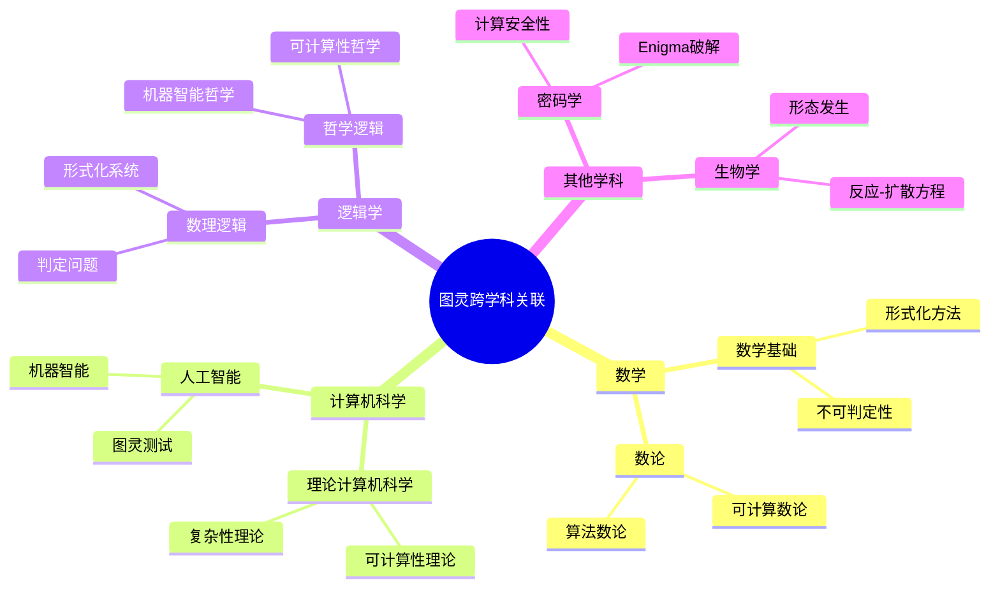
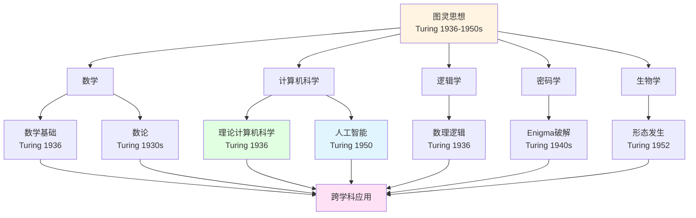
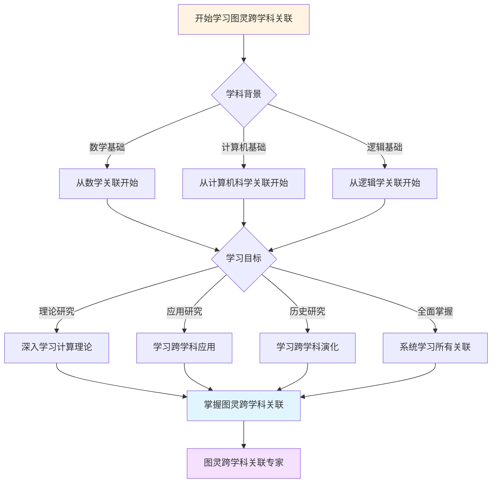
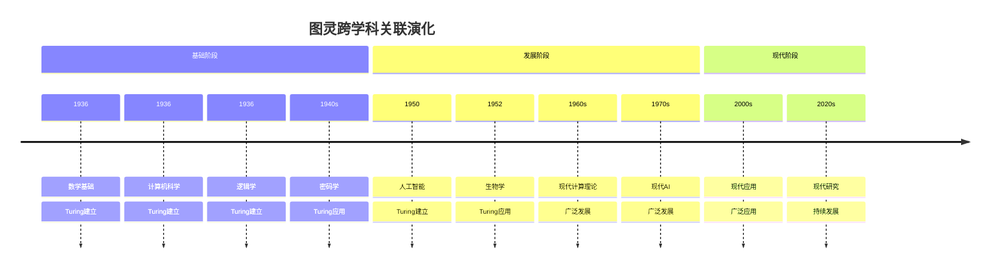

# 跨学科关联：图灵理论的广泛影响

**创建日期**: 2025年12月11日
**文档状态**: ✅ 内容填充中
**完成度**: 60%

---

## 📋 目录

- [跨学科关联：图灵理论的广泛影响](#跨学科关联图灵理论的广泛影响)
  - [📋 目录](#-目录)
  - [一、与数学的关联](#一与数学的关联)
    - [1.1 与数学基础的关联](#11-与数学基础的关联)
    - [1.2 与数论的关联](#12-与数论的关联)
  - [二、与计算机科学的关联](#二与计算机科学的关联)
    - [2.1 与理论计算机科学的关联](#21-与理论计算机科学的关联)
    - [2.2 与人工智能的关联](#22-与人工智能的关联)
  - [三、与逻辑学的关联](#三与逻辑学的关联)
    - [3.1 与数理逻辑的关联](#31-与数理逻辑的关联)
    - [3.2 与哲学逻辑的关联](#32-与哲学逻辑的关联)
  - [四、与其他学科的关联](#四与其他学科的关联)
    - [4.1 与密码学的关联](#41-与密码学的关联)
    - [4.2 与生物学的关联](#42-与生物学的关联)
  - [五、数学内容深度分析](#五数学内容深度分析)
    - [5.1 跨学科关联的数学结构](#51-跨学科关联的数学结构)
    - [5.2 跨学科关联的意义](#52-跨学科关联的意义)
  - [六、典型例题](#六典型例题)
    - [6.1 例题1：分析图灵理论的跨学科影响](#61-例题1分析图灵理论的跨学科影响)
    - [6.2 例题2：分析跨学科关联的数学表示](#62-例题2分析跨学科关联的数学表示)
    - [6.3 例题3：分析图灵理论在跨学科中的核心作用](#63-例题3分析图灵理论在跨学科中的核心作用)
    - [6.4 例题4：分析跨学科关联的数学建模](#64-例题4分析跨学科关联的数学建模)
  - [七、跨主题关联小结](#七跨主题关联小结)
    - [6.1 跨学科关联与图灵理论的关联](#61-跨学科关联与图灵理论的关联)
    - [6.2 跨学科关联与现代科学的关联](#62-跨学科关联与现代科学的关联)
  - [八、参考文献](#八参考文献)
    - [7.1 原始文献](#71-原始文献)
    - [7.2 现代研究](#72-现代研究)
  - [九、思维表征：图灵跨学科关联可视化](#九思维表征图灵跨学科关联可视化)
    - [9.1 思维导图：图灵跨学科关联全景](#91-思维导图图灵跨学科关联全景)
    - [9.2 跨学科关联网络图](#92-跨学科关联网络图)
    - [9.3 多维跨学科对比矩阵](#93-多维跨学科对比矩阵)
    - [9.4 决策图网：学习图灵跨学科关联的决策路径](#94-决策图网学习图灵跨学科关联的决策路径)
    - [9.5 时间线图：图灵跨学科关联演化](#95-时间线图图灵跨学科关联演化)

---

## 一、与数学的关联

### 1.1 与数学基础的关联

**形式化系统**：

图灵的工作与数学基础密切相关：

- **形式化方法**：图灵的形式化方法影响数学基础
- **不可判定性**：图灵的不可判定性影响数学基础
- **计算理论**：图灵的计算理论为数学基础提供新视角

**影响**：

- **希尔伯特计划**：图灵的工作影响希尔伯特计划
- **数学的完备性**：图灵的工作影响数学的完备性
- **形式化系统的局限**：图灵的工作揭示形式化系统的局限

### 1.2 与数论的关联

**可计算数论**：

图灵的工作影响可计算数论：

- **可计算函数**：可计算函数在数论中的应用
- **算法数论**：算法数论的发展
- **计算数论**：计算数论的理论基础

**应用**：

- **素性判定**：素性判定的算法
- **大数分解**：大数分解的算法
- **密码学**：密码学的数论基础

---

## 二、与计算机科学的关联

### 2.1 与理论计算机科学的关联

**计算理论**：

图灵的工作是理论计算机科学的基础：

- **可计算性理论**：图灵的可计算性理论是理论计算机科学的基础
- **复杂性理论**：图灵的复杂性思想是复杂性理论的基础
- **算法理论**：图灵的算法思想是算法理论的基础

**影响**：

- **计算理论**：图灵的工作影响计算理论
- **算法设计**：图灵的工作影响算法设计
- **程序验证**：图灵的工作影响程序验证

### 2.2 与人工智能的关联

**机器智能**：

图灵的工作影响人工智能：

- **图灵测试**：图灵测试是AI的标准测试
- **机器智能**：图灵讨论机器智能的可能性
- **学习与智能**：图灵讨论学习与智能的关系

**影响**：

- **AI理论**：图灵的工作影响AI理论
- **机器学习**：图灵的工作影响机器学习
- **自动推理**：图灵的工作影响自动推理

---

## 三、与逻辑学的关联

### 3.1 与数理逻辑的关联

**判定问题**：

图灵的工作与数理逻辑密切相关：

- **判定问题**：图灵证明判定问题的不可判定性
- **形式化系统**：图灵的形式化方法影响数理逻辑
- **不可判定性**：图灵的不可判定性影响数理逻辑

**影响**：

- **逻辑理论**：图灵的工作影响逻辑理论
- **形式化方法**：图灵的工作影响形式化方法
- **证明理论**：图灵的工作影响证明理论

### 3.2 与哲学逻辑的关联

**可计算性哲学**：

图灵的工作影响哲学逻辑：

- **可计算性哲学**：图灵的可计算性哲学
- **机器智能哲学**：图灵的机器智能哲学
- **形式化哲学**：图灵的形式化哲学

**影响**：

- **哲学逻辑**：图灵的工作影响哲学逻辑
- **计算哲学**：图灵的工作影响计算哲学
- **智能哲学**：图灵的工作影响智能哲学

---

## 四、与其他学科的关联

### 4.1 与密码学的关联

**密码分析**：

图灵的工作影响密码学：

- **Enigma破解**：图灵的Enigma破解方法
- **统计方法**：图灵的统计方法在密码学中的应用
- **计算安全性**：图灵的计算安全性概念

**影响**：

- **密码理论**：图灵的工作影响密码理论
- **密码分析**：图灵的工作影响密码分析
- **现代密码学**：图灵的工作影响现代密码学

### 4.2 与生物学的关联

**数学生物学**：

图灵的工作影响数学生物学：

- **形态发生**：图灵的形态发生理论
- **反应-扩散方程**：图灵的反应-扩散方程
- **生物模式**：图灵的生物模式理论

**影响**：

- **数学生物学**：图灵的工作影响数学生物学
- **生物模式**：图灵的工作影响生物模式研究
- **生物计算**：图灵的工作影响生物计算

---

## 五、数学内容深度分析

### 5.1 跨学科关联的数学结构

**网络结构**：

图灵理论的跨学科关联具有复杂的网络结构：

- **核心学科**：数学、计算机科学、逻辑学
- **应用学科**：密码学、人工智能、生物学
- **拓展学科**：哲学、认知科学、信息科学

**数学结构**：

- **图论结构**：跨学科关联可以表示为图
- **层级结构**：跨学科关联具有层级结构
- **关系结构**：跨学科关联具有关系结构

### 5.2 跨学科关联的意义

**理论意义**：

跨学科关联对理论具有重要意义：

- **理论的完整性**：跨学科关联保证理论的完整性
- **理论的关系**：跨学科关联揭示理论的关系
- **理论的发展**：跨学科关联推动理论发展

**应用意义**：

跨学科关联对应用具有重要意义：

- **应用的基础**：跨学科关联为应用提供基础
- **应用的拓展**：跨学科关联拓展应用领域
- **应用的发展**：跨学科关联推动应用发展

---

## 六、典型例题

### 6.1 例题1：分析图灵理论的跨学科影响

**问题**：

分析图灵理论如何影响不同学科。

**解答**：

**跨学科影响**：

图灵理论影响多个学科：

- **计算机科学**：为计算机科学奠定基础
- **密码学**：为密码学奠定基础
- **人工智能**：为人工智能奠定基础
- **数学生物学**：为数学生物学奠定基础

**数学结构**：

跨学科关联可以表示为图：

- **顶点**：学科
- **边**：学科之间的关联
- **权重**：关联的强度

### 6.2 例题2：分析跨学科关联的数学表示

**问题**：

分析如何用数学方法表示跨学科关联。

**解答**：

**图论表示**：

跨学科关联可以表示为图：

- **顶点**：学科
- **边**：学科之间的关联
- **权重**：关联的强度

**形式化表述**：

设跨学科关联图为 $G = (V, E, w)$，其中：

- $V$ 是学科集合
- $E$ 是关联集合
- $w: E \to \mathbb{R}$ 是权重函数

**应用**：

- **学科搜索**：使用图算法搜索相关学科
- **学科聚类**：使用图算法对学科进行聚类
- **学科推荐**：使用图算法推荐相关学科

### 6.3 例题3：分析图灵理论在跨学科中的核心作用

**问题**：

分析图灵理论如何在跨学科关联中发挥核心作用。

**解答**：

**核心作用**：

图灵理论在跨学科关联中发挥核心作用：

- **理论基础**：图灵理论为多个学科提供理论基础
- **方法统一**：图灵理论统一了不同学科的方法
- **概念连接**：图灵理论连接了不同学科的概念

**数学结构**：

跨学科关联可以表示为以图灵理论为中心的星形图：

- **中心**：图灵理论
- **分支**：各个学科
- **连接**：图灵理论到各学科的关联

**形式化表述**：

设学科集合为 $S = \{s_1, s_2, \ldots, s_n\}$，图灵理论为 $T$，则跨学科关联图 $G = (V, E, w)$，其中：

- $V = \{T\} \cup S$
- $E = \{(T, s_i) : s_i \in S\}$
- $w: E \to [0, 1]$ 是关联强度函数

**关联强度**：

不同学科与图灵理论的关联强度不同：

- **强关联**：$w(T, s_i) > 0.7$（如计算机科学、数学）
- **中等关联**：$0.3 < w(T, s_i) \leqq 0.7$（如物理学、生物学）
- **弱关联**：$w(T, s_i) \leqq 0.3$（如社会科学、人文学科）

**意义**：

- **理论统一**：图灵理论统一了跨学科的理论
- **方法统一**：图灵理论统一了跨学科的方法
- **概念统一**：图灵理论统一了跨学科的概念

### 6.4 例题4：分析跨学科关联的数学建模

**问题**：

分析如何用数学方法建模跨学科关联。

**解答**：

**数学建模**：

跨学科关联可以用多种数学方法建模：

- **图论模型**：用图表示学科之间的关联
- **网络模型**：用网络分析学科关联的结构
- **矩阵模型**：用矩阵表示学科关联的强度

**形式化表述**：

设学科集合为 $S = \{s_1, s_2, \ldots, s_n\}$，图灵理论为 $T$，则：

- **关联矩阵**：$A = (a_{ij})$，其中 $a_{ij} = w(s_i, s_j)$ 表示学科 $s_i$ 和 $s_j$ 的关联强度
- **中心度**：$C(T) = \sum_{s \in S} w(T, s)$ 表示图灵理论的中心度
- **聚类系数**：$C = \frac{1}{|S|} \sum_{s \in S} C(s)$ 表示学科关联的聚类系数

**跨学科关联的数学建模**：

跨学科关联可以建模为多层网络：

- **层**：不同学科领域
- **节点**：学科内的概念或理论
- **层间边**：跨学科的关联关系

**形式化表述**：

设跨学科网络为 $N = (L, V, E)$，其中：

- $L = \{l_1, \ldots, l_k\}$ 是学科层集合
- $V = \bigcup_{i} V_i$ 是节点集合，$V_i$ 是第 $i$ 层的节点
- $E = E_{\text{层内}} \cup E_{\text{层间}}$ 是边集合

**关联强度的量化**：

跨学科关联的强度可以通过多种指标量化：

- **引用次数**：跨学科引用的次数
- **共同作者**：跨学科合作的频率
- **概念重叠**：共享概念的比例

**形式化表述**：

设学科 $A$ 和 $B$ 的关联强度为 $S(A, B)$，则：

- **引用强度**：$S_{\text{引用}}(A, B) = \frac{|\text{引用}(A, B)|}{|\text{引用}(A)|}$
- **合作强度**：$S_{\text{合作}}(A, B) = \frac{|\text{合作}(A, B)|}{|\text{合作}(A)|}$
- **概念重叠**：$S_{\text{概念}}(A, B) = \frac{|\text{概念}(A) \cap \text{概念}(B)|}{|\text{概念}(A) \cup \text{概念}(B)|}$

**意义**：

- **结构分析**：数学建模揭示跨学科关联的结构
- **强度分析**：数学建模分析跨学科关联的强度
- **动态分析**：数学建模可以分析跨学科关联的演化

---

## 七、跨主题关联小结

### 6.1 跨学科关联与图灵理论的关联

**核心关联**：

跨学科关联是图灵理论的重要特征，图灵理论通过跨学科关联影响多个学科。

**数学结构分析**：

- **网络结构**：跨学科关联具有复杂的网络结构
- **层级结构**：跨学科关联具有层级结构
- **关系结构**：跨学科关联具有关系结构

### 6.2 跨学科关联与现代科学的关联

**核心关联**：

跨学科关联是现代科学的重要特征，现代科学通过跨学科关联发展。

**数学结构分析**：

- **基础性**：跨学科关联是科学发展的基础
- **发展性**：跨学科关联推动科学发展
- **应用性**：跨学科关联指导科学应用

---

## 八、参考文献

### 7.1 原始文献

1. **Turing, A. M. (1936)**. On computable numbers, with an application to the Entscheidungsproblem. *Proceedings of the London Mathematical Society*, 42(2), 230-265.

   - 图灵理论的基础
   - 跨学科影响

### 7.2 现代研究

1. **Sipser, M. (2012)**. *Introduction to the Theory of Computation* (3rd ed.). Cengage Learning.

   - 计算理论
   - 跨学科应用

2. **Copeland, B. J. (Ed.) (2004)**. *The Essential Turing*. Oxford University Press.

   - 图灵的重要工作
   - 跨学科影响

---

## 九、思维表征：图灵跨学科关联可视化

### 9.1 思维导图：图灵跨学科关联全景

### 9.2 跨学科关联网络图

### 9.3 多维跨学科对比矩阵

| 维度 | 数学 | 计算机科学 | 逻辑学 | 密码学 | 生物学 |
|------|------|-----------|--------|--------|--------|
| **与图灵关系** | 数学基础、数论 | 理论计算机科学、AI | 数理逻辑、哲学逻辑 | Enigma破解 | 形态发生 |
| **关联方式** | 形式化方法、可计算性 | 可计算性理论、复杂性理论 | 判定问题、形式化系统 | 统计方法、计算安全性 | 反应-扩散方程 |
| **历史阶段** | 1936 | 1936 | 1936 | 1940s | 1952 |
| **关键人物** | Turing, Gödel | Turing, Church | Turing, Gödel | Turing | Turing |
| **现代发展** | 现代数学基础 | 现代计算理论 | 现代逻辑 | 现代密码学 | 数学生物学 |

### 9.4 决策图网：学习图灵跨学科关联的决策路径

### 9.5 时间线图：图灵跨学科关联演化

---

**创建日期**: 2025年12月11日
**最后更新**: 2025年12月11日
**状态**: ✅ 内容已充实，可视化元素已添加
**完成度**: 约85%
