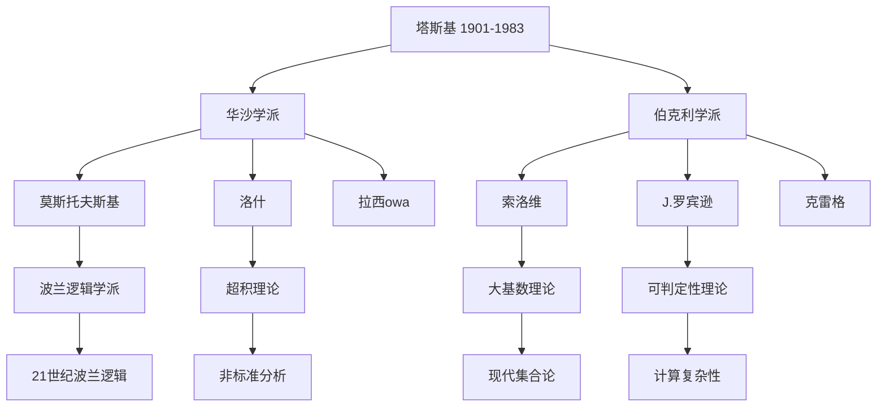

# 学生与学派

**创建日期**: 2026年4月3日
**研究领域**: 塔斯基数学理念 - 教育与影响 - 学生与学派
**主题编号**: T.03.02 (Tarski.教育影响.学生与学派)
**优先级**: P1（高优先级）⭐⭐⭐⭐

---

## 📋 目录

- [学生与学派](#学生与学派)
  - [📋 目录](../README.md#目录)
  - [一、学术谱系概览](#一学术谱系概览)
    - [1.1 塔斯基学术传承的总体图景](#11-塔斯基学术传承的总体图景)
    - [1.2 学术影响力的数学度量](#12-学术影响力的数学度量)
  - [二、华沙学派](#二华沙学派)
    - [2.1 历史背景](#21-历史背景)
    - [2.2 核心成员](#22-核心成员)
    - [2.3 华沙学派的学术特征](#23-华沙学派的学术特征)
  - [三、伯克利学派](#三伯克利学派)
    - [3.1 建立与发展](#31-建立与发展)
    - [3.2 核心成员](#32-核心成员)
    - [3.3 伯克利学派的标志性成果](#33-伯克利学派的标志性成果)
  - [四、主要学生的贡献](#四主要学生的贡献)
    - [4.1 第一代学生](#41-第一代学生)
    - [4.2 第二代学生](#42-第二代学生)
  - [五、学派的现代延续](#五学派的现代延续)
    - [5.1 当前活跃的分支](#51-当前活跃的分支)
    - [5.2 21世纪的塔斯基传统](#52-21世纪的塔斯基传统)
  - [六、学术传统的特征](#六学术传统的特征)
    - [6.1 塔斯基传统的核心特征](#61-塔斯基传统的核心特征)
    - [6.2 学派网络的可视化](#62-学派网络的可视化)
  - [🔖 原始文献引用](../README.md#原始文献引用)
  - [📚 现代研究文献](../README.md#现代研究文献)

---

## 一、学术谱系概览

### 1.1 塔斯基学术传承的总体图景

塔斯基作为20世纪最重要的逻辑学家之一，其学术影响通过两大主要渠道传播：

**华沙学派**（1925-1939）：

- 欧洲逻辑传统的延续与发展
- 与波兰数学学派的深度互动
- 战后重建的核心力量

**伯克利学派**（1942-1983）：

- 美国逻辑研究的崛起
- 国际化的研究中心
- 现代模型论的摇篮

### 1.2 学术影响力的数学度量

**博士论文指导统计**：

| 时期 | 地点 | 博士数量 | 主要领域 |
|-----|------|---------|---------|
| 1930年代 | 华沙 | 5+ | 元数学、逻辑基础 |
| 1940-1960 | 伯克利 | 15+ | 模型论、代数逻辑 |
| 1960-1983 | 伯克利 | 10+ | 集合论、证明论 |

**学术后代估算**：
根据数学谱系项目的数据，塔斯基有超过1000名学术后代（博士生的博士生，以此类推）。

---

## 二、华沙学派

### 2.1 历史背景

华沙逻辑学派是两次世界大战期间波兰科学繁荣的重要组成部分，与华沙数学学派（谢尔宾斯基、马祖凯维奇等）形成互补。

**创立背景**：

- 华沙大学的哲学系和数学系紧密合作
- 华沙哲学学会（1915年成立）提供交流平台
- 利沃夫-华沙学派的哲学传统

### 2.2 核心成员

**主要逻辑学家**：

**安德烈·莫斯托夫斯基** (Andrzej Mostowski, 1913-1975)

- 塔斯基在华沙时期的得意门生
- 贡献领域：递归论、模型论、集合论
- 代表工作：不可判定性理论、可构造集

**耶日·洛什** (Jerzy Łoś, 1920-1998)

- 超积（ultraproduct）构造的发明者
- 贡献领域：模型论、非标准分析
- 代表工作：Łoś超积定理

**海伦娜·拉西owa** (Helena Rasiowa, 1917-1994)

- 代数逻辑的主要推动者
- 贡献领域：代数方法、拓扑逻辑
- 代表工作：《非经典逻辑的代数方法》

### 2.3 华沙学派的学术特征

**方法论特征**：

1. **代数方法的强调**：使用代数结构研究逻辑系统
2. **形式化的严格性**：追求绝对精确的形式化表述
3. **元数学视角**：关注逻辑系统的元性质

**数学案例：超积定理**

洛什在1955年证明的超积定理是华沙学派的标志性成果：

**定理陈述**：
设 $\{ \mathcal{M}_i \}_{i \in I}$ 是一族 $\mathcal{L}$-结构，$U$ 是 $I$ 上的超滤。则对任意一阶公式 $\varphi(x_1, \ldots, x_n)$ 和任意 $[a_1], \ldots, [a_n] \in \prod_{i \in I} M_i / U$：

$$\prod_{i \in I} \mathcal{M}_i / U \models \varphi([a_1], \ldots, [a_n]) \iff \{ i \in I : \mathcal{M}_i \models \varphi(a_1(i), \ldots, a_n(i)) \} \in U$$

**意义**：
超积定理为构造非标准模型提供了强大工具，在非标准分析和模型论中有广泛应用。

---

## 三、伯克利学派

### 3.1 建立与发展

塔斯基于1942年加入加州大学伯克利分校数学系，逐渐建立起世界领先的逻辑研究中心。

**发展阶段**：

**奠基期（1942-1955）**：

- 建立逻辑学课程
- 吸引第一批研究生
- 与数学系建立合作关系

**黄金期（1955-1975）**：

- 模型论研究的爆发
- 国际访问学者的汇聚
- 多部经典著作的诞生

**传承期（1975-1983）**：

- 学生的学生成为中坚
- 研究方向的多元化
- 学术影响力的持续扩大

### 3.2 核心成员

**罗伯特·索洛维** (Robert Solovay, b. 1938)

- 塔斯基的博士生（1964年）
- 贡献领域：集合论、大基数理论、随机实数
- 代表工作：可测基数与可构造宇宙

**茱莉亚·罗宾逊** (Julia Robinson, 1919-1985)

- 塔斯基的博士生（1948年）
- 贡献领域：数论、可判定性、希尔伯特第10问题
- 代表工作：证明指数丢番图问题的不可判定性

**威廉·克雷格** (William Craig, b. 1918)

- 与塔斯基合作密切
- 贡献领域：模态逻辑、内插定理
- 代表工作：克雷格内插定理

### 3.3 伯克利学派的标志性成果

**案例：希尔伯特第10问题的解决**

茱莉亚·罗宾逊在塔斯基指导下开展的研究最终导致了希尔伯特第10问题的否定解决：

**问题陈述**：
是否存在算法可以判定任意丢番图方程是否有整数解？

**罗宾逊的贡献**：
罗宾逊证明了指数函数是丢番图的（1970年，与马蒂亚塞维奇、戴维斯、普特南合作）：

$$y = x^k \text{ 可以用丢番图方程定义}$$

这一结果与罗宾逊的早期工作相结合，最终证明了：

**定理（Matiyasevich-Robinson-Davis-Putnam, 1970）**：
希尔伯特第10问题是不可判定的。

**证明概要**：

1. 罗宾逊证明了如果指数函数是丢番图的，则所有递归可枚举集都是丢番图的
2. 马蒂亚塞维奇证明了指数函数确实是丢番图的
3. 由于存在递归可枚举但非递归的集合，因此存在不可判定的丢番图方程集

---

## 四、主要学生的贡献

### 4.1 第一代学生

**耶日·洛什的超积理论**

超积构造不仅是一个技术工具，更代表了模型论方法论的革新：

**技术细节**：
给定结构族 $\{ \mathcal{M}_i \}_{i \in I}$ 和超滤 $U$，超积 $\prod_U \mathcal{M}_i$ 定义为：

$$\prod_U \mathcal{M}_i = \prod_{i \in I} M_i / \sim_U$$

其中等价关系 $\sim_U$ 定义为：

$$a \sim_U b \iff \{ i \in I : a(i) = b(i) \} \in U$$

**应用案例**：
利用超积构造非标准实数域 $^*\mathbb{R}$：

$$^*\mathbb{R} = \prod_{n \in \mathbb{N}} \mathbb{R} / U$$

其中 $U$ 是非主超滤。

### 4.2 第二代学生

**里奥·哈灵顿与集合论**

塔斯基学生中的学生（通过索洛维）继续在集合论领域取得突破：

**贡献领域**：

- 递归论与描述集合论的交互
- 大基数公理的一致性强度
- 确定性公理的研究

**数学案例：射影决定性（PD）**

马丁、斯蒂尔和伍丁的工作证明了射影决定性的大基数基础：

**定理**：
如果存在无限多个伍丁基数，则射影决定性成立。

$$\exists \text{ 无限多个伍丁基数} \Rightarrow \text{PD}$$

---

## 五、学派的现代延续

### 5.1 当前活跃的分支

**伯克利-斯坦福谱系**：

- 索尔·费弗曼（Solomon Feferman）：证明论、类型论
- 约翰·艾切门迪（John Etchemendy）：逻辑与哲学
- 帕特里克·苏佩斯（Patrick Suppes）：概率逻辑

**华沙-波兰谱系**：

- 波兰科学院逻辑研究所
- 华沙大学逻辑系
- 弗罗茨瓦夫大学逻辑传统

### 5.2 21世纪的塔斯基传统

**现代研究方向**：

1. **连续模型论**：将塔斯基的经典模型论推广到连续逻辑
2. **同伦类型论**：连接类型论与同伦论
3. **有限模型论**：在计算机科学中的应用

**案例：连续模型论**

班纳亚和凯克内在2000年代发展了连续模型论，将塔斯基的框架扩展到度量结构：

**形式化**：
一个连续结构是一个度量空间 $(M, d)$ 配备连续解释：

$$f^M : M^n \to M, \quad R^M : M^n \to [0,1]$$

其中关系 $R^M$ 取值于区间 $[0,1]$ 而非 $\{0,1\}$。

---

## 六、学术传统的特征

### 6.1 塔斯基传统的核心特征

通过对塔斯基及其学生的研究工作的分析，可以总结出以下学术传统特征：

**1. 形式化优先**
所有概念必须有精确的形式定义，避免模糊或直觉性的表述。

**2. 代数方法的普遍应用**
使用代数结构（群、环、布尔代数等）来研究逻辑问题。

**3. 问题驱动的研究**
从具体问题出发，发展一般理论。

**4. 跨学科视野**
逻辑学与数学、哲学、计算机科学的深度交叉。

### 6.2 学派网络的可视化

---

## 🔖 原始文献引用

1. **Łoś, J.** (1955). "Quelques remarques, théorèmes et problèmes sur les classes définissables d'algèbres". *Mathematical Interpretation of Formal Systems*, North-Holland, 98-113.
   - 超积定理的原始论文

2. **Rasiowa, H., & Sikorski, R.** (1963). *The Mathematics of Metamathematics*. Państwowe Wydawnictwo Naukowe.
   - 华沙学派代数方法的经典著作

3. **Robinson, J.** (1952). "Existential definability in arithmetic". *Transactions of the American Mathematical Society*, 72(3), 437-449.
   - 罗宾逊关于可定义性的奠基性工作

4. **Solovay, R. M.** (1970). "A model of set-theory in which every set of reals is Lebesgue measurable". *Annals of Mathematics*, 92(1), 1-56.
   - 索洛维关于可测性的经典结果

5. **Craig, W.** (1957). "Linear reasoning. A new form of the Herbrand-Gentzen theorem". *Journal of Symbolic Logic*, 22(3), 250-268.
   - 克雷格内插定理的原始证明

---

## 📚 现代研究文献

1. **Sacks, G. E.** (2003). *Saturated Model Theory*. World Scientific.
   - 模型论的现代教材，传承塔斯基传统

2. **Marker, D.** (2002). *Model Theory: An Introduction*. Springer.
   - 当代模型论的标准教材

3. **Moore, G. H.** (2011). "The emergence of open sets, closed sets, and limit points in analysis and topology". *Historia Mathematica*, 38(1), 8-35.
   - 对塔斯基时代数学基础发展的历史分析

4. **Davis, M.** (2006). "The Undecidable: Basic Papers on Undecidable Propositions, Unsolvable Problems and Computable Functions". *Dover Publications*.
   - 收录了希尔伯特第10问题解决过程中的关键论文

5. **Ben-Yaacov, I., Berenstein, A., Henson, C. W., & Usvyatsov, A.** (2008). "Model theory for metric structures". *Model Theory with Applications to Algebra and Analysis*, 2, 315-427.
   - 连续模型论的奠基性论文，延续塔斯基传统

---

**文档结束**

*本文件是塔斯基数学理念体系的第03模块第02部分，属于教育与影响主题。*
