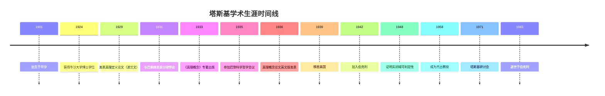

# 塔斯基生平与学术生涯

**创建日期**: 2026年4月2日
**研究领域**: 塔斯基数学理念 - 历史与传记 - 生平与学术生涯
**主题编号**: T.04.01 (Tarski.历史与传记.生平与学术生涯)
**优先级**: P1（高优先级）⭐⭐⭐⭐

---

## 📋 目录

- [塔斯基生平与学术生涯](#塔斯基生平与学术生涯)
  - [📋 目录](#目录)
  - [一、早年生活与教育背景](#一早年生活与教育背景)
    - [1.1 出生与家庭背景](#11-出生与家庭背景)
    - [1.2 早期教育](#12-早期教育)
    - [1.3 博士论文](#13-博士论文)
  - [二、华沙时期（1919-1939）](#二华沙时期1919-1939)
    - [2.1 华沙逻辑学派的形成](#21-华沙逻辑学派的形成)
    - [2.2 学术职位](#22-学术职位)
    - [2.3 早期主要成果](#23-早期主要成果)
    - [2.4 国际合作](#24-国际合作)
  - [三、战争与流亡（1939-1942）](#三战争与流亡1939-1942)
    - [3.1 二战爆发](#31-二战爆发)
    - [3.2 流亡历程](#32-流亡历程)
    - [3.3 战时学术活动](#33-战时学术活动)
  - [四、伯克利时期（1942-1983）](#四伯克利时期1942-1983)
    - [4.1 加入加州大学伯克利分校](#41-加入加州大学伯克利分校)
    - [4.2 建立逻辑学研究中心](#42-建立逻辑学研究中心)
    - [4.3 后期主要成果](#43-后期主要成果)
    - [4.4 荣誉与奖项](#44-荣誉与奖项)
    - [4.5 晚年与逝世](#45-晚年与逝世)
  - [五、主要学术成就时间线](#五主要学术成就时间线)
  - [六、个人生活与性格](#六个人生活与性格)
    - [6.1 家庭](#61-家庭)
    - [6.2 性格特征](#62-性格特征)
    - [6.3 个人爱好](#63-个人爱好)
  - [七、历史评价](#七历史评价)
    - [7.1 学术地位](#71-学术地位)
    - [7.2 影响评估](#72-影响评估)
    - [7.3 纪念](#73-纪念)

---

## 一、早年生活与教育背景

### 1.1 出生与家庭背景

**阿尔弗雷德·塔斯基**（Alfred Tarski，原名Alfred Teitelbaum）于1901年1月14日出生于波兰华沙。

**家庭背景**：

- 父亲：伊格纳茨·泰特尔鲍姆（Ignacy Teitelbaum），成功的服装商人
- 母亲：罗莎·普拉萨（Rosa Prussak）
- 家庭环境：富裕的犹太家庭，重视教育

### 1.2 早期教育

**华沙大学时期（1919-1924）**：

- 最初学习生物学，后转向数学
- 师从华沙数学学派和逻辑学派的领袖
- 主要导师：斯坦尼斯瓦夫·列斯涅夫斯基（Stanisław Leśniewski）

**学术转向**：

- 列斯涅夫斯基的数学哲学课程激发了塔斯基对逻辑的兴趣
- 逐渐从生物学完全转向数学逻辑研究

### 1.3 博士论文

**1924年获得博士学位**

- 论文题目：《关于在所有领域中都成立的逻辑定理》（O wyrazie pierwotnym logistyki）
- 导师：斯坦尼斯瓦夫·列斯涅夫斯基
- 论文主题：类型论和逻辑基础

---

## 二、华沙时期（1919-1939）

### 2.1 华沙逻辑学派的形成

塔斯基是华沙逻辑学派的核心成员，该学派与华沙数学学派并称，使华沙成为世界数学和逻辑学的重要中心。

**主要成员**：

- 斯坦尼斯瓦夫·列斯涅夫斯基（类型论）
- 扬·卢卡西维茨（多值逻辑）
- 卡西米尔·库拉托夫斯基（拓扑学）
- 阿道夫·林登鲍姆（拓扑学、逻辑学）

### 2.2 学术职位

| 年份 | 职位 | 机构 |
|-----|-----|-----|
| 1924-1939 | 讲师/副教授 | 华沙大学 |
| 1925-1939 | 数学教师 | Zeromski's Liceum（高中） |

**双重身份**：

- 大学教职：进行前沿研究，指导研究生
- 高中教师：教授数学，编写教材

### 2.3 早期主要成果

**1920s-1930s的重要工作**：

- **1929**：《形式化语言中的真理概念》（德文）
  - 奠定语义学基础
  - 提出T-Schema

- **1931**：与巴拿赫合作的分球悖论
  - 塔斯基-巴拿赫悖论
  - 选择公理的深层影响

- **1935**：《论逻辑后承的概念》
  - 形式化逻辑后承概念
  - 开创逻辑语义学

- **1936**：《真理的语义概念与语义学基础》（波兰文，1933；德文，1935；英文，1943）
  - 最著名的工作
  - 真理的语义定义

### 2.4 国际合作

**与维也纳学派的联系**：

- 参加1935年巴黎科学哲学会议
- 与卡尔纳普、纽拉特等人建立联系
- 对逻辑实证主义产生影响

---

## 三、战争与流亡（1939-1942）

### 3.1 二战爆发

**1939年9月**：德国入侵波兰，第二次世界大战爆发。

**塔斯基的处境**：

- 作为犹太人面临纳粹迫害
- 家庭和事业的重大危机

### 3.2 流亡历程

**1939年8月**：塔斯基前往美国参加哈佛大学的科学哲学会议，这一决定挽救了他的生命。

**流亡路径**：

```
华沙 → 美国（1939年8月）
     → 滞留美国
     → 无法返回被占领的波兰
```

**个人悲剧**：

- 留在波兰的家人大多在大屠杀中遇难
- 好友阿道夫·林登鲍姆1941年遇难
- 永远无法回到祖国

### 3.3 战时学术活动

在美国期间，塔斯基继续学术研究：

- 与卡尔纳普在芝加哥大学合作
- 在普林斯顿高等研究院访问
- 1939-1941年在纽约市立学院任教

---

## 四、伯克利时期（1942-1983）

### 4.1 加入加州大学伯克利分校

**1942年**：塔斯基获得加州大学伯克利分校的教职，这成为他余生的学术家园。

**职位晋升**：

- 1942：讲师
- 1945：副教授
- 1948：正教授
- 1958：杰出教授

### 4.2 建立逻辑学研究中心

塔斯基在伯克利建立了世界领先的数理逻辑研究中心：

**研究中心特点**：

- 系统的博士培养项目
- 国际性的学术交流
- 跨学科的研究氛围

**重要会议**：

- 塔斯基研讨会（Tarski Symposium, 1971）
- 国际逻辑、方法论和科学哲学会议

### 4.3 后期主要成果

**1940s-1960s的工作**：

- **1948**：《初等代数和几何的判定方法》
  - 证明实闭域的可判定性
  - 量词消去技术的巅峰

- **1950s**：模型论的全面发展
  - 与学生Vaught、Keisler共同发展模型论
  - 《模型论》（与Vaught合作）

- **1959**：《真度是什么？》
  - 真理概念的通俗阐述
  - 面向更广泛的读者

### 4.4 荣誉与奖项

| 年份 | 荣誉/奖项 |
|-----|----------|
| 1950 | 美国艺术与科学院院士 |
| 1966 | 英国科学院通讯院士 |
| 1967 | 瑞典皇家科学院外籍院士 |
| 1971 | 塔斯基研讨会（70岁生日纪念） |
| 1977 | 波兰科学院外籍院士 |

### 4.5 晚年与逝世

**1983年10月26日**，塔斯基在伯克利逝世，享年82岁。

**晚年活动**：

- 继续指导学生
- 完成《逻辑与证明》手稿
- 反思一生的学术工作

---

## 五、主要学术成就时间线



---

## 六、个人生活与性格

### 6.1 家庭

**婚姻**：

- 1924年与玛丽亚·维特科夫斯卡（Maria Witkowska）结婚
- 两个孩子：儿子Jan、女儿Krystyna

**流亡后的家庭**：

- 妻子和孩子后来也来到美国
- 家庭生活相对稳定

### 6.2 性格特征

**学术风格**：

- 极度严谨，追求精确
- 工作狂，对研究充满热情
- 善于合作，培养了众多学生

**教学特点**：

- 要求严格但关心学生
- 善于激发学生的研究兴趣
- 注重培养学生的独立工作能力

### 6.3 个人爱好

- **摄影**：业余摄影爱好者，留下大量照片
- **旅行**：喜欢旅行，参加国际会议
- **美食**：对美食有浓厚兴趣

---

## 七、历史评价

### 7.1 学术地位

塔斯基被公认为20世纪最伟大的逻辑学家之一：

**评价**：

- "现代模型论之父"
- "语义学的奠基人"
- "形式化方法的先驱"

### 7.2 影响评估

**直接影响**：

- 指导了30多位博士生
- 影响了数代逻辑学家
- 建立了持久的学术传统

**持久遗产**：

- 模型论成为数学的重要分支
- 语义学方法是现代逻辑的基础
- 形式化方法渗透到计算机科学

### 7.3 纪念

- **塔斯基奖**：符号逻辑协会设立的奖项
- **塔斯基讲座**：伯克利大学定期举办的讲座系列
- **学术纪念文集**：多部纪念文集出版

---

**相关文档**：

- [02-主要著作与论文](./02-主要著作与论文.md)
- [03-学术合作与争论](../03-学术合作与争论.md)
- [../01-核心理论/01-模型论基础.md](../01-核心理论/01-模型论基础.md)

*最后更新：2026年4月2日*
