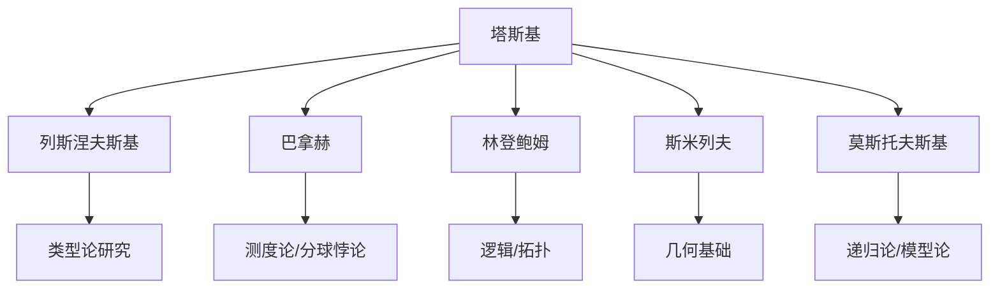
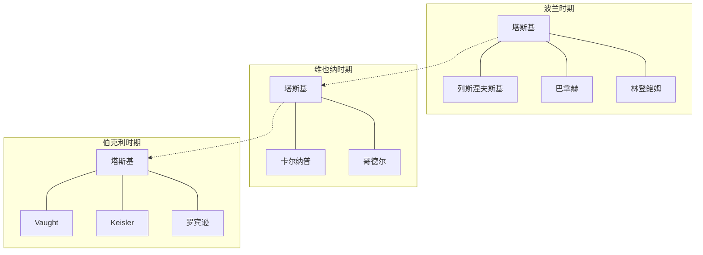

---
msc_primary: "01A99"
---

# 塔斯基的学术合作与争论

**创建日期**: 2026年4月2日
**研究领域**: 塔斯基数学理念 - 历史与传记 - 学术合作与争论
**主题编号**: T.04.03 (Tarski.历史与传记.学术合作与争论)
**优先级**: P1（高优先级）⭐⭐⭐⭐

---

## 📋 目录

- [塔斯基的学术合作与争论](#塔斯基的学术合作与争论)
  - [📋 目录](#-目录)
  - [一、学术合作概述](#一学术合作概述)
    - [1.1 合作特点](#11-合作特点)
    - [1.2 合作模式](#12-合作模式)
  - [二、与波兰学者的合作](#二与波兰学者的合作)
    - [2.1 与列斯涅夫斯基的关系](#21-与列斯涅夫斯基的关系)
    - [2.2 与巴拿赫的合作](#22-与巴拿赫的合作)
    - [2.3 华沙学派的学术网络](#23-华沙学派的学术网络)
  - [三、与哥德尔的合作与关系](#三与哥德尔的合作与关系)
    - [3.1 历史背景](#31-历史背景)
    - [3.2 学术互动](#32-学术互动)
    - [3.3 优先权争议](#33-优先权争议)
    - [3.4 关系特点](#34-关系特点)
  - [四、与维也纳学派的交流](#四与维也纳学派的交流)
    - [4.1 与卡尔纳普的合作](#41-与卡尔纳普的合作)
    - [4.2 与维也纳学派的互动](#42-与维也纳学派的互动)
  - [五、与伯克利同事的合作](#五与伯克利同事的合作)
    - [5.1 与学生的合作](#51-与学生的合作)
    - [5.2 跨学科合作](#52-跨学科合作)
    - [5.3 合作成果统计](#53-合作成果统计)
  - [六、主要学术争论](#六主要学术争论)
    - [6.1 与直觉主义的争论](#61-与直觉主义的争论)
    - [6.2 关于真理理论的争论](#62-关于真理理论的争论)
    - [6.3 关于选择公理的争论](#63-关于选择公理的争论)
  - [七、合作网络分析](#七合作网络分析)
    - [7.1 合作网络图](#71-合作网络图)
    - [7.2 合作的影响](#72-合作的影响)
    - [7.3 学派的传承](#73-学派的传承)

---

## 一、学术合作概述

### 1.1 合作特点

塔斯基的学术合作具有以下特点：

- **跨学科**：涉及数学、逻辑学、哲学
- **国际性**：波兰、奥地利、美国、德国
- **多层次**：从博士生到顶尖学者
- **持续性**：许多合作延续数十年

### 1.2 合作模式

**直接合作**：

- 联合发表论文
- 共同指导学生
- 合作编写教材

**间接影响**：

- 学术思想交流
- 方法论传播
- 学派网络建立

---

## 二、与波兰学者的合作

### 2.1 与列斯涅夫斯基的关系

**斯坦尼斯瓦夫·列斯涅夫斯基**（Stanisław Leśniewski，1886-1939）是塔斯基在华沙大学的导师。

**师生关系**：

- 塔斯基1924年的博士论文在列斯涅夫斯基指导下完成
- 列斯涅夫斯基的类型论和本体论对塔斯基早期思想有重要影响
- 后来塔斯基逐渐发展出自己的研究方向

**学术分歧**：

- 列斯涅夫斯基坚持独特的逻辑符号系统
- 塔斯基倾向于更标准的方法
- 塔斯基后来很少引用列斯涅夫斯基的工作

### 2.2 与巴拿赫的合作

**斯特凡·巴拿赫**（Stefan Banach，1892-1945）是华沙数学学派的领袖。

**重要合作**：

- **1924年**：分球悖论论文
- **数学影响**：展示了选择公理在几何中的惊人应用

**合作成果**：

```
论文：《关于将点集分解为两两全等的部分》(1924)
核心：塔斯基-巴拿赫分球悖论
意义：选择公理最具争议的推论之一
```

### 2.3 华沙学派的学术网络



---

## 三、与哥德尔的合作与关系

### 3.1 历史背景

塔斯基与**库尔特·哥德尔**（Kurt Gödel，1906-1978）是20世纪最杰出的两位逻辑学家。

**首次会面**：

- 时间：1930年左右
- 地点：维也纳或华沙
- 背景：两人都致力于数学基础研究

### 3.2 学术互动

**相互影响**：

| 方面 | 塔斯基的贡献 | 哥德尔的贡献 |
|-----|------------|------------|
| 真理理论 | 语义学定义 | 不可判定性定理 |
| 模型论 | 紧致性定理 | 完备性定理 |
| 集合论 | 可测基数 | 选择公理/CH的协调性 |

**通信与讨论**：

- 通过学术会议交流
- 书信讨论技术问题
- 对彼此工作的评价

### 3.3 优先权争议

**紧致性定理的优先权**：

- 塔斯基声称他在1930年就已证明紧致性定理
- 哥德尔在1930年证明了一阶逻辑的完备性，紧致性定理是其推论
- 历史记录显示两人独立获得相关结果

**塔斯基的声明**：
> "我在1930年就已经证明了紧致性定理，但由于各种原因没有及时发表。"

**历史评价**：

- 两人都是独立发现者
- 哥德尔首先发表完备性定理
- 塔斯基对模型论的系统发展贡献更大

### 3.4 关系特点

- **相互尊重**：两人都对对方的成就给予高度评价
- **风格差异**：塔斯基更技术性，哥德尔更哲学性
- **后期疏远**：二战后联系减少

---

## 四、与维也纳学派的交流

### 4.1 与卡尔纳普的合作

**鲁道夫·卡尔纳普**（Rudolf Carnap，1891-1970）是逻辑实证主义的核心人物。

**合作内容**：

- 1935年巴黎科学哲学会议
- 真理理论和方法论的讨论
- 《世界的逻辑构造》中的语义问题

**学术影响**：

- 塔斯基帮助卡尔纳普从句法学转向语义学
- 卡尔纳普在《语义学导论》中大量引用塔斯基
- 促进了逻辑实证主义的"语义学转向"

### 4.2 与维也纳学派的互动

**维也纳学派成员**：

- 莫里茨·施里克
- 奥托·纽拉特
- 汉斯·哈恩
- 卡尔·门格尔

**交流内容**：

- 逻辑实证主义的数学基础
- 科学统一性的逻辑框架
- 数学真理的本质

**影响方向**：

```
塔斯基 → 维也纳学派
- 语义学方法
- 形式化技术
- 元数学视角

维也纳学派 → 塔斯基
- 科学哲学视野
- 跨学科交流
- 国际学术网络
```

---

## 五、与伯克利同事的合作

### 5.1 与学生的合作

**罗伯特·沃特**（Robert Vaught，1926-2002）

- 1954年获得博士学位
- 合著《模型论》
- 共同指导博士生

**H.杰罗姆·基斯勒**（H. Jerome Keisler，1936-）

- 1961年获得博士学位
- 非标准分析的合作研究
- 《模型论》教科书的合著者

### 5.2 跨学科合作

**与数学系同事**：

- 代数学家：模型论与代数的结合
- 几何学家：几何公理化
- 分析学家：测度论基础

**与哲学系同事**：

- 科学哲学：科学理论的逻辑结构
- 语言哲学：意义理论
- 数学哲学：柏拉图主义vs形式主义

### 5.3 合作成果统计

| 合作者 | 合作论文数 | 主要领域 |
|-------|----------|---------|
| Vaught | 5+ | 模型论 |
| Keisler | 3+ | 非标准分析 |
 | 莫斯托夫斯基 | 10+ | 逻辑学 |
| 罗宾逊 | 3+ | 模型论、代数 |

---

## 六、主要学术争论

### 6.1 与直觉主义的争论

**争论焦点**：数学基础的方法论

**塔斯基立场**：

- 支持经典逻辑和排中律
- 强调形式化方法的重要性
- 坚持数学实在论

**直觉主义立场**（布劳威尔、海廷）：

- 反对无限制使用排中律
- 强调构造性证明
- 数学是心灵构造

**塔斯基的评价**：
> "直觉主义提出了重要问题，但过于限制数学实践。"

### 6.2 关于真理理论的争论

**与哲学家的争论**：

| 观点 | 代表人物 | 塔斯基的回应 |
|-----|---------|------------|
| 真理冗余论 | Ramsey | 技术化的真理概念仍然必要 |
| 真理实用论 | 詹姆斯 | 语义定义独立于实用效果 |
| 真理融贯论 | 布拉德雷 | 语义真理是基础性的 |

### 6.3 关于选择公理的争论

**塔斯基-巴拿赫悖论引发的讨论**：

- 悖论展示：使用选择公理可以将球分解成若干部分，重新组合成两个相同大小的球
- 数学界的震惊和质疑
- 推动对选择公理本质的深入理解

**塔斯基的立场**：

- 选择公理是数学推理的自然部分
- 悖论的"奇怪"源于直觉的局限性
- 强调形式化方法的重要性

---

## 七、合作网络分析

### 7.1 合作网络图



### 7.2 合作的影响

**对塔斯基的影响**：

- 扩展了研究视野
- 促进了思想交流
- 建立了学术网络

**对合作者的影响**：

- 传播了形式化方法
- 培养了研究技能
- 连接了学术传统

### 7.3 学派的传承

**华沙学派的延续**：

- 莫斯托夫斯基在波兰战后重建逻辑学
- 斯米列夫的几何基础研究

**伯克利学派的建立**：

- Vaught的模型论研究
- Keisler的非标准分析
- 后续学生的继续发展

---

**相关文档**：

- [01-生平与学术生涯](./01-生平与学术生涯.md)
- [02-主要著作与论文](./02-主要著作与论文.md)
- [../03-教育与影响/02-学生与学派.md](../03-教育与影响/02-学生与学派.md)

*最后更新：2026年4月2日*
