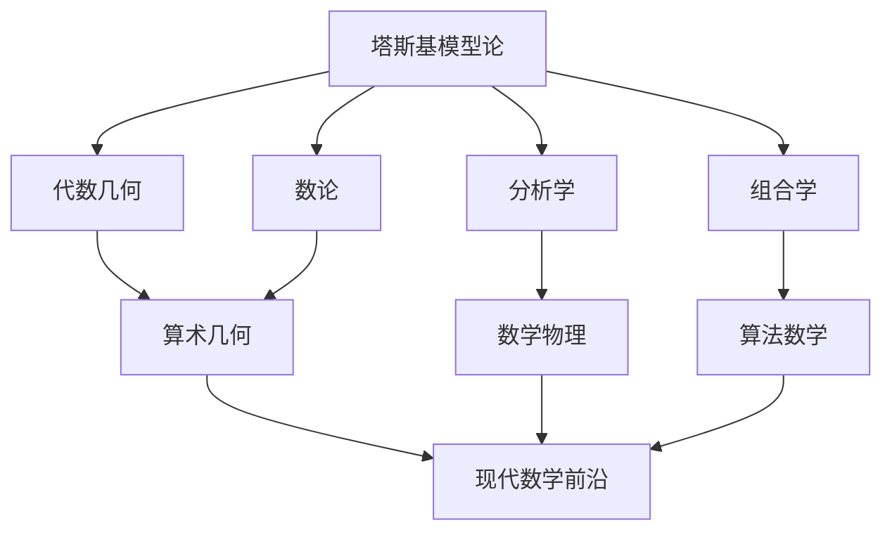

# 塔斯基数学理念在现代数学中的应用

**创建日期**: 2026年4月2日
**研究领域**: 塔斯基数学理念 - 现代应用与拓展 - 现代数学中的应用
**主题编号**: T.05.01 (Tarski.现代应用与拓展.现代数学中的应用)
**优先级**: P1（高优先级）⭐⭐⭐⭐

---

## 📋 目录

- [塔斯基数学理念在现代数学中的应用](#塔斯基数学理念在现代数学中的应用)
  - [📋 目录](#-目录)
  - [一、应用概述](#一应用概述)
    - [1.1 塔斯基思想的现代影响](#11-塔斯基思想的现代影响)
    - [1.2 模型论的数学核心](#12-模型论的数学核心)
  - [二、模型论在代数学中的应用](#二模型论在代数学中的应用)
    - [2.1 代数闭域](#21-代数闭域)
    - [2.2 实闭域](#22-实闭域)
    - [2.3 微分代数](#23-微分代数)
  - [三、模型论在几何学中的应用](#三模型论在几何学中的应用)
    - [3.1 实代数几何](#31-实代数几何)
    - [3.2 o-极小结构](#32-o-极小结构)
    - [3.3 非标准分析](#33-非标准分析)
  - [四、模型论在数论中的应用](#四模型论在数论中的应用)
    - [4.1 p进数上的模型论](#41-p进数上的模型论)
    - [4.2 Diophantine几何](#42-diophantine几何)
    - [4.3 算术组合学](#43-算术组合学)
  - [五、模型论在分析学中的应用](#五模型论在分析学中的应用)
    - [5.1 Banach空间模型论](#51-banach空间模型论)
    - [5.2 概率论](#52-概率论)
    - [5.3 微分方程](#53-微分方程)
  - [六、未来展望](#六未来展望)
    - [6.1 新兴领域](#61-新兴领域)
    - [6.2 跨学科应用](#62-跨学科应用)
    - [6.3 塔斯基遗产的延续](#63-塔斯基遗产的延续)

---

## 一、应用概述

### 1.1 塔斯基思想的现代影响

塔斯基创立的模型论不仅改变了逻辑学，也对现代数学的多个分支产生了深远影响：

**主要应用领域**：

- 代数学：代数模型论、域论
- 几何学：实代数几何、Tarski-Seidenberg原理
- 数论：Diophantine几何、p进模型论
- 分析学：Banach空间模型论、连续模型论

### 1.2 模型论的数学核心

**基本框架**：

```
结构 = 集合 + 关系/函数

模型论研究:
- 理论（一阶语句的集合）
- 模型（满足理论的解释）
- 它们之间的关系
```

---

## 二、模型论在代数学中的应用

### 2.1 代数闭域

**塔斯基定理**：代数闭域的理论是可判定的。

**应用**：

- 复代数几何的算法化
- 多项式方程组的可解性
- 量词消去技术

**Tarski-Seidenberg原理**：
> 半代数集在投影下的像仍是半代数集。

### 2.2 实闭域

**实代数几何的基础**：

| 概念 | 塔斯基贡献 | 应用 |
|-----|-----------|-----|
| 实闭域 | 可判定性证明 | CAD算法 |
| 半代数集 | 量词消去 | 优化问题 |
| 正性形式 | 希尔伯特第17问题 | 多项式优化 |

**应用案例**：

- Collins的柱形代数分解（CAD）
- 多项式优化的SOS方法
- 机器人运动学

### 2.3 微分代数

**微分闭域**：

- Robinson、Blum发展的理论
- 微分代数方程的可解性

**应用**：

- 微分方程的代数理论
- 控制理论
- 动力系统

---

## 三、模型论在几何学中的应用

### 3.1 实代数几何

**塔斯基的奠基工作**：

```
初等几何 = 实闭域上的代数几何

塔斯基结果:
- 可判定性
- 量词消去
- 算法复杂性
```

**现代应用**：

- 计算实代数几何
- 机器人路径规划
- 计算机辅助设计（CAD）

### 3.2 o-极小结构

**定义**：每个可定义集都是有限个区间和点的并。

**例子**：

- 实闭域（半代数集）
- 指数域（Wilkie）
- 限制解析函数（van den Dries）

**应用**：

- 光滑函数的驯化几何
- 数论中的计数问题（Pila-Wilkie定理）
- 动力系统

### 3.3 非标准分析

**Robinson的非标准分析**：

- 无穷小量的严格处理
- 基于紧致性定理

**应用**：

- 概率论
- 数学物理
- 经济学

---

## 四、模型论在数论中的应用

### 4.1 p进数上的模型论

**p进域的模型论**：

| 理论 | 结果 | 应用者 |
|-----|-----|-------|
| 代数封闭值域 | 消去量词 | A. Robinson |
| p进域 | 消去量词 | Macintyre |
| 半代数p进集 | 细胞分解 | Denef, van den Dries |

**应用案例**：

- Igusa局部zeta函数
- 有理点的密度
- 解析数论

### 4.2 Diophantine几何

**Mordell-Lang猜想**：

- Hrushovski使用模型论方法证明
- 结合了稳定性理论和代数几何

**应用**：

- 函数域上的Diophantine问题
- 特值问题
- 代数动力学的Manin-Mumford猜想

### 4.3 算术组合学

**Pila-Wilkie定理**：
> o-极小结构中可定义集的理性点数目增长缓慢。

**应用**：

- André-Oort猜想的部分证明
- Manin-Mumford猜想
- Zilber-Pink猜想

---

## 五、模型论在分析学中的应用

### 5.1 Banach空间模型论

**连续模型论**：

- Henson、Iovino发展的理论
- 处理度量结构和Banach空间

**应用**：

- 函数空间的分类
- 算子代数
- 遍历理论

### 5.2 概率论

**随机变量的模型论**：

- Keisler的随机化理论
- 连续一阶逻辑

**应用**：

- 大偏差理论
- 统计学习理论
- 平均场博弈

### 5.3 微分方程

**微分域的模型论**：

- 微分Galois理论
- 可解性判定

**应用**：

- 特殊函数理论
- 可积系统
- Painlevé分析

---

## 六、未来展望

### 6.1 新兴领域

**同伦类型论与模型论**：

- 模型范畴语义
- 高阶逻辑的结构
- 统一数学基础

**深度学习与模型论**：

- 神经网络的逻辑性质
- 可解释性
- 形式化验证

**量子模型论**：

- 量子逻辑的模型论
- 量子信息的语义

### 6.2 跨学科应用



### 6.3 塔斯基遗产的延续

**在21世纪的重要性**：

- 数学的算法化趋势
- 跨学科方法的统一
- 形式化数学的实现

---

**相关文档**：

- [02-物理学中的应用](./02-物理学中的应用.md)
- [03-计算机科学中的应用](./03-计算机科学中的应用.md)
- [../08-知识关联分析/01-概念关联网络.md](../08-知识关联分析/01-概念关联网络.md)

*最后更新：2026年4月2日*
