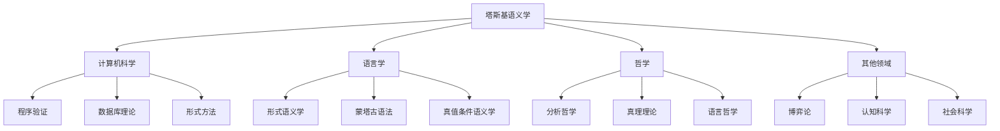

# 跨学科影响

**创建日期**: 2026年4月3日
**研究领域**: 塔斯基数学理念 - 现代应用与拓展 - 跨学科影响
**主题编号**: T.05.02 (Tarski.现代应用.跨学科影响)
**优先级**: P1（高优先级）⭐⭐⭐⭐

---

## 📋 目录

- [跨学科影响](#跨学科影响)
  - [📋 目录](#-目录)
  - [一、对计算机科学的影响](#一对计算机科学的影响)
    - [1.1 形式语义学与程序验证](#11-形式语义学与程序验证)
    - [1.2 模型检测](#12-模型检测)
    - [1.3 数据库理论](#13-数据库理论)
  - [二、对语言学的影响](#二对语言学的影响)
    - [2.1 形式语义学](#21-形式语义学)
    - [2.2 真值条件语义学](#22-真值条件语义学)
  - [三、对哲学的影响](#三对哲学的影响)
    - [3.1 分析哲学传统](#31-分析哲学传统)
    - [3.2 真理符合论的形式化](#32-真理符合论的形式化)
  - [四、对其他社会科学的影响](#四对其他社会科学的影响)
    - [4.1 经济学中的形式化方法](#41-经济学中的形式化方法)
    - [4.2 认知科学](#42-认知科学)
  - [五、跨学科方法论贡献](#五跨学科方法论贡献)
    - [5.1 形式化方法的通用性](#51-形式化方法的通用性)
    - [5.2 跨学科影响的可视化](#52-跨学科影响的可视化)
  - [🔖 原始文献引用](#-原始文献引用)
  - [📚 现代研究文献](#-现代研究文献)

---

## 一、对计算机科学的影响

### 1.1 形式语义学与程序验证

塔斯基的形式语义学是程序验证的理论基础。

**霍尔逻辑的语义基础**：

塔斯基语义为霍尔三元组提供了严格的数学基础：

$$\{P\} C \{Q\}$$

**语义解释**：
$$\forall \sigma. (\sigma \models P \Rightarrow [\![C]\!](\sigma) \models Q)$$

其中 $[\![C]\!]$ 是命令 $C$ 的指称语义。

### 1.2 模型检测

塔斯基的模型概念是模型检测的理论基础。

**时序逻辑的模型检测**：

$$\mathcal{M}, s \models \varphi$$

其中 $\mathcal{M}$ 是Kripke结构，$s$ 是状态，$\varphi$ 是时序逻辑公式。

**应用案例**：

- 硬件验证
- 协议验证
- 软件模型检测

### 1.3 数据库理论

塔斯基语义学影响了关系数据库的理论基础。

**关系代数的语义**：

Codd的关系代数可以基于塔斯基语义严格定义：

**选择运算的语义**：
$$[\![\sigma_\theta(R)]\!] = \{t \in [\![R]\!] : \theta(t) = \text{true}\}$$

---

## 二、对语言学的影响

### 2.1 形式语义学

塔斯基的真理定义是形式语义学的数学基础。

**蒙塔古语法的塔斯基基础**：

理查德·蒙塔古将塔斯基的语义学应用于自然语言：

$$\llbracket \text{John runs} \rrbracket = \text{true} \iff \text{run}(\text{john})$$

### 2.2 真值条件语义学

当代语义学中的真值条件方法直接源于塔斯基：

**戴维森纲领**：
$$\text{句子的意义} = \text{其真值条件}$$

**形式化表述**：
$$\text{meaning}(S) = \lambda w. [\![S]\!]_w$$

其中 $w$ 是可能世界。

---

## 三、对哲学的影响

### 3.1 分析哲学传统

塔斯基的真理定义深刻影响了20世纪的分析哲学。

**哲学影响路径**：

```
塔斯基的真理定义 (1935)
    ↓
卡尔纳普的语义学转向 (1942)
    ↓
戴维森的真理意义论 (1967)
    ↓
当代分析哲学
```

### 3.2 真理符合论的形式化

塔斯基为真理符合论提供了数学基础：

**符合论的数学表述**：
$$T(\ulcorner \text{雪是白的} \urcorner) \leftrightarrow \text{雪是白的}$$

这一形式化使得哲学讨论更加精确。

---

## 四、对其他社会科学的影响

### 4.1 经济学中的形式化方法

塔斯基的形式化方法影响了数理经济学的发展。

**博弈论语义**：

基于塔斯基语义发展了博弈论语义学：

**博弈规则**：

- 全称量词：验证者选择
- 存在量词：反驳者选择

$$\text{博弈}(\varphi) = \text{验证者获胜} \iff \varphi \text{ 为真}$$

### 4.2 认知科学

塔斯基的语义学框架应用于认知建模。

**心理语义学**：
研究人类如何理解和处理真值条件。

---

## 五、跨学科方法论贡献

### 5.1 形式化方法的通用性

塔斯基的方法论贡献超越了具体学科：

**通用原则**：

1. **严格定义**：所有概念必须有精确的形式定义
2. **元理论视角**：研究系统本身的性质
3. **模型方法**：通过研究模型理解理论

### 5.2 跨学科影响的可视化



---

## 🔖 原始文献引用

1. **Tarski, A.** (1944). "The semantic conception of truth and the foundations of semantics". *Philosophy and Phenomenological Research*, 4(3), 341-376.
   - 塔斯基真理定义的哲学阐述

2. **Hoare, C. A. R.** (1969). "An axiomatic basis for computer programming". *Communications of the ACM*, 12(10), 576-580.
   - 霍尔逻辑的开创性论文

3. **Montague, R.** (1970). "Universal grammar". *Theoria*, 36(3), 373-398.
   - 蒙塔古语法的基础论文

4. **Clarke, E. M., Emerson, E. A., & Sistla, A. P.** (1986). "Automatic verification of finite-state concurrent systems using temporal logic specifications". *ACM Transactions on Programming Languages and Systems*, 8(2), 244-263.
   - 模型检测的开创性论文

5. **Codd, E. F.** (1970). "A relational model of data for large shared data banks". *Communications of the ACM*, 13(6), 377-387.
   - 关系数据库模型的奠基性论文

---

## 📚 现代研究文献

1. **Winskel, G.** (1993). *The Formal Semantics of Programming Languages*. MIT Press.
   - 编程语言形式语义学的标准教材

2. **Heim, I., & Kratzer, A.** (1998). *Semantics in Generative Grammar*. Blackwell.
   - 生成语法中的语义学教材

3. **Davidson, D.** (1967). "Truth and meaning". *Synthese*, 17(3), 304-323.
   - 戴维森关于真理与意义的经典论文

4. **Hintikka, J., & Sandu, G.** (1997). "Game-theoretical semantics". In *Handbook of Logic and Language*. Elsevier.
   - 博弈论语义学的综述

5. **Stokhof, M.** (2007). "Handbook of the History of Logic, Vol. 14: Logic and Philosophy of Logic". *History of the Concept of Truth*. Elsevier.
   - 真理概念的历史发展

---

**文档结束**

*本文件是塔斯基数学理念体系的第05模块第02部分，属于现代应用与拓展主题。*
