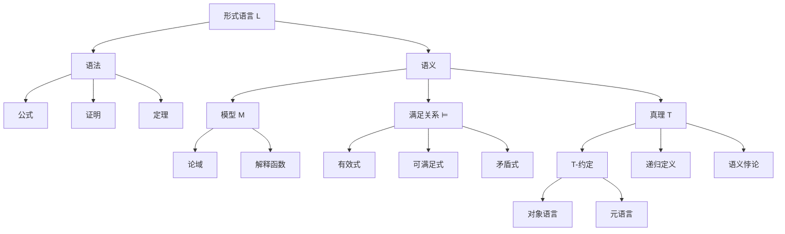
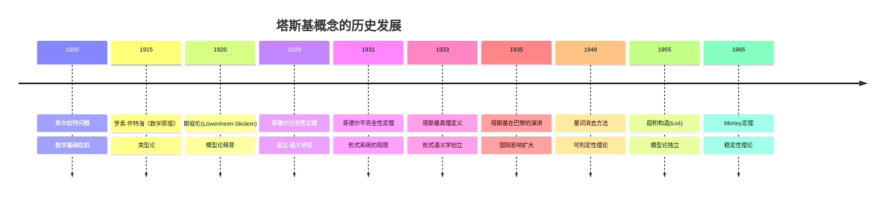

# 概念关联网络

**创建日期**: 2026年4月3日
**研究领域**: 塔斯基数学理念 - 知识关联分析 - 概念关联网络
**主题编号**: T.08.01 (Tarski.知识关联.概念关联网络)
**优先级**: P1（高优先级）⭐⭐⭐⭐

---

## 📋 目录

- [概念关联网络](#概念关联网络)
  - [📋 目录](#目录)
  - [一、核心概念体系](#一核心概念体系)
    - [1.1 塔斯基概念体系总览](#11-塔斯基概念体系总览)
    - [1.2 概念间的逻辑关系](#12-概念间的逻辑关系)
  - [二、塔斯基理论的关联图谱](#二塔斯基理论的关联图谱)
    - [2.1 语义学概念图谱](#21-语义学概念图谱)
    - [2.2 模型论概念图谱](#22-模型论概念图谱)
  - [三、跨学科概念映射](#三跨学科概念映射)
    - [3.1 逻辑-代数映射](#31-逻辑-代数映射)
    - [3.2 逻辑-几何映射](#32-逻辑-几何映射)
  - [四、历史发展脉络](#四历史发展脉络)
    - [4.1 塔斯基概念的历史源流](#41-塔斯基概念的历史源流)
    - [4.2 概念演化的分支图](#42-概念演化的分支图)
  - [五、现代应用关联](#五现代应用关联)
    - [5.1 计算机科学中的概念应用](#51-计算机科学中的概念应用)
    - [5.2 语言学中的概念映射](#52-语言学中的概念映射)
  - [🔖 原始文献引用](#原始文献引用)
  - [📚 现代研究文献](#现代研究文献)

---

## 一、核心概念体系

### 1.1 塔斯基概念体系总览

塔斯基的工作涉及多个层次的概念网络，以下是其核心概念的分层结构：

```
┌─────────────────────────────────────────────────────────────┐
│                     塔斯基概念体系                            │
├─────────────────────────────────────────────────────────────┤
│  第一层：基础概念                                              │
│  ├── 形式语言 (Formal Language)                               │
│  ├── 模型/结构 (Model/Structure)                              │
│  ├── 满足关系 (Satisfaction)                                  │
│  └── 真理 (Truth)                                             │
├─────────────────────────────────────────────────────────────┤
│  第二层：元理论概念                                            │
│  ├── 一致性 (Consistency)                                     │
│  ├── 完备性 (Completeness)                                    │
│  ├── 可判定性 (Decidability)                                  │
│  └── 范畴性 (Categoricity)                                    │
├─────────────────────────────────────────────────────────────┤
│  第三层：方法论概念                                            │
│  ├── 量词消去 (Quantifier Elimination)                        │
│  ├── 代数方法 (Algebraic Methods)                             │
│  └── 模型构造 (Model Construction)                            │
└─────────────────────────────────────────────────────────────┘
```

### 1.2 概念间的逻辑关系

**核心等式与蕴含关系**：

**真理定义的核心等式（T-约定）**：

$$T(\ulcorner \varphi \urcorner) \leftrightarrow \varphi$$

**完全性定理**：

$$\Gamma \vdash \varphi \iff \Gamma \models \varphi$$

**量词消去与可判定性**：

$$\text{量词消去} \Rightarrow \text{可判定性}$$

**紧致性定理**：

$$(\forall \Gamma' \subseteq_{\text{有限}} \Gamma, \Gamma' \text{ 有模型}) \Rightarrow \Gamma \text{ 有模型}$$

---

## 二、塔斯基理论的关联图谱

### 2.1 语义学概念图谱



### 2.2 模型论概念图谱

```mermaid
graph TD
    A[理论 T] --> B[模型类 Mod(T)]
    A --> C[语法后果 ⊢]
    A --> D[语义后果 ⊨]

    B --> B1[子结构]
    B --> B2[扩张]
    B --> B3[同构]
    B --> B4[初等等价]

    B1 --> B1a[初等子结构 ≺]
    B4 --> B4a[初等链]

    C --> C1[公理]
    C --> C2[推理规则]

    D --> D1[完备性定理]
    D --> D2[紧致性定理]
    D --> D3[Löwenheim-Skolem定理]

    D1 --> E[语法与语义的桥梁]
    D2 --> F[非标准模型存在性]
    D3 --> G[基数性质]
```

---

## 三、跨学科概念映射

### 3.1 逻辑-代数映射

塔斯基将逻辑概念与代数结构建立对应关系：

| 逻辑概念 | 代数对应 | 数学结构 |
|---------|---------|---------|
| 命题逻辑 | 布尔代数 | 布尔代数 $\mathcal{B}$ |
| 一阶理论 | 超滤 | 超积构造 |
| 模态逻辑 | 模态代数 | 带算子的布尔代数 |
| 直觉主义逻辑 | 海廷代数 | 拓扑开集格 |

**数学案例：布尔代数与命题逻辑的等价**

**Lindenbaum-Tarski 代数**：
给定命题理论 $T$，定义等价关系：

$$\varphi \sim \psi \iff T \vdash \varphi \leftrightarrow \psi$$

**商代数**：
$L_T = \text{Form}/\sim$ 构成布尔代数，其中：

- $[\varphi] \wedge [\psi] = [\varphi \wedge \psi]$
- $[\varphi] \vee [\psi] = [\varphi \vee \psi]$
- $\neg[\varphi] = [\neg\varphi]$

**Stone表示定理**：
$$L_T \cong \text{Clopen}(S(T))$$

其中 $S(T)$ 是 $T$ 的Stone空间，由所有极大一致集组成。

### 3.2 逻辑-几何映射

**可定义集与代数簇**：

```mermaid
graph LR
    A[一阶公式 φ] --> B[可定义集 Defφ]
    B --> C[半代数集]
    C --> D[代数簇]

    D --> D1[理想 I(V)]
    D --> D2[坐标环 k[V]]

    D1 --> E[Hilbert零点定理]
    D2 --> F[仿射概形]
```

**塔斯基-Seidenberg原理**：
可定义集在多项式映射下的像仍是可定义的（实闭域情形）。

---

## 四、历史发展脉络

### 4.1 塔斯基概念的历史源流



### 4.2 概念演化的分支图

```
塔斯基工作（1930-1960）
├── 语义学分支
│   ├── 形式语义学（逻辑学）
│   ├── 蒙塔古语法（语言学）
│   └── 程序语义学（计算机科学）
│
├── 模型论分支
│   ├── 经典模型论（数学）
│   ├── 稳定性理论（Shelah）
│   ├── o-极小性（Pillay-Steinhorn）
│   └── 连续模型论（Ben-Yaacov）
│
└── 代数方法分支
    ├── 代数逻辑（Henkin-Tarski）
    ├── 抽象代数几何（Grothendieck）
    └── 范畴逻辑（Lawvere）
```

---

## 五、现代应用关联

### 5.1 计算机科学中的概念应用

**程序验证的概念映射**：

| 塔斯基概念 | 程序验证对应 | 形式化表达 |
|-----------|------------|-----------|
| 模型 | 程序状态 | $\sigma \in \Sigma$ |
| 满足 | 状态满足断言 | $\sigma \models P$ |
| 语义后承 | 霍尔逻辑 | $\{P\}C\{Q\}$ |
| 量词消去 | 符号执行 | $\exists x \varphi(x) \mapsto \bigvee_i \varphi(t_i)$ |

**形式化验证案例：
类型系统的塔斯基语义**

**类型即命题**：

$$\tau \text{ 类型} \iff \tau \text{ 是可证明的命题}$$

**Curry-Howard对应**：

| 逻辑 | 类型论 | 计算 |
|-----|-------|-----|
| 命题 | 类型 | 数据类型 |
| 证明 | 项 | 程序 |
| 证明归约 | 项归约 | 程序计算 |

### 5.2 语言学中的概念映射

**蒙塔古语义学的塔斯基基础**：

**基本映射**：

$$\llbracket \cdot \rrbracket: \text{表达式} \to \text{模型中的指称}$$

**组合原则**：

$$\llbracket \alpha \beta \rrbracket = \llbracket \alpha \rrbracket(\llbracket \beta \rrbracket)$$

**量词处理**：

$$\llbracket \text{every boy runs} \rrbracket = \forall x [\text{boy}(x) \to \text{run}(x)]$$

---

## 🔖 原始文献引用

1. **Tarski, A.** (1935). "Der Wahrheitsbegriff in den formalisierten Sprachen". *Studia Philosophica*, 1, 261-405.
   - 塔斯基真理定义的奠基性论文

2. **Tarski, A., & Lindenbaum, A.** (1935). "Über die Beschränktheit der Ausdrucksmittel deduktiver Theorien". *Ergebnisse eines mathematischen Kolloquiums*, 7, 15-22.
   - 与林登鲍姆关于代数方法的合作

3. **Henkin, L., Monk, J. D., & Tarski, A.** (1971, 1985). *Cylindric Algebras, Part I & II*. North-Holland.
   - 圆柱代数理论，塔斯基代数方法的集大成之作

4. **Łoś, J.** (1955). "Quelques remarques, théorèmes et problèmes sur les classes définissables d'algèbres". *Mathematical Interpretation of Formal Systems*, 98-113.
   - 超积定理，连接塔斯基与模型论现代发展

5. **Montague, R.** (1973). "The proper treatment of quantification in ordinary English". In *Approaches to Natural Language*, 221-242.
   - 蒙塔古将塔斯基语义学应用于自然语言

---

## 📚 现代研究文献

1. **Givant, S. R.** (2006). "The algebra of logic". In *Handbook of the History of Logic*, Vol. 4. North-Holland.
   - 逻辑代数的历史发展，包含塔斯基的贡献

2. **Manzano, M.** (1996). "Extensions of First Order Logic". Cambridge University Press.
   - 一阶逻辑的扩展，包括广义量词和塔斯基语义

3. **Hodges, W.** (1993). *Model Theory*. Cambridge University Press.
   - 模型论的权威教材，涵盖塔斯基传统

4. **Chang, C. C., & Keisler, H. J.** (1990). *Model Theory* (3rd ed.). North-Holland.
   - 模型论经典教材，详细阐述塔斯基方法

5. **Väänänen, J.** (2020). *An Invitation to Model Theory*. Cambridge University Press.
   - 当代模型论入门，包含塔斯基概念的现代发展

---

**文档结束**

*本文件是塔斯基数学理念体系的第08模块第01部分，属于知识关联分析主题。*
