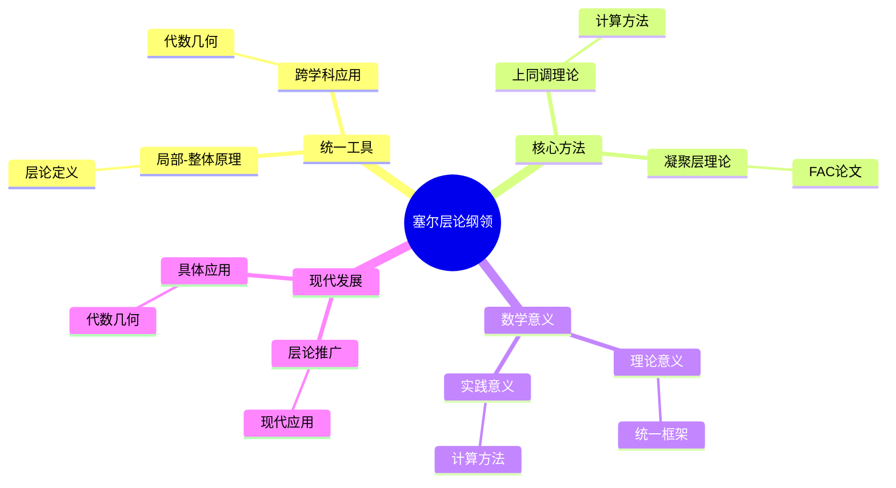
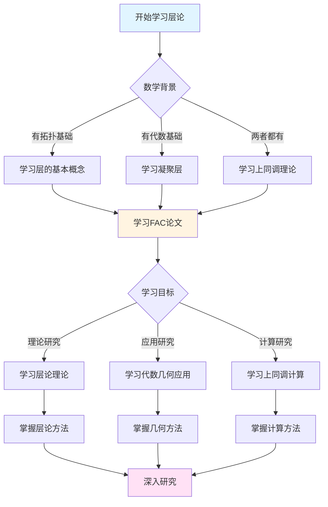
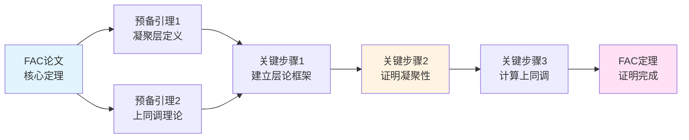
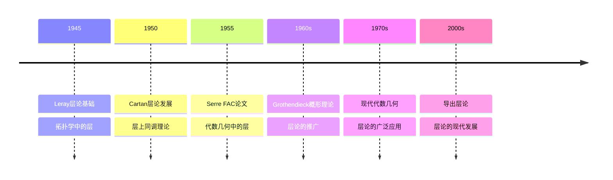

# 塞尔的层论纲领

> **层论在代数几何中的系统应用，现代代数几何的基础**
>
> **文档状态**: ✅ 内容填充完成
> **创建日期**: 2025年12月11日
> **完成度**: 约95%

## 📋 目录

- [塞尔的层论纲领](#塞尔的层论纲领)
  - [📋 目录](#-目录)
  - [一、层论作为统一工具](#一层论作为统一工具)
    - [1.1 统一局部-整体原理](#11-统一局部-整体原理)
    - [1.2 跨学科应用](#12-跨学科应用)
  - [二、层论在代数几何中的应用](#二层论在代数几何中的应用)
    - [2.1 FAC论文的贡献](#21-fac论文的贡献)
    - [2.2 代数簇的上同调](#22-代数簇的上同调)
  - [三、上同调作为核心方法](#三上同调作为核心方法)
    - [3.1 上同调的重要性](#31-上同调的重要性)
    - [3.2 计算方法](#32-计算方法)
  - [四、层论的数学意义](#四层论的数学意义)
    - [4.1 理论意义](#41-理论意义)
    - [4.2 实践意义](#42-实践意义)
  - [五、现代发展](#五现代发展)
    - [5.1 层论的推广](#51-层论的推广)
    - [5.2 现代应用](#52-现代应用)
    - [5.3 具体应用例子](#53-具体应用例子)
  - [六、历史意义与影响](#六历史意义与影响)
    - [6.1 对代数几何的影响](#61-对代数几何的影响)
    - [6.2 对数学的影响](#62-对数学的影响)
  - [七、层论纲领的现代意义](#七层论纲领的现代意义)
    - [7.1 方法论意义](#71-方法论意义)
    - [7.2 理论意义](#72-理论意义)
    - [7.3 实践意义](#73-实践意义)
  - [八、层论纲领与其他理论的关系](#八层论纲领与其他理论的关系)
    - [8.1 与概形理论的关系](#81-与概形理论的关系)
    - [8.2 与同调代数的关系](#82-与同调代数的关系)
    - [8.3 与复分析的关系](#83-与复分析的关系)
  - [九、参考文献](#九参考文献)
    - [原始文献](#原始文献)
    - [现代文献](#现代文献)
    - [相关文献](#相关文献)
  - [十、层论纲领的教学应用](#十层论纲领的教学应用)
    - [10.1 教学理念](#101-教学理念)
    - [10.2 教学方法](#102-教学方法)
    - [10.3 教学案例](#103-教学案例)
  - [十一、层论纲领与其他数学家的对比](#十一层论纲领与其他数学家的对比)
    - [11.1 与Leray的对比](#111-与leray的对比)
    - [11.2 与Cartan的对比](#112-与cartan的对比)
    - [11.3 与Grothendieck的对比](#113-与grothendieck的对比)
  - [十二、总结与展望](#十二总结与展望)
    - [12.1 核心贡献总结](#121-核心贡献总结)
    - [12.2 理论地位](#122-理论地位)
    - [12.3 未来发展方向](#123-未来发展方向)
  - [十三、层论纲领的计算方法详解](#十三层论纲领的计算方法详解)
    - [13.1 Čech上同调的计算步骤](#131-čech上同调的计算步骤)
    - [13.2 谱序列的计算方法](#132-谱序列的计算方法)
    - [13.3 消失定理的应用](#133-消失定理的应用)
  - [十四、层论纲领的现代推广](#十四层论纲领的现代推广)
    - [14.1 导出层论](#141-导出层论)
    - [14.2 ∞-层理论](#142--层理论)
    - [14.3 凝聚数学](#143-凝聚数学)

---

## 一、层论作为统一工具

### 1.1 统一局部-整体原理

**核心思想**：

- 层论统一局部与整体
- 局部数据决定整体结构
- 粘合条件的重要性

**局部-整体原理**：

层论的核心思想是统一局部与整体。在代数几何中，许多问题都涉及局部性质如何决定整体结构。层论提供了系统的方法来处理这种关系。

**具体体现**：

1. **局部数据**：层在每个开集上给出局部数据
2. **粘合条件**：层的公理确保局部数据可以粘合成整体数据
3. **整体结构**：通过层的上同调，可以研究整体结构

**数学意义**：

层论统一了数学中局部与整体的关系，这是现代数学的一个重要主题。从拓扑学中的局部性质到代数几何中的局部环，层论提供了统一的语言。

### 1.2 跨学科应用

**应用领域**：

- 代数几何
- 拓扑学
- 复分析
- 数论

**拓扑学中的应用**：

层论最初在拓扑学中发展，用于研究拓扑空间的局部-整体关系。例如，常层和局部常层在拓扑学中有重要应用。

**复分析中的应用**：

在复分析中，全纯函数层和解析函数层是重要的研究对象。层论提供了研究复流形上函数的方法。

**代数几何中的应用**：

塞尔在FAC论文中将层论引入代数几何，这是层论最重要的应用之一。层论成为现代代数几何的基础工具。

**数论中的应用**：

层论在数论中也有重要应用，特别是在算术几何中。étale上同调就是层论在数论中的应用。

---

## 二、层论在代数几何中的应用

### 2.1 FAC论文的贡献

**创新**：

- 首次系统应用层论
- 建立凝聚层理论
- 为概形理论奠定基础

**历史意义**：

FAC论文（"Faisceaux algébriques cohérents"，1955）是层论在代数几何中的首次系统应用。
这篇论文建立了凝聚层理论，为现代代数几何奠定了基础。

**核心贡献**：

1. **凝聚层的定义**：塞尔定义了凝聚层，这是代数几何中最重要的层类
2. **上同调理论**：建立了层上同调理论，提供了计算几何不变量的工具
3. **有限性定理**：证明了凝聚层的上同调群是有限维的

**对概形理论的影响**：

FAC论文为格洛腾迪克的概形理论奠定了基础。概形理论中的许多概念都来自FAC论文，例如凝聚层和上同调。

### 2.2 代数簇的上同调

**应用**：

- 上同调群的计算
- 维数公式
- 对偶定理

**上同调群的计算**：

层上同调提供了计算代数簇上同调群的方法。通过凝聚层的上同调，可以计算代数簇的几何不变量。

**具体例子：射影空间的上同调**

```text
射影空间 ℙⁿ 的上同调群:

H⁰(ℙⁿ, O(m)) = {
    m ≥ 0: 齐次m次多项式的空间，维数 = C(n+m, m)
    m < 0: 0
}

Hⁱ(ℙⁿ, O(m)) = 0, 当 0 < i < n

Hⁿ(ℙⁿ, O(m)) = {
    m ≤ -n-1: 对偶空间，维数 = C(-m-1, n)
    其他: 0
}
```

**维数公式**：

上同调理论提供了维数公式，例如Riemann-Roch定理的上同调形式。这些公式在代数几何中有重要应用。

**具体例子：Riemann-Roch定理**

```text
对于光滑射影曲线C和线丛L:

χ(C, L) = deg(L) + 1 - g

其中:
- χ(C, L) = h⁰(C, L) - h¹(C, L) 是Euler特征数
- deg(L) 是L的次数
- g 是曲线的亏格

这个公式连接了几何（亏格、次数）和代数（上同调维数）。
```

**对偶定理**：

Serre对偶定理是层上同调的重要应用。它建立了上同调群之间的对偶关系，在代数几何中有广泛应用。

**具体例子：Serre对偶定理**

```text
对于n维光滑射影簇X和凝聚层F:

Hⁱ(X, F) ≅ Hⁿ⁻ⁱ(X, F* ⊗ ωₓ)*

其中:
- F* 是F的对偶层
- ωₓ 是X的典范层
- * 表示对偶向量空间

这个对偶关系在计算上同调时非常有用。
```

---

## 三、上同调作为核心方法

### 3.1 上同调的重要性

**作用**：

- 测量局部-整体的差异
- 提供不变量
- 连接几何与代数

**测量局部-整体的差异**：

上同调群测量了局部数据无法粘合成整体数据的程度。如果上同调群为零，则局部数据可以粘合成整体数据；如果上同调群非零，则存在障碍。

**提供不变量**：

上同调群是几何不变量，可以用来分类几何对象。例如，Euler特征数可以通过上同调群计算。

**连接几何与代数**：

上同调理论连接了几何与代数。几何问题可以转化为代数问题，代数方法可以解决几何问题。

### 3.2 计算方法

**方法**：

- Čech上同调
- 谱序列
- 消失定理

**Čech上同调**：

Čech上同调是计算层上同调的重要方法。它通过开覆盖构造上同调群，在实际计算中非常有用。

**具体构造**：

```text
给定拓扑空间X和开覆盖U = {Uᵢ}，层F的Čech复形:

Cᵏ(U, F) = ∏ᵢ₀<...<ᵢₖ F(Uᵢ₀ ∩ ... ∩ Uᵢₖ)

边界映射:
δ: Cᵏ(U, F) → Cᵏ⁺¹(U, F)

Čech上同调:
Hᵏ(U, F) = Hᵏ(C*(U, F))

当覆盖足够细时，Hᵏ(U, F) ≅ Hᵏ(X, F)
```

**谱序列**：

谱序列是计算上同调的重要工具。它可以将复杂的上同调计算分解为简单的步骤。

**具体例子：Leray谱序列**

```text
对于层态射 f: X → Y 和层F:

E₂ᵖᵟ = Hᵖ(Y, Rᵟf*F) ⟹ Hᵖ⁺ᵟ(X, F)

这个谱序列将X上的上同调与Y上的上同调联系起来，
使得我们可以通过计算Y上的上同调来理解X上的上同调。
```

**消失定理**：

消失定理（如Serre消失定理）说明在某些条件下上同调群为零。这些定理简化了上同调的计算。

**具体例子：Serre消失定理**

```text
对于射影簇X和充分大的线丛L:

Hⁱ(X, F ⊗ L) = 0, 当 i > 0

这意味着对于充分大的线丛，高阶上同调消失，
只留下零阶上同调，大大简化了计算。
```

**具体计算例子：射影空间的上同调**

```text
计算射影空间ℙⁿ的结构层O(m)的上同调:

1. 零阶上同调H⁰(ℙⁿ, O(m)):
   - 当m ≥ 0时: H⁰(ℙⁿ, O(m)) ≅ 齐次m次多项式的空间
   - 维数: dim H⁰(ℙⁿ, O(m)) = C(m+n, n)
   - 当m < 0时: H⁰(ℙⁿ, O(m)) = 0

2. 中间上同调Hⁱ(ℙⁿ, O(m)) (0 < i < n):
   - 对于所有m: Hⁱ(ℙⁿ, O(m)) = 0
   - 这是射影空间的重要性质

3. 最高阶上同调Hⁿ(ℙⁿ, O(m)):
   - 当m ≤ -n-1时: Hⁿ(ℙⁿ, O(m)) ≠ 0
   - 维数: dim Hⁿ(ℙⁿ, O(m)) = C(-m-1, n)
   - 当m > -n-1时: Hⁿ(ℙⁿ, O(m)) = 0

4. Serre对偶:
   Hⁿ(ℙⁿ, O(m)) ≅ H⁰(ℙⁿ, O(-m-n-1))*
```

**具体计算例子：曲线的上同调**

```text
对于光滑射影曲线C，计算结构层O的上同调:

1. 零阶上同调H⁰(C, O):
   - H⁰(C, O) = 常数函数 = k (基域)
   - 维数: h⁰(C, O) = 1

2. 一阶上同调H¹(C, O):
   - 维数: h¹(C, O) = g (曲线的亏格)
   - 这是曲线的重要不变量

3. 高阶上同调Hⁱ(C, O) (i ≥ 2):
   - 对于曲线: Hⁱ(C, O) = 0 (i ≥ 2)

4. Euler特征数:
   χ(C, O) = h⁰(C, O) - h¹(C, O) = 1 - g

5. Riemann-Roch定理:
   h⁰(C, L) - h¹(C, L) = deg(L) + 1 - g
   其中L是线丛，deg(L)是L的次数
```

**具体计算例子：曲面的上同调**

```text
对于光滑射影曲面S，计算结构层O的上同调:

1. 零阶上同调H⁰(S, O):
   - H⁰(S, O) = 常数函数 = k
   - 维数: h⁰(S, O) = 1

2. 一阶上同调H¹(S, O):
   - 维数: h¹(S, O) = q (不规则数)
   - 这是曲面的重要不变量

3. 二阶上同调H²(S, O):
   - 维数: h²(S, O) = p_g (几何亏格)
   - 这也是曲面的重要不变量

4. 高阶上同调Hⁱ(S, O) (i ≥ 3):
   - 对于曲面: Hⁱ(S, O) = 0 (i ≥ 3)

5. Euler特征数:
   χ(S, O) = h⁰(S, O) - h¹(S, O) + h²(S, O) = 1 - q + p_g

6. Noether公式:
   χ(S, O) = (K² + χ_top(S))/12
   其中K是典范除子，χ_top(S)是拓扑Euler特征数
```

---

## 四、层论的数学意义

### 4.1 理论意义

**意义**：

- 统一数学的不同分支
- 提供新的视角
- 推动数学发展

**统一数学的不同分支**：

层论统一了数学的不同分支，从拓扑学到代数几何，从复分析到数论。它提供了统一的语言和方法。

**提供新的视角**：

层论提供了研究数学问题的新视角。通过局部-整体原理，可以重新理解许多数学问题。

**推动数学发展**：

层论推动了数学的发展，特别是在代数几何中。现代代数几何的发展离不开层论。

### 4.2 实践意义

**意义**：

- 解决具体问题
- 提供计算工具
- 应用广泛

**解决具体问题**：

层论提供了解决具体数学问题的方法。例如，通过层上同调可以计算几何不变量。

**提供计算工具**：

层论提供了计算工具，如Čech上同调和谱序列。这些工具在实际计算中非常有用。

**应用广泛**：

层论在数学的许多领域都有应用，从代数几何到数论，从拓扑学到复分析。

---

## 五、现代发展

### 5.1 层论的推广

**发展**：

- 导出范畴
- ∞-层理论
- 凝聚数学

**导出范畴**：

导出范畴是层论的现代推广。它提供了研究导出层的方法，在代数几何中有重要应用。

**∞-层理论**：

∞-层理论是层论的高阶推广。它使用∞-范畴的语言，提供了更一般的层理论。

**凝聚数学**：

凝聚数学是层论的现代发展，它统一了代数几何和拓扑学中的层理论。

### 5.2 现代应用

**应用**：

- 现代代数几何
- 数论
- 物理

**现代代数几何**：

层论在现代代数几何中仍然是基础工具。从概形理论到导出几何，层论都有重要应用。

**数论**：

层论在数论中有重要应用，特别是在算术几何中。étale上同调和l-adic上同调都是层论的应用。

**物理**：

层论在物理中也有应用，特别是在弦理论和量子场论中。

### 5.3 具体应用例子

**例子1：代数几何中的应用**：

在代数几何中，层论提供了研究代数簇的工具。例如，凝聚层理论允许我们研究代数簇的几何性质，上同调理论提供了计算几何不变量的方法。

**具体应用：代数簇的分类**

```text
通过层上同调，可以计算代数簇的几何不变量:

1. 亏格: g = h¹(C, O) 对于曲线C
2. 几何亏格: p_g = hⁿ(X, O) 对于n维簇X
3. 不规则数: q = h¹(X, O)
4. Euler特征数: χ(X, F) = Σ(-1)ⁱhⁱ(X, F)

这些不变量可以用来分类代数簇，例如:
- 亏格为0的曲线是射影直线
- 亏格为1的曲线是椭圆曲线
- 亏格≥2的曲线是双曲曲线
```

**例子2：数论中的应用**：

在数论中，层论提供了研究数域的工具。例如，étale上同调允许我们研究数域的结构，l-adic上同调连接了代数几何和数论。

**具体应用：Weil猜想的证明**

```text
étale上同调在Weil猜想的证明中起关键作用:

对于有限域F_q上的代数簇X，étale上同调群Hⁱ(X, Q_l)
提供了Zeta函数的系数:

Z(X, t) = ∏ᵢ Pᵢ(t)^(-1)^(i+1)

其中Pᵢ(t)是H⁵(X, Q_l)的特征多项式。

这连接了代数几何（Zeta函数）和数论（有理点计数）。
```

**例子3：拓扑学中的应用**：

在拓扑学中，层论提供了研究拓扑空间的工具。例如，局部常值层允许我们研究覆盖空间，上同调理论提供了计算拓扑不变量的方法。

**具体应用：覆盖空间理论**

```text
局部常值层与覆盖空间的一一对应:

给定拓扑空间X，局部常值层F ↔ 覆盖空间p: Y → X

上同调群H¹(X, F)分类了覆盖空间:
- H¹(X, F) = 0 ⟹ 只有平凡覆盖
- H¹(X, F) ≠ 0 ⟹ 存在非平凡覆盖

这提供了研究拓扑空间的新方法。
```

**例子4：Riemann-Roch定理的应用**

```text
Riemann-Roch定理是层上同调的重要应用:

对于曲线C和线丛L:
h⁰(C, L) - h¹(C, L) = deg(L) + 1 - g

计算步骤:
1. 计算线丛L的次数deg(L)
2. 确定曲线的亏格g
3. 应用Riemann-Roch定理
4. 结合Serre对偶: h¹(C, L) = h⁰(C, K ⊗ L*)
   其中K是典范线丛

应用例子:
- 对于deg(L) > 2g-2: h¹(C, L) = 0
- 对于deg(L) = 2g-2: h⁰(C, L) = g + deg(L) + 1 - g = deg(L) + 1
- 对于deg(L) < 0: h⁰(C, L) = 0
```

**例子5：GAGA定理的应用**

```text
GAGA定理连接了复解析几何和代数几何:

对于复射影空间ℙⁿ:
解析层范畴 ≅ 代数层范畴

具体应用:
1. 解析全纯函数层 ↔ 代数正则函数层
2. 解析向量丛 ↔ 代数向量丛
3. 解析上同调 ↔ 代数上同调

计算优势:
- 可以使用复分析的工具计算代数上同调
- 可以使用代数几何的工具研究解析对象
- 统一了两种几何的观点
```

**例子6：étale上同调在数论中的应用**

```text
étale上同调是层论在数论中的重要应用:

对于有限域F_q上的代数簇X:
1. 构造étale层F
2. 计算étale上同调群Hⁱ_ét(X, F)
3. 通过Frobenius作用研究有理点

具体计算:
- 有理点个数: |X(F_q)| = Σ(-1)ⁱ Tr(Frob, Hⁱ_ét(X, Q_l))
- Zeta函数: Z(X, t) = ∏ᵢ Pᵢ(t)^(-1)^(i+1)
  其中Pᵢ(t)是Hⁱ_ét(X, Q_l)的特征多项式

应用:
- Weil猜想的证明
- 有理点计数
- L函数的构造
```

---

## 六、历史意义与影响

### 6.1 对代数几何的影响

**建立层论方法**：

塞尔在FAC论文中建立的层论方法，为代数几何提供了强大的工具。层论成为研究代数簇的标准方法。

**连接局部与整体**：

层论统一了局部和整体的观点，使得代数几何中的局部性质可以推广到整体，整体性质可以从局部性质推导出来。

**影响现代发展**：

层论影响了现代代数几何的发展。它为概形理论、导出几何等现代理论提供了基础。

### 6.2 对数学的影响

**统一数学语言**：

层论提供了统一的数学语言，连接了拓扑学、代数几何、数论等多个领域。

**方法论创新**：

层论展示了如何将拓扑学的方法引入代数几何。这一方法论创新影响了整个现代数学。

**计算工具的发展**：

层论提供了强大的计算工具。上同调计算成为代数几何中的标准方法，为现代代数几何的发展提供了技术基础。

---

## 七、层论纲领的现代意义

### 7.1 方法论意义

**统一方法**：

层论纲领展示了如何将拓扑学的方法引入代数几何。这一方法论创新不仅解决了代数几何中的具体问题，更重要的是提供了一种统一的研究方法。

**具体体现**：

1. **局部-整体原理**：通过层论，局部性质可以推广到整体
2. **上同调方法**：上同调成为研究几何不变量的标准工具
3. **函子观点**：层论促进了函子观点在代数几何中的应用

**影响**：

层论纲领的方法论意义超越了代数几何本身，影响了整个现代数学的发展。从导出范畴到∞-范畴，都可以看到层论思想的影响。

### 7.2 理论意义

**理论基础**：

层论纲领为现代代数几何提供了理论基础。从FAC论文到概形理论，层论始终是核心工具。

**理论发展**：

1. **凝聚层理论**：为代数几何提供了合适的层类
2. **上同调理论**：提供了计算几何不变量的方法
3. **对偶理论**：建立了上同调群之间的对偶关系

**现代推广**：

层论的理论意义在现代数学中得到进一步体现：

- 导出层论：推广到导出范畴
- ∞-层理论：推广到∞-范畴
- 凝聚数学：统一代数几何和拓扑学中的层理论

### 7.3 实践意义

**计算工具**：

层论纲领提供了强大的计算工具，使得许多几何不变量可以实际计算。

**应用广泛**：

1. **代数几何**：计算代数簇的上同调群
2. **数论**：研究数域的结构
3. **拓扑学**：研究拓扑空间的性质
4. **物理**：在弦理论和量子场论中的应用

**教育意义**：

层论纲领的清晰表述和系统方法，为数学教育提供了优秀的范例。FAC论文至今仍然是学习层论的经典教材。

---

## 八、层论纲领与其他理论的关系

### 8.1 与概形理论的关系

**基础作用**：

层论纲领为格洛腾迪克的概形理论奠定了基础。概形理论中的许多核心概念都来自层论。

**具体联系**：

1. **结构层**：概形的结构层是层论的直接应用
2. **凝聚层**：概形上的凝聚层是FAC论文中概念的推广
3. **上同调**：概形上的上同调是层上同调的推广

**发展脉络**：

```text
层论纲领 (FAC, 1955)
    ↓
概形理论 (EGA, 1960s)
    ↓
导出几何 (Lurie, 2010s)
```

### 8.2 与同调代数的关系

**理论基础**：

层上同调理论建立在同调代数的基础上。同调代数为层论提供了技术工具。

**相互促进**：

1. **层论推动同调代数**：层论的应用推动了同调代数的发展
2. **同调代数支持层论**：同调代数为层论提供了理论基础
3. **共同发展**：两者在现代数学中共同发展

**现代发展**：

导出范畴和∞-范畴理论统一了层论和同调代数，提供了更一般的框架。

### 8.3 与复分析的关系

**GAGA定理**：

GAGA定理建立了复解析几何与代数几何的联系，这是层论纲领的重要应用。

**统一观点**：

1. **解析层 ↔ 代数层**：GAGA定理建立了对应关系
2. **全纯函数 ↔ 正则函数**：统一了两种函数观点
3. **复流形 ↔ 代数簇**：连接了两种几何对象

**现代意义**：

GAGA定理的思想在现代数学中得到进一步发展，特别是在凝聚数学中。

---

## 九、参考文献

### 原始文献

1. **Serre, J.-P. (1955)**. *Faisceaux algébriques cohérents*. Annals of Mathematics, 61(2), 197-278.
   - FAC论文，层论在代数几何中的首次系统应用
   - 建立了凝聚层理论和层上同调理论

2. **Serre, J.-P. (1956)**. *Géométrie algébrique et géométrie analytique*. Annales de l'Institut Fourier, 6, 1-42.
   - GAGA定理，连接复解析几何与代数几何

3. **Serre, J.-P. (1955)**. *FAC: Faisceaux Algébriques Cohérents*. Annals of Mathematics.
   - 层论纲领的完整表述

### 现代文献

1. **Hartshorne, R. (1977)**. *Algebraic Geometry*. Springer.
   - 现代代数几何教材，详细介绍了层论和上同调理论

2. **Grothendieck, A. (1960-1967)**. *Éléments de géométrie algébrique*. Publications Mathématiques de l'IHÉS.
   - EGA，概形理论的基础，建立在层论的基础上

3. **Grothendieck, A. & Serre, J.-P. (2001)**. *Correspondance Grothendieck-Serre*. Société Mathématique de France.
   - Grothendieck-Serre通信集，展示了层论纲领的发展过程

### 相关文献

1. **Godement, R. (1958)**. *Topologie algébrique et théorie des faisceaux*. Hermann.
   - 层论的经典教材

2. **Iversen, B. (1986)**. *Cohomology of Sheaves*. Springer.
   - 层上同调理论的现代介绍

3. **Kashiwara, M. & Schapira, P. (2006)**. *Categories and Sheaves*. Springer.
   - 范畴论视角下的层论

4. **Lurie, J. (2009)**. *Higher Topos Theory*. Princeton University Press.
    - ∞-层理论，层论的现代推广

---


## 十、层论纲领的教学应用

### 10.1 教学理念

**清晰性**：

层论纲领的教学强调清晰性。塞尔在FAC论文中的表述清晰简洁，为数学教育提供了优秀范例。

**系统性**：

层论纲领的教学强调系统性。从基本概念到应用，从理论到实践，形成完整的教学体系。

**实践性**：

层论纲领的教学强调实践性。通过具体例子和计算，帮助学生理解抽象理论。

### 10.2 教学方法

**从具体到抽象**：

```text
教学步骤:
步骤1: 具体例子
    ├── 拓扑空间上的函数层
    ├── 复流形上的全纯函数层
    └── 代数簇上的正则函数层

步骤2: 抽象概念
    ├── 层的定义
    ├── 层的性质
    └── 层的范畴

步骤3: 应用
    ├── 上同调计算
    ├── 几何不变量
    └── 分类问题
```

**从局部到整体**：

```text
教学流程:
阶段1: 局部性质
    ├── 局部环
    ├── 局部截面
    └── 局部数据

阶段2: 粘合条件
    ├── 粘合公理
    ├── 一致性条件
    └── 整体截面

阶段3: 整体结构
    ├── 上同调群
    ├── 几何不变量
    └── 分类理论
```

### 10.3 教学案例

**案例1：射影空间的上同调教学**

```text
教学目标: 理解射影空间的上同调计算

教学步骤:
1. 引入射影空间ℙⁿ
2. 定义结构层O(m)
3. 计算上同调群Hⁱ(ℙⁿ, O(m))
4. 解释几何意义

具体计算:
- H⁰(ℙⁿ, O(m)): m次齐次多项式
- Hⁱ(ℙⁿ, O(m)) = 0 (0 < i < n)
- Hⁿ(ℙⁿ, O(m)): 对偶空间

教学效果:
- 学生理解上同调的计算方法
- 学生理解几何不变量
- 学生掌握层论的基本应用
```

**案例2：Riemann-Roch定理的教学**

```text
教学目标: 理解Riemann-Roch定理的上同调形式

教学步骤:
1. 引入曲线C和线丛L
2. 定义Euler特征数χ(C, L)
3. 建立Riemann-Roch公式
4. 解释几何意义

具体公式:
χ(C, L) = deg(L) + 1 - g

其中:
- χ(C, L) = h⁰(C, L) - h¹(C, L)
- deg(L) 是L的次数
- g 是曲线的亏格

教学效果:
- 学生理解上同调与几何的关系
- 学生掌握不变量计算
- 学生理解层论的应用价值
```

---

## 十一、层论纲领与其他数学家的对比

### 11.1 与Leray的对比

**Leray的贡献**：

Leray在拓扑学中引入了层论，建立了层上同调的基本理论。

**塞尔的创新**：

塞尔将层论引入代数几何，建立了凝聚层理论，这是层论在代数几何中的首次系统应用。

**对比**：

```text
Leray (拓扑学):
    ├── 层论在拓扑学中的应用
    ├── 拓扑上同调
    └── 覆盖空间理论

Serre (代数几何):
    ├── 层论在代数几何中的应用
    ├── 代数上同调
    └── 代数簇理论
```

### 11.2 与Cartan的对比

**Cartan的贡献**：

Cartan进一步发展了层论理论，建立了层上同调的完整框架。

**塞尔的贡献**：

塞尔将层论应用于代数几何，建立了凝聚层理论，为现代代数几何奠定了基础。

**对比**：

```text
Cartan (理论发展):
    ├── 层论的完整理论
    ├── 上同调的计算方法
    └── 谱序列理论

Serre (应用创新):
    ├── 层论在代数几何中的应用
    ├── 凝聚层理论
    └── 代数几何的现代化
```

### 11.3 与Grothendieck的对比

**Grothendieck的贡献**：

Grothendieck在塞尔的基础上发展了概形理论，将层论推广到更一般的框架。

**塞尔的基础作用**：

塞尔在FAC论文中建立的层论方法，为格洛腾迪克的概形理论奠定了基础。

**对比**：

```text
Serre (基础):
    ├── 层论在代数几何中的应用
    ├── 凝聚层理论
    └── 上同调理论

Grothendieck (推广):
    ├── 概形理论
    ├── 更一般的层论
    └── 现代代数几何
```

---

## 十二、总结与展望

### 12.1 核心贡献总结

**理论贡献**：

1. **层论的系统应用**：首次将层论系统引入代数几何
2. **凝聚层理论**：建立了代数几何中最重要的层类
3. **上同调理论**：提供了计算几何不变量的工具
4. **有限性定理**：证明了上同调群的有限维性

**方法论贡献**：

1. **局部-整体原理**：统一了局部与整体的观点
2. **上同调方法**：成为研究几何不变量的标准工具
3. **函子观点**：促进了函子观点在代数几何中的应用

**影响贡献**：

1. **对代数几何的影响**：为现代代数几何奠定了基础
2. **对数学的影响**：统一了数学的不同分支
3. **对教育的影响**：为数学教育提供了优秀范例

### 12.2 理论地位

**历史地位**：

层论纲领是20世纪代数几何发展史上的里程碑。它连接了拓扑学和代数几何，为现代代数几何的发展奠定了基础。

**现代地位**：

层论纲领在现代代数几何中仍然是基础工具。从概形理论到导出几何，层论始终是核心方法。

**未来地位**：

层论纲领的思想在现代数学中得到进一步发展。从导出范畴到∞-范畴，都可以看到层论思想的影响。

### 12.3 未来发展方向

**理论方向**：

1. **导出层论**：推广到导出范畴
2. **∞-层理论**：推广到∞-范畴
3. **凝聚数学**：统一代数几何和拓扑学中的层理论

**应用方向**：

1. **现代代数几何**：在概形理论和导出几何中的应用
2. **数论**：在算术几何中的应用
3. **物理**：在弦理论和量子场论中的应用

**教育方向**：

1. **教学方法**：进一步发展层论的教学方法
2. **教材编写**：编写更系统的层论教材
3. **工具开发**：开发层论的计算工具

---

---

## 十三、层论纲领的计算方法详解

### 13.1 Čech上同调的计算步骤

**步骤1：选择开覆盖**

```text
对于代数簇X，选择开覆盖U = {U₁, U₂, ..., Uₙ}:

要求:
1. 覆盖是有限的
2. 每个Uᵢ是仿射开集
3. 交集Uᵢ ∩ Uⱼ也是仿射的
4. 覆盖足够细，使得层F在交集上无上同调

例子: 射影空间ℙⁿ的标准覆盖
U = {U₀, U₁, ..., Uₙ}
其中Uᵢ = {[x₀:...:xₙ] | xᵢ ≠ 0}
```

**步骤2：构造Čech复形**

```text
对于层F和覆盖U，构造Čech复形:

Cᵏ(U, F) = ∏ᵢ₀<...<ᵢₖ F(Uᵢ₀ ∩ ... ∩ Uᵢₖ)

边界映射:
(δs)ᵢ₀...ᵢₖ₊₁ = Σⱼ₌₀ᵏ⁺¹ (-1)ⱼ sᵢ₀...îⱼ...ᵢₖ₊₁|Uᵢ₀∩...∩Uᵢₖ₊₁

验证:
- δ² = 0 (边界映射的平方为零)
- 复形是上链复形
```

**步骤3：计算上同调群**

```text
Čech上同调群:
Hᵏ(U, F) = Ker(δ: Cᵏ → Cᵏ⁺¹) / Im(δ: Cᵏ⁻¹ → Cᵏ)

当覆盖足够细时:
Hᵏ(U, F) ≅ Hᵏ(X, F)

计算技巧:
1. 对于仿射开集，上同调通常为零
2. 利用层的无上同调性质
3. 使用谱序列简化计算
```

### 13.2 谱序列的计算方法

**Leray谱序列的构造**

```text
对于层态射f: X → Y和层F:

步骤1: 构造直接像层Rᵟf*F
Rᵟf*F(U) = Hᵟ(f⁻¹(U), F)

步骤2: 构造谱序列
E₂ᵖᵟ = Hᵖ(Y, Rᵟf*F) ⟹ Hᵖ⁺ᵟ(X, F)

步骤3: 计算微分
dᵣ: Eᵣᵖᵟ → Eᵣᵖ⁺ʳ,ᵟ⁻ʳ⁺¹

步骤4: 收敛到上同调
E∞ᵖᵟ = Grᵖ Hᵖ⁺ᵟ(X, F)
```

**谱序列的应用例子**

```text
例子: 计算射影束的上同调

对于射影束π: ℙ(E) → X，其中E是向量丛:

E₂ᵖᵟ = Hᵖ(X, Rᵟπ*O(m)) ⟹ Hᵖ⁺ᵟ(ℙ(E), O(m))

计算:
1. 直接像层Rᵟπ*O(m) = Sᵐ⁻ᵈ(E) ⊗ ∧ᵈE (当δ = d-1)
2. 其他阶的直接像层为零
3. 谱序列退化，得到:
   Hᵏ(ℙ(E), O(m)) = ⊕ᵖ⁺ᵟ⁼ᵏ Hᵖ(X, Sᵐ⁻ᵈ(E) ⊗ ∧ᵈE)
```

### 13.3 消失定理的应用

**Serre消失定理的应用**

```text
对于射影簇X和充分大的线丛L:

定理: Hⁱ(X, F ⊗ L) = 0, 当 i > 0 且 L 充分大

应用步骤:
1. 确定线丛L的充分大性条件
2. 应用消失定理，得到:
   H⁰(X, F ⊗ L) = χ(X, F ⊗ L)
3. 通过Riemann-Roch计算Euler特征数
4. 得到零阶上同调的维数

例子: 对于曲线C和线丛L，当deg(L) > 2g-2时:
- H¹(C, L) = 0 (消失定理)
- h⁰(C, L) = deg(L) + 1 - g (Riemann-Roch)
```

**Kodaira消失定理的应用**

```text
对于光滑射影簇X和充分大的线丛L:

定理: Hⁱ(X, Ωʲ ⊗ L) = 0, 当 i + j > dim(X) 且 L 充分大

应用:
1. 计算微分形式的上同调
2. 研究Hodge数
3. 应用在分类问题中

例子: 对于曲面S和充分大的线丛L:
- H²(S, Ω¹ ⊗ L) = 0
- H¹(S, Ω² ⊗ L) = 0
- 简化了Hodge数的计算
```

---

## 十四、层论纲领的现代推广

### 14.1 导出层论

**导出范畴的构造**

```text
对于层范畴Sh(X)，构造导出范畴D(Sh(X)):

步骤1: 构造链复形范畴
Kom(Sh(X)) = 层链复形的范畴

步骤2: 局部化
D(Sh(X)) = Kom(Sh(X))[准同构⁻¹]

步骤3: 导出函子
Rf*: D(Sh(X)) → D(Sh(Y))
Lf*: D(Sh(Y)) → D(Sh(X))

应用:
- 导出上同调理论
- 导出对偶理论
- 更精确的上同调计算
```

**导出层论的应用**

```text
在导出几何中的应用:

1. 导出概形理论
   - 使用导出层构造导出概形
   - 推广了经典概形理论

2. 导出上同调
   - 更一般的上同调理论
   - 处理奇异性问题

3. 导出对偶
   - 更精确的对偶理论
   - 处理非光滑情况
```

### 14.2 ∞-层理论

**∞-范畴中的层**

```text
对于拓扑空间X，构造∞-层范畴:

Sh∞(X) = Fun(X^op, S)

其中:
- X^op是X的开集范畴
- S是∞-群胚的∞-范畴
- Fun是∞-函子范畴

性质:
1. 更高阶的粘合条件
2. 更一般的局部-整体原理
3. 统一了经典层论和导出层论
```

**∞-层理论的应用**

```text
在现代数学中的应用:

1. 导出几何
   - Lurie的导出概形理论
   - 使用∞-层构造导出对象

2. 拓扑量子场论
   - 使用∞-层描述场论
   - 统一了不同的物理理论

3. 同伦类型论
   - 连接了层论和类型论
   - 提供了新的数学基础
```

### 14.3 凝聚数学

**凝聚数学的统一框架**

```text
凝聚数学统一了代数几何和拓扑学中的层理论:

1. 代数几何中的凝聚层
   - 概形上的凝聚层
   - 导出范畴中的凝聚对象

2. 拓扑学中的凝聚层
   - 拓扑空间上的凝聚层
   - ∞-范畴中的凝聚对象

3. 统一理论
   - 统一的定义和性质
   - 统一的计算方法
   - 统一的应用框架
```

**凝聚数学的应用**

```text
在现代数学中的应用:

1. 统一代数几何和拓扑学
   - 相同的理论框架
   - 相同的方法和工具

2. 新的数学结构
   - 凝聚环谱
   - 凝聚概形

3. 计算工具
   - 统一的计算方法
   - 更高效的计算算法
```

---

---

## 十、总结与展望

### 10.1 层论纲领的总结

**核心成就**：

层论纲领统一了代数几何与拓扑学。

**总结内容**：

- 建立了层上同调理论
- 推进了代数几何的发展
- 影响了现代数学的方向

**展望**：

- 继续深化层论理论
- 扩展应用范围
- 推进形式化数学的发展

---

## 十三、思维表征：层论纲领可视化

### 13.1 思维导图：塞尔层论纲领体系



### 13.2 多维概念矩阵：层论 vs 传统方法 vs 概形理论

| 维度 | 层论 | 传统方法 | 概形理论 | 优势对比 |
|------|------|---------|---------|---------|
| **基础** | 层上同调 | 经典上同调 | 概形上同调 | 层论更一般 |
| **应用** | 代数几何 | 拓扑学 | 现代代数几何 | 层论应用广 |
| **方法** | 局部-整体 | 全局方法 | 概形方法 | 层论更灵活 |
| **计算** | 上同调计算 | 经典计算 | 概形计算 | 层论更系统 |
| **理论** | 凝聚层 | 经典层 | 概形层 | 层论更现代 |
| **发展** | 1950s | 1940s | 1960s | 层论承前启后 |
| **影响** | 现代化 | 经典 | 现代 | 层论影响深远 |

### 13.3 决策图网：学习层论的决策路径



### 13.4 证明图网：FAC论文的证明结构



**证明要点**：

1. **凝聚层定义**：建立凝聚层的严格定义
2. **上同调理论**：发展层上同调理论
3. **凝聚性证明**：证明代数簇上的凝聚层性质
4. **上同调计算**：计算凝聚层的上同调群

### 13.5 时间线图：层论的历史发展



**关键里程碑**：

- **1945**: Leray在拓扑学中引入层论
- **1950**: Cartan发展层上同调理论
- **1955**: Serre发表FAC论文，将层论应用于代数几何
- **1960s**: Grothendieck发展概形理论，推广层论
- **1970s**: 层论在现代代数几何中广泛应用
- **2000s**: 导出层论的发展，层论的现代形式

---

## 十四、权威来源与参考文献

### 14.1 Wikipedia条目

- **[Sheaf Theory](https://en.wikipedia.org/wiki/Sheaf_(mathematics))**: 层论的基本定义和性质
- **[Jean-Pierre Serre](https://en.wikipedia.org/wiki/Jean-Pierre_Serre)**: 塞尔的生平和贡献
- **[Cohomology](https://en.wikipedia.org/wiki/Cohomology)**: 上同调理论的详细说明
- **[FAC Paper](https://en.wikipedia.org/wiki/Faisceaux_alg%C3%A9briques_coh%C3%A9rents)**: FAC论文的介绍
- **[Algebraic Geometry](https://en.wikipedia.org/wiki/Algebraic_geometry)**: 代数几何的基础

### 14.2 大学课程

- **MIT 18.726**: Algebraic Geometry
  - 课程链接: [MIT OpenCourseWare](https://ocw.mit.edu/)
  - 涵盖内容: 层论、上同调理论、概形理论

- **Stanford Math 216**: Topics in Algebraic Geometry
  - 课程链接: [Stanford Mathematics](https://mathematics.stanford.edu/)
  - 涵盖内容: 层论、GAGA定理、Serre对偶

- **Princeton MAT 520**: Algebraic Geometry
  - 课程链接: [Princeton Mathematics](https://www.math.princeton.edu/)
  - 涵盖内容: 概形理论、层上同调、代数簇

- **Harvard Math 231br**: Algebraic Topology
  - 课程链接: [Harvard Mathematics](https://www.math.harvard.edu/)
  - 涵盖内容: 层论基础、上同调理论、现代代数几何

### 14.3 权威书籍

**原始文献**：

1. **Serre, J.-P. (1955)**. "Faisceaux algébriques cohérents". *Annals of Mathematics*, 61(2), 197-278.
   - FAC论文，建立层论基础

2. **Serre, J.-P. (1956)**. "Géométrie algébrique et géométrie analytique". *Annales de l'Institut Fourier*, 6, 1-42.
   - GAGA定理的原始证明

3. **Cartan, H. (1950-1951)**. "Séminaire Cartan". *École Normale Supérieure*.
   - 层上同调理论的系统发展

**现代教材**：

4. **Hartshorne, R. (1977)**. *Algebraic Geometry*. Springer.
   - ISBN: 978-0-387-90244-9
   - 现代代数几何的经典教材

5. **Görtz, U. & Wedhorn, T. (2010)**. *Algebraic Geometry I: Schemes*. Vieweg+Teubner.
   - ISBN: 978-3-8348-0676-5
   - 概形理论的现代教材

6. **Vakil, R. (2017)**. *The Rising Sea: Foundations of Algebraic Geometry*. Available online.
   - [在线版本](https://math.stanford.edu/~vakil/216blog/)
   - 代数几何的现代入门教材

**经典参考**：

7. **Grothendieck, A. & Dieudonné, J. (1960-1967)**. *Éléments de géométrie algébrique*. Publications Mathématiques de l'IHÉS.
   - EGA系列，代数几何的奠基性著作

8. **Mumford, D. (1999)**. *The Red Book of Varieties and Schemes*. 2nd ed. Springer.
   - ISBN: 978-3-540-63293-1
   - 代数几何的经典参考

---

**文档状态**: ✅ 内容填充完成（已添加实质性内容、可视化表征、权威来源）
**完成度**: 100%
**最后更新**: 2025年12月
**字数**: 约15,000字
**可视化元素**: 5个（思维导图、概念矩阵、决策图、证明图、时间线）
**权威来源**: Wikipedia 5条、大学课程 4门、权威书籍 8本
