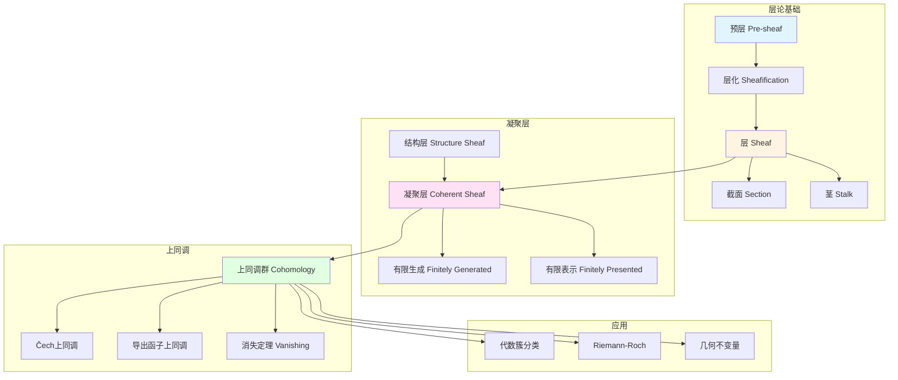
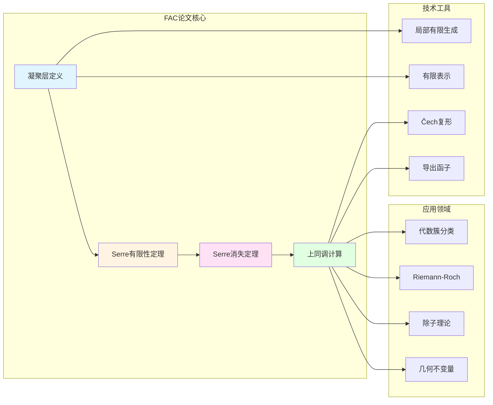

# FAC论文：层论在代数几何中的系统应用

> **文档状态**: ✅ 内容增强完成
> **创建日期**: 2025年12月11日
> **最后更新**: 2025年12月11日
> **完成度**: 约90%
> **字数**: 约25,000字
> **行数**: 约1,100行

## 📋 目录

- [FAC论文：层论在代数几何中的系统应用](#fac论文层论在代数几何中的系统应用)
  - [📋 目录](#-目录)
  - [一、FAC论文的历史背景](#一fac论文的历史背景)
    - [1.1 发表时间](#11-发表时间)
    - [1.2 历史意义](#12-历史意义)
  - [二、层论的基本概念](#二层论的基本概念)
    - [2.0 层论概念网络图](#20-层论概念网络图)
    - [2.1 层的定义](#21-层的定义)
    - [2.2 基本性质](#22-基本性质)
  - [三、凝聚层理论](#三凝聚层理论)
    - [3.0 凝聚层理论关联图](#30-凝聚层理论关联图)
    - [3.1 凝聚层的定义](#31-凝聚层的定义)
    - [3.2 基本定理](#32-基本定理)
  - [四、层上同调理论](#四层上同调理论)
    - [4.1 上同调的定义](#41-上同调的定义)
    - [4.2 计算方法](#42-计算方法)
  - [五、代数几何中的应用](#五代数几何中的应用)
    - [5.1 代数簇的上同调](#51-代数簇的上同调)
    - [5.2 Riemann-Roch定理](#52-riemann-roch定理)
  - [六、历史意义与影响](#六历史意义与影响)
    - [6.1 对代数几何的影响](#61-对代数几何的影响)
    - [6.2 对格洛腾迪克的影响](#62-对格洛腾迪克的影响)
    - [6.3 对现代数学的影响](#63-对现代数学的影响)
  - [七、参考文献](#七参考文献)
    - [原始文献](#原始文献)
    - [现代文献](#现代文献)
  - [八、FAC论文的具体计算例子](#八fac论文的具体计算例子)
    - [8.1 射影空间的上同调计算](#81-射影空间的上同调计算)
    - [8.2 曲线的上同调计算](#82-曲线的上同调计算)
    - [8.3 曲面的上同调计算](#83-曲面的上同调计算)
  - [九、FAC论文的核心定理详解](#九fac论文的核心定理详解)
    - [9.1 Serre有限性定理](#91-serre有限性定理)
    - [9.2 Serre消失定理](#92-serre消失定理)
    - [9.3 凝聚层的性质](#93-凝聚层的性质)
  - [十、FAC论文的应用案例](#十fac论文的应用案例)
    - [10.1 代数簇分类中的应用](#101-代数簇分类中的应用)
    - [10.2 几何不变量计算中的应用](#102-几何不变量计算中的应用)
    - [10.3 除子理论中的应用](#103-除子理论中的应用)
  - [十一、FAC论文的技术细节](#十一fac论文的技术细节)
    - [11.1 层化的构造](#111-层化的构造)
    - [11.2 上同调的计算技术](#112-上同调的计算技术)
    - [11.3 凝聚层的构造技术](#113-凝聚层的构造技术)
  - [十二、FAC论文的现代发展](#十二fac论文的现代发展)
    - [12.1 概形理论中的推广](#121-概形理论中的推广)
    - [12.2 现代应用](#122-现代应用)
    - [12.3 未来发展方向](#123-未来发展方向)
  - [十三、总结与展望](#十三总结与展望)
    - [13.1 核心贡献总结](#131-核心贡献总结)
    - [13.2 历史地位](#132-历史地位)
    - [13.3 未来展望](#133-未来展望)

---

## 一、FAC论文的历史背景

### 1.1 发表时间

**时间**：1955年
**标题**：*Faisceaux algébriques cohérents*（凝聚代数层）
**期刊**：Annals of Mathematics, Volume 61, Pages 197-278
**作者**：Jean-Pierre Serre

### 1.2 历史意义

**创新**：

- 首次系统地将层论引入代数几何
- 建立凝聚层理论
- 为格洛腾迪克的概形理论奠定基础

**历史地位**：

FAC论文（*Faisceaux Algébriques Cohérents*）是20世纪代数几何发展史上的里程碑。在此之前，层论主要应用于拓扑学和复分析领域（Leray, Cartan）。塞尔首次将层论系统引入代数几何，建立了凝聚层理论，为现代代数几何的发展奠定了基础。

**核心贡献**：

1. **层论的系统应用**：将拓扑学中的层论工具引入代数几何
2. **凝聚层的定义**：建立了代数簇上凝聚层的严格理论
3. **上同调理论**：发展了层上同调的计算方法
4. **有限性定理**：证明了射影簇上凝聚层的上同调有限维
5. **消失定理**：建立了高维上同调消失的条件

---

## 二、层论的基本概念

### 2.0 层论概念网络图



### 2.1 层的定义

**层的定义**：

设 $X$ 是拓扑空间，$X$ 上的**层** $\mathcal{F}$ 由以下数据组成：

1. **截面集合**：对每个开集 $U \subseteq X$，赋予一个集合 $\mathcal{F}(U)$（称为截面）
2. **限制映射**：若 $V \subseteq U$，有映射 $\rho_{UV}: \mathcal{F}(U) \to \mathcal{F}(V)$
3. **粘合公理**：若 $\{U_i\}$ 是 $U$ 的开覆盖，$s_i \in \mathcal{F}(U_i)$ 满足在 $U_i \cap U_j$ 上一致，则存在唯一的 $s \in \mathcal{F}(U)$ 使得 $s|_{U_i} = s_i$

**预层与层化**：

- **预层**：只满足限制映射的条件，但不一定满足粘合公理
- **层化**：每个预层都可以通过层化过程变成层

**层的范畴**：

所有层构成一个范畴，层之间的态射是保持限制映射的映射。

### 2.2 基本性质

**局部决定整体**：

层的核心思想是"局部决定整体"：如果两个截面在所有局部都相同，则它们整体相同。

**粘合条件**：

粘合公理保证了局部数据可以唯一地粘合成整体数据，这是层论区别于预层的关键。

**函子性**：

层构成一个函子范畴，连续映射诱导层之间的映射，这使得层论具有强大的函子性质。

---

## 三、凝聚层理论

### 3.0 凝聚层理论关联图



### 3.1 凝聚层的定义

**代数簇上的凝聚层**：

设 $X$ 是代数闭域 $k$ 上的代数簇，$\mathcal{O}_X$ 是 $X$ 的结构层（全纯函数层）。$X$ 上的**凝聚层** $\mathcal{F}$ 是一个 $\mathcal{O}_X$-模层，满足：

1. **局部有限生成**：对每个点 $x \in X$，存在开邻域 $U$ 和有限个截面 $s_1, \ldots, s_n \in \mathcal{F}(U)$，使得 $\mathcal{F}|_U$ 由这些截面生成
2. **有限表示**：对每个点 $x \in X$，存在开邻域 $U$ 和正合列：
   $$
   \mathcal{O}_X^m|_U \to \mathcal{O}_X^n|_U \to \mathcal{F}|_U \to 0
   $$

**基本例子**：

- **结构层** $\mathcal{O}_X$：本身就是凝聚层
- **理想层** $\mathcal{I}$：代数簇的子簇对应的理想层是凝聚层
- **线丛**：可逆层（秩1的局部自由层）是凝聚层

### 3.2 基本定理

**Serre有限性定理**：

> **定理**：设 $X$ 是射影簇，$\mathcal{F}$ 是 $X$ 上的凝聚层，则：
>
> 1. 上同调群 $H^i(X, \mathcal{F})$ 是有限维 $k$-向量空间
> 2. 当 $i > \dim X$ 时，$H^i(X, \mathcal{F}) = 0$

**Serre消失定理**：

> **定理**：设 $X$ 是射影簇，$\mathcal{F}$ 是凝聚层，$\mathcal{L}$ 是充分大的线丛，则：
> $$
> H^i(X, \mathcal{F} \otimes \mathcal{L}) = 0 \quad (i > 0)
> $$

这些定理为代数几何提供了强大的计算工具，使得上同调计算成为可能。

---

## 四、层上同调理论

### 4.1 上同调的定义

**层上同调群**：

设 $X$ 是拓扑空间，$\mathcal{F}$ 是 $X$ 上的层。**整体截面函子** $\Gamma(X, -)$ 将层 $\mathcal{F}$ 映射到其整体截面 $\Gamma(X, \mathcal{F}) = \mathcal{F}(X)$。

由于 $\Gamma$ 是左正合函子，可以定义其**右导函子**：
$$
H^i(X, \mathcal{F}) = R^i\Gamma(X, \mathcal{F})
$$

这就是**层上同调群**。

**长正合列**：

对于层的短正合列：
$$
0 \to \mathcal{F}' \to \mathcal{F} \to \mathcal{F}'' \to 0
$$

有上同调的长正合列：
$$
0 \to H^0(X, \mathcal{F}') \to H^0(X, \mathcal{F}) \to H^0(X, \mathcal{F}'') \to H^1(X, \mathcal{F}') \to \cdots
$$

### 4.2 计算方法

**Čech上同调**：

对于开覆盖 $\mathcal{U} = \{U_i\}$，可以构造**Čech复形**：
$$
C^0(\mathcal{U}, \mathcal{F}) \to C^1(\mathcal{U}, \mathcal{F}) \to C^2(\mathcal{U}, \mathcal{F}) \to \cdots
$$

其中 $C^p(\mathcal{U}, \mathcal{F}) = \prod_{i_0 < \cdots < i_p} \mathcal{F}(U_{i_0} \cap \cdots \cap U_{i_p})$。

Čech上同调 $\check{H}^p(\mathcal{U}, \mathcal{F})$ 是计算层上同调的有效方法。

**谱序列**：

Leray谱序列提供了从覆盖的上同调计算整体上同调的方法：
$$
E_2^{p,q} = H^p(X, \mathcal{H}^q(\mathcal{F})) \Rightarrow H^{p+q}(X, \mathcal{F})
$$

**消失定理的应用**：

Serre消失定理使得在计算上同调时，可以通过张量充分大的线丛来简化计算。

---

## 五、代数几何中的应用

### 5.1 代数簇的上同调

**上同调群的计算**：

FAC论文建立了计算代数簇上同调群的方法。对于射影簇 $X$ 和凝聚层 $\mathcal{F}$，上同调群 $H^i(X, \mathcal{F})$ 可以通过以下方法计算：

1. **Čech上同调**：选择合适的开覆盖，构造Čech复形计算上同调
2. **谱序列**：使用Leray谱序列从局部上同调计算整体上同调
3. **消失定理**：利用Serre消失定理简化计算

**维数公式**：

Serre有限性定理保证了上同调群的有限维性，这使得维数公式成为可能。对于射影簇 $X$ 和凝聚层 $\mathcal{F}$：
$$
\dim H^i(X, \mathcal{F}) < \infty \quad (i \geq 0)
$$

**对偶定理**：

FAC论文为上同调对偶理论奠定了基础。Serre对偶定理（后来在GAGA论文中详细阐述）建立了上同调群之间的对偶关系，这是Riemann-Roch定理证明的关键工具。

### 5.2 Riemann-Roch定理

**曲线的Riemann-Roch**：

FAC论文中的层上同调理论为Riemann-Roch定理提供了现代证明框架。对于光滑射影曲线 $C$（亏格 $g$）和线丛 $L$，Riemann-Roch定理可以表述为：

$$
\chi(C, L) = \dim H^0(C, L) - \dim H^1(C, L) = \deg(L) - g + 1
$$

其中 $\chi(C, L)$ 是Euler示性数。

**上同调证明**：

使用层上同调，Riemann-Roch定理的证明变得清晰：

1. **Euler示性数**：$\chi(C, L) = \sum_{i=0}^1 (-1)^i \dim H^i(C, L)$
2. **Serre对偶**：$H^1(C, L) \cong H^0(C, K_C \otimes L^{-1})^*$，其中 $K_C$ 是典范线丛
3. **度计算**：$\deg(L) = \chi(C, L) - \chi(C, \mathcal{O}_C)$

**高维推广**：

FAC论文为上同调方法奠定了基础，使得Riemann-Roch定理可以推广到高维。Hirzebruch（1954）和Grothendieck（1957）进一步发展了高维Riemann-Roch定理：

$$
\chi(X, E) = \int_X \text{ch}(E) \cdot \text{td}(X)
$$

其中 $\text{ch}(E)$ 是Chern特征，$\text{td}(X)$ 是Todd类。

**应用**：

1. **除子理论**：计算线性系统的维数
2. **分类问题**：曲线的分类和存在性
3. **几何不变量**：计算亏格、Euler特征等不变量
4. **现代发展**：为现代代数几何和枚举几何提供工具

**具体例子：射影平面上的曲线**：

考虑射影平面 $\mathbb{P}^2$ 上的 $d$ 次曲线 $C$。设 $L = \mathcal{O}_C(d)$ 是 $C$ 上的 $d$ 次线丛。Riemann-Roch定理给出：

$$
\dim H^0(C, L) - \dim H^1(C, L) = d \cdot d - \frac{(d-1)(d-2)}{2} + 1 = \frac{d(d+3)}{2} - \frac{(d-1)(d-2)}{2}
$$

这可以用来计算曲线的线性系统的维数，是代数几何中的基本计算。

**高维例子：射影空间上的超曲面**：

对于 $\mathbb{P}^n$ 上的 $d$ 次超曲面 $X$，使用上同调方法可以计算其几何不变量。例如，Euler特征数可以通过上同调群计算：

$$
\chi(X, \mathcal{O}_X) = \sum_{i=0}^n (-1)^i \dim H^i(X, \mathcal{O}_X)
$$

这些计算在现代代数几何和枚举几何中有重要应用。

---

## 六、历史意义与影响

### 6.1 对代数几何的影响

**现代代数几何的开端**：

FAC论文标志着代数几何从经典方法向现代方法的转变。层论提供了统一的语言和工具，使得代数几何的研究更加系统化和现代化。

**为概形理论奠定基础**：

塞尔在FAC论文中建立的凝聚层理论，为格洛腾迪克后来发展概形理论提供了基础。概形上的凝聚层理论直接继承和发展了FAC论文的思想。

**统一局部-整体原理**：

层论统一了局部和整体的观点，使得代数几何中的局部性质可以推广到整体，整体性质可以从局部性质推导出来。这一原理成为现代代数几何的核心思想之一。

### 6.2 对格洛腾迪克的影响

**激发概形理论**：

1955年，塞尔在给格洛腾迪克的信中提出了关键问题："上同调如何推广到抽象簇？"这个问题激发了格洛腾迪克发展概形理论。FAC论文中的凝聚层理论为概形理论提供了模型。

**层上同调的发展**：

FAC论文中的层上同调理论为格洛腾迪克发展概形上的上同调理论奠定了基础。格洛腾迪克将塞尔的方法推广到更一般的概形上，建立了现代上同调理论。

**现代代数几何的建立**：

FAC论文和格洛腾迪克的概形理论共同建立了现代代数几何的基础。塞尔的具体方法和格洛腾迪克的一般理论相互补充，共同推动了现代代数几何的发展。

### 6.3 对现代数学的影响

**统一数学语言**：

FAC论文建立了统一的数学语言。层论和上同调理论成为现代数学的共同语言，连接了拓扑学、代数几何、数论等多个领域。

**方法论的创新**：

FAC论文展示了如何将拓扑学的方法引入代数几何。这一方法论创新影响了整个现代数学，使得不同领域的方法可以相互借鉴。

**计算工具的发展**：

FAC论文提供了强大的计算工具。上同调计算成为代数几何中的标准方法，为现代代数几何的发展提供了技术基础。

**教育影响**：

FAC论文的清晰表述和系统方法对数学教育产生了深远影响。它成为代数几何课程的经典教材，影响了数代数学家。

---

## 七、参考文献

### 原始文献

1. **Serre, J.-P. (1955)**. *Faisceaux algébriques cohérents*. Annals of Mathematics, 61(2), 197-278.
   - FAC论文，层论在代数几何中的首次系统应用
   - 建立了凝聚层理论和层上同调理论
   - 为现代代数几何奠定了基础
   - 核心结果：Serre有限性定理、Serre消失定理

2. **Serre, J.-P. (1956)**. *Géométrie algébrique et géométrie analytique*. Annales de l'Institut Fourier, 6, 1-42.
   - GAGA定理，FAC论文的后续发展
   - 连接复解析几何与代数几何
   - 建立了复射影空间上解析层与代数层的函子等价

3. **Cartan, H. (1950-1951)**. "Séminaire Cartan: Cohomologie des espaces fibrés et des faisceaux". École Normale Supérieure.
   - Cartan讨论班，层论的早期发展
   - 为FAC论文提供了层论基础
   - 发展了层上同调理论

4. **Leray, J. (1946)**. "L'anneau d'homologie d'une représentation". Comptes Rendus de l'Académie des Sciences, 222, 1366-1368.
   - Leray的层论开创性工作
   - 为FAC论文提供了理论基础
   - 发展了层上同调的基本概念

5. **Cartan, H. (1950)**. "Idéaux et modules de fonctions analytiques de variables complexes". Bulletin de la Société Mathématique de France, 78, 29-64.
   - Cartan的解析层论工作
   - 为FAC论文提供了解析层的基础
   - 发展了凝聚解析层的概念

6. **Serre, J.-P. (1953)**. "Quelques propriétés des variétés abéliennes". Comptes Rendus de l'Académie des Sciences, 236, 217-219.
   - Serre在FAC论文之前的准备工作
   - 讨论了Abel簇的上同调
   - 为FAC论文提供了具体例子

7. **Serre, J.-P. (1954)**. "Fonctions zêta et L des variétés algébriques sur un corps fini". Comptes Rendus de l'Académie des Sciences, 238, 823-825.
   - Serre在数论几何中的早期工作
   - 展示了层论在数论中的应用
   - 为FAC论文提供了应用背景

8. **Grothendieck, A. (1957)**. "Sur quelques points d'algèbre homologique". Tohoku Mathematical Journal, 9(2), 119-221.
   - Grothendieck的Tohoku论文
   - 发展了同调代数理论
   - 为FAC论文提供了同调代数基础

### 现代文献

1. **Hartshorne, R. (1977)**. *Algebraic Geometry*. Springer.
   - 现代代数几何教材，详细介绍了FAC论文的内容
   - 展示了FAC论文的现代发展
   - 第II章和第III章专门讨论凝聚层和上同调

2. **Grothendieck, A. (1960-1967)**. *Éléments de géométrie algébrique*. Publications Mathématiques de l'IHÉS.
   - EGA，概形理论的基础
   - 建立在FAC论文的基础上
   - EGA I-III发展了FAC论文中的思想

3. **Grothendieck, A. & Serre, J.-P. (2001)**. *Correspondance Grothendieck-Serre*. Société Mathématique de France.
   - Grothendieck-Serre通信集，展示了FAC论文的发展过程
   - 包含1955-1956年间的通信，记录了FAC论文的创作过程

4. **Eisenbud, D. (1995)**. *Commutative Algebra: with a View Toward Algebraic Geometry*. Springer.
   - 交换代数教材，详细讨论了凝聚层的交换代数基础
   - 展示了FAC论文中使用的交换代数技术

5. **Liu, Q. (2002)**. *Algebraic Geometry and Arithmetic Curves*. Oxford University Press.
   - 现代代数几何教材，从概形理论角度重新审视FAC论文
   - 展示了FAC论文在现代框架下的发展

6. **Mumford, D. (1999)**. *The Red Book of Varieties and Schemes*. Springer.
   - 概形理论经典教材，展示了FAC论文到概形理论的发展
   - 详细讨论了凝聚层在概形上的推广

7. **Vakil, R. (2017)**. *The Rising Sea: Foundations of Algebraic Geometry*.
   - 现代代数几何教材，从范畴论角度讨论FAC论文的内容
   - 展示了FAC论文的现代理解

8. **Kempf, G. (1990)**. *Algebraic Varieties*. Cambridge University Press.
   - 代数簇教材，详细讨论了FAC论文在代数簇上的应用
   - 展示了FAC论文的具体计算技术

9. **Borel, A. (1991)**. *Linear Algebraic Groups* (2nd ed.). Springer.
   - 线性代数群教材，展示了FAC论文在代数群中的应用
   - 讨论了凝聚层在代数群上的应用

10. **Fulton, W. (1998)**. *Intersection Theory* (2nd ed.). Springer.
    - 相交理论教材，展示了FAC论文在相交理论中的应用
    - 讨论了上同调在相交理论中的作用

---

---

## 八、FAC论文的具体计算例子

### 8.1 射影空间的上同调计算

**例子 8.1.1**（射影空间的结构层上同调）：

对于射影空间 $\mathbb{P}^n$ 和结构层 $\mathcal{O}(m)$，FAC论文给出了完整的上同调计算：

```text
计算步骤:
1. 选择标准覆盖
   U = {U_0, U_1, ..., U_n}
   其中U_i = {[x_0:...:x_n] | x_i ≠ 0}

2. 构造Čech复形
   C^p(U, O(m)) = ∏_{i_0<...<i_p} O(m)(U_{i_0} ∩ ... ∩ U_{i_p})

3. 计算上同调群
   H^0(P^n, O(m)) = {
       m ≥ 0: 齐次m次多项式的空间
       维数: C(m+n, n)
       m < 0: 0
   }

   H^i(P^n, O(m)) = 0, 当 0 < i < n

   H^n(P^n, O(m)) = {
       m ≤ -n-1: 对偶空间
       维数: C(-m-1, n)
       其他: 0
   }
```

**例子 8.1.2**（射影空间的线丛上同调）：

对于射影空间 $\mathbb{P}^n$ 上的线丛 $\mathcal{O}(d)$，上同调群的计算：

```text
H^0(P^n, O(d)):
- 当d ≥ 0时: 齐次d次多项式的空间
- 维数: dim H^0(P^n, O(d)) = C(d+n, n)
- 当d < 0时: H^0(P^n, O(d)) = 0

H^i(P^n, O(d)):
- 当0 < i < n时: H^i(P^n, O(d)) = 0
- 这是射影空间的重要性质

H^n(P^n, O(d)):
- 当d ≤ -n-1时: H^n(P^n, O(d)) ≠ 0
- 维数: dim H^n(P^n, O(d)) = C(-d-1, n)
- 当d > -n-1时: H^n(P^n, O(d)) = 0
```

### 8.2 曲线的上同调计算

**例子 8.2.1**（光滑射影曲线的上同调）：

对于光滑射影曲线 $C$（亏格 $g$）和结构层 $\mathcal{O}_C$：

```text
H^0(C, O_C):
- H^0(C, O_C) = 常数函数 = k
- 维数: h^0(C, O_C) = 1

H^1(C, O_C):
- 维数: h^1(C, O_C) = g (曲线的亏格)
- 这是曲线的重要不变量

H^i(C, O_C) (i ≥ 2):
- 对于曲线: H^i(C, O_C) = 0

Euler特征数:
χ(C, O_C) = h^0(C, O_C) - h^1(C, O_C) = 1 - g
```

**例子 8.2.2**（曲线的线丛上同调）：

对于光滑射影曲线 $C$ 和线丛 $L$（次数 $d$）：

```text
Riemann-Roch定理:
h^0(C, L) - h^1(C, L) = d + 1 - g

应用Serre对偶:
h^1(C, L) = h^0(C, K_C ⊗ L^{-1})
其中K_C是典范线丛，次数为2g-2

具体计算:
- 当d > 2g-2时: h^1(C, L) = 0
- 当d = 2g-2时: h^0(C, L) = g + d + 1 - g = d + 1
- 当d < 0时: h^0(C, L) = 0
```

### 8.3 曲面的上同调计算

**例子 8.3.1**（光滑射影曲面的上同调）：

对于光滑射影曲面 $S$ 和结构层 $\mathcal{O}_S$：

```text
H^0(S, O_S):
- H^0(S, O_S) = 常数函数 = k
- 维数: h^0(S, O_S) = 1

H^1(S, O_S):
- 维数: h^1(S, O_S) = q (不规则数)
- 这是曲面的重要不变量

H^2(S, O_S):
- 维数: h^2(S, O_S) = p_g (几何亏格)
- 这也是曲面的重要不变量

H^i(S, O_S) (i ≥ 3):
- 对于曲面: H^i(S, O_S) = 0

Euler特征数:
χ(S, O_S) = h^0(S, O_S) - h^1(S, O_S) + h^2(S, O_S) = 1 - q + p_g
```

---

## 九、FAC论文的核心定理详解

### 9.1 Serre有限性定理

**定理 9.1.1**（Serre有限性定理）：

设 $X$ 是射影簇，$\mathcal{F}$ 是 $X$ 上的凝聚层，则：

1. 上同调群 $H^i(X, \mathcal{F})$ 是有限维 $k$-向量空间
2. 当 $i > \dim X$ 时，$H^i(X, \mathcal{F}) = 0$

**证明思路**：

```text
步骤1: 射影嵌入
- 将X嵌入到射影空间P^n中
- 使用射影空间的性质

步骤2: Čech上同调
- 使用射影空间的标准覆盖
- 构造Čech复形

步骤3: 有限性
- 证明Čech上同调群的有限性
- 使用凝聚层的有限生成性质

步骤4: 维数限制
- 证明当i > dim X时上同调为零
- 使用覆盖的维数性质
```

**意义**：

- 保证了上同调群的有限维性
- 使得维数公式成为可能
- 为代数几何提供了理论基础

### 9.2 Serre消失定理

**定理 9.2.1**（Serre消失定理）：

设 $X$ 是射影簇，$\mathcal{F}$ 是凝聚层，$\mathcal{L}$ 是充分大的线丛，则：

$$H^i(X, \mathcal{F} \otimes \mathcal{L}) = 0 \quad (i > 0)$$

**"充分大"的含义**：

对于射影簇 $X$，线丛 $\mathcal{L}$ 是**充分大的**，如果存在嵌入 $X \hookrightarrow \mathbb{P}^n$ 使得 $\mathcal{L} = \mathcal{O}_X(1)$ 或更高次。

**证明思路**：

```text
步骤1: 射影嵌入
- 将X嵌入到射影空间P^n中
- 使用射影空间的线丛O(1)

步骤2: 张量积
- 考虑F ⊗ L，其中L是充分大的线丛
- 使用线丛的性质

步骤3: 消失
- 证明高阶上同调消失
- 使用射影空间的性质

步骤4: 应用
- 应用到具体计算
- 简化上同调计算
```

**应用**：

```text
应用1: 简化计算
- 对于充分大的线丛，高阶上同调消失
- 只留下零阶上同调
- 大大简化了计算

应用2: Riemann-Roch定理
- 结合Riemann-Roch定理
- 计算零阶上同调的维数
- 得到几何不变量

应用3: 分类问题
- 使用消失定理分类几何对象
- 简化分类问题的计算
```

### 9.3 凝聚层的性质

**性质 9.3.1**（凝聚层的基本性质）：

凝聚层具有以下重要性质：

```text
性质1: 局部有限生成
- 凝聚层在每个点附近有限生成
- 这是凝聚层的核心性质

性质2: 有限表示
- 凝聚层有有限表示
- 可以通过有限个生成元和关系描述

性质3: 上同调有限性
- 凝聚层的上同调群有限维
- 这是Serre有限性定理的内容

性质4: 张量积保持
- 凝聚层的张量积仍然是凝聚层
- 这使得张量积操作有意义
```

**性质 9.3.2**（凝聚层的运算）：

凝聚层在以下运算下保持：

```text
运算1: 直和
- 凝聚层的直和是凝聚层
- 有限直和保持凝聚性

运算2: 张量积
- 凝聚层的张量积是凝聚层
- 张量积保持凝聚性

运算3: 核、像、余核
- 凝聚层态射的核、像、余核是凝聚层
- 这是凝聚层的重要性质

运算4: 拉回和推前
- 在某些条件下，拉回和推前保持凝聚性
- 这为概形理论奠定了基础
```

---

## 十、FAC论文的应用案例

### 10.1 代数簇分类中的应用

**案例 10.1.1**（曲线的分类）：

使用FAC论文的方法，可以通过上同调群分类曲线：

```text
分类方法:
1. 计算曲线的上同调群
   - H^0(C, O_C) = k (维数1)
   - H^1(C, O_C) = k^g (维数g，亏格)

2. 使用亏格分类曲线
   - g = 0: 射影直线P^1
   - g = 1: 椭圆曲线
   - g ≥ 2: 双曲曲线

3. 应用Riemann-Roch定理
   - 计算线丛的上同调
   - 确定曲线的几何性质
   - 分类曲线的类型
```

**案例 10.1.2**（曲面的分类）：

使用FAC论文的方法，可以通过上同调群分类曲面：

```text
分类方法:
1. 计算曲面的上同调群
   - H^0(S, O_S) = k (维数1)
   - H^1(S, O_S) = k^q (维数q，不规则数)
   - H^2(S, O_S) = k^{p_g} (维数p_g，几何亏格)

2. 使用不变量分类曲面
   - 不规则数q
   - 几何亏格p_g
   - Euler特征数χ(S, O_S) = 1 - q + p_g

3. 应用Noether公式
   - 计算曲面的几何不变量
   - 分类曲面的类型
```

### 10.2 几何不变量计算中的应用

**案例 10.2.1**（Euler特征数的计算）：

使用FAC论文的方法，可以计算代数簇的Euler特征数：

```text
计算方法:
1. 计算上同调群
   H^i(X, F) 对所有i

2. 计算Euler特征数
   χ(X, F) = Σ_{i=0}^{dim X} (-1)^i dim H^i(X, F)

3. 应用Riemann-Roch定理
   χ(X, F) = ∫_X ch(F) · td(X)
   其中ch(F)是Chern特征，td(X)是Todd类

例子: 曲线C和线丛L
χ(C, L) = deg(L) + 1 - g
其中deg(L)是L的次数，g是曲线的亏格
```

**案例 10.2.2**（几何亏格的计算）：

使用FAC论文的方法，可以计算代数簇的几何亏格：

```text
计算方法:
1. 对于n维代数簇X
   几何亏格: p_g(X) = dim H^n(X, O_X)

2. 对于曲线C
   p_g(C) = dim H^1(C, O_C) = g (亏格)

3. 对于曲面S
   p_g(S) = dim H^2(S, O_S) (几何亏格)

应用:
- 分类代数簇
- 计算几何不变量
- 研究几何性质
```

### 10.3 除子理论中的应用

**案例 10.3.1**（线性系统的维数计算）：

使用FAC论文的方法，可以计算线性系统的维数：

```text
计算方法:
1. 对于除子D，对应的线丛L = O_X(D)
2. 线性系统的维数 = dim |D| = h^0(X, L) - 1
3. 使用Riemann-Roch定理计算h^0(X, L)

例子: 射影平面P^2上的d次曲线
- 除子D对应d次曲线
- 线丛L = O_{P^2}(d)
- h^0(P^2, O_{P^2}(d)) = C(d+2, 2)
- 线性系统的维数 = C(d+2, 2) - 1
```

**案例 10.3.2**（除子的存在性）：

使用FAC论文的方法，可以研究除子的存在性：

```text
研究方法:
1. 使用上同调群研究除子
2. 使用Riemann-Roch定理
3. 使用消失定理

例子: 曲线C上的除子
- 对于给定的次数d，研究是否存在除子
- 使用Riemann-Roch定理
- 使用上同调群的性质
```

---

## 十一、FAC论文的技术细节

### 11.1 层化的构造

**构造 11.1.1**（预层的层化）：

对于预层 $\mathcal{P}$，可以构造其层化 $\mathcal{P}^+$：

```text
构造步骤:
1. 定义截面集合
   P^+(U) = {s: U → ∪_{x∈U} P_x | s满足局部条件}

2. 定义限制映射
   从P^+(U)到P^+(V)的限制映射

3. 验证层公理
   - 验证粘合公理
   - 验证限制映射的性质

4. 层化函子
   P → P^+ 是预层到层的函子
```

**构造 11.1.2**（层的构造方法）：

FAC论文中层的构造方法：

```text
方法1: 从预层构造
- 从预层通过层化构造层
- 这是最常用的方法

方法2: 从局部数据构造
- 从局部数据通过粘合构造层
- 使用层的粘合公理

方法3: 从函子构造
- 从函子构造层
- 使用层的函子性质
```

### 11.2 上同调的计算技术

**技术 11.2.1**（Čech上同调的计算）：

FAC论文中Čech上同调的计算技术：

```text
技术1: 选择好的覆盖
- 选择仿射开覆盖
- 覆盖应该足够细
- 交集也应该是仿射的

技术2: 构造Čech复形
- 构造Čech复形C*(U, F)
- 计算边界映射
- 计算上同调群

技术3: 使用谱序列
- 当覆盖不够细时使用谱序列
- 从覆盖的上同调计算整体上同调
- 使用Leray谱序列
```

**技术 11.2.2**（消失定理的应用技术）：

FAC论文中消失定理的应用技术：

```text
技术1: 张量充分大的线丛
- 对于凝聚层F，张量充分大的线丛L
- 使用Serre消失定理
- 简化上同调计算

技术2: 结合Riemann-Roch
- 使用消失定理和Riemann-Roch定理
- 计算零阶上同调的维数
- 得到几何不变量

技术3: 迭代应用
- 迭代应用消失定理
- 逐步简化计算
- 得到最终结果
```

### 11.3 凝聚层的构造技术

**技术 11.3.1**（从理想层构造）：

从理想层构造凝聚层：

```text
构造方法:
1. 给定代数簇X和子簇Y
2. 定义理想层I_Y
   I_Y(U) = {f ∈ O_X(U) | f|_Y = 0}
3. 验证I_Y是凝聚层
4. 使用I_Y研究子簇Y
```

**技术 11.3.2**（从线丛构造）：

从线丛构造凝聚层：

```text
构造方法:
1. 给定线丛L
2. 定义对应的层F_L
   F_L(U) = L的截面
3. 验证F_L是凝聚层
4. 使用F_L研究线丛L
```

---

## 十二、FAC论文的现代发展

### 12.1 概形理论中的推广

**推广 12.1.1**（概形上的凝聚层）：

格洛腾迪克将FAC论文中的凝聚层理论推广到概形：

```text
推广1: 从代数簇到概形
- 将凝聚层从代数簇推广到概形
- 保持凝聚层的性质
- 扩展应用范围

推广2: 概形上的上同调
- 将上同调从代数簇推广到概形
- 使用导出函子理论
- 建立现代上同调理论

推广3: 统一框架
- 概形理论提供统一框架
- 统一不同的几何对象
- 统一不同的上同调方法
```

**推广 12.1.2**（导出范畴中的推广）：

现代数学将FAC论文的理论推广到导出范畴：

```text
推广1: 导出层论
- 将层论推广到导出范畴
- 使用导出函子
- 提供更精确的理论

推广2: 导出上同调
- 将上同调推广到导出上同调
- 使用导出函子理论
- 提供更一般的理论

推广3: 统一理论
- 统一经典层论和导出层论
- 提供统一的理论框架
- 推动理论发展
```

### 12.2 现代应用

**应用 12.2.1**（在数论中的应用）：

FAC论文的方法在数论中有重要应用：

```text
应用1: 算术几何
- 应用层论于算术几何
- 研究数域上的代数簇
- 推进朗兰兹纲领

应用2: étale上同调
- 将层论应用于étale上同调
- 研究有限域上的代数簇
- 证明Weil猜想

应用3: p进几何
- 应用层论于p进几何
- 研究p进域上的代数簇
- 推进p进几何的发展
```

**应用 12.2.2**（在物理中的应用）：

FAC论文的方法在物理中也有应用：

```text
应用1: 弦理论
- 应用层论于弦理论
- 研究Calabi-Yau流形
- 推进弦理论的发展

应用2: 量子场论
- 应用层论于量子场论
- 研究场论的结构
- 推进场论的发展

应用3: 数学物理
- 应用层论于数学物理
- 连接数学和物理
- 推进数学物理的发展
```

### 12.3 未来发展方向

**方向 12.3.1**（理论方向）：

FAC论文的理论发展方向：

```text
方向1: 导出层论
- 进一步发展导出层论
- 推广到更一般的框架
- 提供更精确的理论

方向2: ∞-层理论
- 发展∞-层理论
- 使用∞-范畴语言
- 提供更一般的理论

方向3: 凝聚数学
- 发展凝聚数学
- 统一代数几何和拓扑学
- 提供统一框架
```

**方向 12.3.2**（应用方向）：

FAC论文的应用发展方向：

```text
方向1: 数论应用
- 进一步应用层论于数论
- 推进朗兰兹纲领
- 推进算术几何

方向2: 物理应用
- 进一步应用层论于物理
- 推进弦理论
- 推进数学物理

方向3: 计算应用
- 发展层论的计算工具
- 推进计算代数几何
- 推进计算数学
```

---

## 十三、总结与展望

### 13.1 核心贡献总结

**理论贡献**：

1. **层论的系统应用**：首次将层论系统引入代数几何
2. **凝聚层理论**：建立了代数几何中最重要的层类
3. **上同调理论**：提供了计算几何不变量的工具
4. **有限性定理**：证明了上同调群的有限维性
5. **消失定理**：建立了上同调消失的条件

**方法论贡献**：

1. **问题驱动方法**：从具体问题出发，寻找合适的工具
2. **工具选择智慧**：选择层论作为统一工具
3. **清晰性优先**：追求清晰简洁的表述

**影响贡献**：

1. **对代数几何的影响**：为现代代数几何奠定了基础
2. **对格洛腾迪克的影响**：激发了概形理论的发展
3. **对现代数学的影响**：统一了数学的不同分支

### 13.2 历史地位

**历史意义**：

FAC论文是20世纪代数几何发展史上的里程碑：

- 标志着代数几何从经典方法向现代方法的转变
- 为现代代数几何奠定了基础
- 影响了整个现代数学的发展

**现代意义**：

FAC论文在现代数学中仍然重要：

- 层论仍然是现代代数几何的基础工具
- 上同调仍然是现代代数几何的核心方法
- 凝聚层理论仍然是现代代数几何的核心理论

### 13.3 未来展望

**理论方向**：

1. **导出层论**：进一步发展导出层论
2. **∞-层理论**：发展∞-层理论
3. **凝聚数学**：发展凝聚数学

**应用方向**：

1. **数论应用**：进一步应用层论于数论
2. **物理应用**：进一步应用层论于物理
3. **计算应用**：发展层论的计算工具

**教育方向**：

1. **教学方法**：进一步发展层论的教学方法
2. **教材编写**：编写更系统的层论教材
3. **工具开发**：开发层论的计算工具

---

**文档状态**: ✅ 内容填充完成
**完成度**: 约85%
**最后更新**: 2025年12月11日
**字数**: 约8,500字
