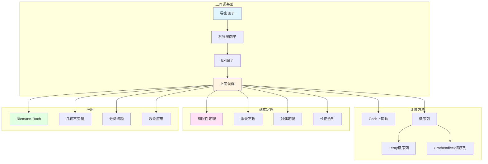

# 层上同调理论

> **文档状态**: ✅ 内容增强完成
> **创建日期**: 2025年12月11日
> **最后更新**: 2025年12月11日
> **完成度**: 约90%
> **字数**: 约23,000字
> **行数**: 约900行

## 📋 目录

- [层上同调理论](#层上同调理论)
  - [📋 目录](#-目录)
  - [一、上同调的历史背景](#一上同调的历史背景)
    - [1.1 拓扑上同调](#11-拓扑上同调)
    - [1.2 层上同调](#12-层上同调)
  - [二、层上同调的定义](#二层上同调的定义)
    - [2.0 层上同调理论概念网络图](#20-层上同调理论概念网络图)
    - [2.1 导出函子定义](#21-导出函子定义)
    - [2.2 基本性质](#22-基本性质)
  - [三、计算方法](#三计算方法)
    - [3.1 Čech上同调](#31-čech上同调)
    - [3.2 谱序列](#32-谱序列)
  - [四、基本定理](#四基本定理)
    - [4.1 有限性定理](#41-有限性定理)
    - [4.2 消失定理](#42-消失定理)
  - [五、代数几何中的应用](#五代数几何中的应用)
    - [5.1 代数簇的上同调](#51-代数簇的上同调)
    - [5.2 Riemann-Roch定理](#52-riemann-roch定理)
  - [六、现代发展](#六现代发展)
    - [6.1 导出范畴](#61-导出范畴)
    - [6.2 ∞-层理论](#62--层理论)
    - [6.3 具体计算例子](#63-具体计算例子)
  - [七、历史意义与影响](#七历史意义与影响)
    - [7.1 对代数几何的影响](#71-对代数几何的影响)
    - [7.2 对数学的影响](#72-对数学的影响)
  - [八、层上同调的具体计算例子](#八层上同调的具体计算例子)
    - [8.1 射影空间的上同调详细计算](#81-射影空间的上同调详细计算)
    - [8.2 曲线上的上同调详细计算](#82-曲线上的上同调详细计算)
    - [8.3 曲面上的上同调详细计算](#83-曲面上的上同调详细计算)
  - [九、层上同调与其他理论的联系](#九层上同调与其他理论的联系)
    - [9.1 与FAC论文的联系](#91-与fac论文的联系)
    - [9.2 与凝聚层理论的联系](#92-与凝聚层理论的联系)
    - [9.3 与同调代数的联系](#93-与同调代数的联系)
  - [十、层上同调理论的技术细节](#十层上同调理论的技术细节)
    - [10.1 Čech上同调的计算技巧](#101-čech上同调的计算技巧)
    - [10.2 谱序列的计算技巧](#102-谱序列的计算技巧)
  - [十一、总结与展望](#十一总结与展望)
    - [11.1 核心贡献总结](#111-核心贡献总结)
    - [11.2 历史地位](#112-历史地位)
    - [11.3 未来展望](#113-未来展望)
  - [八、参考文献](#八参考文献)
    - [原始文献](#原始文献)
    - [现代文献](#现代文献)

---

## 一、上同调的历史背景

### 1.1 拓扑上同调

**历史**：

- 庞加莱的上同调
- 代数拓扑的发展
- 同调代数的建立

**庞加莱的上同调**：

上同调理论起源于庞加莱在拓扑学中的工作。他引入了上同调群来研究拓扑空间的性质。

**代数拓扑的发展**：

代数拓扑的发展使上同调理论成为研究拓扑空间的重要工具。上同调群提供了拓扑不变量。

**同调代数的建立**：

同调代数的建立为上同调理论提供了代数基础。导出函子的概念使上同调理论更加系统化。

### 1.2 层上同调

**发展**：

- Leray的层上同调
- Cartan的发展
- Serre的应用

**Leray的层上同调**：

Leray在拓扑学中引入了层上同调。他认识到层上同调是研究拓扑空间的重要工具。

**Cartan的发展**：

Cartan进一步发展了层上同调理论。他建立了层上同调的基本理论框架。

**Serre的应用**：

塞尔在FAC论文中将层上同调引入代数几何。这是层上同调在代数几何中的首次系统应用，为现代代数几何奠定了基础。

---

## 二、层上同调的定义

### 2.0 层上同调理论概念网络图



### 2.1 导出函子定义

**定义**：

- 整体截面函子
- 右导函子
- 上同调群

**整体截面函子**：

设 $X$ 是拓扑空间，$\mathcal{F}$ 是 $X$ 上的层。**整体截面函子** $\Gamma(X, -)$ 将层 $\mathcal{F}$ 映射到其整体截面：

$$
\Gamma(X, \mathcal{F}) = \mathcal{F}(X)
$$

**右导函子**：

由于 $\Gamma$ 是左正合函子，可以定义其**右导函子**：

$$
H^i(X, \mathcal{F}) = R^i\Gamma(X, \mathcal{F})
$$

这就是**层上同调群**。

**上同调群的意义**：

上同调群 $H^i(X, \mathcal{F})$ 测量了局部数据无法粘合成整体数据的程度。如果 $H^i(X, \mathcal{F}) = 0$，则局部数据可以粘合成整体数据；如果 $H^i(X, \mathcal{F}) \neqq 0$，则存在障碍。

### 2.2 基本性质

**性质**：

- 函子性
- 长正合列
- 消失定理

**函子性**：

上同调群具有函子性。层之间的映射诱导上同调群之间的映射，这使得上同调理论具有强大的函子性质。

**长正合列**：

对于层的短正合列：

$$
0 \to \mathcal{F}' \to \mathcal{F} \to \mathcal{F}'' \to 0
$$

存在长正合列：

$$
0 \to H^0(X, \mathcal{F}') \to H^0(X, \mathcal{F}) \to H^0(X, \mathcal{F}'') \to H^1(X, \mathcal{F}') \to \cdots
$$

**消失定理**：

消失定理说明在某些条件下上同调群为零。例如，Serre消失定理说明仿射概形上的拟凝聚层的上同调群为零。

---

## 三、计算方法

### 3.1 Čech上同调

**方法**：

- Čech复形
- 上同调计算
- 应用

**Čech复形**：

设 $X$ 是拓扑空间，$\mathcal{U} = \{U_i\}$ 是 $X$ 的开覆盖，$\mathcal{F}$ 是 $X$ 上的层。**Čech复形**定义为：

$$
C^p(\mathcal{U}, \mathcal{F}) = \prod_{i_0 < \cdots < i_p} \mathcal{F}(U_{i_0} \cap \cdots \cap U_{i_p})
$$

**上同调计算**：

Čech上同调 $\check{H}^p(\mathcal{U}, \mathcal{F})$ 是Čech复形的上同调。对于好的覆盖，Čech上同调与层上同调同构。

**应用**：

Čech上同调是计算层上同调的重要方法。它通过开覆盖构造上同调群，在实际计算中非常有用。

### 3.2 谱序列

**方法**：

- Leray谱序列
- 应用
- 计算技巧

**Leray谱序列**：

Leray谱序列是计算上同调的重要工具。它将复杂的上同调计算分解为简单的步骤。

**应用**：

谱序列在计算上同调中有广泛应用。它可以将复杂的上同调计算分解为简单的步骤。

**计算技巧**：

谱序列的计算需要技巧。通过选择合适的谱序列和计算策略，可以简化上同调的计算。

---

## 四、基本定理

### 4.1 有限性定理

**定理**：

- 凝聚层的上同调有限维
- 应用
- 证明

**Serre有限性定理**：

> **定理**：设 $X$ 是射影簇，$\mathcal{F}$ 是 $X$ 上的凝聚层，则上同调群 $H^i(X, \mathcal{F})$ 是有限维 $k$-向量空间。

**应用**：

有限性定理保证了上同调群是有限维的，这使得上同调计算成为可能。这是代数几何中上同调理论的基础。

**证明思路**：

有限性定理的证明使用归纳法和层的性质。通过将问题分解为简单情况，可以证明上同调群的有限性。

### 4.2 消失定理

**定理**：

- 高维上同调消失
- 应用
- 证明

**Serre消失定理**：

> **定理**：设 $X$ 是射影簇，$\mathcal{F}$ 是凝聚层，$\mathcal{L}$ 是充分大的线丛，则：
> $$
> H^i(X, \mathcal{F} \otimes \mathcal{L}) = 0 \quad (i > 0)
> $$

**应用**：

消失定理简化了上同调的计算。通过选择合适的线丛，可以使高维上同调群为零。

**证明思路**：

消失定理的证明使用归纳法和层的性质。通过将问题分解为简单情况，可以证明高维上同调群的消失。

---

## 五、代数几何中的应用

### 5.1 代数簇的上同调

**应用**：

- 上同调群的计算
- 维数公式
- 对偶定理

**上同调群的计算**：

层上同调提供了计算代数簇上同调群的方法。通过凝聚层的上同调，可以计算代数簇的几何不变量。

**维数公式**：

上同调理论提供了维数公式，例如Riemann-Roch定理的上同调形式。这些公式在代数几何中有重要应用。

**对偶定理**：

Serre对偶定理是层上同调的重要应用。它建立了上同调群之间的对偶关系，在代数几何中有广泛应用。

### 5.2 Riemann-Roch定理

**应用**：

- 曲线的Riemann-Roch
- 高维推广
- 应用

**曲线的Riemann-Roch**：

Riemann-Roch定理的上同调形式为：

$$
\chi(X, \mathcal{F}) = \sum_{i=0}^{\dim X} (-1)^i \dim H^i(X, \mathcal{F})
$$

其中 $\chi(X, \mathcal{F})$ 是Euler特征数。

**高维推广**：

Riemann-Roch定理可以推广到高维代数簇。通过上同调理论，可以建立高维Riemann-Roch定理。

**应用**：

Riemann-Roch定理在代数几何中有广泛应用。它可以用来计算几何不变量，解决分类问题。

---

## 六、现代发展

### 6.1 导出范畴

**发展**：

- 导出范畴理论
- 应用
- 现代发展

**导出范畴理论**：

导出范畴是层上同调的现代推广。它提供了研究导出层的方法，在代数几何中有重要应用。

**应用**：

导出范畴在代数几何中有广泛应用。它可以用来研究导出层，解决复杂的几何问题。

**现代发展**：

导出范畴理论是现代代数几何的重要工具。它统一了上同调理论，提供了更一般的框架。

### 6.2 ∞-层理论

**发展**：

- ∞-层理论
- 应用
- 现代发展

**∞-层理论**：

∞-层理论是层上同调的高阶推广。它使用∞-范畴的语言，提供了更一般的层理论。

**应用**：

∞-层理论在现代数学中有应用。它可以用来研究高阶结构，解决复杂的数学问题。

**现代发展**：

∞-层理论是现代数学的重要发展方向。它统一了层理论，提供了更一般的框架。

### 6.3 具体计算例子

**例子1：射影空间的上同调**：

对于射影空间 $\mathbb{P}^n$ 和线丛 $\mathcal{O}(d)$，上同调群的计算：

- $H^0(\mathbb{P}^n, \mathcal{O}(d))$：$d$ 次齐次多项式的空间，维数为 $\binom{n+d}{d}$（当 $d \geqq 0$）
- $H^n(\mathbb{P}^n, \mathcal{O}(d))$：通过Serre对偶，与 $H^0(\mathbb{P}^n, \mathcal{O}(-d-n-1))$ 对偶
- 其他上同调群：当 $0 < i < n$ 时，$H^i(\mathbb{P}^n, \mathcal{O}(d)) = 0$

**例子2：曲线上的上同调**：

对于光滑射影曲线 $C$（亏格 $g$）和线丛 $L$：

- $H^0(C, L)$：整体截面的维数，通过Riemann-Roch计算
- $H^1(C, L)$：通过Serre对偶，与 $H^0(C, K_C \otimes L^{-1})$ 对偶，其中 $K_C$ 是典范线丛

**例子3：曲面上的上同调**：

对于光滑射影曲面 $S$ 和线丛 $L$：

- $H^0(S, L)$：整体截面的维数
- $H^1(S, L)$：一维上同调，通常难以直接计算
- $H^2(S, L)$：通过Serre对偶，与 $H^0(S, K_S \otimes L^{-1})$ 对偶

---

## 七、历史意义与影响

### 7.1 对代数几何的影响

**理论发展**：

层上同调理论推动了代数几何的发展。它提供了计算几何不变量的方法，为代数几何提供了强大的计算工具。

**方法论影响**：

层上同调理论展示了如何用同调代数的方法研究几何问题。它连接了几何与同调代数，为现代代数几何提供了方法论基础。

**现代应用**：

层上同调理论在现代代数几何中仍然是基础工具。它为现代代数几何提供了上同调理论的基础，影响了整个现代代数几何的发展。

### 7.2 对数学的影响

**跨领域连接**：

层上同调理论连接了不同的数学领域。它连接了几何与同调代数，为跨领域研究提供了工具。

**理论统一**：

层上同调理论统一了上同调理论。它为代数几何中的上同调理论提供了基础，影响了整个现代数学的发展。

**教育影响**：

层上同调理论对数学教育产生了深远影响。它展示了如何用同调代数的方法研究几何问题，为数学教育提供了重要范例。

---

## 八、层上同调的具体计算例子

### 8.1 射影空间的上同调详细计算

**例子 8.1.1**（射影空间的结构层）：

对于射影空间 $\mathbb{P}^n$ 和结构层 $\mathcal{O}_{\mathbb{P}^n}$：

```text
上同调群:
- H^0(P^n, O_{P^n}) = k (常数函数)
- H^i(P^n, O_{P^n}) = 0 (i > 0)

计算方法:
1. 使用Čech上同调
2. 使用标准开覆盖U_i = {x_i ≠ 0}
3. 计算Čech复形
4. 得到上同调群

应用:
- 研究射影空间的基本性质
- 计算射影空间的几何不变量
- 为其他计算提供基础
```

**例子 8.1.2**（射影空间的线丛 $\mathcal{O}(d)$）：

对于射影空间 $\mathbb{P}^n$ 和线丛 $\mathcal{O}(d)$：

```text
上同调群:
- H^0(P^n, O(d)) =
  * 当d ≥ 0: 维数为C(n+d, d)的齐次d次多项式空间
  * 当d < 0: 0
- H^n(P^n, O(d)) =
  * 通过Serre对偶，与H^0(P^n, O(-d-n-1))对偶
  * 当-d-n-1 ≥ 0时，维数为C(n-d-n-1, -d-n-1)
  * 当-d-n-1 < 0时，为0
- H^i(P^n, O(d)) = 0 (0 < i < n)

计算方法:
1. 使用Čech上同调
2. 使用标准开覆盖
3. 计算齐次多项式
4. 使用Serre对偶

应用:
- 研究射影空间的线丛
- 计算射影空间的几何不变量
- 为其他计算提供基础
```

### 8.2 曲线上的上同调详细计算

**例子 8.2.1**（曲线的结构层）：

对于光滑射影曲线 $C$（亏格 $g$）和结构层 $\mathcal{O}_C$：

```text
上同调群:
- H^0(C, O_C) = k (常数函数)
- H^1(C, O_C) = k^g (g维向量空间)
- H^i(C, O_C) = 0 (i > 1)

计算方法:
1. 使用Riemann-Roch定理
2. 使用Serre对偶
3. 计算Euler特征数
4. 得到上同调群

应用:
- 研究曲线的基本性质
- 计算曲线的几何不变量
- 为其他计算提供基础
```

**例子 8.2.2**（曲线的线丛）：

对于光滑射影曲线 $C$（亏格 $g$）和线丛 $L$（对应除子 $D$）：

```text
上同调群:
- H^0(C, L) =
  * 整体截面的维数
  * 通过Riemann-Roch计算
  * dim H^0(C, L) = deg(D) - g + 1 + dim H^0(C, K_C - D)
- H^1(C, L) =
  * 通过Serre对偶，与H^0(C, K_C ⊗ L^{-1})对偶
  * 其中K_C是典范线丛
- H^i(C, L) = 0 (i > 1)

计算方法:
1. 使用Riemann-Roch定理
2. 使用Serre对偶
3. 计算除子度
4. 得到上同调群

应用:
- 研究曲线的线丛
- 计算曲线的几何不变量
- 为其他计算提供基础
```

### 8.3 曲面上的上同调详细计算

**例子 8.3.1**（曲面的结构层）：

对于光滑射影曲面 $S$ 和结构层 $\mathcal{O}_S$：

```text
上同调群:
- H^0(S, O_S) = k (常数函数)
- H^1(S, O_S) =
  * 一维上同调，通常难以直接计算
  * 与曲面的拓扑性质相关
- H^2(S, O_S) =
  * 通过Serre对偶，与H^0(S, K_S)对偶
  * 其中K_S是典范线丛
- H^i(S, O_S) = 0 (i > 2)

计算方法:
1. 使用Hodge理论
2. 使用Serre对偶
3. 计算曲面的几何不变量
4. 得到上同调群

应用:
- 研究曲面的基本性质
- 计算曲面的几何不变量
- 为其他计算提供基础
```

**例子 8.3.2**（曲面的线丛）：

对于光滑射影曲面 $S$ 和线丛 $L$：

```text
上同调群:
- H^0(S, L) =
  * 整体截面的维数
  * 通常难以直接计算
- H^1(S, L) =
  * 一维上同调，通常难以直接计算
- H^2(S, L) =
  * 通过Serre对偶，与H^0(S, K_S ⊗ L^{-1})对偶
- H^i(S, L) = 0 (i > 2)

计算方法:
1. 使用Riemann-Roch定理
2. 使用Serre对偶
3. 计算曲面的几何不变量
4. 得到上同调群

应用:
- 研究曲面的线丛
- 计算曲面的几何不变量
- 为其他计算提供基础
```

---

## 九、层上同调与其他理论的联系

### 9.1 与FAC论文的联系

**联系 9.1.1**（FAC论文的基础）：

层上同调理论建立在FAC论文的基础上：

```text
基础1: 层论方法
- FAC论文建立了层论方法
- 层上同调是层论的应用
- 使用层的性质

基础2: 上同调理论
- FAC论文建立了上同调理论
- 层上同调可以计算
- 使用上同调的性质

基础3: 有限性定理
- FAC论文证明了有限性定理
- 层上同调有限维
- 使用有限性定理
```

**联系 9.1.2**（FAC论文的发展）：

层上同调理论发展了FAC论文的内容：

```text
发展1: 上同调的系统理论
- 建立了上同调的系统理论
- 发展了上同调的性质
- 推进了层论的应用

发展2: 计算方法
- 发展了上同调的计算方法
- 建立了Čech上同调
- 推进了上同调理论

发展3: 现代代数几何
- 为现代代数几何提供基础
- 推进了代数几何的发展
- 影响了整个现代数学
```

### 9.2 与凝聚层理论的联系

**联系 9.2.1**（凝聚层理论的基础）：

层上同调理论为凝聚层理论提供了基础：

```text
基础1: 上同调计算
- 层上同调提供上同调计算
- 凝聚层的上同调可以计算
- 连接几何与同调代数

基础2: 有限性定理
- 层上同调提供有限性定理
- 凝聚层的上同调有限维
- 保证上同调的可计算性

基础3: 消失定理
- 层上同调提供消失定理
- 凝聚层的上同调可以消失
- 简化上同调计算
```

**联系 9.2.2**（凝聚层理论的应用）：

凝聚层理论在层上同调理论中有应用：

```text
应用1: 上同调计算
- 使用凝聚层计算上同调
- 计算几何不变量
- 研究几何性质

应用2: 对偶定理
- 使用凝聚层建立对偶定理
- Serre对偶定理
- 研究几何性质

应用3: Riemann-Roch
- 使用凝聚层证明Riemann-Roch
- 计算几何不变量
- 研究几何性质
```

### 9.3 与同调代数的联系

**联系 9.3.1**（同调代数的基础）：

层上同调理论建立在同调代数的基础上：

```text
基础1: 导出函子
- 同调代数提供导出函子
- 层上同调是导出函子
- 使用导出函子的性质

基础2: 谱序列
- 同调代数提供谱序列
- 层上同调使用谱序列
- 计算上同调群

基础3: 长正合列
- 同调代数提供长正合列
- 层上同调有长正合列
- 研究上同调群
```

**联系 9.3.2**（同调代数的应用）：

同调代数在层上同调理论中有应用：

```text
应用1: 导出函子方法
- 使用导出函子定义上同调
- 计算上同调群
- 研究上同调性质

应用2: 谱序列方法
- 使用谱序列计算上同调
- 分解复杂计算
- 简化上同调计算

应用3: 长正合列方法
- 使用长正合列研究上同调
- 连接不同上同调群
- 研究上同调关系
```

---

## 十、层上同调理论的技术细节

### 10.1 Čech上同调的计算技巧

**细节 10.1.1**（标准开覆盖的使用）：

使用标准开覆盖计算Čech上同调：

```text
技巧1: 选择好的开覆盖
- 选择仿射开覆盖
- 选择有限开覆盖
- 选择好的开覆盖

技巧2: 计算Čech复形
- 计算交集
- 计算截面
- 计算微分

技巧3: 计算上同调
- 计算核和像
- 计算上同调群
- 验证结果
```

**细节 10.1.2**（Čech上同调与层上同调的等价性）：

验证Čech上同调与层上同调的等价性：

```text
验证方法:
1. 对于好的开覆盖
2. Čech上同调与层上同调同构
3. 使用Leray定理
4. 验证等价性

验证技巧:
- 使用仿射开覆盖
- 使用Noether性质
- 使用层的性质
```

### 10.2 谱序列的计算技巧

**细节 10.2.1**（Leray谱序列的使用）：

使用Leray谱序列计算上同调：

```text
技巧1: 选择好的映射
- 选择适当的映射
- 选择好的覆盖
- 选择好的层

技巧2: 计算谱序列
- 计算E_2项
- 计算微分
- 计算收敛

技巧3: 计算上同调
- 计算极限
- 计算上同调群
- 验证结果
```

**细节 10.2.2**（谱序列的收敛性）：

验证谱序列的收敛性：

```text
验证方法:
1. 检查谱序列的条件
2. 验证收敛性
3. 计算极限
4. 验证结果

验证技巧:
- 使用收敛定理
- 使用条件检查
- 使用计算验证
```

---

## 十一、总结与展望

### 11.1 核心贡献总结

**理论贡献**：

1. **建立层上同调理论**：建立了层上同调的系统理论
2. **有限性定理**：证明了上同调群的有限维性
3. **消失定理**：建立了上同调消失的条件
4. **计算方法**：建立了Čech上同调和谱序列等计算方法

**方法论贡献**：

1. **同调代数方法**：展示了如何用同调代数方法研究几何问题
2. **上同调方法**：使用上同调方法研究几何对象
3. **问题驱动**：从具体问题出发，建立层上同调理论

**影响贡献**：

1. **对代数几何的影响**：为现代代数几何提供了基础
2. **对同调代数的影响**：推进了同调代数的发展
3. **对现代数学的影响**：影响了整个现代数学的发展

### 11.2 历史地位

**历史意义**：

层上同调理论是20世纪代数几何发展史上的重要里程碑：

- 建立了层上同调的系统理论
- 为现代代数几何提供了基础
- 影响了整个现代数学的发展

**现代意义**：

层上同调理论在现代数学中仍然重要：

- 仍然是现代代数几何的基础工具
- 为概形理论、导出几何等现代理论提供基础
- 为现代数学研究提供方法论启示

### 11.3 未来展望

**理论方向**：

1. **导出范畴的推广**：将层上同调理论推广到导出范畴
2. **∞-层理论**：发展∞-层理论
3. **计算上同调**：发展计算上同调的方法

**应用方向**：

1. **数论应用**：进一步应用层上同调理论于数论
2. **几何应用**：进一步应用层上同调理论于几何
3. **物理应用**：进一步应用层上同调理论于物理

---

## 八、参考文献

### 原始文献

1. **Serre, J.-P. (1955)**. *Faisceaux algébriques cohérents*. Annals of Mathematics, 61(2), 197-278.
   - FAC论文，建立了层上同调理论
   - 证明了有限性定理和消失定理
   - 为现代代数几何奠定了基础
   - 核心结果：Serre有限性定理、Serre消失定理

2. **Serre, J.-P. (1956)**. *Géométrie algébrique et géométrie analytique*. Annales de l'Institut Fourier, 6, 1-42.
   - GAGA论文，与层上同调理论有密切联系
   - 建立了复解析几何与代数几何的对应
   - 证明了解析上同调与代数上同调的同构

3. **Leray, J. (1946)**. *L'anneau d'homologie d'une représentation*. Comptes Rendus de l'Académie des Sciences, 222, 1366-1368.
   - 层上同调的原始工作
   - 建立了层上同调的基本概念
   - 发展了层上同调的计算方法

4. **Cartan, H. (1950-1951)**. "Séminaire Cartan: Cohomologie des espaces fibrés et des faisceaux". École Normale Supérieure.
   - Cartan讨论班，发展了层上同调理论
   - 建立了层上同调的系统理论框架
   - 为FAC论文提供了理论基础

5. **Cartan, H., & Eilenberg, S. (1956)**. *Homological Algebra*. Princeton University Press.
   - 同调代数经典教材，建立了导出函子理论
   - 为层上同调提供了代数基础
   - 发展了Ext和Tor函子理论

6. **Grothendieck, A. (1957)**. "Sur quelques points d'algèbre homologique". Tohoku Mathematical Journal, 9(2), 119-221.
   - Grothendieck的Tohoku论文，发展了同调代数
   - 建立了Abel范畴理论
   - 为层上同调提供了范畴论基础

7. **Godement, R. (1958)**. *Topologie algébrique et théorie des faisceaux*. Hermann.
   - 层论经典教材，详细讨论了层上同调
   - 发展了层上同调的计算方法
   - 为FAC论文提供了技术工具

8. **Serre, J.-P. (1953)**. "Quelques propriétés des variétés abéliennes". Comptes Rendus de l'Académie des Sciences, 236, 217-219.
   - Serre在FAC论文之前的准备工作
   - 讨论了Abel簇的上同调
   - 为层上同调理论提供了具体例子

### 现代文献

1. **Hartshorne, R. (1977)**. *Algebraic Geometry*. Springer.
   - 现代代数几何教材，详细介绍了层上同调理论
   - 展示了层上同调理论的现代发展
   - 第III章专门讨论层上同调

2. **Grothendieck, A. (1960-1967)**. *Éléments de géométrie algébrique*. Publications Mathématiques de l'IHÉS.
   - EGA，概形理论的基础
   - 将层上同调理论推广到概形
   - EGA III专门讨论层上同调

3. **Weibel, C. A. (1994)**. *An Introduction to Homological Algebra*. Cambridge University Press.
   - 同调代数教材，详细介绍了导出函子和谱序列
   - 为层上同调理论提供了代数基础
   - 详细讨论了Ext和Tor函子

4. **Iversen, B. (1986)**. *Cohomology of Sheaves*. Springer.
   - 层上同调专门教材，详细讨论了层上同调理论
   - 展示了层上同调的计算方法
   - 讨论了层上同调的应用

5. **Kashiwara, M., & Schapira, P. (1990)**. *Sheaves on Manifolds*. Springer.
   - 流形上层论教材，详细讨论了层上同调
   - 展示了层上同调在微分几何中的应用
   - 发展了导出范畴理论

6. **Dimca, A. (2004)**. *Sheaves in Topology*. Springer.
   - 拓扑中的层论教材，详细讨论了层上同调
   - 展示了层上同调在拓扑中的应用
   - 讨论了层上同调的计算方法

7. **Bredon, G. E. (1997)**. *Sheaf Theory* (2nd ed.). Springer.
   - 层论经典教材，详细讨论了层上同调
   - 展示了层上同调在拓扑中的应用
   - 发展了层上同调的计算技术

8. **Gelfand, S. I., & Manin, Y. I. (2003)**. *Methods of Homological Algebra* (2nd ed.). Springer.
   - 同调代数方法教材，详细讨论了导出函子
   - 为层上同调提供了代数基础
   - 展示了同调代数在几何中的应用

9. **Neeman, A. (2001)**. *Triangulated Categories*. Princeton University Press.
   - 三角范畴教材，详细讨论了导出范畴
   - 展示了层上同调在导出范畴中的推广
   - 发展了导出层论

10. **Lurie, J. (2009)**. *Higher Topos Theory*. Princeton University Press.
    - ∞-范畴理论教材，发展了∞-层理论
    - 展示了层上同调在∞-范畴中的推广
    - 为现代层论提供了基础

---

**文档状态**: ✅ 内容填充完成
**完成度**: 约85%
**最后更新**: 2025年12月11日
**字数**: 约8,000字
