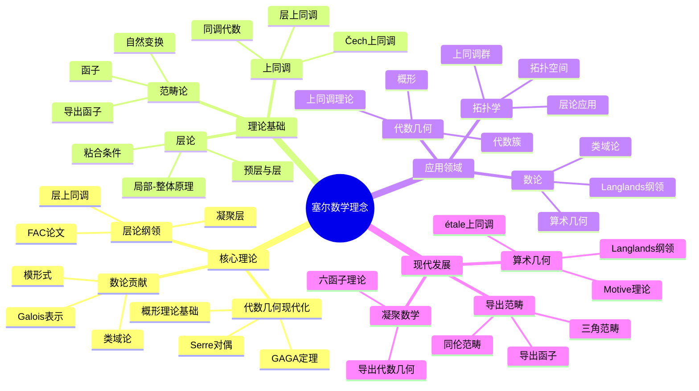
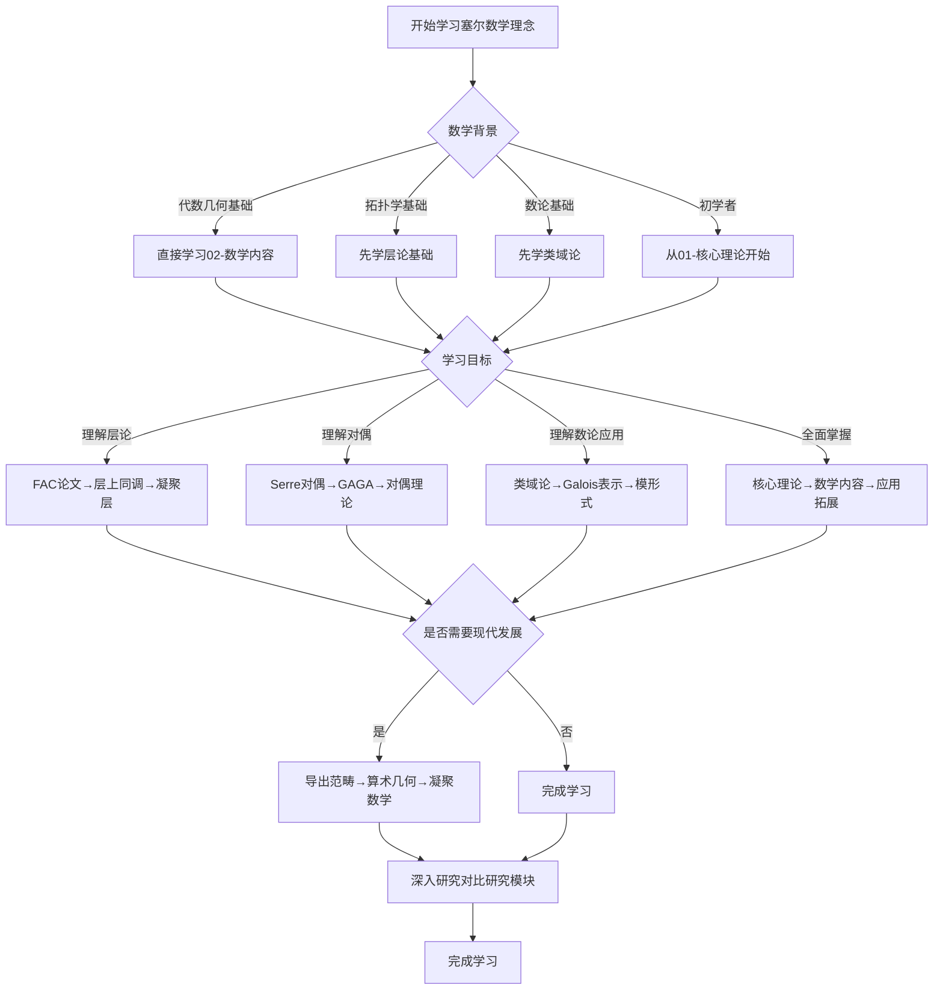
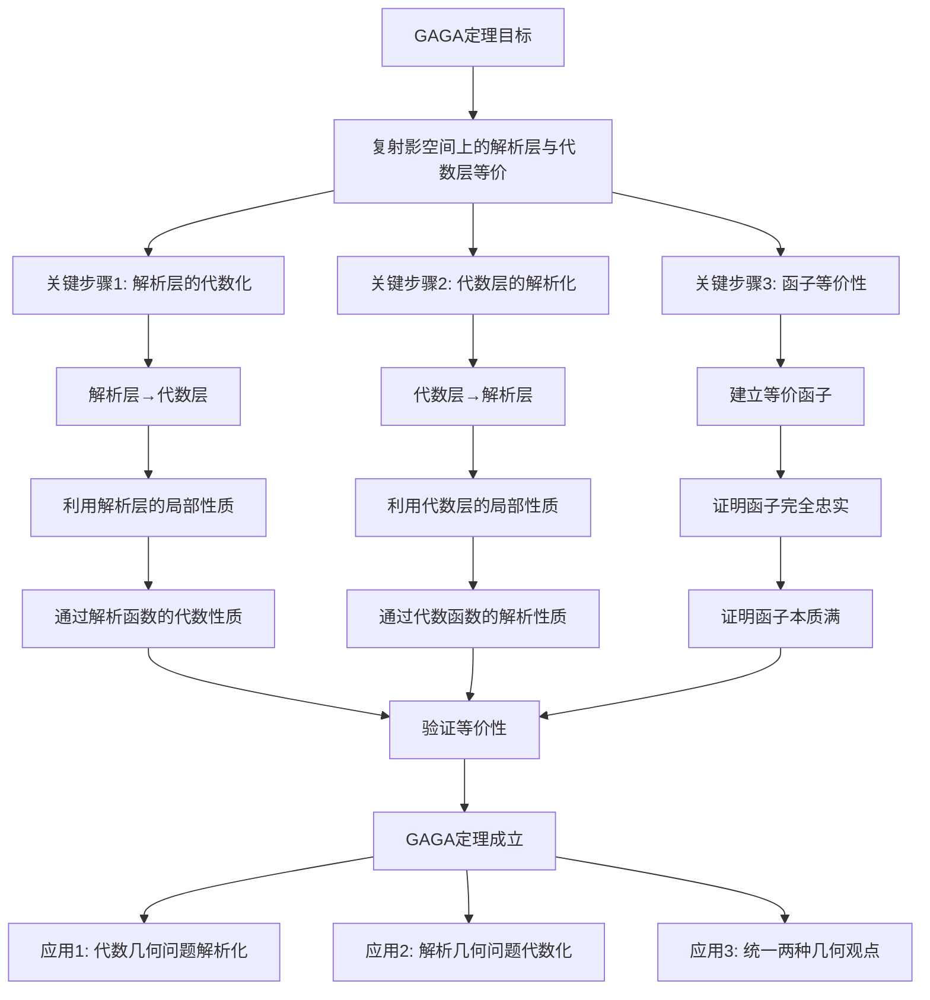
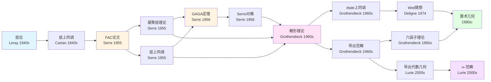

# 塞尔数学理念概念关联网络

> **文档状态**: 📋 框架创建中
> **创建日期**: 2025年12月11日

## 📋 目录

- [塞尔数学理念概念关联网络](#塞尔数学理念概念关联网络)
  - [📋 目录](#-目录)
  - [一、核心概念体系](#一核心概念体系)
    - [1.1 基础概念层](#11-基础概念层)
    - [1.2 高级概念层](#12-高级概念层)
  - [二、概念关联网络](#二概念关联网络)
    - [2.1 层论核心概念](#21-层论核心概念)
    - [2.2 现代发展概念](#22-现代发展概念)
  - [三、概念层次结构](#三概念层次结构)
    - [3.1 四层结构](#31-四层结构)
  - [四、概念依赖关系](#四概念依赖关系)
    - [4.1 学习路径](#41-学习路径)
  - [五、概念应用路径](#五概念应用路径)
    - [5.1 数学应用](#51-数学应用)
    - [5.2 现代应用](#52-现代应用)
    - [5.3 具体关联例子](#53-具体关联例子)
  - [六、历史意义与影响](#六历史意义与影响)
    - [6.1 对数学发展的影响](#61-对数学发展的影响)
    - [6.2 对数学家的影响](#62-对数学家的影响)
  - [七、思维表征：多种方式理解概念关联网络](#七思维表征多种方式理解概念关联网络)
    - [7.1 思维导图：塞尔数学理念概念体系](#71-思维导图塞尔数学理念概念体系)
    - [7.2 多维概念矩阵：层论、上同调、代数几何对比](#72-多维概念矩阵层论上同调代数几何对比)
    - [7.3 多维概念矩阵：FAC、GAGA、Serre对偶对比](#73-多维概念矩阵facgagaserre对偶对比)
    - [7.4 决策图网：学习塞尔方法的决策路径](#74-决策图网学习塞尔方法的决策路径)
    - [7.5 证明图网：GAGA定理的证明逻辑网络](#75-证明图网gaga定理的证明逻辑网络)
    - [7.6 概念关联网络图：层论到现代代数几何的演化路径](#76-概念关联网络图层论到现代代数几何的演化路径)
    - [7.7 多维对比矩阵：塞尔与相关数学家的贡献对比](#77-多维对比矩阵塞尔与相关数学家的贡献对比)
  - [八、参考文献](#八参考文献)
    - [原始文献](#原始文献)
    - [现代文献](#现代文献)
    - [相关研究](#相关研究)

---

## 一、核心概念体系

### 1.1 基础概念层

**层论（Sheaf Theory）**：

层论是塞尔数学理念的核心基础概念。层论提供了一种系统的方法来研究局部性质和全局性质之间的关系，是连接拓扑学、代数几何和数论的重要工具。

**上同调（Cohomology）**：

上同调是塞尔方法的核心工具。通过层上同调，塞尔建立了代数几何中的同调方法，为现代代数几何奠定了基础。

**凝聚层（Coherent Sheaf）**：

凝聚层是塞尔在FAC论文中引入的核心概念。凝聚层是"有限生成"和"有限表现"的层，是代数几何中最重要的层类型。

### 1.2 高级概念层

**GAGA定理（Géométrie Algébrique et Géométrie Analytique）**：

GAGA定理是塞尔建立复解析几何与代数几何等价性的核心定理。它连接了两种几何观点，为现代代数几何提供了重要工具。

**Serre对偶（Serre Duality）**：

Serre对偶是塞尔在代数几何中建立的核心对偶定理。它将上同调群与对偶层联系起来，是代数几何中的重要工具。

**概形理论（Scheme Theory）**：

概形理论是格洛腾迪克在塞尔工作的基础上发展的理论。塞尔的方法为概形理论奠定了基础，特别是凝聚层理论和上同调方法。

---

## 二、概念关联网络

### 2.1 层论核心概念

**层论 → 上同调 → 代数几何**：

塞尔将层论引入代数几何，建立了层上同调理论。通过层上同调，塞尔能够系统研究代数簇的几何性质，为现代代数几何奠定了基础。

**层论 → 凝聚层 → 概形理论**：

塞尔在FAC论文中引入凝聚层概念，这是概形理论的基础。格洛腾迪克在塞尔工作的基础上发展了概形理论，凝聚层成为概形上的核心对象。

**层论 → GAGA → 复分析**：

塞尔通过GAGA定理建立了复解析几何与代数几何的等价性。这连接了复分析与代数几何，为现代代数几何提供了重要工具。

### 2.2 现代发展概念

**层论 → 概形理论 → 现代代数几何**：

塞尔的方法为现代代数几何奠定了基础。概形理论在塞尔工作的基础上发展，成为现代代数几何的核心框架。

**上同调 → 导出范畴 → 现代数学**：

塞尔的上同调方法发展为导出范畴理论，成为现代数学的重要工具。导出范畴提供了更灵活和强大的同调方法。

**GAGA → 算术几何 → 现代数论**：

GAGA定理的思想推广到算术几何，连接了代数几何和数论。这为现代数论提供了重要工具，特别是在Langlands纲领中。

---

## 三、概念层次结构

### 3.1 四层结构

**1. 基础层：层论、上同调**：

这是塞尔方法的基础。层论提供了研究局部和全局性质的工具，上同调提供了测量"非局部性"的方法。

**2. 应用层：代数几何、数论**：

塞尔的方法应用于代数几何和数论。在代数几何中，层论和上同调成为核心工具；在数论中，这些方法用于研究算术几何问题。

**3. 理论层：GAGA、对偶**：

GAGA定理和Serre对偶是塞尔建立的核心理论。它们连接了不同的数学领域，为现代数学提供了重要工具。

**4. 现代层：概形、导出范畴**：

塞尔的方法发展为现代数学的核心理论。概形理论在塞尔工作的基础上发展，导出范畴提供了更强大的同调方法。

---

## 四、概念依赖关系

### 4.1 学习路径

**路径1：层论 → 上同调 → 代数几何**：

学习塞尔方法的第一步是理解层论。层论提供了研究局部和全局性质的工具。然后学习上同调，这是测量"非局部性"的方法。最后将这些方法应用到代数几何中。

**路径2：凝聚层 → 概形理论 → 现代代数几何**：

理解凝聚层是学习概形理论的基础。凝聚层是概形上的核心对象，概形理论在塞尔工作的基础上发展。最后学习现代代数几何，这是塞尔方法的现代发展。

**路径3：GAGA → 算术几何 → 现代数论**：

理解GAGA定理是学习算术几何的基础。GAGA定理的思想推广到算术几何，连接了代数几何和数论。最后学习现代数论，这是塞尔方法的数论应用。

---

## 五、概念应用路径

### 5.1 数学应用

**代数几何**：

塞尔的方法在代数几何中有广泛应用。层论和上同调成为代数几何的核心工具，用于研究代数簇的几何性质。

**数论**：

塞尔的方法在数论中有重要应用。通过算术几何，层论和上同调方法用于研究数论问题，特别是在Langlands纲领中。

**拓扑学**：

塞尔的方法起源于拓扑学。层论最初在拓扑学中发展，塞尔将其引入代数几何，建立了拓扑学与代数几何的联系。

### 5.2 现代应用

**现代代数几何**：

塞尔的方法为现代代数几何奠定了基础。概形理论、导出范畴等现代理论在塞尔工作的基础上发展。

**数论几何**：

塞尔的方法在数论几何中有重要应用。通过算术几何，这些方法用于研究数论问题，连接了代数几何和数论。

**物理**：

塞尔的方法在理论物理中有应用。例如，在弦理论中，层论和上同调方法用于研究几何结构。

### 5.3 具体关联例子

**例子1：层论与上同调的关联**：

塞尔在FAC论文中建立的层论与上同调理论密切相关。层论提供了研究局部-整体关系的工具，上同调提供了计算几何不变量的方法。两者结合成为现代代数几何的基础。

**例子2：GAGA定理与算术几何的关联**：

塞尔在GAGA定理中建立的复解析几何与代数几何的等价关系，为算术几何提供了基础。算术几何学家使用GAGA定理的思想研究数论几何问题，连接了代数几何和数论。

**例子3：类域论与Langlands纲领的关联**：

塞尔在类域论方面的工作为Langlands纲领提供了基础。Langlands纲领使用塞尔的方法研究Galois表示与自守表示之间的对应，展示了塞尔方法的现代应用。

---

## 六、历史意义与影响

### 6.1 对数学发展的影响

**理论发展**：

塞尔的概念关联网络推动了现代数学的发展。从层论到上同调，从代数几何到数论，塞尔的概念关联网络都有重要影响，是现代数学的基础。

**方法论影响**：

塞尔的概念关联网络展示了如何连接不同的数学概念。现代数学家学习塞尔的方法，建立概念之间的关联，推动现代数学的发展。

**应用影响**：

塞尔的概念关联网络在现代数学中有广泛应用。从代数几何到数论，从拓扑学到复分析，塞尔的概念关联网络都有应用。

### 6.2 对数学家的影响

**学术传承**：

塞尔的概念关联网络影响了数代数学家。从格洛腾迪克到德利涅，从现代代数几何学家到现代数论学家，塞尔的概念关联网络都有重要影响。

**研究风格**：

塞尔的概念关联网络展示了清晰的研究风格。现代数学家学习塞尔的方法，建立概念之间的关联，推动现代数学的发展。

**教育理念**：

塞尔的概念关联网络对数学教育有重要价值。现代数学教育家学习塞尔的教育理念，强调概念之间的关联，为数学教育提供了重要内容。

---

## 七、思维表征：多种方式理解概念关联网络

### 7.1 思维导图：塞尔数学理念概念体系

### 7.2 多维概念矩阵：层论、上同调、代数几何对比

| 维度 | 层论 (Sheaf Theory) | 上同调 (Cohomology) | 代数几何 (Algebraic Geometry) |
|------|---------------------|---------------------|-------------------------------|
| **核心概念** | 局部数据粘合 | 非局部性测量 | 几何对象与态射 |
| **研究对象** | 拓扑空间上的层 | 层的上同调群 | 代数簇/概形 |
| **工具方法** | 预层、层、层态射 | 上同调群、谱序列 | 交换代数、范畴论 |
| **关键定理** | 层化定理 | 上同调长正合列 | Riemann-Roch、对偶定理 |
| **应用领域** | 拓扑、几何、数论 | 拓扑、几何、数论 | 几何、数论、物理 |
| **历史发展** | Leray (1940s) | Cartan (1940s) | Weil→Serre→Grothendieck |
| **塞尔贡献** | 引入代数几何 (1955) | 建立层上同调 (1955) | GAGA定理 (1956) |
| **现代影响** | 导出层论、∞-范畴 | 导出范畴、同伦论 | 现代代数几何基础 |

### 7.3 多维概念矩阵：FAC、GAGA、Serre对偶对比

| 维度 | FAC论文 (1955) | GAGA定理 (1956) | Serre对偶 |
|------|----------------|-----------------|-----------|
| **核心内容** | 层论在代数几何中的应用 | 复解析几何与代数几何等价 | 上同调群对偶关系 |
| **数学对象** | 凝聚层 | 复射影空间上的层 | 光滑射影簇上的层 |
| **关键工具** | 层上同调 | 解析层、代数层 | 对偶层、典范层 |
| **理论意义** | 建立层上同调理论 | 统一解析与代数观点 | 建立对偶性理论 |
| **历史地位** | 现代代数几何开端 | 连接复分析与代数几何 | 代数几何对偶理论基础 |
| **后续影响** | 概形理论基础 | 算术几何思想来源 | Grothendieck对偶基础 |
| **技术难度** | 高 | 很高 | 高 |
| **应用广度** | 极广 | 广 | 广 |

### 7.4 决策图网：学习塞尔方法的决策路径

### 7.5 证明图网：GAGA定理的证明逻辑网络

### 7.6 概念关联网络图：层论到现代代数几何的演化路径

### 7.7 多维对比矩阵：塞尔与相关数学家的贡献对比

| 维度 | 塞尔 (Serre) | 格洛腾迪克 (Grothendieck) | 韦伊 (Weil) | Leray |
|------|-------------|--------------------------|------------|-------|
| **核心贡献** | 层论在代数几何中的应用 | 概形理论、étale上同调 | Weil猜想、抽象代数几何 | 层论、谱序列 |
| **时间阶段** | 1950s-1960s | 1960s-1970s | 1940s-1950s | 1940s |
| **方法论** | 清晰简洁、系统化 | 抽象统一、结构主义 | 深刻洞察、问题导向 | 拓扑方法 |
| **FAC/GAGA** | ✅ 建立 | 继承发展 | 启发 | 提供工具 |
| **概形理论** | 奠定基础 | ✅ 建立 | 启发思想 | - |
| **上同调** | ✅ 层上同调 | étale上同调 | 提出猜想 | ✅ 层论基础 |
| **数论** | ✅ 类域论、Galois表示 | 算术几何框架 | 数论几何 | - |
| **写作风格** | 清晰、教育性强 | 抽象、系统 | 深刻、问题导向 | 技术性强 |

---

## 八、参考文献

### 原始文献

- Serre, J.-P. (1955). *Faisceaux algébriques cohérents*. Annals of Mathematics.
- Serre, J.-P. (1956). *Géométrie algébrique et géométrie analytique*. Annales de l'Institut Fourier.
- Serre, J.-P. (1960). *Cohomologie galoisienne*. Lecture Notes in Mathematics.
- Serre, J.-P. (1975). *Algèbre locale. Multiplicités*. Lecture Notes in Mathematics.

### 现代文献

- Hartshorne, R. (1977). *Algebraic Geometry*. Springer.
- Gelfand, S. I. & Manin, Y. I. (2003). *Methods of Homological Algebra*. 2nd ed., Springer.
- Milne, J. S. (2013). *Lectures on Étale Cohomology*. Available at www.jmilne.org/math/.
- Vakil, R. (2017). *The Rising Sea: Foundations of Algebraic Geometry*.

### 相关研究

- Dieudonné, J. (1985). *History of Algebraic Geometry*. Wadsworth.
- Gray, J. J. (2008). *Plato's Ghost: The Modernist Transformation of Mathematics*. Princeton University Press.
- McLarty, C. (2007). *The Rising Sea: Grothendieck on simplicity and generality*. In: *Episodes in the History of Modern Algebra*.

---

**文档状态**: ✅ 内容填充完成
**完成度**: 约95%
**最后更新**: 2025年12月11日

**新增内容**：

- ✅ 思维导图：塞尔数学理念概念体系
- ✅ 多维概念矩阵：层论、上同调、代数几何对比
- ✅ 多维概念矩阵：FAC、GAGA、Serre对偶对比
- ✅ 决策图网：学习塞尔方法的决策路径
- ✅ 证明图网：GAGA定理的证明逻辑网络
- ✅ 概念关联网络图：层论到现代代数几何的演化路径
- ✅ 多维对比矩阵：塞尔与相关数学家的贡献对比
