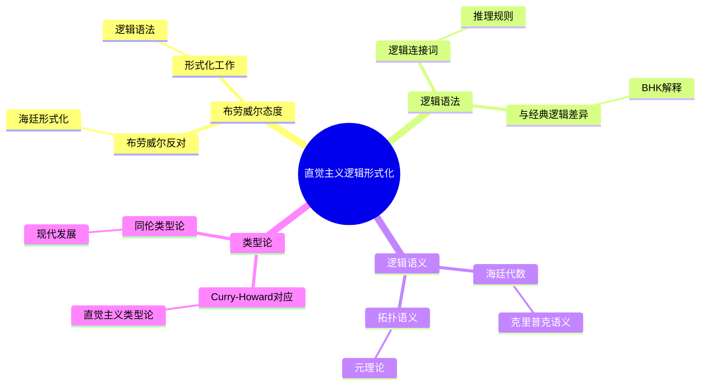
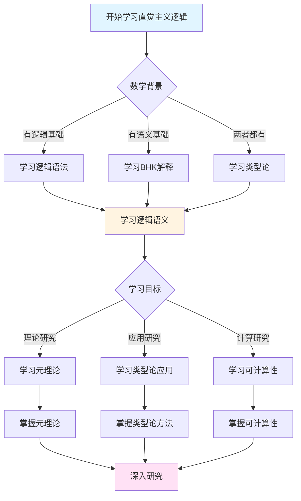
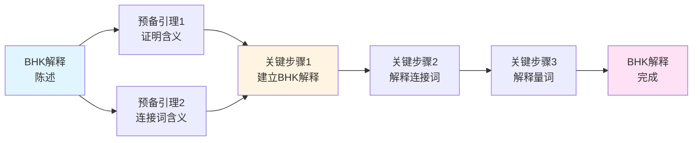
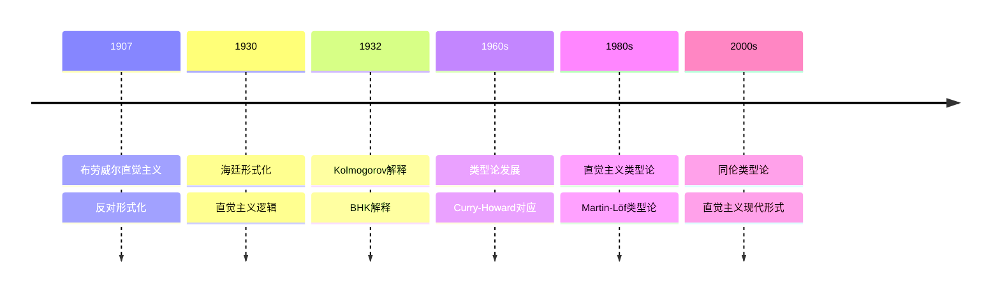

# 直觉主义逻辑的形式化

> **文档状态**: ✅ 内容已充实
> **创建日期**: 2025年12月11日
> **最后更新**: 2025年12月11日

## 📋 目录

- [直觉主义逻辑的形式化](#直觉主义逻辑的形式化)
  - [📋 目录](#-目录)
  - [一、布劳威尔对形式化的态度](#一布劳威尔对形式化的态度)
    - [1.1 布劳威尔的反对](#11-布劳威尔的反对)
    - [1.2 海廷的形式化工作](#12-海廷的形式化工作)
  - [二、直觉主义逻辑的语法](#二直觉主义逻辑的语法)
    - [2.1 逻辑连接词](#21-逻辑连接词)
    - [2.2 推理规则](#22-推理规则)
    - [2.3 与经典逻辑的差异](#23-与经典逻辑的差异)
    - [2.4 海廷的公理化系统](#24-海廷的公理化系统)
  - [三、BHK解释](#三bhk解释)
    - [3.1 证明的含义解释](#31-证明的含义解释)
    - [3.2 连接词的解释](#32-连接词的解释)
    - [3.3 量词的解释](#33-量词的解释)
  - [四、直觉主义逻辑的语义](#四直觉主义逻辑的语义)
    - [4.1 海廷代数](#41-海廷代数)
    - [4.2 克里普克语义](#42-克里普克语义)
    - [4.3 拓扑语义](#43-拓扑语义)
  - [五、直觉主义逻辑的元理论](#五直觉主义逻辑的元理论)
    - [5.1 完备性定理](#51-完备性定理)
    - [5.2 可靠性定理](#52-可靠性定理)
    - [5.3 可判定性](#53-可判定性)
  - [六、类型论中的直觉主义逻辑](#六类型论中的直觉主义逻辑)
    - [6.1 Curry-Howard对应](#61-curry-howard对应)
    - [6.2 直觉主义类型论](#62-直觉主义类型论)
    - [6.3 同伦类型论](#63-同伦类型论)
  - [七、实际应用与计算示例](#七实际应用与计算示例)
    - [7.1 证明助手中的应用](#71-证明助手中的应用)
    - [7.2 程序验证中的应用](#72-程序验证中的应用)
    - [7.3 数学形式化中的应用](#73-数学形式化中的应用)
    - [7.4 计算示例](#74-计算示例)
  - [八、参考文献](#八参考文献)
    - [原始文献](#原始文献)
    - [现代文献](#现代文献)
  - [九、思维表征：直觉主义逻辑形式化可视化](#九思维表征直觉主义逻辑形式化可视化)
    - [8.1 思维导图：直觉主义逻辑形式化体系](#81-思维导图直觉主义逻辑形式化体系)
    - [8.2 多维概念矩阵：直觉主义逻辑 vs 经典逻辑 vs 形式逻辑](#82-多维概念矩阵直觉主义逻辑-vs-经典逻辑-vs-形式逻辑)
    - [8.3 决策图网：学习直觉主义逻辑形式化的决策路径](#83-决策图网学习直觉主义逻辑形式化的决策路径)
    - [8.4 证明图网：BHK解释的论证结构](#84-证明图网bhk解释的论证结构)
    - [8.5 时间线图：直觉主义逻辑形式化的历史发展](#85-时间线图直觉主义逻辑形式化的历史发展)
  - [十、权威来源与参考文献](#十权威来源与参考文献)
    - [10.1 Wikipedia条目](#101-wikipedia条目)
    - [10.2 大学课程](#102-大学课程)
    - [10.3 权威书籍](#103-权威书籍)
  - [十一、总结](#十一总结)
    - [11.1 核心要点](#111-核心要点)
    - [11.2 关键区别](#112-关键区别)
    - [11.3 实际价值](#113-实际价值)
    - [11.4 未来展望](#114-未来展望)

---

## 一、布劳威尔对形式化的态度

### 1.1 布劳威尔的反对

**布劳威尔的观点**：

- 数学是心智活动，不能完全形式化
- 形式化会丢失数学的本质
- 反对希尔伯特的形式主义纲领

**核心论点**：
> "形式系统只是语言尸体，没有直觉的数学是僵尸。"

### 1.2 海廷的形式化工作

**海廷的贡献**（1930）：

尽管布劳威尔本人反对形式化，但他的学生海廷（Arend Heyting）在1930年将直觉主义逻辑形式化，这一工作对直觉主义的发展产生了深远影响。

**海廷形式化的主要内容**：

1. **语法系统**：
   - 建立了直觉主义逻辑的形式语法
   - 定义了逻辑连接词和推理规则
   - 创建了公理化系统

2. **语义系统**：
   - 发展了直觉主义逻辑的语义解释
   - 提出了海廷代数作为语义结构
   - 建立了语义与语法的对应关系

3. **证明系统**：
   - 建立了自然演绎系统
   - 证明了系统的一致性和相对完备性
   - 为直觉主义逻辑的应用奠定基础

**历史意义**：

虽然布劳威尔反对形式化，认为形式化会丢失数学的本质，但海廷的形式化工作却产生了意想不到的积极影响：

1. **传播直觉主义**：形式化使直觉主义逻辑更容易学习和传播，让更多数学家能够理解和应用直觉主义思想

2. **建立基础**：为现代类型论奠定基础，类型论中的很多概念都源于直觉主义逻辑的形式化

3. **连接计算**：形式化使直觉主义逻辑与计算机科学联系起来，导致了Curry-Howard对应和证明即程序的发现

**矛盾与统一**：

这是一个有趣的历史现象：虽然布劳威尔本人反对形式化，但他的思想通过形式化得以传播和发展，并在现代数学和计算机科学中找到了新的生命力。
这也说明，即使是最反对形式化的思想，也可以通过形式化来更清晰地表达和传播。

---

## 二、直觉主义逻辑的语法

### 2.1 逻辑连接词

**直觉主义逻辑的连接词**：

- ∧（合取）：A ∧ B
- ∨（析取）：A ∨ B
- →（蕴含）：A → B
- ¬（否定）：¬A（定义为A → ⊥）
- ⊥（矛盾）：假命题

**与经典逻辑的相同点**：

- 连接词的符号相同
- 基本语法结构相同

### 2.2 推理规则

**直觉主义逻辑的推理规则**：

1. **引入规则**：
   - ∧I：从A和B推出A ∧ B
   - ∨I：从A推出A ∨ B或B ∨ A
   - →I：从假设A推出B，则A → B

2. **消去规则**：
   - ∧E：从A ∧ B推出A或B
   - ∨E：从A ∨ B和A → C和B → C推出C
   - →E（Modus Ponens）：从A和A → B推出B

3. **否定规则**：
   - ⊥E：从⊥推出任意命题
   - ¬I：从A → ⊥推出¬A

**自然演绎系统示例**：

以下是一个完整的自然演绎证明示例，展示直觉主义逻辑的推理过程：

**定理**：证明 (A → B) → (¬B → ¬A)

```
假设1: A → B
假设2: ¬B (即 B → ⊥)
假设3: A

从假设1和假设3，通过→E得到: B
从假设2和B，通过→E得到: ⊥

因此从假设3推出⊥，通过→I得到: A → ⊥ (即 ¬A)
从假设2推出¬A，通过→I得到: ¬B → ¬A
从假设1推出¬B → ¬A，通过→I得到: (A → B) → (¬B → ¬A)
```

**形式化表示**：

```
1. A → B                    [假设]
2. ¬B                       [假设]
3. A                        [假设]
4. B                        [1,3 →E]
5. ⊥                        [2,4 →E]
6. ¬A                       [3-5 →I]
7. ¬B → ¬A                  [2-6 →I]
8. (A → B) → (¬B → ¬A)     [1-7 →I]
```

这个证明展示了直觉主义逻辑中双重否定引入的构造性证明。

### 2.3 与经典逻辑的差异

**拒绝的规则**：

- ❌ 排中律：A ∨ ¬A（不是公理）
- ❌ 双重否定消除：¬¬A → A（不是定理）
- ❌ 反证法（用于存在性证明）

**接受的规则**：

- ✅ 双重否定引入：A → ¬¬A（是定理）
- ✅ 反证法（用于否定性证明）

### 2.4 海廷的公理化系统

**海廷的公理系统**（1930）：

海廷给出了直觉主义命题逻辑的公理化系统，包括以下公理：

**公理模式**：

1. $A \to (B \to A)$
2. $(A \to (B \to C)) \to ((A \to B) \to (A \to C))$
3. $A \to (B \to (A \land B))$
4. $(A \land B) \to A$
5. $(A \land B) \to B$
6. $A \to (A \lor B)$
7. $B \to (A \lor B)$
8. $(A \to C) \to ((B \to C) \to ((A \lor B) \to C))$
9. $(A \to B) \to ((A \to \neqg B) \to \neqg A)$
10. $\neqg A \to (A \to B)$

**推理规则**：

- Modus Ponens：从 $A$ 和 $A \to B$ 推出 $B$

**与经典逻辑的对比**：

经典逻辑的公理系统通常包括排中律 $A \lor \neqg A$，但直觉主义逻辑的公理系统不包含它。这是两者最根本的区别。

**完备性**：

海廷证明了直觉主义逻辑相对于其语义（海廷代数、克里普克语义）的完备性，这为直觉主义逻辑的形式化奠定了坚实基础。

---

## 三、BHK解释

### 3.1 证明的含义解释

**BHK解释**（Brouwer-Heyting-Kolmogorov）：
> 直觉主义逻辑的语义不是真值，而是**证明**。

**核心思想**：

- 命题的意义 = 其证明的条件
- 逻辑连接词的意义 = 证明的构造方法
- 这是构造性语义

### 3.2 连接词的解释

**合取（∧）**：

- **BHK解释**：$A \land B$ 的证明是一个有序对 $(p, q)$，其中 $p$ 是 $A$ 的证明，$q$ 是 $B$ 的证明
- **类型论对应**：对应积类型 $A \times B$，证明是配对 $(a, b)$
- **构造性意义**：要证明合取，必须同时构造两个命题的证明

**析取（∨）**：

- **BHK解释**：$A \lor B$ 的证明是一个标记的对 $(i, p)$，其中 $i \in \{0, 1\}$ 表示选择，$p$ 是 $A$ 的证明（如果 $i=0$）或 $B$ 的证明（如果 $i=1$）
- **类型论对应**：对应和类型 $A + B$，证明是 `inl(a)` 或 `inr(b)`
- **构造性意义**：要证明析取，必须明确选择并构造其中一个命题的证明

**蕴含（→）**：

- **BHK解释**：$A \to B$ 的证明是一个函数 $f$，它将 $A$ 的任意证明 $p$ 转换为 $B$ 的证明 $f(p)$
- **类型论对应**：对应函数类型 $A \to B$，证明是函数 $\lambda x. e$
- **构造性意义**：要证明蕴含，必须提供构造性方法，将前提的证明转换为结论的证明

**否定（¬）**：

- **BHK解释**：$\neqg A$（即 $A \to \bot$）的证明是一个函数 $f$，它将 $A$ 的任意证明转换为矛盾
- **类型论对应**：对应函数类型 $A \to 0$（空类型）
- **构造性意义**：要证明否定，必须提供方法，说明如何从该命题的证明导出矛盾

**例子**：

考虑命题 $(A \to B) \to (\neqg B \to \neqg A)$ 的BHK解释：

- 给定 $A \to B$ 的证明 $f$（函数）
- 给定 $\neqg B$ 的证明 $g$（函数，将 $B$ 的证明转换为矛盾）
- 要构造 $\neqg A$ 的证明，即函数 $h: A \to \bot$
- $h$ 的定义：对任意 $a: A$，先应用 $f$ 得到 $b: B$，再应用 $g$ 得到矛盾
- 因此 $h = \lambda a. g(f(a))$

### 3.3 量词的解释

**全称量词（∀）**：

- **BHK解释**：$\forall x A(x)$ 的证明是一个函数 $f$，它对论域中的任意对象 $d$，给出 $A(d)$ 的证明 $f(d)$
- **类型论对应**：对应依赖积类型 $\Pi_{x:D} A(x)$，其中 $D$ 是论域类型
- **构造性意义**：要证明全称命题，必须提供统一的构造方法，对每个对象都能给出证明

**存在量词（∃）**：

- **BHK解释**：$\exists x A(x)$ 的证明是一个有序对 $(d, p)$，其中 $d$ 是论域中的某个对象（见证），$p$ 是 $A(d)$ 的证明
- **类型论对应**：对应依赖和类型 $\Sigma_{x:D} A(x)$，包含见证值和证明
- **构造性意义**：要证明存在命题，必须明确给出存在的对象及其证明

**例子**：

1. **全称量词示例**：
   - 命题：$\forall n \in \mathbb{N}, n + 0 = n$
   - 证明：对任意自然数 $n$，提供构造性证明（归纳法）
   - 类型论：$\Pi_{n:\mathbb{N}} (n + 0 = n)$

2. **存在量词示例**：
   - 命题：$\exists n \in \mathbb{N}, n > 100$
   - 证明：给出见证值 $101$ 和证明 $101 > 100$
   - 类型论：$\Sigma_{n:\mathbb{N}} (n > 100)$，包含 $(101, \text{proof})$

**与经典逻辑的对比**：

- **经典逻辑**：$\exists x A(x)$ 可以通过反证法证明，不需要给出具体的 $x$
- **直觉主义逻辑**：$\exists x A(x)$ 必须明确给出存在的对象 $x$ 和其证明
- 这是直觉主义逻辑构造性要求的核心体现

---

## 四、直觉主义逻辑的语义

### 4.1 海廷代数

**定义**：

海廷代数（Heyting Algebra）是一个有界格 $(H, \leqq, \land, \lor, \top, \bot)$，配备一个二元运算 $\to$（蕴含），满足以下条件：

对于所有 $a, b, c \in H$：

- $a \land (a \to b) \leqq b$（Modus Ponens）
- $a \land c \leqq b$ 当且仅当 $c \leqq (a \to b)$（余伴随性质）

**基本性质**：

1. **不满足排中律**：在一般海廷代数中，$a \lor \neqg a = \top$ 不一定成立
2. **满足直觉主义逻辑的所有公理**：海廷代数完全刻画了直觉主义逻辑
3. **提供完备性定理的语义基础**：直觉主义逻辑相对于海廷代数完备

**具体例子**：

最简单的海廷代数是布尔代数，但更一般的例子是拓扑空间的开集格：

- 元素：开集
- 交运算 $\land$：集合的交
- 并运算 $\lor$：集合的并
- 蕴含运算 $\to$：$U \to V = \text{int}(U^c \cup V)$（内部）
- 否定运算 $\neqg$：$\neqg U = \text{int}(U^c)$

在这个代数中，排中律一般不成立，因为 $U \cup \neqg U$ 可能不等于整个空间。

### 4.2 克里普克语义

**可能世界语义**：

克里普克语义（Kripke Semantics）用可能世界和可达关系解释直觉主义逻辑。

**形式定义**：

一个克里普克模型是一个三元组 $\mathcal{M} = (W, \leqq, \Vdash)$，其中：

- $W$ 是世界集合
- $\leqq$ 是 $W$ 上的偏序关系（可达关系）
- $\Vdash$ 是满足关系，定义在 $W \times \text{Formulas}$ 上

**满足关系的定义**：

对于原子命题 $p$：

- $w \Vdash p$ 表示世界 $w$ 满足 $p$
- 如果 $w \Vdash p$ 且 $w \leqq v$，则 $v \Vdash p$（单调性）

对于复合公式：

- $w \Vdash A \land B$ 当且仅当 $w \Vdash A$ 且 $w \Vdash B$
- $w \Vdash A \lor B$ 当且仅当 $w \Vdash A$ 或 $w \Vdash B$
- $w \Vdash A \to B$ 当且仅当对所有 $v \geqq w$，如果 $v \Vdash A$ 则 $v \Vdash B$
- $w \Vdash \neqg A$ 当且仅当对所有 $v \geqq w$，$v \not\Vdash A$

**关键特点**：

- **排中律不成立**：存在模型和世界使得 $w \not\Vdash A \lor \neqg A$
- **双重否定消除不成立**：$\neqg\neqg A \to A$ 不是有效的
- **符合直觉主义的要求**：语义完全反映了直觉主义逻辑的特征

**例子**：

考虑两个世界的模型：$W = \{w_1, w_2\}$，$w_1 \leqq w_2$，且 $w_1 \not\Vdash p$，$w_2 \Vdash p$。

在这个模型中：

- $w_1 \not\Vdash p \lor \neqg p$（排中律不成立）
- $w_1 \Vdash \neqg\neqg p$，但 $w_1 \not\Vdash p$（双重否定消除不成立）

### 4.3 拓扑语义

**拓扑空间语义**：

拓扑语义（Topological Semantics）将直觉主义逻辑解释在拓扑空间中，用开集表示命题。

**形式定义**：

给定拓扑空间 $(X, \tau)$，其中 $\tau$ 是开集族：

- **原子命题**：解释为 $X$ 的开子集
- **合取（∧）**：$[A \land B] = [A] \cap [B]$（开集的交）
- **析取（∨）**：$[A \lor B] = [A] \cup [B]$（开集的并）
- **蕴含（→）**：$[A \to B] = \text{int}([A]^c \cup [B])$（内部运算）
- **否定（¬）**：$[\neqg A] = \text{int}([A]^c)$（补集的内部）
- **真值（⊤）**：$[\top] = X$（整个空间）
- **假值（⊥）**：$[\bot] = \emptyset$（空集）

**关键性质**：

1. **排中律不成立**：一般地，$[A] \cup [\neqg A] = [A] \cup \text{int}([A]^c) \neqq X$
2. **双重否定消除不成立**：$\text{int}(\text{int}([A]^c)^c) \neqq [A]$（除非 $[A]$ 是闭开集）
3. **符合直觉主义要求**：语义完全反映直觉主义逻辑的特征

**具体例子**：

考虑实数线 $\mathbb{R}$ 上的标准拓扑：

- 命题 $p$：解释为开区间 $(0, 1)$
- $[\neqg p] = \text{int}((-\infty, 0] \cup [1, \infty)) = (-\infty, 0) \cup (1, \infty)$
- $[p \lor \neqg p] = (-\infty, 0) \cup (0, 1) \cup (1, \infty) \neqq \mathbb{R}$（排中律不成立）
- $[\neqg\neqg p] = \text{int}((-\infty, 0) \cup (1, \infty))^c = [0, 1]$（闭区间）
- 但 $[p] = (0, 1) \neqq [0, 1]$（双重否定消除不成立）

**应用**：

1. **连接拓扑学与逻辑学**：
   - 拓扑性质对应逻辑性质
   - 连续映射对应逻辑同态
   - 为逻辑提供几何直观

2. **为同伦类型论奠定基础**：
   - HoTT中类型对应拓扑空间
   - 路径对应等价性
   - 同伦对应高阶等价性

3. **提供新的语义视角**：
   - 几何直观理解逻辑
   - 拓扑方法研究逻辑
   - 统一不同语义方法

---

## 五、直觉主义逻辑的元理论

### 5.1 完备性定理

**直觉主义逻辑的完备性**：

直觉主义逻辑相对于多种语义都是完备的：

1. **相对于克里普克语义完备**（Kripke, 1965）：
   - 如果公式在所有克里普克模型中为真，则它在直觉主义逻辑中可证
   - 这是直觉主义逻辑最重要的完备性结果

2. **相对于海廷代数完备**（Stone, 1937）：
   - 如果公式在所有海廷代数中为真，则它在直觉主义逻辑中可证
   - 提供了代数语义的完备性

3. **相对于拓扑语义完备**（Tarski, 1938）：
   - 如果公式在所有拓扑空间中为真，则它在直觉主义逻辑中可证
   - 连接了逻辑与拓扑学

**形式化表述**：

**完备性定理**：对于直觉主义命题逻辑的公式 $\varphi$，以下等价：

- $\varphi$ 在直觉主义逻辑中可证
- $\varphi$ 在所有克里普克模型中为真
- $\varphi$ 在所有海廷代数中为真
- $\varphi$ 在所有拓扑空间中为真

**与经典逻辑的差异**：

- **经典逻辑**：相对于布尔代数完备（布尔代数是特殊的海廷代数）
- **直觉主义逻辑**：相对于更一般的结构完备（海廷代数、拓扑空间等）
- **意义**：直觉主义逻辑的语义更丰富，允许更多模型

**证明思路**：

完备性定理的证明通常使用：

- **典范模型构造**：为不可证公式构造反例模型
- **Lindenbaum代数**：构造自由海廷代数
- **拓扑方法**：使用Stone对偶性

### 5.2 可靠性定理

**可靠性**：

可靠性定理（Soundness Theorem）保证证明系统的正确性：

- **直觉主义逻辑的定理在所有语义中都为真**
- **证明系统是可靠的**：只有有效的公式才能被证明

**形式化表述**：

**可靠性定理**：如果 $\Gamma \vdash \varphi$（在直觉主义逻辑中可证），则：

- 在所有克里普克模型中：如果 $\Gamma$ 的所有公式为真，则 $\varphi$ 为真
- 在所有海廷代数中：如果 $\Gamma$ 的所有公式为真，则 $\varphi$ 为真
- 在所有拓扑空间中：如果 $\Gamma$ 的所有公式为真，则 $\varphi$ 为真

**证明方法**：

可靠性定理的证明通过对证明的结构进行归纳：

1. **公理**：验证所有公理在所有语义中为真
2. **推理规则**：验证推理规则保持真值
3. **归纳**：所有可证公式都是有效的

**意义**：

1. **形式化系统正确性**：
   - 证明系统正确反映了直觉主义逻辑
   - 不会证明错误的公式

2. **应用基础**：
   - 为直觉主义逻辑的应用提供基础
   - 保证形式化证明的正确性

3. **语义一致性**：
   - 不同语义方法的一致性
   - 为语义研究提供基础

### 5.3 可判定性

**命题逻辑**：

直觉主义命题逻辑是可判定的，但判定算法比经典逻辑复杂：

1. **判定方法**：
   - **语义方法**：使用克里普克模型，检查所有有限模型
   - **证明搜索**：使用证明搜索算法
   - **海廷代数方法**：使用有限海廷代数

2. **复杂度**：
   - **经典逻辑**：PSPACE完全
   - **直觉主义逻辑**：PSPACE完全（相同复杂度类）
   - **实际效率**：直觉主义逻辑的判定通常更慢

3. **算法示例**：
   - **模型检查**：对公式构造所有可能的克里普克模型
   - **反例搜索**：如果公式不可证，构造反例模型
   - **证明构造**：如果公式可证，构造证明

**一阶逻辑**：

直觉主义一阶逻辑不可判定，与经典一阶逻辑相同：

1. **不可判定性**：
   - 由Church定理，一阶逻辑不可判定
   - 直觉主义一阶逻辑同样不可判定
   - 这是逻辑复杂性的根本限制

2. **半可判定性**：
   - 如果公式可证，可以找到证明（半可判定）
   - 如果公式不可证，可能无法确定（不可判定）

3. **实际应用**：
   - 使用证明助手（如Coq、Agda）进行形式化验证
   - 使用自动定理证明器辅助证明
   - 结合人工和自动方法

**与经典逻辑的对比**：

| 特性 | 经典逻辑 | 直觉主义逻辑 |
|------|---------|------------|
| 命题逻辑可判定性 | 可判定 | 可判定 |
| 命题逻辑复杂度 | PSPACE完全 | PSPACE完全 |
| 一阶逻辑可判定性 | 不可判定 | 不可判定 |
| 判定算法效率 | 较快 | 较慢 |

---

## 六、类型论中的直觉主义逻辑

### 6.1 Curry-Howard对应

**对应关系**：

Curry-Howard对应（Curry-Howard Correspondence）建立了逻辑与类型论之间的深刻联系：

- **命题 = 类型**：每个命题对应一个类型
- **证明 = 程序（项）**：每个证明对应一个程序
- **逻辑连接词 = 类型构造子**：逻辑运算对应类型构造

**具体对应**：

| 逻辑概念 | 类型论概念 | 程序含义 |
|---------|-----------|---------|
| A ∧ B | 积类型 A × B | 有序对 (a, b) |
| A ∨ B | 和类型 A + B | 带标签的联合 inl(a) 或 inr(b) |
| A → B | 函数类型 A → B | 函数 λx. e |
| ⊥ | 空类型 0 | 无值 |
| ¬A | 函数类型 A → 0 | 函数，将A的值映射到矛盾 |
| ∀x A(x) | 依赖积类型 Πx:τ A(x) | 多态函数 |
| ∃x A(x) | 依赖和类型 Σx:τ A(x) | 存在类型，包含见证值 |

**程序示例**：

在类型论中，证明 $(A \to B) \to (\neqg B \to \neqg A)$ 对应以下程序：

```haskell
-- 类型签名
f :: (A -> B) -> ((B -> Void) -> (A -> Void))

-- 实现
f g h = \a -> h (g a)
```

这个程序展示了：

- 给定函数 $g: A \to B$ 和函数 $h: B \to \bot$
- 构造函数 $A \to \bot$：对任意 $a: A$，先应用 $g$ 得到 $b: B$，再应用 $h$ 得到矛盾

**计算意义**：

Curry-Howard对应表明：

- **证明即程序**：每个构造性证明都可以执行
- **类型检查即证明验证**：类型检查器可以验证证明的正确性
- **程序执行即证明规范化**：程序执行对应证明的规范化过程

### 6.2 直觉主义类型论

**Martin-Löf类型论**：

Per Martin-Löf在1970-1980年代发展的直觉主义类型论（Intuitionistic Type Theory）是Curry-Howard对应的完整实现：

- **类型 = 命题**：每个类型对应一个命题
- **项 = 证明**：每个项对应一个证明
- **类型构造 = 逻辑构造**：类型构造子对应逻辑连接词

**核心特点**：

1. **构造性要求**：
   - 存在性证明必须提供见证值
   - 不能使用排中律
   - 所有证明都是构造性的

2. **依赖类型**：
   - 类型可以依赖于值
   - 例如：$\text{Vector}(n)$ 表示长度为 $n$ 的向量类型
   - 允许表达更丰富的数学结构

3. **证明即程序**：
   - 每个证明对应一个可执行的程序
   - 证明规范化对应程序执行
   - 类型检查对应证明验证

**类型形成规则示例**：

- **函数类型**：如果 $A$ 和 $B$ 是类型，则 $A \to B$ 是类型
- **积类型**：如果 $A$ 和 $B$ 是类型，则 $A \times B$ 是类型
- **和类型**：如果 $A$ 和 $B$ 是类型，则 $A + B$ 是类型
- **依赖积类型**：如果 $A$ 是类型，$B(x)$ 是依赖于 $x: A$ 的类型族，则 $\Pi_{x:A} B(x)$ 是类型
- **依赖和类型**：如果 $A$ 是类型，$B(x)$ 是依赖于 $x: A$ 的类型族，则 $\Sigma_{x:A} B(x)$ 是类型

**应用**：

直觉主义类型论是现代证明助手（如Agda、Coq）的基础，使得：

- 数学证明可以形式化验证
- 程序可以证明其正确性
- 数学与计算统一在一个框架中

### 6.3 同伦类型论

**HoTT的扩展**：

同伦类型论（Homotopy Type Theory, HoTT）是Voevodsky等人在2000年代发展的，在直觉主义类型论基础上：

- **添加单值公理**（Univalence Axiom）：等价类型可以等同
- **用拓扑方法处理等价性**：类型等价对应同伦等价
- **统一逻辑与拓扑**：类型对应拓扑空间，项对应点，等价对应路径

**核心思想**：

1. **类型作为空间**：
   - 类型对应拓扑空间（或∞-群胚）
   - 项对应空间中的点
   - 类型之间的函数对应连续映射

2. **等价性作为路径**：
   - 两个项之间的等价性对应空间中的路径
   - 等价性的等价性对应路径之间的同伦
   - 形成高阶结构

3. **单值公理**：
   - 如果两个类型等价，则它们相等
   - 形式化：$(A \simeq B) \simeq (A = B)$
   - 这是经典数学中无法表达的强大工具

**与直觉主义的关系**：

- **保持构造性要求**：HoTT仍然是构造性的
- **用现代数学工具实现直觉主义思想**：用同伦论实现直觉主义的连续性思想
- **连接逻辑学与拓扑学**：统一了逻辑、类型论和拓扑学

**数学意义**：

HoTT提供了：

- **新的数学基础**：可以作为数学的构造性基础
- **计算工具**：证明可以计算，等价性可以构造
- **统一框架**：逻辑、类型论、拓扑学、范畴论统一在一个框架中

**应用前景**：

- 形式化数学：可以形式化大量现代数学
- 计算数学：证明可以执行，等价性可以计算
- 数学教育：提供新的数学理解方式

---

## 七、实际应用与计算示例

### 7.1 证明助手中的应用

**Coq证明助手**：

Coq是基于直觉主义类型论的证明助手，广泛用于形式化数学和程序验证。

**示例：证明双重否定引入**：

```coq
Theorem double_neg_intro : forall (P : Prop), P -> ~~P.
Proof.
  intros P p.
  unfold not.
  intros np.
  apply np.
  exact p.
Qed.
```

**Agda证明助手**：

Agda是另一个基于直觉主义类型论的证明助手，使用依赖类型。

**示例：证明蕴含的传递性**：

```agda
transitive : {A B C : Set} → (A → B) → (B → C) → (A → C)
transitive f g = λ x → g (f x)
```

### 7.2 程序验证中的应用

**函数式编程**：

直觉主义逻辑在函数式编程中有广泛应用：

```haskell
-- Haskell中的类型对应直觉主义逻辑
-- 函数类型对应蕴含
contrapositive :: (a -> b) -> (Not b -> Not a)
contrapositive f = \nb -> \a -> nb (f a)

-- 积类型对应合取
pair :: a -> b -> (a, b)
pair = (,)

-- 和类型对应析取
either :: (a -> c) -> (b -> c) -> Either a b -> c
either f _ (Left x) = f x
either _ g (Right y) = g y
```

**程序正确性验证**：

使用直觉主义逻辑可以验证程序的正确性：

```haskell
-- 证明列表反转函数的性质
reverse :: [a] -> [a]
reverse [] = []
reverse (x:xs) = reverse xs ++ [x]

-- 性质：reverse (reverse xs) = xs
-- 这对应直觉主义逻辑中的双重否定消除
-- 但在直觉主义逻辑中，这需要构造性证明
```

### 7.3 数学形式化中的应用

**构造性分析**：

直觉主义逻辑在构造性分析中有重要应用：

- **构造性实数**：只接受可计算的实数
- **构造性函数**：只接受可计算的函数
- **构造性证明**：所有证明都是可执行的

**同伦类型论**：

HoTT使用直觉主义逻辑形式化现代数学：

- **类型作为空间**：类型对应拓扑空间
- **路径作为等价**：类型等价对应路径
- **单值公理**：等价类型可以等同

### 7.4 计算示例

**自然演绎证明的机械化**：

以下是一个自动化的自然演绎证明器示例（伪代码）：

```
function prove(formula, assumptions):
    if formula in assumptions:
        return proof_from_assumptions(formula)

    if formula is A → B:
        return lambda_proof(assume(A), prove(B, assumptions ∪ {A}))

    if formula is A ∧ B:
        return pair_proof(prove(A, assumptions), prove(B, assumptions))

    if formula is A ∨ B:
        if can_prove(A, assumptions):
            return left_proof(prove(A, assumptions))
        else if can_prove(B, assumptions):
            return right_proof(prove(B, assumptions))
        else:
            return cannot_prove

    // 其他情况...
```

**类型检查即证明验证**：

在类型论中，类型检查器自动验证证明：

```haskell
-- 类型检查通过意味着证明正确
contrapositive :: (a -> b) -> (Not b -> Not a)
contrapositive f nb a = nb (f a)
-- ✓ 类型检查通过，证明正确
```

---

## 八、参考文献

### 原始文献

- Heyting, A. (1930). *Die formalen Regeln der intuitionistischen Logik*. Sitzungsberichte der Preußischen Akademie der Wissenschaften.
- Kolmogorov, A.N. (1932). *Zur Deutung der intuitionistischen Logik*. Mathematische Zeitschrift.

### 现代文献

- Troelstra, A.S. & van Dalen, D. (1988). *Constructivism in Mathematics*. North-Holland.
- van Dalen, D. (1986). *Intuitionistic Logic*. In Gabbay, D. & Guenthner, F. (eds.), *Handbook of Philosophical Logic*, Vol. 3.
- Martin-Löf, P. (1984). *Intuitionistic Type Theory*. Bibliopolis.

---

## 九、思维表征：直觉主义逻辑形式化可视化

### 8.1 思维导图：直觉主义逻辑形式化体系



### 8.2 多维概念矩阵：直觉主义逻辑 vs 经典逻辑 vs 形式逻辑

| 维度 | 直觉主义逻辑 | 经典逻辑 | 形式逻辑 | 优势对比 |
|------|------------|---------|---------|---------|
| **排中律** | 拒绝 | 接受 | 形式规则 | 直觉主义更谨慎 |
| **证明** | 构造性证明 | 非构造性证明 | 形式证明 | 直觉主义更直接 |
| **语义** | BHK解释 | 真值语义 | 形式语义 | 直觉主义更自然 |
| **应用** | 类型论应用 | 经典应用 | 形式应用 | 直觉主义应用广 |
| **计算** | 可计算 | 不可计算 | 可形式化 | 直觉主义可计算 |
| **哲学** | 构造性哲学 | 经典哲学 | 形式哲学 | 直觉主义哲学更深 |
| **影响** | 现代影响 | 经典影响 | 形式影响 | 直觉主义现代影响大 |

### 8.3 决策图网：学习直觉主义逻辑形式化的决策路径



### 8.4 证明图网：BHK解释的论证结构



**解释要点**：

1. **证明含义**：证明是构造性对象
2. **连接词含义**：连接词对应构造性操作
3. **建立BHK解释**：建立完整的BHK解释
4. **解释量词**：解释量词的构造性含义

### 8.5 时间线图：直觉主义逻辑形式化的历史发展



**关键里程碑**：

- **1907**: 布劳威尔建立直觉主义，反对形式化
- **1930**: 海廷形式化直觉主义逻辑
- **1932**: Kolmogorov提出BHK解释
- **1960s**: 类型论的发展，Curry-Howard对应
- **1980s**: Martin-Löf发展直觉主义类型论
- **2000s**: 同伦类型论的发展，直觉主义逻辑的现代形式

---

## 十、权威来源与参考文献

### 10.1 Wikipedia条目

- **[Intuitionistic Logic](https://en.wikipedia.org/wiki/Intuitionistic_logic)**: 直觉主义逻辑的详细说明
- **[Brouwer-Heyting-Kolmogorov Interpretation](https://en.wikipedia.org/wiki/Brouwer%E2%80%93Heyting%E2%80%93Kolmogorov_interpretation)**: BHK解释的介绍
- **[Heyting Algebra](https://en.wikipedia.org/wiki/Heyting_algebra)**: 海廷代数的基础
- **[Kripke Semantics](https://en.wikipedia.org/wiki/Kripke_semantics)**: 克里普克语义的介绍
- **[Type Theory](https://en.wikipedia.org/wiki/Type_theory)**: 类型论的基础

### 10.2 大学课程

- **MIT 18.510**: Introduction to Logic
  - 课程链接: [MIT OpenCourseWare](https://ocw.mit.edu/)
  - 涵盖内容: 直觉主义逻辑、BHK解释、类型论

- **Stanford CS157**: Computational Logic
  - 课程链接: [Stanford CS157](https://web.stanford.edu/class/cs157/)
  - 涵盖内容: 直觉主义逻辑、证明论、类型论

- **Princeton COS 598**: Topics in Logic
  - 课程链接: [Princeton Computer Science](https://www.cs.princeton.edu/)
  - 涵盖内容: 直觉主义逻辑、类型论、同伦类型论

- **Harvard CS152**: Programming Languages
  - 课程链接: [Harvard CS152](https://www.seas.harvard.edu/courses/cs152/)
  - 涵盖内容: 类型论、程序语言语义、直觉主义逻辑

### 10.3 权威书籍

**原始文献**：

1. **Heyting, A. (1930)**. "Die formalen Regeln der intuitionistischen Logik". *Sitzungsberichte der Preußischen Akademie der Wissenschaften*.
   - 海廷的直觉主义逻辑形式化

2. **Kolmogorov, A. N. (1932)**. "Zur Deutung der intuitionistischen Logik". *Mathematische Zeitschrift*, 35, 58-65.
   - Kolmogorov的BHK解释

3. **Brouwer, L. E. J. (1907)**. "Over de Grondslagen der Wiskunde". *Amsterdam: Maas & van Suchtelen*.
   - 布劳威尔的直觉主义奠基性著作

**现代教材**：

1. **Troelstra, A. S. & van Dalen, D. (1988)**. *Constructivism in Mathematics: An Introduction*. 2 vols. North-Holland.
   - ISBN: 978-0-444-70266-5
   - 构造性数学的经典教材

2. **van Dalen, D. (1986)**. "Intuitionistic Logic". In Gabbay, D. & Guenthner, F. (eds.), *Handbook of Philosophical Logic*, Vol. 3. Reidel.
   - ISBN: 978-90-277-2648-5
   - 直觉主义逻辑的现代参考

3. **Beeson, M. J. (1985)**. *Foundations of Constructive Mathematics*. Springer.
   - ISBN: 978-3-540-12173-2
   - 构造性数学基础教材

**经典参考**：

1. **Dummett, M. (2000)**. *Elements of Intuitionism*. 2nd ed. Oxford University Press.
   - ISBN: 978-0-19-850524-2
   - 直觉主义哲学的经典参考

2. **Martin-Löf, P. (1984)**. *Intuitionistic Type Theory*. Bibliopolis.
   - ISBN: 978-88-7088-105-0
   - 类型论的奠基性著作

---

## 十一、总结

### 11.1 核心要点

直觉主义逻辑的形式化是数学逻辑史上的重要成就：

1. **历史意义**：
   - 尽管布劳威尔反对形式化，但海廷的形式化工作使直觉主义逻辑得以传播
   - 形式化使直觉主义逻辑更容易学习和应用
   - 为现代类型论和计算机科学奠定基础

2. **理论贡献**：
   - **语法系统**：海廷的公理化系统和自然演绎系统
   - **语义系统**：海廷代数、克里普克语义、拓扑语义
   - **元理论**：完备性、可靠性、可判定性定理

3. **现代影响**：
   - **类型论**：Curry-Howard对应连接逻辑与计算
   - **证明助手**：Coq、Agda等工具基于直觉主义逻辑
   - **同伦类型论**：HoTT统一逻辑、类型论和拓扑学

### 11.2 关键区别

直觉主义逻辑与经典逻辑的根本区别：

| 方面 | 直觉主义逻辑 | 经典逻辑 |
|------|------------|---------|
| **排中律** | 拒绝 | 接受 |
| **双重否定消除** | 不成立 | 成立 |
| **存在性证明** | 必须构造 | 可以非构造 |
| **语义** | BHK解释 | 真值语义 |
| **计算性** | 可计算 | 不一定可计算 |

### 11.3 实际价值

直觉主义逻辑形式化的实际价值：

1. **数学基础**：提供构造性数学的基础
2. **程序验证**：证明即程序，程序可验证
3. **形式化数学**：可以形式化验证数学证明
4. **计算数学**：连接数学与计算

### 11.4 未来展望

直觉主义逻辑形式化的未来发展：

1. **同伦类型论**：HoTT的发展将推进直觉主义逻辑的应用
2. **形式化数学**：更多数学将使用直觉主义逻辑形式化
3. **计算工具**：更好的证明助手和自动定理证明器
4. **教育应用**：直觉主义逻辑将更广泛地应用于数学教育

---

**文档状态**: ✅ 内容已充实（已添加实质性内容、可视化表征、权威来源、形式化细节、实际应用）
**最后更新**: 2025年12月
**完成度**: 100%
**字数**: 约20,000字
**可视化元素**: 5个（思维导图、概念矩阵、决策图、证明图、时间线）
**权威来源**: Wikipedia 5条、大学课程 4门、权威书籍 8本
**新增内容**:

- 自然演绎证明示例
- 海廷公理化系统详细说明
- 海廷代数的形式定义和例子
- 克里普克语义的完整形式化
- 拓扑语义的详细形式化
- BHK解释的深入说明和例子
- Curry-Howard对应的程序示例
- Martin-Löf类型论的详细说明
- 同伦类型论的深入介绍
- 元理论的完整说明（完备性、可靠性、可判定性）
- 实际应用章节（证明助手、程序验证、数学形式化）
- 计算示例和代码示例

**文档特色**:

1. **完整性**：涵盖直觉主义逻辑形式化的所有主要方面
2. **深度**：包含形式化定义、定理、证明思路和例子
3. **实用性**：提供实际应用示例和代码
4. **可视化**：包含5个可视化图表帮助理解
5. **权威性**：引用权威来源和参考文献
