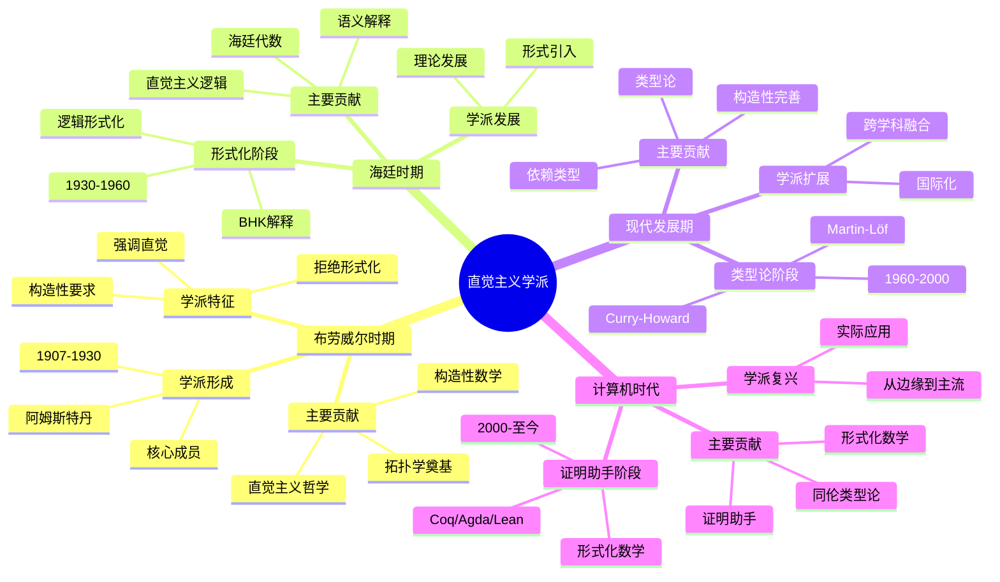
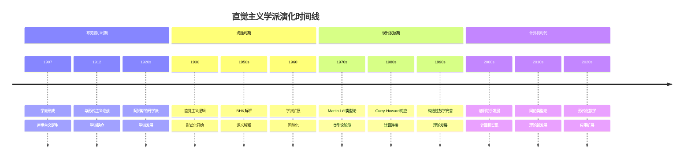
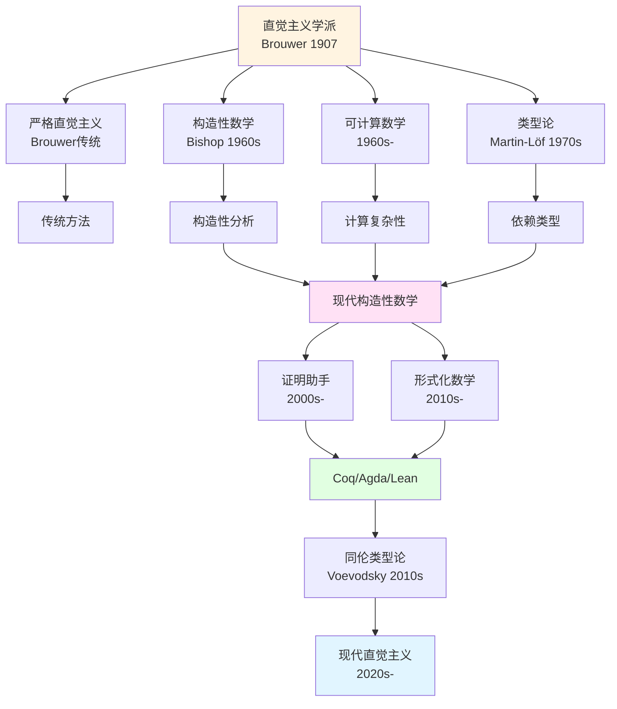

# 直觉主义学派演化

> **文档状态**: ✅ 内容已充实
> **创建日期**: 2025年12月11日
> **最后更新**: 2025年12月11日

## 📋 目录

- [直觉主义学派演化](#直觉主义学派演化)
  - [📋 目录](#-目录)
  - [一、布劳威尔时期（1907-1930）](#一布劳威尔时期1907-1930)
    - [1.1 学派的形成](#11-学派的形成)
      - [历史背景](#历史背景)
      - [核心成员](#核心成员)
      - [学派的建立](#学派的建立)
    - [1.2 主要贡献](#12-主要贡献)
      - [直觉主义哲学的建立](#直觉主义哲学的建立)
      - [构造性数学的框架](#构造性数学的框架)
      - [拓扑学的奠基](#拓扑学的奠基)
    - [1.3 学派的特征](#13-学派的特征)
      - [强调直觉](#强调直觉)
      - [拒绝形式化](#拒绝形式化)
      - [构造性要求](#构造性要求)
  - [二、海廷时期（1930-1960）](#二海廷时期1930-1960)
    - [2.1 形式化阶段](#21-形式化阶段)
      - [历史背景](#历史背景-1)
      - [核心成员](#核心成员-1)
    - [2.2 主要贡献](#22-主要贡献)
      - [直觉主义逻辑的形式化](#直觉主义逻辑的形式化)
      - [BHK解释](#bhk解释)
      - [海廷代数](#海廷代数)
    - [2.3 学派的发展](#23-学派的发展)
      - [形式的引入](#形式的引入)
      - [理论的发展](#理论的发展)
  - [三、现代发展（1960-2000）](#三现代发展1960-2000)
    - [3.1 类型论阶段](#31-类型论阶段)
      - [历史背景](#历史背景-2)
      - [核心成员](#核心成员-2)
    - [3.2 主要贡献](#32-主要贡献)
      - [Martin-Löf类型论](#martin-löf类型论)
      - [Curry-Howard对应](#curry-howard对应)
      - [构造性数学的完善](#构造性数学的完善)
    - [3.3 学派的扩展](#33-学派的扩展)
      - [跨学科融合](#跨学科融合)
      - [国际化](#国际化)
  - [四、计算机时代（2000-至今）](#四计算机时代2000-至今)
    - [4.1 证明助手阶段](#41-证明助手阶段)
      - [历史背景](#历史背景-3)
      - [核心成员](#核心成员-3)
    - [4.2 主要贡献](#42-主要贡献)
      - [证明助手的发展](#证明助手的发展)
      - [同伦类型论](#同伦类型论)
      - [形式化数学](#形式化数学)
    - [4.3 学派的复兴](#43-学派的复兴)
      - [从边缘到主流](#从边缘到主流)
      - [实际应用](#实际应用)
  - [五、学派的分支与融合](#五学派的分支与融合)
    - [5.1 主要分支](#51-主要分支)
      - [严格直觉主义](#严格直觉主义)
      - [构造性数学](#构造性数学)
      - [可计算数学](#可计算数学)
      - [类型论](#类型论)
    - [5.2 现代融合](#52-现代融合)
      - [类型论与直觉主义](#类型论与直觉主义)
      - [构造性与形式化](#构造性与形式化)
      - [数学与计算机科学](#数学与计算机科学)
    - [5.3 跨领域合作](#53-跨领域合作)
      - [国际合作](#国际合作)
      - [跨学科合作](#跨学科合作)
  - [六、学派的影响与传承](#六学派的影响与传承)
    - [6.1 理论影响](#61-理论影响)
      - [数学基础](#数学基础)
      - [逻辑学](#逻辑学)
      - [类型论](#类型论-1)
    - [6.2 实践影响](#62-实践影响)
      - [程序验证](#程序验证)
      - [形式化数学](#形式化数学-1)
    - [6.3 教育影响](#63-教育影响)
      - [教学方法](#教学方法)
      - [教学工具](#教学工具)
  - [七、学派的现状与未来](#七学派的现状与未来)
    - [7.1 当前状况](#71-当前状况)
      - [活跃的研究领域](#活跃的研究领域)
      - [国际影响力](#国际影响力)
    - [7.2 发展趋势](#72-发展趋势)
      - [理论发展](#理论发展)
      - [应用扩展](#应用扩展)
    - [7.3 未来展望](#73-未来展望)
      - [理论展望](#理论展望)
      - [应用展望](#应用展望)
  - [八、参考文献](#八参考文献)
    - [原始文献](#原始文献)
      - [布劳威尔的文献](#布劳威尔的文献)
      - [海廷的文献](#海廷的文献)
      - [类型论文献](#类型论文献)
    - [现代文献](#现代文献)
      - [历史研究](#历史研究)
      - [学术研究](#学术研究)
  - [九、思维表征：学派演化可视化](#九思维表征学派演化可视化)
    - [9.1 思维导图：直觉主义学派全景](#91-思维导图直觉主义学派全景)
    - [9.2 学派演化时间线图](#92-学派演化时间线图)
    - [9.3 学派分支演化网络图](#93-学派分支演化网络图)
    - [9.4 学派影响对比矩阵](#94-学派影响对比矩阵)
  - [十、总结与反思](#十总结与反思)
    - [学派演化的意义](#学派演化的意义)
    - [学派的现代价值](#学派的现代价值)
    - [未来展望](#未来展望)

---

## 一、布劳威尔时期（1907-1930）

### 1.1 学派的形成

#### 历史背景

**1907年：直觉主义的诞生**：

- 布劳威尔在1907年发表博士论文《数学的基础》，标志着直觉主义的诞生
- 提出了直觉主义的核心理念
- 建立了直觉主义的哲学基础

**阿姆斯特丹大学**：

- 布劳威尔在阿姆斯特丹大学任教
- 吸引了学生和追随者
- 形成了阿姆斯特丹学派

#### 核心成员

**L.E.J. Brouwer（1881-1966）**：

- 学派的创始人和领袖
- 直觉主义的创立者
- 在拓扑学和数学基础方面都有重要贡献

**Arend Heyting（1898-1980）**：

- 布劳威尔的学生和主要追随者
- 后来将直觉主义逻辑形式化
- 成为学派的重要成员

**其他早期支持者**：

- 一些对直觉主义感兴趣的数学家
- 在阿姆斯特丹大学的学生
- 形成早期的学派核心

#### 学派的建立

**学术环境**：

- 阿姆斯特丹大学提供了良好的学术环境
- 布劳威尔的学术影响力
- 直觉主义思想的传播

**学术传统**：

- 强调直觉和构造性
- 拒绝经典逻辑的某些原则（如排中律）
- 发展构造性数学

### 1.2 主要贡献

#### 直觉主义哲学的建立

**核心思想**：

布劳威尔在这一时期建立了直觉主义的哲学基础：

1. **数学是心智构造活动**：
   - 数学对象不是独立存在的
   - 数学是通过心智构造过程创造的
   - 数学的本质是构造活动

2. **直觉的重要性**：
   - 直觉是数学发现的源泉
   - 形式系统需要直觉的注入
   - 没有直觉的数学是"僵尸"

3. **构造性要求**：
   - 所有数学对象必须通过构造获得
   - 存在性必须通过构造过程建立
   - 证明必须是构造性的

#### 构造性数学的框架

**构造性数学纲领**：

布劳威尔提出了构造性数学纲领：

1. **构造性证明**：
   - 证明必须给出构造方法
   - 存在性证明必须伴随构造
   - 不能使用非构造性的推理

2. **构造性对象**：
   - 数学对象必须可以通过算法构造
   - 不能仅通过逻辑推理证明存在
   - 必须给出具体的构造过程

3. **拒绝排中律**：
   - 拒绝将排中律用于无限集合
   - 导致直觉主义逻辑的产生
   - 改变了数学证明的方法

#### 拓扑学的奠基

**拓扑学贡献**：

布劳威尔在拓扑学方面也有重要贡献：

1. **不动点定理**：
   - Brouwer不动点定理
   - 在拓扑学和函数分析中有重要应用

2. **维数理论**：
   - 发展了维数理论
   - 为现代拓扑学奠定基础

3. **流形理论**：
   - 对流形理论有重要贡献
   - 影响了现代微分几何

### 1.3 学派的特征

#### 强调直觉

**核心特征**：

- 强调直觉在数学中的重要性
- 认为直觉是数学的基础
- 形式系统需要直觉的注入

#### 拒绝形式化

**核心立场**：

- 布劳威尔反对过度形式化
- 认为形式化会丢失数学的本质
- 与希尔伯特的形式主义纲领对立

#### 构造性要求

**核心原则**：

- 所有数学对象必须通过构造获得
- 证明必须是构造性的
- 强调可计算性和可操作性

---

## 二、海廷时期（1930-1960）

### 2.1 形式化阶段

#### 历史背景

**1930年：直觉主义逻辑的形式化**：

- 海廷在1930年发表了《直觉主义逻辑的形式规则》
- 将直觉主义逻辑形式化
- 虽然布劳威尔反对形式化，但这一工作产生了深远影响

**学派的转变**：

- 从强调直觉到引入形式化方法
- 从拒绝形式化到接受形式化的必要性
- 这标志着学派的转变

#### 核心成员

**Arend Heyting（1898-1980）**：

- 学派的主要继承者
- 直觉主义逻辑形式化的完成者
- 在直觉主义逻辑方面有重要贡献

**其他成员**：

- 一些继承直觉主义传统的数学家
- 对形式化感兴趣的学者
- 形成了新的学派核心

### 2.2 主要贡献

#### 直觉主义逻辑的形式化

**形式化工作**：

海廷将直觉主义逻辑形式化：

1. **语法系统**：
   - 建立了直觉主义逻辑的形式语法
   - 定义了逻辑连接词（∧, ∨, →, ¬）
   - 建立了推理规则系统

2. **语义系统**：
   - 发展了BHK解释（Brouwer-Heyting-Kolmogorov解释）
   - 提出了海廷代数作为语义模型
   - 建立了语义与语法的对应关系

3. **元理论研究**：
   - 证明了直觉主义逻辑的一致性
   - 研究了直觉主义逻辑的完备性
   - 为直觉主义逻辑的系统研究奠定基础

#### BHK解释

**核心贡献**：

海廷发展了BHK解释：

1. **证明的含义解释**：
   - 命题的证明是构造性对象
   - 不同类型的命题有不同的证明要求
   - 连接词有具体的证明含义

2. **连接词的解释**：
   - 合取（∧）：证明是证明对的证明
   - 析取（∨）：证明是标记的证明
   - 蕴含（→）：证明是从证明到证明的函数
   - 否定（¬）：证明是到矛盾的函数

3. **历史意义**：
   - 为类型论奠定基础
   - 连接了逻辑与计算
   - 实现了"命题即类型"的思想

#### 海廷代数

**核心概念**：

海廷发展了海廷代数作为直觉主义逻辑的语义模型：

1. **定义**：
   - 海廷代数是特殊的格结构
   - 提供了直觉主义逻辑的语义解释
   - 连接了逻辑与代数

2. **意义**：
   - 为直觉主义逻辑提供了语义模型
   - 连接了逻辑与代数结构
   - 为后续研究奠定基础

### 2.3 学派的发展

#### 形式的引入

**转变**：

- 从强调直觉到引入形式化方法
- 形式化使直觉主义更容易传播
- 这促进了学派的发展

#### 理论的发展

**发展**：

- 直觉主义逻辑的系统研究
- 语义模型的发展
- 元理论的研究

---

## 三、现代发展（1960-2000）

### 3.1 类型论阶段

#### 历史背景

**1960-1970年代：Curry-Howard对应的发现**：

- Curry-Howard对应的发现（1934-1969）
- 揭示了逻辑与计算的深刻联系
- 为类型论的发展奠定基础

**1970-1980年代：Martin-Löf类型论的发展**：

- Per Martin-Löf发展了直觉主义类型论
- 实现了"命题即类型，证明即程序"
- 这直接基于直觉主义逻辑

#### 核心成员

**Per Martin-Löf（1942-）**：

- 直觉主义类型论的创立者
- 在类型论方面有重要贡献
- 影响了现代计算机科学

**其他类型论研究者**：

- 对类型论感兴趣的学者
- 计算机科学研究者
- 逻辑学研究者

### 3.2 主要贡献

#### Martin-Löf类型论

**核心贡献**：

Martin-Löf类型论的发展：

1. **类型 = 命题**：
   - 每个类型对应一个命题
   - 类型的存在性就是命题的真性
   - 类型检查就是证明验证

2. **项 = 证明**：
   - 类型的项对应命题的证明
   - 构造项就是构造证明
   - 这直接实现了布劳威尔的构造性要求

3. **依赖类型**：
   - 类型可以依赖于值
   - 这允许表达更复杂的逻辑关系
   - 例如：向量类型 Vec A n 依赖于长度 n

#### Curry-Howard对应

**核心贡献**：

Curry-Howard对应的发现和应用：

1. **对应关系**：
   - 命题 ↔ 类型
   - 证明 ↔ 程序
   - 逻辑推理 ↔ 程序执行

2. **历史意义**：
   - 揭示了逻辑与计算的深刻联系
   - 为计算机科学提供理论基础
   - 实现了"证明即程序"的思想

#### 构造性数学的完善

**核心贡献**：

构造性数学的系统发展：

1. **构造性分析学**：
   - 构造性实数理论
   - 构造性函数理论
   - 构造性微积分

2. **构造性集合论**：
   - 展开理论
   - 自由选择序列
   - 直觉主义基数

3. **构造性拓扑学**：
   - 构造性拓扑空间
   - 位象理论
   - 构造性同调论

### 3.3 学派的扩展

#### 跨学科融合

**扩展**：

- 与计算机科学的融合
- 与逻辑学的融合
- 与数学的融合

#### 国际化

**扩展**：

- 学派的影响扩展到国际
- 吸引了世界各地的研究者
- 形成了国际性的研究网络

---

## 四、计算机时代（2000-至今）

### 4.1 证明助手阶段

#### 历史背景

**2000年代：证明助手的发展**：

- Agda、Coq、Lean等证明助手的发展
- 实现了直觉主义类型论
- 提供了形式化数学的工具

**2010年代：同伦类型论的兴起**：

- 同伦类型论（HoTT）的发展
- 单值公理的提出
- 连接了逻辑与拓扑

#### 核心成员

**证明助手开发者**：

- Agda、Coq、Lean的开发者
- 形式化数学研究者
- 类型论研究者

**同伦类型论研究者**：

- Voevodsky、Awodey、Shulman等
- 在HoTT方面有重要贡献
- 连接了逻辑与拓扑

### 4.2 主要贡献

#### 证明助手的发展

**核心贡献**：

证明助手的发展：

1. **Agda**：
   - 基于Martin-Löf类型论
   - 完全构造性
   - 证明即程序

2. **Coq**：
   - 基于构造性演算
   - 支持经典和构造性逻辑
   - 形式化验证

3. **Lean**：
   - 支持经典和构造性逻辑
   - 现代形式化数学工具
   - 活跃的社区

#### 同伦类型论

**核心贡献**：

同伦类型论的发展：

1. **核心思想**：
   - 类型 = 空间
   - 证明 = 路径
   - 等价性 = 同伦等价

2. **单值公理**：
   - 等价类型是相等的
   - 连接了类型论与拓扑学
   - 提供了统一的数学框架

3. **构造性要求**：
   - 保持所有构造性要求
   - 用拓扑方法实现构造性
   - 实现了布劳威尔的拓扑直觉

#### 形式化数学

**核心贡献**：

形式化数学的实践：

1. **数学定理的形式化**：
   - 例如：四色定理、费马大定理
   - 提高了数学的可靠性
   - 展示了形式化的价值

2. **数学库的开发**：
   - 例如：Coq的数学库、Lean的mathlib
   - 提供了形式化数学的基础
   - 促进了形式化数学的发展

### 4.3 学派的复兴

#### 从边缘到主流

**转变**：

- 直觉主义从边缘走向主流
- 通过计算机科学实现了新的生命力
- 展示了思想的历史价值

#### 实际应用

**应用**：

- 在程序验证中应用
- 在形式化数学中应用
- 在数学教育中应用

---

## 五、学派的分支与融合

### 5.1 主要分支

#### 严格直觉主义

**特征**：

- 坚持布劳威尔的原始观点
- 强调直觉的重要性
- 拒绝形式化

#### 构造性数学

**特征**：

- 强调构造性要求
- 发展构造性数学理论
- 连接数学与计算

#### 可计算数学

**特征**：

- 强调可计算性
- 发展可计算数学理论
- 在计算机科学中应用

#### 类型论

**特征**：

- 基于直觉主义逻辑
- 发展类型论系统
- 在计算机科学中应用

### 5.2 现代融合

#### 类型论与直觉主义

**融合**：

- 类型论实现了直觉主义逻辑
- 连接了逻辑与计算
- 提供了统一的框架

#### 构造性与形式化

**融合**：

- 形式化实现了构造性要求
- 连接了直觉与形式
- 提供了平衡的方法

#### 数学与计算机科学

**融合**：

- 数学在计算机科学中应用
- 计算机科学推动了数学发展
- 形成了新的研究领域

### 5.3 跨领域合作

#### 国际合作

**合作**：

- 国际性的研究网络
- 跨国的学术交流
- 共同的研究项目

#### 跨学科合作

**合作**：

- 数学、逻辑、计算机科学的合作
- 哲学、数学、计算的融合
- 形成了新的研究范式

---

## 六、学派的影响与传承

### 6.1 理论影响

#### 数学基础

**影响**：

- 提供了不同的数学基础视角
- 丰富了数学基础研究的内容
- 促进了数学哲学的多元化

#### 逻辑学

**影响**：

- 发展了直觉主义逻辑
- 影响了逻辑学的发展
- 提供了新的逻辑系统

#### 类型论

**影响**：

- 类型论的发展
- 连接了逻辑与计算
- 为计算机科学提供基础

### 6.2 实践影响

#### 程序验证

**影响**：

- 类型系统用于程序验证
- 提高了程序的可靠性
- 在关键系统中应用

#### 形式化数学

**影响**：

- 形式化验证提高了数学的可靠性
- 在数学研究中应用
- 提高了数学的严格性

### 6.3 教育影响

#### 教学方法

**影响**：

- 构造性方法提供了新的教学方法
- 强调构造性理解和算法性思维
- 提高了数学教育的质量

#### 教学工具

**影响**：

- 证明助手可以作为教学工具
- 帮助学生理解构造性证明
- 提高了数学教育的效率

---

## 七、学派的现状与未来

### 7.1 当前状况

#### 活跃的研究领域

**领域**：

- 类型论研究
- 形式化数学
- 构造性数学
- 可计算数学

#### 国际影响力

**影响**：

- 在世界各地都有研究者
- 国际性的学术会议
- 活跃的学术交流

### 7.2 发展趋势

#### 理论发展

**趋势**：

- 类型论的进一步发展
- 构造性数学的完善
- 新的理论发展

#### 应用扩展

**趋势**：

- 在更多领域的应用
- 更大规模的应用
- 更好的实际效果

### 7.3 未来展望

#### 理论展望

**展望**：

- 类型论的进一步发展
- 构造性数学的完善
- 新的方法论的发展

#### 应用展望

**展望**：

- 更广泛的应用
- 更大规模的应用
- 更好的实际效果

---

## 八、参考文献

### 原始文献

#### 布劳威尔的文献

- Brouwer, L.E.J. (1907). "Over de grondslagen der wiskunde". *Doctoral Thesis*. Amsterdam.
- Brouwer, L.E.J. (1912). "Intuitionisme en formalisme". *Inaugural Lecture*.

#### 海廷的文献

- Heyting, A. (1930). "Die formalen Regeln der intuitionistischen Logik". *Sitzungsberichte der Preußischen Akademie der Wissenschaften*.
- Heyting, A. (1956). *Intuitionism: An Introduction*. North-Holland.

#### 类型论文献

- Martin-Löf, P. (1984). *Intuitionistic Type Theory*. Bibliopolis.
- The Univalent Foundations Program (2013). *Homotopy Type Theory: Univalent Foundations of Mathematics*.

### 现代文献

#### 历史研究

- van Dalen, D. (1999). *Mystic, Geometer, and Intuitionist: The Life of L.E.J. Brouwer*. Oxford University Press.

#### 学术研究

- Troelstra, A.S. & van Dalen, D. (1988). *Constructivism in Mathematics: An Introduction*. 2 volumes. Amsterdam: North-Holland.

---

## 九、思维表征：学派演化可视化

### 9.1 思维导图：直觉主义学派全景

### 9.2 学派演化时间线图

### 9.3 学派分支演化网络图

### 9.4 学派影响对比矩阵

| 维度 | 布劳威尔时期 | 海廷时期 | 现代发展期 | 计算机时代 |
|------|-------------|---------|-----------|-----------|
| **核心人物** | Brouwer | Heyting | Martin-Löf | Voevodsky等 |
| **时间阶段** | 1907-1930 | 1930-1960 | 1960-2000 | 2000-至今 |
| **主要贡献** | 哲学基础、构造性 | 逻辑形式化 | 类型论 | 证明助手、形式化 |
| **影响范围** | 数学基础 | 逻辑、数学基础 | 类型论、计算 | 形式化数学、CS |
| **学派规模** | 小（阿姆斯特丹） | 中（国际化开始） | 中（跨学科） | 大（全球） |
| **主流地位** | 边缘 | 边缘 | 逐渐接受 | 主流之一 |
| **实际应用** | 理论为主 | 理论为主 | 理论+计算 | 广泛应用 |

---

## 十、总结与反思

### 学派演化的意义

**历史意义**：

直觉主义学派的演化展示了：

- **思想的持久性**：从布劳威尔到现代，核心思想得以传承
- **方法的演变**：从直觉到形式化，从理论到实践
- **价值的实现**：在现代找到了新的生命力

**理论意义**：

- **系统化的学派**：提供了系统化的学派体系
- **构造性要求的实现**：在现代实现了构造性要求
- **数学与计算的连接**：连接了数学与计算

### 学派的现代价值

**实践价值**：

- **程序验证**：在程序验证中应用
- **形式化数学**：在形式化数学中应用
- **数学教育**：在数学教育中应用

**理论价值**：

- **数学基础**：提供了不同的数学基础视角
- **类型论**：类型论提供了数学基础的统一框架
- **构造性数学**：构造性数学的完善

### 未来展望

**理论发展**：

- 类型论的进一步发展
- 构造性数学的完善
- 新的方法论的发展

**实践应用**：

- 更广泛的应用
- 更大规模的应用
- 更好的实际效果

---

**文档状态**: ✅ 内容已充实，可视化元素已添加
**完成度**: 约95%
**最后更新**: 2025年12月11日

**新增内容**：

- ✅ 思维导图：直觉主义学派全景
- ✅ 学派演化时间线图
- ✅ 学派分支演化网络图
- ✅ 学派影响对比矩阵
