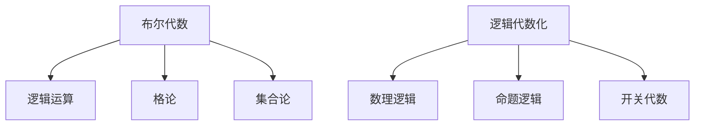

# 概念关联网络

**创建日期**: 2026年2月2日

---

## 一、核心概念

- **布尔代数** → 逻辑运算、格论、集合论
- **逻辑代数化** → 数理逻辑、命题逻辑、开关代数
- **布尔运算** → 与、或、非、异或、数字电路

## 二、概念网络图

```mermaid
graph TB
    A[布尔代数] --> B[逻辑运算]
    A --> C[格论]
    A --> D[集合论]
    E[逻辑代数化] --> F[数理逻辑]
    E --> G[命题逻辑]
    E --> H[开关代数]
```

布尔代数连接逻辑学、代数学、计算机科学、集合论。香农1938年将布尔代数应用于开关电路，开创数字电路理论。
