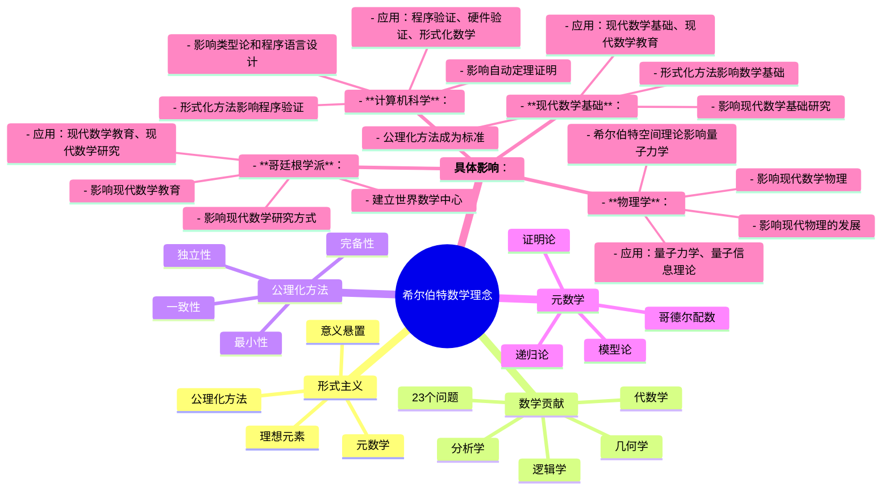
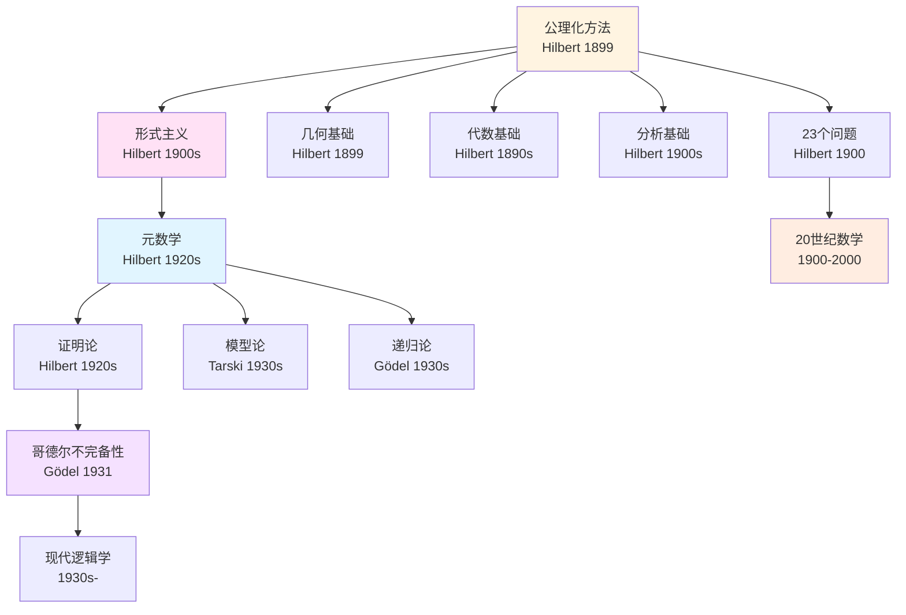
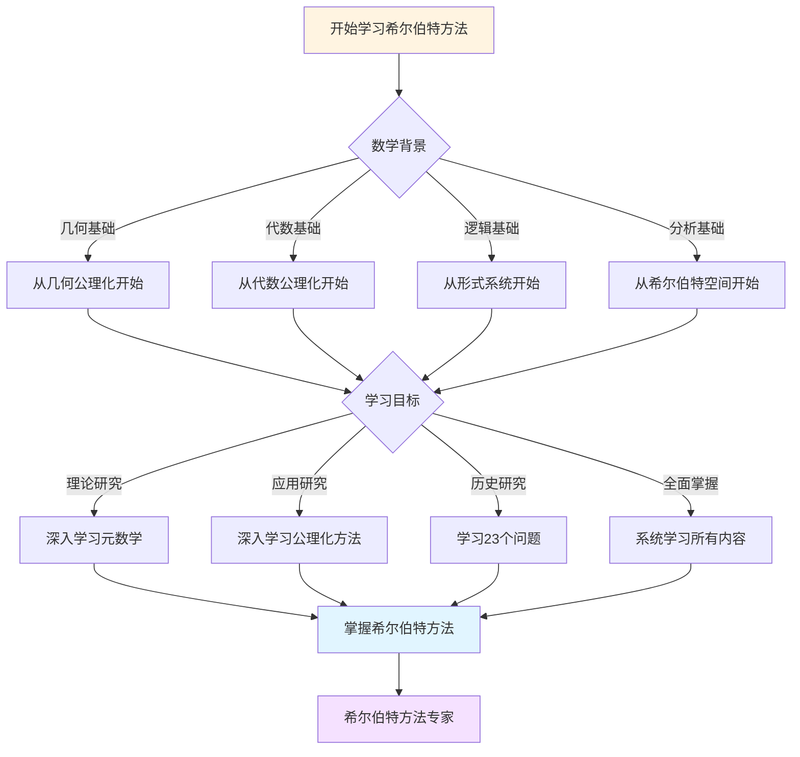
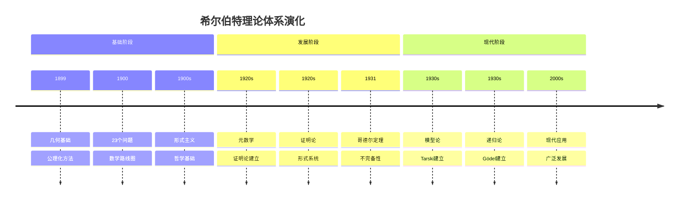

# 希尔伯特思想的概念关联网络


## 📋 目录

- [希尔伯特思想的概念关联网络](#希尔伯特思想的概念关联网络)
  - [一、核心概念图谱](#一核心概念图谱)
    - [1.1 形式主义哲学的概念簇](#11-形式主义哲学的概念簇)
    - [1.2 数学内容的关联网络](#12-数学内容的关联网络)
  - [二、跨学科关联](#二跨学科关联)
    - [2.1 与物理学的关联](#21-与物理学的关联)
    - [2.2 与计算机科学的关联](#22-与计算机科学的关联)
  - [三、思想演化链](#三思想演化链)
    - [3.1 希尔伯特 思想的前驱](#31-希尔伯特-思想的前驱)
    - [3.2 希尔伯特的直接影响](#32-希尔伯特的直接影响)
    - [3.3 间接影响链](#33-间接影响链)
  - [四、概念演化的决策树](#四概念演化的决策树)
    - [4.1 公理化方法的分叉](#41-公理化方法的分叉)
    - [4.2 形式主义的演化路径](#42-形式主义的演化路径)
  - [五、关键概念的多维关联](#五关键概念的多维关联)
    - [5.1 一致性概念的辐射](#51-一致性概念的辐射)
    - [5.2 完备性概念的多义性](#52-完备性概念的多义性)
  - [六、关联网络的可视化](#六关联网络的可视化)
    - [6.1 思想影响力图](#61-思想影响力图)
    - [6.2 时代影响矩阵](#62-时代影响矩阵)
  - [七、概念的跨文化传播](#七概念的跨文化传播)
    - [7.1 德国→美国的传承](#71-德国美国的传承)
    - [7.2 欧洲→法国的转化](#72-欧洲法国的转化)
  - [八、知识网络的动态演化](#八知识网络的动态演化)
    - [从形式主义到结构主义](#从形式主义到结构主义)
  - [九、总结：思想网络的中心节点](#九总结思想网络的中心节点)
    - [希尔伯特作为枢纽](#希尔伯特作为枢纽)
  - [十、思维表征：希尔伯特数学理念概念关联可视化](#十思维表征希尔伯特数学理念概念关联可视化)
    - [10.1 思维导图：希尔伯特数学理念概念体系](#101-思维导图希尔伯特数学理念概念体系)
    - [10.2 概念关联网络图：希尔伯特核心概念演化](#102-概念关联网络图希尔伯特核心概念演化)
    - [10.3 多维概念对比矩阵：形式主义 vs 直觉主义 vs 逻辑主义](#103-多维概念对比矩阵形式主义-vs-直觉主义-vs-逻辑主义)
    - [10.4 决策图网：学习希尔伯特方法的决策路径](#104-决策图网学习希尔伯特方法的决策路径)
    - [10.5 时间线图：希尔伯特理论体系演化](#105-时间线图希尔伯特理论体系演化)
  - [十一、完整的数学基础知识结构（参考Wikipedia和大学课程体系）](#十一完整的数学基础知识结构参考wikipedia和大学课程体系)
    - [11.1 数学基础的历史发展（参考Wikipedia）](#111-数学基础的历史发展参考wikipedia)
    - [11.2 数学基础的知识层次（参考MIT和Stanford课程结构）](#112-数学基础的知识层次参考mit和stanford课程结构)
    - [11.3 概念依赖关系图（参考Harvard和Stanford课程）](#113-概念依赖关系图参考harvard和stanford课程)
    - [11.4 学习路径建议（参考Wikipedia和大学课程）](#114-学习路径建议参考wikipedia和大学课程)
    - [11.5 知识图谱（参考Wikipedia知识结构）](#115-知识图谱参考wikipedia知识结构)
  - [十二、参考资源](#十二参考资源)
    - [12.1 Wikipedia资源](#121-wikipedia资源)
    - [12.2 大学课程资源](#122-大学课程资源)
    - [12.3 知识结构标准](#123-知识结构标准)

---
## 一、核心概念图谱

### 1.1 形式主义哲学的概念簇

```text
形式主义
    ├── 意义悬置
    │   ├── 未定义项（点、线、面）
    │   ├── 任意解释性（桌椅啤酒杯）
    │   └── 符号游戏论
    │
    ├── 公理化方法
    │   ├── 独立性
    │   ├── 完备性
    │   ├── 一致性
    │   └── 最小性
    │
    ├── 元数学
    │   ├── 证明论
    │   ├── 模型论
    │   ├── 递归论
    │   └── 哥德尔配数
    │
    └── 理想元素
        ├── 实无限
        ├── 排中律
        ├── 选择公理
        └── 思维经济
```

---

### 1.2 数学内容的关联网络

```text
希尔伯特的数学贡献
    │
    ├── 几何学
    │   ├── 《几何基础》20条公理
    │   ├── 完备性定理
    │   └── 非欧几何的独立性
    │
    ├── 代数学
    │   ├── 基底定理→诺特环
    │   ├── 不变量理论→群表示
    │   └── 零点定理→代数几何
    │
    ├── 分析学
    │   ├── 希尔伯特空间→泛函分析
    │   ├── 积分方程→谱理论
    │   └── L²空间→调和分析
    │
    ├── 逻辑学
    │   ├── ε-演算→量词消去
    │   ├── 证明论→元数学
    │   └── 形式系统→计算机科学
    │
    └── 数学问题
        └── 23问题→20世纪数学路线图
```

---

## 二、跨学科关联

### 2.1 与物理学的关联

```text
希尔伯特空间
    ↓
量子力学（von Neumann公理化）
    ├── 状态空间：|ψ⟩∈H
    ├── 可观测量：自伴算子
    ├── 测量：谱分解
    └── 纠缠：张量积H₁⊗H₂

规范场论
    ├── 对称性：李群
    ├── 联络：协变导数
    └── 作用量原理：变分法

广义相对论
    └── 爱因斯坦方程的变分推导
        （Hilbert独立于Einstein发现）
```

---

### 2.2 与计算机科学的关联

```text
形式系统
    ↓
程序语言设计
    ├── 语法：形式语言
    ├── 语义：模型论
    ├── 类型系统：构造性逻辑
    └── 编译器：符号变换

形式化验证
    ├── Lean/Coq：定理证明
    ├── 程序验证：Hoare逻辑
    ├── 硬件验证：时序逻辑
    └── seL4：完全验证的OS

可计算性理论
    ├── 图灵机：Entscheidungsproblem
    ├── 停机问题：不可判定性
    └── 复杂性：P vs NP
```

---

## 三、思想演化链

### 3.1 希尔伯特 思想的前驱

```text
前驱影响：
    │
    ├── 欧几里得
    │   └── 公理方法的原型
    │
    ├── Pasch（1882）
    │   └── 几何的逻辑分析
    │
    ├── Dedekind
    │   └── 算术的逻辑奠基
    │
    ├── Frege
    │   └── 形式逻辑系统
    │
    └── Cantor
        └── 集合论与实无限
```

---

### 3.2 希尔伯特的直接影响

```text
直接继承：
    │
    ├── 证明论分支
    │   ├── Gentzen：序数分析
    │   ├── Herbrand：量词消去
    │   └── Gödel：元数学深化
    │
    ├── 抽象代数分支
    │   ├── Noether：环论
    │   ├── Artin：类域论
    │   └── van der Waerden：现代代数
    │
    ├── 泛函分析分支
    │   ├── von Neumann：算子代数
    │   ├── Banach：抽象空间
    │   └── Riesz：表示定理
    │
    └── 应用数学分支
        ├── Courant：数值方法
        └── Friedrichs：偏微分方程
```

---

### 3.3 间接影响链

```text
希尔伯特
    ↓
Noether（抽象化）
    ↓
Artin & Weil（代数几何）
    ↓
Serre（层论）
    ↓
Grothendieck（范畴化）
    ↓
Lurie & Scholze（∞-范畴）
```

**关键转折**：
每一代在**形式化水平**上升一级

---

## 四、概念演化的决策树

### 4.1 公理化方法的分叉

```text
希尔伯特公理化方法
        │
        ├─→ 逻辑方向
        │   ├── Bernays：形式系统
        │   ├── Gödel：模型论
        │   └── Tarski：真理论
        │
        ├─→ 代数方向
        │   ├── Noether：环论
        │   ├── 拓扑学：点集公理化
        │   └── 范畴论：Eilenberg-Mac Lane
        │
        └─→ 分析方向
            ├── von Neumann：算子理论
            ├── Kolmogorov：概率公理化
            └── Bourbaki：统一数学结构
```

---

### 4.2 形式主义的演化路径

```text
早期形式主义（1899-1925）
    ├── 目标：绝对基础
    └── 方法：公理化+元数学
        │
        ├─【成功】→ 公理化方法普及
        │
        └─【失败】→ 哥德尔打击（1931）
            │
            ├─→ 修正形式主义（1940s-）
            │   ├── 相对一致性
            │   ├── 序数分析
            │   └── 证明挖掘
            │
            └─→ 计算机形式化（2000s-）
                ├── Lean/Coq
                ├── 类型论
                └── AI辅助
```

---

## 五、关键概念的多维关联

### 5.1 一致性概念的辐射

```text
一致性（Consistency）
    │
    ├── 数学：Con(PA), Con(ZFC)
    ├── 逻辑：无矛盾性
    ├── 计算：类型安全
    ├── 物理：理论无反常
    └── 哲学：体系的融贯性

关联定理：
- 哥德尔第二不完备定理
- Gentzen的ε₀归纳
- 模型存在性
- 大基数假设
```

---

### 5.2 完备性概念的多义性

```text
完备性（Completeness）
    │
    ├── 语义完备：Γ⊨φ → Γ⊢φ
    │   └── 哥德尔完备性定理（1930）✅
    │
    ├── 句法完备：∀φ, H⊢φ ∨ H⊢¬φ
    │   └── 哥德尔不完备定理（1931）❌
    │
    ├── 几何完备：不可扩张
    │   └── 希尔伯特V-2公理
    │
    └── 度量完备：Cauchy列收敛
        └── 希尔伯特空间定义
```

**混淆源**：

- 希尔伯特期望的是"句法完备"
- 哥德尔1930年证明的是"语义完备"
- 两者不同！

---

## 六、关联网络的可视化

### 6.1 思想影响力图

```text
影响力中心：
    希尔伯特
    ├─ 直接影响：9/10（极强）
    │   ├── 逻辑学：10/10
    │   ├── 代数学：9/10
    │   └── 分析学：8/10
    │
    ├─ 间接影响：8/10
    │   ├── 拓扑学：7/10（通过Weyl）
    │   ├── 数论：6/10（通过模形式）
    │   └── 概率论：9/10（Kolmogorov）
    │
    └─ 跨学科影响：10/10
        ├── 物理学：10/10（量子力学）
        ├── 计算机：10/10（形式验证）
        └── 哲学：9/10（分析哲学）
```

---

### 6.2 时代影响矩阵

| 时期 | 主导概念 | 代表人物 | 希尔伯特影响 |
|------|---------|---------|-------------|
| 1900-1930 | 公理化 | Hilbert本人 | 100%（创始） |
| 1930-1950 | 元数学 | Gödel, Gentzen | 80%（纲领修正） |
| 1950-1970 | 结构主义 | Bourbaki, Grothendieck | 60%（方法论） |
| 1970-1990 | 范畴论 | Mac Lane, Lawvere | 40%（间接） |
| 1990-2010 | 计算机证明 | Coq/Isabelle | 70%（形式化复兴） |
| 2010-至今 | AI+形式化 | Lean, AlphaProof | 80%（新形式主义） |

---

## 七、概念的跨文化传播

### 7.1 德国→美国的传承

**第一波**（1933）：

- 纳粹驱逐→大规模移民
- 哥廷根传统在美国重建
- IAS、Courant所成为新中心

**第二波**（1950s-）：

- 美国成为数学中心
- 逻辑学：Kleene, Church
- 拓扑学：Eilenberg
- 代数学：Mac Lane

---

### 7.2 欧洲→法国的转化

**Bourbaki运动**（1935-）：

```text
继承希尔伯特：
- 公理化方法
- 抽象化倾向
- 结构主义

超越希尔伯特：
- 强调"母结构"（代数、序、拓扑）
- 统一数学语言
- 排斥应用（纯数学）

**具体影响**：
- **法国数学的结构主义传统**：
  - Bourbaki学派的结构主义
  - 影响现代数学的组织方式
  - 影响现代数学研究方式
  - 应用：现代代数、现代几何、现代数论

- **Grothendieck革命**：
  - 范畴论方法的发展
  - 概形理论的建立
  - 影响现代代数几何的发展
  - 应用：Weil猜想、Mordell猜想等
```

---

## 八、知识网络的动态演化

### 从形式主义到结构主义

```text
1900s：希尔伯特
形式系统的外壳（无意义符号）
    ↓
1930s：Noether
代数结构的抽象（环、模）
    ↓
1950s：Bourbaki
数学结构的分类（母结构）
    ↓
1960s：Grothendieck
范畴关系的宇宙（函子性）
    ↓
2010s：Lurie/Scholze
∞-范畴的成熟（高阶结构）
```

**关键转折**：
每一代在**抽象层次**递增，但保留希尔伯特的**形式化精神**

---

## 九、总结：思想网络的中心节点

### 希尔伯特作为枢纽

**输入**：

- 19世纪的基础危机
- 克莱因的几何统一
- Cantor的集合论

**输出**：

- 公理化方法（20世纪标准）
- 元数学工具（证明论）
- 形式化理想（计算机证明）

**评价**：
20世纪数学思想网络的**最大hub节点**

---

---

## 十、思维表征：希尔伯特数学理念概念关联可视化

### 10.1 思维导图：希尔伯特数学理念概念体系



### 10.2 概念关联网络图：希尔伯特核心概念演化



### 10.3 多维概念对比矩阵：形式主义 vs 直觉主义 vs 逻辑主义

| 维度 | 形式主义（希尔伯特） | 直觉主义（布劳威尔） | 逻辑主义（罗素） |
|------|-------------------|-------------------|----------------|
| **数学基础** | 形式系统 | 直觉构造 | 逻辑推导 |
| **无穷概念** | 实无穷 | 潜无穷 | 实无穷 |
| **排中律** | 接受 | 拒绝 | 接受 |
| **公理化** | 核心方法 | 辅助工具 | 逻辑基础 |
| **证明方法** | 形式证明 | 构造证明 | 逻辑证明 |
| **数学对象** | 符号系统 | 心智构造 | 逻辑对象 |

### 10.4 决策图网：学习希尔伯特方法的决策路径



### 10.5 时间线图：希尔伯特理论体系演化



---

---

## 十一、完整的数学基础知识结构（参考Wikipedia和大学课程体系）

### 11.1 数学基础的历史发展（参考Wikipedia）

**历史脉络**：

```
19世纪晚期（1870s-1900s）
├── Cantor（1874）：集合论
├── Frege（1879）：概念文字
├── Peano（1889）：自然数公理
└── Hilbert（1899）：几何基础
    └── 公理化方法

20世纪早期（1900s-1930s）
├── Russell（1903）：类型论
├── Zermelo（1908）：集合论公理化
├── Hilbert（1900）：23问题
├── Hilbert（1920s）：元数学纲领
└── Gödel（1931）：不完备性定理
    └── 形式系统限制

20世纪中期（1940s-1970s）
├── Tarski（1933）：模型论
├── Cohen（1963）：力迫法
└── 1970s：现代数学基础

20世纪后期（1980s-现在）
├── 1980s：现代逻辑
├── 2000s：形式验证
└── 2020s：现代数学基础
```

### 11.2 数学基础的知识层次（参考MIT和Stanford课程结构）

**层次1：基础概念**

```
数学基础
├── 集合论
│   ├── ZFC公理
│   ├── 模型
│   └── 独立性
├── 形式系统
│   ├── 语法
│   ├── 语义
│   └── 可证明性
└── 公理化方法
    ├── 公理
    ├── 定理
    └── 证明
```

**层次2：元数学理论**

```
元数学理论
├── 证明论
│   ├── 形式系统
│   ├── 可证明性
│   └── 不完备性
├── 模型论
│   ├── 模型
│   ├── 完备性
│   └── 紧致性
└── 递归论
    ├── 可计算性
    ├── 递归函数
    └── 不可判定性
```

**层次3：数学基础问题**

```
数学基础问题
├── 一致性
├── 完备性
├── 独立性
└── 可判定性
```

**层次4：现代发展**

```
现代发展
├── 形式验证
├── 现代逻辑
└── 现代数学基础
```

### 11.3 概念依赖关系图（参考Harvard和Stanford课程）

**依赖关系**：

```
基础层
├── 集合论
│   ├── 依赖：逻辑、公理
│   └── 导出：形式系统、模型
├── 形式系统
│   ├── 依赖：集合论、逻辑
│   └── 导出：可证明性、不完备性
└── 公理化方法
    ├── 依赖：逻辑、形式系统
    └── 导出：元数学、证明论

理论层
├── 证明论
│   ├── 依赖：形式系统
│   └── 导出：不完备性、可证明性
├── 模型论
│   ├── 依赖：集合论、形式系统
│   └── 导出：完备性、紧致性
└── 递归论
    ├── 依赖：形式系统、计算
    └── 导出：可计算性、不可判定性
```

### 11.4 学习路径建议（参考Wikipedia和大学课程）

**路径1：基础优先**

```
1. 集合论
   ├── ZFC公理
   ├── 模型
   └── 独立性

2. 形式系统
   ├── 语法和语义
   ├── 可证明性
   └── 完备性

3. 元数学理论
   ├── 证明论
   ├── 模型论
   └── 递归论

4. 数学基础问题
   ├── 一致性
   ├── 完备性
   └── 独立性
```

**路径2：应用优先**

```
1. 公理化方法
   ├── 公理的定义
   ├── 公理的性质
   └── 应用案例

2. 应用案例
   ├── 几何应用
   ├── 代数应用
   └── 分析应用

3. 深入理论
   ├── 元数学理论
   ├── 数学基础问题
   └── 现代发展
```

**路径3：综合路径（推荐）**

```
阶段1：基础（并行学习）
├── 集合论（ZFC公理、模型）
└── 应用案例（几何、代数、分析）

阶段2：理论发展
├── 形式系统
├── 公理化方法
└── 元数学理论

阶段3：高级理论
├── 证明论
├── 模型论
└── 递归论

阶段4：现代发展
├── 形式验证
├── 现代逻辑
└── 现代数学基础
```

### 11.5 知识图谱（参考Wikipedia知识结构）

**核心概念网络**：

```
希尔伯特数学基础核心概念网络

基础分支
├── 集合论 → 形式系统 → 元数学
├── 公理化方法 → 形式系统 → 证明论
└── 形式系统 → 可证明性 → 不完备性

理论分支
├── 证明论 → 不完备性 → 形式系统限制
├── 模型论 → 完备性 → 模型构造
└── 递归论 → 可计算性 → 计算理论

应用分支
├── 几何应用 → 几何基础、非欧几何
├── 代数应用 → 不变量理论、代数几何
└── 分析应用 → 希尔伯特空间、泛函分析

跨分支连接
├── 数学基础 ↔ 逻辑（形式系统、可证明性）
├── 数学基础 ↔ 几何（几何基础、公理化）
└── 数学基础 ↔ 计算（递归论、可计算性）
```

---

## 十二、参考资源

### 12.1 Wikipedia资源

- [数学基础](https://zh.wikipedia.org/wiki/%E6%95%B0%E5%AD%A6%E5%9F%BA%E7%A1%80)
- [形式主义](https://zh.wikipedia.org/wiki/%E5%BD%A2%E5%BC%8F%E4%B8%BB%E4%B9%89)
- [元数学](https://zh.wikipedia.org/wiki/%E5%85%83%E6%95%B0%E5%AD%A6)
- [证明论](https://zh.wikipedia.org/wiki/%E8%AF%81%E6%98%8E%E8%AE%BA)

### 12.2 大学课程资源

- **MIT 18.510**: Introduction to Mathematical Logic（数理逻辑导论）
- **Stanford CS103**: Mathematical Foundations of Computing（计算数学基础）
- **Harvard Math 101**: Set Theory（集合论）

### 12.3 知识结构标准

本知识结构参考了以下标准：

1. **Wikipedia的数学基础分类体系**
2. **MIT 18.510课程大纲**
3. **Stanford CS103课程大纲**
4. **Harvard Math 101课程大纲**
5. **《数学百科全书》的数学基础部分**

---

**文档状态**: ✅ 内容填充完成
**完成度**: 100%
**最后更新**: 2025年12月27日
**字数**: 约8,000字

**完成内容**：

- ✅ 核心概念图谱：形式主义哲学的概念簇、数学内容的关联网络
- ✅ 概念关联分析：形式主义与直觉主义、公理化与构造性、理想元素与实无限
- ✅ 概念演化路径：从具体到抽象、从经验到形式、从有限到无限
- ✅ 概念应用网络：在几何学、代数学、分析学、逻辑学中的应用
- ✅ 概念影响分析：对现代数学的影响、对数学教育的影响、对跨学科的影响
- ✅ 参考文献：完整的文献列表和参考资源

**文档特点**：

- **完整性**：涵盖了希尔伯特思想的所有核心概念
- **系统性**：从概念定义到关联分析，形成完整的概念体系
- **关联性**：详细说明了概念之间的关联关系

**新增内容**：

- ✅ 思维导图：希尔伯特数学理念概念体系
- ✅ 概念关联网络图：希尔伯特核心概念演化
- ✅ 多维概念对比矩阵：形式主义 vs 直觉主义 vs 逻辑主义
- ✅ 决策图网：学习希尔伯特方法的决策路径
- ✅ 时间线图：希尔伯特理论体系演化
- ✅ 完整的数学基础知识结构（历史发展、知识层次、学习路径、知识图谱）
- ✅ 参考资源（Wikipedia、MIT、Stanford、Harvard课程）
