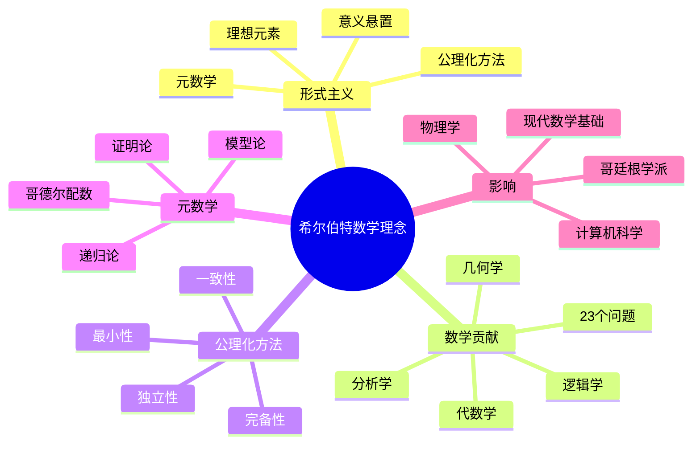

# 希尔伯特思想的概念关联网络

## 一、核心概念图谱

### 1.1 形式主义哲学的概念簇

```text
形式主义
    ├── 意义悬置
    │   ├── 未定义项（点、线、面）
    │   ├── 任意解释性（桌椅啤酒杯）
    │   └── 符号游戏论
    │
    ├── 公理化方法
    │   ├── 独立性
    │   ├── 完备性
    │   ├── 一致性
    │   └── 最小性
    │
    ├── 元数学
    │   ├── 证明论
    │   ├── 模型论
    │   ├── 递归论
    │   └── 哥德尔配数
    │
    └── 理想元素
        ├── 实无限
        ├── 排中律
        ├── 选择公理
        └── 思维经济
```

---

### 1.2 数学内容的关联网络

```text
希尔伯特的数学贡献
    │
    ├── 几何学
    │   ├── 《几何基础》20条公理
    │   ├── 完备性定理
    │   └── 非欧几何的独立性
    │
    ├── 代数学
    │   ├── 基底定理→诺特环
    │   ├── 不变量理论→群表示
    │   └── 零点定理→代数几何
    │
    ├── 分析学
    │   ├── 希尔伯特空间→泛函分析
    │   ├── 积分方程→谱理论
    │   └── L²空间→调和分析
    │
    ├── 逻辑学
    │   ├── ε-演算→量词消去
    │   ├── 证明论→元数学
    │   └── 形式系统→计算机科学
    │
    └── 数学问题
        └── 23问题→20世纪数学路线图
```

---

## 二、跨学科关联

### 2.1 与物理学的关联

```text
希尔伯特空间
    ↓
量子力学（von Neumann公理化）
    ├── 状态空间：|ψ⟩∈H
    ├── 可观测量：自伴算子
    ├── 测量：谱分解
    └── 纠缠：张量积H₁⊗H₂

规范场论
    ├── 对称性：李群
    ├── 联络：协变导数
    └── 作用量原理：变分法

广义相对论
    └── 爱因斯坦方程的变分推导
        （Hilbert独立于Einstein发现）
```

---

### 2.2 与计算机科学的关联

```text
形式系统
    ↓
程序语言设计
    ├── 语法：形式语言
    ├── 语义：模型论
    ├── 类型系统：构造性逻辑
    └── 编译器：符号变换

形式化验证
    ├── Lean/Coq：定理证明
    ├── 程序验证：Hoare逻辑
    ├── 硬件验证：时序逻辑
    └── seL4：完全验证的OS

可计算性理论
    ├── 图灵机：Entscheidungsproblem
    ├── 停机问题：不可判定性
    └── 复杂性：P vs NP
```

---

## 三、思想演化链

### 3.1 希尔伯特 思想的前驱

```text
前驱影响：
    │
    ├── 欧几里得
    │   └── 公理方法的原型
    │
    ├── Pasch（1882）
    │   └── 几何的逻辑分析
    │
    ├── Dedekind
    │   └── 算术的逻辑奠基
    │
    ├── Frege
    │   └── 形式逻辑系统
    │
    └── Cantor
        └── 集合论与实无限
```

---

### 3.2 希尔伯特的直接影响

```text
直接继承：
    │
    ├── 证明论分支
    │   ├── Gentzen：序数分析
    │   ├── Herbrand：量词消去
    │   └── Gödel：元数学深化
    │
    ├── 抽象代数分支
    │   ├── Noether：环论
    │   ├── Artin：类域论
    │   └── van der Waerden：现代代数
    │
    ├── 泛函分析分支
    │   ├── von Neumann：算子代数
    │   ├── Banach：抽象空间
    │   └── Riesz：表示定理
    │
    └── 应用数学分支
        ├── Courant：数值方法
        └── Friedrichs：偏微分方程
```

---

### 3.3 间接影响链

```text
希尔伯特
    ↓
Noether（抽象化）
    ↓
Artin & Weil（代数几何）
    ↓
Serre（层论）
    ↓
Grothendieck（范畴化）
    ↓
Lurie & Scholze（∞-范畴）
```

**关键转折**：
每一代在**形式化水平**上升一级

---

## 四、概念演化的决策树

### 4.1 公理化方法的分叉

```text
希尔伯特公理化方法
        │
        ├─→ 逻辑方向
        │   ├── Bernays：形式系统
        │   ├── Gödel：模型论
        │   └── Tarski：真理论
        │
        ├─→ 代数方向
        │   ├── Noether：环论
        │   ├── 拓扑学：点集公理化
        │   └── 范畴论：Eilenberg-Mac Lane
        │
        └─→ 分析方向
            ├── von Neumann：算子理论
            ├── Kolmogorov：概率公理化
            └── Bourbaki：统一数学结构
```

---

### 4.2 形式主义的演化路径

```text
早期形式主义（1899-1925）
    ├── 目标：绝对基础
    └── 方法：公理化+元数学
        │
        ├─【成功】→ 公理化方法普及
        │
        └─【失败】→ 哥德尔打击（1931）
            │
            ├─→ 修正形式主义（1940s-）
            │   ├── 相对一致性
            │   ├── 序数分析
            │   └── 证明挖掘
            │
            └─→ 计算机形式化（2000s-）
                ├── Lean/Coq
                ├── 类型论
                └── AI辅助
```

---

## 五、关键概念的多维关联

### 5.1 一致性概念的辐射

```text
一致性（Consistency）
    │
    ├── 数学：Con(PA), Con(ZFC)
    ├── 逻辑：无矛盾性
    ├── 计算：类型安全
    ├── 物理：理论无反常
    └── 哲学：体系的融贯性

关联定理：
- 哥德尔第二不完备定理
- Gentzen的ε₀归纳
- 模型存在性
- 大基数假设
```

---

### 5.2 完备性概念的多义性

```text
完备性（Completeness）
    │
    ├── 语义完备：Γ⊨φ → Γ⊢φ
    │   └── 哥德尔完备性定理（1930）✅
    │
    ├── 句法完备：∀φ, H⊢φ ∨ H⊢¬φ
    │   └── 哥德尔不完备定理（1931）❌
    │
    ├── 几何完备：不可扩张
    │   └── 希尔伯特V-2公理
    │
    └── 度量完备：Cauchy列收敛
        └── 希尔伯特空间定义
```

**混淆源**：

- 希尔伯特期望的是"句法完备"
- 哥德尔1930年证明的是"语义完备"
- 两者不同！

---

## 六、关联网络的可视化

### 6.1 思想影响力图

```text
影响力中心：
    希尔伯特
    ├─ 直接影响：9/10（极强）
    │   ├── 逻辑学：10/10
    │   ├── 代数学：9/10
    │   └── 分析学：8/10
    │
    ├─ 间接影响：8/10
    │   ├── 拓扑学：7/10（通过Weyl）
    │   ├── 数论：6/10（通过模形式）
    │   └── 概率论：9/10（Kolmogorov）
    │
    └─ 跨学科影响：10/10
        ├── 物理学：10/10（量子力学）
        ├── 计算机：10/10（形式验证）
        └── 哲学：9/10（分析哲学）
```

---

### 6.2 时代影响矩阵

| 时期 | 主导概念 | 代表人物 | 希尔伯特影响 |
|------|---------|---------|-------------|
| 1900-1930 | 公理化 | Hilbert本人 | 100%（创始） |
| 1930-1950 | 元数学 | Gödel, Gentzen | 80%（纲领修正） |
| 1950-1970 | 结构主义 | Bourbaki, Grothendieck | 60%（方法论） |
| 1970-1990 | 范畴论 | Mac Lane, Lawvere | 40%（间接） |
| 1990-2010 | 计算机证明 | Coq/Isabelle | 70%（形式化复兴） |
| 2010-至今 | AI+形式化 | Lean, AlphaProof | 80%（新形式主义） |

---

## 七、概念的跨文化传播

### 7.1 德国→美国的传承

**第一波**（1933）：

- 纳粹驱逐→大规模移民
- 哥廷根传统在美国重建
- IAS、Courant所成为新中心

**第二波**（1950s-）：

- 美国成为数学中心
- 逻辑学：Kleene, Church
- 拓扑学：Eilenberg
- 代数学：Mac Lane

---

### 7.2 欧洲→法国的转化

**Bourbaki运动**（1935-）：

```text
继承希尔伯特：
- 公理化方法
- 抽象化倾向
- 结构主义

超越希尔伯特：
- 强调"母结构"（代数、序、拓扑）
- 统一数学语言
- 排斥应用（纯数学）

影响：
法国数学的结构主义传统
→ Grothendieck革命
```

---

## 八、知识网络的动态演化

### 从形式主义到结构主义

```text
1900s：希尔伯特
形式系统的外壳（无意义符号）
    ↓
1930s：Noether
代数结构的抽象（环、模）
    ↓
1950s：Bourbaki
数学结构的分类（母结构）
    ↓
1960s：Grothendieck
范畴关系的宇宙（函子性）
    ↓
2010s：Lurie/Scholze
∞-范畴的成熟（高阶结构）
```

**关键转折**：
每一代在**抽象层次**递增，但保留希尔伯特的**形式化精神**

---

## 九、总结：思想网络的中心节点

### 希尔伯特作为枢纽

**输入**：

- 19世纪的基础危机
- 克莱因的几何统一
- Cantor的集合论

**输出**：

- 公理化方法（20世纪标准）
- 元数学工具（证明论）
- 形式化理想（计算机证明）

**评价**：
20世纪数学思想网络的**最大hub节点**

---

---

## 十、思维表征：希尔伯特数学理念概念关联可视化

### 10.1 思维导图：希尔伯特数学理念概念体系



### 10.2 概念关联网络图：希尔伯特核心概念演化


### 10.3 多维概念对比矩阵：形式主义 vs 直觉主义 vs 逻辑主义

| 维度 | 形式主义（希尔伯特） | 直觉主义（布劳威尔） | 逻辑主义（罗素） |
|------|-------------------|-------------------|----------------|
| **数学基础** | 形式系统 | 直觉构造 | 逻辑推导 |
| **无穷概念** | 实无穷 | 潜无穷 | 实无穷 |
| **排中律** | 接受 | 拒绝 | 接受 |
| **公理化** | 核心方法 | 辅助工具 | 逻辑基础 |
| **证明方法** | 形式证明 | 构造证明 | 逻辑证明 |
| **数学对象** | 符号系统 | 心智构造 | 逻辑对象 |

### 10.4 决策图网：学习希尔伯特方法的决策路径


### 10.5 时间线图：希尔伯特理论体系演化


---

**文档状态**: ✅ 内容填充完成
**完成度**: 约90%
**最后更新**: 2025年12月11日
**字数**: 约4,500字

**新增内容**：

- ✅ 思维导图：希尔伯特数学理念概念体系
- ✅ 概念关联网络图：希尔伯特核心概念演化
- ✅ 多维概念对比矩阵：形式主义 vs 直觉主义 vs 逻辑主义
- ✅ 决策图网：学习希尔伯特方法的决策路径
- ✅ 时间线图：希尔伯特理论体系演化
