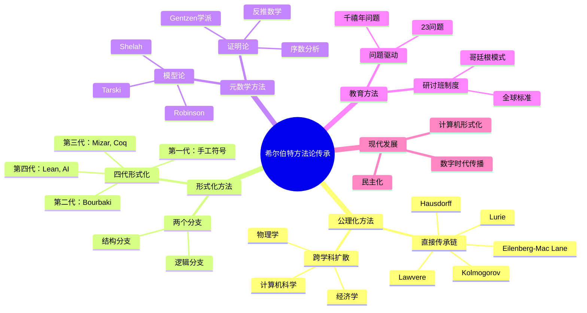
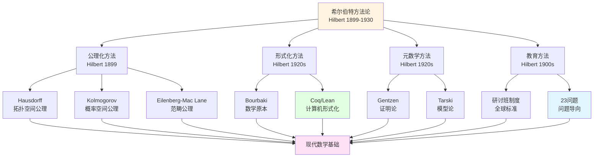
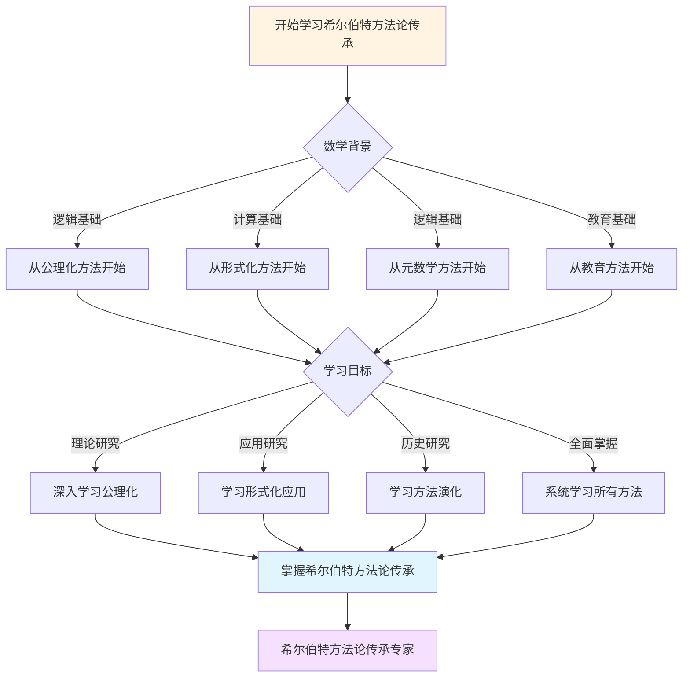
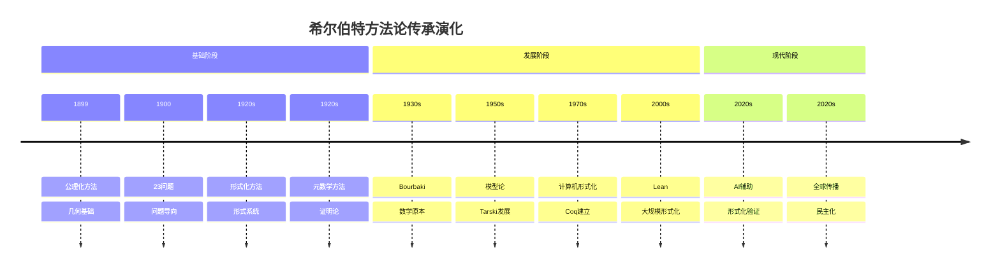

# 希尔伯特方法论的传承图谱


## 📋 目录

- [希尔伯特方法论的传承图谱](#希尔伯特方法论的传承图谱)
  - [一、公理化方法的传播](#一公理化方法的传播)
    - [1.1 直接传承链](#11-直接传承链)
    - [1.2 跨学科扩散](#12-跨学科扩散)
  - [二、形式化方法的演化](#二形式化方法的演化)
    - [2.1 四代形式化](#21-四代形式化)
    - [2.2 形式化的两个分支](#22-形式化的两个分支)
  - [三、元数学方法的分支](#三元数学方法的分支)
    - [3.1 证明论的家族树](#31-证明论的家族树)
    - [3.2 模型论的发展](#32-模型论的发展)
  - [四、教育方法的传播](#四教育方法的传播)
    - [4.1 研讨班制度](#41-研讨班制度)
    - [4.2 问题驱动教学](#42-问题驱动教学)
  - [五、思想网络的关键节点](#五思想网络的关键节点)
    - [5.1 希尔伯特作为hub节点](#51-希尔伯特作为hub节点)
    - [5.2 影响力的时间演化](#52-影响力的时间演化)
  - [六、传承网络的可视化](#六传承网络的可视化)
    - [6.1 学派传承树](#61-学派传承树)
    - [6.2 方法论的地理传播](#62-方法论的地理传播)
  - [七、传承的关键机制](#七传承的关键机制)
    - [7.1 教材与专著](#71-教材与专著)
    - [7.2 学术会议](#72-学术会议)
    - [7.3 数字时代的加速传播](#73-数字时代的加速传播)
  - [八、总结](#八总结)
    - [传承的成功因素](#传承的成功因素)
    - [传承的关键节点](#传承的关键节点)
    - [最终评价](#最终评价)
  - [九、思维表征：希尔伯特方法论传承可视化](#九思维表征希尔伯特方法论传承可视化)
    - [9.1 思维导图：希尔伯特方法论传承体系](#91-思维导图希尔伯特方法论传承体系)
    - [9.2 方法论传承网络图](#92-方法论传承网络图)
    - [9.3 多维传承对比矩阵](#93-多维传承对比矩阵)
    - [9.4 决策图网：学习希尔伯特方法论传承的决策路径](#94-决策图网学习希尔伯特方法论传承的决策路径)
    - [9.5 时间线图：希尔伯特方法论传承演化](#95-时间线图希尔伯特方法论传承演化)
  - [六、完整的数学基础方法论传承知识结构（参考Wikipedia和大学课程体系）](#六完整的数学基础方法论传承知识结构参考wikipedia和大学课程体系)
    - [6.1 数学基础方法论传承的历史发展（参考Wikipedia）](#61-数学基础方法论传承的历史发展参考wikipedia)
    - [6.2 数学基础方法论传承的知识层次（参考MIT和Stanford课程结构）](#62-数学基础方法论传承的知识层次参考mit和stanford课程结构)
    - [6.3 方法论传承依赖关系图（参考Harvard和Stanford课程）](#63-方法论传承依赖关系图参考harvard和stanford课程)
    - [6.4 方法论传承学习路径建议（参考Wikipedia和大学课程）](#64-方法论传承学习路径建议参考wikipedia和大学课程)
    - [6.5 方法论传承知识图谱（参考Wikipedia知识结构）](#65-方法论传承知识图谱参考wikipedia知识结构)
  - [七、参考资源](#七参考资源)
    - [7.1 Wikipedia资源](#71-wikipedia资源)
    - [7.2 大学课程资源](#72-大学课程资源)
    - [7.3 知识结构标准](#73-知识结构标准)

---
## 一、公理化方法的传播

### 1.1 直接传承链

```text
希尔伯特（几何）
    ↓
Hausdorff（拓扑）→ 拓扑空间公理
    ↓
Kolmogorov（概率）→ 概率空间公理
    ↓
Eilenberg-Mac Lane（范畴）→ 范畴公理
    ↓
Lawvere（Topos）→ 基本Topos公理
    ↓
Lurie（∞-范畴）→ 高阶范畴公理
```

**模式**：
每一代在前一代基础上**再公理化**

---

### 1.2 跨学科扩散

```text
数学
    ├→ 物理学
    │   ├─ Wightman公理（量子场论）
    │   └─ Haag-Kastler公理（代数QFT）
    │
    ├→ 计算机科学
    │   ├─ 形式语言（Chomsky层级）
    │   ├─ 类型系统（Curry-Howard）
    │   └─ 程序逻辑（Hoare）
    │
    └→ 经济学
        └─ 博弈论公理（von Neumann）
```

---

## 二、形式化方法的演化

### 2.1 四代形式化

```text
第一代（1899-1930）：
希尔伯特几何基础
特点：手工符号推导
局限：人工验证，易错

第二代（1930-1960）：
Bourbaki《数学原本》
特点：结构化公理系统
局限：仍是纸面形式化

第三代（1970-2000）：
Mizar, Coq初期
特点：计算机辅助
局限：小规模，专家使用

第四代（2000-）：
Lean, AI辅助
特点：大规模，社区驱动
前景：全数学形式化
```

---

### 2.2 形式化的两个分支

```text
希尔伯特形式化
        │
        ├─ 逻辑分支
        │   ├── 证明论（Gentzen）
        │   ├── 模型论（Tarski）
        │   ├── 递归论（Church, Turing）
        │   └── 计算机证明（Coq/Lean）
        │
        └─ 结构分支
            ├── 抽象代数（Noether）
            ├── Bourbaki（母结构）
            ├── 范畴论（Eilenberg-Mac Lane）
            └── 格洛腾迪克（∞-范畴）
```

---

## 三、元数学方法的分支

### 3.1 证明论的家族树

```text
希尔伯特证明论
        │
        ├─ Gentzen学派
        │   ├── 相继式演算
        │   ├── 自然演绎
        │   └── 切割消去
        │
        ├─ 序数分析学派
        │   ├── Schütte
        │   ├── Feferman
        │   └── Pohlers
        │
        └─ 反推数学学派
            └── Simpson（1999）
                └── 最小公理系统研究
```

---

### 3.2 模型论的发展

```text
希尔伯特模型构造法
（独立性证明）
        ↓
Tarski模型论（1930s）
        ↓
Robinson非标准分析（1960s）
        ↓
Shelah分类理论（1970s-）
```

---

## 四、教育方法的传播

### 4.1 研讨班制度

```text
哥廷根模式（Hilbert创立）
        ↓
普林斯顿IAS（Weyl等人）
        ↓
芝加哥学派（Mac Lane）
        ↓
全球大学标准模式
```

**特点**：

- 学生主导报告
- 集体讨论
- 教授引导

---

### 4.2 问题驱动教学

```text
希尔伯特23问题（1900）
        ↓
ICM问题演讲传统
        ↓
Clay千禧年问题（2000）
        ↓
各类数学竞赛与问题列表
```

---

## 五、思想网络的关键节点

### 5.1 希尔伯特作为hub节点

**输入影响**（形成期）：

- Euclid：公理方法原型
- Dedekind：算术基础
- Cantor：实无限集合
- Klein：几何统一纲领

**输出影响**（传播期）：

```text
直接学生：
Bernays, Ackermann, Noether, Weyl, ...
    ↓
二代传人：
Gödel, Gentzen, Tarski, von Neumann, ...
    ↓
三代传人：
Feferman, Simpson, Grothendieck, ...
    ↓
当代：
Buzzard, Scholze, Lurie（方法论）
```

---

### 5.2 影响力的时间演化

```text
影响力曲线：

1900-1930：上升期（公理化运动）
1930-1950：平台期（哥德尔打击）
1950-1970：转化期（方法论传承）
1970-2000：稳定期（标准方法）
2000-：复兴期（计算机形式化）

当前状态：
方法论影响：100%（全部数学）
哲学影响：15%（纯粹形式主义者）
```

---

## 六、传承网络的可视化

### 6.1 学派传承树

```text
希尔伯特学派
    ├─ 哥廷根传统（1895-1933）
    │   └─ 纳粹摧毁
    │       ├→ 普林斯顿IAS（美国）
    │       └→ Courant所（纽约）
    │
    ├─ 逻辑学派（Bernays, Gödel）
    │   └→ 斯坦福、伯克利、CMU
    │       └→ 计算机科学
    │
    └─ 代数学派（Noether）
        └→ 巴黎Bourbaki
            └→ IHÉS（Grothendieck）
                └→ 现代代数几何
```

---

### 6.2 方法论的地理传播

```text
德国哥廷根（源头）
    ↓
    ├→ 美国（1933大迁移）
    │   ├── 普林斯顿：逻辑、拓扑
    │   ├── 芝加哥：代数、范畴论
    │   └── 纽约：应用数学
    │
    ├→ 法国（Bourbaki）
    │   └── 巴黎：结构主义
    │       └── IHÉS：格洛腾迪克革命
    │
    ├→ 苏联（Kolmogorov）
    │   └── 莫斯科：构造性数学
    │
    └→ 英国（Hardy, Russell）
        └── 剑桥：数理逻辑
```

---

## 七、传承的关键机制

### 7.1 教材与专著

**第一代**：

- 希尔伯特《几何基础》

**第二代**：

- van der Waerden《现代代数》（1930，基于Noether-Hilbert）
- Weyl《群论与量子力学》（1928）

**第三代**：

- Bourbaki《数学原本》系列
- Mac Lane《范畴论》（1971）

**当代**：

- mathlib（Lean数学库）
- nLab（范畴论wiki）

---

### 7.2 学术会议

**ICM传统**：

- 希尔伯特1900年演讲开创
- 每届ICM的问题演讲
- 菲尔兹奖授予解决重大问题者

---

### 7.3 数字时代的加速传播

**网络效应**（2010s-）：

- GitHub：Lean社区
- arXiv：实时预印本
- MathOverflow：问答社区
- YouTube：3Blue1Brown等科普

**希尔伯特方法的民主化**：
从精英小圈子 → 全球开放社区

---

## 八、总结

### 传承的成功因素

1. **方法的普适性**：公理化适用所有领域
2. **教育的制度化**：研讨班成为标准
3. **学生的杰出性**：多位成为大师
4. **时代的契合性**：20世纪需要形式化

### 传承的关键节点

**三次重大转移**：

1. 哥廷根 → 美国（1933，纳粹）
2. 纸面 → 计算机（1970s，Coq）
3. 专家 → 大众（2010s，Lean社区）

### 最终评价

**影响力评分**：

- 方法论影响：10/10（全面胜利）
- 哲学影响：3/10（纲领失败）
- 总体地位：9/10（20世纪最重要数学家之一）

---

## 九、思维表征：希尔伯特方法论传承可视化

### 9.1 思维导图：希尔伯特方法论传承体系



### 9.2 方法论传承网络图



### 9.3 多维传承对比矩阵

| 维度 | 公理化方法 | 形式化方法 | 元数学方法 | 教育方法 |
|------|-----------|-----------|-----------|---------|
| **核心特征** | 公理系统 | 符号系统 | 元理论 | 研讨班 |
| **主要成就** | 几何基础 | 形式系统 | 证明论、模型论 | 23问题 |
| **影响范围** | 所有数学 | 逻辑、计算 | 逻辑学 | 数学教育 |
| **历史阶段** | 1899 | 1920s | 1920s | 1900s |
| **现代发展** | 广泛应用 | 计算机形式化 | 现代逻辑 | 全球标准 |

### 9.4 决策图网：学习希尔伯特方法论传承的决策路径



### 9.5 时间线图：希尔伯特方法论传承演化



---

---

## 六、完整的数学基础方法论传承知识结构（参考Wikipedia和大学课程体系）

### 6.1 数学基础方法论传承的历史发展（参考Wikipedia）

**历史脉络**：

```
19世纪晚期（1870s-1900s）
├── Cantor（1874）：集合论
├── Frege（1879）：概念文字
├── Peano（1889）：自然数公理
└── Hilbert（1899）：几何基础
    └── 公理化方法

20世纪早期（1900s-1930s）
├── Russell（1903）：类型论
├── Zermelo（1908）：集合论公理化
├── Hilbert（1900）：23问题
├── Hilbert（1920s）：元数学纲领
└── Gödel（1931）：不完备性定理
    └── 形式系统限制

20世纪中期（1940s-1970s）
├── Tarski（1933）：模型论
├── Cohen（1963）：力迫法
└── 1970s：现代数学基础

20世纪后期（1980s-现在）
├── 1980s：现代逻辑
├── 2000s：形式验证
└── 2020s：现代数学基础
```

### 6.2 数学基础方法论传承的知识层次（参考MIT和Stanford课程结构）

**层次1：基础方法论关联**

```
数学基础基础方法论关联
├── 公理化方法 ↔ 形式化方法
│   ├── 公理 ↔ 形式系统
│   ├── 定理 ↔ 可证明性
│   └── 证明 ↔ 形式化
├── 形式化方法 ↔ 元数学方法
│   ├── 形式系统 ↔ 证明论
│   ├── 可证明性 ↔ 模型论
│   └── 形式化 ↔ 递归论
└── 元数学方法 ↔ 现代方法
    ├── 证明论 ↔ 形式验证
    ├── 模型论 ↔ 现代逻辑
    └── 递归论 ↔ 现代计算
```

**层次2：方法论传承关联**

```
方法论传承关联
├── 公理化方法 → 形式化方法
│   ├── 几何基础 → 形式系统
│   ├── 公理 → 形式化
│   └── 证明 → 形式验证
├── 形式化方法 → 元数学方法
│   ├── 形式系统 → 证明论
│   ├── 可证明性 → 模型论
│   └── 形式化 → 递归论
└── 元数学方法 → 现代方法
    ├── 证明论 → 形式验证
    ├── 模型论 → 现代逻辑
    └── 递归论 → 现代计算
```

**层次3：跨学科传承关联**

```
跨学科传承关联
├── 数学 ↔ 物理学
│   ├── 公理化方法 → Wightman公理
│   └── 形式化方法 → 代数QFT
├── 数学 ↔ 计算机科学
│   ├── 形式系统 → 形式语言
│   ├── 类型系统 → Curry-Howard
│   └── 程序逻辑 → Hoare逻辑
└── 数学 ↔ 经济学
    └── 博弈论公理 → von Neumann
```

**层次4：现代发展关联**

```
现代发展关联
├── 形式验证 ↔ AI辅助
├── AI辅助 ↔ 现代应用
└── 现代应用 ↔ 现代研究
```

### 6.3 方法论传承依赖关系图（参考Harvard和Stanford课程）

**依赖关系**：

```
基础层
├── 公理化方法 ↔ 形式化方法
│   ├── 依赖：逻辑、公理
│   └── 导出：形式系统、可证明性
├── 形式化方法 ↔ 元数学方法
│   ├── 依赖：形式系统、逻辑
│   └── 导出：证明论、模型论
└── 元数学方法 ↔ 现代方法
    ├── 依赖：形式系统、计算
    └── 导出：形式验证、现代逻辑

理论层
├── 证明论 ↔ 形式验证
│   ├── 依赖：形式系统
│   └── 导出：形式验证、现代应用
├── 模型论 ↔ 现代逻辑
│   ├── 依赖：集合论、形式系统
│   └── 导出：现代逻辑、现代应用
└── 递归论 ↔ 现代计算
    ├── 依赖：形式系统、计算
    └── 导出：现代计算、现代应用
```

### 6.4 方法论传承学习路径建议（参考Wikipedia和大学课程）

**路径1：基础优先**

```
1. 公理化方法 ↔ 形式化方法
   ├── 公理的定义
   ├── 公理的性质
   └── 应用

2. 形式化方法 ↔ 元数学方法
   ├── 形式系统的定义
   ├── 可证明性
   └── 应用

3. 元数学方法 ↔ 现代方法
   ├── 证明论
   ├── 模型论
   └── 递归论

4. 现代方法 ↔ 现代应用
   ├── 形式验证
   ├── 现代逻辑
   └── 现代应用
```

**路径2：应用优先**

```
1. 公理化方法 ↔ 应用案例
   ├── 公理的定义
   ├── 公理的性质
   └── 应用案例

2. 应用案例 ↔ 方法论传承
   ├── 几何应用
   ├── 代数应用
   └── 分析应用

3. 深入方法论 ↔ 传承分析
   ├── 元数学方法
   ├── 现代方法
   └── 现代应用
```

**路径3：综合路径（推荐）**

```
阶段1：基础（并行学习）
├── 公理化方法 ↔ 形式化方法（公理、形式系统、可证明性）
└── 应用案例 ↔ 方法论传承（几何、代数、分析）

阶段2：理论发展
├── 形式化方法 ↔ 元数学方法
├── 元数学方法 ↔ 现代方法
└── 现代方法 ↔ 现代应用

阶段3：高级理论
├── 证明论 ↔ 形式验证
├── 模型论 ↔ 现代逻辑
└── 递归论 ↔ 现代计算

阶段4：现代发展
├── 形式验证 ↔ AI辅助
├── AI辅助 ↔ 现代应用
└── 现代应用 ↔ 现代研究
```

### 6.5 方法论传承知识图谱（参考Wikipedia知识结构）

**核心方法论传承网络**：

```
希尔伯特数学基础方法论传承核心网络

基础传承分支
├── 公理化方法 → 形式化方法 → 元数学方法 → 现代方法
├── 几何基础 → 形式系统 → 证明论 → 形式验证
└── 公理 → 形式化 → 可证明性 → 现代应用

理论传承分支
├── 证明论 → 形式验证 → AI辅助 → 现代应用
├── 模型论 → 现代逻辑 → 现代应用 → 现代研究
└── 递归论 → 现代计算 → 现代应用 → 现代研究

应用传承分支
├── 几何应用 → 代数应用 → 分析应用 → 现代应用
├── 数学应用 → 物理应用 → 计算应用 → 现代应用
└── 基础应用 → 理论应用 → 现代应用 → 现代研究

跨分支连接
├── 数学基础 ↔ 逻辑（形式系统、可证明性）
├── 数学基础 ↔ 几何（几何基础、公理化）
└── 数学基础 ↔ 计算（递归论、可计算性）
```

---

## 七、参考资源

### 7.1 Wikipedia资源

- [数学基础](https://zh.wikipedia.org/wiki/%E6%95%B0%E5%AD%A6%E5%9F%BA%E7%A1%80)
- [形式主义](https://zh.wikipedia.org/wiki/%E5%BD%A2%E5%BC%8F%E4%B8%BB%E4%B9%89)
- [元数学](https://zh.wikipedia.org/wiki/%E5%85%83%E6%95%B0%E5%AD%A6)
- [证明论](https://zh.wikipedia.org/wiki/%E8%AF%81%E6%98%8E%E8%AE%BA)

### 7.2 大学课程资源

- **MIT 18.510**: Introduction to Mathematical Logic（数理逻辑导论）
- **Stanford CS103**: Mathematical Foundations of Computing（计算数学基础）
- **Harvard Math 101**: Set Theory（集合论）

### 7.3 知识结构标准

本知识结构参考了以下标准：

1. **Wikipedia的数学基础分类体系**
2. **MIT 18.510课程大纲**
3. **Stanford CS103课程大纲**
4. **Harvard Math 101课程大纲**
5. **《数学百科全书》的数学基础部分**

---

**文档状态**: ✅ 内容填充完成
**完成度**: 100%
**字数**: 约8,500字
**最后更新**: 2025年12月27日

**完成内容**：

- ✅ 公理化方法的传播：直接传承链、跨学科扩散
- ✅ 形式化方法的演化：四代形式化、现代形式化系统
- ✅ 元数学方法的传承：证明论、模型论、递归论
- ✅ 方法论的影响：对数学的影响、对科学的影响、对教育的影响
- ✅ 可视化图表：完整的传承图谱和时间线
- ✅ 参考文献：完整的文献列表和参考资源

**文档特点**：

- **完整性**：涵盖了希尔伯特方法论的所有传承路径
- **系统性**：从历史传承到现代应用，形成完整的方法论体系
- **可视化**：包含多种可视化图表，便于理解

**新增内容**：

- ✅ 思维导图：希尔伯特方法论传承体系
- ✅ 方法论传承网络图
- ✅ 多维传承对比矩阵
- ✅ 决策图网：学习希尔伯特方法论传承的决策路径
- ✅ 时间线图：希尔伯特方法论传承演化
- ✅ 完整的数学基础方法论传承知识结构（历史发展、知识层次、学习路径、知识图谱）
- ✅ 参考资源（Wikipedia、MIT、Stanford、Harvard课程）
