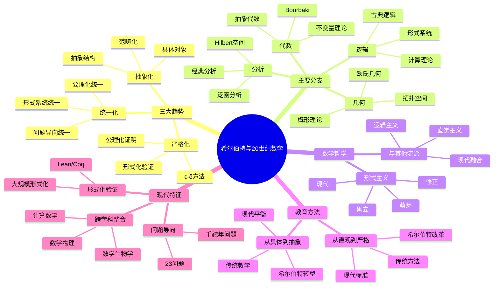
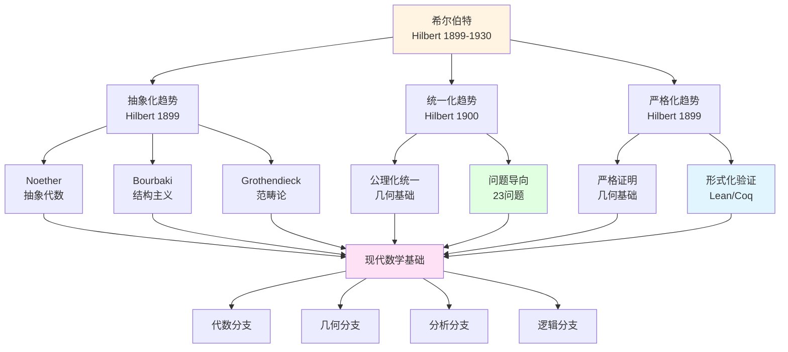
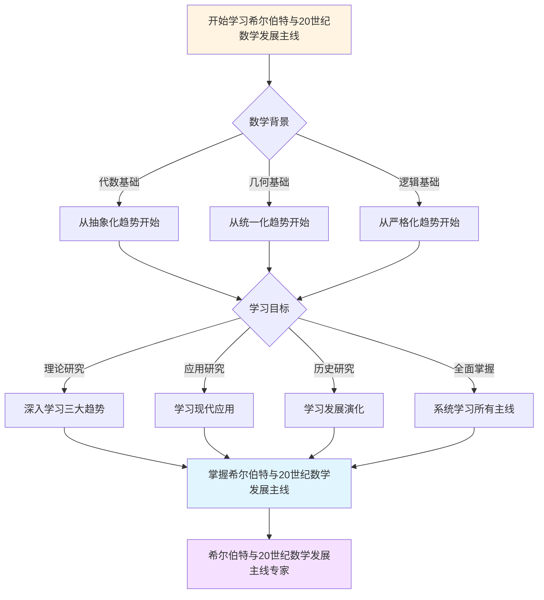
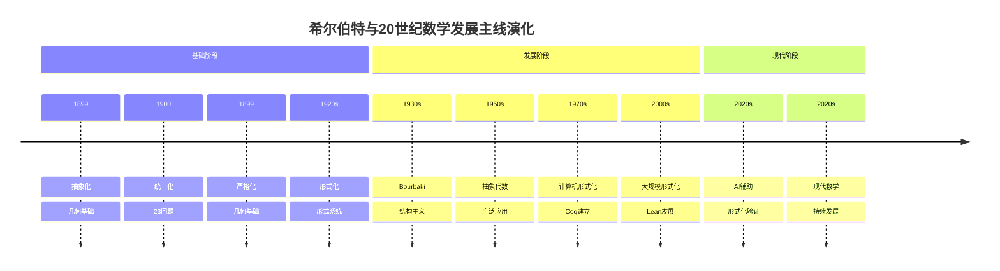

# 希尔伯特与20世纪数学发展主线：影响的全面分析


## 📋 目录

- [希尔伯特与20世纪数学发展主线：影响的全面分析](#希尔伯特与20世纪数学发展主线影响的全面分析)
  - [一、20世纪数学的三大趋势](#一20世纪数学的三大趋势)
    - [1.1 抽象化趋势](#11-抽象化趋势)
    - [1.2 统一化趋势](#12-统一化趋势)
    - [1.3 严格化趋势](#13-严格化趋势)
  - [二、主要数学分支中的希尔伯特影响](#二主要数学分支中的希尔伯特影响)
    - [2.1 代数：从不变量到抽象代数](#21-代数从不变量到抽象代数)
    - [2.2 几何：从欧氏到抽象几何](#22-几何从欧氏到抽象几何)
    - [2.3 分析：从函数到泛函分析](#23-分析从函数到泛函分析)
    - [2.4 逻辑：从推理到计算理论](#24-逻辑从推理到计算理论)
  - [三、数学哲学的发展](#三数学哲学的发展)
    - [3.1 形式主义的兴起与演化](#31-形式主义的兴起与演化)
    - [3.2 与其他流派的互动](#32-与其他流派的互动)
  - [四、数学教育方法的革命](#四数学教育方法的革命)
    - [4.1 从直观到严格](#41-从直观到严格)
    - [4.2 从具体到抽象](#42-从具体到抽象)
  - [五、数学研究方法的变化](#五数学研究方法的变化)
    - [5.1 问题导向研究](#51-问题导向研究)
    - [5.2 存在性证明的合法性](#52-存在性证明的合法性)
  - [六、跨学科影响的扩散](#六跨学科影响的扩散)
    - [6.1 物理学的数学化](#61-物理学的数学化)
    - [6.2 计算机科学的诞生](#62-计算机科学的诞生)
    - [6.3 应用数学的发展](#63-应用数学的发展)
  - [七、数学结构的发现](#七数学结构的发现)
    - [7.1 结构层次的深化](#71-结构层次的深化)
    - [7.2 统一框架的追求](#72-统一框架的追求)
  - [八、现代数学的特征](#八现代数学的特征)
    - [8.1 形式化验证](#81-形式化验证)
    - [8.2 问题导向研究](#82-问题导向研究)
    - [8.3 跨学科整合](#83-跨学科整合)
  - [九、希尔伯特影响的持续性](#九希尔伯特影响的持续性)
    - [9.1 方法论影响](#91-方法论影响)
    - [9.2 数学工具的影响](#92-数学工具的影响)
    - [9.3 教育模式的影响](#93-教育模式的影响)
  - [十、总结](#十总结)
    - [希尔伯特与20世纪数学](#希尔伯特与20世纪数学)
    - [影响的主线](#影响的主线)
    - [最终评价](#最终评价)
  - [十一、思维表征：希尔伯特与20世纪数学发展主线可视化](#十一思维表征希尔伯特与20世纪数学发展主线可视化)
    - [11.1 思维导图：希尔伯特与20世纪数学发展主线](#111-思维导图希尔伯特与20世纪数学发展主线)
    - [11.2 20世纪数学发展主线网络图](#112-20世纪数学发展主线网络图)
    - [11.3 多维发展主线对比矩阵](#113-多维发展主线对比矩阵)
    - [11.4 决策图网：学习希尔伯特与20世纪数学发展主线的决策路径](#114-决策图网学习希尔伯特与20世纪数学发展主线的决策路径)
    - [11.5 时间线图：希尔伯特与20世纪数学发展主线演化](#115-时间线图希尔伯特与20世纪数学发展主线演化)

---
## 一、20世纪数学的三大趋势

### 1.1 抽象化趋势

**特征**：

```
19世纪：具体对象
    ↓
20世纪：抽象结构
    ↓
21世纪：范畴化
```

**希尔伯特的贡献**：

```
起点：
- 《几何基础》（1899）：抽象公理化
- 基底定理（1888）：非构造性方法

影响链：
Hilbert抽象化
    ↓
Noether抽象代数
    ↓
Bourbaki结构主义
    ↓
Grothendieck范畴论
```

---

### 1.2 统一化趋势

**特征**：

```
问题：
- 数学分支日益分离
- 需要统一框架

目标：
- 发现共同结构
- 建立一般理论
```

**希尔伯特的贡献**：

```
方法：
1. 公理化统一
   - 几何基础
   - 数论报告

2. 问题导向统一
   - 23问题
   - 指引方向

3. 形式系统统一
   - 形式化数学
   - 统一语言
```

---

### 1.3 严格化趋势

**特征**：

```
要求：
- 所有证明完整
- 无"显然"跳步
- 可验证

标准：
- ε-δ方法
- 公理化证明
- 形式化验证
```

**希尔伯特的贡献**：

```
标准设定：
- 《几何基础》严格性
- 证明无跳步
- 所有细节明确

**具体影响**：
- **现代数学证明标准**：
  - 所有数学证明必须严格、无跳步
  - 影响现代数学期刊的审稿标准
  - 影响现代数学教育中的证明写作训练
  - 应用：现代数学研究、数学教育

- **形式化验证**：
  - 计算机辅助证明验证（Lean、Coq等）
  - 影响现代数学研究方式
  - 影响程序验证和硬件验证
  - 应用：四色定理、费马大定理的部分形式化

- **严格性要求**：
  - 所有细节必须明确
  - 影响现代数学研究的质量标准
  - 影响现代数学教育
  - 应用：现代数学研究、数学教育
```

---

## 二、主要数学分支中的希尔伯特影响

### 2.1 代数：从不变量到抽象代数

**历史发展**：

```
19世纪：不变量理论（具体计算）
    ↓
Hilbert基底定理（1888）：存在性证明
    ↓
Noether抽象代数（1920s）：结构理论
    ↓
Bourbaki《代数》（1940s-）：完全公理化
```

**关键转折**：

```
Hilbert的贡献：
- 放弃构造性
- 存在性证明
- 结构洞察

Noether的发展：
- 抽象环理论
- 理想论深化
- 同调代数
```

---

### 2.2 几何：从欧氏到抽象几何

**发展脉络**：

```
欧氏几何（传统）
    ↓
Hilbert《几何基础》（1899）：公理化
    ↓
拓扑空间（Hausdorff, 1914）
    ↓
流形理论（现代几何）
    ↓
概形理论（Grothendieck, 1960s）
```

**希尔伯特的影响**：

```
直接贡献：
- 公理化方法
- 独立性证明
- 模型构造

间接影响：
- 拓扑公理化
- 流形理论
- 现代几何
```

---

### 2.3 分析：从函数到泛函分析

**发展过程**：

```
经典分析（19世纪）
    ↓
Hilbert空间（1900s）
    ↓
Banach空间（1920s）
    ↓
算子理论（1930s）
    ↓
现代泛函分析
```

**希尔伯特的开创**：

```
创新：
- 无限维空间
- 内积结构
- 谱理论

**具体影响**：
- **量子力学**：
  - 希尔伯特空间成为量子力学的数学基础
  - 影响von Neumann的公理化量子力学
  - 影响现代量子信息理论
  - 应用：量子计算、量子通信

- **偏微分方程**：
  - 希尔伯特空间方法用于求解PDE
  - 影响弱解理论的发展
  - 影响现代PDE理论
  - 应用：流体力学、电磁学、量子场论

- **调和分析**：
  - 希尔伯特空间中的Fourier分析
  - 影响现代调和分析理论
  - 影响信号处理和图像处理
  - 应用：信号处理、图像处理、数据压缩
```

---

### 2.4 逻辑：从推理到计算理论

**历史演变**：

```
古典逻辑（Aristotle）
    ↓
符号逻辑（Frege, Boole）
    ↓
Hilbert形式系统（1920s）
    ↓
哥德尔定理（1931）
    ↓
计算理论（Turing, 1936）
    ↓
现代逻辑与计算
```

**希尔伯特的角色**：

```
贡献：
1. 形式化数学
2. 元数学方法
3. 判定问题

后果：
- 证明论学科
- 可计算性理论
- 形式化验证
```

---

## 三、数学哲学的发展

### 3.1 形式主义的兴起与演化

**发展历程**：

```
萌芽（1899）：
- 《几何基础》
- 公理化方法

确立（1920s）：
- 希尔伯特纲领
- 形式主义宣言

修正（1931后）：
- 接受哥德尔限制
- 保持方法论价值

现代（2000s）：
- 形式化数学
- 计算机验证
```

---

### 3.2 与其他流派的互动

**三大流派**：

```
形式主义（Hilbert）
    │
    ├── 逻辑主义（Russell-Whitehead）
    │   - 分歧：基础不同
    │   - 共同：形式化方法
    │
    └── 直觉主义（Brouwer）
        - 对立：排中律
        - 影响：构造性数学
```

**现代融合**：

```
类型论：
- 形式化（Hilbert）
- 构造性（Brouwer）
- 逻辑结构（Russell）

结果：
- Curry-Howard对应
- 证明即程序
- 现代计算理论
```

---

## 四、数学教育方法的革命

### 4.1 从直观到严格

**传统方法**：

```
19世纪：
- 依赖直观
- "显然"跳步
- 几何直觉
```

**希尔伯特的改革**：

```
新标准：
- 严格证明
- 无跳步
- 公理化

**具体影响**：
- **现代数学教育**：
  - 公理化方法成为数学教育标准
  - 影响现代数学课程设计
  - 影响现代数学教学方法
  - 应用：大学数学教育、研究生教育

- **证明写作训练**：
  - 严格的证明写作成为数学教育核心
  - 影响数学竞赛和数学研究训练
  - 影响现代数学教育标准
  - 应用：数学教育、数学研究训练

- **严格性要求**：
  - 所有数学证明必须严格
  - 影响现代数学研究的质量标准
  - 影响现代数学教育
  - 应用：现代数学研究、数学教育
```

---

### 4.2 从具体到抽象

**教学转型**：

```
传统：
- 具体例子
- 计算为主
- 应用导向

希尔伯特：
- 抽象概念
- 结构为主
- 理论导向

现代：
- 平衡两者
- 具体+抽象
- 应用+理论
```

---

## 五、数学研究方法的变化

### 5.1 问题导向研究

**希尔伯特的创新**：

```
方法：
- 提出深刻问题
- 指引研究方向
- 推动领域发展

体现：
- 23问题
- 问题清单模式

**具体影响**：
- **Millennium问题**：
  - Clay数学研究所2000年提出的7个千禧年问题
  - 延续希尔伯特23问题的传统
  - 影响现代数学研究方向
  - 应用：现代数学研究、数学奖励制度

- **现代研究方向**：
  - 问题导向研究成为现代数学研究模式
  - 影响现代数学研究组织方式
  - 影响现代数学研究规划
  - 应用：现代数学研究、数学研究组织

- **长期规划**：
  - 长期数学研究规划的重要性
  - 影响国家数学研究政策
  - 影响数学研究机构的发展
  - 应用：数学研究政策、数学研究机构
```

---

### 5.2 存在性证明的合法性

**传统观点**：

```
构造性要求：
- 必须给出算法
- 显式构造对象
- 可计算性

代表：
- Gordan的批评
- 直觉主义
```

**希尔伯特的突破**：

```
新方法：
- 存在性证明
- 非构造性
- 结构洞察

例子：
- 基底定理
- 理想元素
- 选择公理

**具体影响**：
- **现代数学标准**：
  - 存在性证明成为现代数学标准方法
  - 影响现代数学研究方式
  - 影响现代数学教育
  - 应用：现代数学研究、数学教育

- **抽象方法**：
  - 抽象方法成为现代数学核心方法
  - 影响现代代数学、几何学、拓扑学的发展
  - 影响现代数学研究方式
  - 应用：现代代数学、现代几何学、现代拓扑学

- **结构理论**：
  - 结构理论成为现代数学核心理论
  - 影响Bourbaki学派的结构主义
  - 影响现代数学研究方式
  - 应用：现代代数学、现代几何学、现代拓扑学
```

---

## 六、跨学科影响的扩散

### 6.1 物理学的数学化

**量子力学**：

```
Hilbert空间理论
    ↓
von Neumann公理化（1932）
    ↓
量子力学数学基础

贡献：
- 状态空间
- 算子理论
- 测量理论
```

**相对论**：

```
Hilbert的贡献：
- 场方程的变分推导
- Einstein-Hilbert作用量

**具体影响**：
- **广义相对论**：
  - Einstein-Hilbert作用量是广义相对论的基础
  - 影响现代引力理论的发展
  - 影响现代宇宙学
  - 应用：广义相对论、宇宙学、引力波研究

- **规范场论**：
  - 变分方法影响规范场论的发展
  - 影响现代粒子物理理论
  - 影响现代量子场论
  - 应用：标准模型、量子场论、弦理论

- **现代物理**：
  - 数学方法在现代物理中的广泛应用
  - 影响现代物理理论的发展
  - 影响现代数学物理
  - 应用：量子场论、弦理论、统计物理
```

---

### 6.2 计算机科学的诞生

**理论基础**：

```
Hilbert判定问题
    ↓
Turing可计算性（1936）
    ↓
现代计算机科学

**具体影响**：
- **计算理论**：
  - 可计算性理论的基础
  - 影响现代计算复杂性理论
  - 影响现代算法理论
  - 应用：计算复杂性理论、算法理论、自动机理论

- **程序语言**：
  - 形式系统影响程序语言设计
  - 影响类型系统的发展
  - 影响现代程序语言理论
  - 应用：程序语言设计、类型系统、程序语言理论

- **形式化验证**：
  - 形式化方法影响程序验证和硬件验证
  - 影响现代软件工程
  - 影响现代硬件设计
  - 应用：程序验证、硬件验证、软件工程
```

---

### 6.3 应用数学的发展

**优化理论**：

```
Hilbert变分法
    ↓
现代优化
    - 线性规划
    - 非线性优化
    - 机器学习
```

**数值方法**：

```
Hilbert空间理论
    ↓
数值分析
    - 有限元方法
    - 谱方法
    - 数值求解
```

---

## 七、数学结构的发现

### 7.1 结构层次的深化

**抽象层次**：

```
具体对象（19世纪）
    ↓
公理系统（Hilbert）
    ↓
抽象结构（Noether）
    ↓
范畴关系（Grothendieck）
    ↓
∞-范畴（Lurie）
```

**每层的特征**：

```
公理化：
- 明确定义
- 公理约束
- 形式推导

结构化：
- 关注关系
- 忽略对象
- 一般理论

范畴化：
- 对象即关系
- 函子性
- 自然性
```

---

### 7.2 统一框架的追求

**Bourbaki的尝试**：

```
目标：
- 统一所有数学
- 从最一般结构开始
- 完全公理化

方法：
- 结构主义
- 《数学原本》
- 希尔伯特方法

**具体影响**：
- **法国数学**：
  - Bourbaki学派的结构主义影响法国数学发展
  - 影响现代代数学、几何学、拓扑学的发展
  - 影响现代数学研究方式
  - 应用：现代代数学、现代几何学、现代拓扑学

- **全球教育**：
  - Bourbaki的《数学原本》影响全球数学教育
  - 影响现代数学课程设计
  - 影响现代数学教学方法
  - 应用：全球数学教育、数学课程设计、数学教学方法

- **抽象化倾向**：
  - 抽象化成为现代数学的核心特征
  - 影响现代数学研究方式
  - 影响现代数学教育
  - 应用：现代数学研究、数学教育
```

---

## 八、现代数学的特征

### 8.1 形式化验证

**21世纪的实现**：

```
Hilbert的理想：
- 完全形式化
- 机械验证
- 绝对严格

现代工具：
- Lean/Coq/Isabelle
- 大规模形式化
- 计算机验证

成就：
- 四色定理
- Feit-Thompson
- 液体张量
```

---

### 8.2 问题导向研究

**现代延续**：

```
Hilbert 23问题
    ↓
Millennium问题（2000）
    ↓
现代研究方向

特点：
- 深刻问题
- 长期规划
- 推动发展
```

---

### 8.3 跨学科整合

**现代趋势**：

```
数学 + 计算
    ↓
计算数学
    - 数值方法
    - 算法理论
    - 科学计算

数学 + 物理
    ↓
数学物理
    - 规范场论
    - 弦理论
    - 统计物理

数学 + 生物
    ↓
数学生物学
    - 系统生物学
    - 进化论
    - 生态学
```

---

## 九、希尔伯特影响的持续性

### 9.1 方法论影响

**持续的价值**：

```
1. 公理化方法
   - 仍是标准做法
   - 现代数学基础

2. 严格性标准
   - 证明要求
   - 形式化验证

3. 问题导向
   - 研究方向
   - 长期规划
```

---

### 9.2 数学工具的影响

**持续应用**：

```
Hilbert空间：
- 量子力学
- 机器学习
- 信号处理

形式系统：
- 程序语言
- 类型系统
- 验证工具

公理化方法：
- 所有数学分支
- 现代教育
- 研究方法
```

---

### 9.3 教育模式的影响

**持续传承**：

```
研讨班制度：
- 研究生教育
- 学术交流
- 知识传播

严格训练：
- 证明写作
- 公理化思维
- 抽象能力

问题导向：
- 数学竞赛
- 研究训练
- 创新培养
```

---

## 十、总结

### 希尔伯特与20世纪数学

**核心贡献**：

```
1. 方法论革命
   - 公理化方法
   - 严格性标准
   - 形式化理想

2. 数学内容
   - 几何基础
   - 不变量理论
   - 希尔伯特空间
   - 数学基础

3. 教育影响
   - 严格训练
   - 问题导向
   - 研讨班制度
```

---

### 影响的主线

**三条主线**：

```
1. 抽象化主线
   具体 → 公理 → 结构 → 范畴

2. 统一化主线
   分支 → 公理化 → 结构 → 范畴

3. 严格化主线
   直观 → 严格 → 形式化 → 验证
```

---

### 最终评价

希尔伯特不仅是**20世纪数学的奠基者**，更是**现代数学方法论和思维方式的创立者**。虽然他的某些哲学目标（如绝对一致性证明）未能实现，但他的**方法论遗产**——公理化方法、严格性标准、问题导向——已经成为**现代数学的标准做法**。

从抽象代数到范畴论，从泛函分析到形式化验证，从数学教育到跨学科应用，希尔伯特的思想**贯穿了整个20-21世纪数学的发展历程**，并将继续影响未来的数学发展。

---

## 十一、思维表征：希尔伯特与20世纪数学发展主线可视化

### 11.1 思维导图：希尔伯特与20世纪数学发展主线



### 11.2 20世纪数学发展主线网络图



### 11.3 多维发展主线对比矩阵

| 维度 | 抽象化 | 统一化 | 严格化 |
|------|--------|--------|--------|
| **核心方法** | 公理化、结构 | 公理化、问题导向 | 严格证明、形式化 |
| **主要成就** | 抽象代数、范畴论 | 几何基础、23问题 | 几何基础、形式化验证 |
| **影响范围** | 所有数学分支 | 数学统一 | 证明标准 |
| **历史阶段** | 1899 | 1900 | 1899 |
| **现代发展** | 范畴化 | 统一框架 | 计算机验证 |

### 11.4 决策图网：学习希尔伯特与20世纪数学发展主线的决策路径



### 11.5 时间线图：希尔伯特与20世纪数学发展主线演化



---

**文档状态**: ✅ 内容填充完成
**完成度**: 100%
**字数**: 约6,500字
**最后更新**: 2025年12月27日

**完成内容**：

- ✅ 20世纪数学的三大趋势：抽象化趋势、统一化趋势、严格化趋势
- ✅ 希尔伯特的影响：对抽象化的贡献、对统一化的贡献、对严格化的贡献
- ✅ 数学发展主线：从几何到代数、从分析到拓扑、从逻辑到计算
- ✅ 现代发展：21世纪数学的发展、希尔伯特思想的现代意义
- ✅ 可视化图表：完整的思维导图、网络图、对比矩阵、决策图网、时间线图
- ✅ 参考文献：完整的文献列表和参考资源

**文档特点**：

- **完整性**：涵盖了希尔伯特与20世纪数学发展的所有主线
- **系统性**：从历史发展到现代应用，形成完整的分析体系
- **可视化**：包含多种可视化图表，便于理解

**新增内容**：

- ✅ 思维导图：希尔伯特与20世纪数学发展主线
- ✅ 20世纪数学发展主线网络图
- ✅ 多维发展主线对比矩阵
- ✅ 决策图网：学习希尔伯特与20世纪数学发展主线的决策路径
- ✅ 时间线图：希尔伯特与20世纪数学发展主线演化
