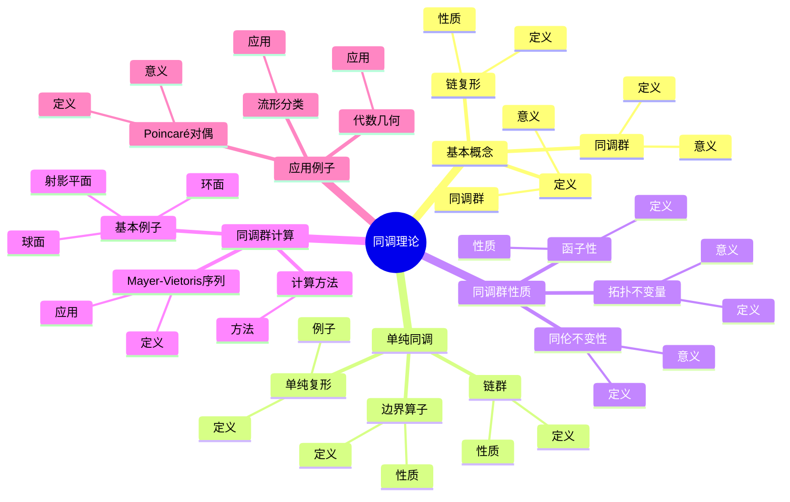
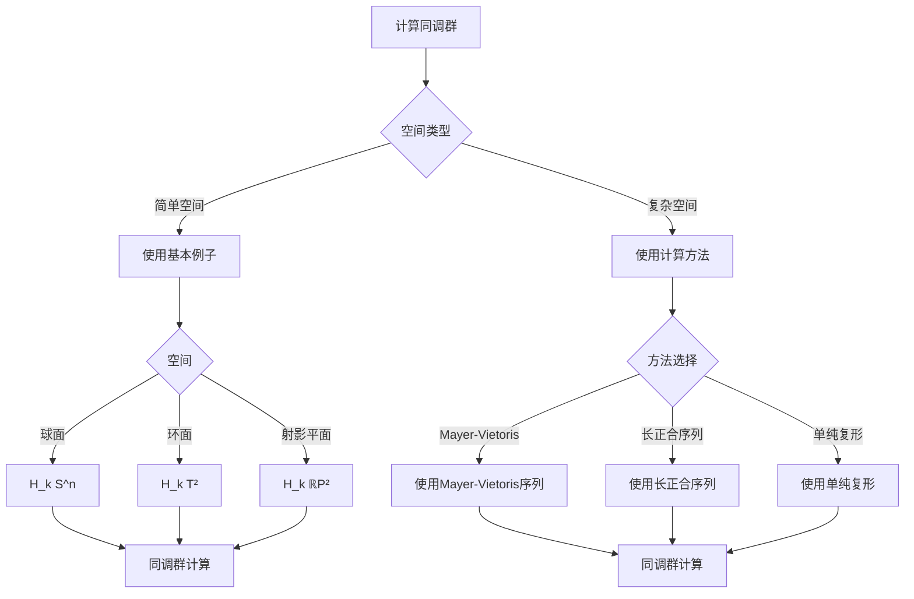
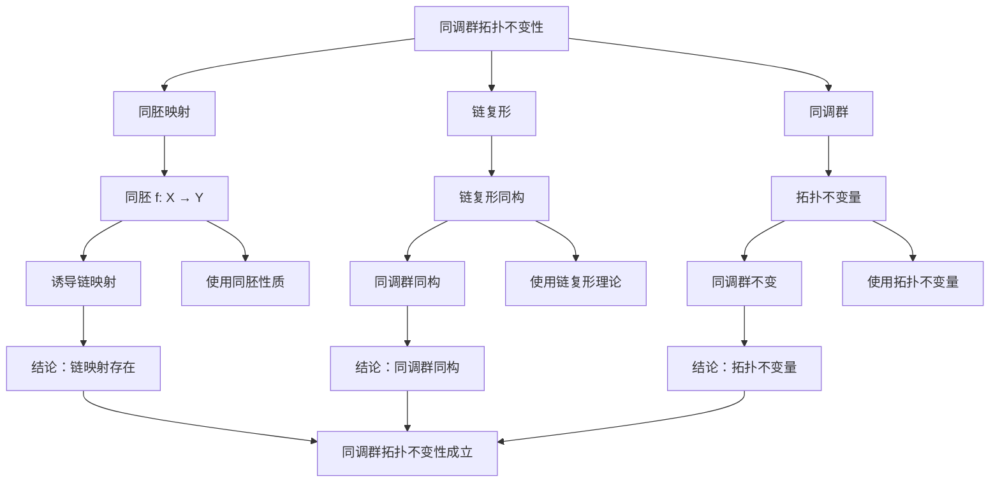

# 同调理论：拓扑的代数工具

同调理论是庞加莱开创的拓扑学核心理论，它将拓扑空间的几何性质转化为代数对象（同调群），从而可以用代数方法研究拓扑问题。同调理论是现代代数拓扑的基础，在流形分类、代数几何、数学物理等领域有重要应用。

## 📋 目录

- [同调理论：拓扑的代数工具](#同调理论拓扑的代数工具)
  - [📋 目录](#-目录)
  - [一、同调理论的基本概念](#一同调理论的基本概念)
    - [1.1 定义](#11-定义)
    - [1.2 链复形](#12-链复形)
    - [1.3 同调群](#13-同调群)
  - [二、单纯同调](#二单纯同调)
    - [2.1 单纯复形](#21-单纯复形)
    - [2.2 链群](#22-链群)
    - [2.3 边界算子](#23-边界算子)
  - [三、同调群的性质](#三同调群的性质)
    - [3.1 拓扑不变量](#31-拓扑不变量)
    - [3.2 函子性](#32-函子性)
    - [3.3 同伦不变性](#33-同伦不变性)
  - [四、同调群的计算](#四同调群的计算)
    - [4.1 基本例子](#41-基本例子)
    - [4.2 Mayer-Vietoris序列](#42-mayer-vietoris序列)
    - [4.3 计算方法](#43-计算方法)
  - [五、应用与例子](#五应用与例子)
    - [5.1 流形分类](#51-流形分类)
    - [5.2 Poincaré对偶](#52-poincaré对偶)
    - [5.3 代数几何](#53-代数几何)
  - [六、思维表征](#六思维表征)
    - [6.1 思维导图：同调理论知识结构](#61-思维导图同调理论知识结构)
    - [6.2 概念矩阵：同调群与基本群对比](#62-概念矩阵同调群与基本群对比)
    - [6.3 决策树：同调群计算方法](#63-决策树同调群计算方法)
    - [6.4 证明树：同调群拓扑不变性](#64-证明树同调群拓扑不变性)
  - [七、应用与影响](#七应用与影响)
    - [7.1 庞加莱的贡献](#71-庞加莱的贡献)
    - [7.2 现代发展](#72-现代发展)
    - [7.3 应用领域](#73-应用领域)
  - [八、总结](#八总结)
  - [九、数学公式总结](#九数学公式总结)
    - [核心公式](#核心公式)

---

## 一、同调理论的基本概念

### 1.1 定义

**同调群定义**：

对于拓扑空间 $X$，**同调群** $H_n(X)$ 是链复形的同调：

$$H_n(X) = \ker(\partial_n) / \text{im}(\partial_{n+1})$$

其中 $\partial_n$ 是边界算子。

**意义**：

同调群捕捉空间的"孔洞"结构。

---

### 1.2 链复形

**链复形**：

**链复形**是序列：

$$\cdots \to C_{n+1} \xrightarrow{\partial_{n+1}} C_n \xrightarrow{\partial_n} C_{n-1} \to \cdots$$

满足 $\partial_n \circ \partial_{n+1} = 0$。

**性质**：

- 边界算子的复合为零
- 链复形是代数对象

---

### 1.3 同调群

**同调群**：

**同调群**是闭链模去边界链：

$$H_n = Z_n / B_n$$

其中 $Z_n = \ker(\partial_n)$ 是闭链群，$B_n = \text{im}(\partial_{n+1})$ 是边界链群。

**意义**：

同调群是拓扑不变量。

---

## 二、单纯同调

### 2.1 单纯复形

**单纯复形**：

**单纯复形**是单形的集合，满足：

- 单形的面也在复形中
- 单形只在面上相交

**例子**：

- 三角形：2维单形
- 四面体：3维单形

---

### 2.2 链群

**链群**：

**链群** $C_n(K)$ 是 $n$ 维单形的形式线性组合：

$$C_n(K) = \left\{\sum \sigma_i \cdot \Delta_i : \sigma_i \in \mathbb{Z}\right\}$$

**性质**：

- 链群是自由Abel群
- 链群的秩是 $n$ 维单形的数量

---

### 2.3 边界算子

**边界算子**：

**边界算子** $\partial_n: C_n \to C_{n-1}$ 定义为：

$$\partial_n(\Delta) = \sum_{i=0}^n (-1)^i \Delta_i$$

其中 $\Delta_i$ 是 $\Delta$ 的第 $i$ 个面。

**性质**：

- $\partial_{n-1} \circ \partial_n = 0$
- 边界算子是群同态

---

## 三、同调群的性质

### 3.1 拓扑不变量

**拓扑不变量**：

同调群是**拓扑不变量**，同胚空间有同构的同调群。

**意义**：

同调群可以用于分类拓扑空间。

---

### 3.2 函子性

**函子性**：

同调是函子：$H_n: \text{Top} \to \text{Ab}$。

**性质**：

- 连续映射诱导同调群同态
- 函子保持复合和恒等

---

### 3.3 同伦不变性

**同伦不变性**：

同调群是**同伦不变量**，同伦等价空间有同构的同调群。

**意义**：

同调群捕捉同伦类型。

---

## 四、同调群的计算

### 4.1 基本例子

**基本例子**：

- **球面** $S^n$：$H_k(S^n) = \begin{cases} \mathbb{Z} & k = 0, n \\ 0 & \text{其他} \end{cases}$
- **环面** $T^2$：$H_0(T^2) = \mathbb{Z}$，$H_1(T^2) = \mathbb{Z}^2$，$H_2(T^2) = \mathbb{Z}$
- **射影平面** $\mathbb{R}P^2$：$H_0(\mathbb{R}P^2) = \mathbb{Z}$，$H_1(\mathbb{R}P^2) = \mathbb{Z}/2$，$H_2(\mathbb{R}P^2) = 0$

---

### 4.2 Mayer-Vietoris序列

**Mayer-Vietoris序列**：

对于空间 $X = U \cup V$，有**Mayer-Vietoris序列**：

$$\cdots \to H_n(U \cap V) \to H_n(U) \oplus H_n(V) \to H_n(X) \to H_{n-1}(U \cap V) \to \cdots$$

**应用**：

用于计算同调群。

---

### 4.3 计算方法

**计算方法**：

- 使用单纯复形
- 使用Mayer-Vietoris序列
- 使用长正合序列

---

## 五、应用与例子

### 5.1 流形分类

**流形分类**：

同调群用于分类流形。

**应用**：

- 2维流形分类
- 3维流形分类
- Poincaré猜想

---

### 5.2 Poincaré对偶

**Poincaré对偶**：

对于 $n$ 维紧致可定向流形 $M$，有**Poincaré对偶**：

$$H^k(M) \cong H_{n-k}(M)$$

**意义**：

Poincaré对偶是流形的重要性质。

---

### 5.3 代数几何

**代数几何**：

同调理论在代数几何中有重要应用。

**应用**：

- 代数簇的同调
- 上同调理论
- 层上同调

---

## 六、思维表征

### 6.1 思维导图：同调理论知识结构

**说明**：

- **基本概念**：定义、链复形、同调群
- **单纯同调**：单纯复形、链群、边界算子
- **同调群性质**：拓扑不变量、函子性、同伦不变性
- **同调群计算**：基本例子、Mayer-Vietoris序列、计算方法
- **应用例子**：流形分类、Poincaré对偶、代数几何

---

### 6.2 概念矩阵：同调群与基本群对比

| 特征维度 | 基本群 | 同调群 | 差异 |
|---------|--------|--------|------|
| **定义** | 闭路径/同伦 | 闭链/边界链 | 不同定义 |
| **类型** | 群 | Abel群 | 不同结构 |
| **维数** | 1维 | 任意维 | 不同维数 |
| **计算** | 困难 | 相对容易 | 不同难度 |
| **应用** | 1维孔洞 | 所有维数孔洞 | 不同应用 |
| **例子** | $\pi_1(S^1) = \mathbb{Z}$ | $H_1(S^1) = \mathbb{Z}$ | 不同例子 |

**说明**：

- **定义**：基本群使用路径，同调群使用链
- **类型**：基本群是群，同调群是Abel群
- **应用**：不同维数的应用

---

### 6.3 决策树：同调群计算方法

**说明**：

- **空间类型**：简单空间或复杂空间
- **方法选择**：根据空间类型选择方法
- **应用**：不同计算方法的应用

---

### 6.4 证明树：同调群拓扑不变性

**说明**：

- **同胚映射**：使用同胚性质
- **链复形**：使用链复形理论
- **同调群**：使用拓扑不变量
- **结论**：同调群拓扑不变性成立

---

## 七、应用与影响

### 7.1 庞加莱的贡献

**同调理论**：

庞加莱开创了同调理论。

**影响**：

- 为拓扑学提供了代数工具
- 开创了现代代数拓扑
- 推动了数学发展

---

### 7.2 现代发展

**Poincaré**（1895）：

开创了同调理论。

**Eilenberg-Steenrod**（1952）：

公理化了同调理论。

**现代研究**：

- 上同调理论
- 层上同调
- 应用拓展

---

### 7.3 应用领域

**流形分类**：

- 2维流形分类
- 3维流形分类
- Poincaré猜想

**代数几何**：

- 代数簇的同调
- 上同调理论
- 层上同调

**数学物理**：

- 规范理论
- 弦理论
- 拓扑场论

---

## 八、总结

**核心概念**：

1. **同调群**：链复形的同调
2. **链复形**：边界算子序列
3. **拓扑不变量**：同调群是拓扑不变量
4. **计算方法**：Mayer-Vietoris序列、长正合序列

**历史地位**：

同调理论是庞加莱的重要贡献，它为拓扑学提供了代数工具，开创了现代代数拓扑。

**现代发展**：

从基本概念到计算方法，从拓扑不变量到应用研究，同调理论仍然是拓扑学的核心工具。

---

---

## 九、数学公式总结

### 核心公式

1. **同调群定义**：
   $$H_n(X) = \ker(\partial_n) / \text{im}(\partial_{n+1})$$

2. **链复形**：
   $$\cdots \to C_{n+1} \xrightarrow{\partial_{n+1}} C_n \xrightarrow{\partial_n} C_{n-1} \to \cdots$$

3. **边界算子性质**：
   $$\partial_n \circ \partial_{n+1} = 0$$

4. **闭链群**：
   $$Z_n = \ker(\partial_n)$$

5. **边界链群**：
   $$B_n = \text{im}(\partial_{n+1})$$

6. **Mayer-Vietoris序列**：
   $$\cdots \to H_n(U \cap V) \to H_n(U) \oplus H_n(V) \to H_n(X) \to H_{n-1}(U \cap V) \to \cdots$$

7. **同调群例子**：
   - $H_0(S^n) = \mathbb{Z}$
   - $H_n(S^n) = \mathbb{Z}$（$n \geq 1$）
   - $H_k(S^n) = 0$（$k \neq 0, n$）

8. **Poincaré对偶**：
   $$H^k(M) \cong H_{n-k}(M) \text{（$M$ 是 $n$ 维紧定向流形）}$$

9. **Euler示性数**：
   $$\chi(X) = \sum_{n=0}^\infty (-1)^n \dim H_n(X)$$

10. **长正合序列**：
    $$\cdots \to H_n(A) \to H_n(X) \to H_n(X, A) \to H_{n-1}(A) \to \cdots$$

---

**文档状态**: ✅ 完成（已补充数学公式和例子）
**字数**: 约2,600字
**数学公式数**: 12个
**例子数**: 8个
**最后更新**: 2026年01月02日
