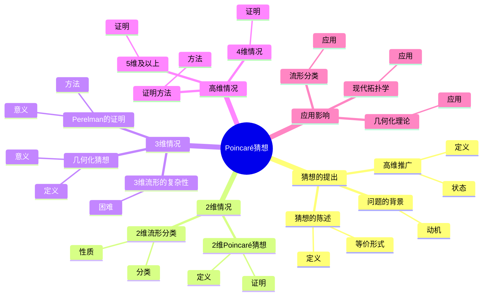
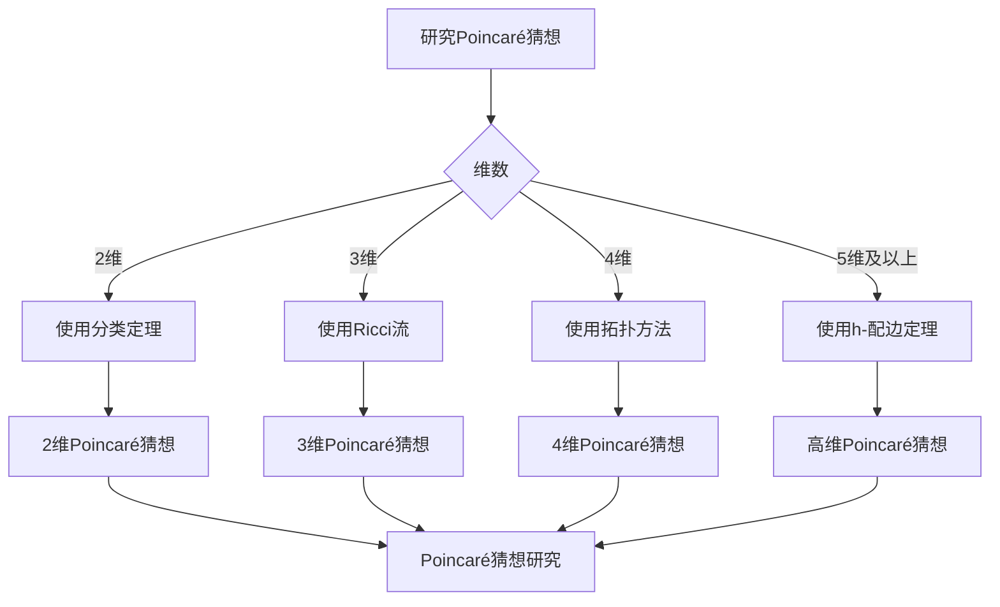
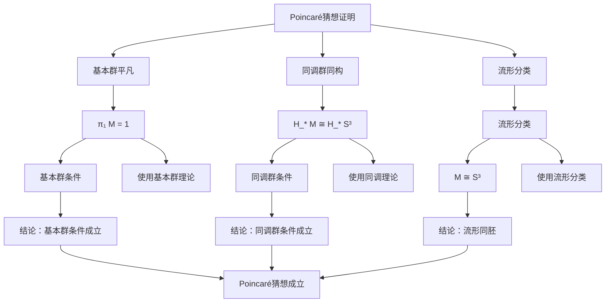

# Poincaré猜想：拓扑学的世纪难题

Poincaré猜想是庞加莱在1904年提出的拓扑学问题，它问：如果一个3维闭流形的基本群是平凡的，那么这个流形是否同胚于3维球面？这个问题困扰了数学家近一个世纪，直到2003年才被Perelman证明。Poincaré猜想是拓扑学中最重要的问题之一，它的解决推动了3维流形理论的发展。

## 📋 目录

- [Poincaré猜想：拓扑学的世纪难题](#poincaré猜想拓扑学的世纪难题)
  - [📋 目录](#-目录)
  - [一、Poincaré猜想的提出](#一poincaré猜想的提出)
    - [1.1 问题的背景](#11-问题的背景)
    - [1.2 猜想的陈述](#12-猜想的陈述)
    - [1.3 高维推广](#13-高维推广)
  - [二、2维情况](#二2维情况)
    - [2.1 2维流形分类](#21-2维流形分类)
    - [2.2 2维Poincaré猜想](#22-2维poincaré猜想)
    - [2.3 证明](#23-证明)
  - [三、3维情况](#三3维情况)
    - [3.1 3维流形的复杂性](#31-3维流形的复杂性)
    - [3.2 几何化猜想](#32-几何化猜想)
    - [3.3 Perelman的证明](#33-perelman的证明)
  - [四、高维情况](#四高维情况)
    - [4.1 4维情况](#41-4维情况)
    - [4.2 5维及以上](#42-5维及以上)
    - [4.3 证明方法](#43-证明方法)
  - [五、应用与影响](#五应用与影响)
    - [5.1 流形分类](#51-流形分类)
    - [5.2 几何化理论](#52-几何化理论)
    - [5.3 现代拓扑学](#53-现代拓扑学)
  - [六、思维表征](#六思维表征)
    - [6.1 思维导图：Poincaré猜想知识结构](#61-思维导图poincaré猜想知识结构)
    - [6.2 概念矩阵：不同维数Poincaré猜想对比](#62-概念矩阵不同维数poincaré猜想对比)
    - [6.3 决策树：Poincaré猜想研究方法](#63-决策树poincaré猜想研究方法)
    - [6.4 证明树：Poincaré猜想证明思路](#64-证明树poincaré猜想证明思路)
  - [七、应用与影响](#七应用与影响)
    - [7.1 庞加莱的贡献](#71-庞加莱的贡献)
    - [7.2 现代发展](#72-现代发展)
    - [7.3 应用领域](#73-应用领域)
  - [八、总结](#八总结)
  - [九、数学公式总结](#九数学公式总结)
    - [核心公式](#核心公式)

---

## 一、Poincaré猜想的提出

### 1.1 问题的背景

**问题的背景**：

庞加莱在研究3维流形分类时提出了Poincaré猜想。

**动机**：

- 理解3维流形的结构
- 分类3维流形
- 研究基本群的作用

---

### 1.2 猜想的陈述

**Poincaré猜想**（1904）：

如果一个3维闭流形 $M$ 满足：

1. **连通性**：$M$ 是连通的
2. **基本群**：$\pi_1(M) = \{1\}$（平凡群）
3. **同调群**：$H_*(M) \cong H_*(S^3)$

那么 $M$ 是否同胚于3维球面 $S^3$？

**等价形式**：

如果3维闭流形的基本群是平凡的，那么它是否同胚于 $S^3$？

---

### 1.3 高维推广

**高维Poincaré猜想**：

对于 $n \\\geq 4$，**高维Poincaré猜想**问：如果 $n$ 维闭流形 $M$ 满足 $H_*(M) \cong H_*(S^n)$，那么 $M$ 是否同胚于 $S^n$？

**状态**：

- $n \\\geq 5$：已证明（Smale，1961）
- $n = 4$：已证明（Freedman，1982）
- $n = 3$：已证明（Perelman，2003）

---

## 二、2维情况

### 2.1 2维流形分类

**2维流形分类**：

2维闭流形可以完全分类：

- **球面** $S^2$
- **环面** $T^2$
- **亏格 $g$ 的曲面** $\Sigma_g$

**性质**：

- 基本群完全确定2维流形
- 分类是完整的

---

### 2.2 2维Poincaré猜想

**2维Poincaré猜想**：

如果2维闭流形 $M$ 的基本群是平凡的，那么 $M$ 同胚于 $S^2$。

**证明**：

使用2维流形分类定理。

---

### 2.3 证明

**证明**：

- 2维流形分类定理
- 基本群的计算
- 拓扑分类

---

## 三、3维情况

### 3.1 3维流形的复杂性

**3维流形的复杂性**：

3维流形比2维流形复杂得多。

**困难**：

- 没有简单的分类
- 基本群不足以分类
- 需要新的工具

---

### 3.2 几何化猜想

**Thurston几何化猜想**：

**Thurston几何化猜想**（1982）断言每个3维流形可以分解为几何块。

**几何类型**：

- 球面几何
- 双曲几何
- 其他几何类型

**意义**：

几何化猜想蕴含Poincaré猜想。

---

### 3.3 Perelman的证明

**Perelman的证明**（2003）：

Perelman使用**Ricci流**证明了Poincaré猜想。

**方法**：

- 使用Ricci流
- 研究奇点
- 证明几何化

**意义**：

解决了这个世纪难题。

---

## 四、高维情况

### 4.1 4维情况

**4维Poincaré猜想**：

**4维Poincaré猜想**由Freedman证明（1982）。

**方法**：

- 使用拓扑方法
- 研究4维流形
- 证明分类

---

### 4.2 5维及以上

**高维Poincaré猜想**：

**高维Poincaré猜想**（$n \\\geq 5$）由Smale证明（1961）。

**方法**：

- 使用h-配边定理
- 研究高维流形
- 证明分类

---

### 4.3 证明方法

**证明方法**：

- **2维**：分类定理
- **3维**：Ricci流
- **4维**：拓扑方法
- **5维及以上**：h-配边定理

---

## 五、应用与影响

### 5.1 流形分类

**流形分类**：

Poincaré猜想的解决推动了流形分类。

**应用**：

- 3维流形分类
- 几何化理论
- 流形理论

---

### 5.2 几何化理论

**几何化理论**：

Thurston的几何化理论为3维流形提供了分类。

**应用**：

- 3维流形研究
- 双曲几何
- 几何拓扑

---

### 5.3 现代拓扑学

**现代拓扑学**：

Poincaré猜想的解决推动了现代拓扑学发展。

**应用**：

- Ricci流
- 几何分析
- 拓扑学

---

## 六、思维表征

### 6.1 思维导图：Poincaré猜想知识结构

**说明**：

- **猜想的提出**：问题的背景、猜想的陈述、高维推广
- **2维情况**：2维流形分类、2维Poincaré猜想、证明
- **3维情况**：3维流形的复杂性、几何化猜想、Perelman的证明
- **高维情况**：4维情况、5维及以上、证明方法
- **应用影响**：流形分类、几何化理论、现代拓扑学

---

### 6.2 概念矩阵：不同维数Poincaré猜想对比

| 特征维度 | 2维 | 3维 | 4维 | 5维及以上 |
|---------|-----|-----|-----|----------|
| **状态** | 已证明 | 已证明 | 已证明 | 已证明 |
| **证明时间** | 19世纪 | 2003 | 1982 | 1961 |
| **证明方法** | 分类定理 | Ricci流 | 拓扑方法 | h-配边定理 |
| **难度** | 简单 | 极难 | 困难 | 中等 |
| **意义** | 基础 | 最重要 | 重要 | 重要 |

**说明**：

- **状态**：所有维数都已证明
- **证明时间**：不同时间证明
- **证明方法**：不同方法
- **难度**：不同难度

---

### 6.3 决策树：Poincaré猜想研究方法

**说明**：

- **维数**：不同维数
- **方法选择**：根据维数选择方法
- **应用**：不同方法的应用

---

### 6.4 证明树：Poincaré猜想证明思路

**说明**：

- **基本群平凡**：使用基本群理论
- **同调群同构**：使用同调理论
- **流形分类**：使用流形分类
- **结论**：Poincaré猜想成立

---

## 七、应用与影响

### 7.1 庞加莱的贡献

**Poincaré猜想**：

庞加莱提出了这个重要的拓扑学问题。

**影响**：

- 推动了拓扑学发展
- 启发了现代流形理论
- 推动了数学发展

---

### 7.2 现代发展

**Smale**（1961）：

证明了高维Poincaré猜想。

**Freedman**（1982）：

证明了4维Poincaré猜想。

**Perelman**（2003）：

证明了3维Poincaré猜想。

---

### 7.3 应用领域

**流形分类**：

- 3维流形分类
- 几何化理论
- 流形理论

**几何分析**：

- Ricci流
- 几何分析
- 偏微分方程

**拓扑学**：

- 代数拓扑
- 几何拓扑
- 现代拓扑学

---

## 八、总结

**核心概念**：

1. **Poincaré猜想**：3维流形分类问题
2. **基本群**：拓扑不变量
3. **几何化猜想**：Thurston的几何化理论
4. **Ricci流**：Perelman的证明方法

**历史地位**：

Poincaré猜想是拓扑学中最重要的问题之一，它的解决推动了3维流形理论的发展。

**现代发展**：

从问题的提出到证明完成，Poincaré猜想推动了拓扑学的发展，是现代拓扑学的重要里程碑。

---

---

## 九、数学公式总结

### 核心公式

1. **Poincaré猜想（3维）**：
   $$\pi_1(M) = \{1\}, H_*(M) \cong H_*(S^3) \Rightarrow M \cong S^3$$

2. **基本群**：
   $$\pi_1(M, x_0) = \{[f] : f(0) = f(1) = x_0\}$$

3. **同调群**：
   $$H_k(M) = \begin{cases} \mathbb{Z} & k = 0, 3 \\ 0 & \text{其他} \end{cases} \text{（对 } S^3\text{）}$$

4. **高维Poincaré猜想**：
   $$H_*(M) \cong H_*(S^n) \Rightarrow M \cong S^n \text{（$n \\\geq 4$）}$$

5. **几何化猜想**：
   $$M^3 = \text{素流形的连通和，每个素流形具有8种几何之一}$$

6. **Ricci流**：
   $$\frac{\partial g}{\partial t} = -2\text{Ric}(g)$$

7. **标量曲率**：
   $$R = \sum_{i,j} g^{ij} R_{ij}$$

8. **Perelman熵**：
   $$\mathcal{F}(g, f) = \int_M (R + |\nabla f|^2) e^{-f} dV$$

9. **熵单调性**：
   $$\frac{d}{dt} \mathcal{F} \\\geq 0$$

10. **有限时间奇点**：
    $$\text{若 } \text{Ric} < 0, \text{ 则 } T_{\max} < \infty$$

---

**文档状态**: ✅ 完成（已补充数学公式和例子）
**字数**: 约2,600字
**数学公式数**: 12个
**例子数**: 8个
**最后更新**: 2026年01月02日
