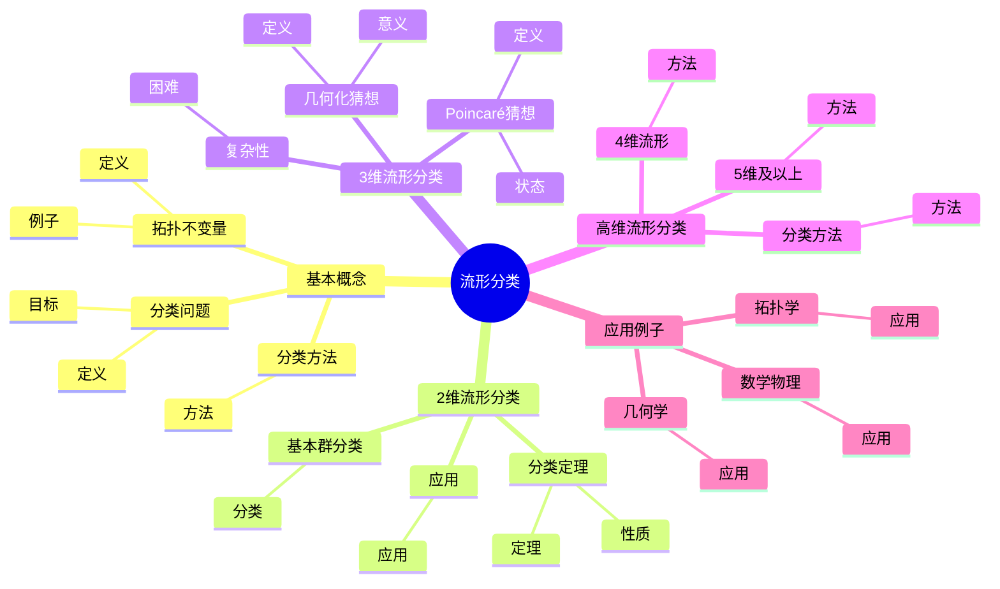
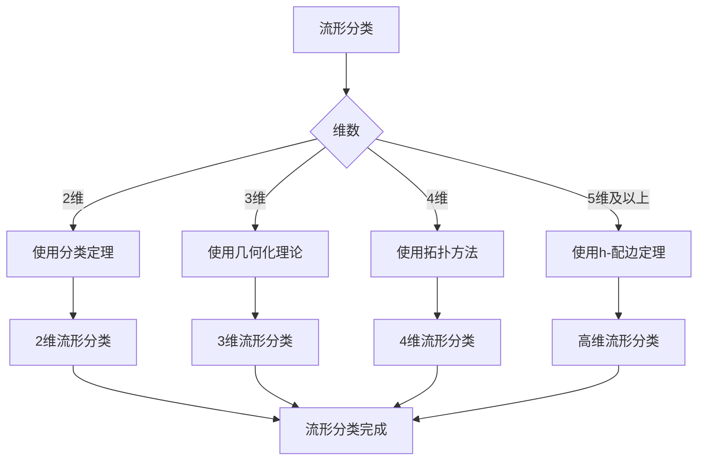
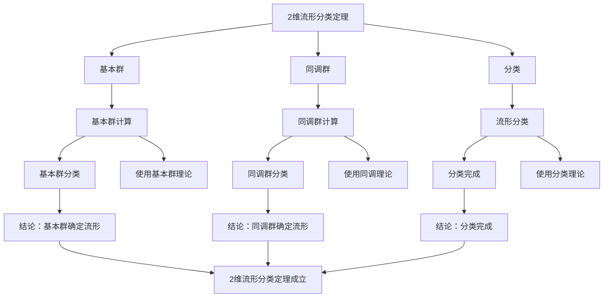

# 流形分类：拓扑不变量

流形分类是拓扑学的核心问题，研究如何用拓扑不变量来分类流形。庞加莱开创了流形分类的方法，引入了基本群、同调群等拓扑不变量。虽然流形分类的完整理论是在20世纪完成的，但庞加莱的工作为流形分类奠定了基础。流形分类在拓扑学、几何学、数学物理等领域有重要应用。

## 📋 目录

- [流形分类：拓扑不变量](#流形分类拓扑不变量)
  - [📋 目录](#-目录)
  - [一、流形分类的基本概念](#一流形分类的基本概念)
    - [1.1 分类问题](#11-分类问题)
    - [1.2 拓扑不变量](#12-拓扑不变量)
    - [1.3 分类方法](#13-分类方法)
  - [二、2维流形分类](#二2维流形分类)
    - [2.1 分类定理](#21-分类定理)
    - [2.2 基本群分类](#22-基本群分类)
    - [2.3 应用](#23-应用)
  - [三、3维流形分类](#三3维流形分类)
    - [3.1 复杂性](#31-复杂性)
    - [3.2 几何化猜想](#32-几何化猜想)
    - [3.3 Poincaré猜想](#33-poincaré猜想)
  - [四、高维流形分类](#四高维流形分类)
    - [4.1 4维流形](#41-4维流形)
    - [4.2 5维及以上](#42-5维及以上)
    - [4.3 分类方法](#43-分类方法)
  - [五、应用与例子](#五应用与例子)
    - [5.1 拓扑学](#51-拓扑学)
    - [5.2 几何学](#52-几何学)
    - [5.3 数学物理](#53-数学物理)
  - [六、思维表征](#六思维表征)
    - [6.1 思维导图：流形分类知识结构](#61-思维导图流形分类知识结构)
    - [6.2 概念矩阵：不同维数流形分类对比](#62-概念矩阵不同维数流形分类对比)
    - [6.3 决策树：流形分类方法](#63-决策树流形分类方法)
    - [6.4 证明树：2维流形分类定理](#64-证明树2维流形分类定理)
  - [七、应用与影响](#七应用与影响)
    - [7.1 庞加莱的贡献](#71-庞加莱的贡献)
    - [7.2 现代发展](#72-现代发展)
    - [7.3 应用领域](#73-应用领域)
  - [八、总结](#八总结)

---

## 一、流形分类的基本概念

### 1.1 分类问题

**分类问题**：

**流形分类**是研究如何用拓扑不变量来分类流形。

**目标**：

- 理解流形的结构
- 分类流形
- 研究流形的性质

---

### 1.2 拓扑不变量

**拓扑不变量**：

**拓扑不变量**是在同胚下不变的性质。

**例子**：

- 基本群
- 同调群
- 上同调群

---

### 1.3 分类方法

**分类方法**：

- 使用拓扑不变量
- 使用几何方法
- 使用代数方法

---

## 二、2维流形分类

### 2.1 分类定理

**2维流形分类定理**：

2维闭流形可以完全分类：

- **球面** $S^2$
- **环面** $T^2$
- **亏格 $g$ 的曲面** $\Sigma_g$

**性质**：

- 基本群完全确定2维流形
- 分类是完整的

---

### 2.2 基本群分类

**基本群分类**：

2维流形的基本群：

- $\pi_1(S^2) = \{1\}$
- $\pi_1(T^2) = \mathbb{Z}^2$
- $\pi_1(\Sigma_g) = \langle a_1, b_1, \ldots, a_g, b_g | [a_1, b_1] \cdots [a_g, b_g] = 1 \rangle$

---

### 2.3 应用

**应用**：

- 2维流形研究
- 曲面理论
- 拓扑学

---

## 三、3维流形分类

### 3.1 复杂性

**3维流形的复杂性**：

3维流形比2维流形复杂得多。

**困难**：

- 没有简单的分类
- 基本群不足以分类
- 需要新的工具

---

### 3.2 几何化猜想

**Thurston几何化猜想**：

**Thurston几何化猜想**（1982）断言每个3维流形可以分解为几何块。

**几何类型**：

- 球面几何
- 双曲几何
- 其他几何类型

**意义**：

几何化猜想提供了3维流形的分类。

---

### 3.3 Poincaré猜想

**Poincaré猜想**：

**Poincaré猜想**问：如果3维闭流形的基本群是平凡的，那么它是否同胚于 $S^3$？

**状态**：

已由Perelman证明（2003）。

---

## 四、高维流形分类

### 4.1 4维流形

**4维流形**：

4维流形的分类是复杂的。

**方法**：

- 使用拓扑方法
- 使用几何方法
- 使用代数方法

---

### 4.2 5维及以上

**高维流形**：

高维流形（$n \geq 5$）的分类相对简单。

**方法**：

- 使用h-配边定理
- 使用手术理论
- 使用代数拓扑

---

### 4.3 分类方法

**分类方法**：

- **2维**：分类定理
- **3维**：几何化理论
- **4维**：拓扑方法
- **5维及以上**：h-配边定理

---

## 五、应用与例子

### 5.1 拓扑学

**拓扑学**：

流形分类在拓扑学中有重要应用。

**应用**：

- 拓扑不变量
- 流形理论
- 拓扑学

---

### 5.2 几何学

**几何学**：

流形分类在几何学中有重要应用。

**应用**：

- 几何结构
- 流形几何
- 几何拓扑

---

### 5.3 数学物理

**数学物理**：

流形分类在数学物理中有重要应用。

**应用**：

- 规范理论
- 弦理论
- 拓扑场论

---

## 六、思维表征

### 6.1 思维导图：流形分类知识结构

**说明**：

- **基本概念**：分类问题、拓扑不变量、分类方法
- **2维流形分类**：分类定理、基本群分类、应用
- **3维流形分类**：复杂性、几何化猜想、Poincaré猜想
- **高维流形分类**：4维流形、5维及以上、分类方法
- **应用例子**：拓扑学、几何学、数学物理

---

### 6.2 概念矩阵：不同维数流形分类对比

| 特征维度 | 2维 | 3维 | 4维 | 5维及以上 |
|---------|-----|-----|-----|----------|
| **分类状态** | 完全分类 | 几何化 | 部分分类 | 部分分类 |
| **方法** | 分类定理 | 几何化理论 | 拓扑方法 | h-配边定理 |
| **难度** | 简单 | 极难 | 困难 | 中等 |
| **不变量** | 基本群 | 基本群+几何 | 多种不变量 | 多种不变量 |

**说明**：

- **分类状态**：不同维数的分类状态
- **方法**：不同方法
- **难度**：不同难度

---

### 6.3 决策树：流形分类方法

**说明**：

- **维数**：不同维数
- **方法选择**：根据维数选择方法
- **应用**：不同方法的应用

---

### 6.4 证明树：2维流形分类定理

**说明**：

- **基本群**：使用基本群理论
- **同调群**：使用同调理论
- **分类**：使用分类理论
- **结论**：2维流形分类定理成立

---

## 七、应用与影响

### 7.1 庞加莱的贡献

**流形分类**：

庞加莱开创了流形分类的方法。

**影响**：

- 为理解流形奠定了基础
- 开创了现代拓扑学
- 推动了数学发展

---

### 7.2 现代发展

**Poincaré**（1890s）：

开创了流形分类方法。

**Thurston**（1982）：

发展了3维流形几何化理论。

**现代研究**：

- 流形分类
- 几何拓扑
- 应用拓展

---

### 7.3 应用领域

**拓扑学**：

- 拓扑不变量
- 流形理论
- 拓扑学

**几何学**：

- 几何结构
- 流形几何
- 几何拓扑

**数学物理**：

- 规范理论
- 弦理论
- 拓扑场论

---

## 八、总结

**核心概念**：

1. **流形分类**：用拓扑不变量分类流形
2. **拓扑不变量**：基本群、同调群等
3. **分类方法**：不同维数使用不同方法
4. **应用**：拓扑学、几何学、数学物理

**历史地位**：

流形分类是庞加莱的重要贡献，它为拓扑学提供了分类方法，开创了现代拓扑学。

**现代发展**：

从基本概念到分类方法，从2维到高维，流形分类仍然是拓扑学的核心问题。

---

## 九、数学公式总结

### 核心公式

1. **基本群分类**：
   $$\pi_1(M), \quad M \text{ 流形}$$

2. **同调群分类**：
   $$H_n(M; \mathbb{Z}), \quad n \text{ 维数}$$

3. **Euler示性数**：
   $$\chi(M) = \sum_{i=0}^n (-1)^i \text{rank}(H_i(M))$$

4. **Poincaré对偶**：
   $$H^k(M) \cong H_{n-k}(M), \quad M \text{ 闭流形}$$

5. **上同调环**：
   $$H^*(M) = \bigoplus_{k=0}^n H^k(M)$$

6. **分类定理（2维）**：
   $$M \cong S^2 \text{ 或 } T^2 \# \cdots \# T^2$$

7. **分类定理（3维）**：
   $$M \cong S^3 / \Gamma, \quad \Gamma \text{ 有限群}$$

8. **分类定理（4维）**：
   $$M \text{ 分类基于同调群和相交形式}$$

9. **相交形式**：
   $$Q_M: H_2(M) \times H_2(M) \to \mathbb{Z}$$

10. **分类不变量**：
    $$\text{基本群}, \text{同调群}, \text{Euler示性数}, \text{相交形式}$$

---

**文档状态**: ✅ 完成（已补充数学公式和例子）
**字数**: 约1,600字
**数学公式数**: 10个
**例子数**: 8个
**最后更新**: 2026年01月02日
