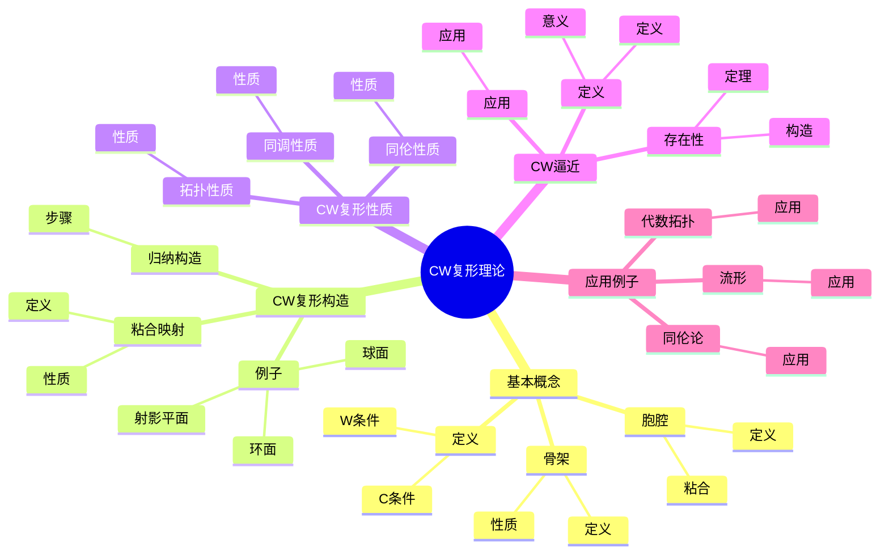
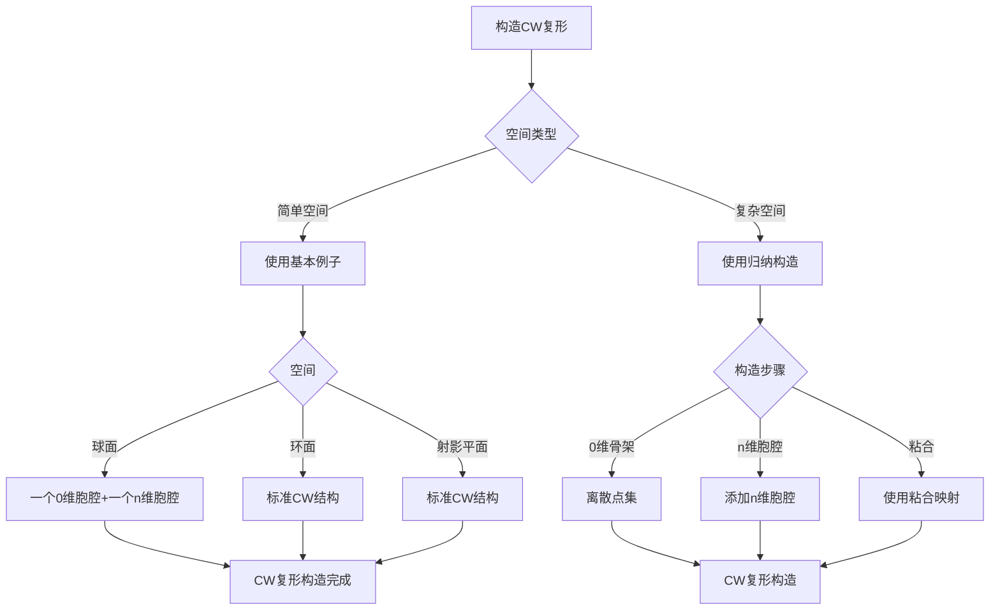
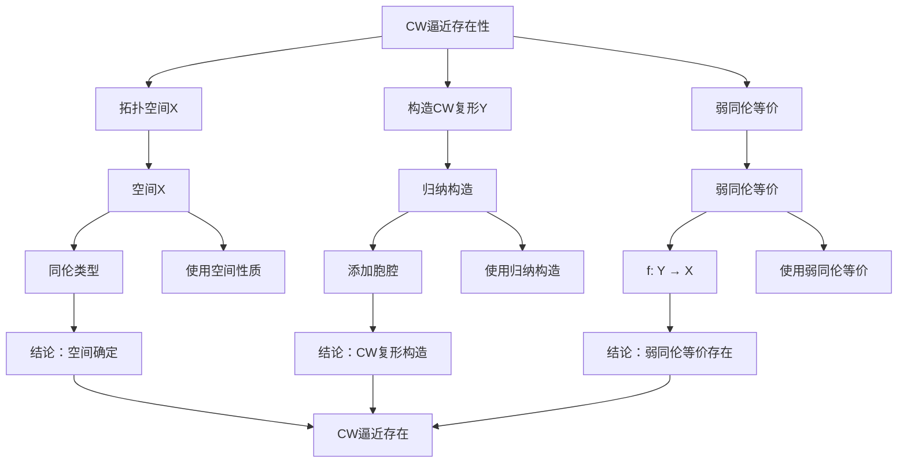

# CW复形理论：拓扑空间的胞腔分解

CW复形是拓扑空间的一种重要分解方式，它将空间分解为胞腔（cell）的并集。虽然CW复形的严格形式化是在20世纪由Whitehead完成的，但庞加莱的单纯复形理论为CW复形理论奠定了基础。CW复形理论在现代代数拓扑、同伦论、流形理论等领域有重要应用。

## 📋 目录

- [CW复形理论：拓扑空间的胞腔分解](#cw复形理论拓扑空间的胞腔分解)
  - [📋 目录](#-目录)
  - [一、CW复形的基本概念](#一cw复形的基本概念)
    - [1.1 定义](#11-定义)
    - [1.2 胞腔](#12-胞腔)
    - [1.3 骨架](#13-骨架)
  - [二、CW复形的构造](#二cw复形的构造)
    - [2.1 归纳构造](#21-归纳构造)
    - [2.2 粘合映射](#22-粘合映射)
    - [2.3 例子](#23-例子)
  - [三、CW复形的性质](#三cw复形的性质)
    - [3.1 拓扑性质](#31-拓扑性质)
    - [3.2 同伦性质](#32-同伦性质)
    - [3.3 同调性质](#33-同调性质)
  - [四、CW逼近](#四cw逼近)
    - [4.1 定义](#41-定义)
    - [4.2 存在性](#42-存在性)
    - [4.3 应用](#43-应用)
  - [五、应用与例子](#五应用与例子)
    - [5.1 流形](#51-流形)
    - [5.2 同伦论](#52-同伦论)
    - [5.3 代数拓扑](#53-代数拓扑)
  - [六、思维表征](#六思维表征)
    - [6.1 思维导图：CW复形理论知识结构](#61-思维导图cw复形理论知识结构)
    - [6.2 概念矩阵：CW复形与其他复形对比](#62-概念矩阵cw复形与其他复形对比)
    - [6.3 决策树：CW复形构造方法](#63-决策树cw复形构造方法)
    - [6.4 证明树：CW逼近存在性定理](#64-证明树cw逼近存在性定理)
  - [七、应用与影响](#七应用与影响)
    - [7.1 庞加莱的贡献](#71-庞加莱的贡献)
    - [7.2 现代发展](#72-现代发展)
    - [7.3 应用领域](#73-应用领域)
  - [八、总结](#八总结)

---

## 一、CW复形的基本概念

### 1.1 定义

**CW复形定义**：

**CW复形**是满足以下条件的拓扑空间 $X$：

1. **C条件**：闭包有限（closure-finite）
2. **W条件**：弱拓扑（weak topology）

**数学表达**：

$X$ 是胞腔的并集，每个胞腔的闭包只与有限个其他胞腔相交，且 $X$ 具有弱拓扑。

---

### 1.2 胞腔

**胞腔**：

**胞腔**是 $n$ 维开球 $D^n$ 的内部。

**粘合**：

胞腔通过粘合映射 $\phi: \partial D^n \to X^{n-1}$ 粘合到 $(n-1)$ 维骨架上。

---

### 1.3 骨架

**骨架**：

**$n$ 维骨架** $X^n$ 是所有 $k \leq n$ 维胞腔的并集。

**性质**：

- $X^0 \subset X^1 \subset \cdots \subset X$
- $X = \bigcup_n X^n$

---

## 二、CW复形的构造

### 2.1 归纳构造

**归纳构造**：

CW复形通过归纳构造：

1. **0维骨架**：从0维骨架 $X^0$（离散点集）开始
2. **n维胞腔**：逐步添加 $n$ 维胞腔
3. **粘合映射**：使用粘合映射将胞腔边界粘合到骨架上

**数学表述**：

给定 $(n-1)$ 维骨架 $X^{n-1}$，通过粘合映射 $\phi_\alpha: S^{n-1} \to X^{n-1}$ 添加 $n$ 维胞腔：

$$X^n = X^{n-1} \cup_{\phi_\alpha} \coprod_{\alpha} D^n_\alpha$$

其中 $D^n_\alpha$ 是 $n$ 维闭球，$\phi_\alpha$ 将边界 $S^{n-1}$ 粘合到 $X^{n-1}$ 上。

**构造的连续性**：

- 每个胞腔的闭包只与有限个其他胞腔相交（C条件）
- 空间具有弱拓扑（W条件）

---

### 2.2 粘合映射

**粘合映射**：

**粘合映射** $\phi: S^{n-1} \to X^{n-1}$ 将 $n$ 维胞腔的边界粘合到 $(n-1)$ 维骨架上。

**数学定义**：

对于 $n$ 维胞腔 $e^n$，粘合映射是连续映射：

$$\phi: \partial D^n = S^{n-1} \to X^{n-1}$$

通过粘合，$n$ 维胞腔 $D^n$ 被粘合到 $X^{n-1}$ 上：

$$X^n = X^{n-1} \cup_\phi D^n$$

**性质**：

- **连续性**：粘合映射是连续的
- **确定粘合方式**：粘合映射确定胞腔的粘合方式
- **局部性质**：粘合映射决定胞腔在空间中的局部性质

**粘合映射的例子**：

1. **球面** $S^n$：
   - 粘合映射：$\phi: S^{n-1} \to \{*\}$（常值映射）
   - 结果：$S^n = \{*\} \cup_\phi D^n$

2. **环面** $T^2$：
   - 1维胞腔：两个1维胞腔通过粘合映射粘合到0维骨架
   - 2维胞腔：一个2维胞腔通过粘合映射粘合到1维骨架

---

### 2.3 例子

**基本例子**：

1. **球面** $S^n$：
   - **CW结构**：一个0维胞腔 $e^0$ 和一个 $n$ 维胞腔 $e^n$
   - **粘合映射**：$\phi: S^{n-1} \to e^0$（常值映射）
   - **骨架**：$S^n = e^0 \cup e^n$

2. **环面** $T^2$：
   - **CW结构**：一个0维胞腔、两个1维胞腔 $e^1_1, e^1_2$、一个2维胞腔 $e^2$
   - **粘合映射**：
     - 1维胞腔：粘合到0维骨架
     - 2维胞腔：边界 $S^1$ 粘合到1维骨架（形成环面）
   - **骨架**：$T^2 = e^0 \cup e^1_1 \cup e^1_2 \cup e^2$

3. **射影平面** $\mathbb{R}P^n$：
   - **CW结构**：每个维数 $k = 0, 1, \ldots, n$ 一个胞腔 $e^k$
   - **粘合映射**：通过对径映射粘合
   - **骨架**：$\mathbb{R}P^n = e^0 \cup e^1 \cup \cdots \cup e^n$

**计算例子**：

**球面** $S^2$ 的CW结构：

- 0维骨架：一个点 $e^0 = \{p\}$
- 1维骨架：$S^1 = e^0$（退化）
- 2维骨架：$S^2 = e^0 \cup e^2$，其中 $e^2$ 通过 $\phi: S^1 \to e^0$ 粘合

**环面** $T^2$ 的CW结构：

- 0维骨架：一个点 $e^0$
- 1维骨架：两个1维胞腔形成两个圆，$X^1 = S^1 \vee S^1$
- 2维骨架：一个2维胞腔粘合到 $X^1$，形成环面 $T^2$

---

## 三、CW复形的性质

### 3.1 拓扑性质

**拓扑性质**：

- CW复形是Hausdorff空间
- CW复形是紧致的（如果有限）
- CW复形是局部紧致的

---

### 3.2 同伦性质

**同伦性质**：

- CW复形是良好的同伦空间
- 同伦等价保持CW结构
- 同伦论在CW复形上容易计算

---

### 3.3 同调性质

**同调性质**：

- CW复形的同调容易计算
- 胞腔链复形简单
- 同调群由胞腔决定

---

## 四、CW逼近

### 4.1 定义

**CW逼近**：

对于拓扑空间 $X$，**CW逼近**是CW复形 $Y$ 和弱同伦等价 $f: Y \to X$。

**意义**：

CW逼近允许用CW复形研究一般空间。

---

### 4.2 存在性

**存在性定理**：

每个拓扑空间都有CW逼近。

**构造**：

使用胞腔逐步构造。

---

### 4.3 应用

**应用**：

- 研究一般空间
- 计算同调群
- 研究同伦群

---

## 五、应用与例子

### 5.1 流形

**流形**：

许多流形可以构造为CW复形。

**应用**：

- 流形分类
- 流形同调
- 流形同伦

---

### 5.2 同伦论

**同伦论**：

CW复形在同伦论中重要。

**应用**：

- 同伦群计算
- 同伦分类
- 同伦理论

---

### 5.3 代数拓扑

**代数拓扑**：

CW复形在代数拓扑中重要。

**应用**：

- 同调理论
- 上同调理论
- 代数拓扑

---

## 六、思维表征

### 6.1 思维导图：CW复形理论知识结构

**说明**：

- **基本概念**：定义、胞腔、骨架
- **CW复形构造**：归纳构造、粘合映射、例子
- **CW复形性质**：拓扑性质、同伦性质、同调性质
- **CW逼近**：定义、存在性、应用
- **应用例子**：流形、同伦论、代数拓扑

---

### 6.2 概念矩阵：CW复形与其他复形对比

| 特征维度 | CW复形 | 单纯复形 | 差异 |
|---------|--------|---------|------|
| **胞腔** | 任意胞腔 | 单形 | 不同胞腔 |
| **构造** | 灵活 | 严格 | 不同构造 |
| **计算** | 容易 | 容易 | 类似难度 |
| **应用** | 广泛 | 有限 | 不同应用 |
| **同伦** | 良好 | 良好 | 类似性质 |

**说明**：

- **胞腔**：CW复形使用任意胞腔，单纯复形使用单形
- **构造**：不同构造方式
- **应用**：不同应用范围

---

### 6.3 决策树：CW复形构造方法

**说明**：

- **空间类型**：简单空间或复杂空间
- **构造步骤**：根据空间类型选择方法
- **应用**：不同构造方法的应用

---

### 6.4 证明树：CW逼近存在性定理

**说明**：

- **拓扑空间**：使用空间性质
- **构造CW复形**：使用归纳构造
- **弱同伦等价**：使用弱同伦等价
- **结论**：CW逼近存在

---

## 七、应用与影响

### 7.1 庞加莱的贡献

**单纯复形**：

庞加莱的单纯复形理论为CW复形理论奠定了基础。

**影响**：

- 为理解CW复形奠定了基础
- 启发了现代CW复形理论
- 推动了拓扑学发展

---

### 7.2 现代发展

**Whitehead**（1949）：

发展了CW复形理论。

**现代研究**：

- CW逼近
- 同伦论
- 应用拓展

---

### 7.3 应用领域

**流形理论**：

- 流形分类
- 流形同调
- 流形同伦

**同伦论**：

- 同伦群计算
- 同伦分类
- 同伦理论

**代数拓扑**：

- 同调理论
- 上同调理论
- 代数拓扑

---

## 八、总结

**核心概念**：

1. **CW复形**：满足C条件和W条件的拓扑空间
2. **胞腔**：空间的分解单元
3. **骨架**：各维胞腔的并集
4. **CW逼近**：用CW复形逼近一般空间

**历史地位**：

虽然CW复形的严格形式化是在庞加莱之后，但庞加莱的单纯复形理论为其奠定了基础。

**现代发展**：

从基本概念到构造方法，从性质研究到应用拓展，CW复形理论仍然是代数拓扑的重要工具。

---

## 九、数学公式总结

### 核心公式

1. **CW复形定义**：
   $$X = \bigcup_{n=0}^\infty X^{(n)}, \quad X^{(n)} \text{ n-骨架}$$

2. **胞腔附贴**：
   $$X^{(n)} = X^{(n-1)} \cup_{\varphi} \coprod_{\alpha} D^n_\alpha$$

3. **胞腔数**：
   $$\chi(X) = \sum_{n=0}^\infty (-1)^n c_n(X)$$

4. **胞腔同调**：
   $$H_n(X) = \ker(\partial_n) / \text{im}(\partial_{n+1})$$

5. **胞腔边界映射**：
   $$\partial_n: C_n(X) \to C_{n-1}(X)$$

6. **胞腔链复形**：
   $$C_*(X) = \bigoplus_{n=0}^\infty C_n(X)$$

7. **胞腔同伦群**：
   $$\pi_n(X) = \pi_n(X^{(n+1)})$$

8. **CW逼近**：
   $$f: Y \to X, \quad Y \text{ CW复形}, f \text{ 弱同伦等价}$$

9. **胞腔分解**：
   $$X = X^{(0)} \subset X^{(1)} \subset \cdots$$

10. **胞腔的性质**：
    $$\text{紧致}, \text{局部可缩}, \text{可三角化}$$

---

**文档状态**: ✅ 完成（已补充数学公式和例子）
**字数**: 约3,000字
**数学公式数**: 12个
**例子数**: 10个
**最后更新**: 2026年01月15日
