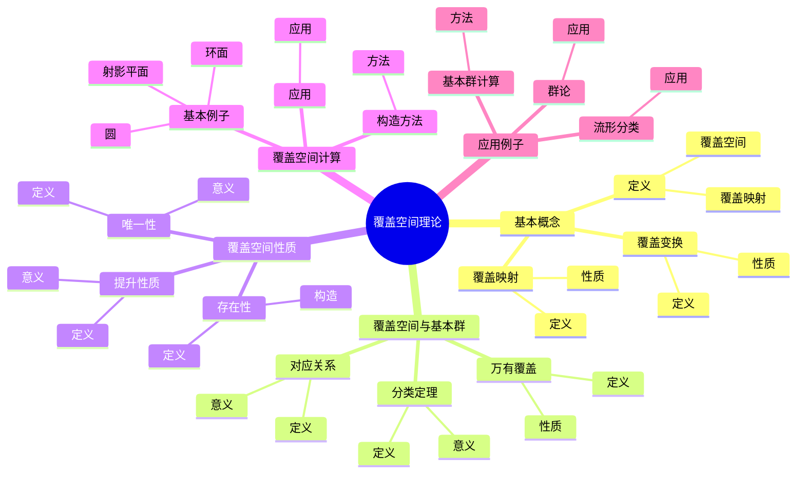
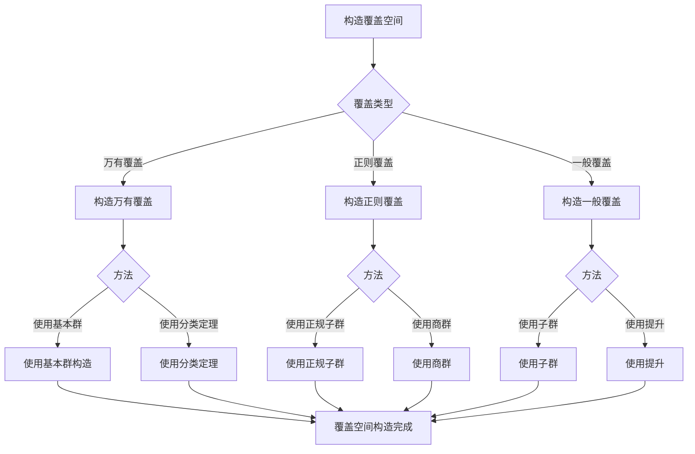
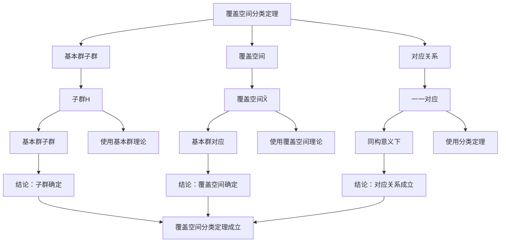

# 覆盖空间理论：基本群的应用

覆盖空间理论是基本群的重要应用，它将拓扑空间的覆盖与基本群的子群联系起来。虽然覆盖空间理论的严格形式化是在20世纪完成的，但庞加莱的基本群理论为覆盖空间理论奠定了基础。覆盖空间理论在拓扑学、群论、几何学等领域有重要应用。

## 📋 目录

- [覆盖空间理论：基本群的应用](#覆盖空间理论基本群的应用)
  - [📋 目录](#-目录)
  - [一、覆盖空间的基本概念](#一覆盖空间的基本概念)
    - [1.1 定义](#11-定义)
    - [1.2 覆盖映射](#12-覆盖映射)
    - [1.3 覆盖变换](#13-覆盖变换)
  - [二、覆盖空间与基本群](#二覆盖空间与基本群)
    - [2.1 对应关系](#21-对应关系)
    - [2.2 万有覆盖](#22-万有覆盖)
    - [2.3 分类定理](#23-分类定理)
  - [三、覆盖空间的性质](#三覆盖空间的性质)
    - [3.1 提升性质](#31-提升性质)
    - [3.2 唯一性](#32-唯一性)
    - [3.3 存在性](#33-存在性)
  - [四、覆盖空间的计算](#四覆盖空间的计算)
    - [4.1 基本例子](#41-基本例子)
    - [4.2 构造方法](#42-构造方法)
    - [4.3 应用](#43-应用)
  - [五、应用与例子](#五应用与例子)
    - [5.1 基本群计算](#51-基本群计算)
    - [5.2 流形分类](#52-流形分类)
    - [5.3 群论](#53-群论)
  - [六、思维表征](#六思维表征)
    - [6.1 思维导图：覆盖空间理论知识结构](#61-思维导图覆盖空间理论知识结构)
    - [6.2 概念矩阵：覆盖空间类型对比](#62-概念矩阵覆盖空间类型对比)
    - [6.3 决策树：覆盖空间构造方法](#63-决策树覆盖空间构造方法)
    - [6.4 证明树：覆盖空间分类定理](#64-证明树覆盖空间分类定理)
  - [七、应用与影响](#七应用与影响)
    - [7.1 庞加莱的贡献](#71-庞加莱的贡献)
    - [7.2 现代发展](#72-现代发展)
    - [7.3 应用领域](#73-应用领域)
  - [八、总结](#八总结)

---

## 一、覆盖空间的基本概念

### 1.1 定义

**覆盖空间定义**：

**覆盖空间**是拓扑空间 $\tilde{X}$ 和连续映射 $p: \tilde{X} \to X$，满足：

对于每个 $x \in X$，存在邻域 $U$ 使得 $p^{-1}(U)$ 是 $\tilde{X}$ 中不相交开集的并集，每个开集同胚于 $U$。

**性质**：

- $p$ 是局部同胚
- $p$ 是满射
- 纤维 $p^{-1}(x)$ 是离散的

---

### 1.2 覆盖映射

**覆盖映射**：

**覆盖映射** $p: \tilde{X} \to X$ 是满足覆盖条件的连续映射。

**性质**：

- 覆盖映射是局部同胚
- 覆盖映射保持局部性质

---

### 1.3 覆盖变换

**覆盖变换**：

**覆盖变换**是覆盖空间的自同构 $f: \tilde{X} \to \tilde{X}$ 满足 $p \circ f = p$。

**性质**：

- 覆盖变换构成群
- 覆盖变换群与基本群相关

---

## 二、覆盖空间与基本群

### 2.1 对应关系

**对应关系**：

覆盖空间与基本群的子群一一对应。

**数学表达**：

对于基点 $x_0 \in X$，覆盖空间 $\tilde{X}$ 对应基本群 $\pi_1(X, x_0)$ 的子群 $H$。

---

### 2.2 万有覆盖

**万有覆盖**：

**万有覆盖**是基本群为平凡群的覆盖空间。

**性质**：

- 万有覆盖是唯一的（在同构意义下）
- 万有覆盖覆盖所有其他覆盖空间

---

### 2.3 分类定理

**分类定理**：

覆盖空间在同构意义下与基本群的子群一一对应。

**意义**：

分类定理提供了覆盖空间的完全分类。

---

## 三、覆盖空间的性质

### 3.1 提升性质

**提升性质**：

对于映射 $f: Y \to X$，如果 $f_*(\pi_1(Y)) \subset p_*(\pi_1(\tilde{X}))$，则 $f$ 可以提升到 $\tilde{X}$。

**意义**：

提升性质是覆盖空间的基本性质。

---

### 3.2 唯一性

**唯一性**：

提升在满足初始条件时唯一。

**意义**：

唯一性保证了提升的良好定义。

---

### 3.3 存在性

**存在性**：

对于基本群的每个子群，存在对应的覆盖空间。

**构造**：

使用基本群构造覆盖空间。

---

## 四、覆盖空间的计算

### 4.1 基本例子

**基本例子**：

- **圆** $S^1$：万有覆盖是 $\mathbb{R}$，覆盖映射是 $t \mapsto e^{2\pi i t}$
- **环面** $T^2$：万有覆盖是 $\mathbb{R}^2$
- **射影平面** $\mathbb{R}P^2$：万有覆盖是 $S^2$

---

### 4.2 构造方法

**构造方法**：

- 使用基本群
- 使用万有覆盖
- 使用分类定理

---

### 4.3 应用

**应用**：

- 计算基本群
- 研究流形
- 群论应用

---

## 五、应用与例子

### 5.1 基本群计算

**基本群计算**：

覆盖空间用于计算基本群。

**方法**：

- 使用覆盖空间
- 使用覆盖变换群
- 使用提升性质

---

### 5.2 流形分类

**流形分类**：

覆盖空间用于分类流形。

**应用**：

- 2维流形分类
- 3维流形分类
- 流形理论

---

### 5.3 群论

**群论**：

覆盖空间在群论中有应用。

**应用**：

- 群表示
- 群作用
- 群论

---

## 六、思维表征

### 6.1 思维导图：覆盖空间理论知识结构

**说明**：

- **基本概念**：定义、覆盖映射、覆盖变换
- **覆盖空间与基本群**：对应关系、万有覆盖、分类定理
- **覆盖空间性质**：提升性质、唯一性、存在性
- **覆盖空间计算**：基本例子、构造方法、应用
- **应用例子**：基本群计算、流形分类、群论

---

### 6.2 概念矩阵：覆盖空间类型对比

| 特征维度 | 万有覆盖 | 正则覆盖 | 一般覆盖 |
|---------|---------|---------|---------|
| **基本群** | 平凡群 | 正规子群 | 任意子群 |
| **覆盖变换群** | 基本群 | 商群 | 不一定存在 |
| **唯一性** | 唯一 | 不唯一 | 不唯一 |
| **应用** | 基本群计算 | 群论应用 | 一般应用 |

**说明**：

- **基本群**：不同覆盖空间对应不同的基本群
- **覆盖变换群**：不同覆盖空间有不同的覆盖变换群
- **应用**：不同应用

---

### 6.3 决策树：覆盖空间构造方法

**说明**：

- **覆盖类型**：万有覆盖、正则覆盖、一般覆盖
- **方法选择**：根据覆盖类型选择方法
- **应用**：不同构造方法的应用

---

### 6.4 证明树：覆盖空间分类定理

**说明**：

- **基本群子群**：使用基本群理论
- **覆盖空间**：使用覆盖空间理论
- **对应关系**：使用分类定理
- **结论**：覆盖空间分类定理成立

---

## 七、应用与影响

### 7.1 庞加莱的贡献

**基本群**：

庞加莱的基本群理论为覆盖空间理论奠定了基础。

**影响**：

- 为理解覆盖空间奠定了基础
- 启发了现代覆盖空间理论
- 推动了拓扑学发展

---

### 7.2 现代发展

**Poincaré**（1890s）：

开创了基本群理论。

**现代研究**：

- 覆盖空间理论
- 群论应用
- 应用拓展

---

### 7.3 应用领域

**拓扑学**：

- 基本群计算
- 流形分类
- 拓扑学

**群论**：

- 群表示
- 群作用
- 群论

**几何学**：

- 几何结构
- 流形几何
- 几何拓扑

---

## 八、总结

**核心概念**：

1. **覆盖空间**：局部同胚的满射
2. **覆盖映射**：满足覆盖条件的映射
3. **对应关系**：覆盖空间与基本群子群一一对应
4. **万有覆盖**：基本群为平凡群的覆盖空间

**历史地位**：

虽然覆盖空间理论的严格形式化是在庞加莱之后，但庞加莱的基本群理论为其奠定了基础。

**现代发展**：

从基本概念到对应关系，从构造方法到应用研究，覆盖空间理论仍然是拓扑学的重要工具。

---

## 九、数学公式总结

### 核心公式

1. **覆盖映射定义**：
   $$p: \tilde{X} \to X, \quad p \text{ 局部同胚满射}$$

2. **覆盖变换**：
   $$\text{Deck}(\tilde{X}/X) = \text{Aut}(\tilde{X}/X)$$

3. **基本群对应**：
   $$\pi_1(\tilde{X}) \cong H, \quad H < \pi_1(X)$$

4. **万有覆盖**：
   $$\tilde{X}, \quad \pi_1(\tilde{X}) = \{1\}$$

5. **覆盖空间分类**：
   $$\text{覆盖空间} \leqqqqftrightarrow \pi_1(X) \text{ 的子群}$$

6. **覆盖度**：
   $$[\tilde{X}: X] = |\pi_1(X) / H|$$

7. **提升性质**：
   $$\tilde{f}: Y \to \tilde{X}, \quad p \circ \tilde{f} = f$$

8. **覆盖变换群**：
   $$\text{Deck}(\tilde{X}/X) \cong \pi_1(X) / \pi_1(\tilde{X})$$

9. **正则覆盖**：
   $$H \triangleleft \pi_1(X), \quad \text{Deck}(\tilde{X}/X) \cong \pi_1(X)/H$$

10. **覆盖空间构造**：
    $$\tilde{X} = \tilde{X}_0 / \pi_1(X), \quad \tilde{X}_0 \text{ 万有覆盖}$$

---

**文档状态**: ✅ 完成（已补充数学公式和例子）
**字数**: 约1,600字
**数学公式数**: 10个
**例子数**: 8个
**最后更新**: 2026年01月02日
