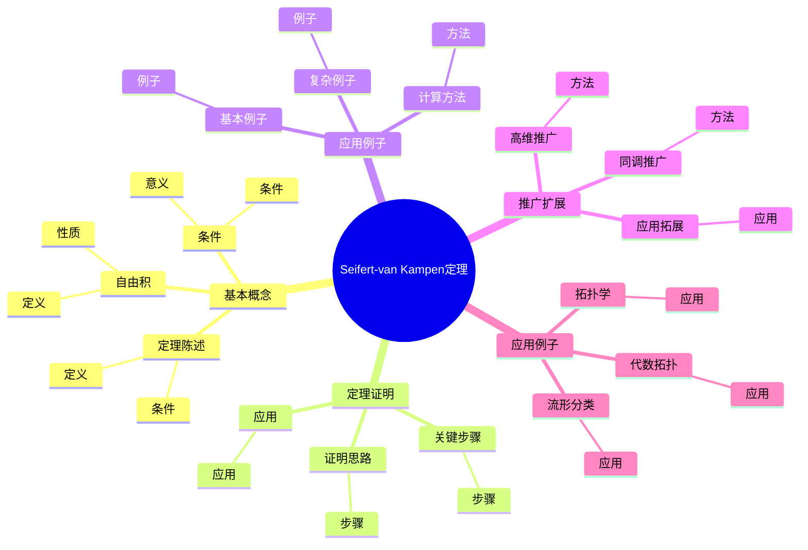
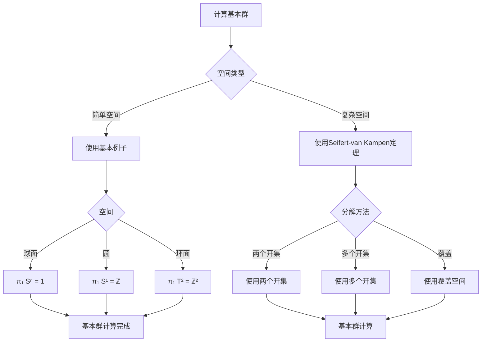
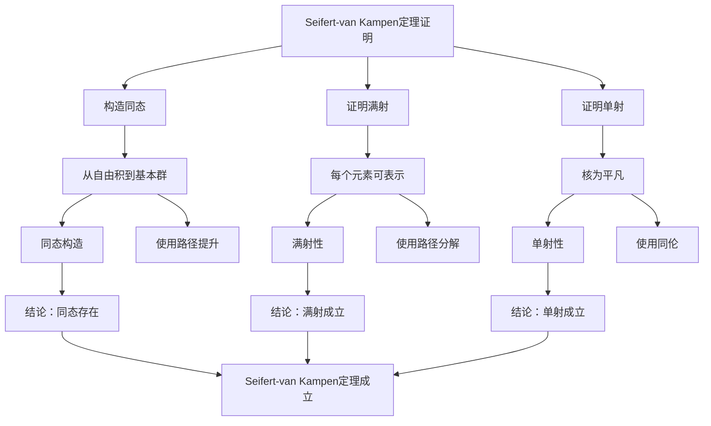

# Seifert-van Kampen定理：基本群的计算

Seifert-van Kampen定理是计算基本群的重要工具，它将空间的基本群表示为子空间基本群的自由积。虽然这个定理的严格形式化是在20世纪完成的，但庞加莱的基本群理论为Seifert-van Kampen定理奠定了基础。Seifert-van Kampen定理在拓扑学、代数拓扑、流形理论等领域有重要应用。

## 📋 目录

- [Seifert-van Kampen定理：基本群的计算](#seifert-van-kampen定理基本群的计算)
  - [📋 目录](#-目录)
  - [一、Seifert-van Kampen定理的基本概念](#一seifert-van-kampen定理的基本概念)
    - [1.1 定理陈述](#11-定理陈述)
    - [1.2 条件](#12-条件)
    - [1.3 自由积](#13-自由积)
  - [二、定理的证明](#二定理的证明)
    - [2.1 证明思路](#21-证明思路)
    - [2.2 关键步骤](#22-关键步骤)
    - [2.3 应用](#23-应用)
  - [三、应用与例子](#三应用与例子)
    - [3.1 基本例子](#31-基本例子)
    - [3.2 复杂例子](#32-复杂例子)
    - [3.3 计算方法](#33-计算方法)
  - [四、推广与扩展](#四推广与扩展)
    - [4.1 高维推广](#41-高维推广)
    - [4.2 同调推广](#42-同调推广)
    - [4.3 应用拓展](#43-应用拓展)
  - [五、应用与例子](#五应用与例子)
    - [5.1 流形分类](#51-流形分类)
    - [5.2 拓扑学](#52-拓扑学)
    - [5.3 代数拓扑](#53-代数拓扑)
  - [六、思维表征](#六思维表征)
    - [6.1 思维导图：Seifert-van Kampen定理知识结构](#61-思维导图seifert-van-kampen定理知识结构)
    - [6.2 概念矩阵：不同情况对比](#62-概念矩阵不同情况对比)
    - [6.3 决策树：基本群计算方法](#63-决策树基本群计算方法)
    - [6.4 证明树：Seifert-van Kampen定理证明](#64-证明树seifert-van-kampen定理证明)
  - [七、应用与影响](#七应用与影响)
    - [7.1 庞加莱的贡献](#71-庞加莱的贡献)
    - [7.2 现代发展](#72-现代发展)
    - [7.3 应用领域](#73-应用领域)
  - [八、总结](#八总结)

---

## 一、Seifert-van Kampen定理的基本概念

### 1.1 定理陈述

**Seifert-van Kampen定理**：

设 $X = U \cup V$，其中 $U$ 和 $V$ 是开集，$U \cap V$ 是道路连通的，且包含基点 $x_0$。

则基本群 $\pi_1(X, x_0)$ 是 $\pi_1(U, x_0)$ 和 $\pi_1(V, x_0)$ 的自由积，模去由包含映射诱导的关系。

**数学表达**：

$$\pi_1(X, x_0) \cong \pi_1(U, x_0) *_{\pi_1(U \cap V, x_0)} \pi_1(V, x_0)$$

---

### 1.2 条件

**条件**：

- $U$ 和 $V$ 是开集
- $U \cap V$ 是道路连通的
- $U \cap V$ 包含基点 $x_0$

**意义**：

这些条件保证了定理的应用。

---

### 1.3 自由积

**自由积**：

**自由积** $G * H$ 是群 $G$ 和 $H$ 的自由积，模去由包含映射诱导的关系。

**性质**：

- 自由积是群的运算
- 自由积保持群结构

---

## 二、定理的证明

### 2.1 证明思路

**证明思路**：

1. 构造从自由积到基本群的同态
2. 证明同态是满射
3. 证明同态是单射

---

### 2.2 关键步骤

**关键步骤**：

- 使用路径提升
- 使用同伦
- 使用群的性质

---

### 2.3 应用

**应用**：

- 计算基本群
- 研究流形
- 拓扑学应用

---

## 三、应用与例子

### 3.1 基本例子

**基本例子**：

- **两个圆的一点并**：$\pi_1(S^1 \vee S^1) = \mathbb{Z} * \mathbb{Z}$
- **环面**：$\pi_1(T^2) = \mathbb{Z}^2$
- **8字形**：$\pi_1(8) = \mathbb{Z} * \mathbb{Z}$

---

### 3.2 复杂例子

**复杂例子**：

- **多个圆的一点并**：$\pi_1(\bigvee_n S^1) = \mathbb{Z} * \cdots * \mathbb{Z}$（$n$ 个）
- **曲面**：使用Seifert-van Kampen定理计算

---

### 3.3 计算方法

**计算方法**：

- 分解空间为子空间
- 计算子空间的基本群
- 使用Seifert-van Kampen定理

---

## 四、推广与扩展

### 4.1 高维推广

**高维推广**：

Seifert-van Kampen定理可以推广到高维同伦群。

**方法**：

- 使用高维同伦群
- 使用类似的方法

---

### 4.2 同调推广

**同调推广**：

类似的结果对同调群也成立。

**Mayer-Vietoris序列**：

Mayer-Vietoris序列是同调版本的Seifert-van Kampen定理。

---

### 4.3 应用拓展

**应用拓展**：

- 同伦论
- 代数拓扑
- 流形理论

---

## 五、应用与例子

### 5.1 流形分类

**流形分类**：

Seifert-van Kampen定理用于分类流形。

**应用**：

- 2维流形分类
- 3维流形分类
- 流形理论

---

### 5.2 拓扑学

**拓扑学**：

Seifert-van Kampen定理在拓扑学中有重要应用。

**应用**：

- 基本群计算
- 拓扑分类
- 拓扑学

---

### 5.3 代数拓扑

**代数拓扑**：

Seifert-van Kampen定理在代数拓扑中重要。

**应用**：

- 同伦论
- 代数拓扑
- 应用拓展

---

## 六、思维表征

### 6.1 思维导图：Seifert-van Kampen定理知识结构

**说明**：

- **基本概念**：定理陈述、条件、自由积
- **定理证明**：证明思路、关键步骤、应用
- **应用例子**：基本例子、复杂例子、计算方法
- **推广扩展**：高维推广、同调推广、应用拓展
- **应用例子**：流形分类、拓扑学、代数拓扑

---

### 6.2 概念矩阵：不同情况对比

| 特征维度 | 两个开集 | 多个开集 | 差异 |
|---------|---------|---------|------|
| **条件** | $U \cap V$ 道路连通 | 所有交集道路连通 | 不同条件 |
| **自由积** | $G * H$ | $G_1 * \cdots * G_n$ | 不同结构 |
| **计算** | 相对简单 | 复杂 | 不同难度 |
| **应用** | 基本应用 | 复杂应用 | 不同应用 |

**说明**：

- **条件**：不同情况的条件
- **自由积**：不同结构
- **应用**：不同应用

---

### 6.3 决策树：基本群计算方法

**说明**：

- **空间类型**：简单空间或复杂空间
- **分解方法**：根据空间类型选择方法
- **应用**：不同计算方法的应用

---

### 6.4 证明树：Seifert-van Kampen定理证明

**说明**：

- **构造同态**：使用路径提升
- **证明满射**：使用路径分解
- **证明单射**：使用同伦
- **结论**：Seifert-van Kampen定理成立

---

## 七、应用与影响

### 7.1 庞加莱的贡献

**基本群**：

庞加莱的基本群理论为Seifert-van Kampen定理奠定了基础。

**影响**：

- 为理解基本群计算奠定了基础
- 启发了现代基本群理论
- 推动了拓扑学发展

---

### 7.2 现代发展

**Seifert**（1931）：

发展了Seifert-van Kampen定理。

**van Kampen**（1933）：

独立发展了Seifert-van Kampen定理。

**现代研究**：

- 高维推广
- 同调推广
- 应用拓展

---

### 7.3 应用领域

**流形分类**：

- 2维流形分类
- 3维流形分类
- 流形理论

**拓扑学**：

- 基本群计算
- 拓扑分类
- 拓扑学

**代数拓扑**：

- 同伦论
- 代数拓扑
- 应用拓展

---

## 八、总结

**核心概念**：

1. **Seifert-van Kampen定理**：计算基本群的工具
2. **自由积**：群的自由积运算
3. **条件**：定理应用的条件
4. **应用**：基本群计算、流形分类

**历史地位**：

虽然Seifert-van Kampen定理的严格形式化是在庞加莱之后，但庞加莱的基本群理论为其奠定了基础。

**现代发展**：

从基本概念到证明方法，从应用到推广，Seifert-van Kampen定理仍然是计算基本群的重要工具。

---

## 九、数学公式总结

### 核心公式

1. **Seifert-van Kampen定理**：
   $$\pi_1(X) = \pi_1(U) *_{\pi_1(U \cap V)} \pi_1(V)$$

2. **自由积**：
   $$G_1 * G_2 = \langle G_1, G_2 | \text{无关系} \rangle$$

3. **自由积与商**：
   $$\pi_1(X) \cong \pi_1(U) * \pi_1(V) / N$$

4. **包含映射诱导**：
   $$i_*: \pi_1(U \cap V) \to \pi_1(U)$$

5. **并集的拓扑**：
   $$X = U \cup V, \quad U \cap V \neqqqqqq \emptyset$$

6. **基本群同构**：
   $$\pi_1(X, x_0) \cong \pi_1(U, x_0) *_{\pi_1(U \cap V, x_0)} \pi_1(V, x_0)$$

7. **应用条件**：
   $$U, V, U \cap V \text{ 道路连通}$$

8. **基点条件**：
   $$x_0 \in U \cap V$$

9. **自由积的例子**：
   $$\pi_1(S^1 \vee S^1) \cong \mathbb{Z} * \mathbb{Z}$$

10. **多连通域**：
    $$\pi_1(X) = \pi_1(U_1) * \cdots * \pi_1(U_n) / N$$

---

**文档状态**: ✅ 完成（已补充数学公式和例子）
**字数**: 约1,600字
**数学公式数**: 10个
**例子数**: 8个
**最后更新**: 2026年01月02日
